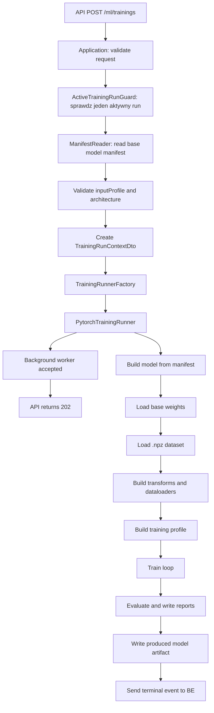

# UC-06 ML - Architektura generycznego runnera treningowego

## 1) Cel dokumentu
- Ten dokument doprecyzowuje architekturę implementacji realnego treningu po stronie `ML` dla `UC-06`.
- Celem jest zastąpienie dynamicznego mocka treningowego generycznym runnerem PyTorch, który obsłuży zarówno własny `CNN`, jak i modele `ResNet` / transfer learning bez tworzenia osobnych workflow treningowych.
- Dokument nie zmienia odpowiedzialności systemowych z `UC-06`: `BE` pozostaje `source of truth` dla runów, modeli i statusów, a `ML` wykonuje techniczny trening, zapisuje artefakty i raportuje eventy do `BE`.
- Dokument ma być podstawą do późniejszego planu implementacyjnego dla pełnego treningu.

## 2) Decyzja architektoniczna
- Nie tworzymy osobnych endpointów ani osobnych ścieżek aplikacyjnych typu `trainCnn`, `trainResNet`, `trainTransferLearning`.
- Tworzymy jeden workflow `POST /ml/trainings`, jeden worker runu i jeden generyczny loop treningowy PyTorch.
- Ta architektura nie zmienia kontraktu `BE -> ML`. Endpoint przyjmuje aktualny kontrakt `StartTrainingRunApiEntry` z `UC-06`, a dopiero warstwa aplikacyjna mapuje go na wewnętrzny `TrainingRunContextDto` używany przez runner.
- Różnice między architekturami modelu zamykamy w adapterach:
  - fabryka modelu buduje właściwy `torch.nn.Module` z manifestu,
  - fabryka transformacji wejścia dobiera preprocessing tensora pod architekturę,
  - fabryka profilu treningowego dobiera hiperparametry i politykę zamrażania warstw,
  - writer artefaktów zapisuje wynik w jednym standardzie rejestru modeli.
- To jest kombinacja wzorców `Factory` i `Strategy/Adapter`, nie sama fabryka. Fabryka wybiera implementację, a strategie/adaptory realizują różne zachowania dla `CNN` i `ResNet` za wspólnym interfejsem.

## 3) Kontekst obecnego kodu
- `api/controllers/trainings_controller.py` przyjmuje start runu i uruchamia dynamiczny mock w tle.
- `api/models/training_api_models.py` opisuje bieżący kontrakt `BE -> ML` przez:
  - `runName`,
  - `baseModel`,
  - `processedDataset`,
  - `resolvedConfiguration`,
  - `outputModel`,
  - `outputPaths`.
- Zgodnie z `INF-08`, `src/MachineLearning/init_bootstrap` jest osobnym narzędziem administracyjnym do materializacji początkowych wpisów `models/registry`; runtime treningu `UC-06` nie powinien importować ani reuse'ować plików z tego folderu.
- Wspólnym kontraktem między bootstrapem, treningiem i inferencją jest wyłącznie wpis rejestru: `models/registry/{modelName}/model.json` oraz artefakty w `artifacts/`.
- `UC-06` powinien mieć własne runtime'owe moduły `ModelFactory`, `ModelLoader`, definicje architektur i transformacje, które czytają manifest i artefakt modelu tak samo dla modeli bootstrap oraz modeli wytrenowanych.
- Jeśli logika architektury `CNN` / `ResNet` jest podobna do tej użytej przez bootstrap, należy ją świadomie odtworzyć albo wydzielić do neutralnego modułu poza `init_bootstrap`, np. `infrastructure/model_runtime` lub `infrastructure/training/model`. Nie należy importować kodu z narzędzia bootstrapowego do ścieżki runtime.

## 4) Główna zasada danych
- Przygotowany dataset `.npz` z `UC-12` pozostaje jeden i kanoniczny.
- Dataset nie powinien być osobny dla `CNN` i osobny dla `ResNet`.
- Kanoniczna próbka treningowa dla klasyfikatora cyfr pozostaje zgodna z profilem datasetu, np. `default-28x28-v1`.
- Adaptacja do konkretnej architektury dzieje się dopiero w `Dataset` / `DataLoader` / transformacji tensora:
  - dla `CNN`: `1x28x28` grayscale, normalizacja i ewentualna augmentacja lekka,
  - dla `ResNet`: `1x28x28` grayscale -> resize do wymiaru architektury, powielenie kanału do `3` albo konwersja do `RGB`, normalizacja zgodna z transfer learningiem.
- `inputProfile` w manifeście i metadanych datasetu oznacza zgodność z kanonicznym artefaktem `.npz`, a `architecture.inputHeight`, `architecture.inputWidth` i `architecture.inputChannels` opisują tensor oczekiwany przez model po adaptacji.

## 5) Proponowany podział modułów

```text
src/MachineLearning/
  application/features/trainings/
    commands/start_training_run/
      start_training_run_command.py
      start_training_run_command_handler.py
      start_training_run_result_dto.py
    services/
      active_training_run_guard.py
      training_run_lifecycle_service.py
      training_event_sequence.py
    dto/
      training_run_context_dto.py
      training_run_result_dto.py

  infrastructure/training/
    runners/
      training_runner.py
      mock_training_runner.py
      pytorch_training_runner.py
    model/
      model_manifest_reader.py
      model_factory.py
      model_artifact_loader.py
      model_artifact_writer.py
    data/
      npz_digit_dataset.py
      digit_dataloader_factory.py
      input_transform_factory.py
      input_transforms.py
    profiles/
      training_profile_catalog.py
      training_profile.py
      optimizer_factory.py
      scheduler_factory.py
      fine_tuning_policy_factory.py
    reporting/
      training_report_writer.py
      metrics_calculator.py
      confusion_matrix_writer.py
    events/
      backend_training_event_publisher.py
      reliable_terminal_event_sender.py
    cancellation/
      cancellation_registry.py
      cancellation_token.py
```

Nazwy mogą zostać uproszczone w planie implementacyjnym, ale granice odpowiedzialności powinny zostać zachowane.

## 6) Warstwy i odpowiedzialności

### API
- Kontroler `POST /ml/trainings` pozostaje cienki:
  - binduje aktualny `StartTrainingRunApiEntry`,
  - wywołuje handler aplikacyjny,
  - zwraca `202 Accepted`,
  - mapuje błędy walidacyjne i techniczne na `ErrorApiResponse`.
- Kontroler nie powinien tworzyć modeli, czytać `.npz`, zapisywać artefaktów ani wysyłać eventów treningowych bezpośrednio.
- `POST /ml/trainings/{runName}/cancel` ustawia żądanie anulowania przez serwis aplikacyjny albo rejestr anulowań.

### Application
- Warstwa aplikacyjna orkiestruje techniczny run po stronie `ML`, ale nie zawiera logiki PyTorch.
- Odpowiedzialność:
  - walidacja kompletności wejścia,
  - obronna walidacja zgodności `baseModel.inputProfile == processedDataset.preprocessingProfile`,
  - walidacja istnienia plików i katalogów wskazanych przez `BE`,
  - sprawdzenie, czy `ML` nie ma aktywnego runu,
  - zbudowanie `TrainingRunContextDto`,
  - uruchomienie wybranego `ITrainingRunner` w tle,
  - obsługa anulowania aktywnego runu.

### Infrastructure
- Warstwa infrastruktury zawiera implementacje zależne od PyTorch, NumPy, filesystemu i HTTP:
  - czytanie manifestu `model.json`,
  - budowanie modelu z manifestu,
  - ładowanie wag z `primaryArtifactPath`,
  - wczytywanie `.npz`,
  - tworzenie `DataLoader`,
  - trening i ewaluację PyTorch,
  - zapis checkpointów, finalnego artefaktu i raportów,
  - publikację eventów do `BE`.

## 7) Wspólne interfejsy

### Training runner

```python
class TrainingRunner(Protocol):
    async def start(self, context: TrainingRunContextDto) -> TrainingRunAcceptedDto:
        ...
```

W MVP można mieć dwie implementacje:
- `MockTrainingRunner` - obecny dynamiczny mock przeniesiony z kontrolera do infrastruktury,
- `PytorchTrainingRunner` - realny trening.

Wybór runnera może zależeć od konfiguracji środowiska, np. `ML_TRAINING_RUNNER=mock|pytorch`. Dzięki temu można zachować szybkie testy integracyjne i stopniowo wdrażać realny trening.

### Model factory

```python
class ModelFactory(Protocol):
    def build(self, manifest: ModelManifest) -> torch.nn.Module:
        ...
```

Implementacja należy do runtime treningu/inferencji, a nie do `init_bootstrap`. Bootstrap może tworzyć artefakty i manifesty według tego samego standardu, ale `PytorchTrainingRunner` korzysta z własnej fabryki modeli albo z neutralnego modułu współdzielonego poza folderem `init_bootstrap`.

Reguły:
- `architecture.type = custom-cnn-v1` -> `CustomDigitCnnV1`,
- `architecture.type` znajduje się w runtime'owym katalogu obsługiwanych typów `ResNet` -> `torchvision` ResNet z wymienioną głowicą `fc`,
- brak buildera -> błąd `422 unsupported_model_architecture`.

### Input transform factory

```python
class InputTransformFactory(Protocol):
    def build(self, manifest: ModelManifest, augmentation_profile: str) -> Callable:
        ...
```

Reguły:
- dla `family = cnn`:
  - wejście `.npz`: `28x28`,
  - wynik: tensor `1x28x28`,
  - normalizacja do `float32`,
  - augmentacje lekkie zgodne z `digits-light-v1`.
- dla `family = resnet`:
  - wejście `.npz`: `28x28`,
  - wynik: tensor `3x224x224` albo zgodny z wymiarami z manifestu,
  - resize/interpolacja,
  - powielenie kanału grayscale do `3`,
  - normalizacja zgodna z wagami `torchvision` albo jawnie zapisana w profilu.

### Training profile catalog

```python
class TrainingProfileCatalog(Protocol):
    def get(self, profile_name: str, architecture: ModelArchitecture) -> TrainingProfile:
        ...
```

Profil treningowy opisuje:
- liczbę epok,
- batch size,
- learning rate,
- optimizer,
- scheduler,
- patience / early stopping, jeśli używany,
- co trenować, a co zamrozić,
- częstotliwość raportowania progressu.

Przykłady profili:
- `cnn-default-v1`: trenuje wszystkie warstwy `CNN`,
- `resnet18-finetune-v1`: zamraża backbone, trenuje `fc`, opcjonalnie odmraża ostatni blok,
- `resnet50-finetune-v1`: mniejszy learning rate, mniejszy batch size, dłuższy czas treningu.

### Fine tuning policy

```python
class FineTuningPolicy(Protocol):
    def apply(self, model: torch.nn.Module) -> Iterable[torch.nn.Parameter]:
        ...
```

Reguły:
- dla `CNN`: `requires_grad=True` dla wszystkich parametrów,
- dla `ResNet` MVP: zamrożony backbone i trenowana tylko głowica `fc`,
- dla późniejszego wariantu: dwufazowe fine-tuning, najpierw `fc`, potem ostatni blok backbone'u.

## 8) Przepływ startu treningu



## 9) Przepływ wewnątrz `PytorchTrainingRunner`

1. Wyślij event `statusChanged` ze statusem `running`, `stage = training`.
2. Odczytaj manifest modelu bazowego ze ścieżki przekazanej w `context.baseModel.manifestPath`.
3. Zbuduj model przez `ModelFactory`.
4. Załaduj wagi ze ścieżki przekazanej w `context.baseModel.primaryArtifactPath`.
5. Wczytaj dataset `.npz` ze ścieżki przekazanej w `context.processedDataset.filePath`.
6. Zbuduj transformacje przez `InputTransformFactory`.
7. Utwórz `DataLoader` dla `train`, `val` i opcjonalnie `test`.
8. Pobierz profil treningowy po `context.resolvedConfiguration.trainingProfileName`.
9. Zastosuj `FineTuningPolicy`.
10. Uruchom pętlę treningową PyTorch.
11. Po każdej epoce:
    - sprawdź token anulowania,
    - policz metryki train/val,
    - zapisz checkpoint do `context.outputPaths.runDirectoryPath`,
    - wyślij event `progress` do `BE`.
12. Po zakończeniu treningu wykonaj ewaluację końcową.
13. Zapisz raporty do `context.outputPaths.reportDirectoryPath`.
14. Zapisz finalny artefakt modelu do `context.outputModel.directoryPath/artifacts`.
15. Wyślij końcowy event `completed` albo `failed`.
16. Jeśli anulowanie zostało zgłoszone, zatrzymaj run w bezpiecznym punkcie i wyślij `cancelled`.

## 10) Obsługa CNN i ResNet bez duplikacji workflow

### CNN
- Model: `CustomDigitCnnV1`.
- Wejście: `1x28x28`.
- Wagi bootstrap mogą być losowe albo wcześniej zapisane jako `state_dict`.
- Trening:
  - wszystkie parametry trenowalne,
  - większy learning rate niż dla ResNet,
  - szybkie epoki,
  - dobry baseline do porównania.

### ResNet
- Model: `torchvision.models.resnet*`.
- Wejście techniczne modelu: najczęściej `3x224x224`.
- Dataset pozostaje `28x28`; transformacja wejścia dopasowuje tensor do ResNet.
- Wagi bootstrap pochodzą z `torchvision` i są zapisane lokalnie w rejestrze.
- Trening MVP:
  - zamrozić backbone,
  - trenować tylko głowicę `fc`,
  - użyć mniejszego learning rate,
  - porównać wynik z CNN na tym samym benchmarku.

### Czego nie robić
- Nie tworzyć osobnych plików `.npz` tylko dlatego, że model jest `ResNet`.
- Nie rozgałęziać całego endpointu `POST /ml/trainings` per architektura.
- Nie przenosić wyboru architektury do `FE`.
- Nie pozwalać `ML` samodzielnie skanować całego rejestru modeli w celu wyboru modelu.
- Nie zapisywać `model.json` po stronie `ML`; finalizacja manifestu należy do `BE`.

## 11) Format artefaktów modelu
- Rekomendowany format techniczny dla realnego PyTorch to `state_dict`.
- Architektura runnera nie zmienia nazwy ani ścieżki artefaktu ustalonej w kontrakcie `BE -> ML`.
- `ML` zapisuje finalny artefakt pod ścieżką wynikającą z katalogu `outputModel.directoryPath`, standardowego podfolderu `artifacts/` oraz manifestu finalizowanego później przez `BE`.
- Jeśli `BE` przekazuje albo finalizuje `artifacts/model.pt`, runner zapisuje `model.pt`; jeśli istniejący kontrakt wskazuje inną nazwę, runner ma ją respektować.
- Źródłem prawdy o formacie artefaktu powinien być manifest `model.json`, nie samo rozszerzenie pliku.

## 12) Raporty i metryki
- Minimalny raport `summary.json`:
  - `runName`,
  - `baseModelName`,
  - `processedDatasetName`,
  - `architectureType`,
  - `trainingProfileName`,
  - `augmentationProfileName`,
  - `seed`,
  - czas startu i końca,
  - liczba epok,
  - końcowe metryki train/val/test,
  - informacja o użytym urządzeniu `cpu` / `cuda`.
- Minimalny plik `metrics.json`:
  - accuracy,
  - precision macro,
  - recall macro,
  - F1 macro,
  - metryki per klasa.
- Minimalny plik `confusion_matrix.json`:
  - etykiety klas,
  - macierz pomyłek.
- Jeżeli raport nie powstanie, ale finalny artefakt modelu jest kompletny, końcowy event ma być `completed` z `reportStatus = missing` albo `corrupted`, zgodnie z `UC-06`.

## 13) Eventy do BE
- Eventy aktywne (`statusChanged`, `progress`) mogą być best-effort.
- Event terminalny (`completed`, `failed`, `cancelled`) musi być retry-owany do skutku albo do skonfigurowanego trwałego mechanizmu pending terminal events.
- Payload powinien być zgodny z `UC-06`:
  - `eventType`,
  - `sequence`,
  - `runName`,
  - `status`,
  - `stage`,
  - `occurredAtUtc`,
  - `message`,
  - `progress`,
  - `warnings`,
  - `result`,
  - `failure`.
- `sequence` jest monotoniczne w obrębie runu.
- Ten sam event terminalny retry-owany po błędzie transportu musi mieć ten sam `sequence` i tę samą semantykę.

## 14) Anulowanie
- `POST /ml/trainings/{runName}/cancel` nie zabija procesu siłowo.
- Endpoint ustawia flagę anulowania dla aktywnego runu.
- Runner sprawdza flagę:
  - przed startem treningu,
  - między epokami,
  - przed ewaluacją,
  - przed zapisem finalnego artefaktu.
- Po anulowaniu runner:
  - kończy bezpiecznie bieżący etap,
  - nie zapisuje finalnego modelu jako sukcesu,
  - wysyła event `cancelled`,
  - zwalnia aktywny run po stronie `ML`.
- Cleanup technicznych artefaktów runtime koordynuje `BE`, zgodnie z `UC-06`.

## 15) Walidacje obronne po stronie ML
- `runName` nie może być pusty.
- `baseModel.manifestPath` musi istnieć i wskazywać plik.
- `baseModel.primaryArtifactPath` musi istnieć i wskazywać plik.
- `processedDataset.filePath` musi istnieć i wskazywać plik `.npz`.
- `baseModel.inputProfile == processedDataset.preprocessingProfile`.
- Manifest musi zawierać:
  - `framework = pytorch`,
  - `architecture.type`,
  - `architecture.family`,
  - `architecture.numClasses`,
  - `architecture.inputProfile`,
  - informacje o artefakcie.
- `resolvedConfiguration.trainingProfileName` musi być obsługiwany dla danej rodziny architektury.
- Ścieżki output muszą być możliwe do utworzenia i powinny mieścić się w dozwolonych katalogach runtime skonfigurowanych dla `ML`.
- Drugi aktywny run musi zostać odrzucony `409 training_run_already_active`.

## 16) Błędy
- `400 Bad Request` - niekompletny albo niepoprawny payload.
- `404 Not Found` - brak manifestu, artefaktu modelu albo datasetu `.npz`.
- `409 Conflict` - aktywny run już trwa.
- `422 Unprocessable Content` - nieobsługiwany manifest, niezgodność profili, nieobsługiwany profil treningowy, uszkodzony `.npz`.
- `500 Internal Server Error` - nieobsłużony błąd runnera, PyTorch, zapisu artefaktów albo eventów startowych.

## 17) Strategia migracji z mocka

### Krok 1 - wydzielić mock z kontrolera
- Przenieść obecną logikę `_run_mock_training`, `_post_event`, `_write_success_artifacts` do `MockTrainingRunner`.
- Kontroler ma wywoływać `TrainingRunService`, a nie bezpośrednio `background_tasks.add_task(_run_mock_training, entry)`.
- Testy integracyjne powinny nadal przechodzić na `ML_TRAINING_RUNNER=mock`.

### Krok 2 - dodać kontrakt runnera i lifecycle
- Dodać `TrainingRunner` jako wspólny interfejs.
- Dodać `ActiveTrainingRunGuard` albo prosty `TrainingRunRegistry` dla jednego aktywnego runu.
- Dodać wspólny model `TrainingRunContextDto`.
- Dodać wspólny publisher eventów.

### Krok 3 - dodać reader manifestu i fabrykę modelu
- Przenieść albo współdzielić `build_model_for_manifest`.
- Dodać typowaną walidację manifestu.
- Dodać loader wag PyTorch `state_dict`.

### Krok 4 - dodać dataset `.npz` i transformacje
- Dodać `NpzDigitDataset`.
- Ustalić oczekiwane klucze `.npz`, np. `x_train`, `y_train`, `x_val`, `y_val`, `x_test`, `y_test`.
- Dodać `InputTransformFactory` dla `CNN` i `ResNet`.
- Dodać testy transformacji kształtów:
  - `CNN` -> `1x28x28`,
  - `ResNet` -> `3x224x224`.

### Krok 5 - dodać realny `PytorchTrainingRunner`
- Zaimplementować pętlę treningową z `train`, `validation`, checkpointami i progress eventami.
- W MVP trenować na CPU, z automatycznym użyciem `cuda`, jeśli dostępne.
- Dodać anulowanie między epokami.

### Krok 6 - dodać ewaluację i raporty
- Dodać metryki accuracy, precision, recall, F1 i confusion matrix.
- Zapisać `summary.json`, `metrics.json`, `confusion_matrix.json`.
- Wysyłać `completed` z referencjami relatywnymi do raportów.

### Krok 7 - przełączyć runtime
- Domyślnie lokalnie można zostawić `mock`.
- Dla środowiska, gdzie ma działać realny trening, ustawić `ML_TRAINING_RUNNER=pytorch`.
- Po stabilizacji można zmienić domyślny runner na `pytorch`, a mock zostawić tylko do testów.

## 18) Minimalny plan testów
- Test jednostkowy `ModelFactory`:
  - buduje `custom-cnn-v1`,
  - buduje `resnet18`,
  - odrzuca nieobsługiwany `architecture.type`.
- Test jednostkowy `InputTransformFactory`:
  - transformacja `CNN` zwraca tensor `1x28x28`,
  - transformacja `ResNet` zwraca tensor `3x224x224`.
- Test jednostkowy `TrainingProfileCatalog`:
  - zwraca profil dla `cnn-default-v1`,
  - zwraca profil dla `resnet18-finetune-v1`,
  - odrzuca profil niezgodny z rodziną architektury.
- Test integracyjny `POST /ml/trainings` z runnerem `mock`, zachowujący szybki obecny happy path.
- Test integracyjny `PytorchTrainingRunner` na miniaturowym `.npz`:
  - 2-3 klasy albo pełne 10 klas z kilkoma próbkami,
  - 1 epoka,
  - zapis artefaktu,
  - zapis raportu,
  - wysłanie eventu terminalnego.
- Test anulowania:
  - runner przyjmuje cancel,
  - kończy na bezpiecznym punkcie,
  - wysyła `cancelled`,
  - nie zapisuje finalnego artefaktu jako sukcesu.

## 19) Otwarte decyzje przed planem implementacyjnym
- Jaka nazwa finalnego artefaktu wynika z aktualnego kontraktu `BE -> ML` i standardu manifestu: runner ma ją respektować, a nie definiować samodzielnie.
- Czy w MVP ResNet trenuje wyłącznie `fc`, czy od razu dopuszczamy dwufazowe fine-tuning?
- Czy używamy `torchvision.transforms`, czy własnych transformacji na tensorach NumPy/Torch bez PIL?
- Jaki jest dokładny schemat `.npz` po `UC-12` i czy obecny writer gwarantuje stałe klucze dla `train`, `val`, `test`?
- Czy benchmark końcowy w `UC-06` jest tym samym `.npz`, czy osobnym artefaktem z `benchmarkDirectoryPath`?
- Czy `ML` ma mieć konfigurację maksymalnego czasu treningu / maksymalnej liczby epok jako dodatkowy bezpiecznik runtime?

## 20) Kryteria gotowości architektury do implementacji
- Istnieje jeden entrypoint `POST /ml/trainings` dla wszystkich architektur.
- Kontroler nie zawiera logiki treningowej.
- Mock i realny trening implementują ten sam interfejs runnera.
- Wybór `CNN` vs `ResNet` wynika z manifestu modelu bazowego.
- Dataset `.npz` jest wspólny, a różnice wejścia obsługują transformacje.
- Profile treningowe są jawne i wersjonowane nazwami.
- Anulowanie jest kooperacyjne.
- Event terminalny do `BE` jest dostarczany niezawodnie albo utrzymywany jako pending retry.
- `ML` zapisuje tylko techniczne artefakty i raporty; `BE` finalizuje `model.json`.
