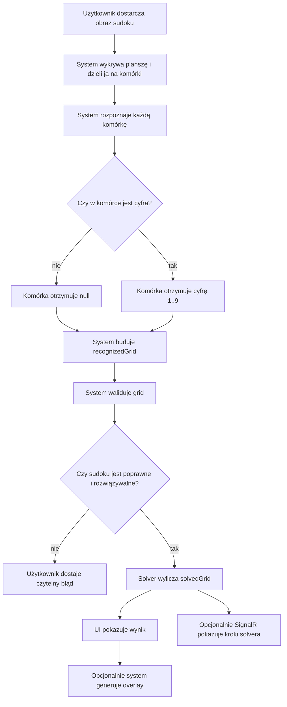

# UC-05 — Rozpoznanie cyfr, solver i prezentacja wyniku

## Cel
`UC-05` opisuje produktowy przepływ "rozwiąż sudoku", czyli przejście od obrazu albo siatki komórek do:
- `recognizedGrid`,
- `solvedGrid`,
- prezentacji wyniku w `UI`,
- opcjonalnego overlay na obrazie,
- opcjonalnego podglądu kroków solvera na żywo.

Dokument został rozbity na osobne pliki dla pod-historyjek, żeby łatwiej rozwijać kontrakty i zachować czytelność.

## Diagram biznesowy

## Wspólne decyzje architektoniczne
- `Backend` jest właścicielem publicznego API i orkiestruje cały przepływ `UC-05`.
- `Frontend` komunikuje się wyłącznie z `Backendem`; nie wywołuje `ML` bezpośrednio.
- Publiczne payloady HTTP używają `camelCase`.
- Błędy API używają `ErrorApiResponse` z polami `errorType` i `message`.
- Reprezentacja planszy w `UC-05` to zawsze siatka 9×9 z wartościami `1..9` albo `null`.
- Pusta komórka musi być rozpoznawana jako `digit = null`, a nie jako wymuszona klasyfikacja `1..9`.
- W `UC-05A` pustą komórkę wykrywamy przed inferencją modelową na zbinaryzowanym obrazie z odwróconymi kolorami, analizując foreground w centralnym obszarze zbudowanym z 4 wewnętrznych ćwiartek skierowanych do środka komórki.

## Podział na pliki
- [`UC-05A — Inferencja pojedynczej komórki`](./uc-05a-overview.md)
- [`UC-05B — Backtracking dla rozpoznanego gridu`](./uc-05b-overview.md)
- [`UC-05C — Historyjka scalona`](./uc-05c-overview.md)
- [`UC-05D — Graficzne naniesienie cyfr na obraz`](./uc-05d-overview.md)
- [`UC-05E — Pokazywanie kroków backtrackingu na żywo przez SignalR`](./uc-05e-overview.md)

Praktyczna decyzja dla obecnej wersji dokumentacji:
- dawne `UC-05C` zostało scalone do `UC-05A` i `UC-05E`,
- plik `UC-05C` pozostaje tylko jako notka porządkująca i punkt referencyjny dla wcześniejszych odwołań.

## Endpoint orkiestrujący cały przepływ
Z perspektywy produktu nadal warto utrzymać wyższy poziom API:

### `POST /api/solve-from-image`
- Endpoint publiczny, dostępny także bez tokenu administracyjnego.
- Request body: `SolveFromImageApiEntry`.
- `200 OK` -> `SolveFromImageApiResponse`.

Minimalny zakres odpowiedzi:
- `recognizedGrid`,
- `solvedGrid`,
- opcjonalnie `overlayImage` jako `ImageApiResponse`.

Wewnętrzny odpowiednik `BE -> ML` może pozostać jako `POST /ml/solve-from-image`, ale nie zastępuje kontraktów granularnych z pod-historyjek.

## Kolejność rekomendowana
1. `UC-05A` — stabilna inferencja pojedynczej komórki z poprawnym `null` dla pustej komórki.
2. `UC-05B` — solver backtracking z czytelną walidacją wejścia.
3. `UC-05E` — strumień kroków solvera po `SignalR`, jeśli chcemy pokazać "pracę" algorytmu na tym samym gridzie zbudowanym wcześniej w `UC-05A`.
4. `UC-05D` — overlay graficzny, najpierw na obrazie po korekcji perspektywy.
