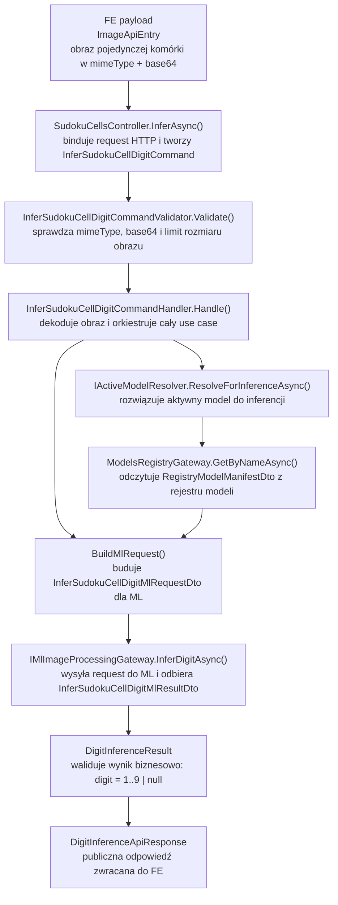
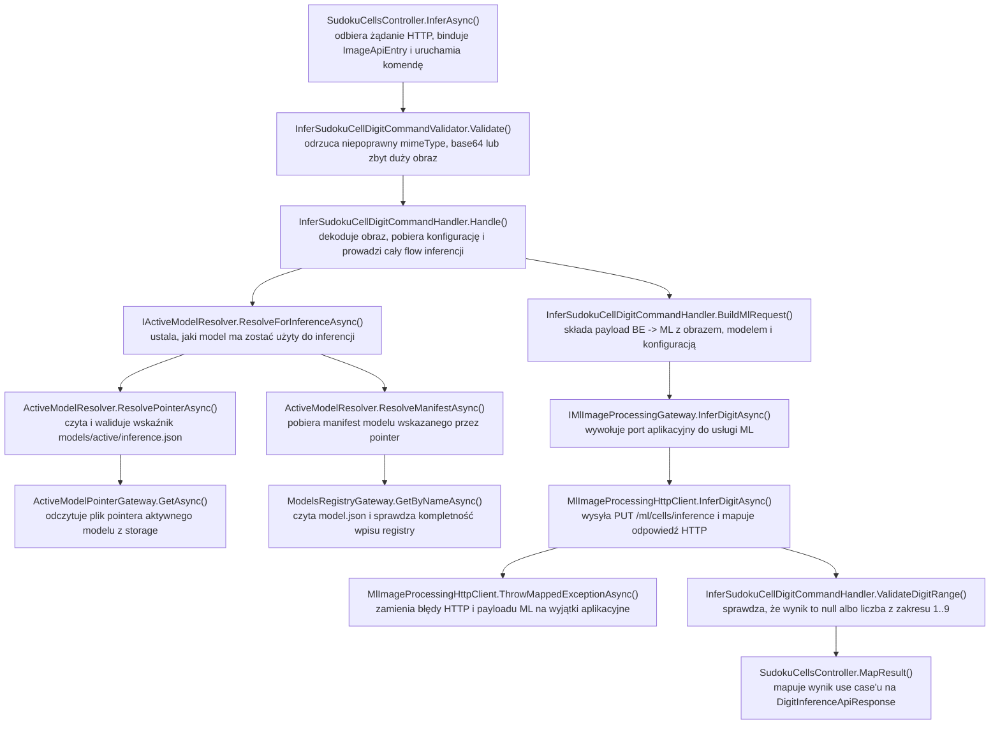

# UC-05A-BE - Plan implementacyjny dla `PUT /api/sudoku/cells/inference`

## 1) Przeznaczenie endpointa
- Endpoint `PUT /api/sudoku/cells/inference` realizuje publiczną inferencję pojedynczej komórki sudoku dla ścieżki runtime `UC-05`.
- Wejściem jest `ImageApiEntry` z obrazem pojedynczej komórki zwróconej wcześniej przez `UC-04`, a wynikiem minimalna odpowiedź `{ "digit": 1..9 | null }`.
- `digit = null` oznacza pustą komórkę albo brak wiarygodnie rozpoznanej cyfry, zgodnie z decyzją z `UC-05A`.
- Endpoint nie buduje pełnego `recognizedGrid`; to pozostaje odpowiedzialnością `FE` po scaleniu dawnego `UC-05C` do `UC-05A`.
- Endpoint nie uruchamia solvera, nie renderuje overlay i niczego nie zapisuje trwale. Jest to niski krok inferencyjny wykorzystywany później przez `UC-05B`, `UC-05E` i wyższy przepływ `POST /api/solve-from-image`.
- Endpoint korzysta z aktywnego modelu inferencyjnego wskazanego przez `models/active/inference.json` z `UC-10`; nie przyjmuje nazwy modelu z `FE`.
- Publiczna ścieżka solve pozostaje dostępna bez tokenu administracyjnego. `UC-13` nie chroni tego endpointa.

## 2) Zakres i założenia
- Plan dotyczy wyłącznie części `BE`.
- Punktami odniesienia są: `PRD`, `UC-05`, `UC-05A`, notka scalająca `UC-05C`, `UC-04`, `UC-10`, `INF-08` oraz aktualne wzorce backendowe użyte w `UC-04` i `UC-06`.
- Nie sugerujemy się bieżącą implementacją `FE` ani `ML`; plan wynika z docelowej architektury `FE -> BE -> ML`.
- Publiczny kontrakt ma pozostać minimalny:
  - request: `ImageApiEntry`,
  - response: `DigitInferenceApiResponse`.
- `BE` jest właścicielem publicznego workflow i źródłem prawdy dla:
  - wyboru aktywnego modelu,
  - konfiguracji inferencji runtime,
  - mapowania błędów dla `FE`.
- `ML` pozostaje wyspecjalizowaną usługą wykonawczą:
  - dostaje obraz komórki,
  - dostaje resolved konfigurację inferencji,
  - dostaje resolved aktywny model,
  - zwraca wynik inferencji.
- W `UC-05A` zakładamy wariant pojedynczego requestu na pojedynczą komórkę. Batch dla wielu komórek nie wchodzi do tego kroku.
- W `BE` nie wolno hardcodować progów heurystyki pustej komórki ani ścieżek runtime; muszą pochodzić z `appsettings.local.json` / `appsettings.production.json` i override'ów środowiskowych.
- W lokalnym środowisku wartości konfiguracyjne są wpisane na sztywno w `appsettings.local.json`.
- W środowisku `production` workflow generuje `appsettings.production.json` i podmienia placeholdery na wartości środowiskowe.

## 3) Kontrakty API FE i ML

### 3.1 FE -> BE (`PUT /api/sudoku/cells/inference`)
- Request body: `ImageApiEntry`
- Body:

```json
{
  "mimeType": "image/png",
  "base64": "iVBORw0KGgoAAA..."
}
```

### 3.2 BE -> FE
- `200 OK` -> `DigitInferenceApiResponse`
- `400 Bad Request` -> `ErrorApiResponse`
- `409 Conflict` -> `ErrorApiResponse`
- `422 Unprocessable Entity` -> `ErrorApiResponse`
- `502 Bad Gateway` -> `ErrorApiResponse`
- `503 Service Unavailable` -> `ErrorApiResponse`
- `504 Gateway Timeout` -> `ErrorApiResponse`
- `500 Internal Server Error` -> `ErrorApiResponse` dla błędów technicznych `BE`, których nie da się zmapować do kontraktu biznesowego

Przykłady odpowiedzi:

```json
{
  "digit": 7
}
```

```json
{
  "digit": null
}
```

Rekomendowane `errorType`:
- `invalid_request`
- `active_model_not_configured`
- `active_model_pointer_invalid`
- `active_model_manifest_invalid`
- `active_model_cannot_use_for_inference`
- `cell_image_not_processable`
- `ml_invalid_response`
- `ml_unavailable`
- `ml_timeout`

### 3.3 BE -> ML (`PUT /ml/cells/inference`)
- `BE` powinien przekazać do `ML` nie tylko obraz, ale również resolved model oraz resolved konfigurację inferencji.
- Wewnętrzny payload HTTP powinien być jawny, w `camelCase`, bez oczekiwania, że `ML` samo odczyta publiczny stan systemu z dysku na podstawie "magicznych" założeń.
- Heurystyka pustej komórki po stronie `ML` ma pracować na obrazie już zbinaryzowanym i odwróconym; `BE` przekazuje tylko próg foregroundu dla centralnego obszaru, a nie decyzję o pustym polu.
- Proponowany minimalny payload:

```json
{
  "image": {
    "mimeType": "image/png",
    "base64": "iVBORw0KGgoAAA..."
  },
  "activeModel": {
    "name": "cnn-mnist-baseline",
    "manifestPath": "/opt/sudoku/shared/models/registry/cnn-mnist-baseline/model.json",
    "primaryArtifactPath": "/opt/sudoku/shared/models/registry/cnn-mnist-baseline/artifacts/model.keras",
    "inputProfile": "default-28x28-v1"
  },
  "resolvedConfiguration": {
    "inferenceProfileName": "default-28x28-v1",
    "emptyCellCenterForegroundPixelRatioThreshold": 0.02
  }
}
```

Uwaga:
- Powyzej pokazano ksztalt kontraktu, a nie wartosci hardcodowane w kodzie.
- Sciezki pochodza z konfiguracji runtime i z manifestu aktywnego modelu.
- Ten payload powinien byc DTO infrastrukturalnym / aplikacyjnym dla komunikacji z `ML`, a nie kontraktem publicznym `FE`.

### 3.4 ML -> BE
- Minimalna odpowiedz zgodna z semantyka `UC-05A`:

```json
{
  "digit": 7
}
```

albo

```json
{
  "digit": null
}
```

- `digit` musi przejsc walidacje `BE`:
  - `null` jest legalne,
  - liczby `1..9` sa legalne,
  - `0`, liczby ujemne, `> 9`, typy niebedace liczba/null sa traktowane jako bledny payload `ML`.

## 4) Zachowanie per warstwa

### API (`Sudoku`)
- Wystawia publiczny endpoint `PUT /api/sudoku/cells/inference`.
- Binduje `ImageApiEntry`.
- Tworzy komendę `InferSudokuCellDigitCommand`.
- Wywołuje `MediatR`.
- Mapuje wynik na `DigitInferenceApiResponse`.
- Mapuje wyjątki walidacyjne, wyjątki aktywnego modelu i wyjątki komunikacji z `ML` na `ErrorApiResponse`.
- Nie wykonuje:
  - odczytu wskaźnika aktywnego modelu,
  - odczytu `model.json`,
  - odczytu plików,
  - `HttpClient` do `ML`,
  - dekodowania `base64` poza warstwą aplikacyjną.

### Application (`Application`)
- Waliduje żądanie:
  - obecność `mimeType`,
  - poprawny typ MIME,
  - obecność `base64`,
  - poprawny `base64`,
  - limit rozmiaru obrazu po dekodowaniu.
- Orkiestruje use case.
- Rozwiązuje aktywny model inferencyjny przez współdzielony resolver, a nie przez duplikację logiki z `GetActiveModelQueryHandler`.
- Egzekwuje reguły aktywacji:
  - pointer może nie istnieć,
  - pointer może być niespójny,
  - model musi istnieć w rejestrze,
  - model musi mieć `canUseForInference = true`,
  - manifest aktywnego modelu musi być technicznie poprawny.
- Buduje neutralny model wejściowy obrazu (`ImageContent`).
- Rozwiązuje konfigurację inferencji z typed options.
- Wywołuje port do `ML`.
- Waliduje wynik inferencji (`null` albo `1..9`).
- Zwraca lekki wynik aplikacyjny do API.

### Domain / Models (`Models`)
- Utrzymuje neutralne modele bez zależności od HTTP i filesystem:
  - obraz komórki,
  - wynik inferencji pojedynczej komórki.
- Pilnuje niezmienników:
  - `digit` jest `null` albo `1..9`.
- Nie zna:
  - `ImageApiEntry`,
  - `DigitInferenceApiResponse`,
  - `HttpClient`,
  - `IOptions`,
  - `model.json`,
  - pathów runtime.

### Infrastructure (`Infrastructure`)
- Implementuje komunikację `BE -> ML`.
- Reużywa istniejący klient `MlImageProcessingHttpClient`, zamiast tworzyć drugi niemal identyczny klient tylko dla jednej operacji.
- Reużywa istniejący storage aktywnego modelu i rejestru modeli:
  - `ActiveModelPointerGateway`,
  - `ModelsRegistryGateway`.
- Mapuje błędy transportowe i kontraktowe `ML` na wyjątki aplikacyjne/infrastrukturalne:
  - timeout,
  - brak dostępności,
  - niepoprawny JSON,
  - niepoprawny payload odpowiedzi.
- Nie podejmuje decyzji biznesowej, czy endpoint ma działać bez aktywnego modelu; to należy do `Application`.

## 5) Pliki per warstwa i odpowiedzialności

### API (`src/Backend/Sudoku/Sudoku`)
- `[NOWY]` `Controllers/SudokuCellsController.cs`
  - `[ApiController]`, `[Route("api/sudoku/cells")]`
  - akcja `InferAsync()` dla `PUT /api/sudoku/cells/inference`
  - mapowanie `InferSudokuCellDigitCommandResultDto` -> `DigitInferenceApiResponse`
  - mapowanie błędów na statusy HTTP
- `[NOWY]` `Contracts/DigitInferenceApiResponse.cs`
  - publiczny response model z polem `Digit`
- `[REUSE]` `Contracts/ImageApiEntry.cs`
  - publiczny request model z `mimeType`, `base64`
- `[REUSE]` `Contracts/ErrorApiResponse.cs`
  - wspólny model błędu `errorType`, `message`
- `[MODYFIKACJA]` `Program.cs`
  - bind i walidacja nowych typed options `SudokuCellsInferenceOptions`
- `[MODYFIKACJA]` `appsettings.local.json`
  - lokalne, twarde wartości dla:
    - `MlService.CellInferencePath`
    - `SudokuCellsInference.MaxInlineImageSizeBytes`
    - `SudokuCellsInference.InferenceProfileName`
    - `SudokuCellsInference.EmptyCellCenterForegroundPixelRatioThreshold`
- `[MODYFIKACJA]` `appsettings.production.json`
  - placeholdery dla tych samych wartości, nadpisywane przez workflow

### Application (`src/Backend/Sudoku/Application`)
- `[NOWY]` `Sudoku/InferSudokuCellDigitCommand.cs`
  - komenda MediatR przyjmująca `MimeType`, `Base64`
- `[NOWY]` `Sudoku/InferSudokuCellDigitCommandValidator.cs`
  - walidacja requestu analogiczna do `UC-04`, ale dla inferencji komórki
- `[NOWY]` `Sudoku/InferSudokuCellDigitCommandHandler.cs`
  - główna orkiestracja use case'u
- `[NOWY]` `Sudoku/InferSudokuCellDigitCommandResultDto.cs`
  - DTO wyniku dla API
- `[NOWY]` `Sudoku/InferSudokuCellDigitErrorTypes.cs`
  - stałe `errorType` dla endpointa
- `[NOWY]` `Sudoku/SudokuCellsInferenceOptions.cs`
  - typed options specyficzne dla use case'u
- `[NOWY]` `Sudoku/InferSudokuCellDigitMlRequestDto.cs`
  - DTO requestu wysyłanego do portu `ML`
- `[NOWY]` `Sudoku/InferSudokuCellDigitMlResultDto.cs`
  - DTO wyniku z portu `ML`
- `[MODYFIKACJA]` `Abstractions/IMlImageProcessingGateway.cs`
  - rozszerzenie o metodę `InferDigitAsync(...)`
- `[NOWY]` `ModelsActive/IActiveModelResolver.cs`
  - współdzielony interfejs do rozwiązania aktywnego modelu inferencyjnego
- `[NOWY]` `ModelsActive/ActiveModelResolver.cs`
  - wspólna logika odczytu wskaźnika + manifestu modelu
- `[NOWY]` `ModelsActive/ResolvedActiveModelDto.cs`
  - wewnętrzny wynik resolvera z danymi potrzebnymi różnym use case'om
- `[MODYFIKACJA]` `ModelsActive/GetActiveModelQueryHandler.cs`
  - delegacja do `IActiveModelResolver`, bez duplikowania logiki
- `[REUSE]` `ModelsActive/ActiveModelActivationRules.cs`
  - weryfikacja `canUseForInference` i poprawności aktywacji
- `[REUSE]` `ModelsActive/ActiveModelPointerDto.cs`
  - model pointera aktywnego modelu
- `[REUSE]` `ModelsActive/ActiveModelPointerInvalidException.cs`
  - pointer uszkodzony / niespójny
- `[REUSE]` `ModelsActive/ActiveModelPointerReadException.cs`
  - błąd odczytu pointera
- `[REUSE]` `ModelsActive/ActiveModelNotFoundException.cs`
  - pointer wskazuje model nieistniejący
- `[REUSE]` `ModelsActive/ActiveModelManifestInvalidException.cs`
  - manifest modelu aktywnego jest niepoprawny
- `[REUSE]` `ModelsActive/ActiveModelCannotUseForInferenceException.cs`
  - model istnieje, ale nie nadaje się do inferencji
- `[REUSE]` `ModelsRegistry/RegistryModelManifestDto.cs`
  - manifest modelu z danymi potrzebnymi do zbudowania requestu `BE -> ML`
- `[REUSE]` `Ml/MlOperationFailedException.cs`
  - błąd operacji logicznej `ML`
- `[REUSE]` `Ml/MlServiceUnavailableException.cs`
  - niedostępność `ML`
- `[REUSE]` `Ml/MlServiceTimeoutException.cs`
  - timeout `ML`
- `[MODYFIKACJA]` `DependencyInjection.cs`
  - rejestracja `IActiveModelResolver`

### Domain / Models (`src/Backend/Sudoku/Models`)
- `[REUSE]` `Images/ImageContent.cs`
  - neutralny model obrazu
- `[NOWY]` `Sudoku/DigitInferenceResult.cs`
  - neutralny model wyniku inferencji pojedynczej komórki
  - pilnuje reguły `null` albo `1..9`

### Infrastructure (`src/Backend/Sudoku/Infrastructure`)
- `[MODYFIKACJA]` `Ml/MlImageProcessingHttpClient.cs`
  - dodać `InferDigitAsync(...)`
  - serializacja requestu do `ML`
  - deserializacja odpowiedzi z `ML`
  - walidacja payloadu `digit`
  - mapowanie błędów HTTP / JSON
- `[MODYFIKACJA]` `Configuration/MlServiceOptions.cs`
  - dodać `CellInferencePath`
- `[REUSE]` `Storage/ActiveModelPointerGateway.cs`
  - odczyt pointera `models/active/inference.json`
- `[REUSE]` `Storage/ModelsRegistryGateway.cs`
  - odczyt manifestu modelu z rejestru
- `[MODYFIKACJA]` `DependencyInjection.cs`
  - walidacja `MlService.CellInferencePath`
  - nadal jeden klient HTTP do obrazu/preprocessingu/inferencji komórki

### Workflow (`.github/workflows`)
- `[MODYFIKACJA]` `.github/workflows/backend-cd.yml`
  - dodać nowe zmienne środowiskowe dla konfiguracji inferencji komórki
  - dopisać je do walidacji
  - dopisać ich podstawienie do generatora `appsettings.production.json`

## 6) Weryfikacja usług Infrastructure i antyduplikacja
- W repo już istnieje `IMlImageProcessingGateway` oraz `MlImageProcessingHttpClient` używane przez `UC-04`.
- Wniosek: nie tworzyć nowego `IMlDigitInferenceGateway` ani drugiego klienta HTTP, jeśli jedynym celem byłoby wysłanie obrazu do `ML` i odebranie synchronicznej odpowiedzi. To bylby duplikat wzorca z `UC-04`.
- Najlepszy reuse:
  - rozszerzyć `IMlImageProcessingGateway`,
  - rozszerzyć `MlImageProcessingHttpClient`,
  - zachować wspólny styl obsługi błędów `ML`.
- W repo już istnieje pełny mechanizm aktywnego modelu:
  - `IActiveModelPointerGateway`
  - `ActiveModelPointerGateway`
  - `IModelsRegistryGateway`
  - `ModelsRegistryGateway`
  - `ActiveModelActivationRules`
  - `GetActiveModelQueryHandler`
- Wniosek: nie duplikować logiki "jak znaleźć aktywny model do inferencji" w nowym handlerze `UC-05A`.
- Zalecany reuse:
  - wydzielić wspólny `IActiveModelResolver`,
  - użyć go w `GetActiveModelQueryHandler`,
  - użyć go w `InferSudokuCellDigitCommandHandler`,
  - później użyć go także w `POST /api/solve-from-image`.
- W repo istnieje już `ImageApiEntry`, `ImageContent`, `ErrorApiResponse` i walidator analogicznego requestu obrazowego z `UC-04`.
- Wniosek: wykorzystać ten sam styl walidacji i te same typy, zamiast definiować nowy request model obrazu.

## 7) Przepływ w obrębie BE
1. `FE` wysyła `PUT /api/sudoku/cells/inference` z `ImageApiEntry`.
2. `SudokuCellsController.InferAsync()` buduje `InferSudokuCellDigitCommand`.
3. Pipeline `FluentValidation` waliduje:
   - `mimeType`,
   - `base64`,
   - rozmiar po dekodowaniu.
4. `InferSudokuCellDigitCommandHandler.Handle()` wywołuje `IActiveModelResolver.ResolveForInferenceAsync()`.
5. Resolver:
   - odczytuje `models/active/inference.json`,
   - waliduje nazwę modelu,
   - pobiera manifest modelu z rejestru,
   - egzekwuje `canUseForInference`,
   - zwraca resolved aktywny model.
6. Handler dekoduje `base64` do `ImageContent`.
7. Handler pobiera `SudokuCellsInferenceOptions`.
8. Handler buduje `InferSudokuCellDigitMlRequestDto` z:
   - obrazem,
   - aktywnym modelem,
   - resolved konfiguracją inferencji.
9. Handler wywołuje `IMlImageProcessingGateway.InferDigitAsync(...)`.
10. `MlImageProcessingHttpClient` wysyła `PUT /ml/cells/inference`.
11. `ML` zwraca `{ digit: 1..9 | null }`.
12. `Infrastructure` waliduje payload techniczny.
13. `Application` waliduje wynik biznesowo (`null` albo `1..9`).
14. Handler zwraca `InferSudokuCellDigitCommandResultDto`.
15. Kontroler mapuje wynik na `DigitInferenceApiResponse`.
16. `FE` wpisuje wynik do odpowiedniej pozycji lokalnego `recognizedGrid`.

## 8) Główne funkcje
- `SudokuCellsController.InferAsync(...)`
- `InferSudokuCellDigitCommandValidator.Validate(...)`
- `InferSudokuCellDigitCommandHandler.Handle(...)`
- `InferSudokuCellDigitCommandHandler.BuildMlRequest(...)`
- `IActiveModelResolver.ResolveForInferenceAsync(...)`
- `ActiveModelResolver.ResolveForInferenceAsync(...)`
- `ActiveModelResolver.ResolvePointerAsync(...)`
- `ActiveModelResolver.ResolveManifestAsync(...)`
- `IMlImageProcessingGateway.InferDigitAsync(...)`
- `MlImageProcessingHttpClient.InferDigitAsync(...)`
- `MlImageProcessingHttpClient.SendDigitAsync(...)`
- `MlImageProcessingHttpClient.ThrowMappedExceptionAsync(...)`

## 9) Wyjątki, fallbacki i zachowanie błędowe

### 9.1 Publiczne statusy
- `200 OK`
  - poprawny request,
  - istnieje aktywny model,
  - `ML` zwrócił legalne `digit`,
  - wynik może być `null`
- `400 Bad Request`
  - brak `mimeType`,
  - nieobsługiwany `mimeType`,
  - pusty `base64`,
  - niepoprawny `base64`,
  - obraz po dekodowaniu przekracza limit rozmiaru
- `409 Conflict`
  - nie ma aktywnego modelu inferencyjnego,
  - pointer jest uszkodzony,
  - pointer wskazuje nieistniejący model,
  - aktywny model nie ma `canUseForInference = true`,
  - manifest aktywnego modelu nie jest poprawny do inferencji
- `422 Unprocessable Entity`
  - `ML` odrzuciło obraz jako nieprzetwarzalny,
  - komórka nie nadaje się do runtime inferencji zgodnie z kontraktem `ML`
- `502 Bad Gateway`
  - `ML` zwrócił niepoprawny JSON,
  - `ML` zwrócił `digit` spoza zakresu `1..9|null`,
  - `ML` zwrócił niezgodny payload
- `503 Service Unavailable`
  - `ML` nieosiągalne,
  - błąd połączenia sieciowego do `ML`
- `504 Gateway Timeout`
  - `ML` nie odpowiedziało w limicie czasu
- `500 Internal Server Error`
  - błąd odczytu pointera niebędący zwykłym brakiem pliku,
  - błąd I/O `BE`,
  - błąd niespójności, którego nie da się zmapować na kontrakt biznesowy

### 9.2 Fallbacki
- Brak fallbacku do innego modelu niż aktywny.
- Brak fallbacku do domyślnego modelu bootstrap "na wszelki wypadek".
- Brak fallbacku do bezpośredniego wywołania `ML` z `FE`.
- Brak fallbacku do inferencji po stronie `BE`.
- Brak zapisu lokalnego cache wyników inferencji komórki.
- Brak cichego zamieniania błędów aktywnego modelu na `digit = null`; `null` ma oznaczać wynik inferencji, a nie awarię systemu.

### 9.3 Scenariusze graniczne
- Brak pliku `models/active/inference.json`
  - `409 active_model_not_configured`
- Pointer istnieje, ale ma złą nazwę modelu
  - `409 active_model_pointer_invalid`
- Pointer wskazuje model spoza rejestru
  - `409 active_model_pointer_invalid`
- Manifest modelu jest niespójny albo brak artefaktów przy capability inferencji
  - `409 active_model_manifest_invalid`
- `ML` zwraca `digit = 0`
  - `502 ml_invalid_response`
- `ML` zwraca `digit = 12`
  - `502 ml_invalid_response`
- `ML` zwraca `digit = null`
  - `200 OK`, bo to prawidłowy wynik biznesowy

## 10) Pseudokod specyficznej logiki

### 10.1 Pseudokod aplikacyjny

```text
handleInferSudokuCellDigit(command):
  ensureCommandValidated(command)

  resolvedActiveModel = activeModelResolver.resolveForInference()

  imageBytes = base64Decode(command.base64)
  image = ImageContent(command.mimeType, imageBytes)

  options = sudokuCellsInferenceOptions.value

  mlRequest = InferSudokuCellDigitMlRequest(
    image = image,
    activeModel = {
      name = resolvedActiveModel.manifest.Name,
      manifestPath = resolvedActiveModel.manifestPath,
      primaryArtifactPath = resolvedActiveModel.primaryArtifactPath,
      inputProfile = resolvedActiveModel.manifest.InputProfile
    },
    resolvedConfiguration = {
      inferenceProfileName = options.InferenceProfileName,
      emptyCellCenterForegroundPixelRatioThreshold = options.EmptyCellCenterForegroundPixelRatioThreshold
    }
  )

  mlResult = mlImageProcessingGateway.inferDigit(mlRequest)

  if mlResult.digit is not null and (mlResult.digit < 1 or mlResult.digit > 9):
    throw MlOperationFailedException("ml_invalid_response")

  return CommandResult(digit = mlResult.digit)
```

### 10.2 Pseudokod resolvera aktywnego modelu

```text
resolveForInference():
  pointer = activeModelPointerGateway.get()

  if pointer is null:
    throw ActiveModelNotConfiguredException

  validatePointerModelName(pointer.modelName)
  validatePointerUpdatedAtUtc(pointer.updatedAtUtc)

  manifest = modelsRegistryGateway.getByName(pointer.modelName)
  if manifest is null:
    throw ActiveModelNotFoundException(pointer.modelName)

  ensureCanUseForInference(manifest)
  ensureActivatableManifest(manifest)

  manifestPath = combine(modelsRegistryStorage.registryDirectoryPath, manifest.name, "model.json")
  primaryArtifactPath = combine(modelsRegistryStorage.registryDirectoryPath, manifest.name, manifest.primaryArtifactRelativePath)

  return ResolvedActiveModel(
    pointer = pointer,
    manifest = manifest,
    manifestPath = manifestPath,
    primaryArtifactPath = primaryArtifactPath
  )
```

### 10.3 Mermaid flowchart - flow modeli



### 10.4 Mermaid flowchart - logika aplikacji z funkcjami



## 11) Workflow GitHub i konfiguracja runtime
- Lokalnie:
  - `appsettings.local.json` przechowuje konkretne lokalne wartosci konfiguracyjne na sztywno.
  - Nie tworzymy dodatkowego lokalnego generatora configu poza standardowym loaderem `BackendConfigurationExtensions`.
- Produkcyjnie:
  - `backend-cd.yml` musi dopisac nowe zmienne i umiec je podstawic do `appsettings.production.json`.
  - Workflow zmienia overlay produkcyjny, nie plik bazowy.
  - Zgodnie z dokumentem deployu runtime state (`models/registry`, `models/active`, `trainings`, `data`, `examples`) nie jest czyszczony przy deployu.

### 11.1 Nowa sekcja konfiguracyjna BE

```json
{
  "SudokuCellsInference": {
    "MaxInlineImageSizeBytes": 10485760,
    "InferenceProfileName": "default-28x28-v1",
    "EmptyCellCenterForegroundPixelRatioThreshold": 0.02
  }
}
```

### 11.2 Rozszerzenie `MlService`

```json
{
  "MlService": {
    "CellInferencePath": "/ml/cells/inference"
  }
}
```

### 11.3 Zmiany w `backend-cd.yml`
- Dodac env:
  - `BE_ML_CELL_INFERENCE_PATH`
  - `BE_SUDOKU_CELLS_INFERENCE_MAX_INLINE_IMAGE_SIZE_BYTES`
  - `BE_SUDOKU_CELLS_INFERENCE_PROFILE_NAME`
  - `BE_SUDOKU_CELLS_INFERENCE_EMPTY_CELL_CENTER_FOREGROUND_PIXEL_RATIO_THRESHOLD`
- Dodac je do walidacji obecnosci.
- Sparsowac typy:
  - `MaxInlineImageSizeBytes` jako integer,
  - `EmptyCellCenterForegroundPixelRatioThreshold` jako float.
- W Pythonowym generatorze `appsettings.production.json` ustawic:
  - `config["MlService"]["CellInferencePath"]`
  - `config["SudokuCellsInference"]["MaxInlineImageSizeBytes"]`
  - `config["SudokuCellsInference"]["InferenceProfileName"]`
  - `config["SudokuCellsInference"]["EmptyCellCenterForegroundPixelRatioThreshold"]`

## 12) Logging
- Cel: pozniejsza diagnostyka bledow inferencji bez logowania obrazow i bez zapychania dysku.
- `Information`
  - przyjeto request inferencji komorki
  - rozwiazano aktywny model `modelName`
  - `ML` zwrocilo wynik inferencji
  - zakonczono `200 OK`
- `Warning`
  - brak aktywnego modelu
  - pointer aktywnego modelu jest niespojny
  - model nie moze byc uzyty do inferencji
  - `ML` odrzucilo obraz jako nieprzetwarzalny
  - `ML` zwrocilo niepoprawny zakres cyfry
- `Error`
  - blad odczytu pointera aktywnego modelu
  - blad sieciowy do `ML`
  - timeout `ML`
  - niepoprawny JSON z `ML`
- Guardraile logowania:
  - nie logowac `base64`
  - nie logowac tresci obrazow
  - nie logowac pelnych payloadow `ML`
  - nie logowac tokenow
  - nie logowac pelnych absolutnych sciezek w odpowiedzi API
  - w logach wystarcza: `modelName`, `errorType`, status HTTP `ML`, krotki powod

## 13) Inne istotne reguły
- Nie tworzymy osobnego endpointu backendowego tylko po to, by `FE` narysowalo `recognizedGrid`; to zostalo juz rozstrzygniete przez scalenie `UC-05C`.
- Endpoint nie moze przyjmowac `modelName` z `FE`; aktywny model wybiera `UC-10`.
- `digit = null` jest poprawnym wynikiem biznesowym, a nie bledem.
- `BE` nie powinien probowac sam wykonywac heurystyki pustej komorki. To jest logika wykonawcza `ML`, ale z konfiguracja rozwiazana po stronie `BE`.
- Po stronie `ML` heurystyka pustej komorki ma analizowac centralny obszar zbudowany z 4 wewnetrznych cwiartek skierowanych do srodka komorki, a nie prosty margines prostokatny.
- Nazw istniejacych modeli i kontraktow nie zmieniamy:
  - `ImageApiEntry`
  - `ErrorApiResponse`
  - `RegistryModelManifestDto`
  - mechanizm `models/active/inference.json`
- Publiczne JSON-y pozostaja w `camelCase`.
- Kontroler ma byc cienki, a cala logika workflow ma pozostac w `Application`.

## 14) Kolejność implementacji kodu dla historyjki
1. Dodac `DigitInferenceApiResponse` w `Sudoku/Contracts`.
2. Dodac `SudokuCellsInferenceOptions` i sekcje konfiguracji do `appsettings.local.json` oraz `appsettings.production.json`.
3. Rozszerzyc `MlServiceOptions` o `CellInferencePath`.
4. Zaktualizowac `Program.cs` o bind/walidacje `SudokuCellsInferenceOptions`.
5. Rozszerzyc `Application/DependencyInjection.cs` o rejestracje `IActiveModelResolver`.
6. Dodac `ResolvedActiveModelDto`, `IActiveModelResolver` i `ActiveModelResolver`.
7. Zrefaktoryzowac `GetActiveModelQueryHandler`, aby korzystal z resolvera.
8. Dodac model domenowy `DigitInferenceResult`.
9. Dodac `InferSudokuCellDigitCommand`, validator, DTO wyniku i `ErrorTypes`.
10. Rozszerzyc `IMlImageProcessingGateway` o `InferDigitAsync(...)`.
11. Rozszerzyc `MlImageProcessingHttpClient` o obsluge `PUT /ml/cells/inference`.
12. Zaimplementowac `InferSudokuCellDigitCommandHandler`.
13. Dodac `SudokuCellsController`.
14. Zaktualizowac `.github/workflows/backend-cd.yml` o nowe zmienne i generator `appsettings.production.json`.
15. Dodac testy `Application`:
  - sukces z `digit = 7`
  - sukces z `digit = null`
  - brak aktywnego modelu
  - pointer uszkodzony
  - model bez capability inferencji
  - `ML` zwraca zly zakres cyfry
  - timeout / niedostepnosc `ML`
16. Dodac testy `Infrastructure`:
  - poprawny payload `ML`
  - `digit = null`
  - zly JSON
  - `digit = 0`
  - mapowanie `503`
  - mapowanie `504`
17. Dodac testy API/integracyjne:
  - `200`
  - `400`
  - `409`
  - `422`
  - `502`
  - `503`
  - `504`

## 15) Guardraile implementacyjne
- Nie dodawac minimal API `MapPut`; uzyc kontrolera ASP.NET.
- Nie wywolywac `ML` bezposrednio z kontrolera.
- Nie duplikowac logiki aktywnego modelu z `GetActiveModelQueryHandler`.
- Nie tworzyc nowego, waskiego klienta HTTP tylko dla jednej operacji, jesli istniejacy `MlImageProcessingHttpClient` da sie rozszerzyc.
- Nie hardcodowac progow pustej komorki i sciezek runtime.
- Nie zwracac do `FE`:
  - `manifestPath`
  - `primaryArtifactPath`
  - `registryDirectoryPath`
  - szczegolow konfiguracji technicznej `ML`
- Nie interpretowac awarii systemu jako `digit = null`.
- Nie zapisywac wyniku inferencji do plikow ani rejestru.
- Nie mieszac kontraktow HTTP z modelami domenowymi.
- `Application` ma podejmowac decyzje biznesowe, `Infrastructure` ma realizowac I/O i HTTP.

## 16) Zależności pomiędzy historyjkami
- Wejsciowe:
  - `UC-04` - dostarcza siatke 9x9 obrazow komorek, z ktorej `FE` bierze pojedyncze komorki do inferencji
  - `UC-05C` - zostal scalony; potwierdza, ze `recognizedGrid` sklada `FE`, a nie osobny endpoint `BE`
  - `UC-10` - aktywny model inferencyjny i wskaznik `models/active/inference.json`
  - `INF-08` - standard manifestu modelu w `models/registry`
- Rownolegle:
  - `ML UC-05A` - implementacja `PUT /ml/cells/inference`
  - ewentualny dalszy `POST /api/solve-from-image`, ktory reuse'uje ten sam resolver modelu i ten sam port do `ML`
- Wyjsciowe:
  - `UC-05B` - solver przyjmie `recognizedGrid` zlozony po stronie `FE`
  - `UC-05E` - ten sam grid moze byc potem aktualizowany przez live solve
  - `UC-05D` - overlay zuzyje finalnie wynik solvera, ale nie zmienia kontraktu tego endpointa

## 17) Model API wejściowy i wyjściowy w komunikacji z FE i ML

### FE -> BE
- `ImageApiEntry`
  - `mimeType: string`
  - `base64: string`

### BE -> FE
- `DigitInferenceApiResponse`
  - `digit: int | null`
- `ErrorApiResponse`
  - `errorType: string`
  - `message: string`

### BE -> ML
- `InferSudokuCellDigitMlRequestDto`
  - `image`
    - `mimeType: string`
    - `base64: string`
  - `activeModel`
    - `name: string`
    - `manifestPath: string`
    - `primaryArtifactPath: string`
    - `inputProfile: string`
  - `resolvedConfiguration`
    - `inferenceProfileName: string`
    - `emptyCellCenterForegroundPixelRatioThreshold: number`

### ML -> BE
- `InferSudokuCellDigitMlResultDto`
  - `digit: int | null`

## 18) Rekomendacja nazewnicza plików i klas
- Kontroler: `SudokuCellsController`
- Akcja: `InferAsync`
- Komenda: `InferSudokuCellDigitCommand`
- Handler: `InferSudokuCellDigitCommandHandler`
- Wynik publiczny: `DigitInferenceApiResponse`
- Wynik domenowy: `DigitInferenceResult`
- Opcje: `SudokuCellsInferenceOptions`

## 19) Podsumowanie decyzji architektonicznych
- Publiczny endpoint pozostaje minimalny i synchroniczny.
- `FE` sklada `recognizedGrid`; `BE` rozpoznaje tylko jedna komorke na request.
- Aktywny model jest rozwiazywany po stronie `BE`, nie po stronie `FE`.
- Konfiguracja inferencji pustej komorki jest rozwiazywana po stronie `BE`, ale wykonywana po stronie `ML`.
- Detekcja pustej komorki w `ML` pracuje na centralnym obszarze zbinaryzowanej, odwroconej komorki i jest sterowana progiem foregroundu przekazywanym z `BE`.
- Reuzywamy:
  - `IMlImageProcessingGateway` / `MlImageProcessingHttpClient`
  - `ActiveModelPointerGateway`
  - `ModelsRegistryGateway`
  - aktywne kontrakty obrazu i bledow
- Nie wprowadzamy nowego zrodla prawdy ani dodatkowego storage dla runtime inferencji komorek.
