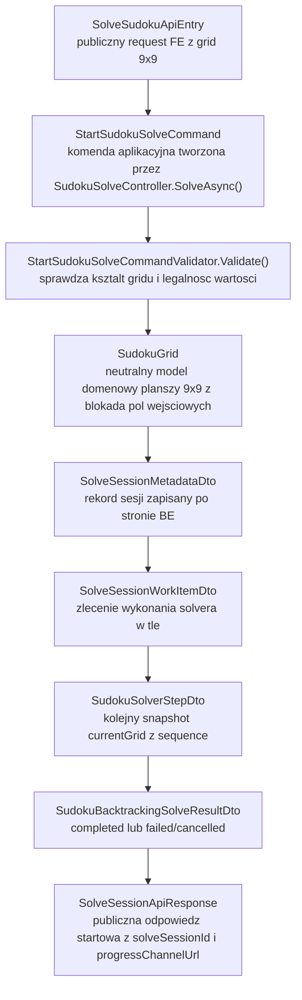
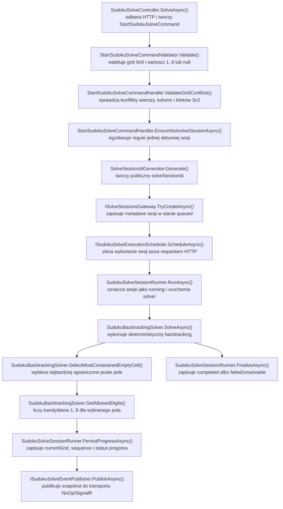

# UC-05B-BE - Plan implementacyjny dla `POST /api/sudoku/solve`

## 1) Przeznaczenie endpointa
- Endpoint `POST /api/sudoku/solve` uruchamia po stronie `Backendu` asynchroniczną sesję rozwiązywania sudoku metodą backtrackingu dla już rozpoznanego gridu 9x9.
- Wejściem jest publiczny grid zbudowany wcześniej po `UC-05A`; `Backend` nie wykonuje tu inferencji obrazu i nie komunikuje się z `ML`.
- Odpowiedź `202 Accepted` nie zawiera `solvedGrid`. Zwraca tylko identyfikator sesji i docelowy kanał postępu, tak aby nie blokować requestu pełnym przebiegiem solvera.
- W tym kroku zajmujemy się wyłącznie częścią `BE`.
- Ten plan nie opiera się na obecnym stanie `FE` ani `ML`, tylko na docelowej architekturze `FE -> BE`, z gotowością pod późniejsze `SignalR` opisane w `UC-05E`.
- `UC-05B` implementuje:
  - walidację publicznego gridu,
  - utworzenie sesji solve,
  - uruchomienie backtrackingu w tle,
  - trwałe zapisywanie bieżącego stanu sesji po stronie `BE`,
  - przygotowanie punktów rozszerzeń pod przyszłe eventy realtime.
- `UC-05B` nie implementuje jeszcze publicznego kanału `SignalR`; jednak kontrakt i zapis stanu muszą być gotowe, aby `UC-05E` nie wymagało łamania API ani przepisywania solvera.

## 2) Zakres i założenia
- Plan dotyczy wyłącznie warstwy `BE` w `src/Backend/Sudoku`.
- Punkty odniesienia:
  - `PRD`,
  - `UC-05`,
  - `UC-05B`,
  - `UC-05E`,
  - `.ai/Backtracking.md`,
  - istniejące wzorce `UC-05A`, `UC-06`, `UC-11`, `UC-12`, `UC-10`.
- Solver działa wyłącznie w `Backendzie`; brak kontraktu `BE -> ML`.
- Kontroler pozostaje cienki; logika workflow, walidacji i backtrackingu nie trafia do `Api`.
- `Infrastructure` implementuje I/O, storage i uruchomienie pracy w tle, ale nie zawiera logiki algorytmu backtracking.
- `Application` pozostaje właścicielem:
  - walidacji biznesowej,
  - reguły jednej aktywnej sesji,
  - budowy i finalizacji sesji,
  - orkiestracji solvera,
  - mapowania stanów sesji.
- `Models` utrzymuje neutralne modele domenowe gridu i statusów sesji, bez zależności od HTTP, plików i `SignalR`.
- Publiczny kontrakt `POST /api/sudoku/solve` należy utrzymać już teraz w formie zgodnej z `UC-05B`, nawet jeśli pełna konsumpcja wyniku przez `FE` pojawi się dopiero w `UC-05E`.
- W `MVP` backend dopuszcza dokładnie jedną aktywną sesję solve w obrębie całego backendu. To jest świadome uproszczenie na etap bez publicznego kontekstu użytkownika i bez pełnej sesji klienta.
- Jeśli kiedyś pojawi się scope "na użytkownika" albo "na widok", implementacja powinna rozszerzyć klucz aktywnej sesji, a nie zmieniać algorytmu solvera.
- Lokalnie ścieżki runtime są wpisane jawnie do `appsettings.local.json`.
- Produkcyjnie workflow backendu generuje `appsettings.production.json` i podstawia wartości środowiskowe, bez hardcodowania ich w klasach.

## 3) Kontrakty API FE i ML

### 3.1 FE -> BE (`POST /api/sudoku/solve`)
- Request body: `SolveSudokuApiEntry`
- Minimalny kontrakt:

```json
{
  "grid": [
    [5, 3, null, null, 7, null, null, null, null],
    [6, null, null, 1, 9, 5, null, null, null],
    [null, 9, 8, null, null, null, null, 6, null],
    [8, null, null, null, 6, null, null, null, 3],
    [4, null, null, 8, null, 3, null, null, 1],
    [7, null, null, null, 2, null, null, null, 6],
    [null, 6, null, null, null, null, 2, 8, null],
    [null, null, null, 4, 1, 9, null, null, 5],
    [null, null, null, null, 8, null, null, 7, 9]
  ]
}
```

Zasady walidacji wejścia:
- `grid` musi mieć dokładnie 9 wierszy.
- Każdy wiersz musi mieć dokładnie 9 kolumn.
- Każda komórka może mieć wartość:
  - `null`,
  - `1..9`.
- `0`, liczby ujemne, `> 9`, stringi i inne typy są niedozwolone.
- Grid nie może już na wejściu łamać reguł sudoku w:
  - wierszu,
  - kolumnie,
  - kwadracie `3x3`.

### 3.2 BE -> FE
- `202 Accepted` -> `SolveSessionApiResponse`
- `400 Bad Request` -> `ErrorApiResponse`
- `409 Conflict` -> `ErrorApiResponse`
- `422 Unprocessable Entity` -> `ErrorApiResponse`
- `500 Internal Server Error` -> `ErrorApiResponse`

Przykład odpowiedzi:

```json
{
  "solveSessionId": "solve-20260515-182600-sudoku-01",
  "status": "queued",
  "progressChannelUrl": "/ws/sudoku/solving/solve-20260515-182600-sudoku-01"
}
```

Rekomendowane `errorType`:
- `invalid_request`
- `solve_session_already_active`
- `grid_value_out_of_range`
- `grid_shape_invalid`
- `grid_conflicts_with_sudoku_rules`
- `solve_session_persistence_failed`
- `solve_session_enqueue_failed`
- `solve_session_invariant_violation`

Ważne:
- Endpoint nie zwraca synchronicznie `solvedGrid`.
- Endpoint nie zwraca synchronicznie `unsolvable`, jeśli brak rozwiązania wychodzi dopiero podczas pracy backtrackingu.
- Jeśli grid przejdzie walidację wejścia i dopiero solver ustali brak rozwiązania, sesja kończy się stanem `failed` z `errorType = unsolvable` zapisanym w metadanych sesji i później emitowanym przez `UC-05E`.

### 3.3 BE -> ML
- Brak kontraktu `BE -> ML` dla `UC-05B`.
- `ML` nie bierze udziału w solverze backtracking.
- `BE` nie powinien wywoływać żadnego endpointu `ML` podczas `POST /api/sudoku/solve`.

### 3.4 ML -> BE
- Brak kontraktu `ML -> BE` dla `UC-05B`.

## 4) Zachowanie per warstwa

### API (`Sudoku`)
- Wystawia publiczny endpoint `POST /api/sudoku/solve`.
- Binduje `SolveSudokuApiEntry`.
- Tworzy komendę aplikacyjną `StartSudokuSolveCommand`.
- Wywołuje `MediatR`.
- Mapuje wynik na `SolveSessionApiResponse`.
- Mapuje błędy walidacji i konflikt aktywnej sesji na `ErrorApiResponse`.
- Nie wykonuje:
  - walidacji reguł sudoku ręcznie w kontrolerze,
  - backtrackingu,
  - operacji plikowych,
  - zarządzania kolejką pracy w tle,
  - publikacji eventów `SignalR`,
  - komunikacji z `ML`.

### Application (`Application`)
- Waliduje request publiczny:
  - obecność `grid`,
  - kształt `9x9`,
  - legalność wartości `1..9 | null`.
- Waliduje reguły biznesowe:
  - brak duplikatów w wierszach,
  - brak duplikatów w kolumnach,
  - brak duplikatów w blokach `3x3`.
- Egzekwuje regułę jednej aktywnej sesji.
- Generuje `solveSessionId`.
- Tworzy i zapisuje rekord sesji w stanie początkowym.
- Enqueue'uje pracę solve do wykonania w tle.
- Uruchamia solver backtracking w tle przez port uruchomieniowy.
- Aktualizuje metadane sesji po każdym kroku solvera.
- Przygotowuje publiczne pole `progressChannelUrl`, mimo że sam kanał zostanie wystawiony dopiero w `UC-05E`.
- Zapisuje stany:
  - `queued`,
  - `running`,
  - `completed`,
  - `failed`,
  - z gotowością na przyszłe `cancelling` i `cancelled`.
- Utrzymuje abstrakcję publishera kroków solve jako `NoOp` w `UC-05B`, aby `UC-05E` mogło podmienić transport bez zmiany solvera.

### Domain / Models (`Models`)
- Utrzymuje neutralny model gridu sudoku.
- Pilnuje niezmienników:
  - plansza ma `9x9`,
  - każda komórka to `null` albo `1..9`,
  - pola wejściowe są zablokowane,
  - solver może zmieniać tylko pola pierwotnie puste.
- Utrzymuje domenowe statusy sesji solve oraz typy eventów solve.
- Nie zna:
  - `ApiController`,
  - `HttpContext`,
  - `JsonSerializer`,
  - `IOptions`,
  - `SignalR`,
  - filesystemu,
  - `ML`.

### Infrastructure (`Infrastructure`)
- Implementuje trwały storage metadanych sesji solve.
- Reuse'uje istniejący `IFileStorageGateway` zamiast wprowadzać drugi adapter plikowy.
- Implementuje wykonanie pracy w tle w procesie `BE`.
- Tworzy minimalny, gotowy do reuse mechanizm uruchamiania sesji solve poza cyklem requestu HTTP.
- Nie implementuje algorytmu backtracking.
- Nie podejmuje decyzji:
  - czy grid jest biznesowo poprawny,
  - czy sesja może wystartować,
  - jak wybierać kolejne pole,
  - kiedy uznać planszę za nierozwiązywalną.

## 5) Pliki per warstwa i odpowiedzialności

### API (`src/Backend/Sudoku/Sudoku`)
- `[NOWY]` `Controllers/SudokuSolveController.cs`
  - `[ApiController]`, `[Route("api/sudoku")]`
  - akcja `SolveAsync()` dla `POST /api/sudoku/solve`
  - mapowanie `StartSudokuSolveCommandResultDto` -> `SolveSessionApiResponse`
  - mapowanie błędów na statusy `400/409/422/500`
- `[NOWY]` `Contracts/SolveSudokuApiEntry.cs`
  - publiczny request model z polem `Grid`
- `[NOWY]` `Contracts/SolveSessionApiResponse.cs`
  - publiczny response model z polami:
    - `solveSessionId`
    - `status`
    - `progressChannelUrl`
- `[REUSE]` `Contracts/ErrorApiResponse.cs`
  - wspólny model błędu `errorType`, `message`
- `[MODYFIKACJA]` `Program.cs`
  - rejestracja nowych typed options storage sesji solve
  - rejestracja hosted/background execution dla solvera
  - bez dodawania minimal API
- `[MODYFIKACJA]` `appsettings.local.json`
  - lokalna, jawna ścieżka do katalogu metadanych sesji solve
- `[MODYFIKACJA]` `appsettings.production.json`
  - placeholdery pod ścieżkę produkcyjną dla sesji solve, podstawiane przez workflow

### Application (`src/Backend/Sudoku/Application`)
- `[NOWY]` `SudokuSolve/StartSudokuSolveCommand.cs`
  - komenda MediatR uruchamiająca sesję solve
- `[NOWY]` `SudokuSolve/StartSudokuSolveCommandValidator.cs`
  - walidacja kształtu requestu i danych wejściowych `grid`
- `[NOWY]` `SudokuSolve/StartSudokuSolveCommandHandler.cs`
  - główna orkiestracja startu sesji solve
  - walidacja jednej aktywnej sesji
  - utworzenie metadanych
  - zlecenie pracy do wykonania w tle
- `[NOWY]` `SudokuSolve/StartSudokuSolveCommandResultDto.cs`
  - wynik startu sesji dla warstwy API
- `[NOWY]` `SudokuSolve/SolveSudokuErrorTypes.cs`
  - stałe `errorType` dla publicznego endpointa
- `[NOWY]` `SudokuSolve/SolveSessionMetadataDto.cs`
  - rekord systemowy sesji solve zapisany po stronie backendu
  - zawiera co najmniej:
    - `solveSessionId`
    - `status`
    - `createdAtUtc`
    - `updatedAtUtc`
    - `progressChannelUrl`
    - `inputGrid`
    - `currentGrid`
    - `lastAcceptedSequence`
    - `lastEventType`
    - `failureErrorType`
    - `failureMessage`
- `[NOWY]` `SudokuSolve/SolveSessionProgressSnapshotDto.cs`
  - neutralny snapshot postępu używany między runnerem, storage i publisherem
- `[NOWY]` `SudokuSolve/SudokuSolveSessionsStorageOptions.cs`
  - typed options dla ścieżki metadanych sesji solve
- `[NOWY]` `SudokuSolve/ISudokuBacktrackingSolver.cs`
  - kontrakt czystego solvera backtracking
- `[NOWY]` `SudokuSolve/SudokuBacktrackingSolver.cs`
  - deterministyczny solver:
    - wybór najbardziej ograniczonego pola,
    - kandydaci `1..9`,
    - stabilny tie-break góra -> dół, lewo -> prawo,
    - callback po każdej zmianie planszy
- `[NOWY]` `SudokuSolve/SudokuBacktrackingSolveResultDto.cs`
  - wynik wykonania solvera:
    - `completed`
    - `unsolvable`
    - `cancelled`
- `[NOWY]` `SudokuSolve/SudokuSolverStepDto.cs`
  - pojedynczy krok roboczy solvera dla warstwy aplikacyjnej
  - np. `sequence`, `eventType`, `currentGrid`
- `[NOWY]` `SudokuSolve/ISolveSessionsGateway.cs`
  - port dostępu do metadanych sesji solve
- `[NOWY]` `SudokuSolve/ISudokuSolveEventPublisher.cs`
  - port publikowania snapshotów solve do zewnętrznego transportu
  - w `UC-05B` implementacja `NoOp`
  - w `UC-05E` implementacja `SignalR`
- `[NOWY]` `SudokuSolve/NoOpSudokuSolveEventPublisher.cs`
  - bezpieczna implementacja domyślna dla `UC-05B`
- `[NOWY]` `SudokuSolve/ISudokuSolveExecutionScheduler.cs`
  - port uruchamiania sesji solve w tle poza requestem HTTP
- `[NOWY]` `SudokuSolve/SolveSessionWorkItemDto.cs`
  - dane wejściowe do wykonania pracy w tle
- `[NOWY]` `SudokuSolve/ISudokuSolveSessionRunner.cs`
  - aplikacyjny runner sesji:
    - ładuje metadane,
    - oznacza `running`,
    - woła solver,
    - zapisuje postęp i stan terminalny
- `[NOWY]` `SudokuSolve/SudokuSolveSessionRunner.cs`
  - implementacja orkiestracji przebiegu sesji solve
- `[NOWY]` `SudokuSolve/ISolveSessionIdGenerator.cs`
  - generowanie publicznego `solveSessionId`
- `[NOWY]` `SudokuSolve/SolveSessionIdGenerator.cs`
  - generator analogiczny koncepcyjnie do `TrainingRunNameGenerator`
- `[NOWY]` `SudokuSolve/ISolveSessionLockProvider.cs`
  - lock na pojedynczą sesję przy aktualizacji metadanych i sequence
- `[NOWY]` `SudokuSolve/InMemorySolveSessionLockProvider.cs`
  - prosty lock provider dla jednej instancji backendu
- `[MODYFIKACJA]` `DependencyInjection.cs`
  - rejestracja:
    - solvera,
    - runnera,
    - scheduler portu,
    - generatora id,
    - lock provider,
    - `NoOpSudokuSolveEventPublisher`
- `[REUSE]` `Abstractions/IFileStorageGateway.cs`
  - generyczne I/O plikowe dla storage sesji

### Domain / Models (`src/Backend/Sudoku/Models`)
- `[NOWY]` `Sudoku/SudokuGrid.cs`
  - neutralny model planszy 9x9
  - operacje:
    - odczyt pola,
    - sprawdzenie blokady pola wejściowego,
    - ustawienie cyfry tylko w polu roboczym,
    - wyczyszczenie cyfry tylko w polu roboczym,
    - eksport do `int?[][]`
- `[NOWY]` `Sudoku/SudokuCellPosition.cs`
  - pozycja `row`, `column`
- `[NOWY]` `Sudoku/SudokuSolveSessionStatus.cs`
  - stałe statusów:
    - `queued`
    - `running`
    - `cancelling`
    - `completed`
    - `failed`
    - `cancelled`
  - helpery `IsActive`, `IsTerminal`, `CanRequestCancellation`
- `[NOWY]` `Sudoku/SudokuSolveEventType.cs`
  - stałe typów eventów:
    - `snapshot`
    - `progress`
    - `completed`
    - `failed`
    - `cancelled`
- `[BRAK NOWYCH ZALEŻNOŚCI HTTP]`
  - modele domenowe nie znają `SolveSudokuApiEntry` ani `SolveSessionApiResponse`

### Infrastructure (`src/Backend/Sudoku/Infrastructure`)
- `[NOWY]` `Storage/SolveSessionsGateway.cs`
  - implementacja `ISolveSessionsGateway`
  - serializacja/deserializacja `SolveSessionMetadataDto`
  - zapis `*.json` do katalogu metadanych sesji solve
- `[NOWY]` `Background/SudokuSolveExecutionScheduler.cs`
  - implementacja `ISudokuSolveExecutionScheduler`
  - przyjmuje `SolveSessionWorkItemDto` i przekazuje do kolejki/background workera
- `[NOWY]` `Background/SudokuSolveBackgroundWorker.cs`
  - `BackgroundService` lub równoważny komponent wykonujący sesje solve w tle
  - tworzy scope DI i wywołuje `ISudokuSolveSessionRunner`
- `[MODYFIKACJA]` `DependencyInjection.cs`
  - rejestracja:
    - `ISolveSessionsGateway`,
    - schedulera wykonania w tle,
    - hosted service workera solve
- `[REUSE]` `Storage/LocalFileStorageGateway.cs`
  - generyczne operacje plikowe
- `[BRAK NOWEGO KLIENTA ML]`
  - nie dodajemy żadnego nowego klienta HTTP do `ML`

### Workflow (`.github/workflows`)
- `[MODYFIKACJA]` `.github/workflows/backend-cd.yml`
  - dodać nową zmienną środowiskową dla katalogu metadanych solve
  - dopisać ją do walidacji
  - dopisać ją do generatora `appsettings.production.json`
- `[BRAK ZMIAN]` routing `ML`
  - solver nie wymaga żadnej dodatkowej ścieżki do `ML`
- `[BRAK ZMIAN W NGINX]` w samym `UC-05B`
  - websocket routing dla `/ws/sudoku/solving/...` będzie potrzebny dopiero w `UC-05E`

## 6) Weryfikacja usług Infrastructure i antyduplikacja
- W repo istnieje już generyczny `IFileStorageGateway` oraz `LocalFileStorageGateway`.
- Wniosek:
  - nie tworzyć osobnego adaptera do zapisu plików JSON dla sesji solve,
  - nowy `SolveSessionsGateway` ma korzystać z istniejącego `IFileStorageGateway`.
- W repo istnieje już wzorzec plikowego `source of truth` dla długotrwałego procesu:
  - `ITrainingRunsGateway`
  - `TrainingRunsGateway`
  - `TrainingRunMetadataDto`
  - statusy i active invariant dla runów treningowych.
- Wniosek:
  - nie wymyślać drugiego stylu przechowywania sesji solve,
  - reuse'ować wzorzec "metadata JSON + sequence + status + progressChannelUrl", ale bez kopiowania klas treningowych 1:1.
- W repo nie istnieje żaden `BackgroundService`, `IHostedService`, kolejka `Channel` ani inny mechanizm pracy w tle po stronie `BE`.
- Wniosek:
  - nie używać surowego `Task.Run(...)` w kontrolerze ani handlerze,
  - dodać dedykowany mechanizm wykonania w tle gotowy do reuse w ramach kolejnych endpointów solve.
- Nie wolno tworzyć:
  - `IMlSudokuSolveGateway`,
  - `SudokuSolveHttpClient`,
  - `File.WriteAllText` rozrzuconego po handlerach,
  - logiki storage bez portu aplikacyjnego.

## 7) Przepływ w obrębie BE
1. `FE` wysyła `POST /api/sudoku/solve` z `SolveSudokuApiEntry`.
2. `SudokuSolveController.SolveAsync()` buduje `StartSudokuSolveCommand`.
3. Pipeline `FluentValidation` sprawdza:
   - obecność `grid`,
   - kształt `9x9`,
   - wartości `null | 1..9`.
4. `StartSudokuSolveCommandHandler.Handle()` wykonuje walidację reguł sudoku:
   - brak konfliktów w wierszach,
   - brak konfliktów w kolumnach,
   - brak konfliktów w blokach `3x3`.
5. Handler czyta listę aktywnych sesji przez `ISolveSessionsGateway.ListAsync()`.
6. Jeśli istnieje aktywna sesja, handler zwraca konflikt `409`.
7. Jeśli aktywnej sesji nie ma:
   - generator tworzy `solveSessionId`,
   - handler buduje metadane sesji:
     - `status = queued`,
     - `inputGrid = request.grid`,
     - `currentGrid = request.grid`,
     - `progressChannelUrl = /ws/sudoku/solving/{solveSessionId}`,
     - `lastAcceptedSequence = null`.
8. Handler zapisuje rekord sesji przez `ISolveSessionsGateway.TryCreateAsync(...)`.
9. Handler enqueue'uje `SolveSessionWorkItemDto` przez `ISudokuSolveExecutionScheduler.ScheduleAsync(...)`.
10. Jeśli enqueue się powiedzie, API zwraca `202 Accepted`.
11. Background worker pobiera work item i wywołuje `ISudokuSolveSessionRunner.RunAsync(...)`.
12. Runner oznacza sesję jako `running`, aktualizuje metadane i zapisuje snapshot początkowy.
13. Runner tworzy domenowy `SudokuGrid` z `inputGrid`.
14. `SudokuBacktrackingSolver.SolveAsync(...)` uruchamia deterministyczny backtracking.
15. Po każdej zmianie planszy runner:
    - zwiększa `sequence`,
    - aktualizuje `currentGrid`,
    - ustawia `lastEventType = progress`,
    - zapisuje metadata,
    - wywołuje `ISudokuSolveEventPublisher.PublishAsync(...)`.
16. Jeśli solver znajdzie rozwiązanie:
    - status `completed`,
    - `currentGrid` staje się finalnym gridem,
    - metadata zawiera stan terminalny.
17. Jeśli solver ustali brak rozwiązania:
    - status `failed`,
    - `failureErrorType = unsolvable`,
    - `failureMessage = Sudoku nie ma poprawnego rozwiązania.`
18. `UC-05E` podłączy później `SignalR` do tych samych snapshotów i sekwencji, bez zmiany algorytmu.

## 8) Główne funkcje
- `SudokuSolveController.SolveAsync(...)`
- `StartSudokuSolveCommandValidator.Validate(...)`
- `StartSudokuSolveCommandHandler.Handle(...)`
- `StartSudokuSolveCommandHandler.ValidateGridConflicts(...)`
- `StartSudokuSolveCommandHandler.EnsureNoActiveSessionAsync(...)`
- `SolveSessionIdGenerator.Generate(...)`
- `ISudokuSolveExecutionScheduler.ScheduleAsync(...)`
- `SudokuSolveBackgroundWorker.ExecuteAsync(...)`
- `SudokuSolveSessionRunner.RunAsync(...)`
- `SudokuSolveSessionRunner.PersistProgressAsync(...)`
- `SudokuBacktrackingSolver.SolveAsync(...)`
- `SudokuBacktrackingSolver.SelectMostConstrainedEmptyCell(...)`
- `SudokuBacktrackingSolver.GetAllowedDigits(...)`
- `SudokuBacktrackingSolver.TrySolveRecursive(...)`
- `SudokuGrid.SetSolverDigit(...)`
- `SudokuGrid.ClearSolverDigit(...)`
- `SolveSessionsGateway.TryCreateAsync(...)`
- `SolveSessionsGateway.UpdateAsync(...)`
- `ISudokuSolveEventPublisher.PublishAsync(...)`

## 9) Wyjątki, fallbacki i zachowanie błędowe

### 9.1 Publiczne statusy HTTP
- `202 Accepted`
  - grid ma poprawny kształt,
  - wartości wejściowe są legalne,
  - wejście nie łamie reguł sudoku,
  - nie ma aktywnej sesji,
  - metadane zapisano poprawnie,
  - sesję skutecznie zlecono do wykonania w tle.
- `400 Bad Request`
  - brak `grid`,
  - `grid` nie ma dokładnie 9 wierszy,
  - któryś wiersz nie ma dokładnie 9 kolumn,
  - wartość nie jest `null` ani liczbą całkowitą `1..9`.
- `409 Conflict`
  - istnieje już aktywna sesja solve,
  - backend wykrył więcej niż jedną aktywną sesję i nie może utrzymać niezmiennika jednej aktywnej sesji.
- `422 Unprocessable Entity`
  - grid zawiera konflikt w wierszu,
  - grid zawiera konflikt w kolumnie,
  - grid zawiera konflikt w bloku `3x3`.
- `500 Internal Server Error`
  - nie udało się zapisać metadanych sesji,
  - nie udało się zlecić pracy do wykonania w tle,
  - backend wszedł w niespójny stan storage.

### 9.2 Błędy asynchroniczne po `202`
- Po zwróceniu `202 Accepted` błędy nie wracają już synchronnie do requestu startowego.
- Jeśli solver odkryje brak rozwiązania, sesja przechodzi do:
  - `status = failed`
  - `failureErrorType = unsolvable`
- Jeśli worker napotka błąd techniczny po starcie:
  - `status = failed`
  - `failureErrorType = solve_execution_failed`
- `UC-05E` opublikuje te stany jako event końcowy `failed`.

### 9.3 Fallbacki
- Brak fallbacku do `ML`.
- Brak fallbacku do synchronicznego `200 OK` z `solvedGrid`.
- Brak fallbacku do "magicznego" pominięcia konfliktów wejścia.
- Brak fallbacku do drugiej sesji solve.
- Brak fallbacku do cichego ignorowania błędu enqueue.
- Brak fallbacku do nadpisania aktywnej sesji nową.
- Brak fallbacku do modyfikowania cyfr wejściowych.

### 9.4 Zachowanie w scenariuszach granicznych
- Grid już kompletny i poprawny:
  - endpoint nadal zwraca `202`,
  - sesja w tle bardzo szybko przechodzi do `completed`,
  - nie zwracamy synchronicznie `200`, żeby nie łamać kontraktu asynchronicznego.
- Grid przechodzi walidację, ale jest nierozwiązywalny:
  - sesja startuje,
  - solver kończy `failed/unsolvable`.
- W storage istnieją więcej niż jedna aktywna sesja:
  - `500` albo `409` zależnie od miejsca wykrycia,
  - log `Error`,
  - żadna nowa sesja nie startuje.
- Worker nie może pobrać zadanego work item:
  - sesja nie może pozostawać w nieskończonym `queued`,
  - runner lub scheduler musi oznaczyć ją jako `failed`, jeśli błąd wystąpi po zapisaniu metadanych.

## 10) Specyficzna logika i pseudokod

### 10.1 Pseudokod startu sesji

```text
handleStartSudokuSolve(command):
  ensureCommandValidated(command)
  ensureGridHasNoRuleConflicts(command.grid)
  ensureNoActiveSolveSession()

  solveSessionId = solveSessionIdGenerator.generate(nowUtc)

  metadata = SolveSessionMetadata(
    solveSessionId = solveSessionId,
    status = "queued",
    createdAtUtc = nowUtc,
    updatedAtUtc = nowUtc,
    progressChannelUrl = "/ws/sudoku/solving/" + solveSessionId,
    inputGrid = command.grid,
    currentGrid = command.grid,
    lastAcceptedSequence = null,
    lastEventType = null
  )

  if solveSessionsGateway.tryCreate(metadata) == false:
    throw solve_session_persistence_failed

  scheduler.schedule(SolveSessionWorkItem(solveSessionId))

  return SolveSessionResult(
    solveSessionId = solveSessionId,
    status = "queued",
    progressChannelUrl = metadata.progressChannelUrl
  )
```

### 10.2 Pseudokod solvera backtracking

```text
solve(grid, onStep, cancellationToken):
  if cancellationToken.isCancellationRequested:
    return cancelled

  position = selectMostConstrainedEmptyCell(grid)
  if position is null:
    return completed

  candidates = getAllowedDigits(grid, position) // rosnąco 1..9
  if candidates.count == 0:
    return unsolvable

  for digit in candidates:
    grid.setSolverDigit(position, digit)
    onStep(progress, grid.snapshot())

    result = solve(grid, onStep, cancellationToken)
    if result == completed:
      return completed
    if result == cancelled:
      return cancelled

    grid.clearSolverDigit(position)
    onStep(progress, grid.snapshot())

  return unsolvable
```

### 10.3 Pseudokod wyboru najbardziej ograniczonego pola

```text
selectMostConstrainedEmptyCell(grid):
  bestPosition = null
  bestCandidates = null

  for each empty cell in grid ordered row asc, column asc:
    candidates = getAllowedDigits(grid, cell)

    if candidates.count == 0:
      return cell

    if bestPosition is null or candidates.count < bestCandidates.count:
      bestPosition = cell
      bestCandidates = candidates

  return bestPosition
```

### 10.4 Pseudokod runnera sesji

```text
runSolveSession(workItem):
  metadata = solveSessionsGateway.getById(workItem.solveSessionId)
  if metadata is null:
    return

  mark metadata as running
  save metadata

  grid = SudokuGrid.from(metadata.inputGrid)
  sequence = metadata.lastAcceptedSequence or 0

  result = backtrackingSolver.solve(
    grid,
    onStep = snapshot => {
      sequence = sequence + 1
      metadata.currentGrid = snapshot
      metadata.lastAcceptedSequence = sequence
      metadata.lastEventType = "progress"
      metadata.updatedAtUtc = nowUtc
      save metadata
      eventPublisher.publish(metadata)
    },
    cancellationToken = sessionCancellationToken
  )

  if result == completed:
    metadata.status = "completed"
    metadata.currentGrid = grid.snapshot()
    metadata.lastEventType = "completed"
  else if result == cancelled:
    metadata.status = "cancelled"
    metadata.lastEventType = "cancelled"
  else:
    metadata.status = "failed"
    metadata.failureErrorType = "unsolvable"
    metadata.failureMessage = "Sudoku nie ma poprawnego rozwiązania."
    metadata.lastEventType = "failed"

  metadata.updatedAtUtc = nowUtc
  save metadata
  eventPublisher.publish(metadata)
```

### 10.5 Mermaid flowchart - flow modeli



### 10.6 Mermaid flowchart - logika aplikacji z funkcjami



## 11) Workflow GitHub i konfiguracja runtime
- Lokalnie:
  - `appsettings.local.json` przechowuje konkretną ścieżkę katalogu metadanych solve.
  - Nie tworzymy drugiego systemu konfiguracji poza obecnym loaderem `BackendConfigurationExtensions`.
- Produkcyjnie:
  - `backend-cd.yml` dopisuje zmienną dla `SudokuSolveSessionsStorage`.
  - Workflow modyfikuje `appsettings.production.json`, nie bazowy `appsettings.json`.
  - Zgodnie z dokumentacją deployu workflow nie czyści runtime state poza kodem release.

### 11.1 Nowa sekcja konfiguracyjna

```json
{
  "SudokuSolveSessionsStorage": {
    "MetadataDirectoryPath": "/home/wojtek/projects/sudoku/tmp/solve-sessions/metadata"
  }
}
```

### 11.2 Proponowana lokalna ścieżka
- `appsettings.local.json`
  - `SudokuSolveSessionsStorage.MetadataDirectoryPath = /home/wojtek/projects/sudoku/tmp/solve-sessions/metadata`

### 11.3 Proponowana ścieżka produkcyjna
- `appsettings.production.json`
  - placeholder podstawiany przez workflow, np.:
  - `SudokuSolveSessionsStorage.MetadataDirectoryPath = /opt/sudoku/shared/tmp/solve-sessions/metadata`

### 11.4 Zmiany w `.github/workflows/backend-cd.yml`
- Dodać env:
  - `BE_SUDOKU_SOLVE_SESSIONS_METADATA_DIRECTORY_PATH`
- Dodać walidację obecności tej zmiennej.
- W generatorze `appsettings.production.json` ustawić:
  - `config["SudokuSolveSessionsStorage"]["MetadataDirectoryPath"]`
- Nie dodawać żadnych zmiennych `ML`, bo solver nie komunikuje się z `ML`.

## 12) Logging
- Cel logów:
  - diagnoza błędów startu sesji,
  - diagnoza konfliktów aktywnej sesji,
  - diagnoza awarii wykonania w tle,
  - brak spamowania dysku przy krokach solvera.

### 12.1 `Information`
- przyjęto `POST /api/sudoku/solve`
- utworzono sesję `solveSessionId`
- sesja przeszła do `running`
- sesja zakończyła się `completed`
- sesja zakończyła się `failed`

### 12.2 `Warning`
- konflikt aktywnej sesji `409`
- grid łamie reguły sudoku
- wykryto próbę modyfikacji pola wejściowego przez solver
- sesja nie została znaleziona przez worker mimo wcześniejszego enqueue

### 12.3 `Error`
- błąd zapisu metadanych sesji
- błąd enqueue / uruchomienia pracy w tle
- niespójny stan wielu aktywnych sesji
- nieobsłużony wyjątek w runnerze solve

### 12.4 Guardraile logowania
- nie logować całego `grid` na każdym kroku
- nie logować pełnych snapshotów `currentGrid` per `progress`
- nie logować całych payloadów requestów przy błędach walidacji
- logi kroków backtrackingu trzymać najwyżej na `Debug`
- w logach wystarczą:
  - `solveSessionId`
  - status
  - `sequence`
  - krótki `errorType`

## 13) Inne istotne reguły
- Nie wolno kopiować wzorca treningów mechanicznie 1:1; solve ma własne statusy i własny model danych.
- Dla solve używamy statusu terminalnego `completed`, nie `succeeded`, aby pozostać zgodnym z `UC-05B` i `UC-05E`.
- `progressChannelUrl` należy zwracać już teraz, aby `UC-05E` nie zmieniało kontraktu publicznego.
- `Backend` nie powinien czekać na finalny wynik solvera w request path.
- Algorytm musi być deterministyczny:
  - ten sam `grid` wejściowy,
  - ten sam wybór pola,
  - ten sam porządek kandydatów,
  - ten sam wynik i ten sam przebieg sekwencji.
- Solver nigdy nie nadpisuje cyfr wejściowych.
- `currentGrid` w postępie i stanie końcowym nigdy nie może naruszać wartości z `inputGrid`.
- `Application` ma zawierać logikę solvera i sesji; `Infrastructure` wyłącznie zapis, hosting i wykonanie w tle.
- Brak aktywnego modelu inferencyjnego z `UC-10` nie ma żadnego wpływu na `UC-05B`.

## 14) Kolejność implementacji kodu dla historyjki
1. Dodać kontrakty API:
   - `SolveSudokuApiEntry`
   - `SolveSessionApiResponse`
   - `SudokuSolveController`
2. Dodać typed options `SudokuSolveSessionsStorageOptions`.
3. Uzupełnić `Program.cs`, `appsettings.local.json`, `appsettings.production.json`.
4. Dodać modele domenowe:
   - `SudokuGrid`
   - `SudokuCellPosition`
   - `SudokuSolveSessionStatus`
   - `SudokuSolveEventType`
5. Dodać komendę startu, validator, DTO wyniku i `SolveSudokuErrorTypes`.
6. Dodać port `ISolveSessionsGateway` i DTO `SolveSessionMetadataDto`.
7. Zaimplementować `SolveSessionsGateway` na bazie `IFileStorageGateway`.
8. Dodać generator `solveSessionId`.
9. Dodać port i implementację `ISudokuBacktrackingSolver`.
10. Dodać port `ISudokuSolveEventPublisher` i implementację `NoOpSudokuSolveEventPublisher`.
11. Dodać port `ISudokuSolveExecutionScheduler` oraz mechanizm tła w `Infrastructure`.
12. Dodać `ISudokuSolveSessionRunner` i `SudokuSolveSessionRunner`.
13. Dodać lock provider dla bezpiecznej aktualizacji `sequence`.
14. Podłączyć wszystko w `Application/DependencyInjection.cs` i `Infrastructure/DependencyInjection.cs`.
15. Dodać testy jednostkowe walidacji gridu.
16. Dodać testy jednostkowe solvera.
17. Dodać testy storage i startu sesji.
18. Dodać test integracyjny kontrolera `POST /api/sudoku/solve`.
19. Dodać zmienną do `backend-cd.yml`.

## 15) Guardraile implementacyjne
- Nie używać minimal API `MapPost`; użyć kontrolera ASP.NET.
- Nie używać `Task.Run` w kontrolerze ani handlerze jako finalnego mechanizmu tła.
- Nie dodawać klienta HTTP do `ML`.
- Nie trzymać logiki backtracking w `Infrastructure`.
- Nie serializować `SudokuGrid` w wielu różnych formatach; ustalić jeden kanoniczny zapis `int?[][]`.
- Nie zwracać publicznie:
  - ścieżek absolutnych storage,
  - wewnętrznych katalogów sesji,
  - szczegółów hostingu.
- Nie tworzyć drugiego źródła prawdy dla statusu sesji w pamięci bez zapisu do storage.
- Nie nadpisywać aktywnej sesji nowym requestem.
- Nie uznawać błędu technicznego workera za `unsolvable`.
- Nie modyfikować nazw kontraktów już ustalonych w `UC-05B` i `UC-05E`:
  - `SolveSudokuApiEntry`
  - `SolveSessionApiResponse`
  - `solveSessionId`
  - `progressChannelUrl`
- Nie logować każdej zmiany planszy na poziomie `Information`.

## 16) Zależności pomiędzy historyjkami
- Wejściowe:
  - `UC-05A`
    - dostarcza `recognizedGrid` budowany po stronie `FE`
  - `UC-05`
    - definiuje wspólną semantykę gridu `9x9`, `1..9 | null`
  - krok `a`
    - jest referencją, że rozpoznanie komórki i solver to osobne odpowiedzialności
- Niezależne od:
  - `UC-10`
    - aktywny model inferencyjny nie jest potrzebny do samego solve
  - `UC-06`
    - treningi są wzorcem technicznym dla sesji, ale nie są twardą zależnością biznesową
- Wyjściowe:
  - `UC-05E`
    - wykorzysta ten sam `solveSessionId`, `currentGrid`, `sequence`, `status` i `progressChannelUrl`
  - przyszłe `GET /api/sudoku/solve/active`
    - reuse istniejący storage sesji i statusy
  - przyszłe `POST /api/sudoku/solve/{solveSessionId}/cancel`
    - reuse runner gotowy na kooperacyjne anulowanie
- Relacja do `FE`
  - `FE` nie powinno zakładać, że solve zwróci wynik końcowy synchronicznie
  - `FE` powinno traktować `202` jako uruchomienie sesji, a nie rozwiązanie sudoku

## 17) Model API wejściowy i wyjściowy w komunikacji z FE i ML

### FE -> BE
- `SolveSudokuApiEntry`
  - `grid: (int | null)[][]`

### BE -> FE
- `SolveSessionApiResponse`
  - `solveSessionId: string`
  - `status: string`
  - `progressChannelUrl: string`
- `ErrorApiResponse`
  - `errorType: string`
  - `message: string`

### BE -> ML
- brak

### ML -> BE
- brak

## 18) Plan testów minimum

### 18.1 Unit - validator i walidacja biznesowa
- poprawny grid `9x9`
- brak `grid`
- za mało / za dużo wierszy
- za mało / za dużo kolumn
- wartość `0`
- wartość `12`
- duplikat w wierszu
- duplikat w kolumnie
- duplikat w bloku `3x3`

### 18.2 Unit - solver
- plansza poprawna i rozwiązywalna -> `completed`
- plansza nierozwiązywalna bez konfliktu wejściowego -> `unsolvable`
- solver nie modyfikuje pól wejściowych
- wybór najbardziej ograniczonego pola działa deterministycznie
- kandydaci są liczeni poprawnie
- cofnięcie usuwa wyłącznie cyfry dodane przez solver

### 18.3 Unit - handler startu
- start sesji przy braku aktywnej
- `409`, gdy istnieje aktywna sesja
- rollback / błąd przy nieudanym enqueue
- `progressChannelUrl` jest budowany poprawnie

### 18.4 Unit - storage
- `TryCreateAsync` zapisuje nową sesję
- `TryCreateAsync` zwraca `false`, gdy plik już istnieje
- `UpdateAsync` podmienia metadata
- `ListAsync` zwraca tylko poprawne rekordy JSON

### 18.5 Integration / API
- `202 Accepted` dla poprawnego gridu
- `400 Bad Request` dla złego kształtu
- `409 Conflict` dla aktywnej sesji
- `422 Unprocessable Entity` dla konfliktu sudoku
- `500 Internal Server Error` dla błędu storage / scheduler

## 19) Podsumowanie decyzji architektonicznych
- `POST /api/sudoku/solve` pozostaje publicznym, asynchronicznym endpointem startowym.
- Solver backtracking działa wyłącznie po stronie `BE`.
- `Application` zawiera algorytm i logikę sesji; `Infrastructure` tylko storage i wykonanie w tle.
- Nie powstaje żaden kontrakt `BE <-> ML` dla tego kroku.
- Stan sesji jest zapisywany jako plik metadata i staje się podstawą pod przyszłe:
  - `SignalR`,
  - odczyt aktywnej sesji,
  - anulowanie sesji.
- Algorytm musi być deterministyczny i nie może ruszać cyfr wejściowych.
- Otwieramy się na `UC-05E` przez:
  - `solveSessionId`,
  - `progressChannelUrl`,
  - `currentGrid`,
  - `sequence`,
  - `ISudokuSolveEventPublisher`,
  - stabilne statusy sesji.
