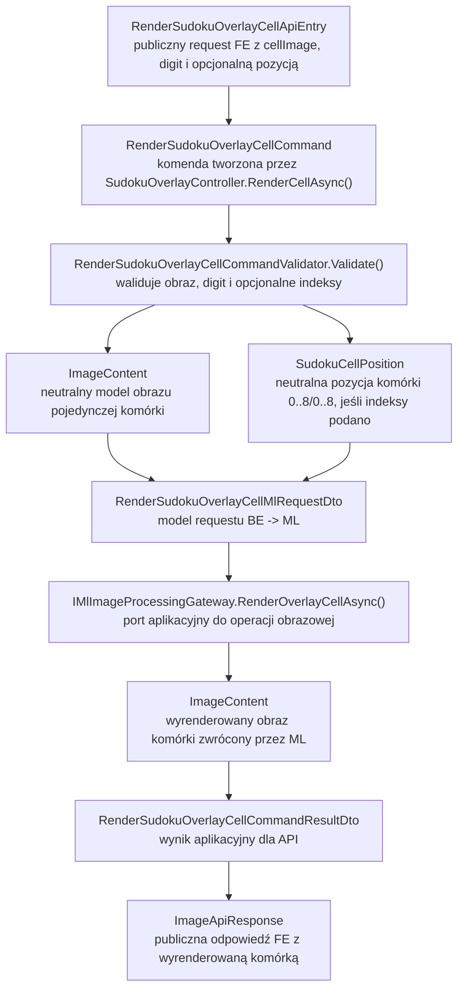
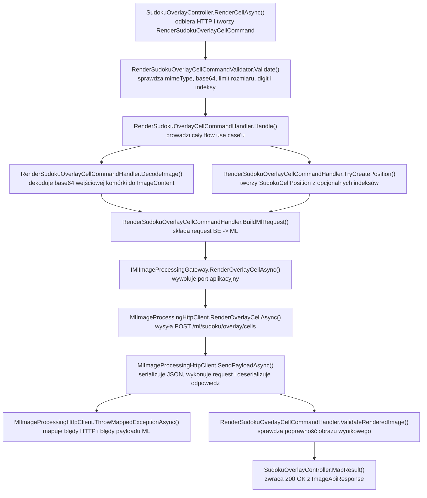

# UC-05D-BE - Plan implementacyjny dla `POST /api/sudoku/overlay/cells`

## 1) Przeznaczenie endpointa
- Endpoint `POST /api/sudoku/overlay/cells` realizuje backendową część `UC-05D` dla wariantu podstawowego, czyli renderowania pojedynczej cyfry na pojedynczej komórce sudoku.
- Wejściem jest obraz pojedynczej komórki z etapu `UC-04` oraz cyfra `1..9`, która ma zostać na tej komórce narysowana.
- Wynikiem jest wyrenderowany obraz tej samej komórki jako `ImageApiResponse`.
- Endpoint nie skleja planszy `9x9`, nie zarządza animacją i nie decyduje, które komórki wymagają overlay. To pozostaje po stronie `FE`.
- Endpoint nie uruchamia solvera, nie buduje `recognizedGrid`, nie odczytuje aktywnego modelu inferencyjnego i niczego nie zapisuje trwale.
- `BE` pozostaje właścicielem publicznego kontraktu, walidacji wejścia i mapowania błędów, a `ML` wykonuje techniczny render obrazu.
- Plan dotyczy wyłącznie części `BE`.

## 2) Zakres, założenia i punkty odniesienia
- Plan opiera się na:
  - `.ai/prd.md`,
  - `.ai/feature/uc-05d-overview.md`,
  - `.ai/DokumentacjaDeployuRuntimeSerwera.md`,
  - istniejących planach `UC-05A`, `UC-05B` i `UC-05E`,
  - aktualnej architekturze `src/Backend/Sudoku`.
- Nie sugerujemy się tym, co aktualnie może być już zrobione po stronie `FE` i `ML`; plan opisuje docelową odpowiedzialność `BE`.
- Publiczna ścieżka solve pozostaje niechroniona tokenem administracyjnym z `UC-13`; overlay jest częścią publicznego workflow rozwiązywania sudoku.
- Wariant ambitny renderowania na oryginalnym zdjęciu wejściowym z transformacją perspektywy pozostaje poza zakresem tego endpointa.
- `rowIndex` i `columnIndex` są polami opcjonalnymi o charakterze diagnostycznym. Mogą pomagać w logowaniu i ewentualnym rozszerzeniu kontraktu, ale nie stają się źródłem prawdy o stanie planszy.
- `BE` nie może zakładać istnienia aktywnego modelu inferencyjnego dla overlay, bo renderowanie per-komórka nie korzysta z `models/active/inference.json`.
- Lokalnie wartości konfiguracyjne mają być wpisane jawnie do `appsettings.local.json`.
- Produkcyjnie workflow backendu ma nadal generować `appsettings.production.json`; nie dokładamy ręcznej, równoległej konfiguracji poza istniejącym loaderem backendu.

## 3) Co już istnieje i co należy reuse'ować

### 3.1 Elementy już dostępne w repo
- Publiczne kontrakty obrazu:
  - `Sudoku/Contracts/ImageApiEntry.cs`,
  - `Sudoku/Contracts/ImageApiResponse.cs`,
  - `Sudoku/Contracts/ErrorApiResponse.cs`.
- Domenowy model obrazu:
  - `Models/Images/ImageContent.cs`.
- Domenowy model pozycji komórki:
  - `Models/Sudoku/SudokuCellPosition.cs`.
- Port i klient `BE -> ML` dla operacji obrazowych:
  - `Application/Abstractions/IMlImageProcessingGateway.cs`,
  - `Infrastructure/Ml/MlImageProcessingHttpClient.cs`.
- Konfiguracja połączenia z `ML`:
  - `Infrastructure/Configuration/MlServiceOptions.cs`.
- Konfiguracja runtime i workflow:
  - `Sudoku/Program.cs`,
  - `Sudoku/appsettings.json`,
  - `Sudoku/appsettings.local.json`,
  - `Sudoku/appsettings.production.json`,
  - `.github/workflows/backend-cd.yml`.
- Wzorzec cienkiego kontrolera z walidacją i mapowaniem błędów:
  - `Sudoku/Controllers/SudokuCellsController.cs`.

### 3.2 Wniosek architektoniczny
- Nie należy tworzyć nowego klienta HTTP typu `MlSudokuOverlayHttpClient`, ponieważ repo już ma ogólny adapter do synchronicznych operacji obrazowych wykonywanych przez `ML`.
- Najlepszy reuse:
  - rozszerzyć `IMlImageProcessingGateway`,
  - rozszerzyć `MlImageProcessingHttpClient`,
  - uogólnić wewnętrzny helper wysyłający request do `ML`, aby wspierał nie tylko `PUT`, ale także `POST`.
- Nie należy tworzyć osobnego resolvera aktywnego modelu ani używać istniejącego `IActiveModelResolver`, bo overlay per-komórka nie zależy od aktywnego modelu inferencyjnego.
- Nie należy dublować modelu pozycji komórki; opcjonalne indeksy można mapować do istniejącego `SudokuCellPosition`.

## 4) Kontrakty API FE i ML

### 4.1 FE -> BE (`POST /api/sudoku/overlay/cells`)
- Request body: `RenderSudokuOverlayCellApiEntry`.
- Proponowany publiczny kontrakt:

```json
{
  "cellImage": {
    "mimeType": "image/png",
    "base64": "iVBORw0KGgoAAA..."
  },
  "digit": 4,
  "rowIndex": 0,
  "columnIndex": 2
}
```

- Pola:
  - `cellImage: ImageApiEntry` - wymagane,
  - `digit: int` - wymagane, zakres `1..9`,
  - `rowIndex: int?` - opcjonalne, zakres `0..8`,
  - `columnIndex: int?` - opcjonalne, zakres `0..8`.
- Rekomendowana reguła walidacyjna:
  - albo oba pola `rowIndex` i `columnIndex` są pominięte,
  - albo oba są obecne i mieszczą się w zakresie `0..8`.

### 4.2 BE -> FE
- `200 OK` -> `ImageApiResponse`
- `400 Bad Request` -> `ErrorApiResponse`
- `422 Unprocessable Entity` -> `ErrorApiResponse`
- `502 Bad Gateway` -> `ErrorApiResponse`
- `503 Service Unavailable` -> `ErrorApiResponse`
- `504 Gateway Timeout` -> `ErrorApiResponse`
- `500 Internal Server Error` -> `ErrorApiResponse`

Przykład odpowiedzi sukcesu:

```json
{
  "mimeType": "image/png",
  "base64": "iVBORw0KGgoAAA..."
}
```

Rekomendowane `errorType`:
- `invalid_request`
- `digit_out_of_range`
- `cell_image_too_large`
- `cell_position_invalid`
- `cell_image_not_processable`
- `overlay_render_not_possible`
- `ml_invalid_response`
- `ml_unavailable`
- `ml_timeout`

### 4.3 BE -> ML (`POST /ml/sudoku/overlay/cells`)
- `BE` powinien przekazać tylko dane potrzebne do renderowania pojedynczej komórki.
- Proponowany minimalny payload:

```json
{
  "cellImage": {
    "mimeType": "image/png",
    "base64": "iVBORw0KGgoAAA..."
  },
  "digit": 4,
  "rowIndex": 0,
  "columnIndex": 2
}
```

- `rowIndex` i `columnIndex` pozostają opcjonalne także w komunikacji wewnętrznej `BE -> ML`.
- `BE` nie powinien dopisywać do tego requestu całego `recognizedGrid`, `solvedGrid`, stanu sesji solve ani żadnych ścieżek systemowych.

### 4.4 ML -> BE
- Odpowiedź sukcesu:

```json
{
  "mimeType": "image/png",
  "base64": "iVBORw0KGgoAAA..."
}
```

- `BE` musi zwalidować odpowiedź technicznie:
  - `mimeType` nie może być puste,
  - `base64` nie może być puste,
  - `base64` musi dać się zdekodować,
  - wynikowy obraz nie może być pusty.

## 5) Zachowanie per warstwa

### API (`Sudoku`)
- Wystawia publiczny endpoint `POST /api/sudoku/overlay/cells`.
- Binduje `RenderSudokuOverlayCellApiEntry`.
- Tworzy komendę `RenderSudokuOverlayCellCommand`.
- Wywołuje `MediatR`.
- Mapuje wynik na `ImageApiResponse`.
- Mapuje wyjątki walidacji i wyjątków `ML` na `ErrorApiResponse`.
- Nie wykonuje:
  - dekodowania `base64`,
  - rysowania overlay,
  - sklejania planszy,
  - operacji plikowych,
  - odczytu konfiguracji `ML` bezpośrednio,
  - wywołań `HttpClient` do `ML`.

### Application (`Application`)
- Waliduje request:
  - obecność `cellImage`,
  - obecność i poprawność `mimeType`,
  - obecność i poprawność `base64`,
  - rozmiar obrazu po dekodowaniu,
  - zakres `digit = 1..9`,
  - spójność opcjonalnych indeksów `rowIndex` / `columnIndex`.
- Orkiestruje use case.
- Zamienia publiczny obraz wejściowy na neutralny `ImageContent`.
- Opcjonalnie tworzy `SudokuCellPosition`.
- Buduje DTO requestu do portu `ML`.
- Wywołuje `IMlImageProcessingGateway.RenderOverlayCellAsync(...)`.
- Waliduje zwrócony obraz jako poprawny wynik biznesowo-techniczny.
- Zwraca lekki DTO wyniku do warstwy `API`.
- Nie zna:
  - `HttpStatusCode`,
  - `ControllerBase`,
  - `HttpClient`,
  - szczegółów serializacji JSON.

### Domain / Models (`Models`)
- Reuse'uje neutralne modele:
  - `ImageContent`,
  - `SudokuCellPosition`.
- Pilnuje niezmienników:
  - pozycja komórki musi mieścić się w `0..8`,
  - obraz nie niesie zależności od HTTP ani `ML`.
- Nie wymaga nowego modelu domenowego tylko po to, by zwrócić wyrenderowany obraz, bo tę rolę już spełnia `ImageContent`.
- Nie zna:
  - `ImageApiEntry`,
  - `ImageApiResponse`,
  - `ErrorApiResponse`,
  - konfiguracji `appsettings`,
  - transportu `ML`.

### Infrastructure (`Infrastructure`)
- Implementuje komunikację `BE -> ML`.
- Reuse'uje istniejący `MlImageProcessingHttpClient`.
- Rozszerza istniejący gateway o nową operację renderowania overlay.
- Uogólnia helper HTTP tak, aby wspierał zarówno obecne `PUT`, jak i nowe `POST`.
- Mapuje błędy transportowe i kontraktowe `ML` na wyjątki aplikacyjne/infrastrukturalne:
  - timeout,
  - brak dostępności,
  - niepoprawny JSON,
  - niepoprawny payload obrazu,
  - biznesowy błąd renderowania zwrócony przez `ML`.
- Nie podejmuje decyzji:
  - czy dane wejściowe są biznesowo poprawne dla `FE`,
  - czy pozycja komórki ma znaczenie dla logiki workflow,
  - czy dany overlay powinien zostać wykonany w ogóle.

## 6) Pliki per warstwa i odpowiedzialności

### API (`src/Backend/Sudoku/Sudoku`)
- `[NOWY]` `Controllers/SudokuOverlayController.cs`
  - `[ApiController]`, `[Route("api/sudoku/overlay")]`
  - akcja `RenderCellAsync()` dla `POST /api/sudoku/overlay/cells`
  - mapowanie `RenderSudokuOverlayCellCommandResultDto` -> `ImageApiResponse`
  - mapowanie błędów na `400/422/502/503/504/500`
- `[NOWY]` `Contracts/RenderSudokuOverlayCellApiEntry.cs`
  - publiczny request model:
    - `CellImage`
    - `Digit`
    - `RowIndex`
    - `ColumnIndex`
- `[REUSE]` `Contracts/ImageApiEntry.cs`
  - publiczny model wejściowego obrazu
- `[REUSE]` `Contracts/ImageApiResponse.cs`
  - publiczny model odpowiedzi z wyrenderowanym obrazem
- `[REUSE]` `Contracts/ErrorApiResponse.cs`
  - wspólny model błędu
- `[MODYFIKACJA]` `Program.cs`
  - bind i walidacja nowych typed options `SudokuOverlayOptions`
- `[MODYFIKACJA]` `appsettings.local.json`
  - lokalne wartości na sztywno dla:
    - `MlService.SudokuOverlayCellsPath`
    - `SudokuOverlay.MaxInlineCellImageSizeBytes`
- `[MODYFIKACJA]` `appsettings.production.json`
  - placeholdery dla tych samych wartości, nadpisywane przez workflow

### Application (`src/Backend/Sudoku/Application`)
- `[NOWY]` `SudokuOverlay/RenderSudokuOverlayCellCommand.cs`
  - komenda MediatR przyjmująca dane publicznego requestu
- `[NOWY]` `SudokuOverlay/RenderSudokuOverlayCellCommandValidator.cs`
  - walidacja payloadu publicznego
- `[NOWY]` `SudokuOverlay/RenderSudokuOverlayCellCommandHandler.cs`
  - główna orkiestracja use case'u
- `[NOWY]` `SudokuOverlay/RenderSudokuOverlayCellCommandResultDto.cs`
  - DTO wyniku dla API:
    - `MimeType`
    - `Base64`
- `[NOWY]` `SudokuOverlay/RenderSudokuOverlayCellErrorTypes.cs`
  - stałe `errorType` dla endpointa
- `[NOWY]` `SudokuOverlay/RenderSudokuOverlayCellMlRequestDto.cs`
  - DTO requestu wysyłanego do portu `ML`
- `[NOWY]` `SudokuOverlay/SudokuOverlayOptions.cs`
  - typed options specyficzne dla use case'u:
    - `MaxInlineCellImageSizeBytes`
- `[REUSE]` `Abstractions/IMlImageProcessingGateway.cs`
  - rozszerzenie o metodę `RenderOverlayCellAsync(...)`
- `[REUSE]` `Ml/MlOperationFailedException.cs`
  - biznesowy błąd operacji `ML`
- `[REUSE]` `Ml/MlServiceUnavailableException.cs`
  - niedostępność `ML`
- `[REUSE]` `Ml/MlServiceTimeoutException.cs`
  - timeout `ML`
- `[BRAK ZMIAN]` `DependencyInjection.cs`
  - MediatR i walidatory zostaną wykryte automatycznie po dodaniu nowych plików

### Domain / Models (`src/Backend/Sudoku/Models`)
- `[REUSE]` `Images/ImageContent.cs`
  - neutralny model obrazu wejściowego i wyjściowego
- `[REUSE]` `Sudoku/SudokuCellPosition.cs`
  - neutralny model pozycji komórki dla opcjonalnych indeksów
- `[BRAK NOWYCH PLIKÓW]`
  - ten endpoint nie wymaga nowego modelu domenowego

### Infrastructure (`src/Backend/Sudoku/Infrastructure`)
- `[MODYFIKACJA]` `Ml/MlImageProcessingHttpClient.cs`
  - dodać `RenderOverlayCellAsync(...)`
  - serializacja requestu do `POST /ml/sudoku/overlay/cells`
  - deserializacja `ImageApiResponse` z `ML`
  - walidacja payloadu obrazu
  - mapowanie błędów HTTP / JSON
  - uogólnienie helpera, aby wspierał `HttpMethod.Post`
- `[MODYFIKACJA]` `Configuration/MlServiceOptions.cs`
  - dodać `SudokuOverlayCellsPath`
- `[MODYFIKACJA]` `DependencyInjection.cs`
  - walidacja `MlService.SudokuOverlayCellsPath`
  - nadal jeden klient HTTP do synchronicznych operacji obrazowych `BE -> ML`

### Workflow (`.github/workflows`)
- `[MODYFIKACJA]` `.github/workflows/backend-cd.yml`
  - dodać env:
    - `BE_ML_SUDOKU_OVERLAY_CELLS_PATH`
    - `BE_SUDOKU_OVERLAY_MAX_INLINE_CELL_IMAGE_SIZE_BYTES`
  - dopisać walidację obecności zmiennych
  - dopisać podstawienie do generatora `appsettings.production.json`
- `[BRAK ZMIAN]` pozostałe workflow
  - `frontend-cd.yml` bez zmian,
  - `ml-cd.yml` bez zmian po stronie tego planu BE,
  - `only-dev-to-main.yml` bez zmian.

## 7) Weryfikacja usług Infrastructure i antyduplikacja
- W repo już istnieje `IMlImageProcessingGateway` oraz `MlImageProcessingHttpClient`.
- Overlay per-komórka jest nadal operacją obrazową `request -> image out`, więc technicznie pasuje do już istniejącego adaptera.
- Nie należy tworzyć:
  - `IMlSudokuOverlayGateway`,
  - `MlSudokuOverlayHttpClient`,
  - drugiego klienta `HttpClient` tylko dlatego, że endpoint używa `POST`.
- Zamiast tego należy:
  - rozszerzyć istniejący port,
  - uogólnić helper wysyłający requesty JSON do `ML`,
  - zachować wspólne mapowanie błędów `ML`.
- W repo już istnieją neutralne typy `ImageContent` i `SudokuCellPosition`.
- Wniosek:
  - nie tworzyć kolejnych, równoległych modeli pozycji ani obrazu.
- `Infrastructure` ma pozostać implementacją I/O, a nie warstwą walidującą semantykę overlay; logika typu "czy oba indeksy podano razem" należy do `Application`.

## 8) Przepływ w obrębie BE
1. `FE` wysyła `POST /api/sudoku/overlay/cells` z `RenderSudokuOverlayCellApiEntry`.
2. `SudokuOverlayController.RenderCellAsync()` buduje `RenderSudokuOverlayCellCommand`.
3. Pipeline `FluentValidation` sprawdza:
   - `cellImage.mimeType`,
   - `cellImage.base64`,
   - limit rozmiaru obrazu,
   - `digit` w zakresie `1..9`,
   - spójność i zakres opcjonalnych indeksów `rowIndex` / `columnIndex`.
4. `RenderSudokuOverlayCellCommandHandler.Handle()` dekoduje `base64` do `ImageContent`.
5. Handler, jeśli indeksy są obecne, tworzy `SudokuCellPosition`.
6. Handler buduje `RenderSudokuOverlayCellMlRequestDto`.
7. Handler wywołuje `IMlImageProcessingGateway.RenderOverlayCellAsync(...)`.
8. `MlImageProcessingHttpClient` wysyła `POST` na `MlService.SudokuOverlayCellsPath`.
9. `ML` zwraca obraz pojedynczej wyrenderowanej komórki.
10. `Infrastructure` waliduje payload obrazu i zamienia go na `ImageContent`.
11. `Application` mapuje wynik do `RenderSudokuOverlayCellCommandResultDto`.
12. Kontroler zwraca `200 OK` z `ImageApiResponse`.
13. `FE` odbiera obraz komórki i lokalnie składa finalny obraz planszy `9x9`.

## 9) Główne funkcje
- `SudokuOverlayController.RenderCellAsync(...)`
- `RenderSudokuOverlayCellCommandValidator.Validate(...)`
- `RenderSudokuOverlayCellCommandHandler.Handle(...)`
- `RenderSudokuOverlayCellCommandHandler.BuildMlRequest(...)`
- `IMlImageProcessingGateway.RenderOverlayCellAsync(...)`
- `MlImageProcessingHttpClient.RenderOverlayCellAsync(...)`
- `MlImageProcessingHttpClient.SendPayloadAsync(...)`
- `MlImageProcessingHttpClient.ThrowMappedExceptionAsync(...)`
- `SudokuCellPosition.SudokuCellPosition(int row, int column)`

## 10) Wyjątki, fallbacki i zachowanie błędowe

### 10.1 Publiczne statusy HTTP
- `200 OK`
  - request jest poprawny,
  - `ML` zwróciło poprawny obraz wyrenderowanej komórki.
- `400 Bad Request`
  - brak `cellImage`,
  - brak `mimeType`,
  - brak `base64`,
  - niepoprawny `base64`,
  - obraz przekracza limit rozmiaru,
  - `digit` spoza zakresu `1..9`,
  - podano tylko jeden z indeksów,
  - `rowIndex` lub `columnIndex` spoza zakresu `0..8`.
- `422 Unprocessable Entity`
  - `ML` odrzuciło obraz komórki jako nieprzetwarzalny,
  - `ML` przyjęło request technicznie, ale nie może wykonać renderu na tej komórce.
- `502 Bad Gateway`
  - `ML` zwróciło niepoprawny JSON,
  - `ML` zwróciło pusty albo niekompletny obraz,
  - `ML` zwróciło obraz z niepoprawnym `base64`.
- `503 Service Unavailable`
  - `ML` nieosiągalne,
  - błąd sieciowy `BE -> ML`.
- `504 Gateway Timeout`
  - `ML` nie odpowiedziało w limicie czasu.
- `500 Internal Server Error`
  - błąd techniczny backendu, którego nie da się zmapować do kontraktu wyżej.

### 10.2 Fallbacki
- Brak fallbacku do renderowania po stronie `BE`.
- Brak fallbacku do zwrócenia oryginalnej komórki jako sukcesu, jeśli `ML` nie potrafi wykonać overlay.
- Brak fallbacku do aktywnego modelu inferencyjnego.
- Brak fallbacku do automatycznego dorysowania cyfry po stronie `FE` przez kontrakt tego endpointa.
- Brak cichego ignorowania błędu `ML`.
- Brak retriable loop w ścieżce requestu HTTP.

### 10.3 Zachowanie w scenariuszach granicznych
- `rowIndex` i `columnIndex` nie są podane:
  - request jest legalny,
  - overlay nadal działa.
- Podano tylko `rowIndex` albo tylko `columnIndex`:
  - `400 invalid_request`.
- `ML` zwraca poprawny obraz, ale z innym `mimeType` niż wejściowy:
  - legalne, jeśli payload jest spójny technicznie; `BE` nie powinien narzucać zgodności formatu wejście-wyjście, o ile kontrakt obrazu pozostaje poprawny.
- `ML` zwraca pusty obraz:
  - `502 ml_invalid_response`.

## 11) Specyficzna logika i pseudokod

### 11.1 Pseudokod aplikacyjny

```text
handleRenderOverlayCell(command):
  ensureCommandValidated(command)

  imageBytes = base64Decode(command.cellImageBase64)
  image = ImageContent(command.cellImageMimeType, imageBytes)

  position = null
  if command.rowIndex != null and command.columnIndex != null:
    position = SudokuCellPosition(command.rowIndex, command.columnIndex)

  mlRequest = RenderSudokuOverlayCellMlRequest(
    cellImage = image,
    digit = command.digit,
    position = position
  )

  renderedImage = mlImageProcessingGateway.renderOverlayCell(mlRequest)

  if renderedImage.mimeType is empty:
    throw ml_invalid_response

  if renderedImage.bytes is empty:
    throw ml_invalid_response

  return RenderSudokuOverlayCellCommandResult(
    mimeType = renderedImage.mimeType,
    base64 = base64Encode(renderedImage.bytes)
  )
```

### 11.2 Pseudokod uogólnionego helpera HTTP

```text
sendPayload(method, relativePath, payload):
  response = httpClient.sendJson(method, relativePath, payload)

  if response.status is not success:
    throwMappedException(response)

  parsed = response.readJson()
  if parsed is null:
    throw ml_invalid_response

  return parsed
```

### 11.3 Pseudokod kontrolera

```text
renderCell(entry):
  command = RenderSudokuOverlayCellCommand(
    cellImageMimeType = entry.cellImage.mimeType,
    cellImageBase64 = entry.cellImage.base64,
    digit = entry.digit,
    rowIndex = entry.rowIndex,
    columnIndex = entry.columnIndex
  )

  result = sender.send(command)

  return 200 ImageApiResponse(
    mimeType = result.mimeType,
    base64 = result.base64
  )
```

## 12) Mermaid flowchart - flow modeli



## 13) Mermaid flowchart - logika aplikacji z funkcjami



## 14) Workflow GitHub i konfiguracja runtime
- Lokalnie:
  - `appsettings.local.json` ma przechowywać konkretne lokalne wartości na sztywno.
  - Nie dokładamy drugiego systemu konfiguracji poza aktualnym loaderem backendu.
- Produkcyjnie:
  - `backend-cd.yml` ma dopisać nowe zmienne środowiskowe i podstawiać je do `appsettings.production.json`.
  - Workflow zmienia overlay produkcyjny, nie plik bazowy `appsettings.json`.
  - Zgodnie z dokumentacją deployu workflow nie dotyka runtime state w katalogach `shared`.

### 14.1 Nowa sekcja konfiguracyjna BE

```json
{
  "SudokuOverlay": {
    "MaxInlineCellImageSizeBytes": 10485760
  }
}
```

### 14.2 Rozszerzenie `MlService`

```json
{
  "MlService": {
    "SudokuOverlayCellsPath": "/ml/sudoku/overlay/cells"
  }
}
```

### 14.3 Zmiany w `backend-cd.yml`
- Dodać env:
  - `BE_ML_SUDOKU_OVERLAY_CELLS_PATH`
  - `BE_SUDOKU_OVERLAY_MAX_INLINE_CELL_IMAGE_SIZE_BYTES`
- Dodać walidację obecności tych zmiennych.
- Sparsować typy:
  - `MaxInlineCellImageSizeBytes` jako integer.
- W generatorze `appsettings.production.json` ustawić:
  - `config["MlService"]["SudokuOverlayCellsPath"]`
  - `config["SudokuOverlay"]["MaxInlineCellImageSizeBytes"]`

### 14.4 Uwagi deployowe
- Nie ma potrzeby zmiany routingu `nginx`, bo endpoint jest publicznym `/api/...` obsługiwanym już przez backend.
- Nie ma potrzeby zmiany innych workflow niż `backend-cd.yml` po stronie tego planu BE.
- W `local` ścieżka do `ML` jest wpisana na sztywno w `appsettings.local.json`.

## 15) Logging
- Cel logów:
  - diagnostyka błędów renderowania,
  - łatwe powiązanie problemu z cyfrą i opcjonalną pozycją komórki,
  - brak spamowania logami i brak logowania danych binarnych.

### 15.1 `Information`
- przyjęto `POST /api/sudoku/overlay/cells`
- rozpoczęto renderowanie overlay dla pojedynczej komórki
- zakończono renderowanie overlay sukcesem

### 15.2 `Warning`
- request ma niespójne indeksy pozycji
- `ML` odrzuciło komórkę jako nieprzetwarzalną
- `ML` zwróciło biznesowy błąd renderowania

### 15.3 `Error`
- błąd sieciowy do `ML`
- timeout `ML`
- niepoprawny JSON albo payload obrazu z `ML`
- nieobsłużony błąd backendu

### 15.4 Guardraile logowania
- nie logować `base64`
- nie logować pełnych obrazów wejściowych ani wyjściowych
- nie logować pełnych payloadów `ML`
- nie logować ścieżek absolutnych w odpowiedzi API
- wystarczy logować:
  - `digit`
  - `rowIndex`
  - `columnIndex`
  - `errorType`
  - status HTTP `ML`

## 16) Inne istotne reguły
- Nie zmieniać istniejących kontraktów:
  - `ImageApiEntry`
  - `ImageApiResponse`
  - `ErrorApiResponse`
  - `ImageContent`
  - `SudokuCellPosition`
- Nie przenosić logiki renderowania do `BE`; backend ma pozostać orkiestratorem i walidatorem publicznego kontraktu.
- Nie dopisywać do requestu publicznego całej planszy ani `recognizedGrid`.
- Nie uzależniać overlay od aktywnego modelu inferencyjnego z `UC-10`.
- Kontroler ma pozostać cienki; cała logika workflow ma być w `Application`.
- `Application` ma podejmować decyzje walidacyjne i orkiestracyjne, a `Infrastructure` ma realizować `HTTP/I/O`.
- Jeśli w przyszłości `UC-14` wprowadzi parametry stylu renderowania z `UI`, mają one zostać dodane do istniejącego requestu biznesowego i walidowane przez `BE`, a nie trzymane równolegle w `appsettings`.

## 17) Kolejność implementacji kodu dla historyjki
1. Dodać `RenderSudokuOverlayCellApiEntry`.
2. Dodać `SudokuOverlayOptions`.
3. Rozszerzyć `MlServiceOptions` o `SudokuOverlayCellsPath`.
4. Uzupełnić `Program.cs`, `appsettings.local.json` i `appsettings.production.json`.
5. Dodać `RenderSudokuOverlayCellCommand`.
6. Dodać `RenderSudokuOverlayCellErrorTypes`.
7. Dodać `RenderSudokuOverlayCellMlRequestDto`.
8. Dodać `RenderSudokuOverlayCellCommandResultDto`.
9. Dodać `RenderSudokuOverlayCellCommandValidator`.
10. Rozszerzyć `IMlImageProcessingGateway` o `RenderOverlayCellAsync(...)`.
11. Rozszerzyć `MlImageProcessingHttpClient`:
    - o nową metodę renderowania,
    - o wsparcie `POST` w helperze HTTP.
12. Zaimplementować `RenderSudokuOverlayCellCommandHandler`.
13. Dodać `SudokuOverlayController`.
14. Zaktualizować `.github/workflows/backend-cd.yml`.
15. Dodać testy jednostkowe walidatora.
16. Dodać testy jednostkowe handlera.
17. Dodać testy `Infrastructure` dla klienta `ML`.
18. Dodać testy kontrolera / integracyjne endpointa.

## 18) Guardraile implementacyjne
- Nie używać minimal API `MapPost`; użyć kontrolera ASP.NET.
- Nie wywoływać `ML` bezpośrednio z kontrolera.
- Nie tworzyć nowego klienta HTTP tylko dla overlay, jeśli istniejący `MlImageProcessingHttpClient` da się rozszerzyć.
- Nie duplikować modeli obrazu ani pozycji komórki.
- Nie hardcodować ścieżki `POST /ml/sudoku/overlay/cells` w kodzie poza typed options.
- Nie zwracać do `FE` błędu systemowego jako sukcesu z oryginalną komórką.
- Nie logować danych binarnych.
- Nie mieszać kontraktów HTTP z modelami neutralnymi warstwy `Models`.
- Nie dopisywać zależności od aktywnego modelu, solvera ani storage sesji solve.

## 19) Zależności pomiędzy historyjkami
- Wejściowe:
  - `UC-04`
    - dostarcza siatkę obrazów komórek, z której `FE` wybiera pojedynczą komórkę do renderu
  - `UC-05A`
    - potwierdza wzorzec publicznego requestu z obrazem komórki i reuse `IMlImageProcessingGateway`
  - `UC-05B`
    - dostarcza rozwiązanie `solvedGrid`, na podstawie którego `FE` wie, jakie cyfry trzeba dorysować
  - `UC-05E`
    - może wykorzystywać ten endpoint do dynamicznego budowania widoku, ale nie zmienia jego kontraktu
- Brak zależności od:
  - `UC-10`
    - overlay per-komórka nie wymaga aktywnego modelu inferencyjnego
  - `UC-13`
    - endpoint pozostaje publiczny
- Potencjalne zależności przyszłe:
  - `UC-14`
    - jeśli pojawią się jawne parametry stylu renderowania z `UI`, należy je dodać do tego samego requestu, nie do osobnego endpointu konfiguracji

## 20) Plan testów minimum

### 20.1 Unit - validator
- poprawny request z `digit = 4` i bez pozycji
- poprawny request z `digit = 7` i pozycją `rowIndex = 0`, `columnIndex = 2`
- brak `cellImage`
- pusty `mimeType`
- pusty `base64`
- niepoprawny `base64`
- `digit = 0`
- `digit = 10`
- podano tylko `rowIndex`
- podano tylko `columnIndex`
- `rowIndex = -1`
- `columnIndex = 9`
- obraz większy niż `MaxInlineCellImageSizeBytes`

### 20.2 Unit - handler
- sukces: `ML` zwraca poprawny obraz
- sukces: request bez pozycji
- sukces: request z pozycją
- `ML` zwraca pusty `mimeType` -> `ml_invalid_response`
- `ML` zwraca pusty obraz -> `ml_invalid_response`
- `ML` niedostępne -> `MlServiceUnavailableException`
- timeout `ML` -> `MlServiceTimeoutException`

### 20.3 Infrastructure
- `RenderOverlayCellAsync(...)` wysyła `POST` na właściwą ścieżkę
- poprawnie mapuje odpowiedź obrazową
- mapuje `422` na `MlOperationFailedException`
- mapuje `503` na `MlServiceUnavailableException`
- mapuje `504` na `MlServiceTimeoutException`
- mapuje zły JSON na `MlOperationFailedException`
- mapuje niepoprawny `base64` obrazu z `ML` na `MlOperationFailedException`

### 20.4 API / integration
- `200 OK` dla poprawnego requestu
- `400 Bad Request` dla błędnego payloadu
- `422 Unprocessable Entity` dla biznesowego odrzucenia przez `ML`
- `502 Bad Gateway` dla błędnej odpowiedzi `ML`
- `503 Service Unavailable` dla niedostępności `ML`
- `504 Gateway Timeout` dla timeoutu `ML`

## 21) Podsumowanie decyzji architektonicznych
- `POST /api/sudoku/overlay/cells` jest publicznym, synchronicznym endpointem renderowania pojedynczej komórki.
- `FE` decyduje, które komórki wysłać i samo składa finalny obraz planszy.
- `BE` waliduje kontrakt, orkiestruje request i mapuje błędy.
- `ML` wykonuje właściwy overlay obrazu.
- Reuse'ujemy istniejący `IMlImageProcessingGateway` i `MlImageProcessingHttpClient`, zamiast tworzyć nowy adapter.
- `Domain/Models` nie wymagają nowych plików; wystarczy reuse `ImageContent` i `SudokuCellPosition`.
- Produkcyjny workflow wymaga jedynie dopisania nowej ścieżki `ML` oraz limitu rozmiaru obrazu do `appsettings.production.json`.
