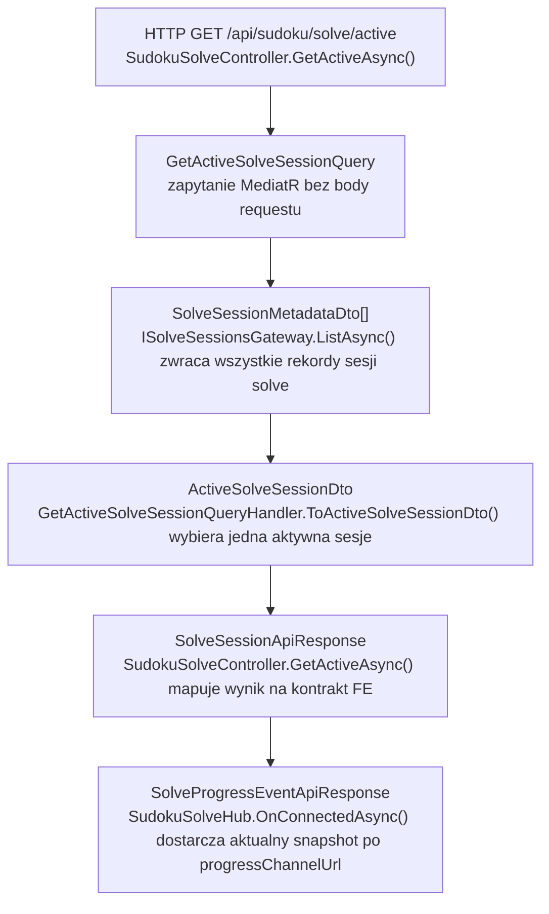
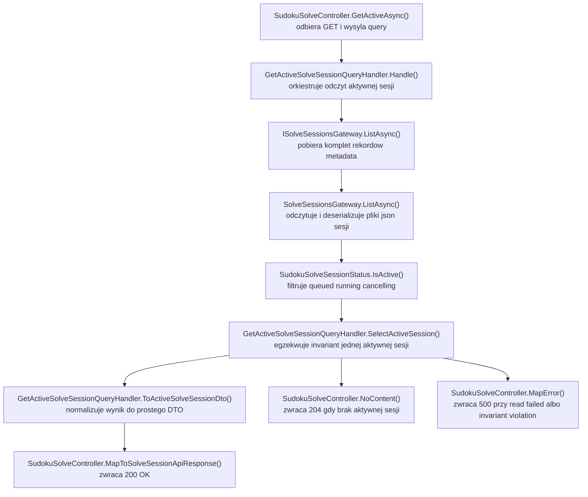

# UC-05E-BE - Plan implementacyjny dla `GET /api/sudoku/solve/active`

## 1) Przeznaczenie endpointa
- Endpoint `GET /api/sudoku/solve/active` zwraca aktualnie aktywną sesję rozwiązywania sudoku albo `204 No Content`, gdy żadna aktywna sesja nie istnieje.
- Celem endpointa jest odzyskanie monitoringu po odświeżeniu widoku, utracie stanu w `FE` albo po wcześniejszym `409 Conflict` z `POST /api/sudoku/solve`.
- Endpoint nie uruchamia solvera, nie modyfikuje sesji, nie liczy `currentGrid` i nie komunikuje się z `ML`.
- To jest lekki odczyt systemowego `source of truth` utrzymywanego po stronie `Backendu`.
- Zwracany payload ma celowo ten sam kształt co odpowiedź startowa z `UC-05B`, czyli `SolveSessionApiResponse`, aby `FE` mogło po `200 OK` od razu połączyć się z wcześniej ustalonym `progressChannelUrl`.
- Ten krok dotyczy wyłącznie `BE`.

## 2) Zakres i założenia
- Plan opiera się na:
  - `.ai/prd.md`,
  - `.ai/feature/uc-05-overview.md`,
  - `.ai/feature/uc-05b-overview.md`,
  - `.ai/feature/uc-05e-overview.md`,
  - `.ai/DokumentacjaDeployuRuntimeSerwera.md`,
  - istniejącym planie `UC-05B`,
  - istniejącym planie `UC-05E` dla `SignalR /ws/sudoku/solving/{solveSessionId}`.
- Nie sugerujemy się aktualnym stanem `FE` ani `ML`; plan opisuje docelowe zachowanie backendu.
- `Backend` pozostaje właścicielem statusów sesji solve i jedynym źródłem prawdy dla aktywności sesji.
- Ścieżka solve pozostaje publiczna, więc endpoint nie wymaga tokenu administracyjnego z `UC-13`.
- Aktywna sesja solve w `MVP` to sesja w statusie:
  - `queued`,
  - `running`,
  - `cancelling`.
- Sesje terminalne:
  - `completed`,
  - `failed`,
  - `cancelled`
  nie są zwracane przez ten endpoint i skutkują `204 No Content`, jeśli nie istnieje inna aktywna sesja.
- W `MVP` obowiązuje invariant dokładnie jednej aktywnej sesji solve w obrębie backendu.
- Endpoint ma reuse'ować istniejące storage sesji i nie może wprowadzać drugiego źródła stanu w pamięci.

## 3) Co już jest gotowe i co należy reuse'ować

### 3.1 Już istniejące elementy z wcześniejszych historyjek
- `POST /api/sudoku/solve` w `SudokuSolveController`.
- Kontrakt `SolveSessionApiResponse`.
- Storage sesji solve:
  - `ISolveSessionsGateway`,
  - `SolveSessionsGateway`,
  - `SolveSessionMetadataDto`.
- Workflow sesji:
  - `StartSudokuSolveCommandHandler`,
  - `SudokuSolveSessionRunner`,
  - `SudokuSolveBackgroundWorker`.
- Statusy i helpery domenowe:
  - `SudokuSolveSessionStatus`,
  - `SudokuSolveEventType`.
- Realtime po `SignalR`:
  - `SudokuSolveHub`,
  - `SignalRSudokuSolveEventPublisher`,
  - `GetSolveSessionRealtimeSnapshotQueryHandler`.
- Konfiguracja storage sesji:
  - `SudokuSolveSessionsStorageOptions`,
  - `appsettings.local.json`,
  - `appsettings.production.json`,
  - `.github/workflows/backend-cd.yml`.

### 3.2 Wniosek architektoniczny
- Nie należy projektować nowego storage dla aktywnej sesji.
- Nie należy dodawać osobnego adaptera `Infrastructure` typu `IActiveSolveSessionGateway`.
- Nie należy dodawać cache in-memory dla odpowiedzi endpointa.
- Selekcja "co jest aktywne" należy do `Application`, nie do `Infrastructure`.
- Po `200 OK` klient ma używać istniejącego `progressChannelUrl` i dalej przejść do już istniejącego kanału `SignalR`.

## 4) Kontrakty API FE i ML

### 4.1 FE -> BE (`GET /api/sudoku/solve/active`)
- Metoda: `GET`
- Ścieżka: `/api/sudoku/solve/active`
- Request body: brak.
- Query params: brak.
- Autoryzacja: brak.

### 4.2 BE -> FE
- `200 OK` -> `SolveSessionApiResponse`
- `204 No Content` -> brak aktywnej sesji
- `500 Internal Server Error` -> `ErrorApiResponse`

Przykład `200 OK`:

```json
{
  "solveSessionId": "solve-20260515-191500-demo-01",
  "status": "running",
  "progressChannelUrl": "/ws/sudoku/solving/solve-20260515-191500-demo-01"
}
```

### 4.3 Model wejściowy i wyjściowy FE
- Wejście `FE -> BE`:
  - brak modelu body.
- Wyjście `BE -> FE`:
  - `SolveSessionApiResponse`
    - `solveSessionId: string`
    - `status: string`
    - `progressChannelUrl: string`
  - `ErrorApiResponse`
    - `errorType: string`
    - `message: string`

### 4.4 Dalszy flow FE po `200 OK`
- Ten endpoint nie zwraca `currentGrid`.
- Po `200 OK` `FE` powinno:
  1. zapamiętać `solveSessionId`,
  2. połączyć się z `progressChannelUrl`,
  3. odebrać właściwy snapshot przez istniejący `SignalR`.
- Payloadem kolejnego etapu nie jest odpowiedź tego endpointa, tylko istniejący `SolveProgressEventApiResponse` z kanału realtime.

### 4.5 BE -> ML
- brak komunikacji `BE -> ML`.
- Endpoint nie może pytać `ML`, czy solver jeszcze działa.

### 4.6 ML -> BE
- brak komunikacji `ML -> BE`.

## 5) Zachowanie per warstwa

### API (`Sudoku`)
- Modyfikuje istniejący `SudokuSolveController`.
- Wystawia akcję `GET /api/sudoku/solve/active`.
- Wywołuje query MediatR.
- Mapuje wynik na:
  - `200 OK` + `SolveSessionApiResponse`,
  - `204 No Content`,
  - `500 Internal Server Error` + `ErrorApiResponse`.
- Nie wykonuje:
  - listowania plików metadata,
  - selekcji aktywnej sesji,
  - logiki solvera,
  - odczytu snapshotu realtime,
  - komunikacji z `ML`.

### Application (`Application`)
- Dodaje dedykowany use-case odczytowy aktywnej sesji.
- Pobiera listę sesji przez istniejący port `ISolveSessionsGateway.ListAsync(...)`.
- Wybiera aktywną sesję na podstawie `SudokuSolveSessionStatus.IsActive(...)`.
- Egzekwuje invariant pojedynczej aktywnej sesji.
- Normalizuje wynik do prostego DTO odpowiedzi dla API.
- Pilnuje, by logika "aktywna vs terminalna" nie wyciekała do `Infrastructure`.

### Domain / Models (`Models`)
- Reuse'uje `SudokuSolveSessionStatus` jako jedyne źródło definicji aktywności sesji.
- Nie potrzebuje nowych modeli domenowych dla tego endpointa.
- Nie zna:
  - kontrolera,
  - HTTP status codes,
  - JSON API,
  - filesystemu,
  - `SignalR`,
  - `ML`.

### Infrastructure (`Infrastructure`)
- Reuse'uje istniejący `SolveSessionsGateway`.
- Czyta i deserializuje metadane sesji solve z katalogu runtime.
- Nie wybiera aktywnej sesji.
- Nie tworzy specjalnego indeksu aktywnej sesji.
- Nie dotyka `SignalR` ani `ML`.

## 6) Pliki per warstwa i odpowiedzialności

### API (`src/Backend/Sudoku/Sudoku`)
- `[MODYFIKACJA]` `Controllers/SudokuSolveController.cs`
  - dodać akcję `GetActiveAsync()`,
  - wywołanie `GetActiveSolveSessionQuery`,
  - mapowanie wyniku na `200/204/500`.
- `[REUSE]` `Contracts/SolveSessionApiResponse.cs`
  - publiczny model odpowiedzi dla znalezionej aktywnej sesji.
- `[REUSE]` `Contracts/ErrorApiResponse.cs`
  - wspólny model błędu HTTP.
- `[BRAK ZMIAN]` `Program.cs`
  - brak nowych opcji, brak nowego routingu, brak zmian w `SignalR`.

### Application (`src/Backend/Sudoku/Application`)
- `[NOWY]` `SudokuSolve/GetActiveSolveSessionQuery.cs`
  - query MediatR bez parametrów.
- `[NOWY]` `SudokuSolve/GetActiveSolveSessionQueryHandler.cs`
  - pobiera listę sesji,
  - wybiera aktywną,
  - obsługuje invariant jednej aktywnej sesji.
- `[NOWY]` `SudokuSolve/GetActiveSolveSessionQueryResultDto.cs`
  - wynik query:
    - `HasActiveSession`
    - `Session`
- `[NOWY]` `SudokuSolve/ActiveSolveSessionDto.cs`
  - uproszczony DTO aktywnej sesji:
    - `solveSessionId`
    - `status`
    - `progressChannelUrl`
- `[NOWY]` `SudokuSolve/GetActiveSolveSessionErrorTypes.cs`
  - stałe `errorType`, np.:
    - `active_solve_session_read_failed`
    - `active_solve_session_invariant_violation`
- `[REUSE]` `SudokuSolve/ISolveSessionsGateway.cs`
  - istniejący port do listowania/odczytu sesji.
- `[REUSE]` `SudokuSolve/SolveSessionMetadataDto.cs`
  - systemowy rekord sesji, źródło danych dla endpointa.
- `[REUSE]` `SudokuSolve/StartSudokuSolveCommandHandler.cs`
  - tworzy `progressChannelUrl` i zapisuje rekord początkowy.
- `[REUSE]` `SudokuSolve/SudokuSolveSessionRunner.cs`
  - utrzymuje aktualny status sesji.
- `[REUSE]` `SudokuSolve/GetSolveSessionRealtimeSnapshotQueryHandler.cs`
  - nie bierze udziału w samym GET, ale jest bezpośrednim następnym krokiem po `200 OK`, gdy `FE` połączy się z `SignalR`.
- `[BRAK ZMIAN]` `DependencyInjection.cs`
  - MediatR automatycznie zarejestruje nowy handler po dodaniu pliku.

### Domain / Models (`src/Backend/Sudoku/Models`)
- `[REUSE]` `Sudoku/SudokuSolveSessionStatus.cs`
  - definicja statusów aktywnych i terminalnych.
- `[REUSE]` `Sudoku/SudokuSolveEventType.cs`
  - brak zmian, ale pozostaje kontekstem dla dalszego flow po `progressChannelUrl`.
- `[BRAK NOWYCH PLIKÓW]`
  - endpoint read-only nie wymaga nowych modeli domenowych.

### Infrastructure (`src/Backend/Sudoku/Infrastructure`)
- `[REUSE]` `Storage/SolveSessionsGateway.cs`
  - `ListAsync()` zwraca komplet rekordów potrzebnych do selekcji aktywnej sesji.
- `[REUSE]` `Storage/LocalFileStorageGateway.cs`
  - generyczne I/O.
- `[REUSE]` `DependencyInjection.cs`
  - brak zmian, bo `ISolveSessionsGateway` już jest zarejestrowany.
- `[BRAK NOWYCH PLIKÓW]`
  - nie dodajemy osobnego gatewaya pod aktywną sesję.

### Workflow / konfiguracja
- `[REUSE]` `.github/workflows/backend-cd.yml`
  - brak zmian, bo storage sesji solve już ma pełną konfigurację produkcyjną.
- `[REUSE]` `Sudoku/appsettings.local.json`
  - brak zmian.
- `[REUSE]` `Sudoku/appsettings.production.json`
  - brak zmian.

## 7) Weryfikacja usług Infrastructure i antyduplikacja
- W repo już istnieje:
  - `IFileStorageGateway`,
  - `LocalFileStorageGateway`,
  - `ISolveSessionsGateway`,
  - `SolveSessionsGateway`.
- Wniosek:
  - nie wolno tworzyć `GetActiveSolveSessionGateway`,
  - nie wolno tworzyć `SolveSessionIndexGateway`,
  - nie wolno przenosić semantyki `IsActive` do `Infrastructure`.
- Selekcja aktywnej sesji jest logiką aplikacyjną i musi zostać w `Application`.
- `Infrastructure` ma pozostać generyczne i reusable dla kolejnych use-case'ów, a nie zaszyte pod pojedynczy endpoint.

## 8) Przepływ w obrębie BE
1. `FE` wywołuje `GET /api/sudoku/solve/active`.
2. `SudokuSolveController.GetActiveAsync()` wysyła `GetActiveSolveSessionQuery` przez `MediatR`.
3. `GetActiveSolveSessionQueryHandler.Handle(...)` pobiera wszystkie rekordy sesji przez `ISolveSessionsGateway.ListAsync(...)`.
4. `SolveSessionsGateway.ListAsync(...)` odczytuje `*.json` z katalogu `SudokuSolveSessionsStorage.MetadataDirectoryPath`.
5. Handler filtruje rekordy do statusów aktywnych przez `SudokuSolveSessionStatus.IsActive(...)`.
6. Jeśli aktywnych sesji nie ma, handler zwraca wynik `HasActiveSession = false`.
7. Jeśli aktywna sesja jest dokładnie jedna, handler mapuje ją do `ActiveSolveSessionDto`.
8. Jeśli aktywnych sesji jest więcej niż jedna, handler zgłasza błąd invariantu.
9. Kontroler:
   - zwraca `204 No Content`, gdy aktywnej sesji brak,
   - zwraca `200 OK` + `SolveSessionApiResponse`, gdy aktywna sesja istnieje,
   - zwraca `500 Internal Server Error`, gdy backend nie może bezpiecznie ustalić odpowiedzi.
10. Po `200 OK` `FE` łączy się z istniejącym `progressChannelUrl`, a aktualny `currentGrid` pobiera przez już zaimplementowany `SignalR` hub.

## 9) Główne funkcje
- `SudokuSolveController.GetActiveAsync(...)`
- `GetActiveSolveSessionQueryHandler.Handle(...)`
- `GetActiveSolveSessionQueryHandler.SelectActiveSession(...)`
- `GetActiveSolveSessionQueryHandler.ToActiveSolveSessionDto(...)`
- `ISolveSessionsGateway.ListAsync(...)`
- `SolveSessionsGateway.ListAsync(...)`
- `SudokuSolveSessionStatus.IsActive(...)`
- `SudokuSolveHub.OnConnectedAsync(...)` - dalszy krok po `200 OK`, reuse istniejącego flow.
- `GetSolveSessionRealtimeSnapshotQueryHandler.Handle(...)` - dalszy krok po `200 OK`, reuse istniejącego flow.

## 10) Wyjątki, fallbacki i zachowanie błędowe

### 10.1 Publiczne statusy HTTP
- `200 OK`
  - istnieje dokładnie jedna aktywna sesja,
  - rekord zawiera spójne dane potrzebne do reconnectu.
- `204 No Content`
  - brak aktywnej sesji,
  - istnieją tylko sesje terminalne,
  - katalog metadata jest pusty.
- `500 Internal Server Error`
  - nie udało się odczytać metadanych,
  - któryś plik JSON jest uszkodzony,
  - wykryto więcej niż jedną aktywną sesję,
  - aktywna sesja nie ma poprawnego `progressChannelUrl`,
  - backend wszedł w niespójny stan.

### 10.2 Fallbacki
- Jedyny biznesowy fallback to `204`, gdy aktywnej sesji naprawdę nie ma.
- Brak fallbacku:
  - do `ML`,
  - do pamięci procesu,
  - do `SignalR` groups jako źródła prawdy,
  - do "wybierzmy najnowszą aktywną sesję i ukryjmy błąd invariantu".

### 10.3 Zachowanie w scenariuszach granicznych
- Sesja przechodzi z `running` do `completed` pomiędzy `GET` a połączeniem z `SignalR`:
  - `GET` może jeszcze zwrócić `200`,
  - późniejszy hub może już zwrócić snapshot terminalny,
  - to jest poprawne zachowanie i nie wymaga zmiany kontraktu.
- Sesja istnieje, ale jest już terminalna:
  - endpoint nie zwraca jej jako aktywnej,
  - odpowiedź to `204`.
- W storage są dwie aktywne sesje:
  - nie wybieramy arbitralnie jednej,
  - zwracamy `500`.
- Aktywna sesja ma pusty albo uszkodzony `progressChannelUrl`:
  - traktować jako niespójność backendu,
  - zwracać `500`, nie próbować składać URL-a w kontrolerze.

## 11) Specyficzna logika i pseudokod

### 11.1 Pseudokod query

```text
handleGetActiveSolveSession():
  sessions = solveSessionsGateway.list()

  activeSessions = sessions
    .where(session => SudokuSolveSessionStatus.isActive(session.status))
    .orderByDescending(session => session.createdAtUtc)

  if activeSessions.count == 0:
    return Result(hasActiveSession = false, session = null)

  if activeSessions.count > 1:
    logError("Multiple active solve sessions detected", solveSessionIds)
    throw InvariantViolation

  active = activeSessions.single

  if active.progressChannelUrl is null or whitespace:
    throw InvariantViolation

  return Result(
    hasActiveSession = true,
    session = ActiveSolveSessionDto(
      solveSessionId = active.solveSessionId,
      status = active.status,
      progressChannelUrl = active.progressChannelUrl
    )
  )
```

### 11.2 Pseudokod kontrolera

```text
getActive():
  result = sender.send(GetActiveSolveSessionQuery)

  if result.hasActiveSession == false:
    return 204

  return 200 SolveSessionApiResponse(
    solveSessionId = result.session.solveSessionId,
    status = result.session.status,
    progressChannelUrl = result.session.progressChannelUrl
  )
```

## 12) Mermaid flowchart - flow modeli



## 13) Mermaid flowchart - logika aplikacji z funkcjami



## 14) Workflow GitHub i konfiguracja runtime
- Dla tego endpointa nie trzeba dodawać nowej konfiguracji runtime.
- `local`:
  - używa istniejącej sekcji `SudokuSolveSessionsStorage` z `appsettings.local.json`.
- `production`:
  - używa istniejącej sekcji `SudokuSolveSessionsStorage` wpisywanej przez `backend-cd.yml`.
- Endpoint jest tylko odczytowy, więc nie wymaga:
  - nowych katalogów,
  - nowych sekretów,
  - nowych zmiennych środowiskowych,
  - zmian w workflow deployowym.

### 14.1 Ważna zasada deployowa
- Deploy nie może czyścić katalogu metadanych sesji solve, jeśli ten katalog jest trzymany w trwałej przestrzeni runtime poza katalogiem release.
- Endpoint zakłada, że storage sesji survive'uje restart aplikacji tak samo jak inne runtime state.

## 15) Logging
- Ten endpoint może być odpytywany relatywnie często, więc logowanie musi być lekkie.

### 15.1 `Debug`
- `GET /api/sudoku/solve/active` -> brak aktywnej sesji.
- `GET /api/sudoku/solve/active` -> znaleziono aktywną sesję (`solveSessionId`, `status`).

### 15.2 `Warning`
- aktywna sesja ma niespójne dane publiczne, np. pusty `progressChannelUrl`.

### 15.3 `Error`
- błąd I/O przy odczycie metadanych,
- błąd deserializacji JSON,
- wykryto więcej niż jedną aktywną sesję solve.

### 15.4 Guardraile logowania
- nie logować pełnych payloadów metadata,
- nie logować pełnych gridów,
- nie logować całych treści plików JSON,
- kluczami diagnostycznymi mają być:
  - `solveSessionId`,
  - `status`,
  - `errorType`.

## 16) Inne istotne reguły
- Nie zmieniać istniejącego kontraktu `SolveSessionApiResponse`.
- Nie doklejać do odpowiedzi pola `currentGrid`, bo od tego jest już kanał realtime.
- Nie budować `progressChannelUrl` ponownie w kontrolerze, jeśli jest już zapisane w metadanych.
- Nie wystawiać aktywnej sesji na podstawie stanu `SignalR`, tylko na podstawie storage backendu.
- Nie zmieniać nazw już ustalonych wcześniej:
  - `solveSessionId`,
  - `status`,
  - `progressChannelUrl`.
- Nie przenosić logiki aktywności do `Infrastructure`.

## 17) Kolejność implementacji kodu dla historyjki
1. Dodać `GetActiveSolveSessionQuery`.
2. Dodać `ActiveSolveSessionDto`.
3. Dodać `GetActiveSolveSessionQueryResultDto`.
4. Dodać `GetActiveSolveSessionErrorTypes`.
5. Zaimplementować `GetActiveSolveSessionQueryHandler`.
6. Rozszerzyć `SudokuSolveController` o `GetActiveAsync()`.
7. Dodać testy jednostkowe handlera.
8. Dodać testy kontrolera dla `200/204/500`.
9. Dodać test integracyjny endpointa.
10. Zweryfikować manualnie flow:
    - `POST /api/sudoku/solve`,
    - `GET /api/sudoku/solve/active`,
    - połączenie z `progressChannelUrl`.

## 18) Guardraile implementacyjne
- Nie dodawać nowego gatewaya tylko pod aktywną sesję.
- Nie używać `SignalR` jako źródła prawdy.
- Nie tworzyć nowej sekcji `appsettings` dla tego endpointa.
- Nie zwracać `404`, bo to nie jest endpoint po identyfikatorze pojedynczego zasobu.
- Nie zwracać terminalnej sesji jako "aktywnej".
- Nie wybierać arbitralnie jednej sesji, jeśli aktywnych jest wiele.
- Nie dorabiać komunikacji z `ML`.
- Nie rozpychać odpowiedzi dodatkowymi polami, skoro istniejący kontrakt jest wystarczający.

## 19) Zależności pomiędzy historyjkami
- Twarde zależności:
  - `UC-05B`
    - dostarcza start sesji,
    - storage sesji,
    - statusy sesji,
    - `progressChannelUrl`.
- Zależności funkcjonalne w obrębie `UC-05E`:
  - istniejący plan i implementacja `SignalR /ws/sudoku/solving/{solveSessionId}`
    - sprawiają, że `GET /api/sudoku/solve/active` ma sens jako punkt wejścia do odzyskania monitoringu.
- Brak zależności od:
  - `UC-10`,
  - aktywnego modelu inferencyjnego,
  - `ML`,
  - operacji administracyjnych z tokenem.

## 20) Plan testów minimum

### 20.1 Unit - query handler
- brak sesji -> `HasActiveSession = false`
- jedna sesja `queued` -> zwracana jako aktywna
- jedna sesja `running` -> zwracana jako aktywna
- jedna sesja `cancelling` -> zwracana jako aktywna
- wyłącznie sesje terminalne -> brak aktywnej
- więcej niż jedna aktywna sesja -> wyjątek invariantu
- aktywna sesja z pustym `progressChannelUrl` -> wyjątek invariantu

### 20.2 Controller
- `200 OK` dla znalezionej aktywnej sesji
- `204 No Content` dla braku aktywnej sesji
- `500 Internal Server Error` dla invariant violation
- `500 Internal Server Error` dla błędu odczytu metadata

### 20.3 Integration
- start sesji przez `POST /api/sudoku/solve`, potem `GET /api/sudoku/solve/active` zwraca ten sam `solveSessionId`
- po przejściu sesji do stanu terminalnego `GET /api/sudoku/solve/active` zwraca `204`
- uszkodzony rekord metadata powoduje `500`

### 20.4 Manual smoke
- uruchomić solve,
- odczytać aktywną sesję,
- połączyć się z `progressChannelUrl`,
- potwierdzić, że snapshot przychodzi z istniejącego huba,
- po zakończeniu solve potwierdzić `204`.

## 21) Podsumowanie decyzji architektonicznych
- `GET /api/sudoku/solve/active` ma być bardzo lekkim odczytem aktualnie aktywnej sesji solve.
- Endpoint reuse'uje istniejący storage, statusy i kontrakt `SolveSessionApiResponse`.
- `Application` wybiera aktywną sesję; `Infrastructure` wyłącznie czyta metadane.
- Brak nowych usług infrastrukturalnych, brak zmian w workflow i brak komunikacji z `ML`.
- Po `200 OK` klient przechodzi do już istniejącego `SignalR`, który dostarcza właściwy snapshot `currentGrid`.
