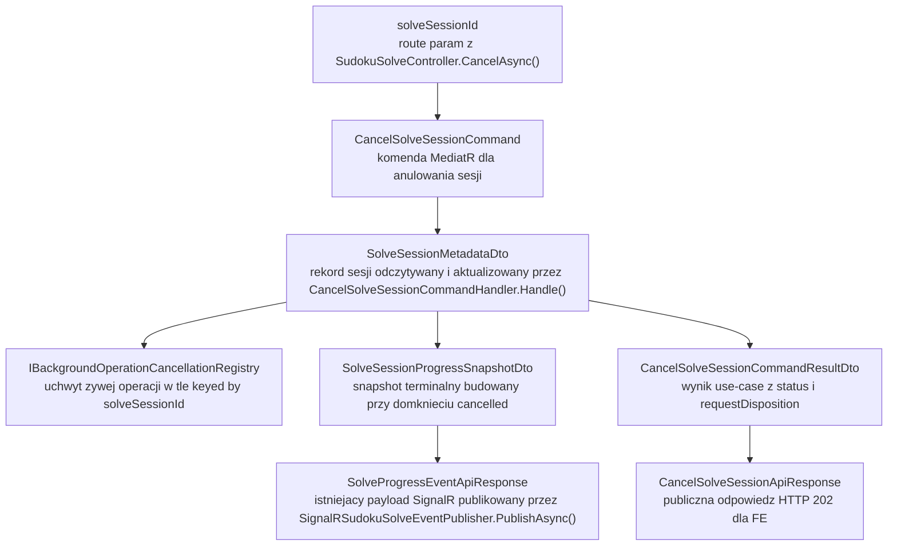
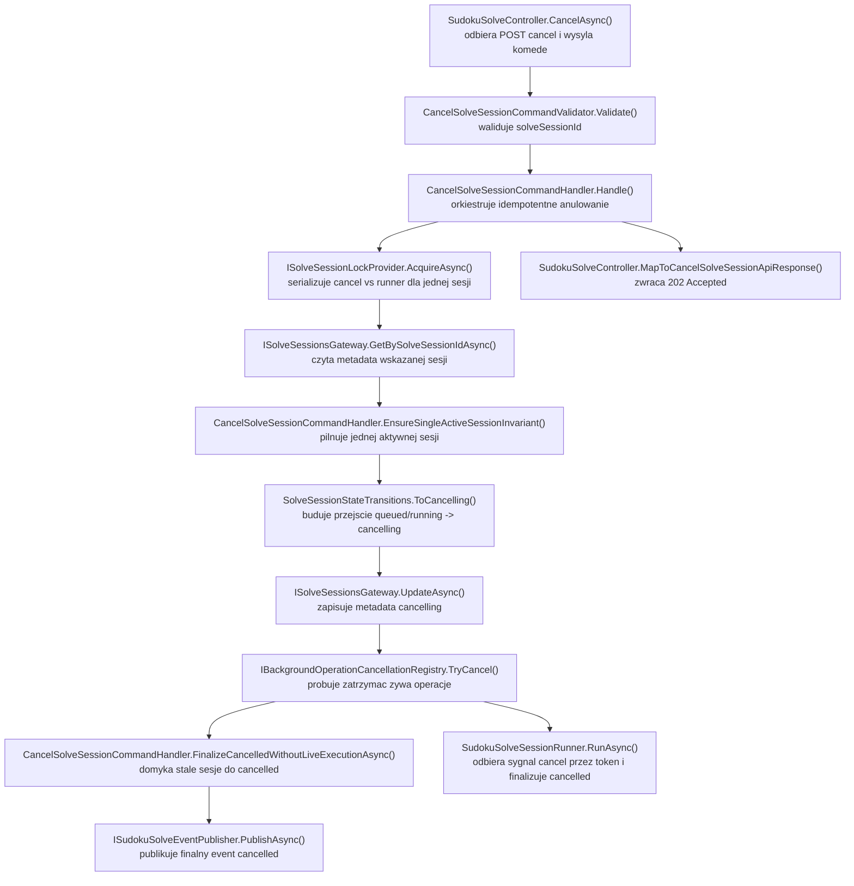

# UC-05E-BE - Plan implementacyjny dla `POST /api/sudoku/solve/{solveSessionId}/cancel`

## 1) Przeznaczenie endpointa
- Endpoint `POST /api/sudoku/solve/{solveSessionId}/cancel` uruchamia kooperacyjne anulowanie wcześniej wystartowanej sesji solve sudoku.
- Endpoint nie startuje nowego solve, nie liczy `currentGrid`, nie wykonuje inferencji i nie komunikuje sie z `ML`.
- To jest operacja czysto backendowa na istniejacym workflow `UC-05B` + `UC-05E`:
  - `POST /api/sudoku/solve` tworzy sesje,
  - `GET /api/sudoku/solve/active` pozwala ja odzyskac,
  - `SignalR /ws/sudoku/solving/{solveSessionId}` publikuje snapshoty,
  - `POST /api/sudoku/solve/{solveSessionId}/cancel` zatrzymuje ten workflow w sposob kontrolowany.
- Celem endpointa jest:
  - oznaczenie sesji jako anulowanej albo w trakcie anulowania,
  - powiadomienie zywego workflow wykonania w tle o prosbie cancel,
  - domkniecie sesji do terminalnego `cancelled` bez naruszania spojnosc stanu.
- `Backend` pozostaje `source of truth`; anulowanie nie moze opierac sie na stanie `FE`, grupach `SignalR` ani pamięci kontrolera.
- Plan dotyczy tylko czesci `BE`.
- Plan nie sugeruje sie aktualnym stanem `FE` ani `ML`; odnosi sie do docelowej architektury i aktualnych kontraktow backendu.

## 2) Zakres i zalozenia
- Punkty odniesienia:
  - `.ai/prd.md`,
  - `.ai/feature/uc-05-overview.md`,
  - `.ai/feature/uc-05b-overview.md`,
  - `.ai/feature/uc-05e-overview.md`,
  - `.ai/DokumentacjaDeployuRuntimeSerwera.md`,
  - istniejący plan `UC-05B`,
  - istniejący plan `UC-05E` dla `GET /api/sudoku/solve/active`,
  - istniejący plan `UC-05E` dla `SignalR /ws/sudoku/solving/{solveSessionId}`.
- W repo sa juz zaimplementowane:
  - start sesji solve,
  - aktywna sesja solve,
  - realtime solve po `SignalR`,
  - storage sesji solve,
  - worker i runner solve,
  - deterministyczny solver backtracking.
- Ten krok nie moze:
  - zmienic nazw istniejacych kontraktow,
  - przebudowac storage sesji,
  - przeniesc logiki solve do `Infrastructure`,
  - dodac komunikacji `BE <-> ML`.
- W `MVP` nadal obowiazuje invariant dokladnie jednej aktywnej sesji solve w obrębie backendu.
- Statusy sesji pozostaja zgodne z aktualnym backendem:
  - aktywne: `queued`, `running`, `cancelling`,
  - terminalne: `completed`, `failed`, `cancelled`.
- Anulowanie ma byc:
  - kooperacyjne,
  - idempotentne,
  - odporne na duplicate request,
  - odporne na restart backendu w tym sensie, ze nie zostawia wiecznie aktywnego rekordu bez zywego wykonania.
- Endpoint powinien zwracac `202 Accepted` dla wszystkich biznesowo poprawnych przypadkow:
  - nowe anulowanie,
  - duplikat anulowania,
  - sesja juz zakonczona,
  - brak dopasowanej sesji.
- `400 Bad Request` pozostaje tylko dla niepoprawnego route param.
- `500 Internal Server Error` pozostaje dla rzeczywistej niespójnosci backendu albo bledu persistence/runtime.

## 3) Co juz jest gotowe i co nalezy reuse'owac

### 3.1 Gotowe fundamenty z poprzednich krokow
- Publiczny endpoint startowy:
  - `POST /api/sudoku/solve`
- Publiczny endpoint odczytu aktywnej sesji:
  - `GET /api/sudoku/solve/active`
- Publiczny kanal realtime:
  - `SignalR /ws/sudoku/solving/{solveSessionId}`
- Kontrakty publiczne:
  - `SolveSudokuApiEntry`,
  - `SolveSessionApiResponse`,
  - `SolveProgressEventApiResponse`.
- Workflow aplikacyjny:
  - `StartSudokuSolveCommandHandler`,
  - `SudokuSolveSessionRunner`,
  - `SudokuBacktrackingSolver`.
- Storage sesji:
  - `ISolveSessionsGateway`,
  - `SolveSessionsGateway`,
  - `SolveSessionMetadataDto`,
  - `SolveSessionProgressSnapshotDto`.
- Realtime:
  - `SudokuSolveHub`,
  - `SignalRSudokuSolveEventPublisher`,
  - `SudokuSolveRealtimeResponseMapper`,
  - `GetSolveSessionRealtimeSnapshotQueryHandler`.
- Background execution:
  - `SudokuSolveExecutionScheduler`,
  - `SudokuSolveBackgroundWorker`.
- Lockowanie:
  - `ISolveSessionLockProvider`,
  - `InMemorySolveSessionLockProvider`.
- Statusy i event types:
  - `SudokuSolveSessionStatus`,
  - `SudokuSolveEventType`.

### 3.2 Wniosek architektoniczny
- `UC-05E cancel` nie powinno projektowac od nowa:
  - nowego storage,
  - nowego modelu sesji,
  - nowego huba,
  - nowego solve runnera,
  - nowego kontraktu realtime.
- Trzeba dopisac tylko:
  - HTTP endpoint cancel,
  - use-case anulowania,
  - mechanizm sygnalu cancel dla lokalnego workflow w tle,
  - bezpieczne domkniecie sesji do `cancelled`.

### 3.3 Istotna obserwacja o aktualnym stanie kodu
- Obecny `SudokuSolveSessionRunner` dostaje tylko globalny `stoppingToken` workera.
- Aktualnie nie istnieje mechanizm anulowania pojedynczej sesji solve przez klienta.
- To oznacza, ze samo dodanie kontrolera `CancelAsync()` byloby niewystarczajace.
- Endpoint cancel musi wejsc w istniejacy workflow:
  - `scheduler -> worker -> runner -> solver -> storage -> SignalR`,
  - a nie obchodzic go bokiem.

## 4) Kontrakty API FE i ML

### 4.1 FE -> BE (`POST /api/sudoku/solve/{solveSessionId}/cancel`)
- Metoda: `POST`
- Route:
  - `/api/sudoku/solve/{solveSessionId}/cancel`
- Request body: brak.
- Query: brak.
- Autoryzacja: brak.
- `solveSessionId` jest publicznym identyfikatorem sesji wygenerowanym wcześniej przez backend.

Walidacja route param:
- nie moze byc `null`,
- nie moze byc pusty lub whitespace,
- powinien byc traktowany jako identyfikator backendowy i porownywany `Ordinal`.

### 4.2 BE -> FE
- `202 Accepted` -> `CancelSolveSessionApiResponse`
- `400 Bad Request` -> `ErrorApiResponse`
- `500 Internal Server Error` -> `ErrorApiResponse`

### 4.3 Publiczny model odpowiedzi
- `[NOWY]` `CancelSolveSessionApiResponse`
- Minimalny kontrakt:
  - `status: string | null`
  - `requestDisposition: string`

Przyklad nowego anulowania:

```json
{
  "status": "cancelling",
  "requestDisposition": "accepted"
}
```

Przyklad duplikatu:

```json
{
  "status": "cancelling",
  "requestDisposition": "duplicate"
}
```

Przyklad sesji juz zakonczonej:

```json
{
  "status": "completed",
  "requestDisposition": "already_finished"
}
```

Przyklad braku dopasowanej sesji:

```json
{
  "status": null,
  "requestDisposition": "not_found"
}
```

### 4.4 Dozwolone `requestDisposition`
- `accepted`
  - backend przyjal anulowanie,
  - zywa sesja przechodzi do `cancelling` albo zostaje natychmiast domknieta do `cancelled`, jesli backend wykryl brak zywego wykonania.
- `duplicate`
  - sesja jest juz w `cancelling`.
- `already_finished`
  - sesja istnieje, ale ma juz stan terminalny `completed | failed | cancelled`.
- `not_found`
  - backend nie znalazl sesji o podanym `solveSessionId`.

### 4.5 Semantyka pola `status`
- `cancelling`
  - request cancel zostal przyjety, a zywy worker/runner musi jeszcze domknac workflow.
- `cancelled`
  - backend domknal anulowanie od razu, np. wykryl brak zywego wykonania po restarcie albo sesja zdazyla zostac zatrzymana przed odpowiedzia.
- `completed | failed | cancelled`
  - sesja juz byla terminalna w chwili wywolania endpointa.
- `null`
  - brak dopasowanej sesji.

### 4.6 Reguly HTTP
- `202 Accepted`
  - wszystkie poprawne biznesowo przypadki cancel.
- `400 Bad Request`
  - niepoprawny `solveSessionId`.
- `500 Internal Server Error`
  - blad odczytu/zapisu metadata,
  - błąd invariantu jednej aktywnej sesji,
  - niespójny stan storage,
  - błąd aktualizacji stanu `cancelling/cancelled`.

### 4.7 BE -> ML
- brak komunikacji `BE -> ML`.
- Cancel solve nie moze wywolywac zadnego endpointu `ML`.

### 4.8 ML -> BE
- brak komunikacji `ML -> BE`.

## 5) Model API wejsciowy i wyjsciowy w komunikacji z FE i ML

### 5.1 FE -> BE
- Route param:
  - `solveSessionId: string`
- Body:
  - brak

### 5.2 BE -> FE
- `[NOWY]` `CancelSolveSessionApiResponse`
  - `status: string | null`
  - `requestDisposition: string`
- `[REUSE]` `ErrorApiResponse`
  - `errorType: string`
  - `message: string`

### 5.3 FE a dalszy flow po `202`
- Dla `requestDisposition = accepted` i `status = cancelling`:
  - `FE` moze lokalnie przejsc do stanu "anulowanie w toku",
  - a finalnego `cancelled` oczekiwac przez istniejacy kanal `SignalR`.
- Dla `status = cancelled`:
  - `FE` moze od razu uznac workflow za terminalny.
- Dla `duplicate`:
  - `FE` nie powinno ponawiac requestu w petli.
- Dla `already_finished`:
  - `FE` powinno przyjac stan terminalny jako finalny.
- Dla `not_found`:
  - `FE` powinno uznac, ze nie ma juz zywej sesji do monitorowania.

### 5.4 BE -> ML
- brak

### 5.5 ML -> BE
- brak

## 6) Zachowanie per warstwa

### API (`Sudoku`)
- Rozszerza istniejacy `SudokuSolveController`.
- Wystawia `POST /api/sudoku/solve/{solveSessionId}/cancel`.
- Buduje `CancelSolveSessionCommand`.
- Wywoluje `MediatR`.
- Mapuje wynik na `202 Accepted`.
- Mapuje bledy walidacji na `400`.
- Mapuje bledy persistence/invariant na `500`.
- Nie:
  - odczytuje plikow metadata samodzielnie,
  - nie anuluje taska bezposrednio,
  - nie modyfikuje statusu sesji poza `Application`,
  - nie publikuje eventow `SignalR`,
  - nie rozmawia z `ML`.

### Application (`Application`)
- Jest wlascicielem use-case `cancel solve session`.
- Waliduje wejscie i semantyke zadanego `solveSessionId`.
- Utrzymuje idempotencje anulowania.
- Egzekwuje invariant jednej aktywnej sesji.
- Czyta i aktualizuje metadata sesji przez port `ISolveSessionsGateway`.
- Uzywa tego samego locka sesji co runner, zeby uniknac wyscigow `cancel` vs `progress/finalize`.
- Wprowadza przejscia stanu:
  - `queued|running -> cancelling`,
  - `cancelling -> duplicate`,
  - `completed|failed|cancelled -> already_finished`,
  - `stale queued|running without live execution -> cancelled`.
- Uzywa generycznego portu runtime do sygnalu anulowania lokalnej operacji w tle.
- Nie wykonuje plikowego I/O bezposrednio.

### Domain / Models (`Models`)
- Reuse'uje aktualne modele domenowe:
  - `SudokuSolveSessionStatus`,
  - `SudokuSolveEventType`,
  - `SudokuGrid`,
  - `SudokuCellPosition`.
- Pilnuje niezmiennikow:
  - sesja ma jeden status z ustalonego zbioru,
  - `cancelling` jest statusem aktywnym,
  - `cancelled` jest terminalne,
  - cyfry wejsciowe pozostaja nienaruszalne.
- `Models` nie zna:
  - `ControllerBase`,
  - `SignalR`,
  - `IFileStorageGateway`,
  - `CancellationTokenSource`,
  - `ML`.

### Infrastructure (`Infrastructure`)
- Reuse'uje `SolveSessionsGateway` jako adapter storage.
- Reuse'uje `LocalFileStorageGateway`.
- Rozszerza mechanizm background execution o rejestr zywych operacji, ktory pozwala zasygnalizowac cancel po `solveSessionId`.
- Nie zawiera logiki decyzji:
  - czy anulowanie przyjac,
  - jaki `requestDisposition` zwrocic,
  - czy sesje finalizowac jako `cancelled`,
  - jak reagowac na sesje terminalne.

## 7) Pliki per warstwa i odpowiedzialnosci

### API (`src/Backend/Sudoku/Sudoku`)
- `[MODYFIKACJA]` `Controllers/SudokuSolveController.cs`
  - dodac akcje `CancelAsync([FromRoute] string? solveSessionId, CancellationToken cancellationToken)`,
  - mapowanie `CancelSolveSessionCommandResultDto -> CancelSolveSessionApiResponse`,
  - obsluga `400/500`,
  - lekkie logowanie requestu i wyniku.
- `[NOWY]` `Contracts/CancelSolveSessionApiResponse.cs`
  - publiczny response model endpointa cancel,
  - tylko pola publiczne potrzebne FE:
    - `status`,
    - `requestDisposition`.
- `[REUSE]` `Contracts/ErrorApiResponse.cs`
  - wspolny model bledu HTTP.
- `[REUSE]` `Contracts/SolveSessionApiResponse.cs`
  - bez zmian; pozostaje kontraktem startu i `GET /active`.
- `[REUSE]` `Contracts/SolveProgressEventApiResponse.cs`
  - bez zmian; finalny `cancelled` nadal wraca przez istniejacy realtime payload.
- `[REUSE]` `Hubs/SudokuSolveHub.cs`
  - bez zmiany odpowiedzialnosci,
  - klient po reconnect moze zobaczyc snapshot sesji juz anulowanej lub w trakcie anulowania.
- `[REUSE]` `Realtime/SudokuSolveRealtimeResponseMapper.cs`
  - bez zmian kontraktu eventu,
  - ewentualnie tylko potwierdzenie, ze status tekstowy jest przepuszczany 1:1 z metadata.
- `[REUSE]` `Realtime/SignalRSudokuSolveEventPublisher.cs`
  - bez zmiany kontraktu publicznego,
  - nadal publikuje tylko po zapisie metadata.
- `[BRAK ZMIAN]` `Program.cs`
  - brak nowej konfiguracji runtime,
  - brak nowego routingu `SignalR`,
  - brak nowych `appsettings`.

### Application (`src/Backend/Sudoku/Application`)
- `[NOWY]` `SudokuSolve/CancelSolveSessionCommand.cs`
  - komenda MediatR z `solveSessionId`.
- `[NOWY]` `SudokuSolve/CancelSolveSessionCommandValidator.cs`
  - walidacja route param.
- `[NOWY]` `SudokuSolve/CancelSolveSessionCommandHandler.cs`
  - glowna orkiestracja anulowania,
  - idempotencja,
  - invariant jednej aktywnej sesji,
  - zapis `cancelling`,
  - finalizacja `cancelled` dla stale session,
  - sygnal cancel dla zywego workflow.
- `[NOWY]` `SudokuSolve/CancelSolveSessionCommandResultDto.cs`
  - wynik use-case:
    - `status`,
    - `requestDisposition`.
- `[NOWY]` `SudokuSolve/CancelSolveSessionDispositions.cs`
  - stale `accepted`, `duplicate`, `already_finished`, `not_found`.
- `[NOWY]` `SudokuSolve/CancelSolveSessionErrorTypes.cs`
  - stale `errorType`, np.:
    - `invalid_solve_session_id`,
    - `solve_session_cancel_persistence_failed`,
    - `solve_session_cancel_invariant_violation`.
- `[NOWY]` `SudokuSolve/SolveSessionStateTransitions.cs`
  - wspolny helper aplikacyjny do przejsc stanu metadata:
    - `ToCancelling(...)`,
    - `ToCancelled(...)`,
    - opcjonalnie `ToCompleted(...)`, `ToFailed(...)` przy refaktoryzacji runnera,
  - zapobiega duplikacji logiki sekwencji i timestampow miedzy handlerem cancel a runnerem.
- `[MODYFIKACJA]` `SudokuSolve/SudokuSolveExceptions.cs`
  - dopisac `SolveSessionCancelPersistenceException`,
  - opcjonalnie `SolveSessionCancelInvariantException`, jesli chcecie rozdzielic blad domenowy od `InvalidOperationException`.
- `[MODYFIKACJA]` `SudokuSolve/SudokuSolveSessionRunner.cs`
  - obsluga tokenu cancel dla pojedynczej sesji,
  - sprawdzenie anulowania przed `MarkRunningAsync`,
  - finalizacja `cancelled` bez przejscia przez `running`, jesli sesja byla juz `cancelling` albo token jest juz odwolany,
  - reuse wspolnego helpera przejsc stanu.
- `[REUSE]` `SudokuSolve/ISolveSessionsGateway.cs`
  - port storage sesji.
- `[REUSE]` `SudokuSolve/SolveSessionMetadataDto.cs`
  - systemowy rekord sesji,
  - bez dodawania nowych pol tylko dla cancel, jesli `UpdatedAtUtc` i `Status` wystarczaja.
- `[REUSE]` `SudokuSolve/SolveSessionProgressSnapshotDto.cs`
  - zrodlo finalnego eventu `cancelled`.
- `[REUSE]` `SudokuSolve/ISolveSessionLockProvider.cs`
  - wspolny lock dla handlera cancel i runnera.
- `[REUSE]` `SudokuSolve/InMemorySolveSessionLockProvider.cs`
  - implementacja locka dla jednej instancji backendu.
- `[REUSE]` `SudokuSolve/GetActiveSolveSessionQueryHandler.cs`
  - bez zmian logiki, bo `cancelling` jest juz aktywne.
- `[REUSE]` `SudokuSolve/GetSolveSessionRealtimeSnapshotQueryHandler.cs`
  - bez zmian kontraktu; po reconnect potrafi odczytac aktualny stan sesji.
- `[REUSE]` `SudokuSolve/ISudokuBacktrackingSolver.cs`
  - bez zmiany odpowiedzialnosci; solver ma pozostac czysta logika.
- `[REUSE]` `SudokuSolve/SudokuBacktrackingSolver.cs`
  - bez logiki HTTP i bez wiedzy o kontrolerze cancel,
  - korzysta tylko z przekazanego tokenu anulowania.
- `[NOWY]` `Abstractions/IBackgroundOperationCancellationRegistry.cs`
  - generyczny port aplikacyjny dla lokalnych operacji uruchamianych w tle,
  - kluczowany stringowym `operationId`,
  - potrzebne operacje:
    - rejestracja zywej operacji po schedule,
    - proba anulowania po `operationId`,
    - zwolnienie wpisu po zakonczeniu.

### Domain / Models (`src/Backend/Sudoku/Models`)
- `[REUSE]` `Sudoku/SudokuSolveSessionStatus.cs`
  - juz ma `Cancelling`, `Cancelled`, `IsActive`, `IsTerminal`, `CanRequestCancellation`.
- `[REUSE]` `Sudoku/SudokuSolveEventType.cs`
  - `cancelled` pozostaje terminalnym event type.
- `[REUSE]` `Sudoku/SudokuGrid.cs`
  - bez zmian; cancel nie ingeruje w reprezentacje planszy.
- `[REUSE]` `Sudoku/SudokuCellPosition.cs`
  - bez zmian.
- `[BRAK NOWYCH PLIKOW]`
  - ten endpoint nie wymaga nowego modelu domenowego.

### Infrastructure (`src/Backend/Sudoku/Infrastructure`)
- `[REUSE]` `Storage/SolveSessionsGateway.cs`
  - ten sam gateway do odczytu i zapisu metadata.
- `[REUSE]` `Storage/LocalFileStorageGateway.cs`
  - generyczne I/O plikowe.
- `[NOWY]` `Background/InMemoryBackgroundOperationCancellationRegistry.cs`
  - implementacja portu `IBackgroundOperationCancellationRegistry`,
  - przechowuje zywe `CancellationTokenSource`/uchwyty runtime dla background operations,
  - implementacja in-memory dla jednej instancji backendu.
- `[MODYFIKACJA]` `Background/SudokuSolveExecutionScheduler.cs`
  - przy schedule rejestruje cancel handle dla `solveSessionId`,
  - przy niepowodzeniu enqueue zwalnia wpis, aby nie zostawic sieroty w rejestrze.
- `[MODYFIKACJA]` `Background/SudokuSolveBackgroundWorker.cs`
  - pobiera token dla sesji z rejestru,
  - uruchamia runner z linked tokenem `session + stoppingToken`,
  - w `finally` zwalnia wpis w rejestrze.
- `[MODYFIKACJA]` `DependencyInjection.cs`
  - rejestracja `IBackgroundOperationCancellationRegistry` jako singleton.

### Testy (`src/Backend/Sudoku/Application.Tests`)
- `[NOWY]` `CancelSolveSessionCommandHandlerTests.cs`
  - testy use-case cancel.
- `[MODYFIKACJA]` `SudokuSolveControllerTests.cs`
  - testy `CancelAsync()`.
- `[MODYFIKACJA]` `SudokuSolveSessionRunnerTests.cs`
  - testy runnera dla pre-cancelled token i finalizacji `cancelled`.
- `[OPCJONALNIE NOWY]` `SudokuSolveBackgroundWorkerTests.cs`
  - jesli zdecydujecie sie testowac rejestr + worker integracyjnie w warstwie jednostkowej.

### Workflow / konfiguracja
- `[BRAK ZMIAN]` `.github/workflows/backend-cd.yml`
  - cancel nie wymaga nowych sekretow ani nowych sciezek runtime.
- `[BRAK ZMIAN]` `Sudoku/appsettings.local.json`
  - istniejaca sekcja `SudokuSolveSessionsStorage` wystarcza.
- `[BRAK ZMIAN]` `Sudoku/appsettings.production.json`
  - brak nowych placeholderow.

## 8) Weryfikacja uslug Infrastructure i antyduplikacja
- W repo juz istnieja:
  - `IFileStorageGateway`,
  - `LocalFileStorageGateway`,
  - `ISolveSessionsGateway`,
  - `SolveSessionsGateway`.
- Wniosek:
  - nie wolno tworzyc drugiego gatewaya plikowego tylko dla cancel,
  - nie wolno dodawac `SolveSessionCancelStorageGateway`,
  - nie wolno robic `File.WriteAllText` w handlerze.
- W repo nie istnieje ogolny mechanizm runtime cancel dla lokalnych background operations.
- Wniosek:
  - jesli trzeba dodac usluge w `Infrastructure`, nie robic solve-specific klasy typu `InMemorySolveSessionCancellationStore`,
  - lepiej wprowadzic generyczny `IBackgroundOperationCancellationRegistry` keyed by `string operationId`,
  - potem inne lokalne use-case'y moga reuse'owac ten sam mechanizm bez duplikacji.
- Nie tworzyc:
  - klienta HTTP do `ML`,
  - dodatkowego cache statusow sesji jako drugiego zrodla prawdy,
  - osobnego storage dla `cancelling`,
  - cancel logiki w kontrolerze.

## 9) Przeplyw w obrebie BE
1. `FE` wywoluje `POST /api/sudoku/solve/{solveSessionId}/cancel`.
2. `SudokuSolveController.CancelAsync()` buduje `CancelSolveSessionCommand`.
3. `CancelSolveSessionCommandValidator` waliduje route param.
4. `CancelSolveSessionCommandHandler.Handle()` pobiera lock sesji przez `ISolveSessionLockProvider`.
5. Handler czyta metadata sesji przez `ISolveSessionsGateway.GetBySolveSessionIdAsync(...)`.
6. Jesli sesji nie ma:
   - zwraca `202` z `status = null`, `requestDisposition = not_found`.
7. Jesli sesja jest terminalna:
   - zwraca `202` z terminalnym `status`,
   - `requestDisposition = already_finished`.
8. Jesli sesja jest juz `cancelling`:
   - zwraca `202`,
   - `requestDisposition = duplicate`.
9. Jesli sesja jest `queued` albo `running`:
   - handler buduje metadata `cancelling`,
   - zapisuje je przez `ISolveSessionsGateway.UpdateAsync(...)`.
10. Handler probuje wyslac sygnal cancel przez `IBackgroundOperationCancellationRegistry.TryCancel(solveSessionId)`.
11. Jesli zywy uchwyt operacji istnieje:
   - handler zwraca `202` z `status = cancelling`, `requestDisposition = accepted`.
12. Jesli zywy uchwyt nie istnieje:
   - backend traktuje rekord jako stale active session po utracie runtime execution,
   - handler finalizuje metadata od razu do `cancelled`,
   - publikuje terminalny snapshot przez istniejacy `ISudokuSolveEventPublisher`,
   - zwraca `202` z `status = cancelled`, `requestDisposition = accepted`.
13. Gdy worker wykonuje zywa sesje:
   - otrzymuje token powiazany z `solveSessionId`,
   - runner albo nie startuje solve w ogole, albo solver szybko zwraca `CancelledResult`.
14. `SudokuSolveSessionRunner` zapisuje stan terminalny `cancelled`.
15. `SignalRSudokuSolveEventPublisher` publikuje koncowy event `cancelled`.

## 10) Glowne funkcje
- `SudokuSolveController.CancelAsync(...)`
- `CancelSolveSessionCommandValidator.Validate(...)`
- `CancelSolveSessionCommandHandler.Handle(...)`
- `CancelSolveSessionCommandHandler.EnsureSingleActiveSessionInvariant(...)`
- `CancelSolveSessionCommandHandler.TryCancelLiveExecution(...)`
- `CancelSolveSessionCommandHandler.FinalizeCancelledWithoutLiveExecutionAsync(...)`
- `SolveSessionStateTransitions.ToCancelling(...)`
- `SolveSessionStateTransitions.ToCancelled(...)`
- `IBackgroundOperationCancellationRegistry.TryCancel(...)`
- `IBackgroundOperationCancellationRegistry.Register(...)`
- `IBackgroundOperationCancellationRegistry.Complete(...)`
- `SudokuSolveExecutionScheduler.ScheduleAsync(...)`
- `SudokuSolveBackgroundWorker.ExecuteAsync(...)`
- `SudokuSolveSessionRunner.RunAsync(...)`
- `SudokuSolveSessionRunner.MarkRunningAsync(...)`
- `SudokuSolveSessionRunner.FinalizeSolveAsync(...)`
- `SignalRSudokuSolveEventPublisher.PublishAsync(...)`

## 11) Wyjatki, fallbacki i zachowanie bledowe

### 11.1 Publiczne statusy HTTP
- `202 Accepted`
  - `accepted`
  - `duplicate`
  - `already_finished`
  - `not_found`
- `400 Bad Request`
  - pusty `solveSessionId`
- `500 Internal Server Error`
  - nie mozna odczytac metadata,
  - nie mozna zapisac `cancelling`,
  - nie mozna domknac `cancelled`,
  - wykryto niespojny stan wielu aktywnych sesji,
  - backend nie moze bezpiecznie okreslic odpowiedzi.

### 11.2 Zachowanie biznesowe dla poszczegolnych przypadkow
- sesja nie istnieje:
  - `202`, `status = null`, `requestDisposition = not_found`
- sesja `queued`:
  - `202`, zwykle `status = cancelling`,
  - worker przed startem powinien domknac `cancelled`
- sesja `running`:
  - `202`, zwykle `status = cancelling`,
  - solver zostaje zatrzymany kooperacyjnie przez token
- sesja `cancelling`:
  - `202`, `duplicate`
- sesja `completed|failed|cancelled`:
  - `202`, `already_finished`

### 11.3 Fallback dla utraconego runtime execution
- To jest najwazniejszy fallback tego endpointa.
- Jesli metadata mowi `queued|running`, ale registry nie ma juz zywego uchwytu cancel dla tej sesji:
  - nie wolno zostawic sesji w nieskonczonym `cancelling`,
  - backend powinien od razu domknac sesje jako `cancelled`.
- Taki przypadek jest realny np. po restarcie backendu w trakcie solve.
- To zachowanie jest lepsze niz:
  - udawanie, ze sesja dalej zyje,
  - trzymanie stalego `running`,
  - budowanie drugiego zrodla prawdy w pamieci.

### 11.4 Czego nie robimy jako fallback
- brak fallbacku do `ML`
- brak fallbacku do brutalnego ubicia watku
- brak fallbacku do `Thread.Abort`
- brak fallbacku do kasowania pliku metadata bez domkniecia kontraktu
- brak fallbacku do tworzenia nowej sesji w miejsce starej

### 11.5 Realtime a anulowanie
- Cancel endpoint nie musi emitowac osobnego nowego publicznego eventu przejsciowego.
- HTTP response cancel jest wystarczajacym sygnalem dla `FE`, ze backend przyjal prosbe.
- Finalny stan `cancelled` musi przyjsc przez juz istniejacy kanal `SignalR`.
- Jesli klient zrobi reconnect pomiedzy `accepted` a `cancelled`, moze zobaczyc snapshot z `status = cancelling`.
- To nie wymaga zmiany `eventType`; dalej finalnym eventem pozostaje `cancelled`.

## 12) Specyficzna logika i pseudokod

### 12.1 Pseudokod handlera cancel

```text
handleCancelSolveSession(solveSessionId):
  validate(solveSessionId)

  lock = solveSessionLockProvider.acquire(solveSessionId)
  metadata = solveSessionsGateway.getBySolveSessionId(solveSessionId)

  if metadata is null:
    return { status: null, requestDisposition: "not_found" }

  ensureSingleActiveSessionInvariant(metadata)

  if metadata.status in ["completed", "failed", "cancelled"]:
    return { status: metadata.status, requestDisposition: "already_finished" }

  if metadata.status == "cancelling":
    return { status: "cancelling", requestDisposition: "duplicate" }

  cancellingMetadata = SolveSessionStateTransitions.ToCancelling(metadata, nowUtc)
  solveSessionsGateway.update(cancellingMetadata)

  if backgroundOperationCancellationRegistry.tryCancel(solveSessionId):
    return { status: "cancelling", requestDisposition: "accepted" }

  cancelledMetadata = SolveSessionStateTransitions.ToCancelled(cancellingMetadata, nowUtc)
  solveSessionsGateway.update(cancelledMetadata)
  sudokuSolveEventPublisher.publish(toSnapshot(cancelledMetadata))

  return { status: "cancelled", requestDisposition: "accepted" }
```

### 12.2 Pseudokod schedulera z rejestrem anulowania

```text
schedule(workItem):
  cancellationRegistry.register(workItem.solveSessionId)

  try:
    channel.write(workItem)
  catch:
    cancellationRegistry.complete(workItem.solveSessionId)
    throw
```

### 12.3 Pseudokod workera

```text
executeAsync(stoppingToken):
  for each workItem in channel:
    try:
      sessionToken = cancellationRegistry.getToken(workItem.solveSessionId)
      linkedToken = link(sessionToken, stoppingToken)
      runner.run(workItem, linkedToken)
    finally:
      cancellationRegistry.complete(workItem.solveSessionId)
```

### 12.4 Pseudokod runnera z pre-cancel check

```text
runSolveSession(workItem, cancellationToken):
  metadata = solveSessionsGateway.getBySolveSessionId(workItem.solveSessionId)
  if metadata is null:
    return

  if metadata.status is terminal:
    return

  if metadata.status == "cancelling" or cancellationToken.isCancellationRequested:
    cancelledMetadata = SolveSessionStateTransitions.ToCancelled(metadata, nowUtc)
    saveAndPublish(cancelledMetadata)
    return

  runningMetadata = markRunning(metadata)
  saveAndPublish(runningMetadata)

  solveResult = solver.solve(grid, onStep, cancellationToken)

  if solveResult == cancelled:
    cancelledMetadata = SolveSessionStateTransitions.ToCancelled(runningMetadata, nowUtc)
    saveAndPublish(cancelledMetadata)
    return

  finalize completed/failed as today
```

### 12.5 Pseudokod helpera przejsc stanu

```text
toCancelling(metadata, nowUtc):
  return metadata with
    status = "cancelling"
    updatedAtUtc = nowUtc
    failureErrorType = null
    failureMessage = null

toCancelled(metadata, nowUtc):
  nextSequence = (metadata.lastAcceptedSequence ?? 0) + 1
  return metadata with
    status = "cancelled"
    updatedAtUtc = nowUtc
    finishedAtUtc = nowUtc
    lastAcceptedSequence = nextSequence
    lastEventType = "cancelled"
    currentGrid = metadata.currentGrid
```

## 13) Mermaid flowchart - flow modeli



## 14) Mermaid flowchart - logika aplikacji z funkcjami



## 15) Workflow GitHub i konfiguracja runtime
- Dla tego endpointa nie trzeba dodawac:
  - nowych zmiennych workflow,
  - nowych sekretow,
  - nowych sekcji `appsettings`.
- Cancel korzysta z tego, co juz jest:
  - `SudokuSolveSessionsStorage.MetadataDirectoryPath`
  - obecny runtime backendu

### 15.1 Local
- Lokalnie nadal uzywamy:
  - `Sudoku/appsettings.local.json`
  - `SudokuSolveSessionsStorage.MetadataDirectoryPath = /home/wojtek/projects/sudoku/tmp/solve-sessions/metadata`
- Nie dodajemy twardych sciezek w kodzie.

### 15.2 Production
- Produkcyjnie nadal uzywamy:
  - `backend-cd.yml`
  - `BE_SUDOKU_SOLVE_SESSIONS_METADATA_DIRECTORY_PATH`
- Workflow juz wpisuje te wartosc do:
  - `appsettings.production.json`
- Cancel endpoint nie wymaga dodatkowego overlay.

### 15.3 Wazna zasada deployowa
- Deploy backendu restartuje proces, wiec moze przerwac lokalne in-memory execution handles.
- Plan cancel musi to brac pod uwage:
  - brak zywego uchwytu cancel po restarcie nie moze zostawic sesji w wiecznym `running`,
  - dlatego handler cancel powinien umiec domknac stale sesje do `cancelled`.

## 16) Logging

### 16.1 `Information`
- przyjeto request cancel dla `solveSessionId`
- sesja przeszla do `cancelling`
- sesja zostala domknieta do `cancelled`
- wykryto stale active session i anulowano ja bez zywego execution handle

### 16.2 `Debug`
- `not_found`
- `duplicate`
- `already_finished`
- registry sygnal cancel zostal wyslany poprawnie

### 16.3 `Warning`
- request cancel trafil w sesje, dla ktorej nie bylo juz zywego execution handle
- wykryto reconnect do snapshotu `cancelling`
- proba anulowania sesji w stanie niespodziewanym, ale nadal obslugiwalnym

### 16.4 `Error`
- blad zapisu metadata `cancelling`
- blad finalizacji `cancelled`
- invariant violation wielu aktywnych sesji
- blad rejestru runtime execution handles

### 16.5 Guardraile logowania
- nie logowac calego `currentGrid`
- nie logowac pelnych payloadow socketowych
- nie logowac plikow metadata
- nie logowac per-step backtrackingu na `Information`
- glownymi kluczami diagnostycznymi maja byc:
  - `solveSessionId`
  - `status`
  - `requestDisposition`
  - `sequence`
  - `errorType`

## 17) Inne istotne reguly
- Nie zmieniac juz ustalonych nazw:
  - `solveSessionId`
  - `progressChannelUrl`
  - `SolveSessionApiResponse`
  - `SolveProgressEventApiResponse`
  - `SudokuSolveSessionStatus`
  - `SudokuSolveEventType`
- Nie przenosic logiki anulowania do `Infrastructure`.
- Nie robic synchronicznego czekania w kontrolerze na finalne `cancelled`.
- Nie usuwac pliku metadata sesji podczas cancel.
- Nie budowac drugiego zrodla prawdy dla statusu w cache.
- Nie emitowac nowego publicznego eventu typu `cancelling` tylko dlatego, ze jest status przejsciowy.
- Nie zmieniac kontraktu realtime solve na delty.
- Nie wiazac cancel z `ML`, aktywnym modelem albo admin tokenem.
- Nie zmieniac workflow GitHub bez potrzeby, skoro obecna konfiguracja runtime wystarcza.

## 18) Kolejnosc implementacji kodu dla historyjki
1. Dodac `CancelSolveSessionApiResponse`.
2. Dodac `CancelSolveSessionCommand`.
3. Dodac `CancelSolveSessionCommandValidator`.
4. Dodac `CancelSolveSessionDispositions`.
5. Dodac `CancelSolveSessionErrorTypes`.
6. Dodac `CancelSolveSessionCommandResultDto`.
7. Dodac `SolveSessionStateTransitions`.
8. Rozszerzyc `SudokuSolveExceptions.cs` o persistence exception dla cancel.
9. Dodac `IBackgroundOperationCancellationRegistry`.
10. Zaimplementowac `InMemoryBackgroundOperationCancellationRegistry`.
11. Rozszerzyc `SudokuSolveExecutionScheduler` o rejestracje execution handle.
12. Rozszerzyc `SudokuSolveBackgroundWorker` o powiazanie work item z session tokenem i cleanup rejestru.
13. Rozszerzyc `SudokuSolveSessionRunner` o pre-cancel check i finalizacje `cancelled`.
14. Zaimplementowac `CancelSolveSessionCommandHandler`.
15. Rozszerzyc `SudokuSolveController` o `CancelAsync()`.
16. Podlaczyc rejestr w `Infrastructure/DependencyInjection.cs`.
17. Dodac testy handlera cancel.
18. Dodac testy kontrolera cancel.
19. Dodac testy runnera dla anulowania.
20. Zrobic manual smoke:
    - start solve,
    - cancel,
    - sprawdzenie `GET /active`,
    - sprawdzenie finalnego `cancelled` przez `SignalR`.

## 19) Guardraile implementacyjne
- Nie uzywac `Task.Run` ani `Thread` do cancel.
- Nie trzymac `CancellationTokenSource` w kontrolerze.
- Nie dodawac nowego storage tylko dla flagi cancel.
- Nie robic cancel przez modyfikacje plikow bez locka sesji.
- Nie dublowac logiki przejsc stanu w kilku klasach; wydzielic helper.
- Nie zwracac `404` dla `not_found`; kontrakt ma zostac idempotentny i `202`.
- Nie zwracac `409` dla `duplicate`; to nie jest konflikt biznesowy, tylko legalny no-op.
- Nie modyfikowac `SudokuGrid` przy samym anulowaniu.
- Nie logowac per-request calej sesji ani calego gridu.
- Nie dodawac nowej sekcji `appsettings` bez realnej potrzeby.

## 20) Zaleznosci pomiedzy historyjkami
- Twarde zaleznosci:
  - `UC-05B`
    - start sesji,
    - storage sesji,
    - runner,
    - solver,
    - statusy.
  - `UC-05E` websocket
    - finalny `cancelled` ma byc dostarczony przez juz istniejacy kanal realtime.
  - `UC-05E` active
    - `cancelling` pozostaje stanem aktywnym dla `GET /api/sudoku/solve/active`.
- Brak zaleznosci od:
  - `UC-10`,
  - aktywnego modelu inferencyjnego,
  - `UC-06`,
  - `ML`,
  - auth administracyjnego.
- Wplyw na dalsze historyjki:
  - `FE` moze odzyskac sesje w `cancelling`,
  - `SignalR` nadal pozostaje jedynym miejscem finalnego eventu `cancelled`,
  - przyszle rozszerzenia nie powinny zmieniac kontraktu cancel, tylko ewentualnie rozbudowac UX.

## 21) Plan testow minimum

### 21.1 Unit - `CancelSolveSessionCommandHandler`
- brak sesji -> `not_found`
- sesja `queued` z zywa rejestracja -> `accepted`, `status = cancelling`
- sesja `running` z zywa rejestracja -> `accepted`, `status = cancelling`
- sesja `cancelling` -> `duplicate`
- sesja `completed` -> `already_finished`, `status = completed`
- sesja `failed` -> `already_finished`, `status = failed`
- sesja `cancelled` -> `already_finished`, `status = cancelled`
- aktywna sesja bez zywego execution handle -> natychmiastowe `accepted`, `status = cancelled`
- wiele aktywnych sesji -> invariant violation
- blad zapisu metadata -> persistence exception

### 21.2 Unit - runner
- token anulowany przed startem -> sesja finalizuje `cancelled` bez `running`
- sesja w statusie `cancelling` przed `RunAsync()` -> runner finalizuje `cancelled`
- solver zwraca `CancelledResult()` -> status terminalny `cancelled`
- sequence dla terminalnego `cancelled` zwieksza sie poprawnie

### 21.3 Unit - scheduler / worker / registry
- schedule rejestruje execution handle
- enqueue failure czyści wpis z rejestru
- worker zwalnia wpis po zakonczeniu
- `TryCancel()` zwraca `true` dla zywej operacji
- `TryCancel()` zwraca `false` po cleanup

### 21.4 Controller
- `202 Accepted` dla `accepted`
- `202 Accepted` dla `duplicate`
- `202 Accepted` dla `already_finished`
- `202 Accepted` dla `not_found`
- `400 Bad Request` dla pustego route param
- `500 Internal Server Error` dla persistence failure
- `500 Internal Server Error` dla invariant violation

### 21.5 Integration / manual smoke
- `POST /api/sudoku/solve`
- `POST /api/sudoku/solve/{solveSessionId}/cancel`
- `GET /api/sudoku/solve/active` zwraca `cancelling` albo potem `204`
- `SignalR /ws/sudoku/solving/{solveSessionId}` dostarcza finalny `cancelled`
- po restarcie backendu i pozostawionym `running` metadata:
  - wywolanie cancel domyka sesje do `cancelled`

## 22) Podsumowanie decyzji architektonicznych
- Endpoint `POST /api/sudoku/solve/{solveSessionId}/cancel` jest czysto backendowym use-case'em kooperacyjnego anulowania istniejacej sesji solve.
- Nie powstaje zaden kontrakt `BE <-> ML`.
- `Application` trzyma cala logike:
  - idempotencja,
  - statusy,
  - invarianty,
  - przejscia `cancelling/cancelled`.
- `Infrastructure` dostaje tylko generyczny, reusable mechanizm sygnalu anulowania lokalnej operacji w tle.
- Nie trzeba zmieniac workflow GitHub ani `appsettings`.
- Najwazniejszy element planu to nie sam kontroler, tylko poprawne spiecie:
  - `metadata status`,
  - `runtime cancellation registry`,
  - `worker/runner`,
  - finalnego eventu `cancelled`.
