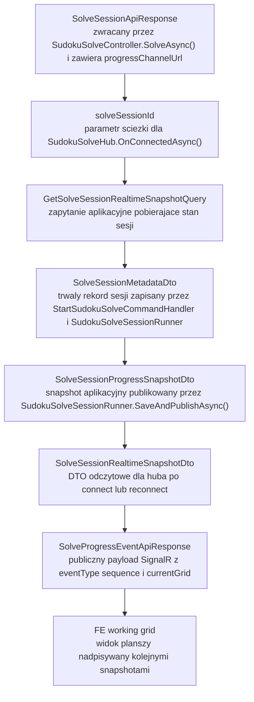
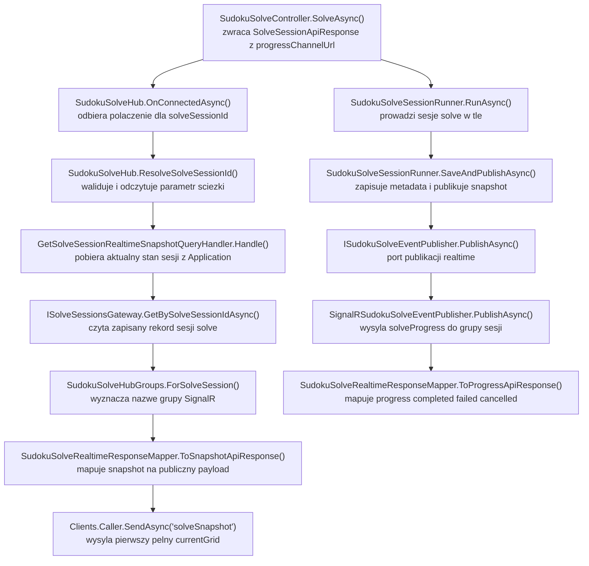

# UC-05E-BE - Plan implementacyjny dla `SignalR /ws/sudoku/solving/{solveSessionId}`

## 1) Przeznaczenie endpointa
- Kanał `SignalR /ws/sudoku/solving/{solveSessionId}` służy do publicznego monitorowania postępu konkretnej sesji solve sudoku uruchomionej wcześniej przez `POST /api/sudoku/solve`.
- Endpoint nie uruchamia solvera i nie zmienia logiki backtrackingu. Jest wyłącznie transportem obserwacji już istniejącego workflow `UC-05B`.
- Kanał ma dostarczać do `FE`:
  - bieżący snapshot planszy po podłączeniu,
  - kolejne snapshoty po każdej zmianie planszy wykonanej przez solver,
  - dokładnie jeden event terminalny: `completed`, `failed` albo `cancelled`.
- `Backend` pozostaje `source of truth`; `SignalR` nie jest drugim źródłem stanu, tylko publiczną projekcją danych zapisanych przez `BE`.
- Kanał dotyczy wyłącznie części `BE`. Nie sugerujemy się obecnym stanem `FE` ani `ML`.
- `UC-05E` jest ściśle powiązane z `UC-05B`:
  - start sesji, storage, worker, runner i solver są już fundamentem,
  - w tym kroku dokładamy publiczny transport realtime, odczyt snapshotu i bezpieczne publikowanie eventów.

## 2) Zakres i założenia
- Plan obejmuje wyłącznie backend w `src/Backend/Sudoku`.
- Punkty odniesienia:
  - `.ai/prd.md`,
  - `.ai/feature/uc-05-overview.md`,
  - `.ai/feature/uc-05b-overview.md`,
  - `.ai/feature/uc-05e-overview.md`,
  - `.ai/DokumentacjaDeployuRuntimeSerwera.md`,
  - istniejący plan `UC-05B`,
  - istniejący wzorzec realtime dla `UC-06`.
- Publiczny kanał solve jest niechroniony tokenem administracyjnym, bo ścieżka solve zgodnie z PRD pozostaje dostępna bez logowania administracyjnego.
- `UC-05E` nie zmienia kontraktu `POST /api/sudoku/solve`; nadal używamy:
  - `solveSessionId`,
  - `status`,
  - `progressChannelUrl`.
- `UC-05E` nie dodaje komunikacji `BE -> ML` ani `ML -> BE`.
- `UC-05E` nie może łamać wcześniejszych kontraktów i nazw dodanych w `UC-05B` oraz istniejących statusów/modeli z backendu.
- W `MVP` nadal obowiązuje jedna aktywna sesja solve w obrębie backendu, bo to ograniczenie jest już częścią aktualnego workflow `UC-05B`.
- Źródłem odtworzenia stanu po reconnect jest storage sesji solve zapisany po stronie `BE`, a nie pamięć `Huba`.
- Utrata połączenia `SignalR` nie zatrzymuje solvera i nie może niszczyć workflow sesji.

## 3) Co już jest gotowe i co trzeba reuse'ować

### 3.1 Już zaimplementowane fundamenty z `UC-05B`
- Publiczny endpoint startowy `POST /api/sudoku/solve`.
- Kontrakty:
  - `SolveSudokuApiEntry`,
  - `SolveSessionApiResponse`.
- Logika aplikacyjna:
  - `StartSudokuSolveCommand`,
  - `StartSudokuSolveCommandHandler`,
  - `StartSudokuSolveCommandValidator`.
- Solver i workflow:
  - `SudokuBacktrackingSolver`,
  - `SudokuSolveSessionRunner`,
  - `ISudokuSolveExecutionScheduler`,
  - `SudokuSolveBackgroundWorker`.
- Storage sesji:
  - `ISolveSessionsGateway`,
  - `SolveSessionsGateway`,
  - `SolveSessionMetadataDto`,
  - `SolveSessionProgressSnapshotDto`.
- Typy domenowe:
  - `SudokuSolveSessionStatus`,
  - `SudokuSolveEventType`.
- Hook pod publikację realtime:
  - `ISudokuSolveEventPublisher`,
  - `NoOpSudokuSolveEventPublisher`.
- Konfiguracja runtime:
  - `SudokuSolveSessionsStorageOptions`,
  - `appsettings.local.json`,
  - `appsettings.production.json`,
  - `backend-cd.yml` z `BE_SUDOKU_SOLVE_SESSIONS_METADATA_DIRECTORY_PATH`.

### 3.2 Wniosek architektoniczny
- `UC-05E` nie powinno ponownie projektować:
  - storage sesji,
  - mechanizmu pracy w tle,
  - generatora `solveSessionId`,
  - statusów sesji,
  - solvera backtracking.
- Trzeba tylko:
  - wystawić publiczny hub `SignalR`,
  - dodać mapowanie snapshotu aplikacyjnego do publicznego payloadu socketowego,
  - podmienić `NoOpSudokuSolveEventPublisher` na implementację `SignalR`,
  - bezpiecznie obsłużyć reconnect i publikację `best-effort`.

## 4) Kontrakty komunikacji FE i ML

### 4.1 FE -> BE (`SignalR /ws/sudoku/solving/{solveSessionId}`)
- Transport: ASP.NET Core SignalR.
- Route:
  - `/ws/sudoku/solving/{solveSessionId}`
- Parametr ścieżki:
  - `solveSessionId: string`
- Request body: brak.
- Token administracyjny: brak.
- Query: brak wymagań w `MVP`.
- Połączenie powinno być otwierane przez `FE` od razu po otrzymaniu `progressChannelUrl` z `POST /api/sudoku/solve`.

Przykład po stronie klienta:

```ts
new HubConnectionBuilder()
  .withUrl(`/ws/sudoku/solving/${solveSessionId}`)
  .withAutomaticReconnect()
  .build()
```

### 4.2 BE -> FE - komunikaty `SignalR`
- Kanał używa jednego wspólnego modelu publicznego dla wszystkich typów eventów.
- Rekomendowane nazwy metod klienta:
  - `solveSnapshot` - wysyłany po `OnConnectedAsync`,
  - `solveProgress` - wysyłany po każdym zapisie nowego snapshotu przez runner.
- Payload obu metod ma ten sam kształt `SolveProgressEventApiResponse`.
- Pola publiczne:
  - `eventType` -> `snapshot | progress | completed | failed | cancelled`,
  - `solveSessionId` -> identyfikator sesji,
  - `status` -> `queued | running | completed | failed | cancelled`,
  - `sequence` -> rosnący numer sekwencyjny w obrębie jednej sesji,
  - `currentGrid` -> pełny bieżący grid `9x9`,
  - `errorType` -> opcjonalny kod błędu końcowego,
  - `message` -> opcjonalny opis błędu końcowego.

Przykład `solveSnapshot`:

```json
{
  "eventType": "snapshot",
  "solveSessionId": "solve-20260515-190500-demo-01",
  "status": "running",
  "sequence": 0,
  "currentGrid": [
    [5, 3, null, null, 7, null, null, null, null],
    [6, null, null, 1, 9, 5, null, null, null],
    [null, 9, 8, null, null, null, null, 6, null],
    [8, null, null, null, 6, null, null, null, 3],
    [4, null, null, 8, null, 3, null, null, 1],
    [7, null, null, null, 2, null, null, null, 6],
    [null, 6, null, null, null, null, 2, 8, null],
    [null, null, null, 4, 1, 9, null, null, 5],
    [null, null, null, null, 8, null, null, 7, 9]
  ]
}
```

Przykład `solveProgress`:

```json
{
  "eventType": "progress",
  "solveSessionId": "solve-20260515-190500-demo-01",
  "status": "running",
  "sequence": 14,
  "currentGrid": [
    [5, 3, 4, null, 7, null, null, null, null],
    [6, null, null, 1, 9, 5, null, null, null],
    [null, 9, 8, null, null, null, null, 6, null],
    [8, null, null, null, 6, null, null, 2, 3],
    [4, null, null, 8, null, 3, null, null, 1],
    [7, null, null, null, 2, null, null, null, 6],
    [null, 6, null, null, null, null, 2, 8, null],
    [null, null, null, 4, 1, 9, null, null, 5],
    [null, null, null, null, 8, null, null, 7, 9]
  ]
}
```

Przykład `failed`:

```json
{
  "eventType": "failed",
  "solveSessionId": "solve-20260515-190500-demo-01",
  "status": "failed",
  "sequence": 42,
  "currentGrid": [
    [5, 3, 4, null, 7, null, null, null, null],
    [6, null, null, 1, 9, 5, null, null, null],
    [null, 9, 8, null, null, null, null, 6, null],
    [8, null, null, null, 6, null, null, 2, 3],
    [4, null, null, 8, null, 3, null, null, 1],
    [7, null, null, null, 2, null, null, null, 6],
    [null, 6, null, null, null, null, 2, 8, null],
    [null, null, null, 4, 1, 9, null, null, 5],
    [null, null, null, null, 8, null, null, 7, 9]
  ],
  "errorType": "unsolvable",
  "message": "Sudoku nie ma poprawnego rozwiązania."
}
```

### 4.3 FE -> BE w powiązanych endpointach
- `POST /api/sudoku/solve`
  - wejście: `SolveSudokuApiEntry`
  - wyjście: `SolveSessionApiResponse`
- `UC-05E` nie zmienia tego kontraktu, tylko go konsumuje.

### 4.4 BE -> ML
- Brak komunikacji `BE -> ML` dla tego endpointa.
- `SignalR /ws/sudoku/solving/{solveSessionId}` nie może odpytwać `ML` o postęp ani wynik.

### 4.5 ML -> BE
- Brak komunikacji `ML -> BE` dla tego endpointa.
- Solver działa wyłącznie po stronie backendu, więc realtime solve nie wymaga odpowiednika `POST /internal/.../events`.

## 5) Model API wejściowy i wyjściowy w komunikacji z FE i ML

### 5.1 FE -> BE
- `solveSessionId: string` w ścieżce huba.
- Brak body.
- Brak tokenu administracyjnego.

### 5.2 BE -> FE
- `[NOWY]` `SolveProgressEventApiResponse`
  - `eventType: string`
  - `solveSessionId: string`
  - `status: string`
  - `sequence: long`
  - `currentGrid: (int | null)[][]`
  - `errorType: string | null`
  - `message: string | null`

### 5.3 BE -> ML
- brak

### 5.4 ML -> BE
- brak

## 6) Zachowanie per warstwa

### API (`Sudoku`)
- Rejestruje `SignalR` i mapuje hub:
  - `app.MapHub<SudokuSolveHub>("/ws/sudoku/solving/{solveSessionId}")`
- `SudokuSolveHub`:
  - odczytuje `solveSessionId` z route values,
  - waliduje identyfikator,
  - pobiera aktualny snapshot sesji przez `MediatR`,
  - dołącza connection do grupy sesji,
  - wysyła `solveSnapshot` do aktualnego klienta.
- API zawiera implementację `ISudokuSolveEventPublisher` opartą o `IHubContext<SudokuSolveHub>`.
- API mapuje aplikacyjny snapshot na publiczny kontrakt socketowy.
- API nie:
  - czyta plików bezpośrednio w hubie,
  - nie wykonuje solvera,
  - nie liczy `sequence`,
  - nie podejmuje decyzji o statusie sesji,
  - nie pyta `ML`.

### Application (`Application`)
- Dostarcza use-case odczytu snapshotu realtime po `solveSessionId`.
- Utrzymuje port `ISudokuSolveEventPublisher`.
- `SudokuSolveSessionRunner` nadal pozostaje właścicielem kolejności:
  - `zapis metadata -> publish snapshot`.
- Jeśli transport `SignalR` nie powiedzie się po udanym zapisie metadata, workflow solve nie może zostać przerwany.
- `Application` pozostaje właścicielem:
  - statusów sesji,
  - `sequence`,
  - finalizacji `completed/failed/cancelled`,
  - tworzenia `SolveSessionProgressSnapshotDto`.
- `UC-05E` nie wnosi logiki solvera do `Infrastructure` ani `Api`.

### Domain / Models (`Models`)
- Reuse istniejące statusy i typy eventów:
  - `SudokuSolveSessionStatus`,
  - `SudokuSolveEventType`.
- Modele domenowe nadal pilnują niezmienników:
  - pola wejściowe nie mogą się zmieniać,
  - solver modyfikuje tylko pola robocze,
  - `currentGrid` pozostaje zgodny z wejściowym `recognizedGrid`.
- `Models` nie znają:
  - `Hub`,
  - `IHubContext`,
  - `SignalR`,
  - modeli API.

### Infrastructure (`Infrastructure`)
- Reuse istniejący `SolveSessionsGateway` do odczytu snapshotu sesji.
- Reuse istniejący `IFileStorageGateway` przez `SolveSessionsGateway`.
- `Infrastructure` nie dostaje żadnej nowej odpowiedzialności realtime.
- Nie dodajemy:
  - nowego adaptera plikowego,
  - cache stanu sesji,
  - osobnego brokera eventów,
  - klienta `ML`.
- `Infrastructure` pozostaje warstwą storage i background execution, a nie warstwą publicznego transportu `SignalR`.

## 7) Pliki per warstwa i odpowiedzialności

### API (`src/Backend/Sudoku/Sudoku`)
- `[NOWY]` `Hubs/SudokuSolveHub.cs`
  - publiczny hub dla `/ws/sudoku/solving/{solveSessionId}`,
  - `OnConnectedAsync`,
  - walidacja `solveSessionId`,
  - pobranie snapshotu przez `MediatR`,
  - dołączenie do grupy,
  - wysłanie `solveSnapshot`.
- `[NOWY]` `Realtime/SignalRSudokuSolveEventPublisher.cs`
  - implementacja `ISudokuSolveEventPublisher`,
  - mapowanie snapshotu aplikacyjnego na `SolveProgressEventApiResponse`,
  - publikacja do grupy konkretnej sesji,
  - łapanie wyjątków transportowych i logowanie bez propagacji dalej.
- `[NOWY]` `Realtime/SudokuSolveRealtimeResponseMapper.cs`
  - centralne mapowanie:
    - `SolveSessionProgressSnapshotDto` -> `SolveProgressEventApiResponse`,
    - wariant `snapshot`,
    - wariant `progress/completed/failed/cancelled`.
- `[NOWY]` `Realtime/SudokuSolveHubGroups.cs`
  - helper tworzący nazwę grupy, np. `sudoku-solve:{solveSessionId}`.
- `[NOWY]` `Contracts/SolveProgressEventApiResponse.cs`
  - publiczny payload `SignalR`.
- `[MODYFIKACJA]` `Program.cs`
  - mapowanie nowego huba,
  - podmiana publishera `ISudokuSolveEventPublisher` na implementację `SignalR`.
- `[REUSE]` `Controllers/SudokuSolveController.cs`
  - bez zmiany kontraktu startowego,
  - referencja: zwracany `progressChannelUrl` ma prowadzić do nowego huba.
- `[REUSE]` `Contracts/SolveSessionApiResponse.cs`
  - bez zmiany.
- `[BRAK ZMIAN]` `Configuration/AdminAuthenticationExtensions.cs`
  - kanał solve pozostaje publiczny; nie dokładamy `access_token` dla `/ws/sudoku/solving`.
- `[BRAK ZMIAN]` `appsettings.local.json`
  - brak nowych opcji wymaganych dla `MVP`.
- `[BRAK ZMIAN]` `appsettings.production.json`
  - brak nowych sekcji konfiguracyjnych wymaganych dla `MVP`.

### Application (`src/Backend/Sudoku/Application`)
- `[NOWY]` `SudokuSolve/GetSolveSessionRealtimeSnapshotQuery.cs`
  - query z `SolveSessionId`.
- `[NOWY]` `SudokuSolve/GetSolveSessionRealtimeSnapshotQueryHandler.cs`
  - odczytuje snapshot sesji z gatewaya,
  - mapuje go do DTO dla huba,
  - nie czyta filesystemu bezpośrednio.
- `[NOWY]` `SudokuSolve/GetSolveSessionRealtimeSnapshotResultDto.cs`
  - wynik query dla API/huba.
- `[NOWY]` `SudokuSolve/SolveSessionRealtimeSnapshotDto.cs`
  - DTO snapshotu przeznaczonego do mapowania na publiczny payload socketowy.
- `[NOWY]` `SudokuSolve/GetSolveSessionRealtimeSnapshotErrorTypes.cs`
  - np. `solve_session_not_found`, `solve_session_snapshot_read_failed`.
- `[NOWY]` `SudokuSolve/SolveSessionNotFoundForRealtimeException.cs`
  - czytelny wyjątek dla nieistniejącej sesji.
- `[MODYFIKACJA]` `DependencyInjection.cs`
  - usunięcie/podmiana `NoOpSudokuSolveEventPublisher` przez binding w warstwie API.
- `[REUSE]` `SudokuSolve/SudokuSolveSessionRunner.cs`
  - bez zmiany odpowiedzialności,
  - może wymagać tylko potwierdzenia, że publikuje po każdym zapisie snapshotu i nie propaguje błędów transportowych.
- `[REUSE]` `SudokuSolve/ISudokuSolveEventPublisher.cs`
  - port pozostaje generyczny i bez zależności od `SignalR`.
- `[REUSE]` `SudokuSolve/SolveSessionProgressSnapshotDto.cs`
  - źródło danych do publikacji realtime.
- `[REUSE]` `SudokuSolve/SolveSessionMetadataDto.cs`
  - źródło danych do odtworzenia stanu po reconnect.
- `[REUSE]` `SudokuSolve/NoOpSudokuSolveEventPublisher.cs`
  - pozostaje jako fallback/test double lub implementacja testowa, ale nie jako binding runtime dla API.

### Domain / Models (`src/Backend/Sudoku/Models`)
- `[REUSE]` `Sudoku/SudokuSolveSessionStatus.cs`
  - statusy sesji i helpery aktywności/terminalności.
- `[REUSE]` `Sudoku/SudokuSolveEventType.cs`
  - typy eventów: `snapshot`, `progress`, `completed`, `failed`, `cancelled`.
- `[BRAK NOWYCH PLIKÓW WYMAGANYCH]`
  - `SignalR` jest transportem API, więc nie dokładamy domenowych klas typu `SocketEvent`.

### Infrastructure (`src/Backend/Sudoku/Infrastructure`)
- `[REUSE]` `Storage/SolveSessionsGateway.cs`
  - `GetBySolveSessionIdAsync()` do pobrania snapshotu po reconnect/connect.
- `[REUSE]` `DependencyInjection.cs`
  - bez nowych adapterów storage i bez nowego brokera.
- `[BRAK NOWYCH PLIKÓW SIGNALR]`
  - implementacja `SignalR` należy do API, nie do `Infrastructure`.

### Workflow (`.github/workflows`)
- `[BRAK ZMIAN]` `.github/workflows/backend-cd.yml`
  - workflow już generuje sekcję `SudokuSolveSessionsStorage`,
  - endpoint `SignalR` nie wymaga nowej ścieżki runtime ani nowych sekretów.
- `[DO WERYFIKACJI OPERACYJNEJ, NIEKONIECZNIE W TYM REPO]`
  - jeśli reverse proxy/nginx jest zarządzany poza tym repo, trzeba dopilnować websocket upgrade dla `/ws/sudoku/`.

## 8) Weryfikacja usług Infrastructure i antyduplikacja
- W repo już istnieje generyczne I/O plikowe:
  - `IFileStorageGateway`,
  - `LocalFileStorageGateway`.
- W repo już istnieje storage sesji solve:
  - `ISolveSessionsGateway`,
  - `SolveSessionsGateway`.
- Wniosek:
  - nie tworzyć `SolveSessionRealtimeStorage`,
  - nie tworzyć `SolveSessionCache`,
  - nie tworzyć osobnego czytnika JSON w hubie.
- W repo istnieje już wzorzec realtime dla treningów:
  - `TrainingRunHub`,
  - `SignalRTrainingRunEventPublisher`,
  - `TrainingRunHubGroups`,
  - mapper odpowiedzi realtime.
- Wniosek:
  - reuse wzorca architektonicznego,
  - nie kopiować go 1:1 bez dostosowania do kontraktu solve.
- Nie tworzyć:
  - `IMlSudokuSolveRealtimeGateway`,
  - `SolveSocketMemoryStore`,
  - `RealtimeSolveSessionsGateway`,
  - `SignalR`-zależnych typów w `Application` lub `Models`.

## 9) Przepływ w obrębie BE
1. `FE` wywołuje `POST /api/sudoku/solve`.
2. `SudokuSolveController.SolveAsync()` uruchamia sesję solve i zwraca `SolveSessionApiResponse`.
3. `FE` bierze `progressChannelUrl` i otwiera `SignalR /ws/sudoku/solving/{solveSessionId}`.
4. `SudokuSolveHub.OnConnectedAsync()` odczytuje `solveSessionId` z route values.
5. Hub wysyła query `GetSolveSessionRealtimeSnapshotQuery`.
6. Handler pobiera `SolveSessionMetadataDto` przez `ISolveSessionsGateway.GetBySolveSessionIdAsync(...)`.
7. Jeśli sesja istnieje, handler buduje `SolveSessionRealtimeSnapshotDto`.
8. Hub dodaje klienta do grupy `sudoku-solve:{solveSessionId}`.
9. Hub wysyła do `Clients.Caller` event `solveSnapshot` z pełnym `currentGrid`.
10. Równolegle `SudokuSolveBackgroundWorker` i `SudokuSolveSessionRunner` kontynuują solve.
11. Po każdym kroku runner:
    - aktualizuje `SolveSessionMetadataDto`,
    - zapisuje metadata do storage,
    - wywołuje `ISudokuSolveEventPublisher.PublishAsync(snapshot)`.
12. `SignalRSudokuSolveEventPublisher` mapuje snapshot na `SolveProgressEventApiResponse`.
13. Publisher wysyła `solveProgress` do grupy `sudoku-solve:{solveSessionId}`.
14. Jeśli sesja osiąga stan terminalny:
    - `completed`,
    - `failed`,
    - `cancelled`,
    publisher wysyła ostatni event terminalny z tym samym payloadem.
15. Jeśli klient straci połączenie i połączy się ponownie, hub znów pobiera stan z `SolveSessionsGateway` i wysyła aktualny snapshot.

## 10) Główne funkcje
- `SudokuSolveHub.OnConnectedAsync()`
- `SudokuSolveHub.ResolveSolveSessionId()`
- `GetSolveSessionRealtimeSnapshotQueryHandler.Handle(...)`
- `ISolveSessionsGateway.GetBySolveSessionIdAsync(...)`
- `SignalRSudokuSolveEventPublisher.PublishAsync(...)`
- `SignalRSudokuSolveEventPublisher.ToClientMethod(...)`
- `SudokuSolveRealtimeResponseMapper.ToSnapshotApiResponse(...)`
- `SudokuSolveRealtimeResponseMapper.ToProgressApiResponse(...)`
- `SudokuSolveHubGroups.ForSolveSession(...)`
- `SudokuSolveSessionRunner.SaveAndPublishAsync(...)`
- `SudokuSolveSessionRunner.MarkRunningAsync(...)`
- `SudokuSolveSessionRunner.PersistProgressAsync(...)`
- `SudokuSolveSessionRunner.FinalizeSolveAsync(...)`

## 11) Wyjątki, fallbacki i zachowanie błędowe

### 11.1 Błędy połączenia z hubem
- Brak `solveSessionId` w ścieżce:
  - hub przerywa połączenie,
  - log `Warning`.
- Niepoprawny format `solveSessionId`:
  - hub przerywa połączenie,
  - log `Warning`.
- Nieistniejąca sesja:
  - hub nie dołącza klienta do grupy,
  - log `Warning`,
  - połączenie zostaje przerwane.
- Uszkodzony plik metadata sesji:
  - log `Error`,
  - połączenie zostaje przerwane,
  - brak fallbacku do pamięci procesu i brak fallbacku do `ML`.

### 11.2 Błędy publikacji realtime
- Błąd `SignalR` podczas `SendAsync(...)`:
  - log `Warning`,
  - wyjątek nie może przerwać sesji solve,
  - metadata sesji pozostają zapisane,
  - solver działa dalej.
- Brak klientów w grupie:
  - to nie jest błąd,
  - nie wymaga logu per event.
- `OperationCanceledException` przy shutdown aplikacji:
  - log `Information`,
  - bez eskalacji.

### 11.3 Błędy sesji solve widoczne dla klienta
- `completed`
  - końcowy sukces, pełny finalny `currentGrid`.
- `failed`
  - końcowa porażka z:
    - `errorType = unsolvable`, jeśli plansza nie ma rozwiązania,
    - `errorType = solve_execution_failed`, jeśli wystąpi błąd techniczny po starcie sesji.
- `cancelled`
  - końcowe anulowanie kooperacyjne.

### 11.4 Fallbacki
- Jedyny fallback po utracie eventu lub reconnect to ponowne pobranie snapshotu z storage sesji.
- Brak fallbacku:
  - do `ML`,
  - do drugiego źródła prawdy w pamięci,
  - do historii eventów w cache,
  - do zwracania samej delty zamiast pełnego gridu.

### 11.5 Scenariusze graniczne
- Klient podłącza się zanim worker oznaczy sesję jako `running`:
  - pierwszy `solveSnapshot` może mieć `status = queued` lub już `running`,
  - `sequence = 0`.
- Klient podłącza się po zakończeniu solve:
  - hub nadal powinien zwrócić snapshot terminalny,
  - brak traktowania tego jako błędu.
- `currentGrid` z sesji terminalnej:
  - dla `completed` to finalna plansza rozwiązana,
  - dla `failed/cancelled` to ostatni zaakceptowany stan.

## 12) Specyficzna logika i pseudokod

### 12.1 Pseudokod `OnConnectedAsync`

```text
onConnected():
  solveSessionId = routeValues["solveSessionId"]
  if solveSessionId is empty:
    logWarning("SignalR solve connection without solveSessionId")
    abort connection

  snapshot = sender.send(GetSolveSessionRealtimeSnapshotQuery(solveSessionId))
  if snapshot not found:
    logWarning("SignalR solve connection rejected for unknown solveSessionId", solveSessionId)
    abort connection

  groupName = SudokuSolveHubGroups.forSolveSession(solveSessionId)
  groups.addToGroup(connectionId, groupName)

  clients.caller.send("solveSnapshot", map(snapshot, eventType="snapshot"))
```

### 12.2 Pseudokod bezpiecznego publikowania

```text
publish(snapshot):
  response = mapSnapshotToSocketPayload(snapshot)
  methodName = response.eventType == "snapshot" ? "solveSnapshot" : "solveProgress"
  groupName = SudokuSolveHubGroups.forSolveSession(snapshot.solveSessionId)

  try:
    hubContext.clients.group(groupName).sendAsync(methodName, response)
  catch OperationCanceledException when application is stopping:
    logInformation("Solve realtime publish cancelled by shutdown", snapshot.solveSessionId, snapshot.sequence)
  catch Exception ex:
    logWarning(ex, "Solve realtime publish failed", snapshot.solveSessionId, snapshot.sequence)
```

### 12.3 Pseudokod mapowania snapshotu

```text
toApiResponse(snapshot, forcedEventType = null):
  eventType = forcedEventType ?? snapshot.eventType ?? "progress"
  sequence = snapshot.sequence ?? 0

  return SolveProgressEventApiResponse(
    eventType = eventType,
    solveSessionId = snapshot.solveSessionId,
    status = snapshot.status,
    sequence = sequence,
    currentGrid = copy(snapshot.currentGrid),
    errorType = snapshot.failureErrorType,
    message = snapshot.failureMessage
  )
```

### 12.4 Pseudokod query snapshotu

```text
handleGetRealtimeSnapshot(query):
  metadata = solveSessionsGateway.getBySolveSessionId(query.solveSessionId)
  if metadata is null:
    throw SolveSessionNotFoundForRealtimeException(query.solveSessionId)

  return SolveSessionRealtimeSnapshot(
    solveSessionId = metadata.solveSessionId,
    status = metadata.status,
    sequence = metadata.lastAcceptedSequence ?? 0,
    eventType = metadata.lastEventType ?? "snapshot",
    currentGrid = metadata.currentGrid,
    failureErrorType = metadata.failureErrorType,
    failureMessage = metadata.failureMessage
  )
```

## 13) Mermaid flowchart - flow modeli



## 14) Mermaid flowchart - logika aplikacji z funkcjami



## 15) Workflow GitHub i konfiguracja runtime

### 15.1 Co już jest gotowe
- `backend-cd.yml` już:
  - waliduje `BE_SUDOKU_SOLVE_SESSIONS_METADATA_DIRECTORY_PATH`,
  - wpisuje `SudokuSolveSessionsStorage.MetadataDirectoryPath` do `appsettings.production.json`.
- `appsettings.local.json` już ma na sztywno lokalną ścieżkę metadata sesji solve.
- To oznacza, że dla samego endpointa `SignalR /ws/sudoku/solving/{solveSessionId}` nie trzeba dodawać nowej sekcji konfiguracyjnej tylko po to, żeby działał realtime.

### 15.2 Co trzeba opisać operacyjnie
- Jeśli serwer stoi za `nginx`, trzeba dopuścić websocket upgrade dla `/ws/sudoku/`.
- To nie musi oznaczać zmiany samego workflow backendu, jeśli `nginx` jest zarządzany poza tym repo.
- Jeśli jednak routing reverse proxy jest generowany z repo lub skryptów deployowych, trzeba dopisać sekcję analogiczną do:

```nginx
location /ws/ {
  proxy_pass http://127.0.0.1:5000;
  proxy_http_version 1.1;
  proxy_set_header Upgrade $http_upgrade;
  proxy_set_header Connection "upgrade";
  proxy_set_header Host $host;
  proxy_set_header X-Forwarded-For $proxy_add_x_forwarded_for;
  proxy_set_header X-Forwarded-Proto $scheme;
}
```

### 15.3 Zasady zgodne z dokumentacją deployu
- Workflow modyfikuje `appsettings.production.json`, nie bazowy `appsettings.json`.
- Local trzyma ścieżki jawnie w `appsettings.local.json`.
- Deploy nie może czyścić runtime state:
  - `shared/trainings`,
  - `shared/models`,
  - analogicznie także storage sesji solve, jeśli jest trzymany poza katalogiem release.
- `SignalR` nie może wprowadzać dodatkowego runtime state poza istniejącymi metadata sesji.

## 16) Logging

### 16.1 `Information`
- poprawne zestawienie połączenia dla istniejącego `solveSessionId`,
- wysłanie snapshotu terminalnego,
- opublikowanie eventu terminalnego `completed/failed/cancelled`.

### 16.2 `Debug`
- zwykłe eventy `progress`,
- reconnect klienta, jeśli łatwo wykrywalny,
- publikacja snapshotu nie-terminalnego.

### 16.3 `Warning`
- brak `solveSessionId`,
- nieistniejąca sesja solve,
- błąd wysyłki `SignalR` po udanym zapisie metadata.

### 16.4 `Error`
- nie udało się odczytać snapshotu sesji z storage,
- uszkodzony JSON metadata,
- błąd konfiguracji `Huba` lub DI uniemożliwiający publikację.

### 16.5 Guardraile logowania
- nie logować pełnego `currentGrid` przy każdym evencie,
- nie logować całych payloadów socketowych,
- nie logować identyfikatorów połączeń jako głównego klucza diagnostycznego,
- kluczem śledzenia ma być:
  - `solveSessionId`,
  - `sequence`,
  - `status`,
  - `eventType`,
  - `errorType`.

## 17) Inne istotne reguły
- `SignalR` dla solve ma pozostać publiczny, zgodnie z założeniem, że ścieżka solve nie wymaga tokenu administracyjnego.
- `SignalR` nie może być traktowany jako trwały broker wiadomości.
- Snapshot ma być samowystarczalny; `FE` po reconnect nie ma odtwarzać historii eventów.
- `eventType`, `solveSnapshot`, `solveProgress` oraz pola payloadu traktujemy jako część kontraktu publicznego `BE -> FE`.
- `currentGrid` wysyłany do `FE` nie może naruszać pól wejściowych.
- `UC-05E` ma dostosować się do aktualnych nazw już istniejących w repo:
  - `solveSessionId`,
  - `progressChannelUrl`,
  - `SudokuSolveSessionStatus`,
  - `SudokuSolveEventType`,
  - `SolveSessionProgressSnapshotDto`.
- Jeśli przyszłościowo pojawi się skalowanie backendu na wiele instancji, obecny `SignalR` in-memory może wymagać backplane lub sticky sessions. To nie blokuje MVP i nie powinno zmieniać publicznego kontraktu teraz.

## 18) Kolejność implementacji kodu dla historyjki
1. Dodać publiczny model `SolveProgressEventApiResponse`.
2. Dodać DTO/query realtime snapshotu w `Application/SudokuSolve`.
3. Zaimplementować handler snapshotu używający `ISolveSessionsGateway.GetBySolveSessionIdAsync(...)`.
4. Dodać `SudokuSolveHubGroups`.
5. Dodać `SudokuSolveRealtimeResponseMapper`.
6. Dodać `SudokuSolveHub` z `OnConnectedAsync()` i `solveSnapshot`.
7. Dodać `SignalRSudokuSolveEventPublisher`.
8. Podmienić binding `ISudokuSolveEventPublisher` z `NoOp` na `SignalR`.
9. Uzupełnić `Program.cs` o `MapHub<SudokuSolveHub>("/ws/sudoku/solving/{solveSessionId}")`.
10. Zweryfikować, że `SudokuSolveSessionRunner` publikuje wyłącznie po udanym zapisie metadata i że wyjątek transportowy nie psuje sesji.
11. Dodać testy jednostkowe query snapshotu.
12. Dodać testy publishera `SignalR`.
13. Dodać testy huba dla poprawnego `solveSessionId` i błędnego `solveSessionId`.
14. Manualnie zweryfikować reconnect i terminalny snapshot.
15. Zweryfikować po stronie infrastrukturalnej websocket upgrade dla `/ws/`.

## 19) Guardraile implementacyjne
- Nie przenosić `SignalR` do `Infrastructure`.
- Nie czytać plików w `Hubie` bezpośrednio.
- Nie odpytwać `ML`.
- Nie dodawać auth admin dla kanału solve.
- Nie wprowadzać osobnego cache stanu sesji jako drugiego źródła prawdy.
- Nie publikować do `SignalR` przed zapisem metadata.
- Nie pozwolić, by błąd `SignalR` przerwał solver lub zmienił status sesji.
- Nie wysyłać samych delt zamiast pełnego `currentGrid`, jeśli celem jest zachowanie kontraktu `UC-05E`.
- Nie zmieniać nazw już ustalonych w `UC-05B` i obecnej implementacji.
- Nie logować każdego eventu `progress` na poziomie `Information`.

## 20) Zależności pomiędzy historyjkami
- Wymaga `UC-05B`, bo:
  - sesja solve musi już istnieć,
  - storage metadata musi już działać,
  - `progressChannelUrl` musi już być zwracane.
- Korzysta z kontraktu `UC-05A` pośrednio:
  - wejściowy `recognizedGrid` jest podstawą całego solve workflow.
- Jest niezależne od `UC-06` biznesowo, ale reuse'uje jego wzorzec techniczny realtime.
- Nie zależy od `UC-10` ani aktywnego modelu inferencyjnego, bo solver nie używa `ML`.
- Przygotowuje fundament pod:
  - przyszłe dopracowanie `GET /api/sudoku/solve/active`,
  - przyszłe `POST /api/sudoku/solve/{solveSessionId}/cancel`,
  - warstwę FE animującą kroki solvera.

## 21) Plan testów minimum

### 21.1 Unit - query snapshotu
- istniejąca sesja -> zwraca pełny snapshot,
- brak sesji -> `SolveSessionNotFoundForRealtimeException`,
- uszkodzony odczyt storage -> czytelny wyjątek aplikacyjny lub obsługa w hubie.

### 21.2 Unit - mapper realtime
- `snapshot` mapuje `sequence = 0`, gdy brak poprzednich eventów,
- `progress` mapuje aktualny `currentGrid`,
- `failed` mapuje `errorType` i `message`,
- `completed/cancelled` nie gubią `currentGrid`.

### 21.3 Unit - publisher `SignalR`
- wysyła do grupy `sudoku-solve:{solveSessionId}`,
- event terminalny jest logowany na `Information`,
- wyjątek z `SendAsync` jest łapany i nie propaguje się dalej.

### 21.4 Unit / hub
- połączenie z poprawnym `solveSessionId` pobiera snapshot i dołącza do grupy,
- połączenie bez `solveSessionId` jest abortowane,
- połączenie dla nieistniejącej sesji jest abortowane.

### 21.5 Manual smoke
- uruchomić `POST /api/sudoku/solve`,
- połączyć klienta z `progressChannelUrl`,
- potwierdzić pierwszy `solveSnapshot`,
- potwierdzić kolejne eventy `progress`,
- rozłączyć klienta i połączyć ponownie,
- potwierdzić odtworzenie aktualnego stanu z storage,
- potwierdzić event terminalny `completed`, `failed` albo `cancelled`.

## 22) Podsumowanie decyzji architektonicznych
- `UC-05E` to rozszerzenie transportowe do istniejącego workflow `UC-05B`, a nie nowy workflow solve.
- `Backend` pozostaje właścicielem stanu, `SignalR` jest tylko projekcją zapisanych metadata.
- `Application` utrzymuje logikę sesji i publikacji, `Api` wystawia `Hub` i mapuje payload publiczny, `Infrastructure` pozostaje przy storage i background execution.
- Nie powstaje żaden kontrakt `BE <-> ML`.
- Workflow backendu i `appsettings` są już w praktyce gotowe; najważniejszy element operacyjny to websocket upgrade po stronie reverse proxy.
- Najważniejsza zasada implementacyjna: `save metadata -> best-effort publish -> nigdy nie psuć solvera przez błąd transportu realtime`.
