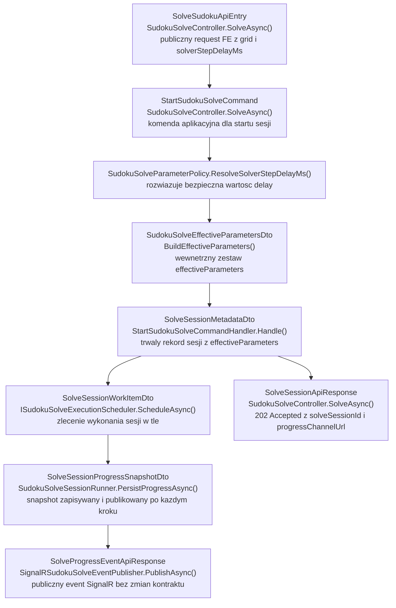
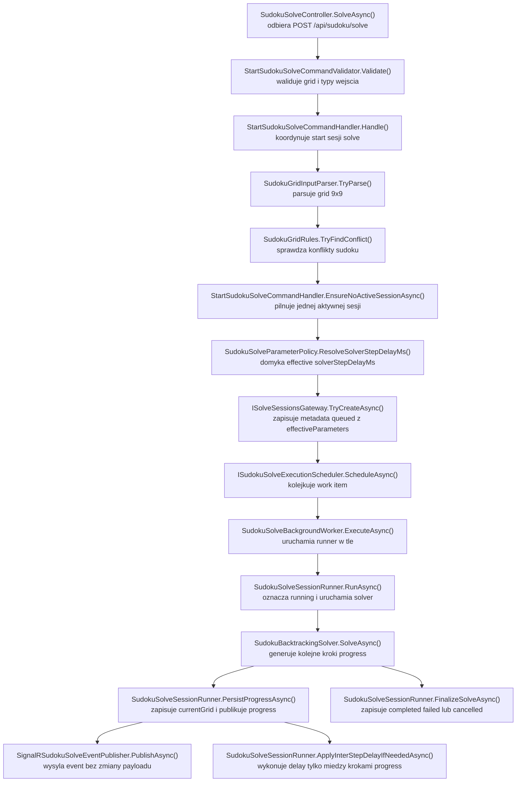

# UC-15-BE - Plan implementacyjny dla `POST /api/sudoku/solve`

## 1) Przeznaczenie endpointa
- Endpoint `POST /api/sudoku/solve` uruchamia po stronie `Backendu` asynchroniczną sesję `live solve` dla już znanego gridu `9x9`.
- W `UC-15` ten sam endpoint zostaje rozszerzony o parametr `solverStepDelayMs`, który steruje tempem publikacji kolejnych kroków backtrackingu.
- Celem nie jest zmiana wyniku solvera ani transportu `SignalR`, tylko spowolnienie sekwencji kroków pośrednich tak, aby użytkownik mógł obserwować:
  - wpisanie cyfry,
  - cofnięcie cyfry,
  - przejście do kolejnej próby.
- Odpowiedź HTTP pozostaje asynchroniczna (`202 Accepted`) i nie jest sztucznie opóźniana.
- Ten plan dotyczy wyłącznie warstwy `BE` w `src/Backend/Sudoku`.

## 2) Zakres i główne założenia
- Nie sugerujemy się tym, co aktualnie robi `FE` albo `ML` poza obowiązującymi kontraktami i wcześniej wdrożonymi historyjkami.
- `UC-15` nie dodaje nowego endpointu.
- `UC-15` nie zmienia kontraktu eventów `SignalR` z `UC-05E`.
- `UC-15` nie dodaje żadnego kontraktu `BE -> ML` ani `ML -> BE`.
- `BE` pozostaje właścicielem:
  - walidacji parametru,
  - domknięcia wartości efektywnej,
  - zapisania `effectiveParameters`,
  - wykonania opóźnienia między krokami.
- `Infrastructure` nie dostaje logiki opóźniania solvera; ma dalej odpowiadać za storage i uruchomienie pracy w tle.
- Parametr funkcjonalny `solverStepDelayMs` nie powinien być utrzymywany jako równoległe źródło prawdy w `appsettings` ani w workflow GitHub po wdrożeniu tego kroku.

## 3) Co już istnieje i musi zostać reuse'owane

### 3.1 Fundamenty już obecne w repo
- `POST /api/sudoku/solve` już istnieje.
- Istnieje storage sesji solve:
  - `ISolveSessionsGateway`,
  - `SolveSessionsGateway`,
  - `SolveSessionMetadataDto`.
- Istnieje wykonanie w tle:
  - `ISudokuSolveExecutionScheduler`,
  - `SudokuSolveExecutionScheduler`,
  - `SudokuSolveBackgroundWorker`,
  - `SudokuSolveSessionRunner`.
- Istnieje solver backtracking:
  - `ISudokuBacktrackingSolver`,
  - `SudokuBacktrackingSolver`,
  - `SudokuGrid`,
  - `SudokuGridRules`.
- Istnieje transport realtime:
  - `SudokuSolveHub`,
  - `SignalRSudokuSolveEventPublisher`,
  - `SolveProgressEventApiResponse`.
- Istnieją endpointy powiązane:
  - `GET /api/sudoku/solve/active`,
  - `POST /api/sudoku/solve/{solveSessionId}/cancel`.

### 3.2 Wniosek architektoniczny
- `UC-15` nie projektuje solve od nowa.
- Należy rozszerzyć już istniejący flow `UC-05B` + `UC-05E`.
- Nie wolno:
  - zmieniać nazw istniejących kontraktów,
  - przenosić opóźnienia do `Infrastructure`,
  - dodawać nowego endpointu pomocniczego,
  - zmieniać payloadów `SignalR`.

## 4) Kontrakty API FE i ML

### 4.1 FE -> BE (`POST /api/sudoku/solve`)
- Request pozostaje `SolveSudokuApiEntry`.
- Należy rozszerzyć go o opcjonalne pole:
  - `solverStepDelayMs: int | null`

Przykład:

```json
{
  "grid": [
    [5, 3, null, null, 7, null, null, null, null],
    [6, null, null, 1, 9, 5, null, null, null],
    [null, 9, 8, null, null, null, null, 6, null],
    [8, null, null, null, 6, null, null, null, 3],
    [4, null, null, 8, null, 3, null, null, 1],
    [7, null, null, null, 2, null, null, null, 6],
    [null, 6, null, null, null, null, 2, 8, null],
    [null, null, null, 4, 1, 9, null, null, 5],
    [null, null, null, null, 8, null, null, 7, 9]
  ],
  "solverStepDelayMs": 120
}
```

### 4.2 Rekomendowana polityka walidacji i domknięcia
- Proponowana wartość domyślna dla nowych żądań: `50 ms`.
- Proponowany dozwolony zakres: `0..2000 ms`.
- Znaczenie:
  - `0` = brak dodatkowego opóźnienia,
  - `> 0` = opóźnienie między kolejnymi krokami `progress`.
- Polityka:
  - `null` lub brak pola -> użyj `50`,
  - wartość w zakresie `0..2000` -> użyj przekazanej wartości,
  - wartość spoza zakresu -> użyj `50`,
  - błędny typ JSON (`string`, `object`, `array`) -> `400 Bad Request`.

To zachowuje zgodność z opisem `UC-15`: brak lub wartość spoza zakresu nie muszą kończyć się błędem HTTP, ale mają zostać bezpiecznie domknięte po stronie `BE`.

### 4.3 BE -> FE
- `202 Accepted` -> `SolveSessionApiResponse`
- `400 Bad Request` -> `ErrorApiResponse`
- `409 Conflict` -> `ErrorApiResponse`
- `422 Unprocessable Entity` -> `ErrorApiResponse`
- `500 Internal Server Error` -> `ErrorApiResponse`

Przykład odpowiedzi pozostaje bez zmian:

```json
{
  "solveSessionId": "solve-20260517-184500-sudoku-01",
  "status": "queued",
  "progressChannelUrl": "/ws/sudoku/solving/solve-20260517-184500-sudoku-01"
}
```

### 4.4 BE -> FE przez `SignalR`
- Brak zmian kontraktu `SolveProgressEventApiResponse`.
- Brak nowych pól w eventach `snapshot`, `progress`, `completed`, `failed`, `cancelled`.
- `UC-15` wpływa tylko na tempo emisji eventów `progress`.

### 4.5 BE -> ML
- Brak zmian.
- `solverStepDelayMs` nie jest przekazywany do `ML`.

### 4.6 ML -> BE
- Brak zmian.

## 5) Model API wejściowy i wyjściowy w komunikacji z FE i ML

### 5.1 FE -> BE
- `SolveSudokuApiEntry`
  - `grid: JsonElement?`
  - `solverStepDelayMs: int?`

### 5.2 BE -> FE
- `SolveSessionApiResponse`
  - `solveSessionId: string`
  - `status: string`
  - `progressChannelUrl: string`
- `SolveProgressEventApiResponse`
  - bez zmian
- `ErrorApiResponse`
  - `errorType: string`
  - `message: string`

### 5.3 BE -> ML
- brak

### 5.4 ML -> BE
- brak

### 5.5 Modele wewnętrzne `BE`
- `[NOWY]` `SudokuSolveEffectiveParametersDto`
  - `solverStepDelayMs: int`
- `[MODYFIKACJA]` `SolveSessionMetadataDto`
  - nowa właściwość `effectiveParameters`

Przykład docelowego fragmentu metadata sesji:

```json
{
  "solveSessionId": "solve-20260517-184500-sudoku-01",
  "status": "running",
  "progressChannelUrl": "/ws/sudoku/solving/solve-20260517-184500-sudoku-01",
  "effectiveParameters": {
    "solverStepDelayMs": 50
  }
}
```

## 6) Zachowanie per warstwa

### API (`Sudoku`)
- `SudokuSolveController` przyjmuje `solverStepDelayMs` jako część `SolveSudokuApiEntry`.
- Kontroler przekazuje wartość dalej do `StartSudokuSolveCommand`.
- Kontroler nie rozstrzyga, czy wartość jest:
  - poprawna,
  - domyślna,
  - spoza zakresu.
- Kontroler dalej pozostaje cienki.
- Publiczna odpowiedź `SolveSessionApiResponse` pozostaje bez zmian.
- Realtime `SignalR` pozostaje bez zmian kontraktowych.

### Application (`Application`)
- `StartSudokuSolveCommandHandler` rozwiązuje wartość efektywną `solverStepDelayMs`.
- `Application` zapisuje tę wartość w `effectiveParameters` sesji.
- `SudokuSolveSessionRunner` wykonuje opóźnienie tylko między kolejnymi krokami `progress`.
- `Application` nie opóźnia:
  - odpowiedzi `202`,
  - pierwszego snapshotu `running/snapshot`,
  - eventu terminalnego.
- `Application` obsługuje fallbacki:
  - brak pola,
  - wartość poza zakresem,
  - sesje legacy bez nowego pola w metadata.

### Domain / Models (`Models`)
- Logika domenowa solvera i niezmienniki planszy pozostają bez zmian.
- `SudokuGrid`, `SudokuGridRules`, `SudokuSolveEventType`, `SudokuSolveSessionStatus` są reuse'owane.
- Nie dokładamy zależności od HTTP, `SignalR`, plików ani workflow.
- Nie przenosimy `solverStepDelayMs` do domeny gridu; to parametr workflow sesji, nie samego modelu planszy.

### Infrastructure (`Infrastructure`)
- `SolveSessionsGateway` dalej serializuje metadata sesji do JSON.
- `SudokuSolveExecutionScheduler` i `SudokuSolveBackgroundWorker` pozostają bez zmian funkcjonalnych.
- `Infrastructure` nie implementuje:
  - polityki walidacji `solverStepDelayMs`,
  - fallbacków dla parametru,
  - samego `sleep`.
- Jeśli metadata dostanie nowe pole `effectiveParameters`, `Infrastructure` tylko je utrwala.

## 7) Weryfikacja antyduplikacyjna dla `Infrastructure`
- W repo już istnieje generyczny storage plikowy:
  - `IFileStorageGateway`,
  - `LocalFileStorageGateway`.
- W repo już istnieje dedykowany gateway sesji solve:
  - `ISolveSessionsGateway`,
  - `SolveSessionsGateway`.
- W repo już istnieje mechanizm pracy w tle:
  - `ISudokuSolveExecutionScheduler`,
  - `SudokuSolveExecutionScheduler`,
  - `SudokuSolveBackgroundWorker`.

Wniosek:
- nie tworzyć nowego gatewaya storage tylko po to, by zapisać `solverStepDelayMs`,
- nie tworzyć nowej usługi `Infrastructure` typu `SolveDelayService`,
- nie czytać opóźnienia z osobnego pliku konfiguracyjnego przy wykonywaniu sesji,
- delay ma być realizowany w `Application`, gdzie jest workflow sesji.

## 8) Pliki per warstwa i odpowiedzialności

### 8.1 API (`src/Backend/Sudoku/Sudoku`)
- `[MODYFIKACJA]` `Contracts/SolveSudokuApiEntry.cs`
  - dodać pole `SolverStepDelayMs`.
- `[MODYFIKACJA]` `Controllers/SudokuSolveController.cs`
  - przekazać `entry?.SolverStepDelayMs` do `StartSudokuSolveCommand`.
- `[REUSE, BEZ ZMIAN KONTRAKTU]` `Contracts/SolveSessionApiResponse.cs`
  - odpowiedź startowa sesji pozostaje bez zmian.
- `[REUSE, BEZ ZMIAN KONTRAKTU]` `Contracts/SolveProgressEventApiResponse.cs`
  - payload `SignalR` pozostaje bez zmian.
- `[REUSE]` `Hubs/SudokuSolveHub.cs`
  - nadal obsługuje połączenie do `/ws/sudoku/solving/{solveSessionId}`; bez nowych pól.
- `[REUSE]` `Realtime/SignalRSudokuSolveEventPublisher.cs`
  - dalej publikuje te same snapshoty; bez zmian w modelu publicznym.
- `[REUSE]` `Realtime/SudokuSolveRealtimeResponseMapper.cs`
  - brak zmian kontraktu realtime.
- `[REUSE]` `Realtime/SudokuSolveHubGroups.cs`
  - bez zmian.
- `[BRAK ZMIAN]` `Program.cs`
  - nie trzeba dodawać nowego endpointu, nowego huba ani nowego bindingu.

### 8.2 Application (`src/Backend/Sudoku/Application/SudokuSolve`)

#### Start sesji
- `[MODYFIKACJA]` `StartSudokuSolveCommand.cs`
  - dodać `int? SolverStepDelayMs`.
- `[MODYFIKACJA]` `StartSudokuSolveCommandValidator.cs`
  - zachować walidację `grid`;
  - nie zamieniać wartości spoza zakresu na `400`, bo to ma obsłużyć fallback biznesowy.
- `[MODYFIKACJA]` `StartSudokuSolveCommandHandler.cs`
  - rozwiązać `effectiveParameters`,
  - zapisać je w metadata,
  - zalogować przypadek fallbacku.
- `[NOWY]` `SudokuSolveEffectiveParametersDto.cs`
  - rekord z resolved parametrami sesji solve.
- `[NOWY]` `SudokuSolveParameterPolicy.cs`
  - jedno miejsce z:
    - `DefaultSolverStepDelayMs = 50`,
    - `MinSolverStepDelayMs = 0`,
    - `MaxSolverStepDelayMs = 2000`,
    - `ResolveSolverStepDelayMs(...)`.
- `[MODYFIKACJA]` `StartSudokuSolveCommandResultDto.cs`
  - bez zmian kontraktu publicznego; jeśli zostanie zmieniony, to tylko jeśli potrzebne wewnętrznie do logów lub testów, nie dla API.
- `[REUSE]` `SolveSudokuErrorTypes.cs`
  - bez nowych publicznych kodów dla out-of-range, bo to idzie ścieżką fallbacku.
- `[REUSE]` `SudokuGridInputParser.cs`
  - bez zmian; dotyczy tylko `grid`.
- `[REUSE]` `SudokuGridRules.cs`
  - bez zmian; dotyczy tylko spójności sudoku.
- `[REUSE]` `SudokuSolveExceptions.cs`
  - bez zmian, chyba że zespół zechce dodać precyzyjniejszy wyjątek techniczny dla parametru, ale nie jest to wymagane.

#### Rekord sesji i postęp
- `[MODYFIKACJA]` `SolveSessionMetadataDto.cs`
  - dodać nullable `SudokuSolveEffectiveParametersDto? EffectiveParameters = null` na końcu rekordu dla kompatybilności JSON.
- `[REUSE]` `SolveSessionProgressSnapshotDto.cs`
  - publiczny payload realtime bez zmian; nie trzeba dodawać `effectiveParameters`.
- `[REUSE]` `SolveSessionRealtimeSnapshotDto.cs`
  - bez zmian.
- `[MODYFIKACJA]` `SudokuSolveSessionRunner.cs`
  - po `SaveAndPublishLockedAsync(...)` w kroku `progress` wykonać warunkowy delay,
  - obsłużyć fallback dla legacy metadata bez `effectiveParameters`.
- `[REUSE]` `SudokuSolverStepDto.cs`
  - bez zmian.
- `[REUSE]` `SolveSessionStateTransitions.cs`
  - logika stanów pozostaje bez zmian; nowa właściwość rekordowa ma się kopiować automatycznie.
- `[REUSE]` `SudokuBacktrackingSolver.cs`
  - solver dalej generuje kroki natychmiast; throttling ma być w runnerze, nie w solverze.
- `[REUSE]` `SudokuBacktrackingSolveResultDto.cs`
  - bez zmian.

#### Porty i runtime
- `[REUSE]` `ISudokuBacktrackingSolver.cs`
  - bez zmian.
- `[REUSE]` `ISudokuSolveSessionRunner.cs`
  - bez zmian sygnatury, jeśli delay zostanie zamknięty wewnętrznie.
- `[REUSE]` `ISudokuSolveExecutionScheduler.cs`
  - bez zmian.
- `[REUSE]` `ISolveSessionsGateway.cs`
  - bez zmian.
- `[REUSE]` `ISudokuSolveEventPublisher.cs`
  - bez zmian.
- `[REUSE]` `ISolveSessionIdGenerator.cs`
  - bez zmian.
- `[REUSE]` `SolveSessionIdGenerator.cs`
  - bez zmian.
- `[REUSE]` `ISolveSessionLockProvider.cs`
  - bez zmian.
- `[REUSE]` `InMemorySolveSessionLockProvider.cs`
  - bez zmian.
- `[REUSE]` `SolveSessionWorkItemDto.cs`
  - bez zmian; delay powinien być brany z metadata, nie z work itemu.
- `[REUSE]` `NoOpSudokuSolveEventPublisher.cs`
  - bez zmian, potrzebny jako test double / fallback.

#### Endpointy powiązane, które trzeba zachować kompatybilne
- `[REUSE]` `GetActiveSolveSessionQuery.cs`
  - bez zmian.
- `[REUSE]` `GetActiveSolveSessionQueryHandler.cs`
  - brak zmian kontraktu, ale po zmianie metadata nadal musi działać poprawnie.
- `[REUSE]` `GetActiveSolveSessionQueryResultDto.cs`
  - bez zmian.
- `[REUSE]` `ActiveSolveSessionDto.cs`
  - bez zmian.
- `[REUSE]` `GetActiveSolveSessionErrorTypes.cs`
  - bez zmian.
- `[REUSE]` `GetSolveSessionRealtimeSnapshotQuery.cs`
  - bez zmian.
- `[REUSE]` `GetSolveSessionRealtimeSnapshotQueryHandler.cs`
  - bez zmian kontraktu.
- `[REUSE]` `GetSolveSessionRealtimeSnapshotResultDto.cs`
  - bez zmian.
- `[REUSE]` `CancelSolveSessionCommand.cs`
  - bez zmian.
- `[REUSE]` `CancelSolveSessionCommandValidator.cs`
  - bez zmian.
- `[REUSE]` `CancelSolveSessionCommandHandler.cs`
  - bez zmian logiki biznesowej; ma dalej działać przy sesjach z `effectiveParameters`.
- `[REUSE]` `CancelSolveSessionCommandResultDto.cs`
  - bez zmian.
- `[REUSE]` `CancelSolveSessionErrorTypes.cs`
  - bez zmian.
- `[REUSE]` `CancelSolveSessionDispositions.cs`
  - bez zmian.
- `[REUSE]` `SudokuSolveSessionsStorageOptions.cs`
  - bez zmian; dotyczy ścieżki storage, a nie parametru funkcjonalnego.

### 8.3 Domain / Models (`src/Backend/Sudoku/Models/Sudoku`)
- `[REUSE]` `SudokuGrid.cs`
  - model planszy i niezmienników solvera; bez zmian.
- `[REUSE]` `SudokuCellPosition.cs`
  - pozycja komórki; bez zmian.
- `[REUSE]` `SudokuSolveEventType.cs`
  - typy eventów `snapshot/progress/completed/failed/cancelled`; bez zmian.
- `[REUSE]` `SudokuSolveSessionStatus.cs`
  - statusy sesji; bez zmian.
- `[BRAK ZNACZENIA DLA UC-15]` `DigitInferenceResult.cs`
  - plik z `UC-05A`, nie uczestniczy w `UC-15`.

### 8.4 Infrastructure (`src/Backend/Sudoku/Infrastructure`)
- `[REUSE]` `Storage/SolveSessionsGateway.cs`
  - utrwala rozszerzone metadata sesji.
- `[REUSE]` `Background/SudokuSolveExecutionScheduler.cs`
  - bez zmian.
- `[REUSE]` `Background/SudokuSolveBackgroundWorker.cs`
  - bez zmian.
- `[REUSE]` `Background/InMemoryBackgroundOperationCancellationRegistry.cs`
  - bez zmian.
- `[BRAK ZMIAN]` `DependencyInjection.cs`
  - nie trzeba rejestrować nowej usługi `Infrastructure`.

### 8.5 Konfiguracja i workflow
- `[MODYFIKACJA]` `Sudoku/appsettings.local.json`
  - usunąć legacy sekcję `SudokuSolveExecution.DefaultSolverStepDelayMs`, aby nie zostawić równoległego źródła prawdy.
- `[BRAK ZMIAN]` `Sudoku/appsettings.production.json`
  - nie dodawać `solverStepDelayMs` do konfiguracji produkcyjnej.
- `[BRAK ZMIAN]` `Sudoku/appsettings.json`
  - brak zmian.
- `[BRAK ZMIAN]` `.github/workflows/backend-cd.yml`
  - workflow nie powinien generować produkcyjnego parametru funkcjonalnego `solverStepDelayMs`.

### 8.6 Testy
- `[MODYFIKACJA]` `Application.Tests/StartSudokuSolveCommandHandlerTests.cs`
  - dodać testy rozwiązywania `effectiveParameters`.
- `[MODYFIKACJA]` `Application.Tests/SudokuSolveSessionRunnerTests.cs`
  - dodać testy, że delay dotyczy tylko kroków `progress`.
- `[MODYFIKACJA]` `Application.Tests/SudokuSolveControllerTests.cs`
  - dodać test mapowania nowego pola requestu.
- `[EWENTUALNIE]` `Application.Tests/StartSudokuSolveCommandValidatorTests.cs`
  - tylko jeśli zespół chce jawnie utrwalić, że zakres parametru nie daje `400`, lecz jest fallbackowany w handlerze.

## 9) Przepływ w obrębie BE
1. `FE` wysyła `POST /api/sudoku/solve` z `grid` i opcjonalnym `solverStepDelayMs`.
2. `SudokuSolveController.SolveAsync()` buduje `StartSudokuSolveCommand`.
3. `ValidationBehavior` + `StartSudokuSolveCommandValidator` walidują:
   - obecność i kształt `grid`,
   - poprawny typ danych.
4. `StartSudokuSolveCommandHandler.Handle(...)`:
   - parsuje grid,
   - waliduje reguły sudoku,
   - sprawdza brak aktywnej sesji,
   - rozwiązuje `effectiveSolverStepDelayMs`.
5. Handler buduje `SolveSessionMetadataDto` z:
   - `status = queued`,
   - `currentGrid = inputGrid`,
   - `effectiveParameters.solverStepDelayMs = resolvedValue`.
6. Handler zapisuje metadata przez `ISolveSessionsGateway.TryCreateAsync(...)`.
7. Handler zleca wykonanie przez `ISudokuSolveExecutionScheduler.ScheduleAsync(...)`.
8. API zwraca `202 Accepted`.
9. `SudokuSolveBackgroundWorker` pobiera `SolveSessionWorkItemDto`.
10. `SudokuSolveSessionRunner.RunAsync(...)`:
    - pobiera metadata,
    - oznacza sesję jako `running`,
    - publikuje snapshot początkowy.
11. `SudokuBacktrackingSolver.SolveAsync(...)` generuje kolejne kroki `progress`.
12. `SudokuSolveSessionRunner.PersistProgressAsync(...)`:
    - zapisuje `currentGrid`,
    - zwiększa `sequence`,
    - publikuje `progress`,
    - odczytuje `effectiveParameters.solverStepDelayMs`,
    - wykonuje warunkowy delay przed następnym krokiem solvera.
13. Po rozwiązaniu albo błędzie runner finalizuje sesję `completed/failed/cancelled` bez dodatkowego delay.

## 10) Główne funkcje
- `SudokuSolveController.SolveAsync(...)`
- `StartSudokuSolveCommandHandler.Handle(...)`
- `SudokuSolveParameterPolicy.ResolveSolverStepDelayMs(...)`
- `StartSudokuSolveCommandHandler.BuildEffectiveParameters(...)`
- `ISolveSessionsGateway.TryCreateAsync(...)`
- `ISudokuSolveExecutionScheduler.ScheduleAsync(...)`
- `SudokuSolveBackgroundWorker.ExecuteAsync(...)`
- `SudokuSolveSessionRunner.RunAsync(...)`
- `SudokuSolveSessionRunner.PersistProgressAsync(...)`
- `SudokuSolveSessionRunner.ApplyInterStepDelayIfNeededAsync(...)`
- `SudokuSolveSessionRunner.ResolveStoredSolverStepDelayMs(...)`
- `SudokuBacktrackingSolver.SolveAsync(...)`
- `SignalRSudokuSolveEventPublisher.PublishAsync(...)`

## 11) Wyjątki, fallbacki i zachowanie błędowe

### 11.1 Statusy HTTP
- `202 Accepted`
  - grid poprawny,
  - sesja utworzona,
  - parametr opóźnienia resolved poprawnie albo fallbackowany.
- `400 Bad Request`
  - niepoprawny `grid`,
  - niepoprawny typ `solverStepDelayMs` w JSON.
- `409 Conflict`
  - istnieje już aktywna sesja solve.
- `422 Unprocessable Entity`
  - grid łamie reguły sudoku.
- `500 Internal Server Error`
  - nie udało się zapisać metadata,
  - nie udało się zlecić pracy w tle,
  - niespójny stan storage.

### 11.2 Fallbacki biznesowe dla `solverStepDelayMs`
- brak pola -> `50`
- `null` -> `50`
- `< 0` -> `50`
- `> 2000` -> `50`
- `0` -> poprawna wartość, brak opóźnienia

### 11.3 Fallback kompatybilności wstecznej dla metadata
- Jeśli runner odczyta starą sesję bez `effectiveParameters`, powinien przyjąć:
  - `0 ms` dla sesji legacy.

Uzasadnienie:
- stara sesja została uruchomiona w epoce bez parametru,
- nie wolno wymagać, aby stare pliki metadata miały nowe pole,
- nie powinno się ryzykować błędu deserializacji lub niejawnej zmiany zachowania starej sesji.

### 11.4 Zachowanie asynchroniczne po `202`
- `failed/unsolvable`
  - gdy solver nie znajdzie rozwiązania.
- `failed/solve_execution_failed`
  - gdy wystąpi problem techniczny po starcie sesji.
- `cancelled`
  - gdy sesja zostanie anulowana, także jeśli anulowanie nastąpi podczas oczekiwania w delay.

### 11.5 Czego nie robimy jako fallback
- nie czytamy `solverStepDelayMs` z `ML`,
- nie bierzemy tej wartości z workflow GitHub,
- nie bierzemy tej wartości z `appsettings.production.json`,
- nie dokładamy osobnego endpointu typu `GET /api/sudoku/solve/config`,
- nie opóźniamy odpowiedzi `202`,
- nie opóźniamy pierwszego snapshotu i eventu terminalnego bez powodu.

## 12) Specyficzna logika i pseudokod

### 12.1 Pseudokod startu sesji z resolved parametrem

```text
handleStartSudokuSolve(command):
  parsedGrid = parseValidatedGrid(command.grid)
  ensureGridHasNoRuleConflicts(parsedGrid)
  ensureNoActiveSession()

  effectiveSolverStepDelayMs =
    SudokuSolveParameterPolicy.ResolveSolverStepDelayMs(command.solverStepDelayMs)

  metadata = SolveSessionMetadata(
    solveSessionId = generateId(),
    status = "queued",
    inputGrid = parsedGrid,
    currentGrid = parsedGrid,
    progressChannelUrl = "/ws/sudoku/solving/{id}",
    effectiveParameters = {
      solverStepDelayMs = effectiveSolverStepDelayMs
    }
  )

  tryCreate(metadata)
  schedule(workItem(metadata.solveSessionId))

  return 202 Accepted
```

### 12.2 Pseudokod delay między krokami `progress`

```text
persistProgress(metadata, step, sequence):
  nextMetadata = metadata with
    currentGrid = step.currentGrid
    lastAcceptedSequence = sequence
    lastEventType = "progress"
    updatedAtUtc = now

  save(nextMetadata)
  publish(nextMetadata)

  delayMs = resolveStoredSolverStepDelayMs(nextMetadata)
  if delayMs <= 0:
    return nextMetadata

  wait(delayMs, cancellationToken)
  return nextMetadata
```

### 12.3 Pseudokod kompatybilności metadata legacy

```text
resolveStoredSolverStepDelayMs(metadata):
  if metadata.effectiveParameters is null:
    return 0  // legacy session created before UC-15

  return metadata.effectiveParameters.solverStepDelayMs
```

### 12.4 Pseudokod polityki parametru

```text
resolveSolverStepDelayMs(requestedValue):
  defaultValue = 50
  minValue = 0
  maxValue = 2000

  if requestedValue is null:
    return defaultValue

  if requestedValue < minValue or requestedValue > maxValue:
    return defaultValue

  return requestedValue
```

## 13) Mermaid flowchart - flow modeli



## 14) Mermaid flowchart - logika aplikacji z funkcjami



## 15) Logging

### 15.1 `Information`
- przyjęto start sesji solve,
- utworzono sesję `solveSessionId`,
- resolved `solverStepDelayMs`,
- sesja zakończyła się `completed`,
- sesja zakończyła się `failed`,
- sesja zakończyła się `cancelled`.

### 15.2 `Warning`
- `solverStepDelayMs` spoza zakresu -> użyto fallbacku,
- aktywna sesja blokuje start nowej,
- wykryto metadata legacy bez `effectiveParameters`,
- problem z publikacją realtime po udanym zapisie metadata.

### 15.3 `Error`
- błąd zapisu metadata sesji,
- błąd schedulera / workera,
- nieobsłużony wyjątek w runnerze,
- niespójny stan wielu aktywnych sesji.

### 15.4 Guardraile logowania
- nie logować całego `grid` przy każdym kroku,
- nie logować wszystkich eventów `progress` na `Information`,
- nie logować per krok wartości `currentGrid`,
- w logach operacyjnych wystarczą:
  - `solveSessionId`,
  - `requestedSolverStepDelayMs`,
  - `effectiveSolverStepDelayMs`,
  - `sequence`,
  - `status`,
  - `errorType`.

## 16) Workflow GitHub i konfiguracja runtime

### 16.1 Decyzja dla `UC-15`
- Dla tej historii nie dodajemy żadnej zmiennej do `.github/workflows/backend-cd.yml`.
- `solverStepDelayMs` jest parametrem funkcjonalnym sterowanym przez request, a nie środowiskiem runtime.
- Workflow dalej ma generować tylko:
  - ścieżki runtime,
  - URL-e integracyjne,
  - sekrety,
  - konfigurację infrastrukturalną.

### 16.2 Co zrobić z istniejącym stanem repo
- W `appsettings.local.json` istnieje dziś sekcja:
  - `SudokuSolveExecution.DefaultSolverStepDelayMs = 0`
- To jest legacy i nie powinno zostać rozwijane.
- W tej historii należy ją usunąć, aby:
  - nie utrzymywać równoległego źródła prawdy,
  - pozostać zgodnym z zasadą migracji `UC-14`.

### 16.3 Produkcja
- `appsettings.production.json` nie powinien dostać nowej sekcji dla `solverStepDelayMs`.
- `backend-cd.yml` nie powinien generować zmiennej typu `BE_SUDOKU_SOLVE_DEFAULT_STEP_DELAY_MS`.
- To jest zgodne z:
  - `PRD`,
  - `UC-14`,
  - dokumentem deployu.

## 17) Inne istotne reguły
- Nie zmieniać nazw już istniejących kontraktów:
  - `SolveSudokuApiEntry`,
  - `SolveSessionApiResponse`,
  - `SolveProgressEventApiResponse`,
  - `solveSessionId`,
  - `progressChannelUrl`.
- Nie zmieniać transportu `SignalR`.
- Nie dodawać pola `solverStepDelayMs` do payloadów realtime.
- Nie opóźniać `snapshot` startowego i eventu terminalnego, jeśli nie ma technicznej konieczności.
- Delay ma dotyczyć tylko faktycznych zmian planszy emitowanych jako `progress`.
- `SolveSessionMetadataDto` trzeba rozszerzyć kompatybilnie wstecz:
  - nowe pole dodać na końcu,
  - pole zrobić opcjonalne / nullable.
- `Application` ma być właścicielem polityki parametru i miejsca wykonania opóźnienia.
- `Infrastructure` ma pozostać tylko implementacją storage i background execution.

## 18) Kolejność implementacji kodu dla historyjki
1. Rozszerzyć `SolveSudokuApiEntry` o `solverStepDelayMs`.
2. Rozszerzyć `StartSudokuSolveCommand` o `solverStepDelayMs`.
3. Dodać `SudokuSolveEffectiveParametersDto`.
4. Dodać `SudokuSolveParameterPolicy`.
5. Zmodyfikować `SolveSessionMetadataDto` o `effectiveParameters`.
6. Zmodyfikować `StartSudokuSolveCommandHandler`:
   - resolve parametru,
   - zapis do metadata,
   - logowanie fallbacków.
7. Zmodyfikować `SudokuSolveController`, aby przekazywał nowe pole do komendy.
8. Zmodyfikować `SudokuSolveSessionRunner`, aby wykonywał delay po zapisaniu i opublikowaniu `progress`.
9. Dodać fallback kompatybilności dla sesji legacy bez `effectiveParameters`.
10. Usunąć legacy `SudokuSolveExecution.DefaultSolverStepDelayMs` z `appsettings.local.json`.
11. Zaktualizować testy handlera.
12. Zaktualizować testy runnera.
13. Zaktualizować testy kontrolera.
14. Manualnie zweryfikować:
   - `202` bez opóźnienia,
   - wolniejsze eventy `progress`,
   - brak zmian kontraktu `SignalR`,
   - poprawne zachowanie `cancel` podczas delay.

## 19) Guardraile implementacyjne
- Nie tworzyć nowego endpointu dla parametru delay.
- Nie przenosić delay do `Infrastructure`.
- Nie tworzyć nowej usługi `ML` ani nowego klienta HTTP.
- Nie czytać `solverStepDelayMs` z `appsettings` podczas wykonywania nowej sesji.
- Nie zmieniać payloadu `SolveSessionApiResponse`.
- Nie zmieniać payloadu `SolveProgressEventApiResponse`.
- Nie logować każdego kroku solvera na `Information`.
- Nie robić `Thread.Sleep(...)`.
- Używać mechanizmu asynchronicznego, przerywalnego przez `CancellationToken`.
- Nie łamać kompatybilności odczytu starych plików metadata.
- Nie zmieniać nazw klas i pól dodanych we wcześniejszych historyjkach.

## 20) Zależności pomiędzy historyjkami
- Twarde zależności:
  - `UC-05B`
    - dostarcza start sesji, storage, runner i solver,
  - `UC-05E`
    - dostarcza realtime `SignalR`, którego tempo ma być regulowane.
- Zależność architektoniczna:
  - `UC-14`
    - definiuje zasadę, że parametry funkcjonalne mają przechodzić przez istniejące requesty i nie powinny zostać w workflow/appsettings jako drugie źródło prawdy.
- Brak zależności od:
  - `UC-10`
    - aktywny model inferencyjny nie jest tu używany,
  - `UC-06`, `UC-08`, `UC-09`, `UC-11`, `UC-12`, `UC-13`
    - można reuse'ować wzorce techniczne, ale to nie są zależności biznesowe dla `solverStepDelayMs`.

## 21) Plan testów minimum

### 21.1 Unit - handler startu
- request bez `solverStepDelayMs` -> metadata z `effectiveParameters.solverStepDelayMs = 50`
- request z `solverStepDelayMs = 120` -> metadata z `120`
- request z `solverStepDelayMs = -1` -> metadata z fallback `50`
- request z `solverStepDelayMs = 999999` -> metadata z fallback `50`
- aktywna sesja -> dalej `409`

### 21.2 Unit - runner
- `progress` z `effectiveParameters.solverStepDelayMs = 0` -> brak dodatkowego czekania
- `progress` z `effectiveParameters.solverStepDelayMs > 0` -> delay wykonywany między krokami
- snapshot startowy nie jest opóźniany
- event terminalny nie jest opóźniany
- sesja legacy bez `effectiveParameters` -> używa `0`
- anulowanie podczas oczekiwania w delay kończy sesję `cancelled`

### 21.3 Unit / API
- kontroler przekazuje `solverStepDelayMs` do komendy
- brak zmian kształtu `SolveSessionApiResponse`
- błędny typ `solverStepDelayMs` w JSON -> `400`

### 21.4 Manual smoke
- `POST /api/sudoku/solve` z `solverStepDelayMs = 50`
- podpiąć się pod `progressChannelUrl`
- potwierdzić, że `progress` pojawia się wolniej niż bez delay
- potwierdzić brak zauważalnego opóźnienia odpowiedzi `202`
- potwierdzić brak zmian w payloadzie `SignalR`
- uruchomić `cancel` w trakcie trwania delay i potwierdzić `cancelled`

## 22) Podsumowanie decyzji architektonicznych
- `UC-15` rozszerza istniejący endpoint `POST /api/sudoku/solve`, a nie tworzy nowy.
- Parametr `solverStepDelayMs` wchodzi do publicznego requestu `FE -> BE`, ale nie zmienia publicznej odpowiedzi ani eventów `SignalR`.
- Wartość efektywna ma być liczona i zapisywana po stronie `Application`.
- Delay ma być wykonywany w `SudokuSolveSessionRunner`, tylko między krokami `progress`.
- `Infrastructure` pozostaje przy storage i background execution.
- `ML` pozostaje poza zakresem tej historii.
- Workflow GitHub i `appsettings.production.json` nie powinny przechowywać tego parametru; lokalny legacy wpis w `appsettings.local.json` należy usunąć.
