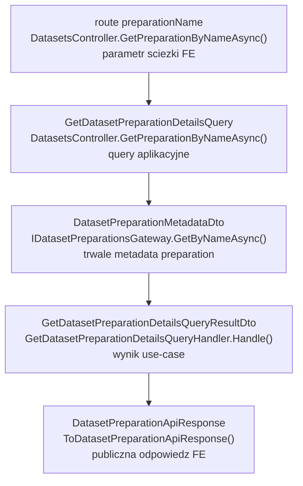
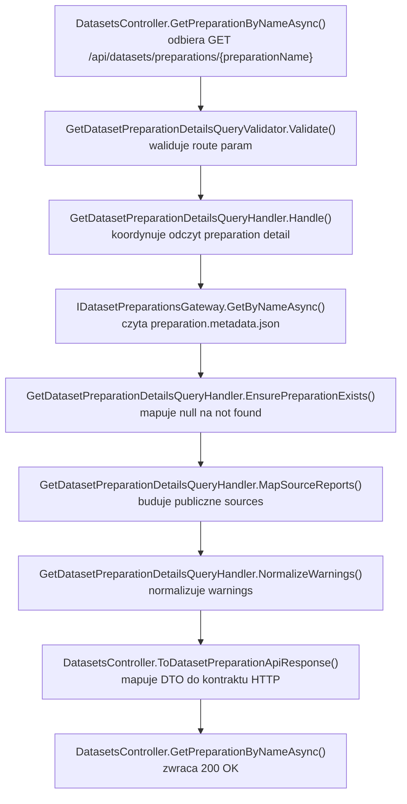

# UC-17-BE - Plan implementacyjny dla `GET /api/datasets/preparations/{preparationName}`

## 1) Przeznaczenie endpointa
- Endpoint `GET /api/datasets/preparations/{preparationName}` zwraca szczegóły pojedynczego przygotowania datasetu.
- Jego główny cel to:
  - polling statusu po `POST /api/datasets/preparations`,
  - odczyt szczegółów preparation przed wejściem w głębsze endpointy z `UC-18`,
  - dostarczenie stanu bazowego dla kolejnych kroków `UC-18` i `UC-19`.
- Endpoint jest `read-only`:
  - nie uruchamia preprocessingu,
  - nie wznawia zadań,
  - nie czyści katalogów,
  - nie wywołuje `ML`.
- `Backend` pozostaje `source of truth` dla odpowiedzi, bo dane pochodzą z własnych metadata preparation, a nie z analizy runtime `ML`.

## 2) Zakres i główne założenia
- Plan dotyczy wyłącznie części `BE` w `src/Backend/Sudoku`.
- Nie opierać kontraktu ani semantyki na obecnym `FE` lub `ML`; źródłami są:
  - `PRD`,
  - `UC-17`,
  - zależności z `UC-18` i `UC-19`,
  - aktualny backend i już wdrożone kontrakty.
- W repo są już gotowe fundamenty bytu `dataset preparation`:
  - `POST /api/datasets/preparations`,
  - `GET /api/datasets/preparations`,
  - metadata preparation,
  - gateway storage,
  - statusy,
  - recovery i worker tła.
- Ten endpoint ma tylko bezpiecznie odczytać jeden rekord po `preparationName`.
- Publiczny kontrakt ma pozostać zgodny z wcześniejszym `UC-17` i z dokumentami `UC-18` / `UC-19`:
  - odpowiedzią sukcesu ma pozostać `DatasetPreparationApiResponse`.
- Nie dokładamy nowej komunikacji `BE -> ML`.
- Nie dokładamy nowych ścieżek runtime ani nowych zmiennych workflow, jeśli aktualna konfiguracja preparation już istnieje.

## 3) Co już istnieje i musi zostać reuse'owane

### 3.1 Gotowe elementy backendu
- `DatasetsController`
  - ma już `GET /api/datasets/preparations`,
  - ma już `POST /api/datasets/preparations`.
- `DatasetPreparationApiResponse`
  - jest już publicznym kontraktem preparation.
- `DatasetPreparationSourceApiResponse`
  - jest już publicznym modelem pojedynczego źródła w preparation.
- `DatasetPreparationMetadataDto`
  - jest trwałym rekordem preparation po stronie `BE`.
- `IDatasetPreparationsGateway`
  - ma już `GetByNameAsync(preparationName)`.
- `DatasetPreparationsGateway`
  - już czyta `preparation.metadata.json`.
- `DatasetPreparationStatus`
  - dostarcza statusy `queued`, `running`, `completed`, `failed`.
- `CreateDatasetPreparationErrorTypes`
  - zawiera już błędy związane z lifecycle preparation i warningami technicznymi.
- `DatasetsPreparationOptions.PreparationsDirectoryPath`
  - już istnieje i wskazuje root storage preparation.
- `backend-cd.yml`
  - już obsługuje produkcyjny overlay dla sekcji `DatasetsPreparation`.

### 3.2 Wniosek architektoniczny
- Nie tworzyć nowego storage gateway.
- Nie skanować ręcznie struktury `board/` i `digit/` w kontrolerze ani handlerze.
- Nie odpytywać `ML`, żeby potwierdzić status preparation.
- Nie budować nowego publicznego kontraktu, jeśli obecny `DatasetPreparationApiResponse` spełnia kontrakt `UC-17`.
- Nie powielać logiki z `CreateDatasetPreparationCommandResultDto`; dla `GET detail` lepszy jest osobny query/result DTO lub jawne mapowanie z metadata.

## 4) Kontrakty API FE i ML

### 4.1 FE -> BE
- Metoda i ścieżka: `GET /api/datasets/preparations/{preparationName}`
- Request body: brak.
- Route param:
  - `preparationName: string`
- Autoryzacja:
  - token administratora z `UC-13`.

### 4.2 BE -> FE
- `200 OK` -> `DatasetPreparationApiResponse`
- `400 Bad Request` -> `ErrorApiResponse`
- `401 Unauthorized` -> `ErrorApiResponse`
- `404 Not Found` -> `ErrorApiResponse`
- `500 Internal Server Error` -> `ErrorApiResponse`

`DatasetPreparationApiResponse`:
- `preparationName`
- `createdAtUtc`
- `status`
- `sources: DatasetPreparationSourceApiResponse[]`
- `warnings`

`DatasetPreparationSourceApiResponse`:
- `name`
- `type`
- `preparedItemsCount`

Przykład `200 OK`:

```json
{
  "preparationName": "preparation-001",
  "createdAtUtc": "2026-06-19T18:42:11Z",
  "status": "completed",
  "sources": [
    {
      "name": "v1_training",
      "type": "board",
      "preparedItemsCount": 24
    },
    {
      "name": "mnist_train",
      "type": "digit",
      "preparedItemsCount": 110
    }
  ],
  "warnings": []
}
```

### 4.3 BE -> ML
- Brak nowej komunikacji.
- Ten endpoint nie inicjuje żadnego requestu do `ML`.

### 4.4 ML -> BE
- Brak nowej komunikacji.
- Wyniki `ML` są już wcześniej utrwalone w metadata preparation przez flow `POST /api/datasets/preparations`.

## 5) Model API wejściowy i wyjściowy w komunikacji z FE i ML

### 5.1 FE -> BE
- brak body,
- `preparationName` w route.

### 5.2 BE -> FE
- `[REUSE]` `DatasetPreparationApiResponse`
- `[REUSE]` `DatasetPreparationSourceApiResponse`
- `[REUSE]` `ErrorApiResponse`

### 5.3 BE -> ML
- brak komunikacji.

### 5.4 ML -> BE
- brak komunikacji.

### 5.5 Plikowy kontrakt wejściowy dla BE
- `preparation.metadata.json` w:
  - `{DatasetsPreparation.PreparationsDirectoryPath}/{preparationName}/preparation.metadata.json`
- To jest jedyne źródło danych dla tego endpointa.
- Endpoint nie powinien czytać:
  - `board/folders.json`,
  - `digit/folders.json`,
  - `board/{sourceName}/file.json`,
  - `cells/index.json`,
  - innych artefaktów technicznych preparation.

## 6) Zachowanie per warstwa

### API (`Sudoku`)
- `DatasetsController` dostaje nową akcję:
  - `[HttpGet("preparations/{preparationName}")]`
- Kontroler:
  - binduje `preparationName` z route,
  - wywołuje `MediatR`,
  - mapuje wynik do `DatasetPreparationApiResponse`,
  - mapuje wyjątki na `400/404/500`.
- API nie:
  - czyta filesystemu,
  - nie parsuje JSON,
  - nie zna `PreparationsDirectoryPath`,
  - nie interpretuje statusów,
  - nie odpytuje `ML`.

### Application (`Application`)
- `Application` odpowiada za:
  - walidację `preparationName`,
  - odczyt preparation przez `IDatasetPreparationsGateway.GetByNameAsync(...)`,
  - zamianę `null` na `404`,
  - zbudowanie DTO pod odpowiedź szczegółów,
  - normalizację `warnings`,
  - mapowanie `SourceReports` na publiczne `preparedItemsCount`.
- `Application` nie:
  - używa `File.*` ani `Directory.*`,
  - nie odczytuje `folders.json` lub `index.json`,
  - nie podejmuje decyzji o rerunie lub cleanupie.

### Domain / Models (`Models`)
- `[REUSE]` `DatasetPreparationStatus`
  - pozostaje kanonicznym źródłem nazw statusów.
- Dla tego endpointu nie trzeba dodawać nowego modelu domenowego.
- To jest odczyt rekordów systemowych i logika aplikacyjna, nie nowa domena biznesowa.

### Infrastructure (`Infrastructure`)
- `Infrastructure` implementuje już potrzebny odczyt:
  - `DatasetPreparationsGateway.GetByNameAsync(...)`
- `Infrastructure` ma nadal odpowiadać tylko za:
  - dostęp do pliku metadata,
  - deserializację JSON,
  - techniczne zgłoszenie błędu przy uszkodzonych danych.
- `Infrastructure` nie powinna:
  - mapować `404`,
  - budować `ApiResponse`,
  - zgadywać statusów z obecności katalogów.

## 7) Pliki per warstwa i odpowiedzialności

### 7.1 API (`src/Backend/Sudoku/Sudoku`)
- `[MODYFIKACJA]` `Controllers/DatasetsController.cs`
  - dodać akcję `GetPreparationByNameAsync(string preparationName, CancellationToken)`
  - wywołać `GetDatasetPreparationDetailsQuery`
  - zmapować DTO do `DatasetPreparationApiResponse`
  - mapować błędy:
    - `ValidationException` -> `400`
    - `DatasetPreparationNotFoundException` -> `404`
    - `IOException | UnauthorizedAccessException | InvalidDataException | JsonException` -> `500`
- `[REUSE]` `Contracts/DatasetPreparationApiResponse.cs`
  - publiczny kontrakt szczegółów preparation
- `[REUSE]` `Contracts/DatasetPreparationSourceApiResponse.cs`
  - publiczny raport pojedynczego źródła
- `[REUSE]` `Contracts/ErrorApiResponse.cs`
  - wspólny kontrakt błędu
- `[BRAK ZMIAN]` `Program.cs`
  - routing kontrolera i skanowanie MediatR/validatorów już istnieją

### 7.2 Application (`src/Backend/Sudoku/Application`)
- `[NOWY]` `Datasets/GetDatasetPreparationDetailsQuery.cs`
  - query MediatR z `PreparationName`
- `[NOWY]` `Datasets/GetDatasetPreparationDetailsQueryValidator.cs`
  - walidacja parametru ścieżki
- `[NOWY]` `Datasets/GetDatasetPreparationDetailsQueryHandler.cs`
  - odczyt po nazwie
  - mapowanie metadata na wynik
  - rzutowanie braku na `404`
- `[NOWY]` `Datasets/GetDatasetPreparationDetailsQueryResultDto.cs`
  - DTO wyniku dla API
- `[NOWY]` `Datasets/GetDatasetPreparationDetailsErrorTypes.cs`
  - `invalid_dataset_preparation_name`
  - `dataset_preparation_not_found`
  - opcjonalnie `dataset_preparation_read_failed`
- `[NOWY]` `Datasets/DatasetPreparationNotFoundException.cs`
  - wyjątek semantyczny `404`
- `[REUSE]` `Abstractions/IDatasetPreparationsGateway.cs`
  - `GetByNameAsync(...)`
- `[REUSE]` `Datasets/DatasetPreparationMetadataDto.cs`
  - pełne metadata preparation
- `[REUSE]` `Datasets/DatasetPreparationSourceReportDto.cs`
  - źródło prepared counts do odpowiedzi
- `[REUSE]` `Datasets/CreateDatasetPreparationSourceDto.cs`
  - lista źródeł wybranych w preparation
- `[REUSE]` `CreateDatasetPreparationErrorTypes.cs`
  - warningi i wewnętrzne failure types zapisane już w metadata

### 7.3 Domain / Models (`src/Backend/Sudoku/Models`)
- `[REUSE]` `Models/Datasets/DatasetPreparationStatus.cs`
  - statusy preparation bez zmiany kontraktu
- `[BRAK NOWYCH PLIKÓW]`
  - endpoint nie wymaga nowego modelu domenowego

### 7.4 Infrastructure (`src/Backend/Sudoku/Infrastructure`)
- `[REUSE]` `Storage/DatasetPreparationsGateway.cs`
  - `GetByNameAsync(...)` jako jedyny adapter odczytu preparation detail
- `[REUSE]` `Storage/LocalFileStorageGateway.cs`
  - generyczny adapter plikowy
- `[BRAK ZMIAN]` `DependencyInjection.cs`
  - `IDatasetPreparationsGateway` jest już zarejestrowany
- `[BRAK ZMIAN]` `Ml/*`
  - brak komunikacji z `ML`

### 7.5 Konfiguracja i workflow
- `[REUSE]` `Sudoku/appsettings.local.json`
  - `DatasetsPreparation.PreparationsDirectoryPath` już istnieje
- `[REUSE]` `Sudoku/appsettings.production.json`
  - placeholder produkcyjny dla `PreparationsDirectoryPath` już istnieje
- `[REUSE]` `.github/workflows/backend-cd.yml`
  - produkcyjny overlay już powinien podstawiać ścieżkę preparation
- `[BRAK NOWYCH PLIKÓW / BRAK NOWYCH ZMIAN]`
  - ten endpoint nie wymaga nowych envów ani nowych opcji

### 7.6 Testy (`src/Backend/Sudoku/Application.Tests`)
- `[NOWY]` `GetDatasetPreparationDetailsQueryHandlerTests.cs`
  - testy query handlera
- `[MODYFIKACJA]` `DatasetsControllerTests.cs`
  - testy nowej akcji `GET /api/datasets/preparations/{preparationName}`
- `[REUSE]` istniejące fake gatewaye dla `IDatasetPreparationsGateway`
  - jeśli wygodniej, skopiować wzorzec z `ListDatasetPreparationsQueryHandlerTests.cs`

## 8) Weryfikacja antyduplikacyjna dla `Infrastructure`
- `IDatasetPreparationsGateway.GetByNameAsync(...)` już istnieje i pokrywa potrzebę odczytu szczegółów.
- `DatasetPreparationsGateway` już:
  - czyta `preparation.metadata.json`,
  - zwraca `null` gdy metadata nie istnieją,
  - rzuca `InvalidDataException`, gdy `PreparationName` w pliku nie zgadza się z żądanym.
- Wniosek:
  - nie tworzyć `DatasetPreparationDetailsGateway`,
  - nie tworzyć `PreparationMetadataReader`,
  - nie czytać plików ręcznie z handlera.
- Jeśli w trakcie implementacji okaże się potrzebna dodatkowa operacja storage, najpierw sprawdzić, czy można ją dodać do istniejącego `IDatasetPreparationsGateway` albo `IFileStorageGateway` bez mieszania semantyki.
- Dla tego konkretnego endpointu nie ma takiej potrzeby.

## 9) Przepływ w obrębie BE
1. `FE` wywołuje `GET /api/datasets/preparations/{preparationName}` z tokenem admin.
2. Middleware autoryzacji z `UC-13` weryfikuje token.
3. `DatasetsController.GetPreparationByNameAsync(...)` binduje `preparationName`.
4. Kontroler wysyła `GetDatasetPreparationDetailsQuery(preparationName)`.
5. `ValidationBehavior` uruchamia `GetDatasetPreparationDetailsQueryValidator`.
6. `GetDatasetPreparationDetailsQueryHandler.Handle(...)` wywołuje `IDatasetPreparationsGateway.GetByNameAsync(preparationName)`.
7. Jeśli gateway zwróci `null`, handler rzuca `DatasetPreparationNotFoundException`.
8. Jeśli metadata istnieją, handler:
   - normalizuje `warnings`,
   - mapuje `SourceReports` do wyniku,
   - zwraca `GetDatasetPreparationDetailsQueryResultDto`.
9. Kontroler mapuje wynik do `DatasetPreparationApiResponse`.
10. API zwraca `200 OK`.

## 10) Główne funkcje
- `DatasetsController.GetPreparationByNameAsync(...)`
- `DatasetsController.ToDatasetPreparationApiResponse(...)`
- `GetDatasetPreparationDetailsQueryHandler.Handle(...)`
- `GetDatasetPreparationDetailsQueryValidator.Validate(...)`
- `GetDatasetPreparationDetailsQueryHandler.MapToResultDto(...)`
- `GetDatasetPreparationDetailsQueryHandler.MapSourceReports(...)`
- `GetDatasetPreparationDetailsQueryHandler.NormalizeWarnings(...)`
- `IDatasetPreparationsGateway.GetByNameAsync(...)`
- `DatasetPreparationsGateway.GetByNameAsync(...)`

## 11) Wyjątki, fallbacki i zachowanie błędowe

### 11.1 Publiczne statusy HTTP
- `200 OK`
  - preparation istnieje i metadata są poprawne
- `400 Bad Request`
  - `preparationName` pusty
  - `preparationName` zawiera `..`
  - `preparationName` zawiera `/`, `\`, `:`
  - `preparationName` zawiera znaki kontrolne albo niedozwolone znaki nazwy pliku
- `401 Unauthorized`
  - brak lub niepoprawny token admina
- `404 Not Found`
  - preparation o podanej nazwie nie istnieje
- `500 Internal Server Error`
  - błąd I/O
  - brak uprawnień do odczytu storage
  - uszkodzony JSON metadata
  - niespójne metadata, np. inna nazwa preparation w pliku

### 11.2 Fallbacki
- Jeśli status to `queued` albo `running`:
  - endpoint nadal zwraca `200`,
  - `preparedItemsCount` może być `0`,
  - `warnings` mogą być puste,
  - nie próbujemy niczego dopowiadać z filesystemu.
- Jeśli status to `failed`:
  - endpoint nadal zwraca `200`,
  - kontrakt pozostaje ten sam,
  - brak publicznego pola `failureMessage` nie jest powodem do rozszerzania kontraktu na tym etapie.
- Jeśli `warnings` w metadata są `null` albo puste:
  - normalizować do `[]`.

### 11.3 Czego nie robimy jako fallback
- Nie próbujemy odbudować odpowiedzi z:
  - `board/folders.json`,
  - `digit/folders.json`,
  - `file.json`,
  - `cells/index.json`.
- Nie odpytywujemy `ML`, by potwierdzić realny postęp.
- Nie zmieniamy statusu `queued/running/failed/completed` na podstawie obecności folderów.
- Nie odsłaniamy wewnętrznych pól:
  - `FailureErrorType`,
  - `FailureMessage`,
  jeśli nie zostały wcześniej uzgodnione w publicznym kontrakcie.

### 11.4 Sytuacje graniczne
- `completed` z warningami:
  - poprawny `200`
- `failed` po restarcie backendu z warningiem `preparation_interrupted`:
  - poprawny `200`
- istnieje katalog preparation, ale brak `preparation.metadata.json`:
  - `GetByNameAsync(...)` zwróci `null`,
  - publicznie traktujemy to jako `404`
- plik metadata istnieje, ale `PreparationName` w środku nie zgadza się z route:
  - `500`
- `SourceReports` istnieją, ale kolejność raportów jest inna niż kolejność `Sources`:
  - odpowiedź powinna pozostać deterministyczna,
  - najlepiej mapować po kolejności `Sources` lub po kluczu `name + type`,
  - nie polegać na przypadkowej kolejności serializacji

## 12) Specyficzna logika i pseudokod

### 12.1 Pseudokod handlera

```text
handleGetDatasetPreparationDetails(query):
  validate(query.preparationName)

  metadata = datasetPreparationsGateway.getByName(query.preparationName)
  if metadata is null:
    throw dataset_preparation_not_found

  sourceReports = mapPublicSourceReports(metadata)
  warnings = normalizeWarnings(metadata.warnings)

  return {
    preparationName: metadata.preparationName,
    createdAtUtc: metadata.createdAtUtc,
    status: metadata.status,
    sources: sourceReports,
    warnings: warnings
  }
```

### 12.2 Pseudokod walidacji route param

```text
validatePreparationName(preparationName):
  if preparationName is null or whitespace:
    invalid_dataset_preparation_name

  trimmed = trim(preparationName)

  if trimmed.length > 160:
    invalid_dataset_preparation_name

  if trimmed contains "..":
    invalid_dataset_preparation_name

  if trimmed contains "/" or "\" or ":":
    invalid_dataset_preparation_name

  if trimmed contains invalid filename chars or control chars:
    invalid_dataset_preparation_name
```

### 12.3 Pseudokod mapowania raportów

```text
mapPublicSourceReports(metadata):
  reportsByKey = metadata.sourceReports by (name + type)

  return metadata.sources.map(source => {
    report = reportsByKey[source.name + source.type]

    if report is null:
      return {
        name: source.name,
        type: source.type,
        preparedItemsCount: 0
      }

    return {
      name: report.name,
      type: report.type,
      preparedItemsCount: report.preparedItemsCount
    }
  })
```

### 12.4 Ważna decyzja dla mapowania
- Wewnętrznie preparation ma:
  - `Sources`
  - `SourceReports`
- Publiczny kontrakt pokazuje tylko:
  - `name`
  - `type`
  - `preparedItemsCount`
- Najbezpieczniej budować wynik na bazie `Sources`, a `preparedItemsCount` pobierać z dopasowanego `SourceReport`.
- Dzięki temu:
  - nie zgubimy źródła, gdy `SourceReports` są puste lub niepełne,
  - wynik pozostanie spójny z wyborem użytkownika.

## 13) Mermaid flowchart - flow modeli



## 14) Mermaid flowchart - logika aplikacji z funkcjami



## 15) Logging

### 15.1 `Information`
- rozpoczęto odczyt preparation detail
- preparation detail odczytano poprawnie
- w logu wystarczą:
  - `preparationName`
  - `status`

### 15.2 `Warning`
- preparation nie istnieje
- preparation ma status `failed`
- metadata nie mają pełnego `SourceReport` dla wszystkich źródeł, jeśli zdecydujemy się to tylko zalogować, a nie traktować jako błąd

### 15.3 `Error`
- błąd odczytu metadata
- błąd deserializacji metadata
- niespójność nazwy preparation w pliku metadata

### 15.4 Guardraile logowania
- nie logować całego `preparation.metadata.json`
- nie logować list wszystkich warnings przy każdym poprawnym `GET`, jeśli nie ma potrzeby
- nie logować zawartości `board/` ani `digit/`
- nie logować technicznych ścieżek systemowych w odpowiedziach HTTP
- w logach operacyjnych preferować:
  - `preparationName`
  - `status`
  - `errorType`

## 16) Workflow GitHub i konfiguracja runtime

### 16.1 Czy są potrzebne zmiany
- Dla tego endpointu nie są potrzebne nowe zmiany w:
  - `appsettings.json`
  - `appsettings.local.json`
  - `appsettings.production.json`
  - `.github/workflows/backend-cd.yml`

### 16.2 Uzasadnienie
- Endpoint tylko czyta preparation z już skonfigurowanego:
  - `DatasetsPreparation.PreparationsDirectoryPath`
- Ten path jest już używany przez:
  - `POST /api/datasets/preparations`
  - `GET /api/datasets/preparations`
- `GET detail` nie dodaje:
  - nowego runtime state,
  - nowej integracji,
  - nowego endpointu `ML`,
  - nowych katalogów produkcyjnych.

### 16.3 Ważna reguła operacyjna
- W planie trzeba jawnie zaznaczyć brak zmian workflow, aby nie dodawać zbędnych envów tylko dlatego, że dochodzi nowy endpoint.
- Nadal obowiązuje zasada z dokumentacji deployu:
  - lokalnie wartości są wpisane na sztywno,
  - produkcyjnie workflow generuje overlay `appsettings.production.json`,
  - deploy nie nadpisuje runtime state w katalogach współdzielonych.

## 17) Inne istotne reguły
- `preparationName` jest jedynym identyfikatorem zasobu w tym endpointcie.
- Nazwa ma pozostać zgodna z tym, co tworzy `POST /api/datasets/preparations`.
- Publiczny kontrakt nie powinien teraz ujawniać:
  - `FailureErrorType`
  - `FailureMessage`
  bo te pola są dziś elementem wewnętrznych metadata.
- `warnings` zwracamy bez translacji i bez filtrowania, jeśli są już utrwalone przez backend.
- Endpoint ma zwracać odpowiedź dla każdego statusu:
  - `queued`
  - `running`
  - `completed`
  - `failed`
- Nie filtrować tylko do `completed`, bo overview `UC-17` jawnie przewiduje polling.

## 18) Kolejność implementacji kodu dla historyjki
1. Dodać `GetDatasetPreparationDetailsQuery`.
2. Dodać `GetDatasetPreparationDetailsQueryValidator`.
3. Dodać `GetDatasetPreparationDetailsErrorTypes`.
4. Dodać `DatasetPreparationNotFoundException`.
5. Dodać `GetDatasetPreparationDetailsQueryResultDto`.
6. Dodać `GetDatasetPreparationDetailsQueryHandler`.
7. Rozszerzyć `DatasetsController` o `GET /api/datasets/preparations/{preparationName}`.
8. Dodać mapowanie `ValidationException -> 400`.
9. Dodać mapowanie `DatasetPreparationNotFoundException -> 404`.
10. Dodać mapowanie błędów I/O/deserializacji -> `500`.
11. Dodać testy query handlera.
12. Rozszerzyć testy `DatasetsControllerTests`.
13. Manualnie zweryfikować scenariusze `queued`, `running`, `completed`, `failed`, `404` i uszkodzone metadata.

## 19) Guardraile implementacyjne
- Nie tworzyć nowego adaptera `Infrastructure`.
- Nie odpytywać `ML`.
- Nie czytać `folders.json`, `file.json` ani `index.json` dla tego endpointu.
- Nie zmieniać publicznego kontraktu `DatasetPreparationApiResponse`, jeśli nie wynika to z osobnej decyzji kontraktowej.
- Nie mieszać logiki route validation z gatewayem storage.
- Nie przenosić logiki mapowania odpowiedzi do `Infrastructure`.
- Nie hardcodować ścieżek serwerowych ani lokalnych w kodzie.
- Nie zmieniać nazw statusów z `DatasetPreparationStatus`.
- Nie budować heurystyk na podstawie samych katalogów runtime.

## 20) Zależności pomiędzy historyjkami
- `UC-13`
  - dostarcza autoryzację admina
- `UC-17 POST /api/datasets/preparations`
  - tworzy preparation oraz metadata, które ten endpoint odczytuje
- `UC-17 GET /api/datasets/preparations`
  - dostarcza listę, z której użytkownik wybiera `preparationName`
- `UC-18`
  - konsumuje ten endpoint do wejścia w szczegóły preparation przed przeglądaniem folderów
- `UC-19`
  - konsumuje ten endpoint do potwierdzenia stanu preparation przed budową `.npz`

## 21) Plan testów minimum

### 21.1 Unit - validator
- pusty `preparationName` -> `400`
- `preparationName` z `..` -> `400`
- `preparationName` z separatorem ścieżki -> `400`
- poprawny `preparationName` -> walidacja przechodzi

### 21.2 Unit - handler
- metadata istnieją -> poprawne mapowanie do wyniku
- `SourceReports` zawiera dane dla `board` i `digit` -> poprawne `preparedItemsCount`
- preparation nie istnieje -> `DatasetPreparationNotFoundException`
- `warnings = []` -> odpowiedź z pustą listą
- status `failed` -> nadal poprawne `200` po mapowaniu wyniku

### 21.3 API
- poprawny odczyt -> `200 OK`
- brak autoryzacji -> `401`
- niepoprawny `preparationName` -> `400`
- brak preparation -> `404`
- `IOException` z gateway -> `500`
- `InvalidDataException` z gateway -> `500`

### 21.4 Manual smoke
- preparation `queued` po świeżym `POST` -> `status = queued`
- preparation `running` w trakcie workera -> `status = running`
- preparation `completed` po sukcesie -> widoczne prepared counts
- preparation `failed` po błędzie `ML` -> `status = failed`
- nieistniejąca nazwa -> `404`
- uszkodzony `preparation.metadata.json` -> `500`

## 22) Podsumowanie decyzji architektonicznych
- `GET /api/datasets/preparations/{preparationName}` jest cienkim endpointem odczytowym nad istniejącym bytem `dataset preparation`.
- Dane muszą pochodzić wyłącznie z `DatasetPreparationMetadataDto` odczytanego przez `IDatasetPreparationsGateway.GetByNameAsync(...)`.
- Publiczny kontrakt powinien reuse'ować `DatasetPreparationApiResponse`, bez nowego modelu HTTP.
- Nie są potrzebne nowe usługi `Infrastructure`, nowe opcje konfiguracyjne ani nowe zmienne workflow.
- Najważniejsze decyzje implementacyjne to:
  - walidacja `preparationName`,
  - mapowanie `null` na `404`,
  - spójne mapowanie `Sources + SourceReports`,
  - brak fallbacku do `ML` i brak heurystyk filesystemowych.
