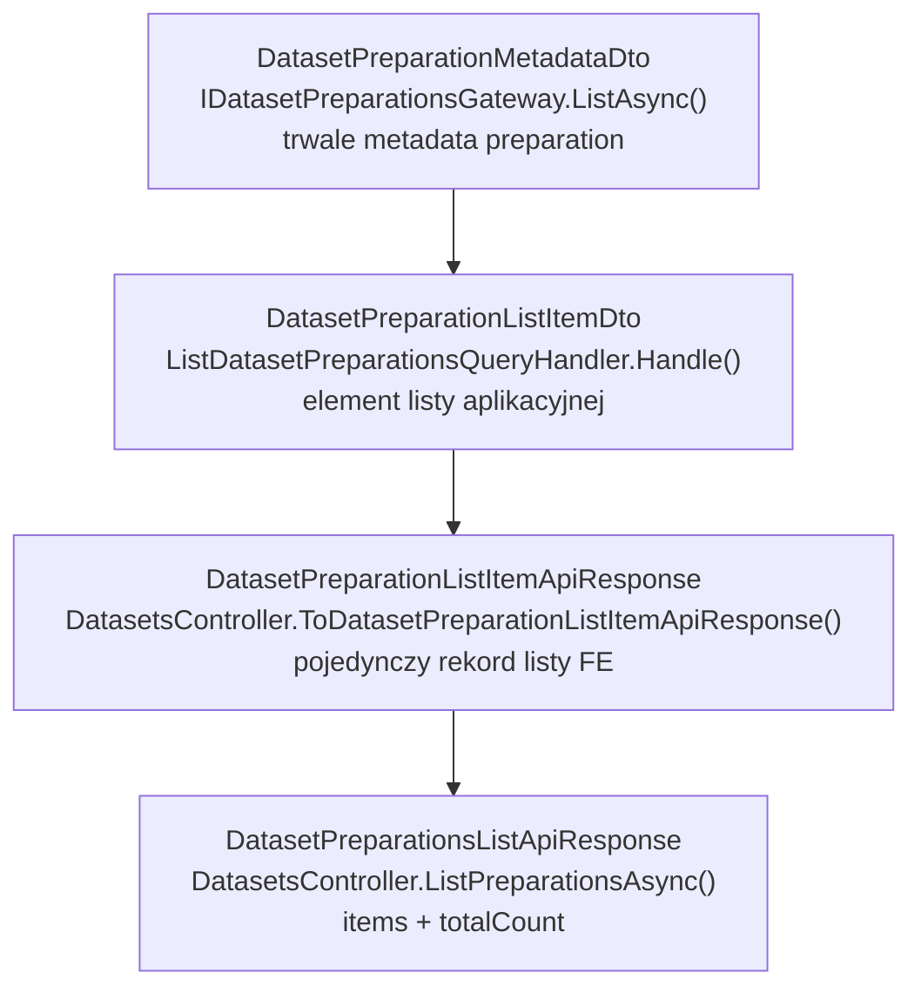
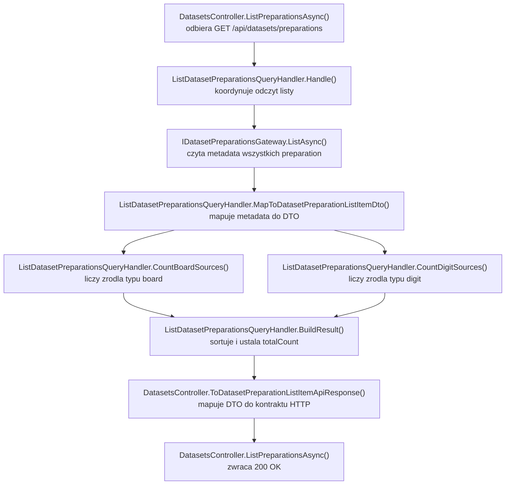

# UC-17-BE - Plan implementacyjny dla `GET /api/datasets/preparations`

## 1) Przeznaczenie endpointa
- Endpoint `GET /api/datasets/preparations` zwraca listę istniejących przygotowań datasetu.
- Jest to endpoint tylko do odczytu, potrzebny jako punkt wejścia do dalszego workflow:
  - `UC-17` do podglądu utworzonych preparation,
  - `UC-18` do wyboru preparation do przeglądania i czyszczenia,
  - `UC-19` do wyboru preparation jako źródła budowy finalnego `.npz`.
- `BE` zwraca listę z własnego trwałego źródła prawdy, czyli z metadanych preparation zapisanych wcześniej przez `POST /api/datasets/preparations`.
- Endpoint nie uruchamia preprocessingu, nie wywołuje `ML` i nie modyfikuje stanu preparation.

## 2) Zakres i główne założenia
- Plan dotyczy wyłącznie części `BE` w `src/Backend/Sudoku`.
- Nie sugerujemy się aktualnym stanem `FE` ani `ML` poza obowiązującymi kontraktami i już wdrożonymi historyjkami.
- Endpoint musi być zgodny z kontraktem z `UC-17` i używać istniejącego bytu `dataset preparation`.
- `BE` pozostaje `source of truth` dla:
  - listy preparation,
  - statusu `queued` / `running` / `completed` / `failed`,
  - czasu utworzenia preparation,
  - powiązanych źródeł `board` i `digit`.
- Lista ma być budowana tylko z zapisanych metadanych `BE`, nie z analizy folderów `board/` lub `digit/`.
- Dla tego endpointu nie są potrzebne nowe ścieżki konfiguracyjne ani nowe zmiany w GitHub workflow, bo wszystko potrzebne do odczytu zostało już dodane przy `POST /api/datasets/preparations`.

## 3) Co już istnieje i należy reuse'ować

### 3.1 Istniejące elementy backendu
- `DatasetsController` już obsługuje:
  - `GET /api/datasets/raw-candidates`,
  - `POST /api/datasets/preparations`,
  - `POST /api/datasets/processed`,
  - `GET /api/datasets/processed`.
- Istnieje trwały storage preparation:
  - `IDatasetPreparationsGateway`,
  - `DatasetPreparationsGateway`.
- Istnieją już potrzebne operacje odczytowe:
  - `ListAsync()`,
  - `GetByNameAsync()`.
- Istnieje model metadata preparation:
  - `DatasetPreparationMetadataDto`.
- Istnieje model statusu:
  - `DatasetPreparationStatus`.
- Istnieje kontrakt pojedynczego preparation używany przez `POST`:
  - `DatasetPreparationApiResponse`,
  - `DatasetPreparationSourceApiResponse`.
- Istnieje konfiguracja katalogu preparation:
  - `DatasetsPreparationOptions.PreparationsDirectoryPath`.
- Istnieje ochrona endpointów administracyjnych:
  - `[Authorize]`.

### 3.2 Wzorce do skopiowania
- Dla listy należy oprzeć się na wzorcu z:
  - `ListProcessedDatasetsQuery`,
  - `ListProcessedDatasetsQueryHandler`,
  - `ProcessedDatasetsListApiResponse`,
  - `DatasetsController.ListProcessedAsync(...)`.
- Dla logowania i mapowania błędów listy warto naśladować:
  - `TrainingsController.ListAsync(...)`.

### 3.3 Wniosek architektoniczny
- Nie tworzyć nowego gateway do filesystemu.
- Nie skanować ręcznie `board/` i `digit/` poza `DatasetPreparationsGateway.ListAsync()`.
- Nie czytać listy preparation przez `ML`.
- Nie dublować logiki statusów w `Api` ani `Infrastructure`.

## 4) Kontrakt API i modele komunikacji

### 4.1 FE -> BE
- Metoda i ścieżka: `GET /api/datasets/preparations`
- Request:
  - brak body,
  - brak parametrów query,
  - tylko autoryzacja admin.

### 4.2 BE -> FE
`DatasetPreparationsListApiResponse`:
- `items: DatasetPreparationListItemApiResponse[]`
- `totalCount: number`

`DatasetPreparationListItemApiResponse`:
- `preparationName: string`
- `createdAtUtc: string`
- `status: string`
- `boardSourcesCount: number`
- `digitSourcesCount: number`

Przykładowa odpowiedź `200 OK`:

```json
{
  "items": [
    {
      "preparationName": "preparation-001",
      "createdAtUtc": "2026-06-19T18:42:11Z",
      "status": "completed",
      "boardSourcesCount": 1,
      "digitSourcesCount": 1
    },
    {
      "preparationName": "preparation-002",
      "createdAtUtc": "2026-06-19T19:05:44Z",
      "status": "running",
      "boardSourcesCount": 2,
      "digitSourcesCount": 0
    }
  ],
  "totalCount": 2
}
```

### 4.3 BE -> ML
- Brak komunikacji z `ML` dla tego endpointu.
- To ważna decyzja architektoniczna: lista ma pochodzić z metadata `BE`, nie z runtime `ML`.

### 4.4 ML -> BE
- Brak komunikacji zwrotnej dla tego endpointu.

## 5) Modele wewnętrzne i zasada mapowania

### 5.1 Modele wewnętrzne używane bez zmian
- `[REUSE]` `DatasetPreparationMetadataDto`
  - źródło prawdy dla pojedynczego wpisu listy.
- `[REUSE]` `CreateDatasetPreparationSourceDto`
  - używany do policzenia liczby źródeł `board` i `digit`.
- `[REUSE]` `DatasetPreparationStatus`
  - używany bez translacji nazw statusów.

### 5.2 Nowe modele do dodania po stronie `BE`
- `[NOWY]` `ListDatasetPreparationsQuery`
- `[NOWY]` `ListDatasetPreparationsQueryResultDto`
- `[NOWY]` `DatasetPreparationListItemDto`
- `[NOWY]` `ListDatasetPreparationsErrorTypes`
- `[NOWY]` `DatasetPreparationsListApiResponse`
- `[NOWY]` `DatasetPreparationListItemApiResponse`

### 5.3 Reguła mapowania
- `items[*].preparationName` pochodzi z `metadata.PreparationName`
- `items[*].createdAtUtc` pochodzi z `metadata.CreatedAtUtc`
- `items[*].status` pochodzi z `metadata.Status`
- `items[*].boardSourcesCount` liczymy z `metadata.Sources`
- `items[*].digitSourcesCount` liczymy z `metadata.Sources`
- `totalCount = items.Length`

### 5.4 Ważna reguła biznesowa
- Liczniki źródeł należy liczyć z `metadata.Sources`, a nie z `SourceReports`, ponieważ:
  - dla `queued` i `running` raporty mogą być niepełne lub puste,
  - lista ma opisywać wybrane źródła preparation, a nie tylko zakończone raporty z `ML`.

## 6) Zachowanie per warstwa

### API (`Sudoku`)
- `DatasetsController` dostaje nową akcję `GET /api/datasets/preparations`.
- Kontroler:
  - wywołuje `MediatR` z `ListDatasetPreparationsQuery`,
  - mapuje wynik do `DatasetPreparationsListApiResponse`,
  - zwraca `200 OK`,
  - mapuje błędy odczytu na `500`.
- Kontroler nie:
  - liczy statusów,
  - skanuje katalogów ręcznie,
  - filtruje preparation na podstawie zawartości `board/` albo `digit/`,
  - wywołuje `ML`.

### Application (`Application`)
- `Application` odpowiada za:
  - pobranie listy metadata przez port,
  - sortowanie wyników,
  - policzenie `boardSourcesCount` i `digitSourcesCount`,
  - zbudowanie DTO listy.
- `Application` nie odpowiada za:
  - odczyt plików niskopoziomowo,
  - deserializację JSON metadata,
  - logikę ścieżek katalogów.

### Domain / Models (`Models`)
- Dla tego endpointu nie trzeba dodawać nowych modeli domenowych.
- `[REUSE]` `DatasetPreparationStatus` pozostaje jedynym wspólnym modelem domenowym istotnym dla listy.

### Infrastructure (`Infrastructure`)
- `Infrastructure` udostępnia już gotowy odczyt:
  - `IDatasetPreparationsGateway.ListAsync()`.
- `Infrastructure` nie powinna być rozszerzana o logikę biznesową listy.
- Jeżeli metadata preparation są uszkodzone lub niespójne, `Infrastructure` sygnalizuje wyjątek, a nie maskuje go cichym fallbackiem.

## 7) Pliki per warstwa i odpowiedzialności

### 7.1 API (`src/Backend/Sudoku/Sudoku`)
- `[MODYFIKACJA]` `Controllers/DatasetsController.cs`
  - dodać akcję `ListPreparationsAsync(CancellationToken)`
  - wywołać `new ListDatasetPreparationsQuery()`
  - zmapować wynik na `DatasetPreparationsListApiResponse`
  - złapać błędy odczytu i zwrócić `500`
- `[NOWY]` `Contracts/DatasetPreparationsListApiResponse.cs`
  - kontrakt odpowiedzi listy
- `[NOWY]` `Contracts/DatasetPreparationListItemApiResponse.cs`
  - pojedynczy element listy preparation
- `[REUSE]` `Contracts/ErrorApiResponse.cs`
  - wspólny kontrakt błędu

### 7.2 Application (`src/Backend/Sudoku/Application`)
- `[NOWY]` `Datasets/ListDatasetPreparationsQuery.cs`
  - query bez parametrów
- `[NOWY]` `Datasets/ListDatasetPreparationsQueryHandler.cs`
  - pobiera metadata, sortuje, liczy źródła, buduje wynik
- `[NOWY]` `Datasets/ListDatasetPreparationsQueryResultDto.cs`
  - wynik query z `Items` i `TotalCount`
- `[NOWY]` `Datasets/DatasetPreparationListItemDto.cs`
  - wewnętrzny element listy dla API
- `[NOWY]` `Datasets/ListDatasetPreparationsErrorTypes.cs`
  - stała `errorType` dla błędu odczytu listy
- `[REUSE]` `Abstractions/IDatasetPreparationsGateway.cs`
  - źródło danych wejściowych do query
- `[REUSE]` `Datasets/DatasetPreparationMetadataDto.cs`
  - baza do mapowania listy
- `[REUSE]` `Datasets/CreateDatasetPreparationSourceDto.cs`
  - baza do policzenia `boardSourcesCount` i `digitSourcesCount`

### 7.3 Domain / Models (`src/Backend/Sudoku/Models`)
- `[REUSE]` `Models/Datasets/DatasetPreparationStatus.cs`
  - lista ma zwracać istniejące statusy bez zmiany kontraktu
- `[BRAK NOWYCH PLIKÓW]`
  - GET list nie wnosi nowego modelu domenowego

### 7.4 Infrastructure (`src/Backend/Sudoku/Infrastructure`)
- `[REUSE]` `Storage/DatasetPreparationsGateway.cs`
  - `ListAsync()` już istnieje i ma zostać wykorzystane bez zmian
- `[REUSE]` `Storage/LocalFileStorageGateway.cs`
  - pozostaje niskopoziomowym adapterem plikowym
- `[BRAK NOWYCH PLIKÓW]`
  - ten endpoint nie wymaga nowego gateway, klienta HTTP ani workera

### 7.5 Testy (`src/Backend/Sudoku/Application.Tests`)
- `[NOWY]` `ListDatasetPreparationsQueryHandlerTests.cs`
  - testy query handlera
- `[MODYFIKACJA]` `DatasetsControllerTests.cs`
  - testy nowej akcji `GET /api/datasets/preparations`
- `[REUSE]` istniejące test doubles dla `IDatasetPreparationsGateway`
  - jeśli już pokrywają `ListAsync`, użyć ich zamiast tworzyć nowy infrastructure fake

## 8) Przepływ w obrębie backendu
1. `FE` wywołuje `GET /api/datasets/preparations`.
2. `DatasetsController.ListPreparationsAsync(...)` sprawdza autoryzację i wysyła `ListDatasetPreparationsQuery`.
3. `ListDatasetPreparationsQueryHandler.Handle(...)` pobiera listę metadata przez `IDatasetPreparationsGateway.ListAsync(...)`.
4. Handler sortuje preparation malejąco po `CreatedAtUtc`.
5. Handler dla każdego metadata liczy:
   - liczbę źródeł `board`,
   - liczbę źródeł `digit`.
6. Handler mapuje wynik do `DatasetPreparationListItemDto`.
7. Kontroler mapuje DTO do `DatasetPreparationListItemApiResponse`.
8. API zwraca `200 OK` z `DatasetPreparationsListApiResponse`.

## 9) Główne funkcje
- `DatasetsController.ListPreparationsAsync(...)`
- `ListDatasetPreparationsQueryHandler.Handle(...)`
- `IDatasetPreparationsGateway.ListAsync(...)`
- `MapToDatasetPreparationListItemDto(...)`
- `CountBoardSources(...)`
- `CountDigitSources(...)`
- `ToDatasetPreparationListItemApiResponse(...)`

## 10) Wyjątki, fallbacki i zachowanie błędowe

### 10.1 Statusy HTTP
- `200 OK`
  - lista została poprawnie odczytana
- `401 Unauthorized`
  - brak poprawnej autoryzacji admina
- `500 Internal Server Error`
  - nie udało się odczytać lub zdeserializować metadata preparation

### 10.2 Błędy techniczne mapowane na `500`
- `IOException`
- `UnauthorizedAccessException`
- `InvalidDataException`
- `JsonException`
- `FileStorageItemNotFoundException`

### 10.3 Fallbacki
- Jeśli katalog preparation istnieje, ale nie ma w nim `preparation.metadata.json`, gateway może pominąć taki wpis przy `ListAsync()`.
- Jeśli plik metadata istnieje, ale jest uszkodzony albo ma niespójną nazwę `PreparationName`, należy zwrócić `500`, a nie udawać poprawnej listy.
- Jeśli lista jest pusta, zwracamy:
  - `items: []`
  - `totalCount: 0`
  - nadal `200 OK`

### 10.4 Czego nie robimy jako fallback
- Nie próbujemy odbudować listy z samych nazw katalogów.
- Nie zgadujemy statusu na podstawie obecności plików `board/` albo `digit/`.
- Nie odpytywamy `ML`, żeby potwierdzić, czy preparation istnieje.
- Nie ukrywamy uszkodzonych metadata za częściowym sukcesem, bo `BE` ma pozostać wiarygodnym źródłem prawdy.

## 11) Specyficzna logika i pseudokod

### 11.1 Pseudokod query handlera

```text
handleListDatasetPreparations():
  metadataItems = datasetPreparationsGateway.list()

  items = metadataItems
    .orderByDescending(createdAtUtc)
    .map(metadata => {
      boardSourcesCount = count(metadata.sources where type == "board")
      digitSourcesCount = count(metadata.sources where type == "digit")

      return {
        preparationName: metadata.preparationName,
        createdAtUtc: metadata.createdAtUtc,
        status: metadata.status,
        boardSourcesCount: boardSourcesCount,
        digitSourcesCount: digitSourcesCount
      }
    })

  return {
    items: items,
    totalCount: items.length
  }
```

### 11.2 Pseudokod kontrolera

```text
listPreparations():
  result = sender.send(new ListDatasetPreparationsQuery())

  responseItems = result.items.map(item => {
    preparationName: item.preparationName,
    createdAtUtc: item.createdAtUtc,
    status: item.status,
    boardSourcesCount: item.boardSourcesCount,
    digitSourcesCount: item.digitSourcesCount
  })

  return 200 {
    items: responseItems,
    totalCount: result.totalCount
  }
```

## 12) Mermaid flowchart - flow modeli



## 13) Mermaid flowchart - logika aplikacji z funkcjami



## 14) Logging

### 14.1 `Information`
- rozpoczęto listowanie preparation
- zakończono listowanie preparation
- `totalCount`

### 14.2 `Warning`
- opcjonalnie tylko gdy w przyszłości świadomie dodamy częściowe pomijanie wpisów z brakującym metadata
- na ten moment lepiej nie dodawać dodatkowych warningów w pętli per wpis, żeby nie spamować logów

### 14.3 `Error`
- nie udało się odczytać listy preparation
- metadata preparation są uszkodzone lub niespójne

### 14.4 Guardraile logowania
- nie logować każdego preparation osobno przy poprawnym odczycie
- nie logować zawartości `preparation.metadata.json`
- nie logować list `sources` dla wszystkich rekordów przy każdym `GET`
- wystarczą:
  - `totalCount`
  - ogólny status operacji
  - `errorType` przy błędzie

## 15) GitHub workflow i konfiguracja runtime

### 15.1 Czy są potrzebne zmiany
- Dla `GET /api/datasets/preparations` nie są potrzebne nowe zmiany w:
  - `appsettings.json`,
  - `appsettings.local.json`,
  - `appsettings.production.json`,
  - `.github/workflows/backend-cd.yml`.

### 15.2 Uzasadnienie
- Endpoint tylko odczytuje preparation z już skonfigurowanego:
  - `DatasetsPreparation.PreparationsDirectoryPath`.
- Ten path i obsługa `MlService.DatasetPreparationsPath` zostały już dodane dla `POST /api/datasets/preparations`.
- `GET` nie dodaje żadnego nowego katalogu runtime ani nowej integracji z usługą zewnętrzną.

### 15.3 Ważna reguła operacyjna
- W planie trzeba jawnie zaznaczyć brak zmian workflow, aby nie dokładać zbędnych envów i placeholderów produkcyjnych tylko dlatego, że powstaje nowy endpoint.

## 16) Inne istotne reguły
- Lista ma pokazywać wszystkie preparation niezależnie od statusu:
  - `queued`,
  - `running`,
  - `completed`,
  - `failed`.
- Sortowanie: najnowsze preparation na górze listy.
- `status` zwracamy bez translacji i bez mapowania do innych nazw.
- `boardSourcesCount` i `digitSourcesCount` liczymy z wyboru źródeł, nie z wyniku `ML`.
- Nie filtrować tylko do `completed`, bo `UC-17` zakłada również możliwość sprawdzania stanu preparation w toku.
- Nie rozszerzać tego endpointu teraz o paginację, filtry ani wyszukiwanie, bo nie wynikają z kontraktu historyjki.

## 17) Kolejność implementacji
1. Dodać `DatasetPreparationListItemDto`.
2. Dodać `ListDatasetPreparationsQuery`.
3. Dodać `ListDatasetPreparationsQueryResultDto`.
4. Dodać `ListDatasetPreparationsErrorTypes`.
5. Dodać `ListDatasetPreparationsQueryHandler`.
6. Dodać kontrakty API:
   - `DatasetPreparationListItemApiResponse`
   - `DatasetPreparationsListApiResponse`
7. Rozszerzyć `DatasetsController` o `GET /api/datasets/preparations`.
8. Dodać testy handlera.
9. Rozszerzyć testy kontrolera.
10. Zweryfikować manualnie scenariusz pustej listy, listy mieszanych statusów i błędu odczytu metadata.

## 18) Guardraile implementacyjne
- Nie dodawać nowego adaptera `Infrastructure`.
- Nie odpytywać `ML`.
- Nie liczyć `boardSourcesCount` i `digitSourcesCount` z `SourceReports`.
- Nie filtrować wyników do `completed`.
- Nie zmieniać istniejących kontraktów `POST /api/datasets/preparations`.
- Nie zmieniać nazw statusów z `DatasetPreparationStatus`.
- Nie dokładać zmian do workflow tylko dlatego, że endpoint jest nowy.
- Nie przenosić logiki sortowania i liczenia do kontrolera.

## 19) Zależności pomiędzy historyjkami
- `UC-11`
  - pośrednia zależność, bo źródła wpisane do metadata pochodzą z wyboru kandydatów `raw`
- `UC-13`
  - dostarcza ochronę endpointu przez autoryzację admina
- `UC-17 POST /api/datasets/preparations`
  - twarda zależność, bo bez niego nie powstaną metadata do zwracania na liście
- `UC-18`
  - zużywa ten endpoint do wyboru preparation do przeglądania i usuwania elementów
- `UC-19`
  - zużywa ten endpoint do wyboru preparation do budowy `.npz`

## 20) Plan testów minimum

### 20.1 Unit - handler
- pusta lista metadata -> `items = []`, `totalCount = 0`
- dwa wpisy z różnym `CreatedAtUtc` -> wynik posortowany malejąco
- mixed `board` + `digit` -> poprawne `boardSourcesCount` i `digitSourcesCount`
- `queued` i `running` z pustym `SourceReports` -> liczby źródeł nadal poprawne

### 20.2 API
- poprawny odczyt -> `200 OK`
- brak autoryzacji -> `401`
- `IOException` z gateway -> `500`
- `InvalidDataException` z gateway -> `500`

### 20.3 Manual smoke
- brak preparation w katalogu -> pusta lista
- dwa poprawne preparation -> lista z `totalCount = 2`
- preparation `failed` i `running` -> oba widoczne na liście
- uszkodzony `preparation.metadata.json` -> `500`

## 21) Podsumowanie decyzji architektonicznych
- `GET /api/datasets/preparations` jest cienkim endpointem odczytowym nad już istniejącym storage metadata.
- Nie wymaga nowych usług `Infrastructure`, nowych opcji konfiguracyjnych ani nowych zmian w workflow GitHub.
- Logika biznesowa endpointu jest mała, ale musi pozostać w `Application`: sortowanie, liczenie źródeł i budowa DTO.
- `BE` nie może opierać listy na `ML` ani na heurystycznym skanie struktury plików.
- Najważniejszy reuse to `IDatasetPreparationsGateway.ListAsync()` oraz istniejące metadata utworzone przez `POST /api/datasets/preparations`.
