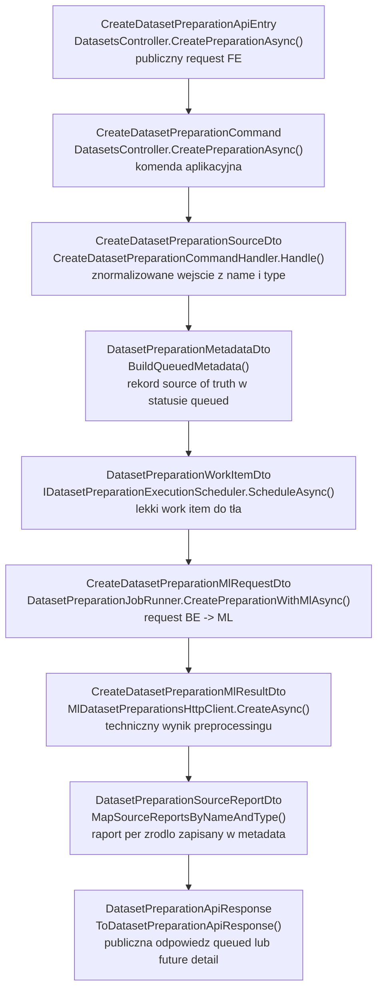
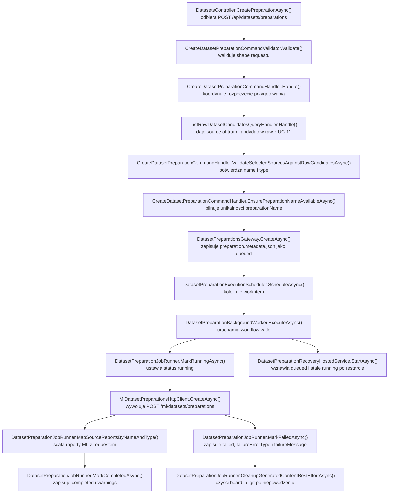

# UC-17-BE - Plan implementacyjny dla `POST /api/datasets/preparations`

## 1) Przeznaczenie endpointa
- Endpoint `POST /api/datasets/preparations` tworzy nowy, trwały byt pośredni pomiędzy `raw` a finalnym `.npz`.
- Celem `BE` nie jest wykonanie preprocessingu obrazów, tylko:
  - zwalidowanie requestu,
  - potwierdzenie spójności źródeł z `UC-11`,
  - utworzenie rekordu przygotowania jako `source of truth`,
  - uruchomienie ciężkiego preprocessingu po stronie `ML`,
  - zapis statusu, ostrzeżeń i raportów per źródło.
- Ten endpoint nie buduje jeszcze `.npz`.
- Ten plan dotyczy wyłącznie warstwy `BE` w `src/Backend/Sudoku`.

## 2) Zakres i główne założenia
- Nie sugerujemy się tym, co aktualnie robi `FE` lub `ML`, poza obowiązującymi kontraktami i wcześniej wdrożonymi historyjkami.
- `UC-17` tworzy nowy byt `dataset preparation`; nie refaktoruje jeszcze istniejącego `POST /api/datasets/processed`.
- `BE` pozostaje właścicielem:
  - walidacji wejścia,
  - unikalności `preparationName`,
  - statusów `queued` / `running` / `completed` / `failed`,
  - rekordu widocznego później w `GET /api/datasets/preparations*`,
  - mapowania błędów wejściowych na statusy HTTP,
  - logiki recovery po restarcie procesu.
- `ML` wykonuje wyłącznie techniczne przygotowanie plików:
  - `corrected-board.png`,
  - `folders.json`,
  - `file.json`,
  - `cells/index.json`,
  - `digit/index.json`,
  - gotowych `.png`.
- `Infrastructure` ma pozostać implementacją portów:
  - storage metadanych przygotowania,
  - klienta HTTP do `ML`,
  - wykonania pracy w tle.
- `Application` ma być właścicielem workflow, walidacji spójności i statusów.
- Plan zakłada asynchroniczny charakter endpointu:
  - `POST` rezerwuje nazwę i zwraca rekord w statusie `queued`,
  - właściwe przygotowanie jest wykonywane w tle,
  - szczegóły i status są odczytywane później przez `GET /api/datasets/preparations/{preparationName}`.

## 3) Co już istnieje i musi zostać reuse'owane

### 3.1 Fundamenty już obecne w repo
- Istnieje `DatasetsController`.
- Istnieje `GET /api/datasets/raw-candidates` oraz jego cały flow aplikacyjny z `UC-11`:
  - `ListRawDatasetCandidatesQuery`,
  - `ListRawDatasetCandidatesQueryHandler`,
  - `ListRawDatasetCandidatesQueryResultDto`,
  - `ListRawDatasetCandidateItemDto`,
  - `RawDatasetsStorageOptions`.
- Istnieje generyczny storage plikowy:
  - `IFileStorageGateway`,
  - `LocalFileStorageGateway`.
- Istnieje aktualny flow `UC-12`, z którego trzeba reuse'ować wzorce architektoniczne, ale nie semantykę endpointu:
  - `DatasetsPreparationOptions`,
  - `IMlDatasetsPreparationGateway`,
  - `MlDatasetsPreparationHttpClient`,
  - `IProcessedDatasetsGateway`,
  - `ProcessedDatasetsGateway`.
- Istnieje wzorzec pracy w tle w `BE`:
  - `SudokuSolveExecutionScheduler`,
  - `SudokuSolveBackgroundWorker`,
  - `IBackgroundOperationCancellationRegistry`.
- Istnieje ochrona endpointów administracyjnych z `UC-13` przez `[Authorize]`.
- Istnieje produkcyjny workflow backendowy `backend-cd.yml`, który generuje `appsettings.production.json`.

### 3.2 Wniosek architektoniczny
- Nie wolno budować równoległego systemu wykrywania źródeł `raw`; źródłem prawdy pozostaje `UC-11`.
- Nie wolno budować nowego generycznego local storage dla tego use-case'u; trzeba oprzeć się o `IFileStorageGateway`.
- Nie wolno nadpisywać istniejących nazw i kontraktów z `UC-11` i `UC-12`; nowy byt ma zostać dołożony obok nich.
- Nie wolno zmieniać semantyki istniejącego `PrepareDatasetPath` z `UC-12`; dla `UC-17` trzeba dodać osobną ścieżkę `ML`.

## 4) Kontrakty API FE i ML

### 4.1 FE -> BE (`POST /api/datasets/preparations`)
- Metoda i ścieżka: `POST /api/datasets/preparations`
- Charakter operacji: asynchroniczne rozpoczęcie długiego preprocessingu
- Sukces: `202 Accepted` + `DatasetPreparationApiResponse`
- Błędy synchroniczne:
  - `400 Bad Request`
  - `401 Unauthorized`
  - `404 Not Found`
  - `409 Conflict`
  - `422 Unprocessable Entity`
  - `500 Internal Server Error`

`CreateDatasetPreparationApiEntry`:
- `preparationName: string`
- `sources: CreateDatasetPreparationSourceApiEntry[]`

`CreateDatasetPreparationSourceApiEntry`:
- `name: string`
- `type: string` (`board` | `digit`)

`DatasetPreparationApiResponse`:
- `preparationName: string`
- `createdAtUtc: string`
- `status: string`
- `sources: DatasetPreparationSourceApiResponse[]`
- `warnings: string[]`

`DatasetPreparationSourceApiResponse`:
- `name: string`
- `type: string`
- `preparedItemsCount: number`

Przykładowa odpowiedź `202`:

```json
{
  "preparationName": "preparation-001",
  "createdAtUtc": "2026-06-19T18:42:11Z",
  "status": "queued",
  "sources": [
    {
      "name": "v1_training",
      "type": "board",
      "preparedItemsCount": 0
    },
    {
      "name": "mnist_train",
      "type": "digit",
      "preparedItemsCount": 0
    }
  ],
  "warnings": []
}
```

### 4.2 Decyzja o `202 Accepted`
- `UC-17` uruchamia ciężki preprocessing plansz i próbek.
- W overview istnieje jawne założenie późniejszego pollingu statusu przez `GET /api/datasets/preparations/{preparationName}`.
- Najspójniejszy model po stronie `BE` to:
  - natychmiastowa rezerwacja rekordu,
  - odpowiedź `202`,
  - wykonanie pracy w tle,
  - późniejsze odczytywanie statusu przez `GET`.
- Dzięki temu:
  - request HTTP nie musi czekać na pełne przetworzenie,
  - `BE` pozostaje `source of truth` dla statusów,
  - restart lub błąd `ML` może zostać odzwierciedlony w statusie przygotowania.

### 4.3 BE -> ML (`POST /ml/datasets/preparations`)
`CreateDatasetPreparationMlRequestDto`:
- `preparationName: string`
- `sources: CreateDatasetPreparationMlSourceDto[]`

`CreateDatasetPreparationMlSourceDto`:
- `name: string`
- `type: string` (`board` | `digit`)

`CreateDatasetPreparationMlResponseDto`:
- `preparationName: string`
- `createdAtUtc: string`
- `status: string`
- `sourceReports: DatasetPreparationMlSourceReportDto[]`
- `warnings: string[]`

`DatasetPreparationMlSourceReportDto`:
- `name: string`
- `type: string`
- `preparedItemsCount: number`
- `rejectedItemsCount: number`
- `emptyCellCount: number`

### 4.4 Reguła źródła prawdy dla odpowiedzi ML
- `ML` może zwracać `createdAtUtc` i `status`, bo taki kontrakt wynika z overview.
- `BE` nie powinien jednak traktować tych pól jako źródła prawdy biznesowej.
- `BE`:
  - generuje własne `createdAtUtc`,
  - samodzielnie ustawia finalny status rekordu,
  - traktuje `sourceReports` i `warnings` jako techniczny wynik preprocessingu,
  - ewentualną niespójność `preparationName` lub `status` z odpowiedzi `ML` traktuje jako `Warning` / błąd integracyjny.

## 5) Model API wejściowy i wyjściowy w komunikacji z FE i ML

### 5.1 FE -> BE
- `CreateDatasetPreparationApiEntry`
  - `preparationName`
  - `sources`
- `CreateDatasetPreparationSourceApiEntry`
  - `name`
  - `type`

### 5.2 BE -> FE
- `DatasetPreparationApiResponse`
  - `preparationName`
  - `createdAtUtc`
  - `status`
  - `sources`
  - `warnings`
- `DatasetPreparationSourceApiResponse`
  - `name`
  - `type`
  - `preparedItemsCount`
- `ErrorApiResponse`
  - `errorType`
  - `message`

### 5.3 BE -> ML
- `CreateDatasetPreparationMlRequestDto`
  - `preparationName`
  - `sources`
- `CreateDatasetPreparationMlSourceDto`
  - `name`
  - `type`

### 5.4 ML -> BE
- `CreateDatasetPreparationMlResponseDto`
  - `preparationName`
  - `createdAtUtc`
  - `status`
  - `sourceReports`
  - `warnings`
- `DatasetPreparationMlSourceReportDto`
  - `name`
  - `type`
  - `preparedItemsCount`
  - `rejectedItemsCount`
  - `emptyCellCount`

### 5.5 Modele wewnętrzne `BE`
- `[NOWY]` `CreateDatasetPreparationCommand`
- `[NOWY]` `CreateDatasetPreparationCommandResultDto`
- `[NOWY]` `CreateDatasetPreparationSourceDto`
- `[NOWY]` `DatasetPreparationMetadataDto`
- `[NOWY]` `DatasetPreparationSourceReportDto`
- `[NOWY]` `DatasetPreparationWorkItemDto`
- `[NOWY]` `CreateDatasetPreparationErrorTypes`
- `[NOWY]` `IDatasetPreparationsGateway`
- `[NOWY]` `IMlDatasetPreparationsGateway`
- `[NOWY]` `IDatasetPreparationExecutionScheduler`

Wewnętrzny rekord metadanych powinien przechowywać więcej niż publiczny kontrakt, co najmniej:
- `PreparationName`
- `CreatedAtUtc`
- `UpdatedAtUtc`
- `StartedAtUtc`
- `FinishedAtUtc`
- `Status`
- `Sources`
- `Warnings`
- `FailureErrorType`
- `FailureMessage`

`FailureErrorType` i `FailureMessage` są potrzebne do recovery, logów i późniejszego `GET detail`, ale nie muszą być od razu wystawiane w `POST`.

## 6) Zachowanie per warstwa

### API (`Sudoku`)
- `DatasetsController` przyjmuje `CreateDatasetPreparationApiEntry`.
- Kontroler:
  - mapuje request do `CreateDatasetPreparationCommand`,
  - wywołuje `MediatR`,
  - zwraca `202 Accepted`,
  - mapuje wyjątki wejściowe i konflikt nazwy.
- Kontroler nie:
  - skanuje filesystemu,
  - nie wywołuje `ML` bezpośrednio,
  - nie oblicza statusów,
  - nie buduje ścieżek katalogów.

### Application (`Application`)
- `Application` waliduje i orkiestruje cały workflow:
  - czy `preparationName` jest poprawne,
  - czy lista źródeł nie jest pusta,
  - czy nie ma duplikatów,
  - czy każde źródło istnieje w `UC-11`,
  - czy `type` zgadza się z aktualnym kandydatem.
- `Application` rezerwuje rekord przygotowania jako `queued`.
- `Application` zleca pracę w tle.
- `Application` aktualizuje status:
  - `queued -> running`
  - `running -> completed`
  - `running -> failed`
- `Application` odpowiada za recovery po restarcie:
  - `queued` powinno zostać wznowione,
  - `running` przerwane restartem powinno zostać wznowione albo jawnie oznaczone jako `failed`.
- `Application` nie wykonuje preprocessingu obrazów.

### Domain / Models (`Models`)
- Warstwa `Models` nie powinna dostać kontraktów HTTP ani logiki storage.
- Dla `UC-17` warto wprowadzić tylko neutralny model statusów:
  - `DatasetPreparationStatus`.
- Status powinien być współdzielony między `Application` i `Infrastructure`, ale bez zależności od kontrolera i JSON API.

### Infrastructure (`Infrastructure`)
- `Infrastructure` implementuje:
  - zapis i odczyt metadanych przygotowania,
  - cleanup technicznych katalogów po błędzie,
  - klienta HTTP `BE -> ML`,
  - kolejkę i worker tła.
- `Infrastructure` nie interpretuje:
  - co znaczy `board` i `digit`,
  - jak walidować źródła względem `UC-11`,
  - kiedy preparation ma być `failed` biznesowo.

## 7) Weryfikacja antyduplikacyjna dla `Infrastructure`
- `IFileStorageGateway` już posiada operacje potrzebne do tego use-case'u:
  - `SaveAsync`
  - `ReplaceAsync`
  - `DeleteDirectoryAsync`
  - `OpenReadAsync`
  - `ListFilesAsync`
  - `ListDirectoriesAsync`
- Wniosek:
  - nie tworzyć nowego adaptera lokalnego storage dla katalogów i plików,
  - zbudować cienki `DatasetPreparationsGateway` nad istniejącym `IFileStorageGateway`.
- `ProcessedDatasetsGateway` już istnieje, ale jest wyspecjalizowany pod finalne `.npz`.
- Nie wolno dopisywać do `ProcessedDatasetsGateway` odpowiedzialności za `UC-17`, bo zmiesza to dwa różne byty:
  - finalny processed dataset,
  - przygotowanie datasetu.
- `MlDatasetsPreparationHttpClient` już istnieje, ale obsługuje stary flow `UC-12` do `/ml/datasets/prepare`.
- Nie wolno rozszerzać tej klasy o drugi endpoint `UC-17`; trzeba dodać osobny klient `MlDatasetPreparationsHttpClient`.

## 8) Pliki per warstwa i odpowiedzialności

### 8.1 API (`src/Backend/Sudoku/Sudoku`)
- `[MODYFIKACJA]` `Controllers/DatasetsController.cs`
  - dodać akcję `POST /api/datasets/preparations`
  - mapować wynik na `202`
  - mapować wyjątki na `400/401/404/409/422/500`
- `[NOWY]` `Contracts/CreateDatasetPreparationApiEntry.cs`
  - model requestu HTTP
- `[NOWY]` `Contracts/CreateDatasetPreparationSourceApiEntry.cs`
  - pojedyncze źródło z `name` i `type`
- `[NOWY]` `Contracts/DatasetPreparationApiResponse.cs`
  - model odpowiedzi `POST`
- `[NOWY]` `Contracts/DatasetPreparationSourceApiResponse.cs`
  - publiczny raport źródła
- `[REUSE]` `Contracts/ErrorApiResponse.cs`
  - wspólny kontrakt błędu
- `[BRAK ZMIAN W TEJ HISTORYJCE]` `Program.cs`
  - routing kontrolera już istnieje; zmiany dotyczą tylko konfiguracji opcji

### 8.2 Application (`src/Backend/Sudoku/Application`)

#### Komenda i walidacja
- `[NOWY]` `Datasets/CreateDatasetPreparationCommand.cs`
  - komenda use-case
- `[NOWY]` `Datasets/CreateDatasetPreparationCommandValidator.cs`
  - walidacja `preparationName`, `sources`, duplikatów, `type`
- `[NOWY]` `Datasets/CreateDatasetPreparationCommandResultDto.cs`
  - wynik zwracany do API
- `[NOWY]` `Datasets/CreateDatasetPreparationErrorTypes.cs`
  - stałe `errorType`
- `[NOWY]` `Datasets/CreateDatasetPreparationSourceDto.cs`
  - źródło wejściowe komendy

#### Workflow przygotowania
- `[NOWY]` `Datasets/CreateDatasetPreparationCommandHandler.cs`
  - walidacja spójności z `UC-11`
  - rezerwacja nazwy
  - zapis metadata `queued`
  - enqueue work item
- `[NOWY]` `Datasets/DatasetPreparationJobRunner.cs`
  - wykonanie właściwego flow w tle:
    - `running`
    - wywołanie `ML`
    - aktualizacja statusu `completed` / `failed`
- `[NOWY]` `Datasets/DatasetPreparationWorkItemDto.cs`
  - lekki payload kolejki, co najmniej `PreparationName`

#### Metadane i raporty
- `[NOWY]` `Datasets/DatasetPreparationMetadataDto.cs`
  - rekord trwały `BE` dla statusu i szczegółów
- `[NOWY]` `Datasets/DatasetPreparationSourceReportDto.cs`
  - raport źródła przechowywany w metadata
- `[NOWY]` `Datasets/DatasetPreparationFailureDto.cs` lub pola w `DatasetPreparationMetadataDto`
  - techniczna informacja o błędzie do recovery i logów

#### Integracja z `ML`
- `[NOWY]` `Datasets/CreateDatasetPreparationMlRequestDto.cs`
  - request do `ML`
- `[NOWY]` `Datasets/CreateDatasetPreparationMlSourceDto.cs`
  - źródło dla `ML`
- `[NOWY]` `Datasets/CreateDatasetPreparationMlResultDto.cs`
  - wynik z `ML`
- `[NOWY]` `Datasets/DatasetPreparationMlSourceReportDto.cs`
  - raport źródła z `ML`

#### Porty
- `[NOWY]` `Abstractions/IDatasetPreparationsGateway.cs`
  - storage metadata i cleanup techniczny
- `[NOWY]` `Abstractions/IMlDatasetPreparationsGateway.cs`
  - port do `/ml/datasets/preparations`
- `[NOWY]` `Abstractions/IDatasetPreparationExecutionScheduler.cs`
  - port do kolejki pracy w tle
- `[REUSE]` `Abstractions/IFileStorageGateway.cs`
  - transport plikowy dla metadata i cleanup
- `[REUSE]` `Datasets/ListRawDatasetCandidatesQuery.cs`
  - źródło prawdy kandydatów `raw`
- `[REUSE]` `Datasets/ListRawDatasetCandidatesQueryHandler.cs`
  - nie duplikować logiki `UC-11`
- `[REUSE]` `Datasets/RawDatasetNotFoundException.cs`
  - gdy źródło zniknęło
- `[REUSE]` `Datasets/RawDatasetTypeMismatchException.cs`
  - gdy `type` nie zgadza się z kandydatem
- `[MODYFIKACJA]` `Datasets/DatasetsPreparationOptions.cs`
  - dodać `PreparationsDirectoryPath`
  - nie zmieniać istniejących pól używanych przez `UC-12`

### 8.3 Domain / Models (`src/Backend/Sudoku/Models`)
- `[NOWY]` `Models/Datasets/DatasetPreparationStatus.cs`
  - stałe lub enum:
    - `queued`
    - `running`
    - `completed`
    - `failed`
- `[BRAK INNYCH NOWYCH MODELI DOMENOWYCH]`
  - logika tego use-case'u jest workflow aplikacyjnym, nie modelem domenowym obrazu

### 8.4 Infrastructure (`src/Backend/Sudoku/Infrastructure`)

#### Storage
- `[NOWY]` `Storage/DatasetPreparationsGateway.cs`
  - implementacja `IDatasetPreparationsGateway`
  - zapis `preparation.metadata.json`
  - odczyt metadata po nazwie
  - listowanie przygotowań dla przyszłego `GET`
  - best-effort cleanup `board/` i `digit/` po błędzie
- `[REUSE]` `Storage/LocalFileStorageGateway.cs`
  - bez logiki use-case, tylko operacje techniczne

#### ML client
- `[NOWY]` `Ml/MlDatasetPreparationsHttpClient.cs`
  - implementacja `IMlDatasetPreparationsGateway`
  - `POST` na nową ścieżkę `MlService.DatasetPreparationsPath`
  - mapowanie `timeout`, `503`, `5xx`, `422`
- `[MODYFIKACJA]` `Configuration/MlServiceOptions.cs`
  - dodać `DatasetPreparationsPath`
- `[REUSE]` `Ml/MlDatasetsPreparationHttpClient.cs`
  - bez zmiany semantyki `UC-12`

#### Background execution
- `[NOWY]` `Background/DatasetPreparationExecutionScheduler.cs`
  - implementacja `IDatasetPreparationExecutionScheduler`
- `[NOWY]` `Background/DatasetPreparationBackgroundWorker.cs`
  - pobiera work itemy z kanału i uruchamia `DatasetPreparationJobRunner`
- `[NOWY]` `Background/DatasetPreparationRecoveryHostedService.cs`
  - po starcie procesu wyszukuje `queued` i `running`
  - wznowi `queued`
  - dla `running` podejmuje spójną strategię recovery
- `[MODYFIKACJA]` `DependencyInjection.cs`
  - rejestracja nowych portów, kanału, workera i klienta HTTP

### 8.5 Konfiguracja i workflow
- `[MODYFIKACJA]` `Sudoku/Program.cs`
  - walidacja `DatasetsPreparationOptions.PreparationsDirectoryPath` jako ścieżki absolutnej
- `[MODYFIKACJA]` `Sudoku/appsettings.json`
  - dodać bazową ścieżkę `MlService.DatasetPreparationsPath = "/ml/datasets/preparations"`
- `[MODYFIKACJA]` `Sudoku/appsettings.local.json`
  - dodać na sztywno `DatasetsPreparation.PreparationsDirectoryPath`
- `[MODYFIKACJA]` `Sudoku/appsettings.production.json`
  - dodać placeholdery:
    - `MlService.DatasetPreparationsPath`
    - `DatasetsPreparation.PreparationsDirectoryPath`
- `[MODYFIKACJA]` `.github/workflows/backend-cd.yml`
  - dodać walidację i generowanie nowych wartości produkcyjnych

### 8.6 Testy
- `[NOWY]` `Application.Tests/CreateDatasetPreparationCommandHandlerTests.cs`
  - testy handlera
- `[NOWY]` `Application.Tests/DatasetPreparationJobRunnerTests.cs`
  - testy statusów i wywołania `ML`
- `[NOWY]` `Application.Tests/MlDatasetPreparationsHttpClientTests.cs`
  - testy mapowania błędów klienta `ML`
- `[MODYFIKACJA]` `Application.Tests/DatasetsControllerTests.cs` lub nowy plik dedykowany
  - test akcji `POST /api/datasets/preparations`

## 9) Przepływ w obrębie BE
1. `FE` wysyła `POST /api/datasets/preparations`.
2. `DatasetsController.CreatePreparationAsync(...)` mapuje request do `CreateDatasetPreparationCommand`.
3. `ValidationBehavior` + `CreateDatasetPreparationCommandValidator` sprawdzają shape requestu.
4. `CreateDatasetPreparationCommandHandler.Handle(...)`:
   - normalizuje `preparationName`,
   - normalizuje `sources`,
   - pobiera kandydatów z `UC-11`,
   - potwierdza spójność `name + type`,
   - sprawdza konflikt nazwy.
5. Handler tworzy rekord `DatasetPreparationMetadataDto` w statusie `queued`.
6. Handler zapisuje metadata przez `IDatasetPreparationsGateway.CreateAsync(...)`.
7. Handler zleca wykonanie przez `IDatasetPreparationExecutionScheduler.ScheduleAsync(...)`.
8. API zwraca `202 Accepted` z rekordem `queued`.
9. `DatasetPreparationBackgroundWorker` odbiera `DatasetPreparationWorkItemDto`.
10. Worker wywołuje `DatasetPreparationJobRunner.RunAsync(preparationName)`.
11. Runner odczytuje metadata i przechodzi do `running`.
12. Runner buduje request `CreateDatasetPreparationMlRequestDto`.
13. Runner wywołuje `IMlDatasetPreparationsGateway.CreateAsync(...)`.
14. Po sukcesie:
    - mapuje raporty źródeł,
    - zapisuje `warnings`,
    - ustawia `completed`,
    - zapisuje `FinishedAtUtc`.
15. Po błędzie:
    - zapisuje `failed`,
    - uzupełnia `FailureErrorType` i `FailureMessage`,
    - wykonuje best-effort cleanup `board/` i `digit/`,
    - dopisuje warning, jeśli cleanup był niepełny.

## 10) Główne funkcje
- `DatasetsController.CreatePreparationAsync(...)`
- `CreateDatasetPreparationCommandHandler.Handle(...)`
- `CreateDatasetPreparationCommandValidator.Validate(...)`
- `ValidateSelectedSourcesAgainstRawCandidatesAsync(...)`
- `EnsurePreparationNameAvailableAsync(...)`
- `BuildQueuedMetadata(...)`
- `IDatasetPreparationExecutionScheduler.ScheduleAsync(...)`
- `DatasetPreparationBackgroundWorker.ExecuteAsync(...)`
- `DatasetPreparationJobRunner.RunAsync(...)`
- `DatasetPreparationJobRunner.MarkRunningAsync(...)`
- `DatasetPreparationJobRunner.CreatePreparationWithMlAsync(...)`
- `DatasetPreparationJobRunner.MarkCompletedAsync(...)`
- `DatasetPreparationJobRunner.MarkFailedAsync(...)`
- `DatasetPreparationJobRunner.CleanupGeneratedContentBestEffortAsync(...)`
- `MlDatasetPreparationsHttpClient.CreateAsync(...)`
- `DatasetPreparationsGateway.CreateAsync(...)`
- `DatasetPreparationsGateway.UpdateAsync(...)`
- `DatasetPreparationsGateway.ListAsync(...)`
- `DatasetPreparationsGateway.GetByNameAsync(...)`
- `DatasetPreparationRecoveryHostedService.StartAsync(...)`

## 11) Wyjątki, fallbacki i zachowanie błędowe

### 11.1 Statusy HTTP dla samego `POST`
- `202 Accepted`
  - rekord przygotowania został zapisany jako `queued`
  - zadanie zostało zakolejkowane
- `400 Bad Request`
  - pusty `preparationName`
  - pusta lista `sources`
  - duplikat `name + type`
  - nieobsługiwany `type`
- `401 Unauthorized`
  - brak tokenu admina
- `404 Not Found`
  - wskazane źródło z `requestu` nie istnieje już w `UC-11`
- `409 Conflict`
  - `preparationName` już zajęte
- `422 Unprocessable Entity`
  - źródło istnieje, ale `type` jest niezgodny z aktualnym kandydatem
- `500 Internal Server Error`
  - nie udało się zapisać metadata lub zakolejkować zadania

### 11.2 Błędy asynchroniczne po przyjęciu `POST`
- Niedostępność `ML` nie powinna zmieniać odpowiedzi `POST`, jeśli rekord został już przyjęty.
- Zamiast tego rekord przechodzi do `failed`, a błąd jest zapisany w metadata i logach.
- Dotyczy to m.in.:
  - `ml_unavailable`
  - `ml_timeout`
  - błędnego JSON z `ML`
  - błędów zapisu plików po stronie `ML`
  - niespójnego raportu `sourceReports`

### 11.3 Fallbacki i recovery
- Jeśli `ML` zwróci źródła w innej kolejności niż request:
  - mapować po kluczu `name + type`, nie po indeksie.
- Jeśli `ML` nie zwróci raportu dla któregoś źródła:
  - traktować to jako błąd integracyjny,
  - ustawić `failed`.
- Jeśli cleanup po błędzie nie powiedzie się w pełni:
  - nie maskować pierwotnego błędu,
  - dopisać warning typu `preparation_cleanup_partial`.
- Jeśli backend zrestartuje się przy rekordzie `queued`:
  - recovery powinno go ponownie zakolejkować.
- Jeśli backend zrestartuje się przy rekordzie `running`:
  - recovery powinno przyjąć jedną spójną politykę:
    - albo wznowić zadanie od początku,
    - albo oznaczyć rekord jako `failed` z ostrzeżeniem `preparation_interrupted`.

### 11.4 Czego nie robimy jako fallback
- Nie zgadujemy `type` po nazwie źródła.
- Nie odtwarzamy brakujących raportów z samej struktury katalogów po fakcie.
- Nie udajemy sukcesu, jeśli `ML` zakończyło się częściowym błędem.
- Nie nadpisujemy istniejącego przygotowania o tej samej nazwie.
- Nie budujemy `.npz`.

## 12) Specyficzna logika i pseudokod

### 12.1 Pseudokod przyjęcia `POST`

```text
handleCreatePreparation(command):
  validate(command)

  normalizedName = trim(command.preparationName)
  normalizedSources = normalizeAndDistinct(command.sources)

  rawCandidates = loadRawCandidatesFromUc11()
  ensureSourcesMatchCandidates(normalizedSources, rawCandidates)
  ensurePreparationNameAvailable(normalizedName)

  metadata = buildQueuedMetadata(
    preparationName = normalizedName,
    createdAtUtc = nowUtc,
    status = "queued",
    sourceReports = sources with preparedItemsCount = 0
  )

  preparationsGateway.create(metadata)
  executionScheduler.schedule(preparationName = normalizedName)

  return queuedResponse(metadata)
```

### 12.2 Pseudokod pracy w tle

```text
runPreparation(preparationName):
  metadata = preparationsGateway.getByName(preparationName)
  if metadata is null:
    log warning and stop

  runningMetadata = metadata with status = "running", startedAtUtc = nowUtc
  preparationsGateway.update(runningMetadata)

  mlResult = mlDatasetPreparationsGateway.create({
    preparationName: metadata.preparationName,
    sources: metadata.sources.map(name, type)
  })

  reports = mapSourceReportsByNameAndType(metadata.sources, mlResult.sourceReports)

  completedMetadata = runningMetadata with
    status = "completed"
    updatedAtUtc = nowUtc
    finishedAtUtc = nowUtc
    sourceReports = reports
    warnings = merge(metadata.warnings, mlResult.warnings)

  preparationsGateway.update(completedMetadata)
```

### 12.3 Pseudokod błędu i cleanup

```text
handlePreparationFailure(metadata, exception):
  try:
    preparationsGateway.cleanupGeneratedContent(metadata.preparationName)
  catch cleanupException:
    append warning "preparation_cleanup_partial"
    log cleanupException

  failedMetadata = metadata with
    status = "failed"
    updatedAtUtc = nowUtc
    finishedAtUtc = nowUtc
    failureErrorType = mapFailureErrorType(exception)
    failureMessage = exception.message
    warnings = merge(metadata.warnings, warningsFromFailureAndCleanup)

  preparationsGateway.update(failedMetadata)
```

### 12.4 Pseudokod weryfikacji źródeł

```text
ensureSourcesMatchCandidates(selectedSources, rawCandidates):
  candidatesByName = group rawCandidates by name

  for each source in selectedSources:
    if source.name not in candidatesByName:
      throw raw_dataset_not_found

    if no candidate with same type:
      throw raw_dataset_type_mismatch
```

## 13) Mermaid flowchart - flow modeli



## 14) Mermaid flowchart - logika aplikacji z funkcjami



## 15) Logging

### 15.1 `Information`
- przyjęto request utworzenia przygotowania
- zapisano rekord `queued`
- zakolejkowano pracę w tle
- preparation przeszło do `running`
- preparation zakończyło się `completed`
- preparation zakończyło się `failed`

### 15.2 `Warning`
- źródło z requestu zniknęło między widokiem listy a `POST`
- `ML` zwróciło niespójny payload, np. brak raportu dla źródła
- recovery odnalazło `running` po restarcie
- cleanup po błędzie był tylko częściowo skuteczny

### 15.3 `Error`
- błąd zapisu metadata
- błąd klienta HTTP do `ML`
- timeout `ML`
- błąd deserializacji odpowiedzi `ML`
- nieobsłużony wyjątek workera

### 15.4 Guardraile logowania
- nie logować per próbka, per plansza ani per komórka
- nie logować pełnych payloadów obrazów ani indeksów
- nie logować całego requestu, jeśli zawiera wiele źródeł; wystarczą nazwy i typy
- w logach operacyjnych wystarczą:
  - `preparationName`
  - liczba źródeł
  - lista `name + type`
  - status
  - `failureErrorType`

## 16) Workflow GitHub i konfiguracja runtime

### 16.1 Decyzja konfiguracyjna
- Lokalnie wartości wpisujemy na sztywno do `appsettings.local.json`.
- Produkcyjnie workflow generuje `appsettings.production.json`.
- Nie hardkodujemy ścieżek w kodzie.

### 16.2 Zmiany w `DatasetsPreparationOptions`
- Dodać nowe pole:
  - `PreparationsDirectoryPath`
- Nie usuwać ani nie zmieniać istniejących:
  - `BoardsSubdirectory`
  - `DigitsSubdirectory`
  - `ProcessedDatasetsDirectoryPath`
  - `TemporaryArtifactsDirectoryPath`
  - `DefaultPreprocessingProfile`
- Uzasadnienie:
  - `UC-12` już używa istniejących pól,
  - `UC-17` potrzebuje osobnej ścieżki do trwałych przygotowań,
  - nie wolno psuć starego flow przed `UC-19`.

### 16.3 Zmiany w `MlServiceOptions`
- Dodać nowe pole:
  - `DatasetPreparationsPath`
- Nie zmieniać znaczenia:
  - `PrepareDatasetPath`
- Uzasadnienie:
  - `PrepareDatasetPath` należy do starego flow `.npz`,
  - `DatasetPreparationsPath` obsłuży nowe `POST /ml/datasets/preparations`.

### 16.4 Proponowane wartości lokalne
- `DatasetsPreparation.PreparationsDirectoryPath`
  - np. `/home/wojtek/projects/sudoku-runtime/data/processed/preparations`
- `MlService.DatasetPreparationsPath`
  - `/ml/datasets/preparations`

### 16.5 Proponowane zmienne produkcyjne dla workflow
- `BE_DATASETS_PREP_PREPARATIONS_DIRECTORY_PATH`
- `BE_ML_DATASET_PREPARATIONS_PATH`

### 16.6 Zakres zmian w `backend-cd.yml`
- Dodać walidację obecności:
  - `BE_DATASETS_PREP_PREPARATIONS_DIRECTORY_PATH`
  - `BE_ML_DATASET_PREPARATIONS_PATH`
- Rozszerzyć generator `appsettings.production.json` o:
  - `DatasetsPreparation.PreparationsDirectoryPath`
  - `MlService.DatasetPreparationsPath`
- Zachować dotychczasowe zmienne `UC-12`, bo stare flow nadal istnieje.

## 17) Inne istotne reguły
- `preparationName` jest biznesowym kluczem idempotencji:
  - drugi raz ta sama nazwa -> `409`
- `createdAtUtc` pochodzi z `BE`, nie z `FE` i nie z `ML`
- `UC-18` i `UC-19` powinny konsumować tylko przygotowania o statusie `completed`
- `BE` nie powinien sam wytwarzać `folders.json` ani `index.json`; to odpowiedzialność `ML`
- status `failed` nie może być traktowany jako przygotowanie gotowe do przeglądania lub budowy `.npz`
- jeśli publiczny kontrakt `DatasetPreparationApiResponse` nie ma jeszcze pól błędu, wewnętrzny rekord ma je przechowywać mimo to

## 18) Kolejność implementacji kodu dla historyjki
1. Dodać kontrakty HTTP dla `POST /api/datasets/preparations`.
2. Dodać `CreateDatasetPreparationCommand`, validator i `ErrorTypes`.
3. Dodać `DatasetPreparationMetadataDto` oraz `DatasetPreparationSourceReportDto`.
4. Dodać port `IDatasetPreparationsGateway`.
5. Dodać port `IMlDatasetPreparationsGateway`.
6. Dodać port `IDatasetPreparationExecutionScheduler`.
7. Rozszerzyć `DatasetsPreparationOptions` o `PreparationsDirectoryPath`.
8. Rozszerzyć `MlServiceOptions` o `DatasetPreparationsPath`.
9. Zaimplementować `DatasetPreparationsGateway`.
10. Zaimplementować `MlDatasetPreparationsHttpClient`.
11. Zaimplementować `DatasetPreparationExecutionScheduler`.
12. Zaimplementować `DatasetPreparationBackgroundWorker`.
13. Zaimplementować `DatasetPreparationJobRunner`.
14. Dodać recovery po starcie procesu.
15. Rozszerzyć `DatasetsController` o nową akcję `POST`.
16. Rozszerzyć `Program.cs`, `appsettings*.json` i `backend-cd.yml`.
17. Dodać testy handlera, workera/runnera i klienta `ML`.
18. Manualnie zweryfikować scenariusze sukcesu, konfliktu, restartu i błędu `ML`.

## 19) Guardraile implementacyjne
- Nie dublować wykrywania kandydatów `raw`; reuse `UC-11`.
- Nie przenosić logiki statusów do `Infrastructure`.
- Nie rozszerzać `ProcessedDatasetsGateway` o odpowiedzialność za `preparations`.
- Nie rozszerzać `MlDatasetsPreparationHttpClient` o nowy endpoint `UC-17`.
- Nie ufać `type` z requestu bez walidacji względem `UC-11`.
- Nie nadpisywać istniejących klas i pól z `UC-12`.
- Nie tworzyć rozwiązania zależnego od aktualnego FE.
- Nie opierać poprawności na heurystykach nazw katalogów po stronie `BE`.
- Nie logować ciężkich artefaktów, indeksów i payloadów obrazowych.
- Nie pozostawiać przygotowania `running` bez strategii recovery po restarcie.

## 20) Zależności pomiędzy historyjkami
- Twarde zależności wejściowe:
  - `UC-11`
    - dostarcza listę kandydatów `raw`
  - `UC-13`
    - dostarcza ochronę endpointów administracyjnych
- Zależności architektoniczne:
  - `UC-12`
    - dostarcza wzorzec integracji z `ML`, storage i konfiguracji datasetowej
    - nie jest już źródłem prawdy biznesowej dla docelowego workflow
  - `UC-04`
    - może być technicznym źródłem współdzielonych elementów algorytmu po stronie `ML`, ale nie definiuje kontraktu `BE`
- Zależności wyjściowe:
  - `UC-18`
    - konsumuje przygotowania utworzone tutaj
  - `UC-19`
    - buduje finalny `.npz` z przygotowania utworzonego tutaj

## 21) Plan testów minimum

### 21.1 Unit - handler `POST`
- poprawny request `board + digit` -> zapis metadata `queued` i enqueue
- puste `sources` -> `400`
- duplikat `name + type` -> `400`
- brak źródła w `UC-11` -> `404`
- niezgodny `type` -> `422`
- konflikt `preparationName` -> `409`

### 21.2 Unit - runner tła
- poprawny wynik `ML` -> `running -> completed`
- brak raportu dla jednego źródła -> `failed`
- timeout `ML` -> `failed`
- `503` z `ML` -> `failed`
- błąd cleanupu po błędzie `ML` -> `failed` + warning `preparation_cleanup_partial`

### 21.3 Unit - recovery
- rekord `queued` po restarcie -> ponownie zakolejkowany
- rekord `running` po restarcie -> zgodnie z wybraną polityką recovery

### 21.4 API
- `POST` zwraca `202` i `status = queued`
- brak tokenu -> `401`
- payload z brakującym `preparationName` -> `400`

### 21.5 Manual smoke
- utworzyć preparation z jednym `board` i jednym `digit`
- potwierdzić zapis metadata
- potwierdzić przejście `queued -> running -> completed`
- potwierdzić, że po błędzie `ML` status kończy się jako `failed`
- potwierdzić, że restart backendu nie zostawia osieroconych rekordów

## 22) Podsumowanie decyzji architektonicznych
- `POST /api/datasets/preparations` powinien być asynchroniczny i zwracać `202 Accepted`.
- `BE` ma utworzyć własny trwały rekord preparation przed wywołaniem `ML`.
- `UC-11` pozostaje jedynym źródłem prawdy dla wyboru i typu źródeł `raw`.
- `Infrastructure` reuse'uje istniejący `IFileStorageGateway`, ale dostaje nowy cienki gateway `DatasetPreparationsGateway`.
- `ML` dostaje nowy osobny endpoint konfigurowany przez `MlService.DatasetPreparationsPath`.
- `DatasetsPreparationOptions` trzeba rozszerzyć o `PreparationsDirectoryPath`, bez łamania dotychczasowych pól używanych przez `UC-12`.
- Implementacja musi od razu uwzględnić statusy, recovery, logging i cleanup, bo bez tego byt `preparation` nie będzie wiarygodnym `source of truth` dla `UC-18` i `UC-19`.
