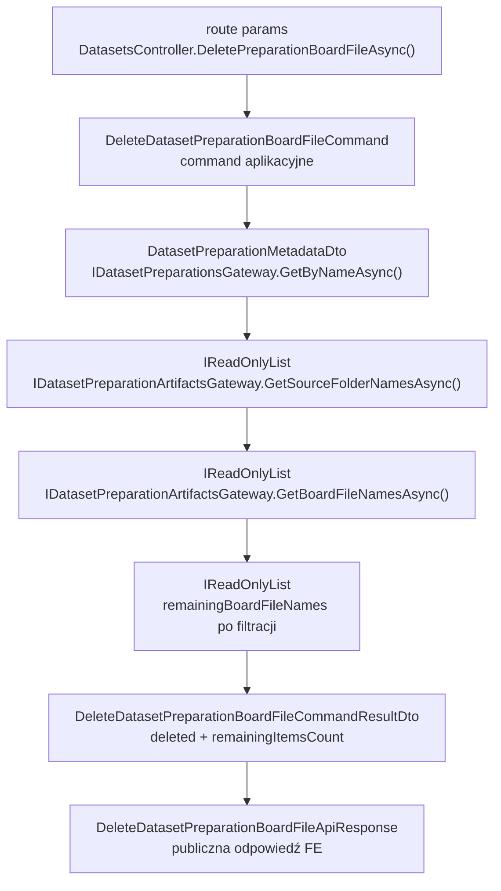
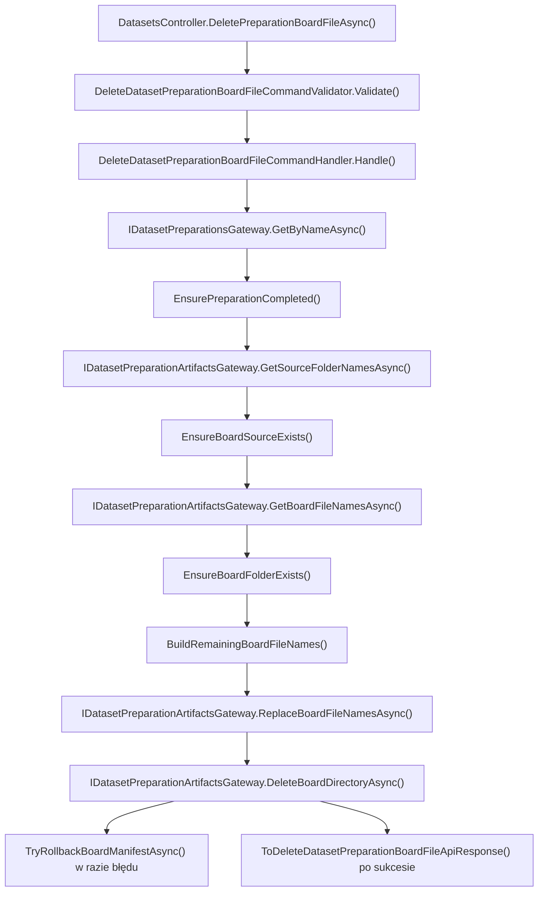

# UC-18-BE - Plan implementacyjny dla `DELETE /api/datasets/preparations/{preparationName}/board/{sourceName}/files/{boardFolderName}`

## 1) Przeznaczenie endpointa
- Endpoint usuwa pojedynczy logiczny element `board` z istniejącego preparation datasetu.
- Zasób logiczny to cały folder:
  - `{PreparationsDirectoryPath}/{preparationName}/board/{sourceName}/{boardFolderName}/`
- Po usunięciu folderu backend aktualizuje manifest:
  - `{PreparationsDirectoryPath}/{preparationName}/board/{sourceName}/file.json`
- Endpoint działa wyłącznie w warstwie `BE`.
- Endpoint nie wywołuje `ML`, nie uruchamia preprocessingu i nie przebudowuje całego preparation.
- Celem use-case'a jest usunięcie planszy z widoku i utrzymanie spójności manifestu bez zostawiania martwych referencji w `file.json`.

## 2) Zakres, założenia i zależności
- Plan dotyczy wyłącznie backendu w `src/Backend/Sudoku`.
- Nie sugerujemy się stanem `FE` i `ML`, poza obowiązującymi kontraktami i tym, co już istnieje w backendzie.
- Historyjki zależne:
  - `UC-13` dostarcza autoryzację admina.
  - `UC-17 POST /api/datasets/preparations` tworzy preparation i zapisuje artefakty.
  - `UC-17 GET /api/datasets/preparations` oraz `GET /api/datasets/preparations/{preparationName}` dostarczają wybór preparation i jego status.
  - `UC-18 GET /api/datasets/preparations/{preparationName}/board/folders` dostarcza `sourceName`.
  - `UC-18 GET /api/datasets/preparations/{preparationName}/board/{sourceName}/files` dostarcza `boardFolderName`.
  - `UC-18 GET /api/datasets/preparations/{preparationName}/board/{sourceName}/files/{boardFolderName}/image` reuse'uje te same reguły walidacji i wyszukiwania zasobu.
  - `UC-19` pośrednio zależy od spójności preparation po czyszczeniu danych.
- Kluczowa zasada architektoniczna:
  - `Application` ma orkiestrację usunięcia i decyzję o kolejności kroków.
  - `Infrastructure` ma tylko wykonać operacje I/O na storage.

## 3) Co już istnieje i co należy reuse'ować

### 3.1 Istniejące elementy backendu
- `src/Backend/Sudoku/Sudoku/Controllers/DatasetsController.cs`
  - ma już endpointy:
    - `GET /api/datasets/preparations`
    - `GET /api/datasets/preparations/{preparationName}`
    - `GET /api/datasets/preparations/{preparationName}/board/folders`
    - `GET /api/datasets/preparations/{preparationName}/digit/folders`
    - `GET /api/datasets/preparations/{preparationName}/board/{sourceName}/files`
    - `GET /api/datasets/preparations/{preparationName}/board/{sourceName}/files/{boardFolderName}/image`
- `src/Backend/Sudoku/Application/Abstractions/IDatasetPreparationsGateway.cs`
  - odczyt metadata preparation.
- `src/Backend/Sudoku/Application/Abstractions/IDatasetPreparationArtifactsGateway.cs`
  - odczyt:
    - `board/folders.json`
    - `board/{sourceName}/file.json`
    - artefaktów w folderze planszy
- `src/Backend/Sudoku/Application/Abstractions/IFileStorageGateway.cs`
  - ma już potrzebne operacje techniczne:
    - `ReplaceAsync(...)`
    - `DeleteDirectoryAsync(...)`
- `src/Backend/Sudoku/Application/Datasets/DatasetPreparationNameValidationRules.cs`
  - wspólna walidacja `preparationName`.
- `src/Backend/Sudoku/Application/Datasets/DatasetPreparationSourceNameValidationRules.cs`
  - wspólna walidacja `sourceName`.
- `src/Backend/Sudoku/Application/Datasets/DatasetPreparationBoardFolderNameValidationRules.cs`
  - wspólna walidacja `boardFolderName`.
- `src/Backend/Sudoku/Application/Datasets/DatasetPreparationNotFoundException.cs`
  - semantyczne `404` dla brakującego preparation.
- `src/Backend/Sudoku/Application/Datasets/DatasetPreparationSourceNotFoundException.cs`
  - semantyczne `404` dla brakującego `sourceName`.
- `src/Backend/Sudoku/Application/Datasets/DatasetPreparationBoardFileNotFoundException.cs`
  - semantyczne `404` dla brakującego `boardFolderName` w manifeście.
- `src/Backend/Sudoku/Application/Datasets/DatasetPreparationArtifactsNotReadyException.cs`
  - semantyczne `409` dla preparation niegotowego do pracy na artefaktach.
- `src/Backend/Sudoku/Application/Datasets/GetDatasetPreparationBoardFilesQueryHandler.cs`
  - gotowy wzorzec:
    - sprawdzenie istnienia preparation,
    - sprawdzenie statusu `completed`,
    - weryfikacja `sourceName` względem `board/folders.json`,
    - odczyt `file.json`
- `src/Backend/Sudoku/Application/Datasets/GetDatasetPreparationBoardImageQueryHandler.cs`
  - gotowy wzorzec:
    - weryfikacja `boardFolderName` względem `file.json`,
    - rozróżnienie między brakiem wpisu w manifeście a błędem technicznym artefaktu
- `src/Backend/Sudoku/Infrastructure/Storage/DatasetPreparationArtifactsGateway.cs`
  - odczytuje manifesty i artefakty.
- `src/Backend/Sudoku/Infrastructure/Storage/LocalFileStorageGateway.cs`
  - ma już bezpieczne:
    - atomowe `ReplaceAsync(...)` przez plik tymczasowy,
    - `DeleteDirectoryAsync(...)`
- `src/Backend/Sudoku/.github/workflows/backend-cd.yml`
  - już podstawia `DatasetsPreparation.PreparationsDirectoryPath`.

### 3.2 Wniosek architektoniczny
- Nie tworzymy nowego osobnego gatewaya tylko dla `DELETE`.
- Nie przenosimy logiki workflow usunięcia do `Infrastructure`.
- Rozszerzamy istniejący `IDatasetPreparationArtifactsGateway` o generyczne operacje zapisu manifestu i usunięcia folderu planszy.
- Handler w `Application` ma sterować kolejnością:
  - policzenie nowego manifestu,
  - zapis manifestu,
  - usunięcie katalogu,
  - ewentualny rollback manifestu przy błędzie drugiego kroku.

## 4) Kontrakty FE/BE/ML

### 4.1 FE -> BE
- Metoda i ścieżka:
  - `DELETE /api/datasets/preparations/{preparationName}/board/{sourceName}/files/{boardFolderName}`
- Route params:
  - `preparationName: string`
  - `sourceName: string`
  - `boardFolderName: string`
- Query:
  - brak
- Body:
  - brak
- Autoryzacja:
  - taka sama jak dla innych endpointów administracyjnych z `UC-13`

### 4.2 BE -> FE
- `200 OK` -> `DeleteDatasetPreparationBoardFileApiResponse`
- `400 Bad Request` -> `ErrorApiResponse`
- `401 Unauthorized` -> `ErrorApiResponse`
- `404 Not Found` -> `ErrorApiResponse`
- `409 Conflict` -> `ErrorApiResponse`
- `500 Internal Server Error` -> `ErrorApiResponse`

`DeleteDatasetPreparationBoardFileApiResponse`:
- `preparationName`
- `sourceName`
- `boardFolderName`
- `deleted`
- `remainingItemsCount`

Przykład:

```json
{
  "preparationName": "preparation-001",
  "sourceName": "v1_training",
  "boardFolderName": "Image1079",
  "deleted": true,
  "remainingItemsCount": 241
}
```

### 4.3 BE -> ML
- Brak nowej komunikacji.
- `DELETE` działa wyłącznie na lokalnym storage preparation zarządzanym przez backend.

### 4.4 ML -> BE
- Brak nowej komunikacji HTTP.
- Jedyna zależność pośrednia: wcześniejszy workflow preparation musiał wcześniej utworzyć folder planszy i wpisać go do `file.json`.

### 4.5 Plikowy kontrakt wejściowy dla BE
- Manifest źródeł:
  - `{PreparationsDirectoryPath}/{preparationName}/board/folders.json`
- Manifest plansz:
  - `{PreparationsDirectoryPath}/{preparationName}/board/{sourceName}/file.json`
- Folder logicznego zasobu:
  - `{PreparationsDirectoryPath}/{preparationName}/board/{sourceName}/{boardFolderName}/`

Format `file.json`:

```json
[
  "Image1",
  "Image2",
  "Image1079"
]
```

## 5) Model API wejściowy i wyjściowy
- Wejście z `FE`:
  - route params: `preparationName`, `sourceName`, `boardFolderName`
  - body: brak
- Wyjście do `FE`:
  - `[NOWY]` `DeleteDatasetPreparationBoardFileApiResponse`
  - `[REUSE]` `ErrorApiResponse`
- `BE <-> ML`:
  - brak komunikacji dla tego endpointa

## 6) Zachowanie per warstwa

### 6.1 API
- Nowa akcja w `DatasetsController`:
  - `[HttpDelete("preparations/{preparationName}/board/{sourceName}/files/{boardFolderName}")]`
- Kontroler:
  - binduje route params,
  - wysyła `DeleteDatasetPreparationBoardFileCommand`,
  - mapuje wynik do `DeleteDatasetPreparationBoardFileApiResponse`,
  - mapuje wyjątki na `400/404/409/500`.
- `Api` nie:
  - odczytuje `file.json`,
  - usuwa katalogów,
  - nie buduje ścieżek filesystemu,
  - nie robi rollbacku,
  - nie odpytuje `ML`.

### 6.2 Application
- `Application` odpowiada za:
  - walidację `preparationName`,
  - walidację `sourceName`,
  - walidację `boardFolderName`,
  - sprawdzenie istnienia preparation,
  - sprawdzenie statusu `completed`,
  - sprawdzenie, czy `sourceName` istnieje w `board/folders.json`,
  - sprawdzenie, czy `boardFolderName` istnieje w `board/{sourceName}/file.json`,
  - wyliczenie nowej zawartości `file.json`,
  - orkiestrację zapisu manifestu i usunięcia katalogu,
  - próbę rollbacku manifestu, jeśli usunięcie katalogu nie powiedzie się po zapisaniu manifestu,
  - budowę DTO wyniku.
- `Application` nie:
  - używa `File.*` ani `Directory.*`,
  - nie serializuje JSON bezpośrednio do pliku,
  - nie zna detali niskopoziomowego storage.

### 6.3 Models / Domain
- Brak potrzeby wprowadzania nowego modelu domenowego.
- Reuse:
  - `Models/Datasets/DatasetPreparationStatus.cs`
- To jest use-case operacyjny nad istniejącym preparation, nie nowy byt domenowy.

### 6.4 Infrastructure
- `Infrastructure` ma:
  - odczytać listy z manifestów,
  - zapisać nową zawartość `file.json`,
  - usunąć katalog `boardFolderName`,
  - nie znać semantyki `404/409`,
  - nie podejmować decyzji o kolejności biznesowej poza wykonaniem przekazanych operacji.
- Preferowana forma rozszerzenia portu:
  - `ReplaceBoardFileNamesAsync(...)`
  - `DeleteBoardDirectoryAsync(...)`
- Dzięki temu `Infrastructure` pozostaje generyczne i reuse'owalne dla kolejnych use-case'ów czyszczących artefakty preparation.

## 7) Pliki per warstwa i odpowiedzialności

### 7.1 API (`src/Backend/Sudoku/Sudoku`)
- `[MODYFIKACJA]` `Controllers/DatasetsController.cs`
  - dodać akcję `DeletePreparationBoardFileAsync(string? preparationName, string? sourceName, string? boardFolderName, CancellationToken)`
  - wysłać `DeleteDatasetPreparationBoardFileCommand`
  - mapować:
    - `ValidationException -> 400`
    - `DatasetPreparationNotFoundException -> 404`
    - `DatasetPreparationSourceNotFoundException -> 404`
    - `DatasetPreparationBoardFileNotFoundException -> 404`
    - `DatasetPreparationArtifactsNotReadyException -> 409`
    - `IOException | UnauthorizedAccessException | InvalidDataException | JsonException | FileStorageItemNotFoundException -> 500`
- `[NOWY]` `Contracts/DeleteDatasetPreparationBoardFileApiResponse.cs`
  - publiczny kontrakt odpowiedzi dla `DELETE`
- `[REUSE]` `Contracts/ErrorApiResponse.cs`
  - wspólny kontrakt błędu

### 7.2 Application (`src/Backend/Sudoku/Application`)
- `[NOWY]` `Datasets/DeleteDatasetPreparationBoardFileCommand.cs`
  - command MediatR
- `[NOWY]` `Datasets/DeleteDatasetPreparationBoardFileCommandValidator.cs`
  - walidacja `preparationName`, `sourceName`, `boardFolderName`
- `[NOWY]` `Datasets/DeleteDatasetPreparationBoardFileCommandHandler.cs`
  - pełna logika use-case'a
- `[NOWY]` `Datasets/DeleteDatasetPreparationBoardFileCommandResultDto.cs`
  - wynik use-case'a:
    - `preparationName`
    - `sourceName`
    - `boardFolderName`
    - `deleted`
    - `remainingItemsCount`
- `[NOWY]` `Datasets/DeleteDatasetPreparationBoardFileErrorTypes.cs`
  - stałe `errorType`
- `[REUSE]` `Datasets/DatasetPreparationNameValidationRules.cs`
  - walidacja `preparationName`
- `[REUSE]` `Datasets/DatasetPreparationSourceNameValidationRules.cs`
  - walidacja `sourceName`
- `[REUSE]` `Datasets/DatasetPreparationBoardFolderNameValidationRules.cs`
  - walidacja `boardFolderName`
- `[REUSE]` `Datasets/DatasetPreparationNotFoundException.cs`
  - `404`
- `[REUSE]` `Datasets/DatasetPreparationSourceNotFoundException.cs`
  - `404`
- `[REUSE]` `Datasets/DatasetPreparationBoardFileNotFoundException.cs`
  - `404`
- `[REUSE]` `Datasets/DatasetPreparationArtifactsNotReadyException.cs`
  - `409`
- `[MODYFIKACJA]` `Abstractions/IDatasetPreparationArtifactsGateway.cs`
  - dodać:
    - `ReplaceBoardFileNamesAsync(string preparationName, string sourceName, IReadOnlyList<string> boardFileNames, CancellationToken cancellationToken = default)`
    - `DeleteBoardDirectoryAsync(string preparationName, string sourceName, string boardFolderName, CancellationToken cancellationToken = default)`
- `[REUSE]` `Abstractions/IDatasetPreparationsGateway.cs`
  - odczyt metadata preparation
- `[REUSE]` `Datasets/GetDatasetPreparationBoardFilesQueryHandler.cs`
  - wzorzec sprawdzania source i manifestu
- `[REUSE]` `Datasets/GetDatasetPreparationBoardImageQueryHandler.cs`
  - wzorzec rozróżnienia `404` logicznego od `500` technicznego

### 7.3 Models (`src/Backend/Sudoku/Models`)
- `[REUSE]` `Models/Datasets/DatasetPreparationStatus.cs`
  - statusy preparation
- `[BRAK NOWYCH PLIKÓW]`
  - endpoint nie wnosi nowego bytu domenowego

### 7.4 Infrastructure (`src/Backend/Sudoku/Infrastructure`)
- `[MODYFIKACJA]` `Storage/DatasetPreparationArtifactsGateway.cs`
  - zaimplementować `ReplaceBoardFileNamesAsync(...)`
  - zaimplementować `DeleteBoardDirectoryAsync(...)`
  - reuse'ować istniejące helpery do budowy ścieżek `preparationName/board/sourceName`
  - serializować `string[]` do `file.json` przez `JsonSerializerDefaults.Web`
- `[REUSE]` `Storage/LocalFileStorageGateway.cs`
  - wykona właściwe:
    - atomowe `ReplaceAsync(...)`
    - `DeleteDirectoryAsync(...)`
- `[REUSE]` `DependencyInjection.cs`
  - brak nowego serwisu, tylko reuse istniejącej rejestracji gatewaya artefaktów

### 7.5 Testy (`src/Backend/Sudoku/Application.Tests`)
- `[NOWY]` `DeleteDatasetPreparationBoardFileCommandValidatorTests.cs`
  - testy walidatora
- `[NOWY]` `DeleteDatasetPreparationBoardFileCommandHandlerTests.cs`
  - testy handlera
- `[MODYFIKACJA]` `DatasetsControllerTests.cs`
  - testy nowej akcji HTTP
- `[REUSE]` `GetDatasetPreparationBoardFilesQueryHandlerTests.cs`
  - wzorzec stubów preparation/artifacts
- `[REUSE]` `GetDatasetPreparationBoardImageQueryHandlerTests.cs`
  - wzorzec semantyki `boardFolderName`

### 7.6 Workflow i config
- `[REUSE]` `Sudoku/appsettings.local.json`
  - lokalny `PreparationsDirectoryPath` ustawiony na sztywno
- `[REUSE]` `Sudoku/appsettings.production.json`
  - overlay produkcyjny
- `[REUSE]` `.github/workflows/backend-cd.yml`
  - już podstawia `BE_DATASETS_PREP_PREPARATIONS_DIRECTORY_PATH`

## 8) Przepływ w obrębie backendu
1. `FE` wywołuje `DELETE /api/datasets/preparations/{preparationName}/board/{sourceName}/files/{boardFolderName}`.
2. Autoryzacja z `UC-13` przepuszcza tylko admina.
3. `DatasetsController.DeletePreparationBoardFileAsync(...)` binduje route params.
4. Kontroler wysyła `DeleteDatasetPreparationBoardFileCommand(preparationName, sourceName, boardFolderName)`.
5. `ValidationBehavior` uruchamia validator.
6. Handler odczytuje metadata przez `IDatasetPreparationsGateway.GetByNameAsync(...)`.
7. Gdy preparation nie istnieje:
  - `DatasetPreparationNotFoundException`
8. Gdy preparation nie ma statusu `completed`:
  - `DatasetPreparationArtifactsNotReadyException`
9. Handler czyta `board/folders.json` przez `IDatasetPreparationArtifactsGateway.GetSourceFolderNamesAsync(...)`.
10. Gdy `sourceName` nie należy do manifestu:
  - `DatasetPreparationSourceNotFoundException`
11. Handler czyta `board/{sourceName}/file.json` przez `GetBoardFileNamesAsync(...)`.
12. Gdy `boardFolderName` nie należy do manifestu:
  - `DatasetPreparationBoardFileNotFoundException`
13. Handler buduje nową listę bez usuwanego wpisu.
14. Handler zapisuje nową zawartość `file.json`.
15. Handler usuwa katalog `boardFolderName`.
16. Jeśli krok 15 nie powiedzie się, handler próbuje przywrócić poprzedni manifest.
17. Handler zwraca wynik z `deleted=true` i `remainingItemsCount`.
18. Kontroler mapuje DTO do `DeleteDatasetPreparationBoardFileApiResponse` i zwraca `200 OK`.

## 9) Główne funkcje
- `DatasetsController.DeletePreparationBoardFileAsync(...)`
- `DatasetsController.ToDeleteDatasetPreparationBoardFileApiResponse(...)`
- `DeleteDatasetPreparationBoardFileCommandHandler.Handle(...)`
- `DeleteDatasetPreparationBoardFileCommandValidator.Validate(...)`
- `DeleteDatasetPreparationBoardFileCommandHandler.EnsurePreparationCompleted(...)`
- `DeleteDatasetPreparationBoardFileCommandHandler.EnsureBoardSourceExists(...)`
- `DeleteDatasetPreparationBoardFileCommandHandler.EnsureBoardFolderExists(...)`
- `DeleteDatasetPreparationBoardFileCommandHandler.BuildRemainingBoardFileNames(...)`
- `DeleteDatasetPreparationBoardFileCommandHandler.PersistManifestThenDeleteBoardAsync(...)`
- `DeleteDatasetPreparationBoardFileCommandHandler.TryRollbackBoardManifestAsync(...)`

## 10) Wyjątki, fallbacki i zachowanie błędowe

### 10.1 Statusy HTTP
- `200 OK`
  - preparation istnieje,
  - ma status `completed`,
  - `sourceName` istnieje,
  - `boardFolderName` istnieje w `file.json`,
  - manifest został zaktualizowany,
  - katalog został usunięty
- `400 Bad Request`
  - niepoprawny `preparationName`
  - niepoprawny `sourceName`
  - niepoprawny `boardFolderName`
- `401 Unauthorized`
  - brak poprawnej autoryzacji
- `404 Not Found`
  - preparation nie istnieje
  - `sourceName` nie istnieje w `board/folders.json`
  - `boardFolderName` nie istnieje w `board/{sourceName}/file.json`
- `409 Conflict`
  - preparation istnieje, ale nie jest gotowe do pracy na artefaktach
- `500 Internal Server Error`
  - błąd odczytu `board/folders.json`
  - błąd odczytu `file.json`
  - błąd zapisu zaktualizowanego `file.json`
  - błąd usunięcia katalogu planszy
  - błąd rollbacku manifestu
  - niespójny storage dla preparation `completed`

### 10.2 `errorType`
- `invalid_dataset_preparation_name`
- `invalid_dataset_preparation_source_name`
- `invalid_dataset_preparation_board_folder_name`
- `dataset_preparation_not_found`
- `dataset_preparation_source_not_found`
- `dataset_preparation_board_file_not_found`
- `dataset_preparation_artifacts_not_ready`
- `dataset_preparation_board_file_delete_failed`

### 10.3 Fallbacki
- Dozwolone:
  - usunięcie ostatniego wpisu i zapis pustej listy `[]`
  - próba rollbacku manifestu, jeśli usunięcie katalogu nie powiedzie się po zapisie `file.json`
- Niedozwolone:
  - skan katalogów w celu odbudowy `file.json`
  - odpytywanie `ML`
  - kasowanie całego `sourceName`
  - mapowanie braku wpisu w manifeście na `500`
  - ukrywanie częściowej awarii bez loga i bez `500`

### 10.4 Najważniejsze rozróżnienie błędów
- brak wpisu w `file.json` -> `404`
- awaria zapisu manifestu lub usunięcia katalogu -> `500`

## 11) Specyficzna logika i pseudokod

### 11.1 Główna decyzja implementacyjna
- Dla tego use-case'a ważniejsze jest, aby nie zostawić martwego wpisu w `file.json`, niż żeby kolejność była czysto filesystemowa.
- Dlatego rekomendowana orkiestracja:
  1. oblicz nowy manifest,
  2. zapisz nowy manifest,
  3. usuń katalog planszy,
  4. jeśli krok 3 się nie uda, spróbuj rollbacku manifestu.
- To lepiej spełnia wymaganie `UC-18`, że widok nie ma pokazywać nieistniejących już logicznie plansz.

### 11.2 Pseudokod handlera

```text
handle(command):
  validate(command)

  metadata = datasetPreparationsGateway.getByName(command.preparationName)
  if metadata is null:
    throw dataset_preparation_not_found

  if metadata.status != "completed":
    throw dataset_preparation_artifacts_not_ready

  boardSources = artifactsGateway.getSourceFolderNames(command.preparationName, "board")
  if command.sourceName not in boardSources:
    throw dataset_preparation_source_not_found

  boardFileNames = artifactsGateway.getBoardFileNames(command.preparationName, command.sourceName)
  if command.boardFolderName not in boardFileNames:
    throw dataset_preparation_board_file_not_found

  remainingBoardFileNames = boardFileNames without command.boardFolderName

  try:
    artifactsGateway.replaceBoardFileNames(
      command.preparationName,
      command.sourceName,
      remainingBoardFileNames
    )

    artifactsGateway.deleteBoardDirectory(
      command.preparationName,
      command.sourceName,
      command.boardFolderName
    )
  catch delete_error:
    try rollback:
      artifactsGateway.replaceBoardFileNames(
        command.preparationName,
        command.sourceName,
        boardFileNames
      )
    catch rollback_error:
      log rollback failure

    throw delete_failed

  return result(
    preparationName,
    sourceName,
    boardFolderName,
    deleted=true,
    remainingItemsCount=remainingBoardFileNames.length
  )
```

### 11.3 Pseudokod gatewaya artefaktów

```text
replaceBoardFileNames(preparationName, sourceName, boardFileNames):
  directoryPath = combine(preparationsDirectoryPath, preparationName, "board", sourceName)
  payload = serialize_json(boardFileNames)
  fileStorageGateway.replace(directoryPath, "file.json", payload)

deleteBoardDirectory(preparationName, sourceName, boardFolderName):
  directoryPath = combine(preparationsDirectoryPath, preparationName, "board", sourceName)
  fileStorageGateway.deleteDirectory(directoryPath, boardFolderName)
```

### 11.4 Pseudokod walidacji

```text
validate(command):
  validatePreparationName(command.preparationName)
  validateSourceName(command.sourceName)
  validateBoardFolderName(command.boardFolderName)
```

## 12) Mermaid flowchart - flow modeli



## 13) Mermaid flowchart - logika aplikacji z funkcjami



## 14) Logging
- `Information`
  - start: `preparationName`, `sourceName`, `boardFolderName`
  - success: `preparationName`, `sourceName`, `boardFolderName`, `remainingItemsCount`
- `Warning`
  - preparation nie istnieje
  - preparation nie jest gotowe
  - `sourceName` lub `boardFolderName` nie należą do manifestów
  - rollback manifestu został uruchomiony
- `Error`
  - błąd odczytu lub zapisu `file.json`
  - błąd usunięcia katalogu
  - błąd rollbacku manifestu
- Guardraile:
  - nie logować całej zawartości `file.json`
  - nie logować pełnych ścieżek systemowych w odpowiedzi HTTP
  - logi mają być lekkie i operacyjne

## 15) Workflow GitHub i konfiguracja runtime
- Endpoint nie wymaga nowych sekretów ani nowych zmiennych środowiskowych.
- Endpoint nie wymaga zmian po stronie `ML`.
- Lokalnie:
  - `PreparationsDirectoryPath` zostaje ustawione na sztywno w `appsettings.local.json`
- Produkcyjnie:
  - `.github/workflows/backend-cd.yml` już podstawia `BE_DATASETS_PREP_PREPARATIONS_DIRECTORY_PATH` do `appsettings.production.json`
- Istotna reguła runtime:
  - deploy może zmieniać `appsettings.production.json`,
  - deploy nie może nadpisywać ani czyścić `shared/data`, bo tam żyją runtime artifacts preparation

## 16) Inne istotne reguły
- Nie zmieniać istniejących nazw klas i pól używanych przez już wdrożone endpointy `UC-18`.
- Reuse'ować istniejące:
  - `DatasetPreparationSourceNameValidationRules`
  - `DatasetPreparationBoardFolderNameValidationRules`
  - `DatasetPreparationSourceNotFoundException`
  - `DatasetPreparationBoardFileNotFoundException`
- Nie opierać się na fizycznym istnieniu katalogu jako źródle prawdy o zasobie.
- Źródłem prawdy dla istnienia planszy jest `file.json`.
- `Infrastructure` nie powinno decydować, czy rollback jest potrzebny.
- `Application` ma przekazywać `remainingBoardFileNames` do `Infrastructure`; nie odwrotnie.

## 17) Kolejność implementacji kodu
1. Dodać `DeleteDatasetPreparationBoardFileErrorTypes`.
2. Dodać `DeleteDatasetPreparationBoardFileCommand`.
3. Dodać `DeleteDatasetPreparationBoardFileCommandResultDto`.
4. Dodać `DeleteDatasetPreparationBoardFileCommandValidator`.
5. Rozszerzyć `IDatasetPreparationArtifactsGateway` o zapis manifestu i usuwanie folderu planszy.
6. Rozszerzyć `DatasetPreparationArtifactsGateway` o:
   - `ReplaceBoardFileNamesAsync(...)`
   - `DeleteBoardDirectoryAsync(...)`
7. Dodać `DeleteDatasetPreparationBoardFileCommandHandler`.
8. Dodać `DeleteDatasetPreparationBoardFileApiResponse`.
9. Rozszerzyć `DatasetsController` o akcję `DELETE`.
10. Dodać testy walidatora.
11. Dodać testy handlera.
12. Rozszerzyć testy kontrolera.
13. Wykonać smoke test dla:
   - poprawnego usunięcia,
   - usunięcia ostatniego wpisu,
   - braku preparation,
   - braku source,
   - braku board folderu w manifeście,
   - awarii zapisu manifestu,
   - awarii usunięcia katalogu,
   - awarii rollbacku

## 18) Guardraile implementacyjne
- Nie kasować katalogu w kontrolerze.
- Nie pisać bezpośrednio do `file.json` z poziomu kontrolera ani handlera przez `File.*`.
- Nie tworzyć osobnego gatewaya tylko dla tego jednego endpointu.
- Nie skanować katalogów jako fallback dla brakującego manifestu.
- Nie odpytywać `ML`.
- Nie zmieniać kolejności elementów w `file.json`, poza usunięciem jednego wpisu.
- Nie sortować manifestu na nowo.
- Nie mapować błędu usunięcia katalogu na `404`, jeśli wpis istniał w manifeście.
- Nie ignorować awarii rollbacku; trzeba ją zalogować jako `Error`.

## 19) Zależności pomiędzy historyjkami
- `UC-13`
  - autoryzacja admina
- `UC-17 POST /api/datasets/preparations`
  - tworzy preparation i zapisuje artefakty wejściowe dla `UC-18`
- `UC-17 GET /api/datasets/preparations`
  - wybór preparation
- `UC-17 GET /api/datasets/preparations/{preparationName}`
  - źródło statusu preparation
- `UC-18 GET /api/datasets/preparations/{preparationName}/board/folders`
  - dostarcza `sourceName`
- `UC-18 GET /api/datasets/preparations/{preparationName}/board/{sourceName}/files`
  - dostarcza `boardFolderName`
- `UC-18 GET /api/datasets/preparations/{preparationName}/board/{sourceName}/files/{boardFolderName}/image`
  - reuse'uje ten sam model weryfikacji zasobu
- `UC-19`
  - polega na tym, że preparation po czyszczeniu pozostaje spójne i nie ma martwych wpisów

## 20) Plan testów minimum

### 20.1 Validator
- pusty `preparationName` -> `400`
- pusty `sourceName` -> `400`
- pusty `boardFolderName` -> `400`
- `preparationName` z `..` -> `400`
- `sourceName` z separatorem ścieżki -> `400`
- `boardFolderName` z separatorem ścieżki -> `400`
- poprawny request -> walidacja przechodzi

### 20.2 Handler
- happy path:
  - preparation `completed`
  - source istnieje
  - board folder istnieje
  - manifest zapisany
  - katalog usunięty
- usunięcie ostatniego wpisu:
  - wynik `remainingItemsCount = 0`
  - zapis `[]` do `file.json`
- brak preparation -> `DatasetPreparationNotFoundException`
- status `queued` / `running` / `failed` -> `DatasetPreparationArtifactsNotReadyException`
- brak `sourceName` w `board/folders.json` -> `DatasetPreparationSourceNotFoundException`
- brak `boardFolderName` w `file.json` -> `DatasetPreparationBoardFileNotFoundException`
- awaria `ReplaceBoardFileNamesAsync(...)` -> błąd techniczny propagowany do `500`
- awaria `DeleteBoardDirectoryAsync(...)` po zapisaniu manifestu:
  - rollback manifestu zostaje wywołany
  - błąd końcowy jest techniczny
- awaria rollbacku:
  - nadal błąd techniczny
  - dodatkowy log `Error`

### 20.3 API
- `200 OK` i poprawne mapowanie `DeleteDatasetPreparationBoardFileApiResponse`
- `400` dla błędu walidacji
- `401` bez autoryzacji
- `404` dla braku preparation
- `404` dla braku source
- `404` dla braku board folderu w manifeście
- `409` dla niegotowego preparation
- `500` dla błędu zapisu manifestu
- `500` dla błędu usunięcia katalogu

### 20.4 Manual smoke
- usunięcie istniejącej planszy i ponowny odczyt listy
- usunięcie ostatniej planszy w source
- próba usunięcia elementu spoza `file.json`
- próba usunięcia dla preparation `running`
- awaria techniczna przy usuwaniu katalogu i potwierdzenie logu rollbacku

## 21) Podsumowanie decyzji architektonicznych
- Publiczny kontrakt `DELETE` powinien zwracać body z `deleted` i `remainingItemsCount`, bo use-case dotyczy mutacji listy logicznych elementów preparation.
- `Application` ma posiadać pełną logikę semantyczną i kolejność działań.
- `Infrastructure` ma tylko wykonać odczyt, zapis manifestu i usunięcie katalogu.
- Najważniejsza decyzja antyduplikacyjna:
  - rozszerzyć `IDatasetPreparationArtifactsGateway`,
  - nie tworzyć nowego endpoint-specific gatewaya
- Najważniejsze rozróżnienie spójności:
  - brak wpisu w manifeście to `404`,
  - awaria zapisu/usuwania to `500`
- Najważniejsza decyzja workflow:
  - utrzymać spójność `file.json` jako źródła prawdy widoku,
  - w razie częściowej awarii próbować rollbacku manifestu,
  - nie angażować `ML`
