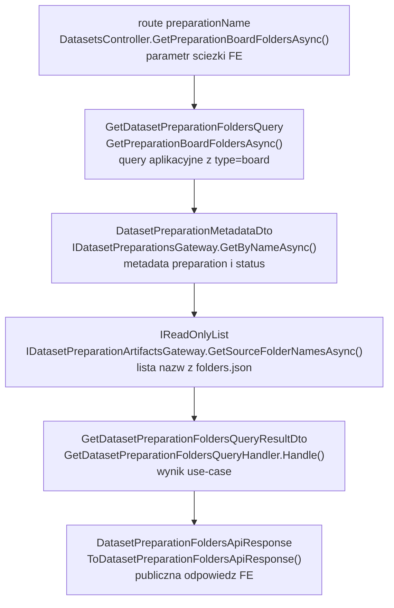
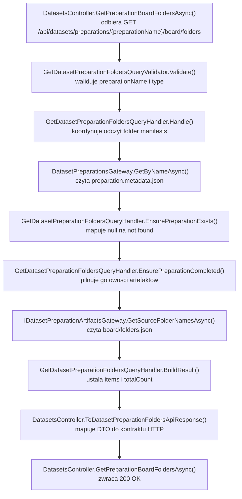

# UC-18-BE - Plan implementacyjny dla `GET /api/datasets/preparations/{preparationName}/board/folders`

## 1) Przeznaczenie endpointa
- Endpoint `GET /api/datasets/preparations/{preparationName}/board/folders` zwraca listę nazw źródeł typu `board` dla wybranego preparation.
- Jest to pierwszy krok wejścia w przeglądanie wyników preparation w `UC-18`:
  - użytkownik wybiera preparation,
  - `FE` pobiera listę folderów źródłowych typu `board`,
  - dopiero po wyborze konkretnego źródła pobierane są listy plansz.
- Endpoint jest `read-only`:
  - nie uruchamia preprocessingu,
  - nie wywołuje `ML`,
  - nie przebudowuje manifestów,
  - nie skanuje katalogów heurystycznie.
- `BE` pozostaje `source of truth` dla odpowiedzi HTTP, ale źródłem danych plikowych jest gotowy manifest `board/folders.json` w storage preparation.

## 2) Zakres i główne założenia
- Plan dotyczy wyłącznie części `BE` w `src/Backend/Sudoku`.
- Nie sugerujemy się aktualnym stanem `FE` ani bieżącą implementacją `ML`, poza obowiązującymi kontraktami i artefaktami już zdefiniowanymi przez `UC-17` / `UC-18`.
- Endpoint ma pozostać zgodny z obecnym stylem backendu:
  - `ASP.NET Controller`,
  - `MediatR`,
  - `FluentValidation`,
  - cienki `Api`,
  - logika w `Application`,
  - adaptery i JSON/file I/O w `Infrastructure`.
- Kontrakt publiczny ma reuse'ować shape opisany już w `UC-18`:
  - `DatasetPreparationFoldersApiResponse`
  - `preparationName`
  - `type`
  - `items`
  - `totalCount`
- Nie tworzymy nowej komunikacji `BE -> ML`.
- Nie dokładamy nowej konfiguracji runtime tylko dlatego, że dochodzi nowy endpoint.

## 3) Co już istnieje i należy reuse'ować

### 3.1 Gotowe elementy backendu
- `DatasetsController`
  - ma już `GET /api/datasets/preparations`
  - ma już `GET /api/datasets/preparations/{preparationName}`
- `GetDatasetPreparationDetailsQueryValidator`
  - zawiera gotowe reguły walidacji `preparationName`
- `IDatasetPreparationsGateway`
  - ma już `GetByNameAsync(preparationName)`
- `DatasetPreparationsGateway`
  - czyta `preparation.metadata.json`
- `DatasetsPreparationOptions`
  - ma już `PreparationsDirectoryPath`
  - ma już `BoardsSubdirectory`
  - ma już `DigitsSubdirectory`
- `IFileStorageGateway`
  - ma gotowe operacje odczytu plików
- `LocalFileStorageGateway`
  - pilnuje bezpieczeństwa ścieżek i dostępu do storage
- `DatasetPreparationNotFoundException`
  - jest już semantycznym wyjątkiem `404`
- `ErrorApiResponse`
  - jest wspólnym kontraktem błędu

### 3.2 Artefakty runtime już zdefiniowane poza BE
- `UC-18` zakłada odczyt:
  - `board/folders.json`
  - `digit/folders.json`
- `UC-17 ML` definiuje, że `ML` zapisuje te manifesty deterministycznie i `BE` ich nie generuje.

### 3.3 Wniosek architektoniczny
- Nie wolno czytać listy folderów przez skan katalogu `board/`.
- Nie wolno opierać odpowiedzi na tym, co aktualnie ma `FE`.
- Nie wolno mieszać odczytu `preparation.metadata.json` z odczytem artefaktów runtime w jednym gateway tylko dlatego, że oba dotyczą preparation.
- Najlepszym reuse dla kolejnych endpointów `UC-18` jest:
  - pozostawić `IDatasetPreparationsGateway` jako gateway metadanych,
  - dodać osobny, generyczny port artefaktów preparation do odczytu manifestów.

## 4) Kontrakty API FE i ML

### 4.1 FE -> BE
- Metoda i ścieżka:
  - `GET /api/datasets/preparations/{preparationName}/board/folders`
- Request body:
  - brak
- Route param:
  - `preparationName: string`
- Autoryzacja:
  - token administratora z `UC-13`

### 4.2 BE -> FE
- `200 OK` -> `DatasetPreparationFoldersApiResponse`
- `400 Bad Request` -> `ErrorApiResponse`
- `401 Unauthorized` -> `ErrorApiResponse`
- `404 Not Found` -> `ErrorApiResponse`
- `409 Conflict` -> `ErrorApiResponse`
- `500 Internal Server Error` -> `ErrorApiResponse`

`DatasetPreparationFoldersApiResponse`:
- `preparationName: string`
- `type: string`
- `items: string[]`
- `totalCount: number`

Przykład `200 OK`:

```json
{
  "preparationName": "preparation-001",
  "type": "board",
  "items": [
    "v1_training",
    "v2_training"
  ],
  "totalCount": 2
}
```

### 4.3 BE -> ML
- Brak nowej komunikacji.
- Endpoint działa wyłącznie na gotowych artefaktach zapisanych wcześniej do storage.

### 4.4 ML -> BE
- Brak nowej komunikacji dla tego endpointu.
- Jedyną zależnością jest wcześniejsze zapisanie `board/folders.json` przez istniejący flow preparation.

## 5) Model API wejściowy i wyjściowy w komunikacji z FE i ML

### 5.1 FE -> BE
- brak body,
- `preparationName` w route.

### 5.2 BE -> FE
- `[NOWY]` `DatasetPreparationFoldersApiResponse`
- `[REUSE]` `ErrorApiResponse`

### 5.3 BE -> ML
- brak komunikacji

### 5.4 ML -> BE
- brak komunikacji HTTP

### 5.5 Plikowy kontrakt wejściowy dla BE
- Wejściowy manifest dla tego endpointu:
  - `{DatasetsPreparation.PreparationsDirectoryPath}/{preparationName}/board/folders.json`
- Format:

```json
[
  "v1_training",
  "v2_training"
]
```

### 5.6 Reguła kontraktowa
- `type` w odpowiedzi dla tego endpointu musi mieć wartość `"board"`.
- Kolejność `items` ma pozostać taka jak w `folders.json`.
- `BE` nie sortuje, nie filtruje i nie rekonstruuje listy na podstawie katalogów.

## 6) Zachowanie per warstwa

### API (`Sudoku`)
- `DatasetsController` dostaje nową akcję:
  - `[HttpGet("preparations/{preparationName}/board/folders")]`
- Kontroler:
  - binduje `preparationName`,
  - wysyła query do `MediatR`,
  - mapuje wynik do `DatasetPreparationFoldersApiResponse`,
  - mapuje wyjątki na `400/404/409/500`.
- API nie:
  - buduje ścieżek do plików,
  - nie parsuje `folders.json`,
  - nie dotyka `IFileStorageGateway`,
  - nie odpytuje `ML`.

### Application (`Application`)
- `Application` odpowiada za:
  - walidację `preparationName`,
  - sprawdzenie istnienia preparation przez metadata,
  - sprawdzenie, czy preparation jest gotowe do przeglądania folderów,
  - wywołanie portu artefaktów preparation,
  - zbudowanie DTO wyniku.
- `Application` nie:
  - wykonuje I/O niskopoziomowego,
  - nie deserializuje JSON plików bezpośrednio,
  - nie skanuje katalogów przez `Directory.*`.

### Domain / Models (`Models`)
- Dla tego endpointu nie trzeba dodawać nowego modelu domenowego w `Models`.
- Jest to use-case aplikacyjny nad istniejącym bytem preparation.
- Jeżeli chcemy unikać magic stringów, można dodać mały model wspólny w `Application`, a nie w `Models`, bo dotyczy kontraktu use-case'ów `folders`.

### Infrastructure (`Infrastructure`)
- `Infrastructure` implementuje odczyt manifestu `folders.json`.
- Nowy adapter powinien:
  - znać layout katalogów preparation,
  - zbudować ścieżkę do manifestu,
  - odczytać plik przez `IFileStorageGateway`,
  - zdeserializować `string[]`,
  - rzucić błąd techniczny przy uszkodzonym JSON.
- `Infrastructure` nie:
  - mapuje `404` preparation,
  - nie decyduje o `409 not ready`,
  - nie tworzy `ApiResponse`.

## 7) Rekomendowana decyzja o portach i antyduplikacji

### 7.1 Czego nie robić
- Nie rozszerzać `IDatasetPreparationsGateway` o odczyt `board/folders.json`.
- Nie używać `IFileStorageGateway` bezpośrednio z kontrolera.
- Nie wrzucać logiki ścieżek do query handlera.

### 7.2 Co dodać zamiast tego
- `[NOWY]` port `IDatasetPreparationArtifactsGateway` w `Application/Abstractions`.
- Powód:
  - `IDatasetPreparationsGateway` powinien pozostać gatewayem metadanych,
  - `UC-18` i `UC-19` będą jeszcze konsumować inne artefakty preparation,
  - przyszłe `digit/folders`, `board/{sourceName}/files`, obraz planszy i `DELETE` będą mogły reuse'ować ten sam adapter.

### 7.3 Minimalny zakres portu na teraz
- Metoda generyczna pod folder manifests:
  - `GetSourceFolderNamesAsync(string preparationName, string sourceType, CancellationToken cancellationToken = default)`
- Dla tego endpointu `sourceType = "board"`.
- Dla przyszłego `digit/folders` ten sam handler i ten sam port mogą pracować z `sourceType = "digit"`.

## 8) Pliki per warstwa i odpowiedzialności

### 8.1 API (`src/Backend/Sudoku/Sudoku`)
- `[MODYFIKACJA]` `Controllers/DatasetsController.cs`
  - dodać akcję `GetPreparationBoardFoldersAsync(string? preparationName, CancellationToken)`
  - wysłać `GetDatasetPreparationFoldersQuery(preparationName, "board")`
  - zmapować wynik do `DatasetPreparationFoldersApiResponse`
  - złapać `ValidationException -> 400`
  - złapać `DatasetPreparationNotFoundException -> 404`
  - złapać `DatasetPreparationArtifactsNotReadyException -> 409`
  - złapać `IOException | UnauthorizedAccessException | InvalidDataException | JsonException | FileStorageItemNotFoundException -> 500`
- `[NOWY]` `Contracts/DatasetPreparationFoldersApiResponse.cs`
  - publiczny kontrakt listy folderów dla `board` i później `digit`
- `[REUSE]` `Contracts/ErrorApiResponse.cs`
  - kontrakt błędu

### 8.2 Application (`src/Backend/Sudoku/Application`)
- `[NOWY]` `Abstractions/IDatasetPreparationArtifactsGateway.cs`
  - port do odczytu artefaktów preparation
- `[NOWY]` `Datasets/GetDatasetPreparationFoldersQuery.cs`
  - query z `PreparationName` i `Type`
- `[NOWY]` `Datasets/GetDatasetPreparationFoldersQueryValidator.cs`
  - walidacja `preparationName`
  - walidacja `Type` do dozwolonych wartości `board` / `digit`
- `[NOWY]` `Datasets/GetDatasetPreparationFoldersQueryHandler.cs`
  - sprawdza metadata
  - pilnuje statusu gotowości
  - czyta folder names przez port artefaktów
  - buduje wynik
- `[NOWY]` `Datasets/GetDatasetPreparationFoldersQueryResultDto.cs`
  - wynik use-case'a
- `[NOWY]` `Datasets/GetDatasetPreparationFoldersErrorTypes.cs`
  - stałe `errorType`
- `[NOWY]` `Datasets/DatasetPreparationArtifactsNotReadyException.cs`
  - wyjątek semantyczny `409`
- `[NOWY]` `Datasets/DatasetPreparationNameValidationRules.cs`
  - współdzielone reguły walidacji `preparationName` dla kolejnych endpointów `UC-18`
- `[REUSE]` `Abstractions/IDatasetPreparationsGateway.cs`
  - sprawdzenie istnienia preparation i statusu
- `[REUSE]` `Datasets/DatasetPreparationMetadataDto.cs`
  - źródło statusu i wybranych sources
- `[REUSE]` `Datasets/DatasetPreparationNotFoundException.cs`
  - semantyka `404`
- `[REUSE]` `Datasets/GetDatasetPreparationDetailsQueryValidator.cs`
  - jako wzorzec; po dodaniu `DatasetPreparationNameValidationRules` można z niego skorzystać również tutaj przy późniejszym refactorze

### 8.3 Domain / Models (`src/Backend/Sudoku/Models`)
- `[REUSE]` `Models/Datasets/DatasetPreparationStatus.cs`
  - źródło nazw statusów i `IsTerminal()`
- `[BRAK NOWYCH PLIKÓW]`
  - endpoint nie wnosi nowego modelu domenowego

### 8.4 Infrastructure (`src/Backend/Sudoku/Infrastructure`)
- `[NOWY]` `Storage/DatasetPreparationArtifactsGateway.cs`
  - implementacja portu artefaktów
  - odczyt `folders.json` przez `IFileStorageGateway`
  - mapowanie JSON do `IReadOnlyList<string>`
- `[MODYFIKACJA]` `DependencyInjection.cs`
  - rejestracja `IDatasetPreparationArtifactsGateway`
- `[REUSE]` `Storage/LocalFileStorageGateway.cs`
  - bez zmian, jako adapter niskiego poziomu
- `[REUSE]` `Application/Datasets/DatasetsPreparationOptions.cs`
  - źródło `PreparationsDirectoryPath`

### 8.5 Konfiguracja i workflow
- `[REUSE]` `Sudoku/appsettings.local.json`
  - lokalny `PreparationsDirectoryPath` jest ustawiony na sztywno
- `[REUSE]` `Sudoku/appsettings.production.json`
  - ma placeholder `BE_DATASETS_PREP_PREPARATIONS_DIRECTORY_PATH`
- `[MODYFIKACJA WARUNKOWA]` `.github/workflows/backend-cd.yml`
  - nie z powodu nowego endpointu,
  - tylko po to, by domknąć już istniejący placeholder `PreparationsDirectoryPath`, jeśli nadal nie jest podstawiany

### 8.6 Testy (`src/Backend/Sudoku/Application.Tests`)
- `[NOWY]` `GetDatasetPreparationFoldersQueryHandlerTests.cs`
  - testy query handlera
- `[NOWY]` `GetDatasetPreparationFoldersQueryValidatorTests.cs`
  - testy walidacji
- `[MODYFIKACJA]` `DatasetsControllerTests.cs`
  - testy nowej akcji HTTP
- `[REUSE]` istniejący wzorzec test doubles ze `GetDatasetPreparationDetailsQueryHandlerTests.cs`
  - stub gateway metadata
  - stub sender

## 9) Przepływ w obrębie backendu
1. `FE` wywołuje `GET /api/datasets/preparations/{preparationName}/board/folders`.
2. Middleware autoryzacji z `UC-13` weryfikuje token.
3. `DatasetsController.GetPreparationBoardFoldersAsync(...)` binduje `preparationName`.
4. Kontroler wysyła `GetDatasetPreparationFoldersQuery(preparationName, "board")`.
5. `ValidationBehavior` uruchamia walidator query.
6. `GetDatasetPreparationFoldersQueryHandler.Handle(...)` odczytuje metadata przez `IDatasetPreparationsGateway.GetByNameAsync(...)`.
7. Jeśli metadata nie istnieją:
  - handler rzuca `DatasetPreparationNotFoundException`.
8. Jeśli preparation istnieje, handler sprawdza status:
  - `completed` -> można czytać manifest,
  - `queued` / `running` / `failed` -> `DatasetPreparationArtifactsNotReadyException`.
9. Handler wywołuje `IDatasetPreparationArtifactsGateway.GetSourceFolderNamesAsync(preparationName, "board")`.
10. Adapter infrastruktury czyta `{PreparationsDirectoryPath}/{preparationName}/board/folders.json`.
11. Handler buduje `GetDatasetPreparationFoldersQueryResultDto`.
12. Kontroler mapuje wynik do `DatasetPreparationFoldersApiResponse`.
13. API zwraca `200 OK`.

## 10) Główne funkcje
- `DatasetsController.GetPreparationBoardFoldersAsync(...)`
- `DatasetsController.ToDatasetPreparationFoldersApiResponse(...)`
- `GetDatasetPreparationFoldersQueryHandler.Handle(...)`
- `GetDatasetPreparationFoldersQueryValidator.Validate(...)`
- `DatasetPreparationNameValidationRules.AddRules(...)`
- `GetDatasetPreparationFoldersQueryHandler.EnsurePreparationExists(...)`
- `GetDatasetPreparationFoldersQueryHandler.EnsurePreparationCompleted(...)`
- `GetDatasetPreparationFoldersQueryHandler.BuildResult(...)`
- `IDatasetPreparationsGateway.GetByNameAsync(...)`
- `IDatasetPreparationArtifactsGateway.GetSourceFolderNamesAsync(...)`
- `DatasetPreparationArtifactsGateway.GetSourceFolderNamesAsync(...)`
- `DatasetPreparationArtifactsGateway.BuildFoldersManifestPath(...)`

## 11) Wyjątki, fallbacki i zachowanie błędowe

### 11.1 Publiczne statusy HTTP
- `200 OK`
  - preparation istnieje,
  - ma status `completed`,
  - manifest jest poprawny
- `400 Bad Request`
  - `preparationName` pusty
  - `preparationName` zawiera niedozwolone znaki
- `401 Unauthorized`
  - brak poprawnej autoryzacji admina
- `404 Not Found`
  - preparation o podanej nazwie nie istnieje
- `409 Conflict`
  - preparation istnieje, ale nie jest gotowe do przeglądania artefaktów `board`
- `500 Internal Server Error`
  - błąd I/O
  - brak uprawnień do odczytu storage
  - uszkodzony `folders.json`
  - brak `board/folders.json` dla preparation `completed`
  - niespójność runtime storage

### 11.2 Rekomendowane `errorType`
- `invalid_dataset_preparation_name`
- `dataset_preparation_not_found`
- `dataset_preparation_artifacts_not_ready`
- `dataset_preparation_folders_read_failed`

### 11.3 Fallbacki
- Jeśli `folders.json` zawiera pustą listę:
  - zwrócić `200 OK`
  - `items: []`
  - `totalCount: 0`
- Jeśli preparation ma tylko źródła `digit`, a `board/folders.json` jest poprawnym pustym manifestem:
  - zwrócić `200 OK`
- Jeśli kolejność wpisów w `folders.json` jest deterministyczna:
  - zachować ją bez zmian

### 11.4 Czego nie robimy jako fallback
- Nie odbudowujemy listy z samych nazw katalogów pod `board/`.
- Nie próbujemy zgadnąć listy z `metadata.Sources`.
- Nie odpytywujemy `ML`, żeby sprawdzić, czy preparation jest gotowe.
- Nie zwracamy `200 []` dla statusu `queued`, `running` albo `failed`, bo ukrywałoby to stan workflow.
- Nie traktujemy braku manifestu dla `completed` jako `404`, bo preparation istnieje.

### 11.5 Sytuacje graniczne
- preparation istnieje, ale ma status `running`
  - `409`
- preparation istnieje, ma status `failed`
  - `409`
- preparation istnieje, ma status `completed`, ale manifest nie istnieje
  - `500`
- preparation istnieje, ma status `completed`, ale JSON jest uszkodzony
  - `500`

## 12) Specyficzna logika i pseudokod

### 12.1 Pseudokod handlera

```text
handleGetDatasetPreparationFolders(query):
  validate(query.preparationName, query.type)

  metadata = datasetPreparationsGateway.getByName(query.preparationName)
  if metadata is null:
    throw dataset_preparation_not_found

  if metadata.status != "completed":
    throw dataset_preparation_artifacts_not_ready

  items = datasetPreparationArtifactsGateway.getSourceFolderNames(
    query.preparationName,
    query.type
  )

  return {
    preparationName: metadata.preparationName,
    type: query.type,
    items: items,
    totalCount: items.length
  }
```

### 12.2 Pseudokod adaptera artefaktów

```text
getSourceFolderNames(preparationName, sourceType):
  relativeDirectory = combine(preparationName, sourceType)
  fileName = "folders.json"

  stream = fileStorageGateway.openRead(preparationsRoot, relativeDirectory + "/" + fileName)
  items = deserialize string[] from stream

  if items is null:
    throw invalid_data

  return items
```

### 12.3 Pseudokod walidacji

```text
validateQuery(preparationName, type):
  validatePreparationName(preparationName)

  if type is null or whitespace:
    invalid_dataset_preparation_type

  if type not in ["board", "digit"]:
    invalid_dataset_preparation_type
```

### 12.4 Ważna logika specyficzna
- Status readiness ma być oceniany na podstawie metadata preparation, a nie na podstawie obecności pliku.
- Lista folderów ma pochodzić z manifestu, a nie z `metadata.Sources`.
- `board/folders.json` jest artefaktem runtime, ale kontraktowo należy do oficjalnego workflow `UC-18` i `UC-19`, więc brak pliku dla `completed` to błąd systemowy, nie brak zasobu.

## 13) Mermaid flowchart - flow modeli



## 14) Mermaid flowchart - logika aplikacji z funkcjami



## 15) Logging

### 15.1 `Information`
- rozpoczęto odczyt listy folderów preparation
- zakończono odczyt listy folderów preparation
- w logu wystarczą:
  - `preparationName`
  - `type`
  - `totalCount`

### 15.2 `Warning`
- preparation nie istnieje
- preparation istnieje, ale nie jest gotowe do odczytu artefaktów
- opcjonalnie:
  - pusty manifest `board/folders.json`, jeśli zespół uzna to za sygnał diagnostyczny

### 15.3 `Error`
- błąd odczytu `board/folders.json`
- błąd deserializacji manifestu
- brak manifestu dla preparation `completed`

### 15.4 Guardraile logowania
- nie logować całej zawartości `folders.json`
- nie logować pełnych ścieżek systemowych w odpowiedziach HTTP
- nie logować każdego elementu `items` osobno przy poprawnym `GET`
- nie spamować logów ostrzeżeniami dla każdego odpytywania preparation w statusie `running`
- preferować pola:
  - `preparationName`
  - `type`
  - `status`
  - `errorType`

## 16) Workflow GitHub i konfiguracja runtime

### 16.1 Czy endpoint wymaga nowych zmian konfiguracyjnych
- Sam endpoint nie wymaga:
  - nowych opcji `appsettings`,
  - nowych sekretów,
  - nowych zmiennych workflow,
  - nowego deployu `ML`.

### 16.2 Co już musi istnieć
- Lokalnie:
  - `appsettings.local.json` ma ustawić `DatasetsPreparation.PreparationsDirectoryPath` na stałą ścieżkę developerską.
- Produkcyjnie:
  - workflow ma podstawiać `DatasetsPreparation.PreparationsDirectoryPath` do `appsettings.production.json`.

### 16.3 Ważna uwaga do obecnego workflow
- W `appsettings.production.json` istnieje placeholder:
  - `BE_DATASETS_PREP_PREPARATIONS_DIRECTORY_PATH`
- Obecny `backend-cd.yml` wygląda na niedomknięty dla tego pola:
  - nie waliduje tej zmiennej,
  - nie podstawia jej do sekcji `DatasetsPreparation`.
- Dlatego w planie należy zapisać:
  - jeśli luka nadal istnieje w momencie implementacji, trzeba ją naprawić jako techniczny prerequisite do działania wszystkich endpointów opartych o preparation storage,
  - nie jest to nowa potrzeba stworzona przez ten endpoint, tylko domknięcie wcześniejszego kontraktu środowiskowego.

### 16.4 Reguła operacyjna
- Workflow może modyfikować `appsettings.production.json`.
- Lokalnie ścieżki pozostają wpisane na sztywno w `appsettings.local.json`.
- Deploy nie może nadpisywać `shared/data`, bo tam żyją manifesty runtime.

## 17) Inne istotne reguły
- Endpoint ma zachować kompatybilność z późniejszym `GET /api/datasets/preparations/{preparationName}/digit/folders`.
- `type = "board"` jest częścią publicznego kontraktu odpowiedzi i nie może być pomijane.
- Nie wolno zmieniać istniejących nazw klas i pól, które są już wystawione lub używane przez wcześniejsze historyjki.
- `preparationName` pozostaje jedynym identyfikatorem preparation w route dla tego endpointu.
- `items` mają reprezentować logiczne źródła, a nie pojedyncze foldery plansz.
- Nie rozszerzać teraz odpowiedzi o dodatkowe pola typu `status`, `warnings` albo `sourceCount`, bo to jest rola innych endpointów.

## 18) Kolejność implementacji kodu dla historyjki
1. Dodać `DatasetPreparationNameValidationRules`.
2. Dodać `IDatasetPreparationArtifactsGateway`.
3. Dodać `GetDatasetPreparationFoldersQuery`.
4. Dodać `GetDatasetPreparationFoldersQueryValidator`.
5. Dodać `GetDatasetPreparationFoldersErrorTypes`.
6. Dodać `DatasetPreparationArtifactsNotReadyException`.
7. Dodać `GetDatasetPreparationFoldersQueryResultDto`.
8. Dodać `DatasetPreparationArtifactsGateway`.
9. Zarejestrować nowy gateway w `DependencyInjection`.
10. Dodać `DatasetPreparationFoldersApiResponse`.
11. Rozszerzyć `DatasetsController` o `GET /api/datasets/preparations/{preparationName}/board/folders`.
12. Dodać mapowanie `ValidationException -> 400`.
13. Dodać mapowanie `DatasetPreparationNotFoundException -> 404`.
14. Dodać mapowanie `DatasetPreparationArtifactsNotReadyException -> 409`.
15. Dodać mapowanie błędów I/O i JSON -> `500`.
16. Dodać testy validatora.
17. Dodać testy handlera.
18. Rozszerzyć testy kontrolera.
19. Jeśli nadal istnieje luka produkcyjna, domknąć wiring `BE_DATASETS_PREP_PREPARATIONS_DIRECTORY_PATH` w `backend-cd.yml`.
20. Manualnie zweryfikować scenariusze `completed`, `running`, `failed`, `404`, pusty manifest i uszkodzony manifest.

## 19) Guardraile implementacyjne
- Nie czytać `board/folders.json` bezpośrednio w kontrolerze.
- Nie skanować katalogów jako fallback.
- Nie rozszerzać `IDatasetPreparationsGateway` o artefakty runtime.
- Nie odpytywać `ML`.
- Nie sortować `items` po stronie `BE`, jeśli manifest ma już kolejność deterministyczną.
- Nie zwracać `200 []` dla preparation niegotowego.
- Nie hardcodować ścieżek lokalnych ani produkcyjnych w kodzie.
- Nie mapować błędów storage na `404`, jeśli preparation istnieje, ale artefakt jest uszkodzony lub zaginął.
- Nie przenosić logiki gotowości preparation do `Infrastructure`.

## 20) Zależności pomiędzy historyjkami
- `UC-13`
  - dostarcza autoryzację admina
- `UC-17 POST /api/datasets/preparations`
  - tworzy metadata preparation i inicjuje workflow, który prowadzi do pojawienia się artefaktów
- `UC-17 GET /api/datasets/preparations`
  - pozwala użytkownikowi wybrać preparation
- `UC-17 GET /api/datasets/preparations/{preparationName}`
  - pozwala sprawdzić status przed wejściem w foldery
- `UC-18`
  - ten endpoint jest jego pierwszym technicznym krokiem po wyborze preparation
- `UC-19`
  - ten sam kontrakt folderów będzie reuse'owany przy dalszym wyborze źródeł do budowy `.npz`

## 21) Plan testów minimum

### 21.1 Unit - validator
- pusty `preparationName` -> `400`
- `preparationName` z `..` -> `400`
- `preparationName` z separatorem ścieżki -> `400`
- `type = board` -> walidacja przechodzi
- `type = digit` -> walidacja przechodzi
- nieobsługiwany `type` -> `400`

### 21.2 Unit - handler
- preparation `completed` + poprawny manifest -> poprawne `items` i `totalCount`
- preparation `completed` + pusty manifest -> `items = []`, `totalCount = 0`
- preparation nie istnieje -> `DatasetPreparationNotFoundException`
- preparation `queued` -> `DatasetPreparationArtifactsNotReadyException`
- preparation `running` -> `DatasetPreparationArtifactsNotReadyException`
- preparation `failed` -> `DatasetPreparationArtifactsNotReadyException`
- handler zachowuje kolejność wpisów z manifestu

### 21.3 API
- poprawny odczyt -> `200 OK`
- brak autoryzacji -> `401`
- niepoprawny `preparationName` -> `400`
- brak preparation -> `404`
- preparation niegotowe -> `409`
- `IOException` z gateway -> `500`
- `JsonException` albo `InvalidDataException` z adaptera artefaktów -> `500`

### 21.4 Manual smoke
- `completed` z dwoma źródłami `board` -> lista dwóch wpisów
- `completed` bez źródeł `board` -> pusta lista
- `running` -> `409`
- `failed` -> `409`
- nieistniejąca nazwa -> `404`
- uszkodzony `board/folders.json` -> `500`

## 22) Podsumowanie decyzji architektonicznych
- Endpoint ma być cienkim odczytem HTTP nad istniejącym bytem preparation i nowym, małym portem artefaktów runtime.
- `IDatasetPreparationsGateway` zostaje gatewayem metadata i nie powinien być przeciążany logiką `folders.json`.
- Nowy port `IDatasetPreparationArtifactsGateway` jest uzasadniony, bo daje reuse dla:
  - `board/folders`
  - `digit/folders`
  - późniejszych endpointów plikowych `UC-18`
- Readiness należy oceniać przez `metadata.Status`, a samą listę pobierać wyłącznie z `board/folders.json`.
- Dla preparation niegotowego najlepszą semantyką publiczną jest `409 Conflict`.
- Dla preparation `completed` z brakującym lub uszkodzonym manifestem należy zwrócić `500`, bo to błąd spójności runtime.
- Nowe zmiany workflow nie są wymagane przez sam endpoint, ale plan musi odnotować i ewentualnie domknąć istniejący wiring `PreparationsDirectoryPath` w produkcyjnym `backend-cd.yml`.
