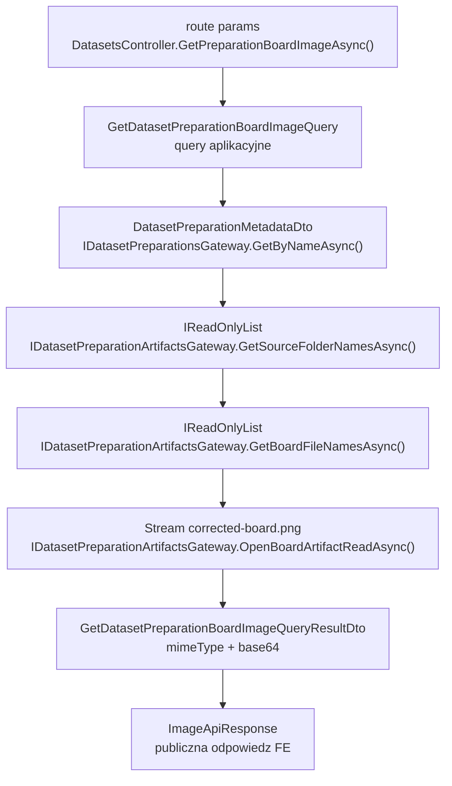
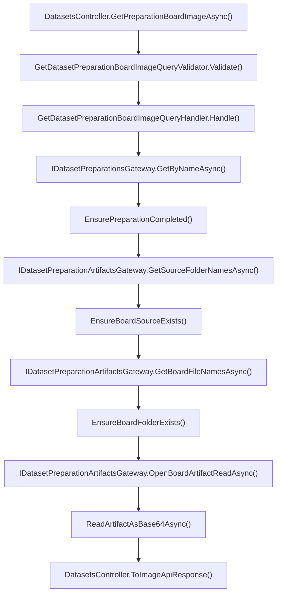

# UC-18-BE - Plan implementacyjny dla `GET /api/datasets/preparations/{preparationName}/board/{sourceName}/files/{boardFolderName}/image`

## 1) Przeznaczenie endpointa
- Endpoint zwraca obraz preview pojedynczej planszy `board` z przygotowania datasetu.
- W `UC-18` jest to krok wykonywany po:
  - wyborze preparation,
  - wyborze `board` source,
  - pobraniu listy `boardFolderName` z `board/{sourceName}/file.json`.
- Endpoint służy wyłącznie do podglądu artefaktu `corrected-board.png`.
- Endpoint jest `read-only`:
  - nie uruchamia preprocessingu,
  - nie wywołuje `ML`,
  - nie skanuje katalogów jako źródła prawdy,
  - nie modyfikuje manifestów ani metadata.
- Publiczna odpowiedź ma reuse'ować istniejący kontrakt backendu dla obrazów:
  - `ImageApiResponse`
  - pola: `mimeType`, `base64`
- Nie tworzymy nowego publicznego kontraktu typu `fileName/contentType/base64Content`, bo obowiązują wcześniejsze kontrakty backendu.

## 2) Zakres i główne założenia
- Plan dotyczy wyłącznie warstwy `BE` w `src/Backend/Sudoku`.
- Nie sugerujemy się aktualnym stanem `FE` i `ML`, poza obowiązującymi kontraktami, layoutem artefaktów i wcześniejszymi historyjkami.
- Architektura ma pozostać zgodna z zasadami projektu:
  - `Api` cienkie,
  - `Application` zawiera logikę use-case'a,
  - `Infrastructure` realizuje I/O i szczegóły storage,
  - `Models` bez nowych bytów, jeśli nie ma realnej domenowej potrzeby.
- Źródłem prawdy dla listy plansz jest manifest:
  - `{PreparationsDirectoryPath}/{preparationName}/board/{sourceName}/file.json`
- Źródłem danych obrazu jest artefakt:
  - `{PreparationsDirectoryPath}/{preparationName}/board/{sourceName}/{boardFolderName}/corrected-board.png`
- Nie wolno traktować samego istnienia katalogu `{boardFolderName}` jako potwierdzenia zasobu.
- Najpierw trzeba potwierdzić, że:
  - preparation istnieje,
  - preparation ma status `completed`,
  - `sourceName` istnieje w `board/folders.json`,
  - `boardFolderName` istnieje w `board/{sourceName}/file.json`.

## 3) Co już istnieje i co należy reuse'ować

### 3.1 Istniejące elementy backendu
- `Sudoku/Controllers/DatasetsController.cs`
  - ma już:
    - `GET /api/datasets/preparations`
    - `GET /api/datasets/preparations/{preparationName}`
    - `GET /api/datasets/preparations/{preparationName}/board/folders`
    - `GET /api/datasets/preparations/{preparationName}/digit/folders`
    - `GET /api/datasets/preparations/{preparationName}/board/{sourceName}/files`
  - zawiera już helper:
    - `BuildDatasetPreparationBoardImageEndpoint(...)`
- `Application/Abstractions/IDatasetPreparationsGateway.cs`
  - odczyt metadata preparation.
- `Application/Abstractions/IDatasetPreparationArtifactsGateway.cs`
  - odczyt manifestów preparation:
    - `GetSourceFolderNamesAsync(...)`
    - `GetBoardFileNamesAsync(...)`
- `Application/Datasets/GetDatasetPreparationBoardFilesQueryHandler.cs`
  - gotowy wzorzec logiki:
    - sprawdzenie preparation,
    - sprawdzenie `completed`,
    - walidacja `sourceName` przez `board/folders.json`,
    - odczyt `board/{sourceName}/file.json`
- `Application/Datasets/DatasetPreparationNameValidationRules.cs`
  - wspólna walidacja `preparationName`.
- `Application/Datasets/DatasetPreparationSourceNameValidationRules.cs`
  - wspólna walidacja `sourceName`.
- `Application/Datasets/DatasetPreparationNotFoundException.cs`
  - semantyka `404`.
- `Application/Datasets/DatasetPreparationSourceNotFoundException.cs`
  - semantyka `404` dla `sourceName`.
- `Application/Datasets/DatasetPreparationArtifactsNotReadyException.cs`
  - semantyka `409`.
- `Infrastructure/Storage/DatasetPreparationArtifactsGateway.cs`
  - czyta już manifesty `folders.json` i `file.json`.
- `Infrastructure/Storage/LocalFileStorageGateway.cs`
  - ma bezpieczne `OpenReadAsync(...)`.
- `Sudoku/Contracts/ImageApiResponse.cs`
  - istniejący publiczny kontrakt obrazów:
    - `mimeType`
    - `base64`
- `.github/workflows/backend-cd.yml`
  - już waliduje i podstawia:
    - `BE_DATASETS_PREP_PREPARATIONS_DIRECTORY_PATH`

### 3.2 Wniosek architektoniczny
- Nie tworzymy nowego gatewaya tylko do `corrected-board.png`.
- Nie używamy `IFileStorageGateway` bezpośrednio w kontrolerze ani w handlerze.
- Rozszerzamy istniejący `IDatasetPreparationArtifactsGateway` o generyczny odczyt artefaktu z folderu planszy.
- Dzięki temu ten sam mechanizm będzie można reuse'ować także przy kolejnych use-case'ach operujących na artefaktach w folderze planszy.

### 3.3 Czego nie należy tworzyć
- Nie tworzyć osobnego:
  - `IDatasetPreparationBoardImageGateway`
  - `IDatasetPreparationBoardPreviewGateway`
  - `DatasetPreparationBoardImageApiResponse`
- Nie zmieniać istniejącego `ImageApiResponse`.
- Nie przenosić logiki statusu preparation do `Infrastructure`.
- Nie opierać się na stanie `FE` ani na bezpośrednim dostępie do `ML`.

## 4) Kontrakty API FE i ML

### 4.1 FE -> BE
- Metoda i ścieżka:
  - `GET /api/datasets/preparations/{preparationName}/board/{sourceName}/files/{boardFolderName}/image`
- Route params:
  - `preparationName: string`
  - `sourceName: string`
  - `boardFolderName: string`
- Query string:
  - brak
- Body:
  - brak
- Autoryzacja:
  - taka sama jak dla innych endpointów administracyjnych z `UC-13`

### 4.2 BE -> FE
- `200 OK` -> `ImageApiResponse`
- `400 Bad Request` -> `ErrorApiResponse`
- `401 Unauthorized` -> `ErrorApiResponse`
- `404 Not Found` -> `ErrorApiResponse`
- `409 Conflict` -> `ErrorApiResponse`
- `500 Internal Server Error` -> `ErrorApiResponse`

`ImageApiResponse`:
- `mimeType: string`
- `base64: string`

Przykład:

```json
{
  "mimeType": "image/png",
  "base64": "iVBORw0KGgoAAAANSUhEUgAA..."
}
```

### 4.3 BE -> ML
- Brak nowej komunikacji.
- Endpoint działa wyłącznie na lokalnych artefaktach runtime preparation.

### 4.4 ML -> BE
- Brak nowej komunikacji HTTP.
- Jedyna zależność pośrednia: wcześniejszy workflow preparation musi zapisać `corrected-board.png`.

### 4.5 Plikowy kontrakt wejściowy dla BE
- Manifest źródeł:
  - `{PreparationsDirectoryPath}/{preparationName}/board/folders.json`
- Manifest plansz:
  - `{PreparationsDirectoryPath}/{preparationName}/board/{sourceName}/file.json`
- Artefakt obrazu:
  - `{PreparationsDirectoryPath}/{preparationName}/board/{sourceName}/{boardFolderName}/corrected-board.png`

Format `file.json`:

```json
[
  "Image1",
  "Image2",
  "Image1079"
]
```

### 4.6 Reguły kontraktowe
- `boardFolderName` musi pochodzić z `file.json`, a nie z heurystyki po filesystemie.
- `mimeType` dla tego endpointu ma być `image/png`, bo kontrakt artefaktu jest stały: `corrected-board.png`.
- `BE` zwraca obraz inline jako base64, zgodnie z obowiązującym kontraktem `ImageApiResponse`.

## 5) Model API wejściowy i wyjściowy w komunikacji z FE i ML

### 5.1 FE -> BE
- wejście:
  - `preparationName` w route
  - `sourceName` w route
  - `boardFolderName` w route
- brak body

### 5.2 BE -> FE
- `[REUSE]` `src/Backend/Sudoku/Sudoku/Contracts/ImageApiResponse.cs`
  - `mimeType`
  - `base64`
- `[REUSE]` `src/Backend/Sudoku/Sudoku/Contracts/ErrorApiResponse.cs`
  - `errorType`
  - `message`

### 5.3 BE -> ML
- brak komunikacji

### 5.4 ML -> BE
- brak komunikacji HTTP

### 5.5 Wniosek kontraktowy
- Dla tego endpointu obowiązującym kontraktem odpowiedzi jest już istniejący `ImageApiResponse`.
- To jest ważniejsze niż opis poglądowy w historyjce, bo użytkownik wymaga zachowania wcześniejszych kontraktów i nazw.

## 6) Zachowanie per warstwa

### 6.1 API
- Nowa akcja w `DatasetsController`:
  - `[HttpGet("preparations/{preparationName}/board/{sourceName}/files/{boardFolderName}/image")]`
- Kontroler:
  - binduje `preparationName`, `sourceName`, `boardFolderName`,
  - wysyła `GetDatasetPreparationBoardImageQuery` do `MediatR`,
  - mapuje wynik do `ImageApiResponse`,
  - mapuje wyjątki na `400/404/409/500`.
- `Api` nie:
  - czyta plików,
  - nie buduje ścieżek filesystemu,
  - nie sprawdza statusu preparation,
  - nie odpytuje `ML`.

### 6.2 Application
- `Application` odpowiada za:
  - walidację `preparationName`,
  - walidację `sourceName`,
  - walidację `boardFolderName`,
  - sprawdzenie istnienia preparation,
  - sprawdzenie statusu `completed`,
  - sprawdzenie, czy `sourceName` istnieje w `board/folders.json`,
  - sprawdzenie, czy `boardFolderName` istnieje w `board/{sourceName}/file.json`,
  - zlecenie odczytu artefaktu `corrected-board.png` przez port,
  - konwersję do `base64`,
  - zbudowanie DTO wyniku.
- `Application` nie:
  - wykonuje niskopoziomowego I/O,
  - nie używa `File.*` ani `Directory.*`,
  - nie tworzy odpowiedzi HTTP,
  - nie skanuje katalogów jako fallback.

### 6.3 Models / Domain
- Brak potrzeby dodawania nowego modelu domenowego.
- Reuse:
  - `Models/Datasets/DatasetPreparationStatus.cs`
- Ten endpoint jest read-only use-case'em nad istniejącym preparation.

### 6.4 Infrastructure
- `Infrastructure` ma:
  - zbudować ścieżkę do folderu planszy,
  - otworzyć wskazany artefakt przez `IFileStorageGateway.OpenReadAsync(...)`,
  - nie wnikać w semantykę HTTP ani workflow.
- Najlepiej dodać generyczną metodę w gatewayu artefaktów, np.:
  - `OpenBoardArtifactReadAsync(string preparationName, string sourceName, string boardFolderName, string artifactFileName, CancellationToken cancellationToken = default)`
- Dzięki temu `Infrastructure` pozostaje implementacją techniczną, a `Application` decyduje, że dla tego use-case'a żądanym artefaktem jest `corrected-board.png`.

## 7) Pliki per warstwa i odpowiedzialności

### 7.1 API (`src/Backend/Sudoku/Sudoku`)
- `[MODYFIKACJA]` `Controllers/DatasetsController.cs`
  - dodać akcję `GetPreparationBoardImageAsync(string? preparationName, string? sourceName, string? boardFolderName, CancellationToken)`
  - wysłać `GetDatasetPreparationBoardImageQuery`
  - mapować wynik do `ImageApiResponse`
  - mapować:
    - `ValidationException -> 400`
    - `DatasetPreparationNotFoundException -> 404`
    - `DatasetPreparationSourceNotFoundException -> 404`
    - `DatasetPreparationBoardFileNotFoundException -> 404`
    - `DatasetPreparationArtifactsNotReadyException -> 409`
    - `IOException | UnauthorizedAccessException | InvalidDataException | JsonException | FileStorageItemNotFoundException -> 500`
- `[REUSE]` `Contracts/ImageApiResponse.cs`
  - publiczny kontrakt odpowiedzi z obrazem
- `[REUSE]` `Contracts/ErrorApiResponse.cs`
  - wspólny kontrakt błędu

### 7.2 Application (`src/Backend/Sudoku/Application`)
- `[NOWY]` `Datasets/GetDatasetPreparationBoardImageQuery.cs`
  - query MediatR
- `[NOWY]` `Datasets/GetDatasetPreparationBoardImageQueryValidator.cs`
  - walidacja `preparationName`, `sourceName`, `boardFolderName`
- `[NOWY]` `Datasets/GetDatasetPreparationBoardImageQueryHandler.cs`
  - logika use-case'a obrazu
- `[NOWY]` `Datasets/GetDatasetPreparationBoardImageQueryResultDto.cs`
  - wynik use-case'a:
    - `mimeType`
    - `base64`
- `[NOWY]` `Datasets/GetDatasetPreparationBoardImageErrorTypes.cs`
  - stałe `errorType`
- `[NOWY]` `Datasets/DatasetPreparationBoardFolderNameValidationRules.cs`
  - wspólna walidacja `boardFolderName`
  - do reuse także przez późniejszy `DELETE /.../{boardFolderName}`
- `[NOWY]` `Datasets/DatasetPreparationBoardFileNotFoundException.cs`
  - semantyczny `404` dla `boardFolderName`, gdy wpis nie istnieje w `file.json`
- `[NOWY]` `Datasets/DatasetPreparationBoardArtifactNames.cs`
  - stała:
    - `CorrectedBoardFileName = "corrected-board.png"`
- `[MODYFIKACJA]` `Abstractions/IDatasetPreparationArtifactsGateway.cs`
  - dodać generyczne otwieranie artefaktu z folderu planszy:
    - `OpenBoardArtifactReadAsync(...)`
- `[REUSE]` `Abstractions/IDatasetPreparationsGateway.cs`
  - odczyt metadata preparation
- `[REUSE]` `Datasets/DatasetPreparationNameValidationRules.cs`
  - walidacja `preparationName`
- `[REUSE]` `Datasets/DatasetPreparationSourceNameValidationRules.cs`
  - walidacja `sourceName`
- `[REUSE]` `Datasets/DatasetPreparationNotFoundException.cs`
  - `404`
- `[REUSE]` `Datasets/DatasetPreparationSourceNotFoundException.cs`
  - `404`
- `[REUSE]` `Datasets/DatasetPreparationArtifactsNotReadyException.cs`
  - `409`
- `[REUSE]` `Datasets/DatasetsPreparationOptions.cs`
  - typed options dla storage
- `[REUSE]` `Datasets/GetDatasetPreparationBoardFilesQueryHandler.cs`
  - jako wzorzec logiki weryfikacji preparation i source

### 7.3 Models (`src/Backend/Sudoku/Models`)
- `[REUSE]` `Models/Datasets/DatasetPreparationStatus.cs`
  - źródło statusów preparation
- `[BRAK NOWYCH PLIKÓW]`
  - endpoint nie wnosi nowego modelu domenowego

### 7.4 Infrastructure (`src/Backend/Sudoku/Infrastructure`)
- `[MODYFIKACJA]` `Storage/DatasetPreparationArtifactsGateway.cs`
  - zaimplementować `OpenBoardArtifactReadAsync(...)`
  - zbudować ścieżkę:
    - `{preparationName}/board/{sourceName}/{boardFolderName}`
  - otworzyć przekazany plik artefaktu przez `IFileStorageGateway.OpenReadAsync(...)`
  - nie zgadywać nazw plików
- `[REUSE]` `Storage/LocalFileStorageGateway.cs`
  - bezpieczny odczyt plików
- `[REUSE]` `Storage/DatasetPreparationsGateway.cs`
  - odczyt metadata preparation
- `[REUSE]` `DependencyInjection.cs`
  - brak nowego serwisu do rejestracji, tylko reuse istniejącego gatewaya artefaktów po rozszerzeniu interfejsu

### 7.5 Testy (`src/Backend/Sudoku/Application.Tests`)
- `[NOWY]` `GetDatasetPreparationBoardImageQueryHandlerTests.cs`
  - testy handlera
- `[NOWY]` `GetDatasetPreparationBoardImageQueryValidatorTests.cs`
  - testy walidacji
- `[MODYFIKACJA]` `DatasetsControllerTests.cs`
  - testy nowej akcji HTTP
- `[REUSE]` `GetDatasetPreparationBoardFilesQueryHandlerTests.cs`
  - wzorzec stubów metadata/artifacts i semantyki wyjątków

### 7.6 Workflow i config
- `[REUSE]` `Sudoku/appsettings.local.json`
  - lokalna ścieżka preparation ustawiona na sztywno
- `[REUSE]` `Sudoku/appsettings.production.json`
  - overlay produkcyjny
- `[REUSE]` `.github/workflows/backend-cd.yml`
  - już podstawia `DatasetsPreparation.PreparationsDirectoryPath`

## 8) Przepływ w obrębie backendu
1. `FE` wywołuje `GET /api/datasets/preparations/{preparationName}/board/{sourceName}/files/{boardFolderName}/image`.
2. Autoryzacja z `UC-13` przepuszcza tylko admina.
3. `DatasetsController.GetPreparationBoardImageAsync(...)` binduje route params.
4. Kontroler wysyła `GetDatasetPreparationBoardImageQuery(preparationName, sourceName, boardFolderName)`.
5. `ValidationBehavior` uruchamia validator.
6. Handler czyta metadata przez `IDatasetPreparationsGateway.GetByNameAsync(...)`.
7. Jeśli preparation nie istnieje:
  - `DatasetPreparationNotFoundException`
8. Jeśli preparation nie ma statusu `completed`:
  - `DatasetPreparationArtifactsNotReadyException`
9. Handler czyta `board/folders.json` przez `IDatasetPreparationArtifactsGateway.GetSourceFolderNamesAsync(preparationName, "board")`.
10. Jeśli `sourceName` nie należy do listy:
  - `DatasetPreparationSourceNotFoundException`
11. Handler czyta `board/{sourceName}/file.json` przez `GetBoardFileNamesAsync(preparationName, sourceName)`.
12. Jeśli `boardFolderName` nie należy do listy:
  - `DatasetPreparationBoardFileNotFoundException`
13. Handler otwiera `corrected-board.png` przez `OpenBoardArtifactReadAsync(...)`.
14. Handler buforuje zawartość, konwertuje ją do base64 i buduje `GetDatasetPreparationBoardImageQueryResultDto`.
15. Kontroler mapuje wynik do `ImageApiResponse`.
16. API zwraca `200 OK`.

## 9) Główne funkcje
- `DatasetsController.GetPreparationBoardImageAsync(...)`
- `DatasetsController.ToImageApiResponse(...)`
- `GetDatasetPreparationBoardImageQueryHandler.Handle(...)`
- `GetDatasetPreparationBoardImageQueryValidator.Validate(...)`
- `DatasetPreparationNameValidationRules.Validate(...)`
- `DatasetPreparationSourceNameValidationRules.Validate(...)`
- `DatasetPreparationBoardFolderNameValidationRules.Validate(...)`
- `GetDatasetPreparationBoardImageQueryHandler.EnsurePreparationCompleted(...)`
- `GetDatasetPreparationBoardImageQueryHandler.EnsureBoardSourceExists(...)`
- `GetDatasetPreparationBoardImageQueryHandler.EnsureBoardFolderExists(...)`
- `GetDatasetPreparationBoardImageQueryHandler.ReadArtifactAsBase64Async(...)`
- `IDatasetPreparationArtifactsGateway.GetSourceFolderNamesAsync(...)`
- `IDatasetPreparationArtifactsGateway.GetBoardFileNamesAsync(...)`
- `IDatasetPreparationArtifactsGateway.OpenBoardArtifactReadAsync(...)`
- `DatasetPreparationArtifactsGateway.OpenBoardArtifactReadAsync(...)`

## 10) Wyjątki, fallbacki i zachowanie błędowe

### 10.1 Publiczne statusy HTTP
- `200 OK`
  - preparation istnieje,
  - status to `completed`,
  - `sourceName` istnieje,
  - `boardFolderName` istnieje w `file.json`,
  - `corrected-board.png` jest dostępny i czytelny
- `400 Bad Request`
  - niepoprawny `preparationName`
  - niepoprawny `sourceName`
  - niepoprawny `boardFolderName`
- `401 Unauthorized`
  - brak poprawnej autoryzacji
- `404 Not Found`
  - preparation nie istnieje
  - `sourceName` nie istnieje w `board/folders.json`
  - `boardFolderName` nie istnieje w `board/{sourceName}/file.json`
- `409 Conflict`
  - preparation istnieje, ale artefakty nie są jeszcze gotowe do odczytu
- `500 Internal Server Error`
  - błąd I/O
  - brak uprawnień do storage
  - uszkodzony JSON manifestu
  - brak `board/folders.json` lub `file.json` dla preparation `completed`
  - `corrected-board.png` nie istnieje mimo poprawnego wpisu w `file.json`
  - artefakt jest niespójny lub nieczytelny

### 10.2 `errorType`
- `invalid_dataset_preparation_name`
- `invalid_dataset_preparation_source_name`
- `invalid_dataset_preparation_board_folder_name`
- `dataset_preparation_not_found`
- `dataset_preparation_source_not_found`
- `dataset_preparation_board_file_not_found`
- `dataset_preparation_artifacts_not_ready`
- `dataset_preparation_board_image_read_failed`

### 10.3 Fallbacki dozwolone
- Brak dodatkowych fallbacków biznesowych.
- Jeśli obraz jest poprawny, zawsze zwracamy go inline jako `ImageApiResponse`.

### 10.4 Fallbacki niedozwolone
- Nie skanować katalogu `{boardFolderName}` w celu potwierdzenia zasobu.
- Nie uznawać fizycznie istniejącego folderu za ważny, jeśli nie ma go w `file.json`.
- Nie odpytywać `ML`, by ponownie wygenerować preview.
- Nie zwracać `404`, gdy preparation istnieje, `boardFolderName` istnieje w manifeście, ale `corrected-board.png` zniknął.
- Nie zwracać pustego obrazu, placeholdera ani `200` z pustym base64.

### 10.5 Sytuacje graniczne
- preparation istnieje, status `running`
  - `409`
- preparation istnieje, status `failed`
  - `409`
- `sourceName` istnieje w route, ale nie ma go w `board/folders.json`
  - `404`
- `boardFolderName` istnieje fizycznie, ale nie ma go w `file.json`
  - `404`
- `boardFolderName` jest w `file.json`, ale `corrected-board.png` nie istnieje
  - `500`
- `file.json` jest uszkodzony
  - `500`

## 11) Specyficzna logika i pseudokod

### 11.1 Pseudokod handlera

```text
handle(query):
  validate(query)

  metadata = datasetPreparationsGateway.getByName(query.preparationName)
  if metadata is null:
    throw dataset_preparation_not_found

  if metadata.status != "completed":
    throw dataset_preparation_artifacts_not_ready

  boardSources = artifactsGateway.getSourceFolderNames(query.preparationName, "board")
  if query.sourceName not in boardSources:
    throw dataset_preparation_source_not_found

  boardFolders = artifactsGateway.getBoardFileNames(query.preparationName, query.sourceName)
  if query.boardFolderName not in boardFolders:
    throw dataset_preparation_board_file_not_found

  stream = artifactsGateway.openBoardArtifactRead(
    query.preparationName,
    query.sourceName,
    query.boardFolderName,
    "corrected-board.png"
  )

  bytes = read_all_bytes(stream)

  return {
    mimeType: "image/png",
    base64: convert_to_base64(bytes)
  }
```

### 11.2 Pseudokod gatewaya artefaktów

```text
openBoardArtifactRead(preparationName, sourceName, boardFolderName, artifactFileName):
  directoryPath = combine(
    preparationsDirectoryPath,
    preparationName,
    "board",
    sourceName,
    boardFolderName
  )

  return fileStorageGateway.openRead(directoryPath, artifactFileName)
```

### 11.3 Pseudokod walidacji

```text
validate(query):
  validatePreparationName(query.preparationName)
  validateSourceName(query.sourceName)
  validateBoardFolderName(query.boardFolderName)
```

### 11.4 Wyjątkowa logika do uwzględnienia
- Walidacja zasobu jest dwuetapowa:
  - najpierw logicznie przez manifest `file.json`,
  - dopiero potem technicznie przez odczyt pliku.
- To rozróżnienie jest kluczowe dla poprawnego mapowania:
  - brak wpisu w manifeście -> `404`
  - brak artefaktu dla istniejącego wpisu -> `500`
- `corrected-board.png` jest częścią kontraktu workflow preparation, a nie dynamicznie wybieranym plikiem użytkownika.

## 12) Mermaid flowchart - flow modeli



## 13) Mermaid flowchart - logika aplikacji z funkcjami



## 14) Logging

### 14.1 `Information`
- start:
  - `preparationName`
  - `sourceName`
  - `boardFolderName`
- success:
  - `preparationName`
  - `sourceName`
  - `boardFolderName`
  - `mimeType`
  - opcjonalnie `imageSizeBytes`, jeśli zostanie uznane za przydatne diagnostycznie

### 14.2 `Warning`
- preparation nie istnieje
- preparation nie jest gotowe
- `sourceName` nie należy do preparation
- `boardFolderName` nie należy do `file.json`

### 14.3 `Error`
- błąd odczytu `board/folders.json`
- błąd odczytu `file.json`
- błąd otwarcia `corrected-board.png`
- błąd odczytu strumienia artefaktu

### 14.4 Guardraile logowania
- nie logować zawartości `base64`
- nie logować pełnych ścieżek systemowych w odpowiedziach HTTP
- nie logować całego `file.json`
- nie logować każdego poprawnego odczytu z dużą liczbą dodatkowych pól
- logi mają być lekkie i operacyjne

## 15) Workflow GitHub i konfiguracja runtime

### 15.1 Czy endpoint wymaga nowych zmian workflow
- Nie.
- Sam endpoint nie wymaga:
  - nowych sekretów,
  - nowych zmiennych środowiskowych,
  - nowych plików `appsettings`,
  - zmian po stronie `ML`.

### 15.2 Co już musi istnieć
- Lokalnie:
  - `appsettings.local.json` ma ustawiać `DatasetsPreparation.PreparationsDirectoryPath` na stałą ścieżkę developerską.
- Produkcyjnie:
  - `backend-cd.yml` ma podstawiać `BE_DATASETS_PREP_PREPARATIONS_DIRECTORY_PATH` do `DatasetsPreparation.PreparationsDirectoryPath`.

### 15.3 Stan obecny workflow
- `backend-cd.yml` już:
  - waliduje `BE_DATASETS_PREP_PREPARATIONS_DIRECTORY_PATH`
  - wpisuje tę wartość do `appsettings.production.json`
- W planie należy to opisać jako istniejący prerequisite, nie nową pracę.

### 15.4 Reguła operacyjna
- Workflow może modyfikować `appsettings.production.json`.
- Lokalnie ścieżki pozostają wpisane na sztywno.
- Deploy nie może nadpisywać `shared/data`, bo tam żyją runtime artifacts preparation.

## 16) Inne istotne reguły
- Nie zmieniać istniejących nazw klas i pól, które już są używane w backendzie.
- Reuse'ować istniejący `ImageApiResponse`.
- Nie zwracać pliku jako `FileStreamResult` ani surowego `image/png` response body, bo obecny backend dla obrazów używa JSON z base64.
- Decyzja o tym, jaki artefakt ma zostać odczytany, należy do `Application`.
- `Infrastructure` ma dostać nazwę artefaktu jako parametr i tylko go odczytać.
- `boardFolderName` powinno dostać wspólne reguły walidacji, bo będzie reuse'owane także przez późniejsze `DELETE`.

## 17) Kolejność implementacji kodu dla historyjki
1. Dodać `DatasetPreparationBoardFolderNameValidationRules`.
2. Dodać `DatasetPreparationBoardFileNotFoundException`.
3. Dodać `DatasetPreparationBoardArtifactNames`.
4. Dodać `GetDatasetPreparationBoardImageErrorTypes`.
5. Dodać `GetDatasetPreparationBoardImageQuery`.
6. Dodać `GetDatasetPreparationBoardImageQueryResultDto`.
7. Dodać `GetDatasetPreparationBoardImageQueryValidator`.
8. Rozszerzyć `IDatasetPreparationArtifactsGateway` o `OpenBoardArtifactReadAsync(...)`.
9. Rozszerzyć `DatasetPreparationArtifactsGateway` o generyczny odczyt artefaktu z folderu planszy.
10. Dodać `GetDatasetPreparationBoardImageQueryHandler`.
11. Rozszerzyć `DatasetsController` o nową akcję `GET`.
12. Dodać mapowanie DTO do `ImageApiResponse`.
13. Dodać testy validatora.
14. Dodać testy handlera.
15. Rozszerzyć testy kontrolera.
16. Wykonać smoke test dla:
  - `completed`
  - `running`
  - braku preparation
  - braku source
  - braku boardFolderName w manifeście
  - braku `corrected-board.png`

## 18) Guardraile implementacyjne
- Nie czytać `corrected-board.png` w kontrolerze.
- Nie używać `IFileStorageGateway` bezpośrednio w `Application`.
- Nie tworzyć image-specific gatewaya, jeśli wystarcza rozszerzenie istniejącego gatewaya artefaktów.
- Nie skanować katalogów jako fallback.
- Nie odpytywać `ML`.
- Nie zmieniać kontraktu `ImageApiResponse`.
- Nie mapować brakującego artefaktu dla poprawnego wpisu w manifeście na `404`.
- Nie trzymać logiki ścieżek w kontrolerze.
- Nie hardcodować ścieżek runtime w kodzie.

## 19) Zależności pomiędzy historyjkami
- `UC-13`
  - dostarcza autoryzację admina
- `UC-17 POST /api/datasets/preparations`
  - tworzy preparation i artefakty runtime
- `UC-17 GET /api/datasets/preparations`
  - pozwala wybrać preparation
- `UC-17 GET /api/datasets/preparations/{preparationName}`
  - pozwala ocenić status preparation
- `UC-18 GET /api/datasets/preparations/{preparationName}/board/folders`
  - dostarcza `sourceName`
- `UC-18 GET /api/datasets/preparations/{preparationName}/board/{sourceName}/files`
  - dostarcza `boardFolderName` i jest bezpośrednim poprzednikiem tego endpointu
- `UC-18 DELETE /api/datasets/preparations/{preparationName}/board/{sourceName}/files/{boardFolderName}`
  - powinien reuse'ować walidację `boardFolderName` oraz sprawdzanie istnienia wpisu w `file.json`
- `UC-19`
  - zależy pośrednio od zachowania spójności artefaktów preparation po `UC-18`

## 20) Plan testów minimum

### 20.1 Validator
- pusty `preparationName` -> `400`
- pusty `sourceName` -> `400`
- pusty `boardFolderName` -> `400`
- `preparationName` z `..` -> `400`
- `sourceName` z separatorem ścieżki -> `400`
- `boardFolderName` z separatorem ścieżki -> `400`
- poprawny request -> walidacja przechodzi

### 20.2 Handler
- happy path:
  - preparation `completed`
  - source istnieje
  - board folder istnieje
  - obraz odczytany poprawnie
- brak preparation -> `DatasetPreparationNotFoundException`
- status `queued` / `running` / `failed` -> `DatasetPreparationArtifactsNotReadyException`
- brak `sourceName` w `board/folders.json` -> `DatasetPreparationSourceNotFoundException`
- brak `boardFolderName` w `file.json` -> `DatasetPreparationBoardFileNotFoundException`
- poprawny wpis w `file.json`, ale brak artefaktu -> propagacja błędu technicznego do `500`
- wynik zawiera:
  - `mimeType = image/png`
  - poprawne `base64`

### 20.3 API
- `200 OK` i poprawne mapowanie `ImageApiResponse`
- `400` dla błędu walidacji
- `401` bez autoryzacji
- `404` dla braku preparation
- `404` dla braku source
- `404` dla braku board folderu w manifeście
- `409` dla niegotowego preparation
- `500` dla błędu odczytu manifestu
- `500` dla braku `corrected-board.png`

### 20.4 Manual smoke
- poprawny preview istniejącej planszy
- preview dla wpisu z białymi znakami lub nielegalną nazwą
- preview dla source spoza `folders.json`
- preview dla board spoza `file.json`
- preview dla preparation `running`
- preview dla brakującego `corrected-board.png`

## 21) Podsumowanie decyzji architektonicznych
- Endpoint ma być cienkim `GET` nad istniejącym workflow preparation.
- `Application` posiada pełną logikę semantyczną:
  - walidacje,
  - sprawdzenie `completed`,
  - potwierdzenie `sourceName`,
  - potwierdzenie `boardFolderName`,
  - konwersję do base64.
- `Infrastructure` ma tylko odczytać wskazany artefakt z folderu planszy.
- Najważniejsza decyzja antyduplikacyjna:
  - rozszerzyć `IDatasetPreparationArtifactsGateway`,
  - nie tworzyć nowego dedykowanego gatewaya obrazu.
- Najważniejsze rozróżnienie błędów:
  - brak wpisu w `file.json` -> `404`
  - brak `corrected-board.png` dla istniejącego wpisu -> `500`
- Publiczny kontrakt musi reuse'ować istniejący `ImageApiResponse`, a nie wprowadzać nowego wariantu odpowiedzi tylko dla tego endpointu.
