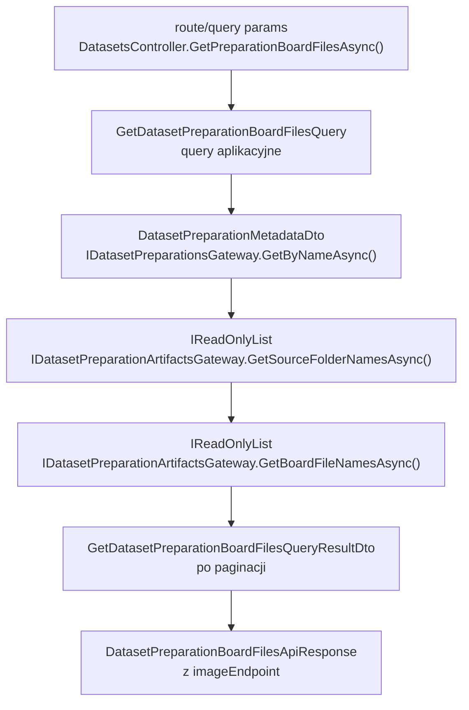
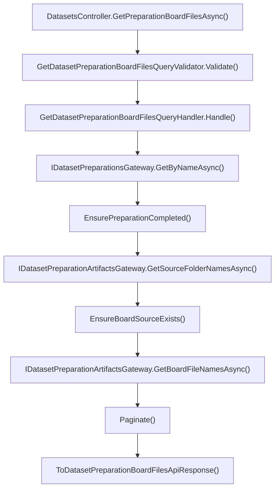

# UC-18-BE - Plan implementacyjny dla `GET /api/datasets/preparations/{preparationName}/board/{sourceName}/files?page={page}&pageSize={pageSize}`

## 1) Przeznaczenie endpointa
- Endpoint zwraca stronicowaną listę folderów plansz dla jednego źródła `board` w wybranym preparation.
- To jest krok po `GET /api/datasets/preparations/{preparationName}/board/folders`: `FE` wybiera `sourceName`, a potem pobiera listę plansz z `board/{sourceName}/file.json`.
- Endpoint jest `read-only`: nie wywołuje `ML`, nie uruchamia preprocessingu, nie przebudowuje manifestów i nie skanuje katalogów jako źródła prawdy.
- Zwraca tylko dane potrzebne do listy: `boardFolderName` i `imageEndpoint`. Sam obraz pozostaje osobnym endpointem.

## 2) Kluczowe założenia i zależności
- Zakres planu obejmuje wyłącznie `BE` w `src/Backend/Sudoku`.
- Nie sugerujemy się aktualnym stanem `FE` ani bieżącą implementacją `ML`; opieramy się na PRD, `UC-18`, obecnym backendzie i wcześniejszych kontraktach.
- Zależności historyjek:
  - `UC-13` daje autoryzację admina.
  - `UC-17 POST /api/datasets/preparations` tworzy preparation i artefakty runtime.
  - `UC-17 GET /api/datasets/preparations` oraz `GET /api/datasets/preparations/{preparationName}` dostarczają wybór i status preparation.
  - `UC-18 GET .../board/folders` dostarcza `sourceName`.
  - późniejsze `GET .../image` i `DELETE .../files/{boardFolderName}` będą reuse'ować ten sam obszar storage.
- Najważniejszy wniosek: nie tworzyć nowego gatewaya tylko dla `file.json`; rozszerzyć istniejący `IDatasetPreparationArtifactsGateway`.

## 3) Co już istnieje i co należy reuse'ować
- `Sudoku/Controllers/DatasetsController.cs`
  - istnieją już endpointy:
    - `GET /api/datasets/preparations`
    - `GET /api/datasets/preparations/{preparationName}`
    - `GET /api/datasets/preparations/{preparationName}/board/folders`
    - `GET /api/datasets/preparations/{preparationName}/digit/folders`
- `Application/Abstractions/IDatasetPreparationsGateway.cs`
  - odczyt metadata preparation.
- `Application/Abstractions/IDatasetPreparationArtifactsGateway.cs`
  - generyczny port artefaktów preparation.
- `Application/Datasets/DatasetPreparationNameValidationRules.cs`
  - wspólna walidacja `preparationName`.
- `Application/Datasets/DatasetPreparationNotFoundException.cs`
  - semantyka `404`.
- `Application/Datasets/DatasetPreparationArtifactsNotReadyException.cs`
  - semantyka `409`.
- `Infrastructure/Storage/DatasetPreparationArtifactsGateway.cs`
  - odczytuje już `board/folders.json` i `digit/folders.json`.
- `Infrastructure/Storage/DatasetPreparationsGateway.cs`
  - czyta `preparation.metadata.json`.
- `Infrastructure/Storage/LocalFileStorageGateway.cs`
  - ma bezpieczne `OpenReadAsync(...)`.
- `.github/workflows/backend-cd.yml`
  - już podstawia `BE_DATASETS_PREP_PREPARATIONS_DIRECTORY_PATH`; nie potrzeba nowej zmiany workflow.

## 4) Kontrakty FE/BE/ML i plikowy input dla BE

### FE -> BE
- `GET /api/datasets/preparations/{preparationName}/board/{sourceName}/files`
- route:
  - `preparationName: string`
  - `sourceName: string`
- query:
  - `page: int`
  - `pageSize: int`
- body:
  - brak

### BE -> FE
- `200 OK` -> `DatasetPreparationBoardFilesApiResponse`
- `400 Bad Request` -> `ErrorApiResponse`
- `401 Unauthorized` -> `ErrorApiResponse`
- `404 Not Found` -> `ErrorApiResponse`
- `409 Conflict` -> `ErrorApiResponse`
- `500 Internal Server Error` -> `ErrorApiResponse`

`DatasetPreparationBoardFilesApiResponse`:
- `preparationName`
- `sourceName`
- `items: DatasetPreparationBoardFileListItemApiResponse[]`
- `page`
- `pageSize`
- `totalCount`

`DatasetPreparationBoardFileListItemApiResponse`:
- `boardFolderName`
- `imageEndpoint`

Przykład:

```json
{
  "preparationName": "preparation-001",
  "sourceName": "v1_training",
  "items": [
    {
      "boardFolderName": "Image1",
      "imageEndpoint": "/api/datasets/preparations/preparation-001/board/v1_training/files/Image1/image"
    }
  ],
  "page": 1,
  "pageSize": 50,
  "totalCount": 240
}
```

### BE -> ML / ML -> BE
- Brak nowej komunikacji. Ten endpoint działa wyłącznie na runtime artifacts zapisanych wcześniej do storage przez flow preparation.

### Plikowy input dla BE
- `board/folders.json`:
  - służy do potwierdzenia, że `sourceName` należy do preparation.
- `board/{sourceName}/file.json`:
  - jest jedynym źródłem listy `boardFolderName`.
- Format `file.json`:

```json
[
  "Image1",
  "Image2",
  "Image1079"
]
```

## 5) Zachowanie per warstwa

### API
- Nowa akcja w `DatasetsController`:
  - `[HttpGet("preparations/{preparationName}/board/{sourceName}/files")]`
- Kontroler:
  - binduje `preparationName`, `sourceName`, `page`, `pageSize`,
  - wysyła query do `MediatR`,
  - mapuje DTO do `DatasetPreparationBoardFilesApiResponse`,
  - buduje `imageEndpoint`.
- API nie:
  - czyta plików,
  - nie robi paginacji,
  - nie waliduje gotowości preparation,
  - nie rozmawia z `ML`.

### Application
- `Application` odpowiada za:
  - walidację `preparationName`,
  - walidację `sourceName`,
  - walidację `page` i `pageSize`,
  - sprawdzenie istnienia preparation,
  - sprawdzenie statusu `completed`,
  - sprawdzenie, czy `sourceName` istnieje w `board/folders.json`,
  - odczyt listy z `board/{sourceName}/file.json`,
  - wyliczenie paginacji,
  - budowę DTO wyniku.
- `Application` nie:
  - robi niskopoziomowego I/O,
  - nie składa URL-i HTTP,
  - nie skanuje katalogów.

### Models / Domain
- Brak nowego modelu domenowego.
- Reuse:
  - `Models/Datasets/DatasetPreparationStatus.cs`

### Infrastructure
- `Infrastructure` ma:
  - odczytać `board/folders.json`,
  - odczytać `board/{sourceName}/file.json`,
  - zdeserializować `string[]`,
  - zgłosić błąd techniczny przy uszkodzonych danych.
- `Infrastructure` nie:
  - decyduje o `404`,
  - nie decyduje o `409`,
  - nie liczy paginacji,
  - nie składa `imageEndpoint`.

## 6) Pliki per warstwa i odpowiedzialności

### API
- `[MODYFIKACJA]` `src/Backend/Sudoku/Sudoku/Controllers/DatasetsController.cs`
  - dodać `GetPreparationBoardFilesAsync(string? preparationName, string? sourceName, int? page, int? pageSize, CancellationToken)`
  - wysłać `GetDatasetPreparationBoardFilesQuery`
  - mapować `ValidationException -> 400`, `DatasetPreparationNotFoundException -> 404`, `DatasetPreparationSourceNotFoundException -> 404`, `DatasetPreparationArtifactsNotReadyException -> 409`, techniczne I/O/JSON/storage -> `500`
  - złożyć `imageEndpoint`
- `[NOWY]` `src/Backend/Sudoku/Sudoku/Contracts/DatasetPreparationBoardFilesApiResponse.cs`
  - response listy plansz
- `[NOWY]` `src/Backend/Sudoku/Sudoku/Contracts/DatasetPreparationBoardFileListItemApiResponse.cs`
  - pojedynczy wpis listy
- `[REUSE]` `src/Backend/Sudoku/Sudoku/Contracts/ErrorApiResponse.cs`
  - wspólny kontrakt błędów

### Application
- `[NOWY]` `src/Backend/Sudoku/Application/Datasets/GetDatasetPreparationBoardFilesQuery.cs`
  - query MediatR
- `[NOWY]` `src/Backend/Sudoku/Application/Datasets/GetDatasetPreparationBoardFilesQueryValidator.cs`
  - walidacja `preparationName`, `sourceName`, `page`, `pageSize`
- `[NOWY]` `src/Backend/Sudoku/Application/Datasets/GetDatasetPreparationBoardFilesQueryHandler.cs`
  - logika use-case'a
- `[NOWY]` `src/Backend/Sudoku/Application/Datasets/GetDatasetPreparationBoardFilesQueryResultDto.cs`
  - wynik use-case'a
- `[NOWY]` `src/Backend/Sudoku/Application/Datasets/DatasetPreparationBoardFileListItemDto.cs`
  - wewnętrzny item listy
- `[NOWY]` `src/Backend/Sudoku/Application/Datasets/GetDatasetPreparationBoardFilesErrorTypes.cs`
  - spójne `errorType`
- `[NOWY]` `src/Backend/Sudoku/Application/Datasets/DatasetPreparationSourceNameValidationRules.cs`
  - wspólna walidacja `sourceName`, do reuse także przez endpoint obrazu i `DELETE`
- `[NOWY]` `src/Backend/Sudoku/Application/Datasets/DatasetPreparationSourceNotFoundException.cs`
  - semantyczny `404` dla `sourceName`
- `[MODYFIKACJA]` `src/Backend/Sudoku/Application/Abstractions/IDatasetPreparationArtifactsGateway.cs`
  - dodać `GetBoardFileNamesAsync(string preparationName, string sourceName, CancellationToken cancellationToken = default)`
- `[REUSE]` `src/Backend/Sudoku/Application/Abstractions/IDatasetPreparationsGateway.cs`
  - metadata preparation
- `[REUSE]` `src/Backend/Sudoku/Application/Datasets/DatasetPreparationNameValidationRules.cs`
  - walidacja `preparationName`
- `[REUSE]` `src/Backend/Sudoku/Application/Datasets/DatasetPreparationNotFoundException.cs`
  - `404`
- `[REUSE]` `src/Backend/Sudoku/Application/Datasets/DatasetPreparationArtifactsNotReadyException.cs`
  - `409`
- `[REUSE]` `src/Backend/Sudoku/Application/Datasets/DatasetsPreparationOptions.cs`
  - konfiguracja storage

### Models
- `[REUSE]` `src/Backend/Sudoku/Models/Datasets/DatasetPreparationStatus.cs`
  - statusy preparation
- `[BRAK NOWYCH PLIKÓW]` `src/Backend/Sudoku/Models`
  - endpoint nie wnosi nowej domeny

### Infrastructure
- `[MODYFIKACJA]` `src/Backend/Sudoku/Infrastructure/Storage/DatasetPreparationArtifactsGateway.cs`
  - zaimplementować `GetBoardFileNamesAsync(...)`
  - zbudować ścieżkę `board/{sourceName}`
  - odczytać `file.json`
  - zdeserializować `string[]`
  - sprawdzić brak pustych wpisów
- `[REUSE]` `src/Backend/Sudoku/Infrastructure/Storage/DatasetPreparationsGateway.cs`
  - odczyt metadata
- `[REUSE]` `src/Backend/Sudoku/Infrastructure/Storage/LocalFileStorageGateway.cs`
  - bezpieczny odczyt plików
- `[REUSE]` `src/Backend/Sudoku/Infrastructure/DependencyInjection.cs`
  - brak nowego serwisu, tylko reuse istniejącej rejestracji gatewaya artefaktów

### Testy
- `[NOWY]` `src/Backend/Sudoku/Application.Tests/GetDatasetPreparationBoardFilesQueryHandlerTests.cs`
  - testy handlera
- `[NOWY]` `src/Backend/Sudoku/Application.Tests/GetDatasetPreparationBoardFilesQueryValidatorTests.cs`
  - testy walidacji
- `[MODYFIKACJA]` `src/Backend/Sudoku/Application.Tests/DatasetsControllerTests.cs`
  - testy kontrolera
- `[REUSE]` `src/Backend/Sudoku/Application.Tests/GetDatasetPreparationFoldersQueryHandlerTests.cs`
  - wzorzec stubów metadata/artifacts

### Workflow i config
- `[REUSE]` `src/Backend/Sudoku/Sudoku/appsettings.local.json`
  - lokalna ścieżka na sztywno
- `[REUSE]` `src/Backend/Sudoku/Sudoku/appsettings.production.json`
  - overlay produkcyjny
- `[REUSE]` `.github/workflows/backend-cd.yml`
  - już podstawia `PreparationsDirectoryPath`

## 7) Przepływ w obrębie BE
1. `FE` wywołuje `GET /api/datasets/preparations/{preparationName}/board/{sourceName}/files?page={page}&pageSize={pageSize}`.
2. Autoryzacja z `UC-13` przepuszcza tylko admina.
3. `DatasetsController.GetPreparationBoardFilesAsync(...)` binduje route i query.
4. Kontroler wysyła `GetDatasetPreparationBoardFilesQuery(preparationName, sourceName, page, pageSize)`.
5. `ValidationBehavior` uruchamia validator.
6. Handler czyta metadata przez `IDatasetPreparationsGateway.GetByNameAsync(...)`.
7. Gdy preparation nie istnieje -> `DatasetPreparationNotFoundException`.
8. Gdy status nie jest `completed` -> `DatasetPreparationArtifactsNotReadyException`.
9. Handler czyta `board/folders.json` przez `IDatasetPreparationArtifactsGateway.GetSourceFolderNamesAsync(preparationName, "board")`.
10. Gdy `sourceName` nie należy do listy -> `DatasetPreparationSourceNotFoundException`.
11. Handler czyta `board/{sourceName}/file.json` przez `GetBoardFileNamesAsync(...)`.
12. Handler liczy `skip/take` na podstawie `page` i `pageSize`.
13. Handler zwraca wynik bez URL-i HTTP, tylko z `boardFolderName`.
14. Kontroler składa `imageEndpoint` i zwraca `200 OK`.

## 8) Główne funkcje
- `DatasetsController.GetPreparationBoardFilesAsync(...)`
- `DatasetsController.ToDatasetPreparationBoardFilesApiResponse(...)`
- `DatasetsController.BuildDatasetPreparationBoardImageEndpoint(...)`
- `GetDatasetPreparationBoardFilesQueryHandler.Handle(...)`
- `GetDatasetPreparationBoardFilesQueryValidator.Validate(...)`
- `DatasetPreparationSourceNameValidationRules.Validate(...)`
- `GetDatasetPreparationBoardFilesQueryHandler.EnsurePreparationCompleted(...)`
- `GetDatasetPreparationBoardFilesQueryHandler.EnsureBoardSourceExists(...)`
- `GetDatasetPreparationBoardFilesQueryHandler.Paginate(...)`
- `IDatasetPreparationArtifactsGateway.GetSourceFolderNamesAsync(...)`
- `IDatasetPreparationArtifactsGateway.GetBoardFileNamesAsync(...)`
- `DatasetPreparationArtifactsGateway.GetBoardFileNamesAsync(...)`

## 9) Wyjątki, fallbacki i semantyka

### Statusy HTTP
- `200`
  - preparation istnieje, jest `completed`, `sourceName` istnieje, `file.json` jest poprawny
- `400`
  - niepoprawny `preparationName`
  - niepoprawny `sourceName`
  - `page < 1`
  - `pageSize < 1`
  - `pageSize > MaxPageSize`
- `401`
  - brak poprawnej autoryzacji
- `404`
  - preparation nie istnieje
  - `sourceName` nie ma w `board/folders.json`
- `409`
  - preparation istnieje, ale nie jest gotowe do odczytu artefaktów
- `500`
  - błąd I/O
  - brak dostępu do storage
  - brak `board/folders.json` dla `completed`
  - brak `board/{sourceName}/file.json` mimo obecności wpisu w `board/folders.json`
  - uszkodzony JSON
  - puste wpisy w manifeście

### `errorType`
- `invalid_dataset_preparation_name`
- `invalid_dataset_preparation_source_name`
- `invalid_dataset_preparation_board_files_page`
- `invalid_dataset_preparation_board_files_page_size`
- `dataset_preparation_not_found`
- `dataset_preparation_source_not_found`
- `dataset_preparation_artifacts_not_ready`
- `dataset_preparation_board_files_read_failed`

### Fallbacki
- Dozwolone:
  - pusty `file.json` -> `200`, `items=[]`, `totalCount=0`
  - `page` poza zakresem -> `200`, `items=[]`, `totalCount` zachowane
- Niedozwolone:
  - skan katalogów zamiast `file.json`
  - zgadywanie `sourceName` z katalogów
  - budowanie listy z `SourceReports`
  - odpytywanie `ML`
  - zamiana brakującego `file.json` dla istniejącego `sourceName` na `404`

## 10) Pseudokod

### Handler

```text
handle(query):
  validate(query)

  metadata = datasetPreparationsGateway.getByName(query.preparationName)
  if metadata is null:
    throw dataset_preparation_not_found

  if metadata.status != "completed":
    throw dataset_preparation_artifacts_not_ready

  boardSources = artifactsGateway.getSourceFolderNames(query.preparationName, "board")
  if query.sourceName not in boardSources:
    throw dataset_preparation_source_not_found

  allItems = artifactsGateway.getBoardFileNames(query.preparationName, query.sourceName)
  totalCount = allItems.length
  skip = (query.page - 1) * query.pageSize
  pageItems = allItems.skip(skip).take(query.pageSize)

  return result(preparationName, sourceName, pageItems, query.page, query.pageSize, totalCount)
```

### Gateway artefaktów

```text
getBoardFileNames(preparationName, sourceName):
  path = combine(preparationsDirectoryPath, preparationName, "board", sourceName)
  stream = fileStorageGateway.openRead(path, "file.json")
  items = deserialize string[]

  if items is null or contains empty values:
    throw invalid_data

  return items
```

### Walidacja

```text
validate(query):
  validatePreparationName(query.preparationName)
  validateSourceName(query.sourceName)

  if query.page is null or query.page < 1:
    invalid_page

  if query.pageSize is null or query.pageSize < 1 or query.pageSize > 200:
    invalid_page_size
```

## 11) Mermaid flowchart - flow modeli



## 12) Mermaid flowchart - logika aplikacji z funkcjami



## 13) Logging
- `Information`
  - start: `preparationName`, `sourceName`, `page`, `pageSize`
  - success: `preparationName`, `sourceName`, `page`, `pageSize`, `totalCount`, `returnedItemsCount`
- `Warning`
  - preparation nie istnieje
  - preparation niegotowe
  - `sourceName` nie należy do preparation
- `Error`
  - błąd odczytu `board/folders.json`
  - błąd odczytu `board/{sourceName}/file.json`
  - błąd deserializacji manifestu
- Guardraile:
  - nie logować całej zawartości `file.json`
  - nie logować każdego `boardFolderName` osobno
  - nie logować ścieżek systemowych w odpowiedziach HTTP
  - logi mają być lekkie, bez spamowania dysku

## 14) Workflow GitHub i runtime
- Brak nowych zmian w `.github/workflows`.
- Brak nowych opcji `appsettings`.
- Lokalnie `PreparationsDirectoryPath` pozostaje ustawione na sztywno w `appsettings.local.json`.
- Produkcyjnie `backend-cd.yml` już wpisuje `BE_DATASETS_PREP_PREPARATIONS_DIRECTORY_PATH` do `appsettings.production.json`.
- Należy tylko pamiętać, że deploy nie może nadpisywać `shared/data`, bo tam żyją runtime artifacts preparation.

## 15) Kolejność implementacji
1. Dodać `DatasetPreparationSourceNameValidationRules`.
2. Dodać `DatasetPreparationSourceNotFoundException`.
3. Dodać `GetDatasetPreparationBoardFilesErrorTypes`.
4. Dodać `GetDatasetPreparationBoardFilesQuery`, `...QueryResultDto`, `DatasetPreparationBoardFileListItemDto`.
5. Dodać `GetDatasetPreparationBoardFilesQueryValidator`.
6. Rozszerzyć `IDatasetPreparationArtifactsGateway` o `GetBoardFileNamesAsync(...)`.
7. Rozszerzyć `DatasetPreparationArtifactsGateway` o odczyt `board/{sourceName}/file.json`.
8. Dodać `GetDatasetPreparationBoardFilesQueryHandler`.
9. Dodać `DatasetPreparationBoardFileListItemApiResponse` i `DatasetPreparationBoardFilesApiResponse`.
10. Rozszerzyć `DatasetsController`.
11. Dodać testy validatora, handlera i kontrolera.
12. Wykonać smoke test dla `completed`, `running`, `failed`, braku preparation, braku `sourceName`, pustego i uszkodzonego manifestu.

## 16) Guardraile implementacyjne
- Nie czytać `file.json` w kontrolerze.
- Nie skanować katalogów jako fallback.
- Nie budować `imageEndpoint` w `Application`.
- Nie przenosić paginacji do `Infrastructure`.
- Nie rozszerzać `IDatasetPreparationsGateway` o `file.json`.
- Nie odpytywać `ML`.
- Nie hardcodować ścieżek runtime.
- Nie sortować listy po stronie `BE`, jeśli `file.json` ma już ustaloną kolejność.
- Nie mapować brakującego `file.json` dla istniejącego `sourceName` na `404`.

## 17) Plan testów minimum
- Validator:
  - pusty lub nielegalny `preparationName`
  - pusty lub nielegalny `sourceName`
  - `page = null`, `0`
  - `pageSize = null`, `0`, `>200`
  - poprawny request
- Handler:
  - happy path
  - pusty `file.json`
  - `page` poza zakresem
  - brak preparation
  - status `running` / `failed`
  - brak `sourceName` w `board/folders.json`
- API:
  - `200`, `400`, `401`, `404`, `409`, `500`
- Manual smoke:
  - duży manifest z paginacją
  - pusty manifest
  - uszkodzony manifest

## 18) Podsumowanie decyzji architektonicznych
- `Application` ma posiadać całą logikę: walidację, sprawdzenie statusu, sprawdzenie `sourceName` i paginację.
- `Infrastructure` ma tylko odczytać i zdeserializować manifesty.
- `Api` ma tylko zmapować wynik i zbudować `imageEndpoint`.
- Najważniejsza decyzja antyduplikacyjna: rozszerzyć `IDatasetPreparationArtifactsGateway`, a nie tworzyć osobny gateway dla `board/{sourceName}/file.json`.
