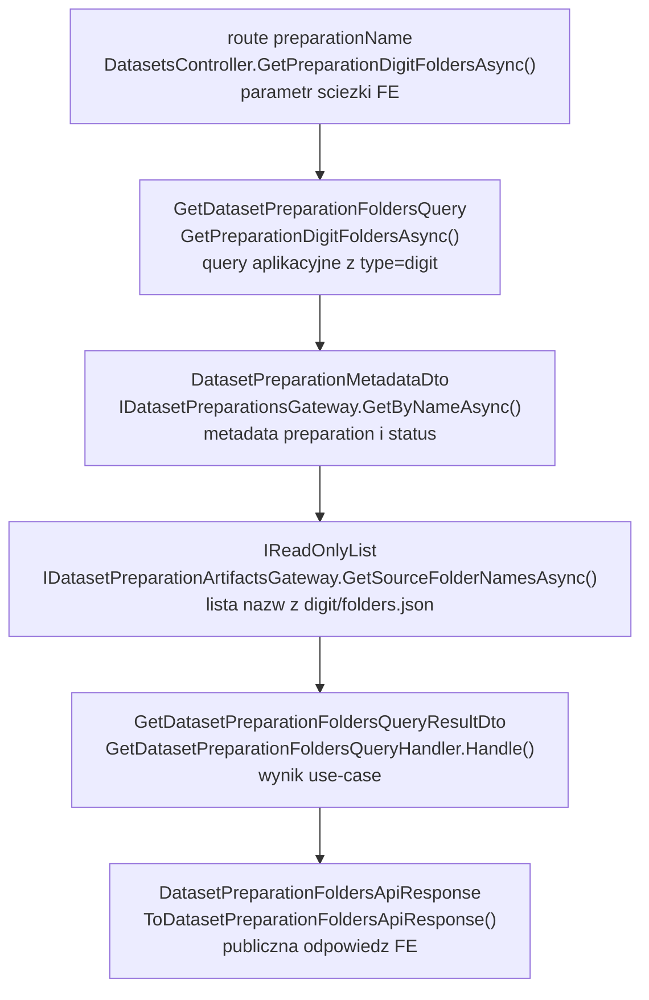
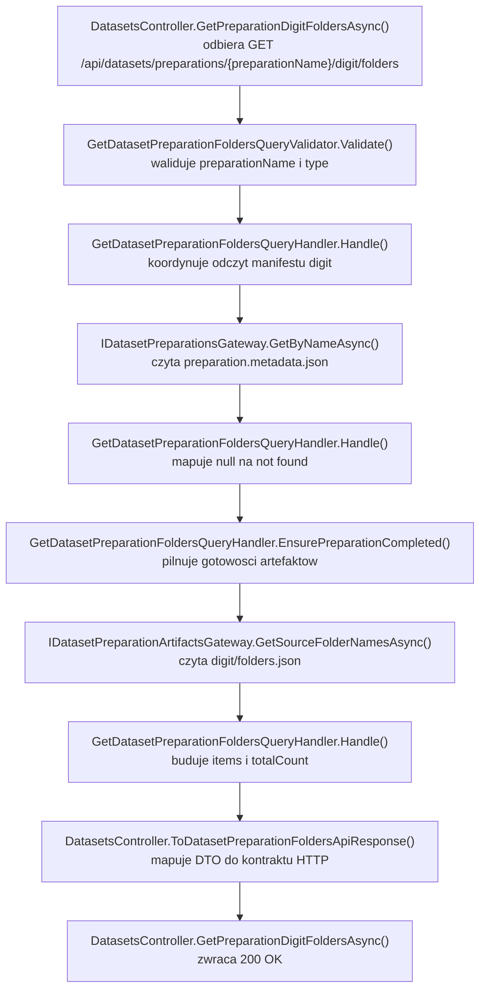

# UC-18-BE - Plan implementacyjny dla `GET /api/datasets/preparations/{preparationName}/digit/folders`

## 1) Przeznaczenie endpointa
- Endpoint `GET /api/datasets/preparations/{preparationName}/digit/folders` zwraca listę nazw źródeł typu `digit` dla wybranego preparation.
- Jest to pomocniczy endpoint przeglądowy w `UC-18`:
  - użytkownik wybiera preparation,
  - `FE` pobiera listę folderów źródłowych `digit`,
  - `FE` pokazuje tę listę jako logiczne źródła danych,
  - endpoint nie służy do podglądu pojedynczych próbek cyfr i nie usuwa danych.
- Endpoint jest `read-only`:
  - nie uruchamia preprocessingu,
  - nie wywołuje `ML`,
  - nie przebudowuje manifestów,
  - nie skanuje katalogów heurystycznie.
- Publiczne API pozostaje po stronie `BE`, a źródłem danych dla odpowiedzi jest manifest:
  - `{PreparationsDirectoryPath}/{preparationName}/digit/folders.json`

## 2) Zakres i główne założenia
- Plan dotyczy wyłącznie części `BE` w `src/Backend/Sudoku`.
- Nie sugerujemy się aktualnym stanem `FE` i nie projektujemy niczego pod obecną implementację `ML`, poza obowiązującym kontraktem workflow oraz artefaktami już ustalonymi dla `UC-17` i `UC-18`.
- Trzymamy architekturę:
  - `Api` cienkie,
  - `Application` zawiera logikę use-case,
  - `Infrastructure` realizuje I/O i szczegóły storage,
  - `Models` pozostaje warstwą modeli domenowych i statusów.
- Nie zmieniamy istniejących nazw klas i pól, które już zostały dodane przez wcześniejsze historyjki.
- Plan ma kontynuować istniejący kontrakt backendu, a nie tworzyć równoległego wariantu tylko dla `digit`.

## 3) Kontekst historyjki i zależności

### 3.1 Miejsce w workflow
- `UC-17` tworzy preparation i jego metadata.
- `UC-18` pozwala przeglądać przygotowane artefakty i czyścić dane.
- Dla `digit` w `UC-18` zakres jest węższy niż dla `board`:
  - pokazujemy listę logicznych folderów źródłowych,
  - nie budujemy osobnego ekranu podglądu plików,
  - nie usuwamy pojedynczych elementów `digit`.

### 3.2 Historyjki, od których ten endpoint zależy
- `UC-13`
  - autoryzacja administratora dla endpointów administracyjnych.
- `UC-17 - GET /api/datasets/preparations`
  - wybór preparation przez użytkownika.
- `UC-17 - GET /api/datasets/preparations/{preparationName}`
  - odczyt statusu preparation.
- `UC-17 - POST /api/datasets/preparations`
  - powstanie metadata i artefaktów runtime.
- `UC-18 - GET /api/datasets/preparations/{preparationName}/board/folders`
  - już wdrożony wzorzec techniczny dla analogicznego use-case'a.
- `UC-19`
  - później będzie reuse'ować listę źródeł `digit` przy dalszych operacjach na przygotowaniach.

### 3.3 Ważny wniosek projektowy
- Dla `digit/folders` nie projektujemy nowego stosu aplikacyjnego.
- Obecny backend ma już generyczne wsparcie dla typu `board` i `digit` w warstwie `Application` oraz `Infrastructure`.
- Brakująca część to głównie ekspozycja nowej trasy HTTP w `Api` oraz domknięcie testów kontrolera dla wariantu `digit`.

## 4) Co już istnieje i czego należy użyć

### 4.1 Istniejące elementy do bezpośredniego reuse
- `Sudoku/Controllers/DatasetsController.cs`
  - ma już akcję dla `GET /api/datasets/preparations/{preparationName}/board/folders`,
  - należy wykorzystać ją jako referencyjny wzorzec dla `digit/folders`.
- `Application/Datasets/GetDatasetPreparationFoldersQuery.cs`
  - wspólny query model dla `board` i `digit`.
- `Application/Datasets/GetDatasetPreparationFoldersQueryValidator.cs`
  - już waliduje `type` do wartości `board` albo `digit`.
- `Application/Datasets/GetDatasetPreparationFoldersQueryHandler.cs`
  - już obsługuje oba typy.
- `Application/Datasets/GetDatasetPreparationFoldersQueryResultDto.cs`
  - wspólny wynik use-case'a.
- `Application/Datasets/GetDatasetPreparationFoldersErrorTypes.cs`
  - wspólne typy błędów dla `folders`.
- `Application/Datasets/DatasetPreparationArtifactsNotReadyException.cs`
  - semantyka `409`.
- `Application/Datasets/DatasetPreparationNotFoundException.cs`
  - semantyka `404`.
- `Application/Datasets/DatasetPreparationNameValidationRules.cs`
  - wspólna walidacja `preparationName`.
- `Application/Abstractions/IDatasetPreparationsGateway.cs`
  - odczyt metadata preparation.
- `Application/Abstractions/IDatasetPreparationArtifactsGateway.cs`
  - port do odczytu manifestów artefaktów preparation.
- `Infrastructure/Storage/DatasetPreparationsGateway.cs`
  - odczyt `preparation.metadata.json`.
- `Infrastructure/Storage/DatasetPreparationArtifactsGateway.cs`
  - odczyt `board/folders.json` i `digit/folders.json`.
- `Sudoku/Contracts/DatasetPreparationFoldersApiResponse.cs`
  - wspólny kontrakt publicznej odpowiedzi.
- `Sudoku/Contracts/ErrorApiResponse.cs`
  - wspólny kontrakt błędu.
- `Models/Datasets/DatasetPreparationStatus.cs`
  - źródło nazw statusów preparation.

### 4.2 Ważny stan obecny
- W warstwie `Application` i `Infrastructure` logika dla `digit` już istnieje.
- `DatasetPreparationArtifactsGateway` mapuje:
  - `board -> board`
  - `digit -> digit`
- `GetDatasetPreparationFoldersQueryValidator` akceptuje `digit`.
- To oznacza, że ten plan nie powinien proponować nowych query, handlerów, gatewayów ani DTO tylko dlatego, że endpoint dotyczy `digit`.

### 4.3 Czego nie należy tworzyć
- Nie tworzyć osobnego:
  - `GetDatasetPreparationDigitFoldersQuery`
  - `GetDatasetPreparationDigitFoldersQueryHandler`
  - `GetDatasetPreparationDigitFoldersApiResponse`
  - `IDatasetPreparationDigitArtifactsGateway`
- Nie rozszerzać `IDatasetPreparationsGateway` o manifesty `folders.json`.
- Nie budować nowej komunikacji `BE -> ML`.

## 5) Kontrakty API i modele komunikacji

### 5.1 FE -> BE
- Metoda i ścieżka:
  - `GET /api/datasets/preparations/{preparationName}/digit/folders`
- Route params:
  - `preparationName: string`
- Query string:
  - brak
- Request body:
  - brak
- Autoryzacja:
  - taka sama jak dla innych endpointów administracyjnych z `UC-13`

### 5.2 BE -> FE
- `200 OK` -> `DatasetPreparationFoldersApiResponse`
- `400 Bad Request` -> `ErrorApiResponse`
- `401 Unauthorized` -> `ErrorApiResponse`
- `404 Not Found` -> `ErrorApiResponse`
- `409 Conflict` -> `ErrorApiResponse`
- `500 Internal Server Error` -> `ErrorApiResponse`

### 5.3 Model odpowiedzi HTTP
`DatasetPreparationFoldersApiResponse`
- `preparationName: string`
- `type: string`
- `items: string[]`
- `totalCount: number`

Przykład `200 OK`:

```json
{
  "preparationName": "preparation-001",
  "type": "digit",
  "items": [
    "mnist_train",
    "mnist_test"
  ],
  "totalCount": 2
}
```

### 5.4 FE/ML input-output model
- `FE -> BE`
  - wejście: `preparationName` w route
  - wyjście: `DatasetPreparationFoldersApiResponse` albo `ErrorApiResponse`
- `BE -> ML`
  - brak komunikacji
- `ML -> BE`
  - brak komunikacji HTTP dla tego endpointu

### 5.5 Plikowy kontrakt wejściowy dla BE
- `BE` czyta manifest:
  - `{DatasetsPreparation.PreparationsDirectoryPath}/{preparationName}/digit/folders.json`
- Format pliku:

```json
[
  "mnist_train",
  "mnist_test"
]
```

### 5.6 Reguły kontraktowe
- `type` w odpowiedzi musi mieć wartość `"digit"`.
- `items` muszą zachować kolejność z `folders.json`.
- `BE` nie sortuje, nie filtruje i nie rekonstruuje listy na podstawie skanu filesystemu.
- Pusta lista w manifeście jest poprawnym przypadkiem biznesowym.

## 6) Zachowanie per warstwa

### 6.1 API
- `DatasetsController` dostaje nową akcję:
  - `[HttpGet("preparations/{preparationName}/digit/folders")]`
- Akcja:
  - binduje `preparationName`,
  - ustawia `const string type = "digit"`,
  - wysyła `GetDatasetPreparationFoldersQuery(preparationName, type)`,
  - mapuje wynik do `DatasetPreparationFoldersApiResponse`,
  - mapuje wyjątki na odpowiednie statusy HTTP.
- `Api` nie:
  - czyta plików,
  - nie deserializuje JSON,
  - nie decyduje o gotowości preparation,
  - nie skanuje katalogów,
  - nie odpytuje `ML`.

### 6.2 Application
- `GetDatasetPreparationFoldersQueryHandler`:
  - waliduje, że query dotarło po `ValidationBehavior`,
  - odczytuje metadata preparation,
  - rzuca `404`, jeśli preparation nie istnieje,
  - sprawdza, czy status preparation to `completed`,
  - rzuca `409`, jeśli preparation nie jest gotowe,
  - zleca odczyt manifestu gatewayowi artefaktów,
  - buduje wynik DTO.
- `Application` jest właścicielem logiki:
  - czy preparation można już czytać,
  - jaki wyjątek semantyczny zwrócić,
  - jaki ma być wynik use-case'a.
- `Application` nie wykonuje:
  - niskopoziomowego I/O,
  - operacji `File.*`, `Directory.*`,
  - deserializacji plików JSON bezpośrednio.

### 6.3 Domain / Models
- Dla tego endpointu nie ma potrzeby dodawania nowego modelu domenowego.
- Reuse'owany jest status z:
  - `Models/Datasets/DatasetPreparationStatus.cs`
- `digit/folders` nie wprowadza nowego bytu domenowego, tylko read-only use-case nad istniejącym preparation.

### 6.4 Infrastructure
- `DatasetPreparationArtifactsGateway`:
  - buduje ścieżkę do `digit/folders.json`,
  - czyta plik przez `IFileStorageGateway`,
  - deserializuje `string[]`,
  - pilnuje, aby wynik nie był `null`,
  - pilnuje, aby lista nie zawierała pustych wpisów.
- `Infrastructure` nie:
  - mapuje odpowiedzi HTTP,
  - nie decyduje o `404` preparation,
  - nie rozstrzyga biznesowo, czy preparation jest gotowe.

## 7) Pliki per warstwa i odpowiedzialności

### 7.1 API - pliki i odpowiedzialności

#### `src/Backend/Sudoku/Sudoku/Controllers/DatasetsController.cs`
- status: `[MODYFIKACJA WYMAGANA]`
- odpowiedzialność:
  - dodać akcję `GetPreparationDigitFoldersAsync`
  - wysłać `GetDatasetPreparationFoldersQuery(preparationName, "digit")`
  - reuse'ować:
    - `ToDatasetPreparationFoldersApiResponse(...)`
    - `MapDatasetPreparationFoldersValidationError(...)`
  - mapować:
    - `ValidationException -> 400`
    - `DatasetPreparationNotFoundException -> 404`
    - `DatasetPreparationArtifactsNotReadyException -> 409`
    - `IOException | UnauthorizedAccessException | InvalidDataException | JsonException | FileStorageItemNotFoundException -> 500`

#### `src/Backend/Sudoku/Sudoku/Contracts/DatasetPreparationFoldersApiResponse.cs`
- status: `[REUSE - BEZ ZMIAN]`
- odpowiedzialność:
  - wspólny response model dla `board/folders` i `digit/folders`

#### `src/Backend/Sudoku/Sudoku/Contracts/ErrorApiResponse.cs`
- status: `[REUSE - BEZ ZMIAN]`
- odpowiedzialność:
  - wspólny kontrakt błędów HTTP

### 7.2 Application - pliki i odpowiedzialności

#### `src/Backend/Sudoku/Application/Datasets/GetDatasetPreparationFoldersQuery.cs`
- status: `[REUSE - BEZ ZMIAN]`
- odpowiedzialność:
  - wspólny query model z polami `PreparationName` i `Type`

#### `src/Backend/Sudoku/Application/Datasets/GetDatasetPreparationFoldersQueryValidator.cs`
- status: `[REUSE - BEZ ZMIAN]`
- odpowiedzialność:
  - walidacja `preparationName`
  - walidacja `type` do `board` albo `digit`

#### `src/Backend/Sudoku/Application/Datasets/GetDatasetPreparationFoldersQueryHandler.cs`
- status: `[REUSE - BEZ ZMIAN]`
- odpowiedzialność:
  - logika read-only dla obu typów
  - sprawdzenie istnienia preparation
  - sprawdzenie statusu `completed`
  - pobranie folderów z portu artefaktów

#### `src/Backend/Sudoku/Application/Datasets/GetDatasetPreparationFoldersQueryResultDto.cs`
- status: `[REUSE - BEZ ZMIAN]`
- odpowiedzialność:
  - DTO wyniku use-case'a

#### `src/Backend/Sudoku/Application/Datasets/GetDatasetPreparationFoldersErrorTypes.cs`
- status: `[REUSE - BEZ ZMIAN]`
- odpowiedzialność:
  - spójne `errorType` dla wariantu `board` i `digit`

#### `src/Backend/Sudoku/Application/Datasets/DatasetPreparationArtifactsNotReadyException.cs`
- status: `[REUSE - BEZ ZMIAN]`
- odpowiedzialność:
  - semantyka `409`, gdy status preparation nie pozwala czytać artefaktów

#### `src/Backend/Sudoku/Application/Datasets/DatasetPreparationNotFoundException.cs`
- status: `[REUSE - BEZ ZMIAN]`
- odpowiedzialność:
  - semantyka `404`

#### `src/Backend/Sudoku/Application/Datasets/DatasetPreparationNameValidationRules.cs`
- status: `[REUSE - BEZ ZMIAN]`
- odpowiedzialność:
  - wspólna walidacja nazwy preparation

#### `src/Backend/Sudoku/Application/Abstractions/IDatasetPreparationsGateway.cs`
- status: `[REUSE - BEZ ZMIAN]`
- odpowiedzialność:
  - odczyt metadata preparation

#### `src/Backend/Sudoku/Application/Abstractions/IDatasetPreparationArtifactsGateway.cs`
- status: `[REUSE - BEZ ZMIAN]`
- odpowiedzialność:
  - port do odczytu artefaktów preparation
  - metoda:
    - `GetSourceFolderNamesAsync(string preparationName, string sourceType, CancellationToken cancellationToken = default)`

#### `src/Backend/Sudoku/Application/Datasets/DatasetsPreparationOptions.cs`
- status: `[REUSE - BEZ ZMIAN]`
- odpowiedzialność:
  - typed options dla ścieżek i ustawień workflow

### 7.3 Models - pliki i odpowiedzialności

#### `src/Backend/Sudoku/Models/Datasets/DatasetPreparationStatus.cs`
- status: `[REUSE - BEZ ZMIAN]`
- odpowiedzialność:
  - stałe statusów preparation
  - kontrola semantyki `completed` versus stany niegotowe

### 7.4 Infrastructure - pliki i odpowiedzialności

#### `src/Backend/Sudoku/Infrastructure/Storage/DatasetPreparationArtifactsGateway.cs`
- status: `[REUSE - BEZ ZMIAN]`
- odpowiedzialność:
  - odczyt manifestu `digit/folders.json`
  - mapowanie `sourceType` na katalog
  - deserializacja `string[]`
  - wykrywanie pustych wpisów

#### `src/Backend/Sudoku/Infrastructure/Storage/DatasetPreparationsGateway.cs`
- status: `[REUSE - BEZ ZMIAN]`
- odpowiedzialność:
  - odczyt `preparation.metadata.json`
  - źródło danych do sprawdzenia istnienia i statusu preparation

#### `src/Backend/Sudoku/Infrastructure/Storage/LocalFileStorageGateway.cs`
- status: `[REUSE - BEZ ZMIAN]`
- odpowiedzialność:
  - niskopoziomowy dostęp do plików
  - bezpieczeństwo ścieżek
  - mapowanie błędów plikowych do wyjątków storage

#### `src/Backend/Sudoku/Infrastructure/DependencyInjection.cs`
- status: `[REUSE - BEZ ZMIAN]`
- odpowiedzialność:
  - rejestracja gatewayów
  - tu nic nowego nie trzeba dopinać, bo `IDatasetPreparationArtifactsGateway` już jest zarejestrowany

### 7.5 Testy - pliki i odpowiedzialności

#### `src/Backend/Sudoku/Application.Tests/DatasetsControllerTests.cs`
- status: `[MODYFIKACJA WYMAGANA]`
- odpowiedzialność:
  - dodać testy nowej akcji HTTP dla `digit/folders`

#### `src/Backend/Sudoku/Application.Tests/GetDatasetPreparationFoldersQueryValidatorTests.cs`
- status: `[REUSE - OPCJONALNIE BEZ ZMIAN]`
- odpowiedzialność:
  - już pokrywa akceptację typu `digit`

#### `src/Backend/Sudoku/Application.Tests/GetDatasetPreparationFoldersQueryHandlerTests.cs`
- status: `[REUSE - OPCJONALNIE MAŁE UZUPEŁNIENIE]`
- odpowiedzialność:
  - obecnie potwierdza flow dla `board`
  - można dodać jeden test dowodzący, że handler przekazuje `type = "digit"` do gatewaya artefaktów, ale nie jest to konieczne do uruchomienia endpointa

## 8) Minimalny zakres zmian implementacyjnych

### 8.1 Zmiany obowiązkowe
1. Dodać akcję `GetPreparationDigitFoldersAsync(...)` w `DatasetsController`.
2. Dodać testy kontrolera dla tej akcji.

### 8.2 Zmiany opcjonalne, ale zalecane
1. Dodać pojedynczy test handlera z `type = "digit"`.
2. Dodać logi analogiczne do `board/folders`, żeby operacyjnie obie trasy zachowywały się spójnie.

### 8.3 Czego nie ruszać
- Nie zmieniać query, handlera, validatora, DTO i gatewaya tylko po to, żeby endpoint nazywał się `digit`.
- Nie zmieniać kontraktu `DatasetPreparationFoldersApiResponse`.
- Nie zmieniać workflow CI/CD, jeśli nowe zmiany nie wnoszą nowych ustawień.

## 9) Przepływ w obrębie backendu
1. `FE` wywołuje `GET /api/datasets/preparations/{preparationName}/digit/folders`.
2. Warstwa autoryzacji z `UC-13` przepuszcza tylko poprawnie uwierzytelnionego admina.
3. `DatasetsController.GetPreparationDigitFoldersAsync(...)` binduje `preparationName`.
4. Kontroler tworzy `GetDatasetPreparationFoldersQuery(preparationName, "digit")`.
5. `ValidationBehavior` uruchamia `GetDatasetPreparationFoldersQueryValidator`.
6. `GetDatasetPreparationFoldersQueryHandler.Handle(...)` pobiera metadata przez `IDatasetPreparationsGateway.GetByNameAsync(...)`.
7. Jeśli metadata nie istnieją:
  - handler rzuca `DatasetPreparationNotFoundException`.
8. Jeśli preparation istnieje, ale status nie jest `completed`:
  - handler rzuca `DatasetPreparationArtifactsNotReadyException`.
9. Jeśli preparation jest gotowe:
  - handler wywołuje `IDatasetPreparationArtifactsGateway.GetSourceFolderNamesAsync(preparationName, "digit")`.
10. `DatasetPreparationArtifactsGateway` czyta:
  - `{PreparationsDirectoryPath}/{preparationName}/digit/folders.json`
11. Handler buduje `GetDatasetPreparationFoldersQueryResultDto`.
12. Kontroler mapuje wynik do `DatasetPreparationFoldersApiResponse`.
13. API zwraca `200 OK`.

## 10) Główne funkcje
- `[NOWA]` `DatasetsController.GetPreparationDigitFoldersAsync(...)`
- `[REUSE]` `DatasetsController.ToDatasetPreparationFoldersApiResponse(...)`
- `[REUSE]` `DatasetsController.MapDatasetPreparationFoldersValidationError(...)`
- `[REUSE]` `GetDatasetPreparationFoldersQueryHandler.Handle(...)`
- `[REUSE]` `GetDatasetPreparationFoldersQueryValidator.Validate(...)`
- `[REUSE]` `IDatasetPreparationsGateway.GetByNameAsync(...)`
- `[REUSE]` `IDatasetPreparationArtifactsGateway.GetSourceFolderNamesAsync(...)`
- `[REUSE]` `DatasetPreparationArtifactsGateway.GetSourceFolderNamesAsync(...)`
- `[REUSE]` `DatasetPreparationArtifactsGateway.BuildSourceDirectoryPath(...)`
- `[REUSE]` `DatasetPreparationArtifactsGateway.MapSourceTypeDirectoryName(...)`

## 11) Wyjątki, fallbacki i zachowanie błędowe

### 11.1 Publiczne statusy HTTP
- `200 OK`
  - preparation istnieje,
  - status to `completed`,
  - manifest `digit/folders.json` jest poprawny
- `400 Bad Request`
  - `preparationName` jest puste
  - `preparationName` zawiera niedozwolone znaki
- `401 Unauthorized`
  - brak poprawnej autoryzacji admina
- `404 Not Found`
  - preparation nie istnieje
- `409 Conflict`
  - preparation istnieje, ale nie jest gotowe do odczytu artefaktów
- `500 Internal Server Error`
  - błąd I/O
  - brak dostępu do storage
  - brak manifestu dla `completed`
  - uszkodzony JSON
  - manifest zawiera puste wpisy

### 11.2 `errorType`
- `invalid_dataset_preparation_name`
- `dataset_preparation_not_found`
- `dataset_preparation_artifacts_not_ready`
- `dataset_preparation_folders_read_failed`

### 11.3 Fallbacki dozwolone
- Jeśli `folders.json` zawiera pustą listę:
  - zwrócić `200 OK`
  - `items: []`
  - `totalCount: 0`

### 11.4 Fallbacki niedozwolone
- Nie skanować katalogu `digit/` jako zastępstwa za brak manifestu.
- Nie zgadywać listy na podstawie `metadata.Sources`.
- Nie odpytywać `ML`, czy preparation jest gotowe.
- Nie zwracać `200 []`, gdy status to `queued`, `running` albo `failed`.
- Nie zamieniać błędu uszkodzonego/brakującego manifestu na `404`, jeśli samo preparation istnieje.

### 11.5 Sytuacje graniczne
- preparation istnieje, status `running`
  - `409`
- preparation istnieje, status `failed`
  - `409`
- preparation istnieje, status `completed`, ale `digit/folders.json` nie istnieje
  - `500`
- preparation istnieje, status `completed`, ale JSON jest uszkodzony
  - `500`
- preparation istnieje, status `completed`, a lista `digit` jest pusta
  - `200`

## 12) Specyficzna logika i pseudokod

### 12.1 Pseudokod akcji kontrolera

```text
getPreparationDigitFolders(preparationName):
  type = "digit"

  log information start(preparationName, type)

  try:
    result = sender.send(GetDatasetPreparationFoldersQuery(preparationName, type))
    response = mapToApiResponse(result)
    log information success(preparationName, type, totalCount)
    return 200 response
  catch validation:
    return 400 error
  catch preparation_not_found:
    return 404 error
  catch artifacts_not_ready:
    return 409 error
  catch io/json/storage:
    return 500 error
```

### 12.2 Pseudokod handlera

```text
handleGetDatasetPreparationFolders(query):
  validate(query.preparationName, query.type)

  metadata = datasetPreparationsGateway.getByName(query.preparationName)
  if metadata is null:
    throw dataset_preparation_not_found

  if metadata.status != "completed":
    throw dataset_preparation_artifacts_not_ready

  items = datasetPreparationArtifactsGateway.getSourceFolderNames(
    query.preparationName,
    query.type
  )

  return {
    preparationName: metadata.preparationName,
    type: query.type,
    items: items,
    totalCount: items.length
  }
```

### 12.3 Pseudokod gatewaya artefaktów

```text
getSourceFolderNames(preparationName, sourceType):
  directoryPath = combine(preparationsDirectoryPath, preparationName, mapSourceTypeDirectoryName(sourceType))
  stream = fileStorageGateway.openRead(directoryPath, "folders.json")
  items = deserialize string[] from stream

  if items is null:
    throw invalid_data

  if any item is null/empty/whitespace:
    throw invalid_data

  return items
```

### 12.4 Wyjątkowa logika do uwzględnienia
- Readiness opieramy na `metadata.Status`, a nie na samym istnieniu pliku.
- Lista `digit` pochodzi wyłącznie z `digit/folders.json`.
- `digit/folders` nie powinno stać się boczną drogą do skanowania filesystemu.
- To, że w `UC-18` dla `digit` nie ma osobnego podglądu plików, nie zmienia faktu, że endpoint musi być spójny kontraktowo i operacyjnie z `board/folders`.

## 13) Mermaid flowchart - flow modeli



## 14) Mermaid flowchart - logika aplikacji z funkcjami



## 15) Logging

### 15.1 Information
- log start:
  - `preparationName`
  - `type`
- log success:
  - `preparationName`
  - `type`
  - `totalCount`

### 15.2 Warning
- preparation nie istnieje
- preparation istnieje, ale nie jest gotowe do odczytu artefaktów

### 15.3 Error
- błąd odczytu `digit/folders.json`
- błąd deserializacji manifestu
- brak manifestu dla preparation `completed`

### 15.4 Guardraile logowania
- nie logować całej zawartości `items`
- nie logować pełnych ścieżek systemowych w odpowiedziach HTTP
- nie logować każdego wpisu z listy osobno
- zachować lekki poziom logów analogiczny do `board/folders`

## 16) Workflow GitHub i konfiguracja runtime

### 16.1 Czy endpoint wymaga nowych ustawień
- Nie.
- Endpoint nie potrzebuje:
  - nowych sekretów,
  - nowych zmiennych środowiskowych,
  - nowych opcji `appsettings`,
  - nowego workflow deployowego.

### 16.2 Co już musi istnieć
- Lokalnie:
  - `appsettings.local.json` powinien mieć na sztywno ustawione `DatasetsPreparation.PreparationsDirectoryPath`.
- Produkcyjnie:
  - `backend-cd.yml` powinien podstawiać `BE_DATASETS_PREP_PREPARATIONS_DIRECTORY_PATH` do `DatasetsPreparation.PreparationsDirectoryPath`.

### 16.3 Stan obecny workflow
- `backend-cd.yml` już:
  - waliduje `BE_DATASETS_PREP_PREPARATIONS_DIRECTORY_PATH`
  - wpisuje tę wartość do `appsettings.production.json`
- W tym use-case nie trzeba dopisywać nowych kroków workflow.
- W planie implementacji warto jedynie odnotować, że ten endpoint zależy operacyjnie od poprawnie ustawionej ścieżki preparation storage.

### 16.4 Reguła operacyjna
- Workflow może modyfikować `appsettings.production.json`.
- Lokalnie ścieżki pozostają wpisane na sztywno.
- Deploy nie może nadpisywać katalogu `shared/data`, bo tam znajdują się artefakty runtime preparation.

## 17) Inne istotne reguły
- Endpoint ma pozostać kompatybilny z istniejącym kontraktem `DatasetPreparationFoldersApiResponse`.
- `type = "digit"` jest częścią publicznego kontraktu odpowiedzi i nie może zostać pominięte.
- Nie dokładamy nowych pól typu `status`, `warnings`, `sourceCount`.
- `items` reprezentują logiczne źródła `digit`, a nie listę plików lub pojedynczych próbek.
- Zachowanie powinno być symetryczne operacyjnie względem `board/folders`, ale bez dokładania logiki preview.

## 18) Kolejność implementacji kodu dla historyjki
1. Dodać akcję `GetPreparationDigitFoldersAsync(...)` do `DatasetsController`.
2. Ustawić trasę:
   - `preparations/{preparationName}/digit/folders`
3. Wysłać z kontrolera:
   - `new GetDatasetPreparationFoldersQuery(preparationName, "digit")`
4. Reuse'ować istniejące mapowanie błędów i odpowiedzi.
5. Dodać test `200 OK` dla nowej akcji w `DatasetsControllerTests`.
6. Dodać test `400` dla walidacji.
7. Dodać test `404` dla braku preparation.
8. Dodać test `409` dla niegotowych artefaktów.
9. Dodać test `500` dla błędu odczytu manifestu.
10. Opcjonalnie dodać jeden test handlera potwierdzający przepływ z `type = "digit"`.
11. Wykonać manualny smoke test dla preparation `completed`, `running`, `failed`, nieistniejącego preparation oraz pustego manifestu.

## 19) Guardraile implementacyjne
- Nie tworzyć nowego query/handlera tylko dla `digit`.
- Nie przenosić logiki gotowości preparation do `Infrastructure`.
- Nie skanować katalogów jako fallback.
- Nie odpytywać `ML`.
- Nie sortować `items` po stronie `BE`.
- Nie zmieniać istniejących nazw kontraktów i pól.
- Nie mapować brakującego manifestu dla `completed` na `404`.
- Nie hardcodować ścieżek runtime w kodzie.

## 20) Plan testów minimum

### 20.1 API
- `GetPreparationDigitFoldersAsync_ReturnsOkAndMapsResponse`
- `GetPreparationDigitFoldersAsync_ReturnsBadRequest_WhenValidationFails`
- `GetPreparationDigitFoldersAsync_ReturnsNotFound_WhenPreparationDoesNotExist`
- `GetPreparationDigitFoldersAsync_ReturnsConflict_WhenArtifactsAreNotReady`
- `GetPreparationDigitFoldersAsync_ReturnsInternalServerError_WhenReadFails`

### 20.2 Application
- brak obowiązkowych nowych testów logiki, bo stos `folders` już obsługuje `digit`
- opcjonalnie:
  - test, że handler przekazuje `type = "digit"` do gatewaya artefaktów

### 20.3 Manual smoke
- `completed` z dwoma źródłami `digit` -> lista dwóch wpisów
- `completed` z pustym manifestem -> `200`, `items=[]`
- `running` -> `409`
- `failed` -> `409`
- nieistniejąca nazwa -> `404`
- uszkodzony `digit/folders.json` -> `500`

## 21) Podsumowanie decyzji architektonicznych
- Endpoint `digit/folders` jest cienkim rozszerzeniem istniejącego stosu `folders`.
- Ciężar implementacyjny leży w `Api`, nie w nowej logice `Application` czy `Infrastructure`.
- `Application` i `Infrastructure` są już zaprojektowane generycznie i należy je reuse'ować bez duplikacji.
- Źródłem prawdy dla listy `digit` jest wyłącznie `digit/folders.json`.
- Dla preparation niegotowego semantyką publiczną pozostaje `409 Conflict`.
- Dla preparation `completed` z brakującym lub uszkodzonym manifestem należy zwrócić `500`.
- Workflow GitHub nie wymaga nowej zmiany, bo potrzebne podstawienie `PreparationsDirectoryPath` jest już uwzględnione.
