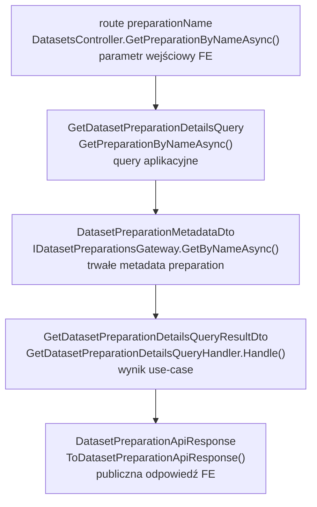
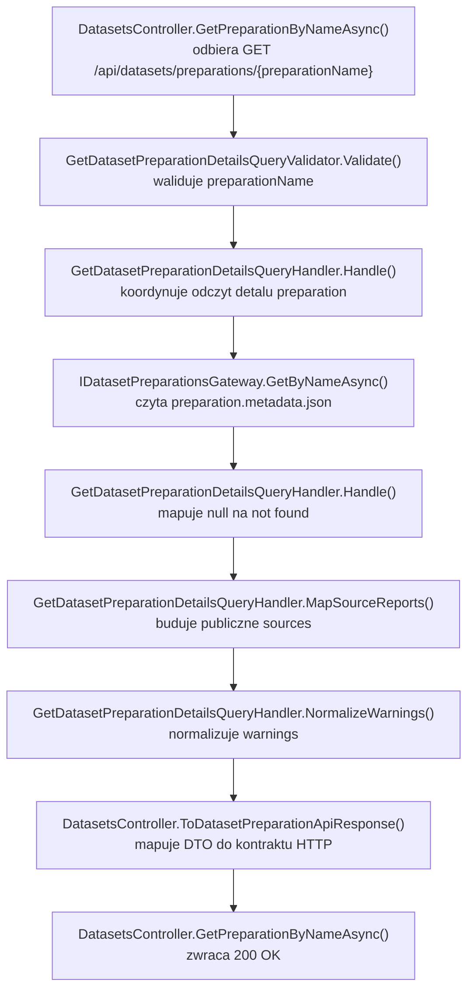

# UC-18-BE - Plan implementacyjny dla `GET /api/datasets/preparations/{preparationName}`

## 1) Przeznaczenie endpointa
- Endpoint `GET /api/datasets/preparations/{preparationName}` zwraca szczegóły jednego preparation datasetu.
- W kontekście `UC-18` jego rola jest pomocnicza, ale istotna:
  - pozwala `FE` wejść w szczegóły preparation po wyborze z listy,
  - pozwala sprawdzić status preparation przed wejściem w `board/folders`, `digit/folders`, listę plansz, podgląd obrazu i usuwanie,
  - dostarcza spójne źródło danych o `sources` i `warnings`.
- Endpoint jest `read-only`:
  - nie uruchamia preprocessingu,
  - nie odpytuje `ML`,
  - nie czyta artefaktów `board/folders.json`, `digit/folders.json`, `file.json`,
  - nie wykonuje cleanupu ani retry workflow.
- Dla `UC-18` nie projektujemy tutaj nowego rozwiązania od zera, tylko reuse endpointa bazowego z `UC-17` zgodnie z obecnymi kontraktami.

## 2) Zakres i główne założenia
- Plan dotyczy wyłącznie części `BE` w `src/Backend/Sudoku`.
- Nie sugerujemy się stanem `FE` ani bieżącą implementacją `ML`, poza wcześniej uzgodnionymi kontraktami i artefaktami workflow.
- `Backend` pozostaje `source of truth` dla publicznej odpowiedzi HTTP.
- Dane dla tego endpointa pochodzą wyłącznie z rekordu metadata preparation utrzymywanego przez `BE`.
- Należy trzymać się istniejących nazw klas, pól i kontraktów, jeśli zostały już wprowadzone w poprzednich historyjkach.
- Wniosek dla `UC-18`: ten endpoint nie powinien dostać nowego adaptera storage ani nowego kontraktu API tylko dlatego, że jest konsumowany przez kolejną historyjkę.

## 3) Stan obecny i decyzja dla UC-18

### 3.1 Co już istnieje
- Endpoint jest już obecny w backendzie.
- Istnieją już:
  - akcja kontrolera,
  - query, validator, handler i DTO,
  - kontrakt `DatasetPreparationApiResponse`,
  - gateway odczytu metadata,
  - testy kontrolera, handlera i validatora,
  - logowanie start/sukces/błędy,
  - produkcyjne podstawienie `PreparationsDirectoryPath` w workflow.

### 3.2 Decyzja implementacyjna
- Dla `UC-18` ten endpoint należy traktować jako `[REUSE - JUŻ GOTOWY]`.
- Plan dla tej historyjki powinien opisać:
  - jak z niego korzystać dalej w `UC-18`,
  - czego nie zmieniać,
  - jakie pliki są źródłem prawdy,
  - jakie ewentualne luki wolno domknąć tylko wtedy, gdy rzeczywiście wystąpią podczas wdrażania.

### 3.3 Czego nie robić
- Nie tworzyć nowego `GetDatasetPreparationForUc18Query`.
- Nie tworzyć osobnego `Infrastructure` do odczytu detalu preparation.
- Nie dociągać danych z `board/` i `digit/` do tej odpowiedzi.
- Nie rozszerzać publicznego kontraktu o pola techniczne typu:
  - `failureErrorType`,
  - `failureMessage`,
  - ścieżki systemowe,
  - statusy wyliczone heurystycznie z plików.

## 4) Kontrakty API i model komunikacji FE/ML

### 4.1 FE -> BE
- Metoda i ścieżka:
  - `GET /api/datasets/preparations/{preparationName}`
- Route param:
  - `preparationName: string`
- Request body:
  - brak
- Query string:
  - brak
- Autoryzacja:
  - taka sama jak dla innych endpointów administracyjnych z `UC-13`

### 4.2 BE -> FE
- `200 OK` -> `DatasetPreparationApiResponse`
- `400 Bad Request` -> `ErrorApiResponse`
- `401 Unauthorized` -> `ErrorApiResponse`
- `404 Not Found` -> `ErrorApiResponse`
- `500 Internal Server Error` -> `ErrorApiResponse`

### 4.3 Model odpowiedzi HTTP
`DatasetPreparationApiResponse`
- `preparationName: string`
- `createdAtUtc: string`
- `status: string`
- `sources: DatasetPreparationSourceApiResponse[]`
- `warnings: string[]`

`DatasetPreparationSourceApiResponse`
- `name: string`
- `type: string`
- `preparedItemsCount: number`

Przykład `200 OK`:

```json
{
  "preparationName": "preparation-001",
  "createdAtUtc": "2026-06-19T18:42:11Z",
  "status": "completed",
  "sources": [
    {
      "name": "v1_training",
      "type": "board",
      "preparedItemsCount": 24
    },
    {
      "name": "mnist_train",
      "type": "digit",
      "preparedItemsCount": 110
    }
  ],
  "warnings": [
    "preparation_cleanup_partial"
  ]
}
```

### 4.4 BE -> ML
- brak komunikacji dla tego endpointa

### 4.5 ML -> BE
- brak komunikacji HTTP dla tego endpointa
- jedyną pośrednią zależnością jest wcześniejsze zapisanie poprawnych metadata przez wcześniejszy workflow preparation

### 4.6 Plikowy kontrakt wejściowy dla BE
- Jedynym źródłem danych jest:
  - `{DatasetsPreparation.PreparationsDirectoryPath}/{preparationName}/preparation.metadata.json`
- Ten endpoint nie powinien czytać:
  - `board/folders.json`,
  - `digit/folders.json`,
  - `board/{sourceName}/file.json`,
  - obrazów,
  - innych artefaktów runtime.

## 5) Zachowanie per warstwa

### 5.1 API (`Sudoku`)
- `DatasetsController`:
  - binduje `preparationName`,
  - wysyła `GetDatasetPreparationDetailsQuery`,
  - mapuje wynik do `DatasetPreparationApiResponse`,
  - mapuje wyjątki na `400/404/500`.
- `Api` nie:
  - czyta storage,
  - nie deserializuje JSON,
  - nie interpretuje plików `board` i `digit`,
  - nie wywołuje `ML`.

### 5.2 Application (`Application`)
- `Application` odpowiada za:
  - walidację `preparationName`,
  - odczyt metadata przez port,
  - zamianę braku preparation na `404`,
  - mapowanie `Sources` + `SourceReports` do publicznego modelu źródeł,
  - normalizację `warnings`.
- `Application` nie:
  - wykonuje niskopoziomowego I/O,
  - nie zna szczegółów JSON parsera,
  - nie skanuje katalogów,
  - nie miesza logiki statusu z obecnością artefaktów runtime.

### 5.3 Domain / Models (`Models`)
- Warstwa `Models` dostarcza statusy preparation.
- Dla tego endpointa nie ma potrzeby dodawania nowego modelu domenowego.
- To jest odczyt rekordu systemowego i logika aplikacyjna, nie nowy byt domenowy.

### 5.4 Infrastructure (`Infrastructure`)
- `Infrastructure` odpowiada za:
  - dostęp do pliku `preparation.metadata.json`,
  - deserializację JSON do `DatasetPreparationMetadataDto`,
  - zgłoszenie błędu technicznego przy niespójnych lub uszkodzonych danych.
- `Infrastructure` nie:
  - decyduje o `404`,
  - nie mapuje odpowiedzi HTTP,
  - nie buduje `ApiResponse`,
  - nie zgaduje stanu workflow na podstawie katalogów.

## 6) Pliki per warstwa i odpowiedzialności

### 6.1 API - pliki i odpowiedzialności

#### `src/Backend/Sudoku/Sudoku/Controllers/DatasetsController.cs`
- status: `[REUSE - JUŻ ISTNIEJE]`
- odpowiedzialność:
  - akcja `GetPreparationByNameAsync(...)`
  - log start/sukces/błędy
  - wysyłka `GetDatasetPreparationDetailsQuery`
  - mapowanie do `DatasetPreparationApiResponse`
  - mapowanie `ValidationException -> 400`
  - mapowanie `DatasetPreparationNotFoundException -> 404`
  - mapowanie `IOException | UnauthorizedAccessException | InvalidDataException | JsonException -> 500`

#### `src/Backend/Sudoku/Sudoku/Contracts/DatasetPreparationApiResponse.cs`
- status: `[REUSE - JUŻ ISTNIEJE]`
- odpowiedzialność:
  - publiczny model odpowiedzi dla detalu preparation

#### `src/Backend/Sudoku/Sudoku/Contracts/DatasetPreparationSourceApiResponse.cs`
- status: `[REUSE - JUŻ ISTNIEJE]`
- odpowiedzialność:
  - publiczny model pojedynczego źródła preparation

#### `src/Backend/Sudoku/Sudoku/Contracts/ErrorApiResponse.cs`
- status: `[REUSE - JUŻ ISTNIEJE]`
- odpowiedzialność:
  - wspólny kontrakt błędów HTTP

### 6.2 Application - pliki i odpowiedzialności

#### `src/Backend/Sudoku/Application/Datasets/GetDatasetPreparationDetailsQuery.cs`
- status: `[REUSE - JUŻ ISTNIEJE]`
- odpowiedzialność:
  - query MediatR z polem `PreparationName`

#### `src/Backend/Sudoku/Application/Datasets/GetDatasetPreparationDetailsQueryValidator.cs`
- status: `[REUSE - JUŻ ISTNIEJE]`
- odpowiedzialność:
  - walidacja parametru `preparationName`
  - reuse wspólnych reguł nazwy preparation

#### `src/Backend/Sudoku/Application/Datasets/GetDatasetPreparationDetailsQueryHandler.cs`
- status: `[REUSE - JUŻ ISTNIEJE]`
- odpowiedzialność:
  - odczyt metadata po nazwie
  - mapowanie braku preparation na wyjątek semantyczny
  - mapowanie `Sources` i `SourceReports`
  - normalizacja `warnings`

#### `src/Backend/Sudoku/Application/Datasets/GetDatasetPreparationDetailsQueryResultDto.cs`
- status: `[REUSE - JUŻ ISTNIEJE]`
- odpowiedzialność:
  - wynik use-case dla warstwy API

#### `src/Backend/Sudoku/Application/Datasets/GetDatasetPreparationDetailsErrorTypes.cs`
- status: `[REUSE - JUŻ ISTNIEJE]`
- odpowiedzialność:
  - `invalid_dataset_preparation_name`
  - `dataset_preparation_not_found`
  - `dataset_preparation_read_failed`

#### `src/Backend/Sudoku/Application/Datasets/DatasetPreparationNotFoundException.cs`
- status: `[REUSE - JUŻ ISTNIEJE]`
- odpowiedzialność:
  - semantyczny wyjątek `404`

#### `src/Backend/Sudoku/Application/Datasets/DatasetPreparationNameValidationRules.cs`
- status: `[REUSE - JUŻ ISTNIEJE]`
- odpowiedzialność:
  - wspólna walidacja `preparationName`
  - guardrail anty-path-traversal i anty-invalid-filename

#### `src/Backend/Sudoku/Application/Datasets/DatasetPreparationMetadataDto.cs`
- status: `[REUSE - JUŻ ISTNIEJE]`
- odpowiedzialność:
  - wewnętrzny rekord metadata preparation
  - źródło `status`, `sources`, `warnings`, `sourceReports`

#### `src/Backend/Sudoku/Application/Datasets/DatasetPreparationSourceReportDto.cs`
- status: `[REUSE - JUŻ ISTNIEJE]`
- odpowiedzialność:
  - wewnętrzny raport per źródło
  - źródło `preparedItemsCount` do publicznej odpowiedzi

#### `src/Backend/Sudoku/Application/Datasets/CreateDatasetPreparationSourceDto.cs`
- status: `[REUSE - JUŻ ISTNIEJE]`
- odpowiedzialność:
  - źródła wybrane przy tworzeniu preparation
  - baza do deterministycznej kolejności publicznego `sources`

#### `src/Backend/Sudoku/Application/Abstractions/IDatasetPreparationsGateway.cs`
- status: `[REUSE - JUŻ ISTNIEJE]`
- odpowiedzialność:
  - port odczytu metadata preparation

### 6.3 Models - pliki i odpowiedzialności

#### `src/Backend/Sudoku/Models/Datasets/DatasetPreparationStatus.cs`
- status: `[REUSE - JUŻ ISTNIEJE]`
- odpowiedzialność:
  - kanoniczne nazwy statusów:
    - `queued`
    - `running`
    - `completed`
    - `failed`
  - pomocnicza semantyka terminalności

### 6.4 Infrastructure - pliki i odpowiedzialności

#### `src/Backend/Sudoku/Infrastructure/Storage/DatasetPreparationsGateway.cs`
- status: `[REUSE - JUŻ ISTNIEJE]`
- odpowiedzialność:
  - odczyt `preparation.metadata.json`
  - deserializacja do `DatasetPreparationMetadataDto`
  - zwrot `null`, gdy plik metadata nie istnieje
  - techniczne wykrycie niespójności nazwy w pliku

#### `src/Backend/Sudoku/Infrastructure/Storage/LocalFileStorageGateway.cs`
- status: `[REUSE - JUŻ ISTNIEJE]`
- odpowiedzialność:
  - generyczny, bezpieczny dostęp do plików
  - ochrona ścieżek i podstawowe operacje I/O

#### `src/Backend/Sudoku/Infrastructure/DependencyInjection.cs`
- status: `[REUSE - JUŻ ISTNIEJE]`
- odpowiedzialność:
  - rejestracja `IDatasetPreparationsGateway`
  - brak potrzeby dopinania nowej usługi dla tego endpointa

### 6.5 Testy - pliki i odpowiedzialności

#### `src/Backend/Sudoku/Application.Tests/GetDatasetPreparationDetailsQueryValidatorTests.cs`
- status: `[REUSE - JUŻ ISTNIEJE]`
- odpowiedzialność:
  - testy walidacji `preparationName`

#### `src/Backend/Sudoku/Application.Tests/GetDatasetPreparationDetailsQueryHandlerTests.cs`
- status: `[REUSE - JUŻ ISTNIEJE]`
- odpowiedzialność:
  - testy mapowania metadata do wyniku
  - testy braków `SourceReports`
  - testy `warnings`
  - test `404`

#### `src/Backend/Sudoku/Application.Tests/DatasetsControllerTests.cs`
- status: `[REUSE - JUŻ ISTNIEJE]`
- odpowiedzialność:
  - testy `200`, `400`, `404`, `500` dla `GetPreparationByNameAsync(...)`

### 6.6 Konfiguracja i workflow

#### `src/Backend/Sudoku/Sudoku/appsettings.local.json`
- status: `[REUSE]`
- odpowiedzialność:
  - lokalne ustawienie `DatasetsPreparation.PreparationsDirectoryPath` na sztywno

#### `src/Backend/Sudoku/Sudoku/appsettings.production.json`
- status: `[REUSE]`
- odpowiedzialność:
  - produkcyjny overlay z placeholderem dla `PreparationsDirectoryPath`

#### `.github/workflows/backend-cd.yml`
- status: `[REUSE - JUŻ DOMKNIĘTE]`
- odpowiedzialność:
  - walidacja `BE_DATASETS_PREP_PREPARATIONS_DIRECTORY_PATH`
  - podstawienie `DatasetsPreparation.PreparationsDirectoryPath` do `appsettings.production.json`

## 7) Weryfikacja antyduplikacyjna dla Infrastructure
- Najpierw należy sprawdzić, czy istnieje już usługa realizująca odczyt metadata preparation.
- W tym repo już istnieje:
  - `IDatasetPreparationsGateway`
  - `DatasetPreparationsGateway`
- Wniosek:
  - nie tworzyć nowego `PreparationDetailsGateway`,
  - nie tworzyć osobnego readera tylko dla `UC-18`,
  - nie używać `IDatasetPreparationArtifactsGateway`, bo ten endpoint nie czyta artefaktów runtime.
- To jest dokładnie przypadek, w którym nowa usługa w `Infrastructure` byłaby duplikacją i naruszałaby podział odpowiedzialności.

## 8) Przepływ w obrębie backendu
1. `FE` wywołuje `GET /api/datasets/preparations/{preparationName}`.
2. Warstwa autoryzacji z `UC-13` przepuszcza tylko poprawnie uwierzytelnionego admina.
3. `DatasetsController.GetPreparationByNameAsync(...)` binduje `preparationName`.
4. Kontroler wysyła `GetDatasetPreparationDetailsQuery(preparationName)`.
5. `ValidationBehavior` uruchamia `GetDatasetPreparationDetailsQueryValidator`.
6. `GetDatasetPreparationDetailsQueryHandler.Handle(...)` wywołuje `IDatasetPreparationsGateway.GetByNameAsync(preparationName)`.
7. Jeśli metadata nie istnieją:
  - handler rzuca `DatasetPreparationNotFoundException`.
8. Jeśli metadata istnieją:
  - handler mapuje wynik na `GetDatasetPreparationDetailsQueryResultDto`,
  - kolejność `sources` bierze z `Sources`,
  - `preparedItemsCount` dobiera z `SourceReports`,
  - `warnings` normalizuje do pustej listy, jeśli są `null`.
9. Kontroler mapuje DTO do `DatasetPreparationApiResponse`.
10. API zwraca `200 OK`.

## 9) Główne funkcje
- `DatasetsController.GetPreparationByNameAsync(...)`
- `DatasetsController.ToDatasetPreparationApiResponse(...)`
- `GetDatasetPreparationDetailsQueryValidator.Validate(...)`
- `DatasetPreparationNameValidationRules.Validate(...)`
- `GetDatasetPreparationDetailsQueryHandler.Handle(...)`
- `GetDatasetPreparationDetailsQueryHandler.MapToResultDto(...)`
- `GetDatasetPreparationDetailsQueryHandler.MapSourceReports(...)`
- `GetDatasetPreparationDetailsQueryHandler.NormalizeWarnings(...)`
- `IDatasetPreparationsGateway.GetByNameAsync(...)`
- `DatasetPreparationsGateway.GetByNameAsync(...)`

## 10) Wyjątki, fallbacki i zachowanie błędowe

### 10.1 Publiczne statusy HTTP
- `200 OK`
  - preparation istnieje
  - metadata są poprawne
  - status może być `queued`, `running`, `completed` albo `failed`
- `400 Bad Request`
  - pusty `preparationName`
  - niedozwolone znaki w `preparationName`
- `401 Unauthorized`
  - brak poprawnej autoryzacji
- `404 Not Found`
  - preparation nie istnieje
- `500 Internal Server Error`
  - błąd I/O
  - uszkodzony JSON metadata
  - niespójność nazwy preparation w pliku metadata
  - brak dostępu do storage

### 10.2 Dozwolone fallbacki
- Jeśli status to `queued`:
  - zwracamy `200`
  - bez zgadywania dalszego postępu
- Jeśli status to `running`:
  - zwracamy `200`
  - `preparedItemsCount` może być `0` dla części źródeł
- Jeśli status to `failed`:
  - zwracamy `200`
  - nie ukrywamy preparation z listy
- Jeśli `warnings` są `null`:
  - zwracamy `warnings: []`
- Jeśli dla części `Sources` nie ma pasującego `SourceReport`:
  - zwracamy dane źródła,
  - `preparedItemsCount = 0`,
  - zachowujemy kolejność z `Sources`

### 10.3 Fallbacki niedozwolone
- Nie odczytywać `board/folders.json` ani `digit/folders.json`, aby "uzupełnić" odpowiedź.
- Nie liczyć `preparedItemsCount` przez skan katalogów.
- Nie zmieniać `status` na podstawie artefaktów runtime.
- Nie odpytywać `ML`, by potwierdzić realny stan preparation.
- Nie eksponować pól technicznych metadata, jeśli nie są częścią publicznego kontraktu.

### 10.4 Rekomendowane `errorType`
- `invalid_dataset_preparation_name`
- `dataset_preparation_not_found`
- `dataset_preparation_read_failed`

### 10.5 Sytuacje graniczne
- istnieje katalog preparation, ale brak `preparation.metadata.json`
  - publicznie traktować jako `404`
- metadata istnieją, ale `PreparationName` w pliku różni się od route
  - `500`
- `SourceReports` są w innej kolejności niż `Sources`
  - odpowiedź nadal ma zachować kolejność `Sources`
- preparation ma status `failed` i warnings
  - poprawny `200`, bez zmiany kontraktu

## 11) Specyficzna logika i pseudokod

### 11.1 Pseudokod handlera

```text
handleGetDatasetPreparationDetails(query):
  validate(query.preparationName)

  metadata = datasetPreparationsGateway.getByName(query.preparationName)
  if metadata is null:
    throw dataset_preparation_not_found

  sources = mapSources(metadata.sources, metadata.sourceReports)
  warnings = normalizeWarnings(metadata.warnings)

  return {
    preparationName: metadata.preparationName,
    createdAtUtc: metadata.createdAtUtc,
    status: metadata.status,
    sources: sources,
    warnings: warnings
  }
```

### 11.2 Pseudokod mapowania źródeł

```text
mapSources(selectedSources, sourceReports):
  reportsByKey = sourceReports grouped by (name + "::" + type)

  return selectedSources.map(source => {
    key = source.name + "::" + source.type
    report = reportsByKey[key]

    if report is null:
      return {
        name: source.name,
        type: source.type,
        preparedItemsCount: 0
      }

    return {
      name: source.name,
      type: source.type,
      preparedItemsCount: report.preparedItemsCount
    }
  })
```

### 11.3 Pseudokod walidacji

```text
validatePreparationName(preparationName):
  if preparationName is null or whitespace:
    invalid_dataset_preparation_name

  trimmed = trim(preparationName)

  if trimmed.length > 160:
    invalid_dataset_preparation_name

  if trimmed contains ".." or "/" or "\" or ":":
    invalid_dataset_preparation_name

  if trimmed contains control chars or invalid filename chars:
    invalid_dataset_preparation_name
```

### 11.4 Wyjątkowa logika do uwzględnienia
- Publiczne `sources` powinny być budowane na bazie `Sources`, a nie na bazie `SourceReports`.
- Dzięki temu nie tracimy źródeł w odpowiedzi, gdy raporty cząstkowe jeszcze nie istnieją albo są niepełne.
- To jest ważne szczególnie dla `UC-18`, bo użytkownik ma móc ocenić stan preparation jeszcze przed wejściem w szczegóły artefaktów.

## 12) Mermaid flowchart - flow modeli



## 13) Mermaid flowchart - logika aplikacji z funkcjami



## 14) Logging

### 14.1 `Information`
- start odczytu:
  - `preparationName`
- sukces odczytu:
  - `preparationName`
  - `status`

### 14.2 `Warning`
- preparation nie istnieje
- opcjonalnie:
  - preparation ma status `failed`, jeśli zespół chce lekki sygnał operacyjny

### 14.3 `Error`
- błąd odczytu metadata
- błąd deserializacji metadata
- niespójność nazwy preparation w pliku metadata

### 14.4 Guardraile logowania
- nie logować całego `preparation.metadata.json`
- nie logować pełnych ścieżek systemowych w odpowiedzi HTTP
- nie logować całych tablic `warnings` i `sources` przy każdym poprawnym `GET`
- logi mają być lekkie i użyteczne diagnostycznie

## 15) Workflow GitHub i konfiguracja runtime

### 15.1 Czy potrzebne są nowe zmiany
- Nie.
- Ten endpoint nie wymaga:
  - nowych sekretów,
  - nowych zmiennych workflow,
  - nowych opcji `appsettings`,
  - nowego deployu `ML`.

### 15.2 Co już musi istnieć
- Lokalnie:
  - `appsettings.local.json` ma mieć ustawiony na sztywno `DatasetsPreparation.PreparationsDirectoryPath`
- Produkcyjnie:
  - `backend-cd.yml` ma walidować `BE_DATASETS_PREP_PREPARATIONS_DIRECTORY_PATH`
  - workflow ma wpisać tę wartość do `appsettings.production.json`

### 15.3 Reguła operacyjna
- Workflow może modyfikować `appsettings.production.json`.
- Lokalnie ścieżki pozostają ustawione na sztywno.
- Deploy nie może nadpisywać runtime state w `shared/data`, bo tam żyją preparation i ich artefakty.

## 16) Inne istotne reguły
- `preparationName` pozostaje jedynym identyfikatorem preparation w route.
- Nie wolno zmieniać nazw pól publicznego kontraktu:
  - `preparationName`
  - `createdAtUtc`
  - `status`
  - `sources`
  - `warnings`
- Nie ujawniać technicznych pól metadata bez osobnej decyzji kontraktowej.
- Endpoint ma działać poprawnie dla wszystkich statusów preparation, nie tylko dla `completed`.
- Ten endpoint ma opisywać preparation, a nie gotowość konkretnych artefaktów `UC-18`.

## 17) Kolejność implementacji kodu dla historyjki
1. Zweryfikować, że `UC-17` endpoint istnieje i jest zgodny z kontraktem wymaganym przez `UC-18`.
2. Zweryfikować, że źródłem danych jest wyłącznie `preparation.metadata.json`.
3. Zweryfikować, że kontroler nie czyta artefaktów runtime `board` i `digit`.
4. Zweryfikować, że `GetDatasetPreparationDetailsQueryValidator` reuse'uje `DatasetPreparationNameValidationRules`.
5. Zweryfikować, że handler mapuje `Sources` i `SourceReports` deterministycznie.
6. Zweryfikować, że `warnings` są normalizowane do `[]`.
7. Zweryfikować mapowanie wyjątków na `400/404/500`.
8. Zweryfikować testy validatora, handlera i kontrolera.
9. Jeśli którykolwiek z powyższych punktów ma lukę, uzupełnić ją bez zmiany kontraktu publicznego.
10. Wykonać manualny smoke dla statusów `queued`, `running`, `completed`, `failed` oraz scenariusza `404`.

## 18) Guardraile implementacyjne
- Nie tworzyć nowego adaptera `Infrastructure`.
- Nie używać `IDatasetPreparationArtifactsGateway` w tym endpointcie.
- Nie odpytywać `ML`.
- Nie skanować katalogów jako fallback.
- Nie liczyć `preparedItemsCount` z filesystemu.
- Nie rozszerzać publicznego kontraktu bez osobnej decyzji.
- Nie hardcodować ścieżek lokalnych ani produkcyjnych w kodzie.
- Nie przenosić logiki aplikacyjnej do `Infrastructure`.
- Nie zmieniać istniejących nazw klas i pól, które są już używane przez wcześniejsze historyjki.

## 19) Zależności pomiędzy historyjkami
- `UC-13`
  - dostarcza autoryzację admina
- `UC-17 POST /api/datasets/preparations`
  - tworzy rekord preparation i metadata, które ten endpoint odczytuje
- `UC-17 GET /api/datasets/preparations`
  - daje listę, z której użytkownik wybiera `preparationName`
- `UC-18`
  - konsumuje ten endpoint jako ekran szczegółów i oceny stanu preparation przed dalszym przeglądaniem
- `UC-19`
  - reuse'uje ten sam detail endpoint do oceny gotowości preparation przed budową finalnego `.npz`

## 20) Plan testów minimum

### 20.1 Validator
- pusty `preparationName` -> `400`
- `preparationName` z niedozwolonymi znakami -> `400`
- poprawny `preparationName` -> walidacja przechodzi

### 20.2 Handler
- metadata istnieją -> poprawne mapowanie odpowiedzi
- brak `SourceReport` dla jednego ze źródeł -> `preparedItemsCount = 0`
- `warnings = null` -> `warnings = []`
- brak preparation -> `DatasetPreparationNotFoundException`

### 20.3 API
- `200 OK`
- `400 Bad Request`
- `401 Unauthorized`
- `404 Not Found`
- `500 Internal Server Error`

### 20.4 Manual smoke
- preparation `queued`
- preparation `running`
- preparation `completed`
- preparation `failed`
- nieistniejąca nazwa
- uszkodzony `preparation.metadata.json`

## 21) Podsumowanie decyzji architektonicznych
- Dla `UC-18` endpoint `GET /api/datasets/preparations/{preparationName}` jest elementem reuse z `UC-17`, a nie nową pionową implementacją.
- `Application` ma zachować pełną logikę use-case:
  - walidację,
  - mapowanie `null -> 404`,
  - składanie publicznych `sources`,
  - normalizację `warnings`.
- `Infrastructure` ma pozostać wyłącznie implementacją odczytu metadata.
- Nie trzeba dodawać nowych usług, nowych opcji konfiguracyjnych ani zmian workflow.
- Jeśli w implementacji `UC-18` pojawi się potrzeba modyfikacji tego endpointa, powinny to być tylko korekty zgodności lub testów, bez łamania wcześniejszych kontraktów.
