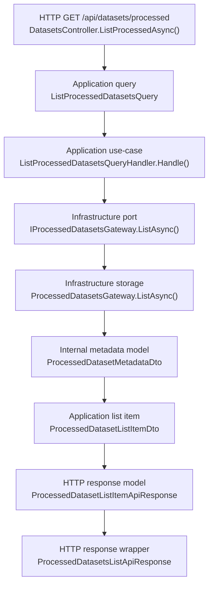
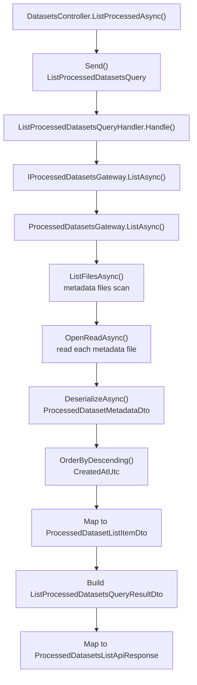

# UC-19-BE - Plan implementacyjny dla `GET /api/datasets/processed`

## 1) Przeznaczenie endpointa
- Endpoint zwraca administracyjną listę gotowych datasetów `.npz`, które powstały po `POST /api/datasets/processed`.
- W kontekście `UC-19` endpoint nie buduje datasetu, tylko udostępnia rekordy końcowych artefaktów workflow `preparation -> processed dataset`.
- Endpoint jest read-only, nie wywołuje ML i nie modyfikuje żadnego stanu runtime.
- Backend pozostaje `source of truth` dla listy, bo to on zapisuje i odczytuje metadane processed datasetów.

## 2) Status względem UC-19
- `GET /api/datasets/processed` już istnieje w backendzie.
- Dla `UC-19` nie planujemy budowy tego endpointa od zera.
- Zakres tej historyjki dla tego endpointa to:
  - potwierdzenie zgodności z nowym workflow `preparation -> npz`,
  - potwierdzenie zgodności z nowymi metadanymi zapisywanymi przez `POST /api/datasets/processed`,
  - uzupełnienie dokumentacji, wyjątków, logów i testów tam, gdzie to potrzebne.
- Nie sugerujemy się aktualnym stanem FE ani ML jako źródłem zachowania. Dla tego endpointa liczy się kontrakt BE i zapisane metadane BE.

## 3) Główne założenia i reguły
- Plan dotyczy tylko BE w `src/Backend/Sudoku`.
- Nie tworzymy nowego endpointa, nowego portu ani nowego storage gateway tylko dlatego, że zmienił się workflow `UC-19`.
- Nie dokładamy zależności `GET /api/datasets/processed` do preparation artifacts, raw datasets ani ML.
- Publiczny JSON pozostaje w `camelCase`.
- Endpoint pozostaje chroniony przez `[Authorize]` z `UC-13`.
- Lista ma dalej być kompatybilna z użyciem przez `UC-06`, gdzie wybierany jest gotowy dataset do treningu.

## 4) Co już zostało zrobione i czego należy używać

### 4.1 Elementy już gotowe
- `UC-12` dostarczył:
  - endpoint `GET /api/datasets/processed`,
  - query `ListProcessedDatasetsQuery`,
  - handler `ListProcessedDatasetsQueryHandler`,
  - gateway `IProcessedDatasetsGateway`,
  - implementację `ProcessedDatasetsGateway`,
  - kontrakty HTTP listy processed datasetów.
- `UC-19` dla `POST /api/datasets/processed` dodał już zapis `PreparationName` do `ProcessedDatasetMetadataDto`.
- `UC-06` konsumuje nazwę processed datasetu przy starcie treningu.
- `UC-13` dostarcza autoryzację administracyjną.

### 4.2 Najważniejszy wniosek
- `GET /api/datasets/processed` nie wymaga nowej logiki biznesowej pod `UC-19`.
- Wymaga jedynie upewnienia się, że:
  - odczytuje poprawnie metadane po zmianach w `POST`,
  - nie łamie wcześniejszych kontraktów,
  - ma sensowne testy i lekkie logowanie.

## 5) Model API wejściowy i wyjściowy

### 5.1 FE -> BE
- Metoda: `GET`
- Endpoint: `/api/datasets/processed`
- Body: brak
- Query params: brak
- Nagłówki:
  - standardowy token administracyjny z `UC-13`

### 5.2 BE -> FE sukces
- `200 OK`
- `ProcessedDatasetsListApiResponse`
  - `items: ProcessedDatasetListItemApiResponse[]`
  - `totalCount: number`

- `ProcessedDatasetListItemApiResponse`
  - `name`
  - `fileName`
  - `preprocessingProfile`
  - `createdAtUtc`
  - `sampleCounts`

- `SplitSampleCountsApiResponse`
  - `train`
  - `val`
  - `test`

### 5.3 BE -> FE błędy
- `401 Unauthorized`
  - brak lub niepoprawny token admina
- `500 Internal Server Error`
  - `processed_datasets_list_read_failed`

### 5.4 BE -> ML
- Brak komunikacji `BE -> ML` dla tego endpointa.
- To ważny guardrail: `GET /api/datasets/processed` nie może robić fallbacku do ML.

## 6) Zachowanie per warstwa

### API
- Kontroler:
  - przyjmuje request bez body,
  - wywołuje `ListProcessedDatasetsQuery`,
  - mapuje wynik na `ProcessedDatasetsListApiResponse`,
  - mapuje błędy techniczne odczytu na `500`.
- API nie:
  - skanuje filesystemu,
  - nie zna formatu plików metadanych,
  - nie zna logiki workflow `preparation -> npz`.

### Application
- Odpowiada za:
  - use-case listowania processed datasetów,
  - pobranie rekordów przez port,
  - sortowanie po `CreatedAtUtc` malejąco,
  - wyliczenie `TotalCount`.
- Application nie:
  - nie wykonuje I/O,
  - nie zna ścieżek serwerowych,
  - nie mapuje statusów HTTP.

### Models / Domain
- Dla tego endpointa nie ma potrzeby dodawania nowego modelu w `Models`.
- Dane przepływają przez DTO warstwy `Application`.
- To zgodne z obecną architekturą i z faktem, że endpoint jest czysto odczytowy.

### Infrastructure
- Odpowiada za:
  - odczyt plików `*.metadata.json`,
  - deserializację do `ProcessedDatasetMetadataDto`,
  - zwrot listy rekordów do `Application`.
- Infrastructure nie:
  - nie ustala kontraktu HTTP,
  - nie robi sortowania biznesowego,
  - nie decyduje o fallbackach do innych źródeł.

## 7) Pliki per warstwa i odpowiedzialności

### 7.1 Api
- `src/Backend/Sudoku/Sudoku/Controllers/DatasetsController.cs`
  - akcja `ListProcessedAsync`
  - wejście do endpointa
  - mapowanie `ListProcessedDatasetsQueryResultDto -> ProcessedDatasetsListApiResponse`
  - mapowanie wyjątków na `ErrorApiResponse`
- `src/Backend/Sudoku/Sudoku/Contracts/ProcessedDatasetsListApiResponse.cs`
  - kontrakt odpowiedzi listy
- `src/Backend/Sudoku/Sudoku/Contracts/ProcessedDatasetListItemApiResponse.cs`
  - kontrakt pojedynczego elementu listy
- `src/Backend/Sudoku/Sudoku/Contracts/SplitSampleCountsApiResponse.cs`
  - publiczny model liczności splitów
- `src/Backend/Sudoku/Sudoku/Contracts/ErrorApiResponse.cs`
  - wspólny model błędów HTTP

### 7.2 Application
- `src/Backend/Sudoku/Application/Datasets/ListProcessedDatasetsQuery.cs`
  - query MediatR bez parametrów
- `src/Backend/Sudoku/Application/Datasets/ListProcessedDatasetsQueryHandler.cs`
  - orkiestracja use-case
  - sortowanie i zliczanie
- `src/Backend/Sudoku/Application/Datasets/ListProcessedDatasetsQueryResultDto.cs`
  - wynik use-case
- `src/Backend/Sudoku/Application/Datasets/ProcessedDatasetListItemDto.cs`
  - DTO pojedynczego elementu listy
- `src/Backend/Sudoku/Application/Datasets/ProcessedDatasetMetadataDto.cs`
  - pełne metadane processed datasetu
  - zawiera już `PreparationName`, ale lista publiczna nie musi go wystawiać
- `src/Backend/Sudoku/Application/Datasets/SplitSampleCountsDto.cs`
  - DTO liczności splitów
- `src/Backend/Sudoku/Application/Datasets/ListProcessedDatasetsErrorTypes.cs`
  - stałe `errorType` dla błędów listowania
- `src/Backend/Sudoku/Application/Abstractions/IProcessedDatasetsGateway.cs`
  - port aplikacyjny do odczytu i operacji na processed datasets

### 7.3 Models
- Brak nowych plików dla `UC-19` w tej warstwie.
- Brak zmian wymaganych dla istniejących modeli domenowych.

### 7.4 Infrastructure
- `src/Backend/Sudoku/Infrastructure/Storage/ProcessedDatasetsGateway.cs`
  - odczyt listy plików metadanych
  - filtrowanie `*.metadata.json`
  - deserializacja JSON
- `src/Backend/Sudoku/Infrastructure/Storage/LocalFileStorageGateway.cs`
  - generyczne operacje filesystem
  - baza do reuse, bez dokładania nowego adaptera
- `src/Backend/Sudoku/Infrastructure/DependencyInjection.cs`
  - rejestracja `IProcessedDatasetsGateway`

### 7.5 Configuration / composition root
- `src/Backend/Sudoku/Application/Datasets/DatasetsPreparationOptions.cs`
  - typed options z `ProcessedDatasetsDirectoryPath`
- `src/Backend/Sudoku/Sudoku/appsettings.local.json`
  - lokalne, sztywne ścieżki runtime
- `src/Backend/Sudoku/Sudoku/appsettings.production.json`
  - overlay produkcyjny z placeholderami pod workflow
- `.github/workflows/backend-cd.yml`
  - podmiana `DatasetsPreparation.ProcessedDatasetsDirectoryPath` i reszty configu

### 7.6 Testy
- `src/Backend/Sudoku/Application.Tests/DatasetsControllerTests.cs`
  - istnieją testy kontrolera, ale obecnie bez pokrycia `ListProcessedAsync`
- `src/Backend/Sudoku/Application.Tests/ProcessedDatasetsGatewayTests.cs`
  - istnieje test serializacji `PreparationName`, ale brak testów `ListAsync`
- brak osobnego pliku testów dla `ListProcessedDatasetsQueryHandler`

## 8) Weryfikacja antyduplikacyjna dla Infrastructure
- Nie tworzyć nowego gatewaya do odczytu processed datasetów.
- Nie tworzyć osobnego czytnika plików metadanych tylko dla `UC-19`.
- Jeśli trzeba rozszerzyć zachowanie odczytu, rozszerzamy:
  - `IProcessedDatasetsGateway`
  - `ProcessedDatasetsGateway`
- `LocalFileStorageGateway` już jest wystarczająco generyczny i ma pozostać jedynym adapterem niskopoziomowego I/O dla tego scenariusza.

## 9) Przepływ w obrębie BE
1. FE wywołuje `GET /api/datasets/processed`.
2. `[Authorize]` przepuszcza tylko użytkownika administracyjnego.
3. `DatasetsController.ListProcessedAsync(...)` wysyła `ListProcessedDatasetsQuery`.
4. `ListProcessedDatasetsQueryHandler` wywołuje `IProcessedDatasetsGateway.ListAsync(...)`.
5. `ProcessedDatasetsGateway`:
   - listuje pliki z `ProcessedDatasetsDirectoryPath`,
   - filtruje `*.metadata.json`,
   - odczytuje każdy plik,
   - deserializuje go do `ProcessedDatasetMetadataDto`.
6. Handler:
   - sortuje rekordy malejąco po `CreatedAtUtc`,
   - mapuje je do `ProcessedDatasetListItemDto`,
   - wylicza `TotalCount`.
7. Kontroler mapuje DTO do `ProcessedDatasetsListApiResponse`.
8. API zwraca `200 OK`.

## 10) Główne funkcje
- `DatasetsController.ListProcessedAsync(...)`
- `ListProcessedDatasetsQueryHandler.Handle(...)`
- `IProcessedDatasetsGateway.ListAsync(...)`
- `ProcessedDatasetsGateway.ListAsync(...)`
- `IFileStorageGateway.ListFilesAsync(...)`
- `IFileStorageGateway.OpenReadAsync(...)`

## 11) Wyjątki, błędy i fallbacki

### 11.1 Publiczne statusy
- `200 OK`
  - lista poprawnie odczytana
  - również wtedy, gdy jest pusta
- `401 Unauthorized`
  - brak autoryzacji administracyjnej
- `500 Internal Server Error`
  - błąd odczytu lub deserializacji metadanych

### 11.2 Sytuacje wyjątkowe
- brak katalogu `processed`
  - kończy się błędem technicznym odczytu
- brak uprawnień filesystem
  - kończy się błędem technicznym odczytu
- uszkodzony `*.metadata.json`
  - kończy się błędem technicznym odczytu
- `metadata == null` po deserializacji
  - kończy się `InvalidDataException`

### 11.3 Fallbacki
- brak fallbacku do ML
- brak fallbacku do katalogów `preparations`
- brak fallbacku do `raw`
- jedynym źródłem danych są zapisane metadane BE
- polityka powinna pozostać `fail fast`
  - lepiej zwrócić `500`, niż zwrócić częściowo niespójną listę

## 12) Specyficzna logika do uwzględnienia
- Publiczna lista nie pokazuje `PreparationName`, mimo że metadane wewnętrzne już je zawierają.
- To jest akceptowalne, jeśli:
  - kontrakt `GET /api/datasets/processed` ma pozostać kompatybilny,
  - `UC-06` nadal potrzebuje tylko nazwy datasetu, a nie jego pochodzenia.
- Gdyby pojawiła się potrzeba pokazywania pochodzenia datasetu w UI, to byłoby rozszerzenie kontraktu, a nie obowiązkowy element tej historyjki.

## 13) Pseudokod

```text
handleListProcessedDatasets():
  metadataItems = processedDatasetsGateway.list()

  orderedItems = metadataItems
    .orderByDescending(createdAtUtc)

  responseItems = orderedItems.map(item => {
    name: item.name,
    fileName: item.fileName,
    preprocessingProfile: item.preprocessingProfile,
    createdAtUtc: item.createdAtUtc,
    sampleCounts: item.sampleCounts
  })

  return {
    items: responseItems,
    totalCount: responseItems.length
  }
```

## 14) Logi
- Logi powinny być lekkie, bo endpoint może być odpytywany wielokrotnie z UI.
- Zalecane logowanie:
  - `Information`
    - start odczytu listy processed datasetów
    - sukces odczytu z `TotalCount`
  - `Error`
    - błąd odczytu metadanych
    - błąd deserializacji metadanych
- Nie logować:
  - zawartości wszystkich metadanych datasetów
  - pełnych payloadów plików JSON
  - ścieżek systemowych produkcyjnych

## 15) Workflow GitHub i konfiguracja runtime

### 15.1 Local
- `appsettings.local.json` trzyma lokalną ścieżkę:
  - `DatasetsPreparation.ProcessedDatasetsDirectoryPath`
- Lokalnie ścieżka pozostaje przypisana na sztywno zgodnie z zasadami projektu.

### 15.2 Production
- `appsettings.production.json` ma placeholder:
  - `__SET_BY_GITHUB_VARIABLE_BE_DATASETS_PREP_PROCESSED_DIRECTORY_PATH__`
- `.github/workflows/backend-cd.yml` podmienia tę wartość do finalnego release.

### 15.3 Wniosek dla UC-19
- Dla tego endpointa nie są potrzebne nowe zmienne workflow.
- Nie trzeba zmieniać workflow, jeśli nie zmieniamy sekcji `DatasetsPreparation` ani nazwy klucza `ProcessedDatasetsDirectoryPath`.
- Trzeba jedynie w planie jawnie zaznaczyć, że konfiguracja produkcyjna pozostaje zarządzana przez workflow, a nie przez hardcode w kodzie.

## 16) Zależności między historyjkami
- `UC-12`
  - źródło samego endpointa i kontraktu listy
- `UC-13`
  - autoryzacja endpointa
- `UC-19 POST /api/datasets/processed`
  - źródło nowych metadanych processed datasetów
- `UC-06`
  - konsument nazwy datasetu z listy
- `UC-17` i `UC-18`
  - pośrednio wpływają na to, jakie datasety finalnie powstają, ale nie są bezpośrednio używane przez ten endpoint

## 17) Kolejność implementacji dla tej historyjki
1. Zweryfikować, że obecny endpoint nie wymaga zmiany kontraktu publicznego.
2. Zweryfikować, że `ProcessedDatasetMetadataDto` z `PreparationName` nadal poprawnie deserializuje się w `ProcessedDatasetsGateway.ListAsync(...)`.
3. Dodać brakujące testy handlera `ListProcessedDatasetsQueryHandler`.
4. Dodać brakujące testy `ProcessedDatasetsGateway.ListAsync(...)`.
5. Dodać brakujące testy kontrolera `DatasetsController.ListProcessedAsync(...)`.
6. Rozważyć lekkie logi start/sukces/błąd, jeśli chcemy domknąć diagnostykę zgodnie z regułą projektu.

## 18) Guardraile implementacyjne
- Nie zmieniać kontraktu `ProcessedDatasetsListApiResponse` bez wyraźnej potrzeby biznesowej.
- Nie dodawać zależności `GET /api/datasets/processed` do ML.
- Nie dodawać zależności tego endpointa do `preparation artifacts`.
- Nie tworzyć nowych modeli w `Models`, jeśli nie wnoszą realnej semantyki domenowej.
- Nie hardkodować ścieżek runtime.
- Nie wykonywać częściowego pomijania uszkodzonych metadanych bez jawnej decyzji architektonicznej.
- Nie sugerować się FE jako źródłem prawdy dla kształtu danych.
- Trzymać kontroler cienki.
- Trzymać logikę listowania w `Application`.
- Trzymać odczyt plików w `Infrastructure`.

## 19) Inne istotne reguły
- Sortowanie ma być deterministyczne: `CreatedAtUtc` malejąco.
- `totalCount` ma odpowiadać liczbie elementów po mapowaniu.
- Pusta lista to poprawny wynik biznesowy, nie błąd.
- `PreparationName` jest ważne dla traceability, ale nie musi być publicznie eksponowane w tej historyjce.
- Endpoint ma pozostać zgodny z istniejącymi nazwami klas i kontraktów.

## 20) Mermaid - flow modeli



## 21) Mermaid - flow logiki aplikacji



## 22) Rekomendacja końcowa dla UC-19
- Ten endpoint należy potraktować jako już dostarczony przez `UC-12`.
- W `UC-19` plan BE dla `GET /api/datasets/processed` powinien skupiać się na:
  - zgodności z nowym pochodzeniem datasetów,
  - spójności kontraktowej,
  - testach,
  - lekkiej diagnostyce.
- Nie ma uzasadnienia, aby w tej historyjce tworzyć nową logikę domenową, nowy adapter Infrastructure albo nowy workflow GitHub dla tego endpointa.
