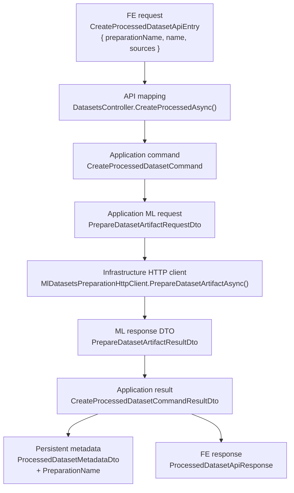
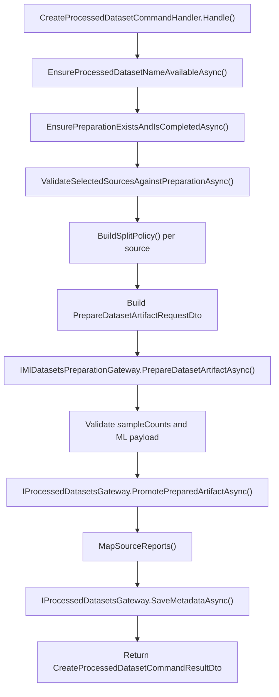

# UC-19-BE - Plan implementacyjny dla `POST /api/datasets/processed`

## 1) Przeznaczenie endpointa
- Endpoint buduje finalny dataset `{name}.npz` z wcześniej utworzonego `dataset preparation`.
- `BE` pozostaje orkiestratorem i `source of truth` dla:
  - walidacji żądania,
  - potwierdzenia gotowości preparation,
  - walidacji wyboru źródeł `board` i `digit`,
  - tłumaczenia `splits -> splitPolicy`,
  - zapisania finalnych metadanych processed datasetu,
  - mapowania błędów na publiczny kontrakt HTTP.
- Endpoint jest operacją administracyjną i pozostaje za `[Authorize]` z `UC-13`.
- To jest refaktor istniejącego flow `raw -> npz` z `UC-12` na docelowy flow `preparation -> npz` z `UC-17 -> UC-18 -> UC-19`.

## 2) Zakres planu i główne założenia
- Plan dotyczy wyłącznie `BE` w `src/Backend/Sudoku`.
- Nie sugerujemy się tym, co obecnie robi `FE` lub `ML`, poza obowiązującymi kontraktami, architekturą i już wdrożonymi historyjkami.
- `UC-19` nie tworzy preparation i nie czyści jego zawartości; zakłada, że preparation zostało już utworzone i ewentualnie oczyszczone.
- `BE` nie wraca już do `raw-candidates` jako źródła prawdy dla tego endpointu.
- `BE` nie skanuje katalogów `raw` podczas builda `.npz`.
- `ML` ma dostać logiczny request odnoszący się do:
  - `preparationName`,
  - źródeł `name`,
  - źródeł `type`,
  - polityki splitu.
- `ML` nie powinien dostać od `BE` publicznego requestu z absolutnymi ścieżkami serwerowymi.
- Finalny artefakt `.npz` ma pozostać kompatybilny z późniejszym treningiem z `UC-06`.

## 3) Co już istnieje i musi zostać reuse'owane

### 3.1 Gotowe elementy z wcześniejszych historyjek
- `UC-13`
  - autoryzacja admina dla endpointów datasetowych.
- `UC-17`
  - byt `dataset preparation`,
  - `IDatasetPreparationsGateway`,
  - `IDatasetPreparationArtifactsGateway`,
  - metadata preparation,
  - statusy preparation,
  - klient `BE -> ML` do preparation,
  - background workflow preparation.
- `UC-18`
  - odczyt `board/folders.json`,
  - odczyt `digit/folders.json`,
  - odczyt `board/{sourceName}/file.json`,
  - semantyczne wyjątki:
    - `DatasetPreparationNotFoundException`,
    - `DatasetPreparationArtifactsNotReadyException`,
    - `DatasetPreparationSourceNotFoundException`,
    - `DatasetPreparationBoardFileNotFoundException`.
- `UC-12`
  - istniejący endpoint `POST /api/datasets/processed`,
  - istniejący klient `IMlDatasetsPreparationGateway`,
  - istniejący storage processed datasetów,
  - istniejące DTO splitów, raportów i metadanych.

### 3.2 Najważniejszy wniosek architektoniczny
- Nie budować nowego równoległego workflow processed datasetów.
- Nie budować nowego adaptera local storage tylko dla `UC-19`.
- Nie budować nowego systemu wykrywania źródeł na bazie `raw`.
- Należy zrefaktoryzować istniejący flow `CreateProcessedDataset*`, tak aby używał preparation jako wejścia.

### 3.3 Reguła kompatybilności nazw
- Ze względu na istniejący kod i zasadę niestrząsania wcześniejszymi kontraktami:
  - zachowujemy `CreateProcessedDatasetApiEntry`,
  - zachowujemy `CreateProcessedDatasetCommand`,
  - zachowujemy `SelectedRawDatasetSourceApiEntry`,
  - zachowujemy `SelectedRawDatasetSourceDto`.
- Nazwy tych typów są historyczne, ale w `UC-19` ich semantyka dotyczy wyboru źródeł z preparation.
- Nie należy robić zbędnego rename całego flow tylko po to, aby usunąć słowo `Raw` z nazw typów.

## 4) Kontrakty FE/BE/ML oraz modele wejścia/wyjścia

### 4.1 FE -> BE (`POST /api/datasets/processed`)
`CreateProcessedDatasetApiEntry`:
- `preparationName: string`
- `name: string`
- `sources: SelectedRawDatasetSourceApiEntry[]`

`SelectedRawDatasetSourceApiEntry`:
- `name: string`
- `type: string` (`board` | `digit`)
- `splits: string[]` (`train` | `val` | `test` | `mix`)

Sukces `201 Created` -> `ProcessedDatasetApiResponse`:
- `name: string`
- `fileName: string`
- `preprocessingProfile: string`
- `createdAtUtc: string`
- `sources: SelectedRawDatasetSourceApiEntry[]`
- `sampleCounts: SplitSampleCountsApiResponse`
- `sourceReports: ProcessedDatasetSourceReportApiResponse[]`
- `warnings: string[]`

Uwagi:
- publiczna odpowiedź może pozostać bez pola `preparationName`, ale metadane wewnętrzne `BE` powinny je zapisać dla śledzenia pochodzenia datasetu.
- request `sources[].name` oznacza nazwę folderu źródłowego w preparation, nie nazwę raw datasetu.

### 4.2 Błędy FE -> BE
- `400 Bad Request`
  - `invalid_request`
  - `invalid_dataset_preparation_name`
  - `invalid_dataset_split_selection`
- `401 Unauthorized`
- `404 Not Found`
  - `dataset_preparation_not_found`
  - `dataset_preparation_source_not_found`
- `409 Conflict`
  - `dataset_preparation_artifacts_not_ready`
  - `processed_dataset_name_conflict`
- `422 Unprocessable Entity`
  - `no_samples_prepared`
  - `dataset_source_invalid`
- `503 Service Unavailable`
  - `ml_unavailable`
  - `processed_dataset_artifact_promotion_failed`
- `504 Gateway Timeout`
  - `ml_timeout`

### 4.3 BE -> ML (`POST /ml/datasets/prepare`)
`PrepareDatasetArtifactRequestDto`:
- `preparationName: string`
- `datasetName: string`
- `sources: PrepareDatasetSourceDto[]`
- `preprocessingProfile: string`

`PrepareDatasetSourceDto`:
- `name: string`
- `type: string`
- `splitPolicy: DatasetSplitPolicyDto`

`DatasetSplitPolicyDto`:
- `mode: string` (`mix` | `selected`)
- `ratios`
- `groupBy: string` (`board` | `sample`)

### 4.4 ML -> BE
`PrepareDatasetArtifactResultDto`:
- `sampleCounts`
- `sources`
- `warnings`

`PreparedDatasetSourceReportDto`:
- `name`
- `requestedType`
- `detectedType`
- `processedSampleCount`
- `includedSampleCount`
- `emptyCellCount`
- `rejectedSampleCount`
- `warnings`

### 4.5 Reguła kontraktowa wobec ML
- `BE` przekazuje do `ML` logiczne identyfikatory:
  - `preparationName`,
  - `source.name`,
  - `source.type`,
  - `splitPolicy`.
- `BE` nie powinien wysyłać ścieżek absolutnych typu `/opt/sudoku/...`.
- `ML` sam mapuje `preparationName + type + name` do swojej konfiguracji runtime.
- `BE` ma wcześniej potwierdzić, że wybrane źródła istnieją i preparation jest gotowe.

## 5) Zachowanie per warstwa

### API
- `DatasetsController`:
  - binduje `CreateProcessedDatasetApiEntry`,
  - mapuje request do `CreateProcessedDatasetCommand`,
  - wywołuje `MediatR`,
  - mapuje wyjątki na `400/401/404/409/422/503/504`,
  - loguje start, sukces i błędy w lekkiej formie.
- API nie:
  - czyta manifestów preparation,
  - nie buduje splitu,
  - nie rozmawia bezpośrednio z filesystemem,
  - nie interpretuje statusu preparation.

### Application
- `Application` odpowiada za:
  - walidację `preparationName`,
  - walidację `name`,
  - walidację `sources`,
  - sprawdzenie istnienia preparation,
  - sprawdzenie statusu `completed`,
  - sprawdzenie, że każdy `source.name` istnieje we właściwym manifeście folderów,
  - zbudowanie `splitPolicy`,
  - wywołanie `ML`,
  - walidację odpowiedzi `ML`,
  - promocję artefaktu `.npz`,
  - zapis metadanych processed datasetu.
- `Application` nie:
  - robi niskopoziomowego I/O,
  - nie składa ścieżek produkcyjnych na sztywno,
  - nie przechowuje logiki HTTP w handlerze.

### Domain / Models
- `Models` pozostaje lekką warstwą współdzielonych modeli bez zależności od HTTP i storage.
- Dla `UC-19` nie trzeba dodawać nowego modelu domenowego.
- Reuse:
  - `Models/Datasets/DatasetPreparationStatus.cs`
- Status `completed` pozostaje bramką dopuszczającą build `.npz`.

### Infrastructure
- `Infrastructure` implementuje porty:
  - odczyt metadanych preparation,
  - odczyt manifestów i artefaktów preparation,
  - wywołanie HTTP do `ML`,
  - promocję finalnego `.npz`,
  - zapis metadanych processed datasetu.
- `Infrastructure` nie:
  - decyduje, czy `404` czy `409`,
  - nie liczy split ratios,
  - nie interpretuje workflow biznesowego preparation.

## 6) Pliki per warstwa i odpowiedzialności

### 6.1 API (`src/Backend/Sudoku/Sudoku`)
- `[MODYFIKACJA]` `Controllers/DatasetsController.cs`
  - `CreateProcessedAsync(...)` ma przyjmować `preparationName`,
  - ma mapować nowe wyjątki preparation,
  - ma logować `datasetName`, `preparationName`, liczbę źródeł, wynik.
- `[MODYFIKACJA]` `Contracts/CreateProcessedDatasetApiEntry.cs`
  - dodać `PreparationName`.
- `[REUSE]` `Contracts/SelectedRawDatasetSourceApiEntry.cs`
  - pozostaje publicznym modelem źródła z `name`, `type`, `splits`.
- `[REUSE]` `Contracts/ProcessedDatasetApiResponse.cs`
  - publiczna odpowiedź może pozostać bez zmiany kształtu.
- `[REUSE]` `Contracts/ProcessedDatasetSourceReportApiResponse.cs`
  - raport per źródło.
- `[REUSE]` `Contracts/ProcessedDatasetsListApiResponse.cs`
  - brak zmiany zakresu tej historyjki.
- `[REUSE]` `Contracts/ErrorApiResponse.cs`
  - wspólny model błędów `errorType` + `message`.

### 6.2 Application (`src/Backend/Sudoku/Application`)
- `[MODYFIKACJA]` `Datasets/CreateProcessedDatasetCommand.cs`
  - dodać `PreparationName`.
- `[MODYFIKACJA]` `Datasets/CreateProcessedDatasetCommandValidator.cs`
  - walidować `preparationName`,
  - dalej walidować `name`, `sources`, duplikaty, regułę `mix`.
- `[MODYFIKACJA]` `Datasets/CreateProcessedDatasetCommandHandler.cs`
  - usunąć zależność od `ListRawDatasetCandidatesQuery`,
  - oprzeć walidację wyboru na preparation,
  - zbudować request `preparation -> ML`,
  - zapisać metadata z `preparationName`.
- `[MODYFIKACJA]` `Datasets/CreateProcessedDatasetErrorTypes.cs`
  - usunąć raw-specyficzne użycie w tym flow,
  - dodać error types dla preparation.
- `[REUSE]` `Datasets/CreateProcessedDatasetCommandResultDto.cs`
  - może pozostać bez `PreparationName`, jeśli nie wystawiamy go publicznie w `POST`.
- `[MODYFIKACJA]` `Datasets/ProcessedDatasetMetadataDto.cs`
  - dodać `PreparationName` jako pole trwałego śledzenia pochodzenia.
- `[REUSE]` `Datasets/SelectedRawDatasetSourceDto.cs`
  - pozostaje wewnętrznym DTO źródła.
- `[MODYFIKACJA]` `Datasets/PrepareDatasetArtifactRequestDto.cs`
  - dodać `PreparationName`.
- `[REUSE]` `Datasets/PrepareDatasetSourceDto.cs`
  - dalej niesie `Name`, `Type`, `SplitPolicy`.
- `[REUSE]` `Datasets/PrepareDatasetArtifactResultDto.cs`
  - wynik z ML.
- `[REUSE]` `Datasets/PreparedDatasetSourceReportDto.cs`
  - raport źródła z ML.
- `[REUSE]` `Datasets/DatasetSplitPolicyDto.cs`
  - `mix` lub `selected`.
- `[REUSE]` `Datasets/SplitRatiosDto.cs`
  - proporcje splitów.
- `[REUSE]` `Datasets/SplitSampleCountsDto.cs`
  - liczności splitów.
- `[REUSE]` `Abstractions/IDatasetPreparationsGateway.cs`
  - odczyt metadata preparation.
- `[REUSE]` `Abstractions/IDatasetPreparationArtifactsGateway.cs`
  - odczyt list folderów preparation i artefaktów.
- `[REUSE]` `Abstractions/IMlDatasetsPreparationGateway.cs`
  - port do `POST /ml/datasets/prepare`; zmienia się payload DTO, nie odpowiedzialność portu.
- `[REUSE]` `Abstractions/IProcessedDatasetsGateway.cs`
  - promocja artefaktu i zapis metadata.
- `[REUSE]` `Datasets/DatasetPreparationNameValidationRules.cs`
  - wspólna walidacja `preparationName`.
- `[REUSE]` `Datasets/DatasetPreparationNotFoundException.cs`
  - semantyka `404`.
- `[REUSE]` `Datasets/DatasetPreparationArtifactsNotReadyException.cs`
  - semantyka `409`.
- `[REUSE]` `Datasets/DatasetPreparationSourceNotFoundException.cs`
  - semantyka `404` dla źródła w preparation.
- `[REUSE]` `Datasets/DatasetsPreparationOptions.cs`
  - domyślny `preprocessingProfile` i ratio `mix`.

### 6.3 Models (`src/Backend/Sudoku/Models`)
- `[REUSE]` `Datasets/DatasetPreparationStatus.cs`
  - statusy preparation używane do warunku gotowości.
- `[BRAK NOWYCH PLIKÓW]`
  - `UC-19` nie wymaga nowego modelu domenowego w `Models`.

### 6.4 Infrastructure (`src/Backend/Sudoku/Infrastructure`)
- `[MODYFIKACJA]` `Ml/MlDatasetsPreparationHttpClient.cs`
  - wysyłać `PreparationName` do `ML`,
  - nadal mapować `422/503/504`,
  - logować błędy integracyjne z kontekstem preparation/dataset.
- `[REUSE]` `Storage/DatasetPreparationsGateway.cs`
  - odczyt `preparation.metadata.json`.
- `[REUSE]` `Storage/DatasetPreparationArtifactsGateway.cs`
  - odczyt `board/folders.json`,
  - odczyt `digit/folders.json`,
  - reuse istniejących ścieżek i manifestów.
- `[REUSE]` `Storage/ProcessedDatasetsGateway.cs`
  - promocja `{datasetName}.npz`,
  - zapis metadata processed datasetu.
- `[REUSE]` `Storage/LocalFileStorageGateway.cs`
  - generyczne I/O.
- `[REUSE]` `Configuration/MlServiceOptions.cs`
  - path `PrepareDatasetPath` zostaje ten sam.
- `[REUSE]` `DependencyInjection.cs`
  - brak nowego portu; rejestracje pozostają, o ile nie dodamy nowych helperów.

### 6.5 Testy (`src/Backend/Sudoku/Application.Tests`)
- `[MODYFIKACJA]` `DatasetsControllerTests.cs`
  - zaktualizować request i mapowanie wyjątków dla `POST /api/datasets/processed`.
- `[NOWY]` `CreateProcessedDatasetCommandValidatorTests.cs`
  - dodać scenariusze `preparationName`.
- `[NOWY]` `CreateProcessedDatasetCommandHandlerTests.cs`
  - przerobić testy z `raw` na `preparation`.
- `[NOWY]` `MlDatasetsPreparationHttpClientTests.cs`
  - sprawdzić nowy payload z `preparationName`.
- `[NOWY]` `ProcessedDatasetsGatewayTests.cs`
  - potwierdzić serializację metadata z `PreparationName`.

## 7) Weryfikacja antyduplikacyjna dla Infrastructure
- `IFileStorageGateway` już ma:
  - `SaveAsync`,
  - `ReplaceAsync`,
  - `DeleteAsync`,
  - `DeleteDirectoryAsync`,
  - `OpenReadAsync`,
  - `FileExistsAsync`,
  - `ListFilesAsync`,
  - `ListDirectoriesAsync`.
- Wniosek:
  - nie tworzyć nowego storage gateway lokalnego tylko dla processed dataset build.
- `DatasetPreparationArtifactsGateway` już jest generycznym adapterem do artefaktów preparation.
- Wniosek:
  - nie tworzyć osobnego gatewaya typu `ProcessedDatasetPreparationSelectionGateway`.
  - jeśli potrzebny jest nowy odczyt artefaktu preparation, najpierw rozszerzyć `IDatasetPreparationArtifactsGateway`.
- `ProcessedDatasetsGateway` już jest generycznym adapterem dla finalnych `.npz` i metadanych processed datasetu.
- Wniosek:
  - nie przenosić do niego logiki walidacji selection ani statusu preparation.

## 8) Przepływ w obrębie BE
1. `FE` wywołuje `POST /api/datasets/processed`.
2. `[Authorize]` dopuszcza tylko administratora.
3. `DatasetsController.CreateProcessedAsync(...)` mapuje body do `CreateProcessedDatasetCommand`.
4. `ValidationBehavior` uruchamia `CreateProcessedDatasetCommandValidator`.
5. Handler normalizuje `datasetName`, `preparationName`, `sources[].type`, `sources[].splits`.
6. Handler sprawdza, czy `{datasetName}.npz` nie istnieje już w processed storage.
7. Handler odczytuje preparation przez `IDatasetPreparationsGateway.GetByNameAsync(...)`.
8. Gdy preparation nie istnieje -> `DatasetPreparationNotFoundException`.
9. Gdy status preparation != `completed` -> `DatasetPreparationArtifactsNotReadyException`.
10. Handler pobiera dopuszczalne źródła:
   - `board` przez `IDatasetPreparationArtifactsGateway.GetSourceFolderNamesAsync(preparationName, "board")`
   - `digit` przez `IDatasetPreparationArtifactsGateway.GetSourceFolderNamesAsync(preparationName, "digit")`
11. Handler weryfikuje, że każde źródło z requestu istnieje w odpowiednim manifeście folderów.
12. Handler buduje `PrepareDatasetArtifactRequestDto`.
13. Handler wywołuje `IMlDatasetsPreparationGateway.PrepareDatasetArtifactAsync(...)`.
14. `ML` buduje tymczasowy `{datasetName}.npz` na podstawie preparation.
15. Handler sprawdza `sampleCounts`.
16. Gdy suma próbek = `0` -> `NoSamplesPreparedException`.
17. Handler promuje artefakt do katalogu processed przez `IProcessedDatasetsGateway.PromotePreparedArtifactAsync(...)`.
18. Handler zapisuje metadane z `PreparationName`.
19. Kontroler zwraca `201 Created` z `ProcessedDatasetApiResponse`.

## 9) Główne funkcje
- `DatasetsController.CreateProcessedAsync(...)`
- `CreateProcessedDatasetCommandValidator.ValidateName(...)`
- `CreateProcessedDatasetCommandValidator.ValidatePreparationName(...)`
- `CreateProcessedDatasetCommandValidator.ValidateSources(...)`
- `CreateProcessedDatasetCommandHandler.Handle(...)`
- `CreateProcessedDatasetCommandHandler.EnsurePreparationExistsAndIsCompletedAsync(...)`
- `CreateProcessedDatasetCommandHandler.ValidateSelectedSourcesAgainstPreparationAsync(...)`
- `CreateProcessedDatasetCommandHandler.BuildSplitPolicy(...)`
- `CreateProcessedDatasetCommandHandler.MapSourceReports(...)`
- `MlDatasetsPreparationHttpClient.PrepareDatasetArtifactAsync(...)`
- `ProcessedDatasetsGateway.PromotePreparedArtifactAsync(...)`
- `ProcessedDatasetsGateway.SaveMetadataAsync(...)`

## 10) Wyjątki, fallbacki i zachowanie błędów

### 10.1 Walidacja wejścia
- puste `preparationName` -> `400 invalid_dataset_preparation_name`
- niepoprawne `name` -> `400 invalid_request`
- puste `sources` -> `400 invalid_request`
- `mix` razem z innymi splitami -> `400 invalid_dataset_split_selection`
- duplikat `source.name + type` -> `400 invalid_request`

### 10.2 Preparation
- preparation nie istnieje -> `404 dataset_preparation_not_found`
- preparation istnieje, ale nie ma statusu `completed` -> `409 dataset_preparation_artifacts_not_ready`
- fallback:
  - brak automatycznego pollingu po stronie `BE`,
  - klient ma ponowić request dopiero po gotowym preparation.

### 10.3 Wybór źródeł
- źródło nie istnieje w `board/folders.json` lub `digit/folders.json` -> `404 dataset_preparation_source_not_found`
- źródło zniknęło po czyszczeniu w `UC-18` między odczytem listy a buildem -> też `404`
- fallback:
  - brak cichego pomijania źródeł,
  - request ma być poprawiony przez użytkownika.

### 10.4 Integracja z ML
- timeout -> `504 ml_timeout`
- błąd sieci/5xx -> `503 ml_unavailable`
- `422` z ML -> `422 dataset_source_invalid` lub bardziej szczegółowy `errorType`, jeśli kontrakt ML go zwraca
- niepoprawny JSON / niepełny payload -> traktować jako techniczny błąd integracyjny `503 ml_unavailable`
- fallback:
  - brak automatycznego retry w request-response,
  - retry tylko ręczny po stronie użytkownika lub operatora.

### 10.5 Artefakt `.npz`
- konflikt nazwy -> `409 processed_dataset_name_conflict`
- brak tymczasowego artefaktu po sukcesie ML -> `503 processed_dataset_artifact_promotion_failed`
- błąd kopiowania lub zapisu finalnego pliku -> `503 processed_dataset_artifact_promotion_failed`
- błąd zapisu metadata po poprawnej promocji pliku:
  - traktować jako `500` lub `503` zależnie od typu błędu I/O,
  - logować jako niespójność storage.
- fallback:
  - nie nadpisywać istniejącego datasetu,
  - jeśli cleanup temp artefaktu jest tani i oparty o istniejący generyczny gateway, wykonać best-effort cleanup,
  - jeśli nie jest tani, nie dodawać wyspecjalizowanego obejścia tylko dla `UC-19`.

## 11) Pseudokod kluczowej logiki

```text
handle(command):
  validate(command)

  datasetName = trim(command.name)
  preparationName = trim(command.preparationName)
  selectedSources = normalize(command.sources)

  ensureProcessedDatasetNameAvailable(datasetName)

  preparation = datasetPreparationsGateway.getByName(preparationName)
  if preparation == null:
    throw dataset_preparation_not_found

  if preparation.status != completed:
    throw dataset_preparation_artifacts_not_ready

  allowedBoardSources = artifactsGateway.getSourceFolderNames(preparationName, "board")
  allowedDigitSources = artifactsGateway.getSourceFolderNames(preparationName, "digit")

  for source in selectedSources:
    ensureSourceExistsInProperManifest(source, allowedBoardSources, allowedDigitSources)

  mlRequest = {
    preparationName,
    datasetName,
    preprocessingProfile: options.defaultPreprocessingProfile,
    sources: selectedSources.map(source => ({
      name: source.name,
      type: source.type,
      splitPolicy: buildSplitPolicy(source)
    }))
  }

  mlResult = mlGateway.prepareDatasetArtifact(mlRequest)

  if sum(mlResult.sampleCounts) == 0:
    throw no_samples_prepared

  processedDatasetsGateway.promotePreparedArtifact(datasetName, datasetName + ".npz")

  processedDatasetsGateway.saveMetadata({
    preparationName,
    name: datasetName,
    fileName: datasetName + ".npz",
    preprocessingProfile,
    createdAtUtc,
    sources: selectedSources,
    sampleCounts: mlResult.sampleCounts,
    sourceReports: mapSourceReports(selectedSources, mlResult),
    warnings: mlResult.warnings
  })

  return publicResult
```

## 12) Logi
- `Information`
  - start requestu:
    - `datasetName`
    - `preparationName`
    - liczba źródeł
  - sukces requestu:
    - `datasetName`
    - `preparationName`
    - `sampleCounts`
    - liczba ostrzeżeń
- `Warning`
  - `dataset_preparation_not_found`
  - `dataset_preparation_artifacts_not_ready`
  - `dataset_preparation_source_not_found`
  - `processed_dataset_name_conflict`
  - `no_samples_prepared`
- `Error`
  - timeouty `ML`
  - błędy sieci `ML`
  - błędy JSON / payloadu `ML`
  - błędy promocji artefaktu
  - błędy zapisu metadata
- Guardrail:
  - nie logować per próbkę ani per planszę,
  - nie logować zawartości requestu z pełną listą wszystkich splitów i ostrzeżeń, jeśli może być bardzo duża,
  - nie logować żadnych sekretów i ścieżek systemowych pochodzących z konfiguracji produkcyjnej.

## 13) Workflow GitHub Actions i konfiguracja runtime

### 13.1 Co zostaje bez zmiany
- `MlService:PrepareDatasetPath` już istnieje.
- `DatasetsPreparation:*` już istnieje.
- `backend-cd.yml` już podstawia:
  - `BE_ML_PREPARE_DATASET_PATH`
  - `BE_DATASETS_PREP_PREPARATIONS_DIRECTORY_PATH`
  - `BE_DATASETS_PREP_PROCESSED_DIRECTORY_PATH`
  - `BE_DATASETS_PREP_TEMPORARY_ARTIFACTS_DIRECTORY_PATH`
  - `BE_DATASETS_PREP_DEFAULT_PREPROCESSING_PROFILE`
  - `BE_DATASETS_PREP_DEFAULT_MIX_*_RATIO`

### 13.2 Decyzja dla UC-19
- Dla samego `UC-19` nie są potrzebne nowe klucze konfiguracyjne ani nowy workflow.
- W `local` zostają ścieżki ustawione na sztywno w `appsettings.local.json`.
- W `production` workflow dalej nadpisuje `appsettings.production.json`.
- Nie wolno przenosić nowych ścieżek do kodu.

### 13.3 Kiedy workflow wymagałby zmiany
- tylko gdyby zmienił się:
  - path `BE -> ML`,
  - nazwa sekcji configu,
  - potrzeba nowego timeoutu specyficznego dla tego use-case.
- Tego plan nie zakłada.

## 14) Zależności między historyjkami
- `UC-13`
  - wymagane, bo endpoint jest administracyjny.
- `UC-17 POST /api/datasets/preparations`
  - wymagane, bo bez preparation nie ma builda `.npz`.
- `UC-17 GET /api/datasets/preparations`
  - używane do wyboru preparation w UI, ale nie jest zależnością logiczną samego handlera.
- `UC-17 GET /api/datasets/preparations/{preparationName}`
  - daje status i pozwala sprawdzić gotowość przed buildem.
- `UC-18 GET /api/datasets/preparations/{preparationName}/board/folders`
  - dostarcza wybór źródeł `board`.
- `UC-18 GET /api/datasets/preparations/{preparationName}/digit/folders`
  - dostarcza wybór źródeł `digit`.
- `UC-18 DELETE .../files/{boardFolderName}`
  - wpływa na finalny rezultat, bo usunięte elementy nie mogą trafić do builda.
- `UC-06 POST /api/trainings`
  - konsumuje finalny `.npz`, więc `UC-19` musi utrzymać kompatybilny artefakt.

## 15) Mermaid - flow modeli



## 16) Mermaid - flow logiki aplikacji



## 17) Kolejność implementacji
1. Zmodyfikować kontrakt wejściowy `CreateProcessedDatasetApiEntry` o `PreparationName`.
2. Zmodyfikować `CreateProcessedDatasetCommand` i validator.
3. Zrefaktoryzować `CreateProcessedDatasetCommandHandler`:
   - usunąć walidację względem `raw`,
   - dodać walidację względem preparation,
   - dodać zapis `PreparationName` do metadata.
4. Zmodyfikować `PrepareDatasetArtifactRequestDto` i klient `MlDatasetsPreparationHttpClient`.
5. Zaktualizować mapowanie wyjątków i logów w `DatasetsController`.
6. Dodać / zaktualizować testy walidatora, handlera, kontrolera i klienta ML.
7. Zweryfikować, że brak zmian workflow/config jest nadal prawdziwy po finalnym kształcie kontraktu.

## 18) Guardraile implementacyjne i inne istotne reguły
- `Application` trzyma workflow, `Infrastructure` tylko implementuje technikalia.
- Nie używać `ListRawDatasetCandidatesQuery` w `UC-19`.
- Nie zmieniać istniejących nazw klas tylko dlatego, że historycznie zawierają `Raw`.
- Nie hardkodować ścieżek runtime.
- Nie opierać builda `.npz` o `corrected-board.png`.
- `board` zawsze mapować do `groupBy=board`.
- `digit` zawsze mapować do `groupBy=sample`.
- `mix` jest rozłączne z jawnymi splitami.
- Kolejność `sourceReports` ma odpowiadać kolejności `sources` z requestu.
- Nie nadpisywać istniejącego `{name}.npz`.
- Nie przenosić logiki mapowania HTTP statusów do handlera.
- Nie rozszerzać workflow GitHub, jeśli nie powstaje nowy config.
- Jeśli w trakcie implementacji okaże się, że potrzeba nowego odczytu artefaktów preparation, najpierw rozszerzyć istniejący `IDatasetPreparationArtifactsGateway`, a nie dodawać nowy wyspecjalizowany port.
