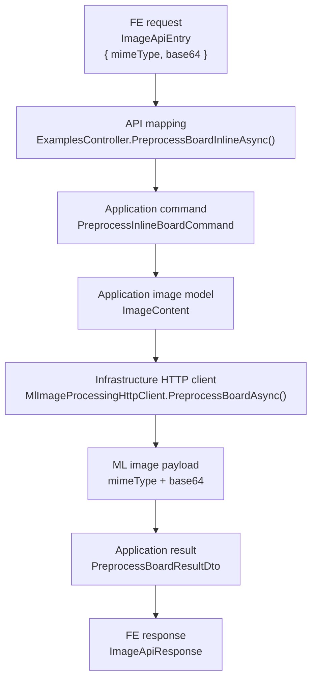
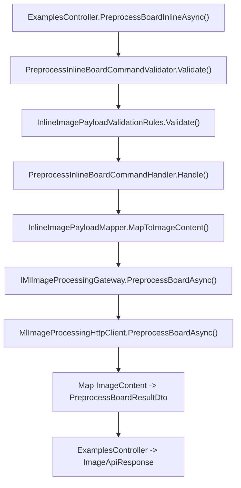

# UC-20-BE - Plan implementacyjny dla `PUT /api/examples/preprocess/board`

## 1) Przeznaczenie endpointa
- Endpoint uruchamia etap `board` preprocessingu dla obrazu dostarczonego inline przez `FE` w body `ImageApiEntry`.
- Celem jest obsłużenie lokalnego zdjęcia użytkownika bez:
  - zapisu pliku do `examples/uploads`,
  - tworzenia rekordu przykładu,
  - zapisu wyniku pośredniego na dysku `BE`.
- `BE` pozostaje tylko publicznym API i orkiestratorem:
  - waliduje payload,
  - dekoduje obraz,
  - wywołuje istniejący serwis `ML`,
  - zwraca `ImageApiResponse`.
- Endpoint jest alternatywną ścieżką wejścia do istniejącego flow z `UC-04`.
- To nie zastępuje istniejącego `PUT /api/examples/{name}/preprocess/board`; oba endpointy mają współistnieć.

## 2) Zakres planu i główne założenia
- Plan dotyczy wyłącznie `BE` w `src/Backend/Sudoku`.
- Nie sugerujemy się tym, co obecnie robi `FE` albo `ML`, poza:
  - obowiązującymi kontraktami,
  - istniejącą architekturą,
  - już wdrożonymi historyjkami.
- `UC-20` nie zmienia semantyki:
  - `PUT /api/examples/{name}/preprocess/board`,
  - `PUT /api/examples/preprocess/cells`,
  - `PUT /ml/preprocess/board`,
  - `PUT /ml/preprocess/cells`.
- Wejście nowego endpointu jest takie samo jak dla istniejącego `cells`:
  - `ImageApiEntry { mimeType, base64 }`.
- `BE` nie używa `ExamplesStorageOptions` ani `IFileStorageGateway` w nowym flow.
- `BE` nie tworzy plików tymczasowych ani fallbackowego zapisu do `tmp`.
- Walidacja obrazu inline ma pozostać w `Application`, nie w `Api` i nie w `Infrastructure`.

## 3) Co już istnieje i musi zostać reuse'owane

### 3.1 Gotowe elementy z wcześniejszych historyjek
- `UC-04`
  - `PUT /api/examples/{name}/preprocess/board`,
  - `PUT /api/examples/preprocess/cells`,
  - `ImageApiEntry`,
  - `ImageApiResponse`,
  - `CellsGridApiResponse`,
  - `IMlImageProcessingGateway`,
  - `MlImageProcessingHttpClient`,
  - `ExamplesPreprocessOptions`,
  - `PreprocessBoardResultDto`,
  - `PreprocessCellsResultDto`,
  - wyjątki integracyjne `ML`.
- `UC-01` / `UC-02` / `UC-03`
  - biblioteka `examples` istnieje, ale dla `UC-20` nie jest źródłem obrazu.
- `UC-05`
  - później konsumuje ten sam dwuetapowy flow `board -> cells`, ale nie jest bezpośrednio częścią implementacji tego endpointu.

### 3.2 Najważniejszy wniosek architektoniczny
- Nie budować nowego klienta `BE -> ML`.
- Nie budować nowego storage gatewaya.
- Nie budować nowego modelu JSON obrazu.
- Nie przeciążać istniejącego `PreprocessExampleBoardCommand` dodatkowymi polami `name|mimeType|base64`, bo zmiesza dwa różne warianty wejścia:
  - wariant po nazwie pliku z serwera,
  - wariant inline z body requestu.
- Lepiej dodać drugi use-case w `Application`, ale oprzeć go na tych samych współdzielonych kontraktach i adapterach.

### 3.3 Czego nie należy tworzyć
- Nie tworzyć:
  - `ILocalBoardPreprocessGateway`,
  - `IInlineBoardStorageGateway`,
  - `LocalBoardApiResponse`,
  - osobnego klienta HTTP tylko dla `UC-20`.
- Nie kopiować 1:1 walidacji `mimeType/base64/size` do kolejnego validatora bez wspólnego helpera.
- Nie zapisywać obrazu do `examples/uploads`, żeby potem wywołać stary endpoint po `name`.
- Nie robić fallbacku:
  - `inline image -> save to disk -> old endpoint`.

## 4) Kontrakty FE/BE/ML oraz modele wejścia/wyjścia

### 4.1 FE -> BE (`PUT /api/examples/preprocess/board`)
- Request: `[REUSE] ImageApiEntry`
  - `mimeType: string`
  - `base64: string`
- Success: `[REUSE] ImageApiResponse`
  - `mimeType: string`
  - `base64: string`
- Errors: `[REUSE] ErrorApiResponse`
  - `errorType: string`
  - `message: string`

Przykład requestu:

```json
{
  "mimeType": "image/jpeg",
  "base64": "/9j/4AAQSkZJRgABAQAAAQABAAD..."
}
```

Przykład odpowiedzi:

```json
{
  "mimeType": "image/png",
  "base64": "iVBORw0KGgoAAAANSUhEUgAA..."
}
```

### 4.2 Błędy FE -> BE
- `400 Bad Request`
  - `invalid_request`
- `422 Unprocessable Entity`
  - `board_not_found`
  - `board_not_detected`
  - albo inny `errorType` zwrócony semantycznie przez `ML`
- `503 Service Unavailable`
  - `ml_unavailable`
- `504 Gateway Timeout`
  - `ml_timeout`

### 4.3 BE -> ML (`PUT /ml/preprocess/board`)
- Publiczny endpoint `BE` reuse'uje istniejący port `IMlImageProcessingGateway.PreprocessBoardAsync(...)`.
- Wewnętrzny model aplikacyjny:
  - `[REUSE] ImageContent`
    - `MimeType`
    - `Content`
- Transport HTTP w `Infrastructure` reuse'uje obecny payload obrazu:
  - `mimeType`
  - `base64`
- `BE` nie wysyła do `ML`:
  - nazwy pliku,
  - ścieżek serwerowych,
  - metadanych `example`.

### 4.4 ML -> BE
- Sukces:
  - payload obrazu `mimeType + base64`
- Błąd semantyczny:
  - `errorType + message`
- `BE` traktuje `mimeType` z odpowiedzi `ML` jako źródło prawdy i nie nadpisuje go na sztywno.

### 4.5 Reguły kontraktowe
- Nowy endpoint ma przyjmować ten sam kształt body co `PUT /api/examples/preprocess/cells`.
- Nie zmieniamy `ImageApiEntry`.
- Nie zmieniamy `ImageApiResponse`.
- Nie dodajemy pola `name`, `fileName`, `source`, `origin` ani `sizeBytes` do publicznego kontraktu.
- Nie zwracamy obrazu jako binarnego `image/png` response body; zostaje JSON z base64.

## 5) Model API wejściowy i wyjściowy w komunikacji z FE i ML

### 5.1 FE -> BE
- `[REUSE] src/Backend/Sudoku/Sudoku/Contracts/ImageApiEntry.cs`
  - wejście publiczne:
    - `mimeType`
    - `base64`

### 5.2 BE -> FE
- `[REUSE] src/Backend/Sudoku/Sudoku/Contracts/ImageApiResponse.cs`
  - odpowiedź publiczna:
    - `mimeType`
    - `base64`
- `[REUSE] src/Backend/Sudoku/Sudoku/Contracts/ErrorApiResponse.cs`
  - błędy HTTP:
    - `errorType`
    - `message`

### 5.3 BE -> ML
- `[REUSE] src/Backend/Sudoku/Models/Images/ImageContent.cs`
  - model wewnętrzny `Application/Models`
- `[REUSE] src/Backend/Sudoku/Application/Abstractions/IMlImageProcessingGateway.cs`
  - `PreprocessBoardAsync(ImageContent image, CancellationToken cancellationToken = default)`

### 5.4 ML -> BE
- `[REUSE] Infrastructure/Ml/MlImageProcessingHttpClient.cs`
  - odbiera payload obrazu,
  - mapuje go z powrotem do `ImageContent`,
  - podnosi wyjątki integracyjne.

## 6) Zachowanie per warstwa

### 6.1 API
- `ExamplesController` dostaje nową akcję:
  - `[HttpPut("preprocess/board")]`
- Kontroler:
  - binduje `ImageApiEntry?`,
  - mapuje je do nowej komendy `Application`,
  - zwraca `ImageApiResponse`,
  - mapuje wyjątki na `400/422/503/504`.
- `Api` nie:
  - dekoduje `base64`,
  - nie waliduje MIME przez własne if-y,
  - nie zapisuje plików,
  - nie buduje `HttpClient` requestu do `ML`.

### 6.2 Application
- `Application` odpowiada za:
  - walidację `mimeType`,
  - walidację `base64`,
  - walidację limitu rozmiaru po dekodowaniu,
  - mapowanie payloadu na `ImageContent`,
  - wywołanie `IMlImageProcessingGateway.PreprocessBoardAsync(...)`,
  - zbudowanie `PreprocessBoardResultDto`,
  - lekkie logowanie operacyjne.
- `Application` nie:
  - używa `File.*`,
  - nie odczytuje `examples/uploads`,
  - nie zna szczegółów HTTP klienta,
  - nie zapisuje nic do storage.

### 6.3 Models / Domain
- `Models` pozostaje cienką warstwą bez zależności od HTTP.
- Dla `UC-20` nie trzeba dodawać nowego modelu domenowego.
- Reuse:
  - `ImageContent`
- `CellsGrid` pozostaje bez zmian; to ten sam obszar funkcjonalny, ale nie jest bezpośrednio używany przez nowy endpoint `board`.

### 6.4 Infrastructure
- `Infrastructure` reuse'uje istniejący adapter:
  - `MlImageProcessingHttpClient`
- `Infrastructure` odpowiada za:
  - serializację JSON do `ML`,
  - timeouty,
  - błędy sieciowe,
  - mapowanie odpowiedzi `ML` na wyjątki integracyjne.
- `Infrastructure` nie:
  - nie waliduje payloadu `ImageApiEntry`,
  - nie decyduje o semantyce `400`,
  - nie tworzy temp file,
  - nie zna pojęcia lokalnego zdjęcia użytkownika.

## 7) Pliki per warstwa i odpowiedzialności

### 7.1 API (`src/Backend/Sudoku/Sudoku`)
- `[MODYFIKACJA]` `Controllers/ExamplesController.cs`
  - dodać akcję `PreprocessBoardInlineAsync(ImageApiEntry? entry, CancellationToken)`
  - mapować body do nowej komendy
  - zwracać `ImageApiResponse`
  - mapować:
    - `ValidationException -> 400`
    - `MlOperationFailedException -> 422`
    - `MlServiceUnavailableException -> 503`
    - `MlServiceTimeoutException -> 504`
- `[REUSE]` `Contracts/ImageApiEntry.cs`
  - publiczny request obrazu inline
- `[REUSE]` `Contracts/ImageApiResponse.cs`
  - publiczna odpowiedź obrazu inline
- `[REUSE]` `Contracts/ErrorApiResponse.cs`
  - wspólny kontrakt błędów

### 7.2 Application (`src/Backend/Sudoku/Application`)
- `[REUSE]` `Examples/PreprocessExampleBoardCommand.cs`
  - pozostaje dla starego endpointu po `name`
- `[REUSE]` `Examples/PreprocessExampleBoardCommandValidator.cs`
  - pozostaje dla starego endpointu po `name`
- `[REUSE]` `Examples/PreprocessExampleBoardCommandHandler.cs`
  - pozostaje dla starego endpointu po `name`
- `[NOWY]` `Examples/PreprocessInlineBoardCommand.cs`
  - komenda dla nowego endpointu
  - pola:
    - `MimeType`
    - `Base64`
- `[NOWY]` `Examples/PreprocessInlineBoardCommandValidator.cs`
  - walidacja requestu inline
  - reuse wspólnych reguł MIME/base64/size
- `[NOWY]` `Examples/PreprocessInlineBoardCommandHandler.cs`
  - główny workflow use-case'a
  - dekodowanie do `ImageContent`
  - wywołanie `IMlImageProcessingGateway.PreprocessBoardAsync(...)`
  - mapowanie do `PreprocessBoardResultDto`
- `[NOWY]` `Examples/PreprocessInlineBoardErrorTypes.cs`
  - stałe `errorType` dla:
    - `invalid_request`
    - `ml_unavailable`
    - `ml_timeout`
- `[REUSE]` `Examples/PreprocessBoardResultDto.cs`
  - wynik aplikacyjny dla obu wariantów `board`
- `[REUSE]` `Examples/ExamplesPreprocessOptions.cs`
  - limit `MaxInlineImageSizeBytes`
- `[REUSE]` `Examples/PreprocessExampleCellsCommand.cs`
  - istniejąca komenda dla etapu `cells`
- `[MODYFIKACJA]` `Examples/PreprocessExampleCellsCommandValidator.cs`
  - przepiąć na wspólny helper walidacyjny, aby nie duplikować whitelisty MIME, dekodowania Base64 i limitu rozmiaru
- `[MODYFIKACJA]` `Examples/PreprocessExampleCellsCommandHandler.cs`
  - opcjonalnie przepiąć na wspólny mapper `base64 -> ImageContent`, jeśli taki helper zostanie dodany
- `[NOWY]` `Examples/InlineImagePayloadValidationRules.cs`
  - wspólne reguły dla:
    - `PreprocessInlineBoardCommandValidator`
    - `PreprocessExampleCellsCommandValidator`
- `[OPCJONALNIE NOWY]` `Examples/InlineImagePayloadMapper.cs`
  - wspólne mapowanie:
    - `mimeType + base64 -> ImageContent`
  - warto dodać, jeśli zespół chce wyeliminować duplikację między handlerami `board` i `cells`
- `[REUSE]` `Abstractions/IMlImageProcessingGateway.cs`
  - port do `ML`
- `[REUSE]` `Ml/MlOperationFailedException.cs`
  - błąd semantyczny / błędny payload odpowiedzi `ML`
- `[REUSE]` `Ml/MlServiceUnavailableException.cs`
  - błąd sieci / niedostępność `ML`
- `[REUSE]` `Ml/MlServiceTimeoutException.cs`
  - timeout `ML`

### 7.3 Models (`src/Backend/Sudoku/Models`)
- `[REUSE]` `Images/ImageContent.cs`
  - prosty model bajtów obrazu przekazywany między `Application` i `Infrastructure`
- `[REUSE]` `Images/CellsGrid.cs`
  - pozostaje bez zmian; ważny dla ciągłości całego obszaru `UC-04`, ale nie wymaga modyfikacji dla samego `UC-20`
- `[BRAK NOWYCH PLIKÓW]`
  - `UC-20` nie wnosi nowego bytu domenowego

### 7.4 Infrastructure (`src/Backend/Sudoku/Infrastructure`)
- `[REUSE]` `Ml/MlImageProcessingHttpClient.cs`
  - już obsługuje `PreprocessBoardPath`
  - powinien zostać użyty bez duplikacji nowego klienta
- `[REUSE]` `Configuration/MlServiceOptions.cs`
  - zawiera `PreprocessBoardPath`, `PreprocessCellsPath`, `TimeoutSeconds`
- `[REUSE]` `DependencyInjection.cs`
  - rejestruje `IMlImageProcessingGateway`
- `[BRAK NOWYCH PLIKÓW]`
  - jeśli nie korygujemy mapowania technicznych błędów payloadu `ML`, `Infrastructure` nie wymaga zmian
- `[OPCJONALNA MODYFIKACJA]` `Ml/MlImageProcessingHttpClient.cs`
  - tylko jeśli zespół zdecyduje, że błędny JSON lub pusty payload z `ML` mają być traktowane jako `503`, a nie jako `422`
  - taką poprawkę trzeba wtedy zastosować współdzielnie także dla starego `UC-04`

### 7.5 Testy (`src/Backend/Sudoku/Application.Tests`)
- `[NOWY]` `ExamplesControllerTests.cs`
  - test nowej akcji HTTP:
    - happy path
    - `400`
    - `422`
    - `503`
    - `504`
- `[NOWY]` `PreprocessInlineBoardCommandValidatorTests.cs`
  - walidacja `mimeType`, `base64`, limitu
- `[NOWY]` `PreprocessInlineBoardCommandHandlerTests.cs`
  - test workflow aplikacyjnego bez storage
- `[NOWY]` `InlineImagePayloadValidationRulesTests.cs`
  - jeśli helper walidacyjny zostanie wydzielony
- `[OPCJONALNIE NOWY]` `InlineImagePayloadMapperTests.cs`
  - jeśli helper mapujący zostanie wydzielony
- `[OPCJONALNIE NOWY LUB MODYFIKACJA]` `MlImageProcessingHttpClientTests.cs`
  - tylko gdy korygujemy mapowanie technicznych błędów odpowiedzi `ML`

### 7.6 Konfiguracja i workflow
- `[REUSE]` `Sudoku/appsettings.json`
  - ma już:
    - `MlService.PreprocessBoardPath`
    - `ExamplesPreprocess.MaxInlineImageSizeBytes`
- `[REUSE]` `Sudoku/appsettings.local.json`
  - lokalny overlay
  - lokalnie wartości pozostają wpisane na sztywno
- `[REUSE]` `Sudoku/appsettings.production.json`
  - produkcyjny overlay do podmiany przez workflow
- `[REUSE]` `.github/workflows/backend-cd.yml`
  - obecnie przygotowuje produkcyjny release `BE`

## 8) Weryfikacja antyduplikacyjna
- `IMlImageProcessingGateway` już rozwiązuje problem komunikacji z `ML`.
- `MlImageProcessingHttpClient` już umie wysłać payload obrazu do `PUT /ml/preprocess/board`.
- `ExamplesPreprocessOptions` już przechowuje limit inline image.
- `ImageApiEntry` i `ImageApiResponse` już istnieją.
- Największe realne ryzyko duplikacji dotyczy tylko `Application`:
  - walidacji `mimeType/base64/size`,
  - mapowania `base64 -> ImageContent`.
- Wniosek:
  - nie dodawać nowego adaptera `Infrastructure`,
  - zamiast tego wydzielić współdzielony helper w `Application`, jeśli duplikacja miałaby pojawić się drugi raz.

## 9) Przepływ w obrębie BE
1. `FE` wywołuje `PUT /api/examples/preprocess/board`.
2. `ExamplesController.PreprocessBoardInlineAsync(...)` binduje body do `ImageApiEntry?`.
3. Kontroler buduje `PreprocessInlineBoardCommand(MimeType, Base64)`.
4. `ValidationBehavior` uruchamia `PreprocessInlineBoardCommandValidator`.
5. Validator:
   - sprawdza `mimeType`,
   - sprawdza `base64`,
   - dekoduje payload testowo,
   - sprawdza limit rozmiaru po dekodowaniu.
6. Handler mapuje wejście do `ImageContent`.
7. Handler wywołuje `IMlImageProcessingGateway.PreprocessBoardAsync(...)`.
8. `MlImageProcessingHttpClient` wysyła `PUT /ml/preprocess/board`.
9. `ML` zwraca obraz planszy po korekcji perspektywy albo błąd semantyczny.
10. Handler buduje `PreprocessBoardResultDto`.
11. Kontroler mapuje wynik do `ImageApiResponse`.
12. `BE` zwraca:
   - `200`, albo
   - `400/422/503/504` zależnie od typu błędu.

## 10) Główne funkcje
- `ExamplesController.PreprocessBoardInlineAsync(...)`
- `PreprocessInlineBoardCommandValidator.Validate(...)`
- `InlineImagePayloadValidationRules.Validate(...)`
- `PreprocessInlineBoardCommandHandler.Handle(...)`
- `InlineImagePayloadMapper.MapToImageContent(...)`
- `IMlImageProcessingGateway.PreprocessBoardAsync(...)`
- `MlImageProcessingHttpClient.PreprocessBoardAsync(...)`
- `MlImageProcessingHttpClient.SendImageAsync(...)`
- `MlImageProcessingHttpClient.ThrowMappedExceptionAsync(...)`

## 11) Wyjątki, fallbacki i zachowanie błędów

### 11.1 Walidacja wejścia
- pusty `mimeType` -> `400 invalid_request`
- niedozwolony `mimeType` -> `400 invalid_request`
- pusty `base64` -> `400 invalid_request`
- niepoprawny `base64` -> `400 invalid_request`
- rozmiar obrazu po dekodowaniu > `ExamplesPreprocess.MaxInlineImageSizeBytes` -> `400 invalid_request`

### 11.2 Integracja z ML
- semantyczny błąd preprocessingu, np. brak planszy -> `422` z `errorType` z `ML`
- timeout `ML` -> `504 ml_timeout`
- błąd sieci / niedostępność / `5xx` -> `503 ml_unavailable`
- fallback:
  - brak automatycznego retry,
  - brak zapisu tymczasowego,
  - brak przełączenia na stary endpoint po `name`.

### 11.3 Technicznie błędna odpowiedź `ML`
- pusty payload obrazu,
- brak `mimeType`,
- brak `base64`,
- niepoprawny base64 w odpowiedzi,
- niepoprawny JSON.

Decyzja planistyczna:
- preferowane semantycznie jest traktowanie takich przypadków jako błędu integracyjnego `503`,
- ale ponieważ dzisiejszy współdzielony klient obrazu mapuje część takich sytuacji do `MlOperationFailedException`, ewentualną korektę trzeba wykonać raz, współdzielnie, bez endpoint-specyficznych obejść.

### 11.4 Fallbacki dozwolone
- Brak fallbacków biznesowych.
- Jedyne dopuszczalne zachowanie to:
  - poprawny wynik `200`,
  - czytelny błąd walidacji,
  - czytelny błąd integracyjny.

### 11.5 Fallbacki niedozwolone
- Nie zapisywać obrazu, żeby później odczytać go przez `name`.
- Nie tworzyć rekordów `examples`.
- Nie wykonywać automatycznej kompresji obrazu bez jawnej decyzji produktowej.
- Nie uruchamiać etapu `cells` automatycznie w `BE`.
- Nie zwracać placeholdera ani pustego `base64`.

## 12) Wyjątkowa logika i pseudokod

### 12.1 Pseudokod handlera

```text
handle(command):
  ensure command was validated

  log start with mimeType and decodedSizeBytes

  sourceImage = mapToImageContent(command.mimeType, command.base64)

  processedImage = mlImageProcessingGateway.preprocessBoard(sourceImage)

  result = {
    mimeType: processedImage.MimeType,
    base64: convert_to_base64(processedImage.Content)
  }

  log success with result.mimeType

  return result
```

### 12.2 Pseudokod walidacji wspólnej

```text
validateInlineImage(mimeType, base64, maxSizeBytes):
  if mimeType is null or whitespace:
    fail invalid_request

  if mimeType not in [image/jpeg, image/jpg, image/png]:
    fail invalid_request

  if base64 is null or whitespace:
    fail invalid_request

  try decode base64
  catch FormatException:
    fail invalid_request

  if decodedBytes.length > maxSizeBytes:
    fail invalid_request
```

### 12.3 Specyficzne reguły do uwzględnienia
- Walidacja rozmiaru ma dotyczyć bajtów po dekodowaniu, nie długości stringa base64.
- `BE` nie powinien zgadywać MIME na podstawie rozszerzenia, bo przy wejściu inline nie ma pliku.
- `BE` nie powinien wymuszać `image/png` w odpowiedzi; zwraca to, co zwraca `ML`.
- Jeśli zespół wydziela wspólny helper walidacyjny lub mapujący, musi on trafić do `Application`, nie do `Infrastructure`.

## 13) Mermaid - flow modeli



## 14) Mermaid - flow logiki aplikacji z funkcjami



## 15) Logowanie

### 15.1 `Information`
- start requestu:
  - `mimeType`
  - `decodedSizeBytes`
- sukces:
  - `resultMimeType`
  - opcjonalnie `resultSizeBytes`

### 15.2 `Warning`
- semantyczny błąd `ML`, np. `board_not_found`
- tylko z lekkim kontekstem:
  - `mimeType`
  - `errorType`

### 15.3 `Error`
- timeout `ML`
- błąd sieci `ML`
- technicznie niepoprawny payload z `ML`

### 15.4 Guardraile logowania
- nie logować `base64`
- nie logować binarnych bajtów obrazu
- nie logować całego body requestu
- nie logować per piksel ani per etap wewnętrzny `ML`
- logi mają być lekkie i operacyjne

## 16) Workflow GitHub Actions i konfiguracja runtime

### 16.1 Co już istnieje
- `MlService.PreprocessBoardPath` jest już w `appsettings.json`.
- `ExamplesPreprocess.MaxInlineImageSizeBytes` jest już w `appsettings.json`.
- `backend-cd.yml` już buduje release i modyfikuje `appsettings.production.json`.

### 16.2 Decyzja dla UC-20
- Dla samego endpointu nie są potrzebne nowe sekrety ani nowe katalogi runtime.
- Nie jest wymagany nowy workflow.
- Nie jest wymagana nowa zmienna środowiskowa produkcyjna, jeśli:
  - ścieżka `PreprocessBoardPath` zostaje jak dziś,
  - limit `ExamplesPreprocess.MaxInlineImageSizeBytes` może pozostać na obecnej wartości.

### 16.3 Lokalnie vs produkcyjnie
- lokalnie:
  - wartości pozostają wpisane na sztywno w `appsettings.json` / `appsettings.local.json`
- produkcyjnie:
  - workflow może nadal składać `appsettings.production.json`
  - jeśli kiedyś pojawi się potrzeba środowiskowego sterowania limitem obrazu inline, trzeba dodać odpowiednią zmienną do workflow zamiast hardcodować ją w kodzie

### 16.4 Guardrail konfiguracyjny
- nie przenosić:
  - limitu rozmiaru,
  - ścieżki do `ML`,
  - timeoutu
  do stałych w klasach `Application` albo `Infrastructure`

## 17) Zależności pomiędzy historyjkami
- `UC-04 PUT /api/examples/{name}/preprocess/board`
  - dostarcza istniejący wariant preprocessingu `board` po `name`
  - jest wzorcem kontraktowym, ale nie jest runtime dependency nowego endpointu
- `UC-04 PUT /api/examples/preprocess/cells`
  - jest bezpośrednio reuse'owany po stronie produktu po uzyskaniu wyniku `board`
  - dostarcza gotowe kontrakty i część logiki inline-image
- `UC-01` / `UC-02` / `UC-03`
  - nie są wymagane do wykonania `UC-20`, bo lokalny obraz nie trafia do biblioteki `examples`
- `UC-05`
  - konsumuje dalszy flow po `cells`, ale nie zmienia implementacji nowego endpointu

## 18) Kolejność implementacji
1. Dodać `PreprocessInlineBoardCommand`.
2. Dodać `PreprocessInlineBoardErrorTypes`.
3. Wydzielić `InlineImagePayloadValidationRules`.
4. Dodać `PreprocessInlineBoardCommandValidator`.
5. Dodać `PreprocessInlineBoardCommandHandler`.
6. Opcjonalnie wydzielić `InlineImagePayloadMapper` i przepiąć na niego także `PreprocessExampleCellsCommandHandler`.
7. Zmodyfikować `PreprocessExampleCellsCommandValidator`, aby reuse'ował wspólny helper walidacyjny.
8. Rozszerzyć `ExamplesController` o nową akcję `PUT /api/examples/preprocess/board`.
9. Dodać testy validatora.
10. Dodać testy handlera.
11. Dodać testy kontrolera.
12. Jeśli korygowane jest wspólne mapowanie technicznych błędów `ML`, dodać testy `MlImageProcessingHttpClient` i sprawdzić regresję dla starego `UC-04`.

## 19) Guardraile implementacyjne i inne istotne reguły
- Nie zmieniać nazw istniejących kontraktów:
  - `ImageApiEntry`
  - `ImageApiResponse`
  - `PreprocessBoardResultDto`
- Nie zmieniać semantyki starego `PUT /api/examples/{name}/preprocess/board`.
- Nie wstrzykiwać `IFileStorageGateway` do nowego handlera.
- Nie przenosić logiki walidacji inline image do kontrolera.
- Nie dodawać nowego adaptera `Infrastructure`, jeśli wystarcza `IMlImageProcessingGateway`.
- Jeśli trzeba poprawić mapowanie błędów z `ML`, robić to w miejscu współdzielonym, a nie tylko dla `UC-20`.
- Nie zapisywać lokalnego zdjęcia użytkownika do runtime state.
- Nie zmieniać istniejącego `PUT /api/examples/preprocess/cells`; można jedynie lekko zrefaktoryzować jego walidator/handler pod reuse helperów.

## 20) Minimalny zakres testów

### 20.1 Validator
- pusty `mimeType` -> `400`
- niedozwolony `mimeType` -> `400`
- pusty `base64` -> `400`
- błędny `base64` -> `400`
- payload po dekodowaniu > limit -> `400`
- poprawny payload -> walidacja przechodzi

### 20.2 Handler
- poprawny inline image -> wywołanie `ML` i zwrot `PreprocessBoardResultDto`
- `ML` zwraca błąd semantyczny -> propagacja `MlOperationFailedException`
- `ML` timeout -> propagacja `MlServiceTimeoutException`
- `ML` unavailable -> propagacja `MlServiceUnavailableException`

### 20.3 API
- `200 OK` i poprawne mapowanie `ImageApiResponse`
- `400` dla błędu walidacji
- `422` dla `MlOperationFailedException`
- `503` dla `MlServiceUnavailableException`
- `504` dla `MlServiceTimeoutException`

## 21) Podsumowanie decyzji architektonicznych
- Nowy endpoint powinien być cienką akcją HTTP nad nową komendą `Application`.
- `Application` trzyma całą logikę wejścia inline:
  - walidację,
  - dekodowanie,
  - orkiestrację `ML`.
- `Infrastructure` pozostaje bez nowego adaptera i reuse'uje obecny klient `ML`.
- Kluczowy reuse dotyczy istniejących kontraktów i klienta `ML`.
- Kluczowy antyduplikacyjny refaktor dotyczy wspólnej walidacji `ImageApiEntry` dla `board` i `cells`.
