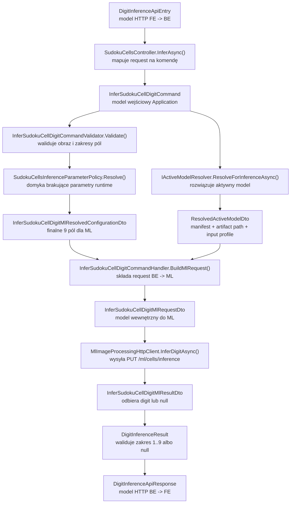
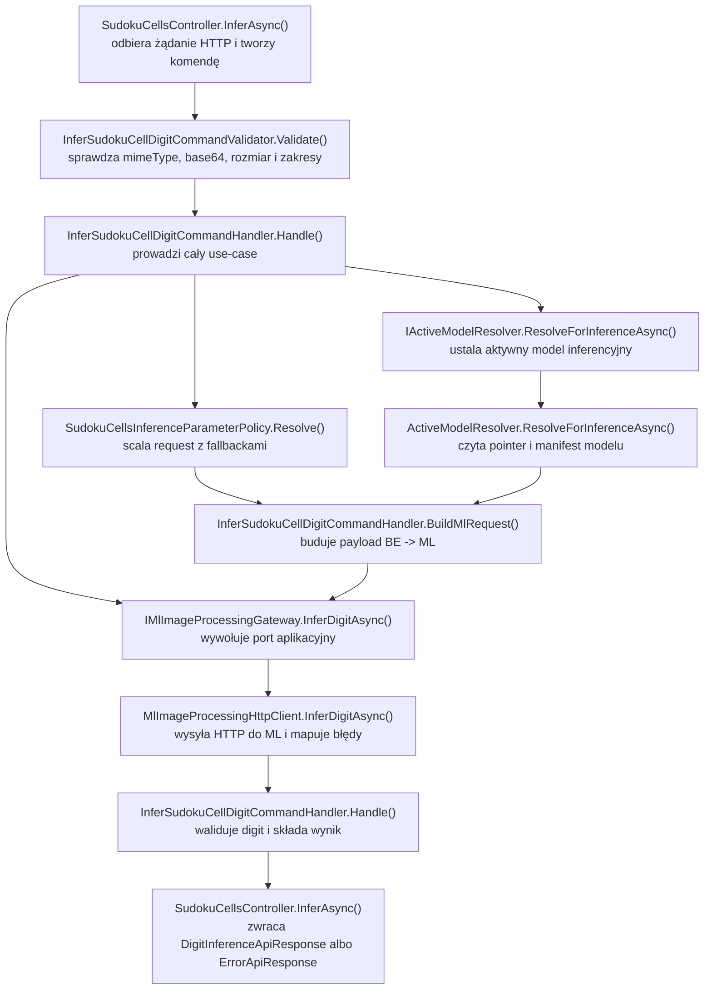

# UC-22-BE - Plan implementacyjny dla `PUT /api/sudoku/cells/inference`

## 1) Przeznaczenie endpointa
- Endpoint `PUT /api/sudoku/cells/inference` pozostaje publicznym krokiem runtime dla inferencji pojedynczej komórki Sudoku w ścieżce `UC-05`.
- Celem `UC-22` po stronie `BE` nie jest nowy endpoint ani zmiana odpowiedzi, tylko rozszerzenie istniejącego use-case'u o dwa nowe parametry sterujące `empty detection` oraz domknięcie walidacji i fallbacków po stronie `BE`.
- Odpowiedź publiczna pozostaje bez zmian:
  - `{ "digit": 1..9 }` dla rozpoznanej cyfry,
  - `{ "digit": null }` dla komórki pustej.
- `BE` nadal nie buduje `recognizedGrid`, nie uruchamia solvera, nie zapisuje wyniku inferencji komórki i nie wykonuje lokalnie algorytmu rozpoznania obrazu.
- `BE` pozostaje właścicielem:
  - publicznego kontraktu `FE -> BE`,
  - walidacji wejścia,
  - doboru aktywnego modelu inferencyjnego,
  - złożenia `resolvedConfiguration`,
  - mapowania błędów `ML` na stabilny kontrakt API.

## 2) Zakres i założenia
- Plan dotyczy wyłącznie części `BE`.
- Plan opiera się na `PRD`, `UC-22`, wcześniejszym `UC-05A`, `UC-14`, `UC-10`, `UC-20`, `UC-21`, architekturze backendu i aktualnym modelu deployu.
- Nie sugerujemy się bieżącym stanem `FE` ani szczegółami implementacji `ML` poza już ustalonymi kontraktami i nazwami.
- Nie zrywamy istniejących nazw klas i pól dodanych w poprzednich historyjkach.
- `UC-22` jest deltą do `UC-05A`, a nie przebudową tego endpointu od zera.
- `Application` ma pozostać miejscem logiki aplikacyjnej:
  - walidacja zakresów,
  - domykanie brakujących parametrów,
  - dobór aktywnego modelu,
  - budowa requestu `BE -> ML`.
- `Infrastructure` ma pozostać miejscem implementacji:
  - HTTP do `ML`,
  - odczyt storage aktywnego modelu,
  - odczyt rejestru modeli.

## 3) Stan wejściowy i zależność od wcześniejszych story
- `UC-05A` już ustanowiło:
  - kontroler `SudokuCellsController`,
  - kontrakty `DigitInferenceApiEntry` i `DigitInferenceApiResponse`,
  - use-case `InferSudokuCellDigitCommand`,
  - port `IMlImageProcessingGateway.InferDigitAsync(...)`,
  - integrację z aktywnym modelem z `UC-10`.
- `UC-14` już ustanowiło kierunek, że parametry funkcjonalne inferencji komórki przechodzą przez request, a nie przez osobny endpoint konfiguracyjny.
- `UC-21` i `UC-22` po stronie produktu rozdzielają:
  - `empty detection`,
  - cleaning próbki pod klasyfikację.
- Wniosek dla `BE`:
  - nie tworzymy nowego endpointu,
  - nie zmieniamy odpowiedzi,
  - rozszerzamy wyłącznie request i logikę składania `resolvedConfiguration`,
  - reużywamy istniejące porty, kontroler i resolver aktywnego modelu.

## 4) Kontrakty API i modele wejścia/wyjścia

### 4.1 FE -> BE (`PUT /api/sudoku/cells/inference`)
- Publiczny request pozostaje oparty o `DigitInferenceApiEntry`.
- Istniejące pola nie zmieniają nazw:
  - `image`
  - `emptyCellDarkPixelRatioThreshold`
  - `emptyCellInnerMarginRatio`
  - `centerAreaRatio`
  - `minComponentAreaRatio`
  - `lineArtifactMinSpanRatio`
  - `lineArtifactMaxThicknessRatio`
- `UC-22` dopisuje dwa nowe pola:
  - `emptyCellMinSegmentLengthPx`
  - `emptyCellFilteredSegmentCountThreshold`
- Rekomendacja implementacyjna:
  - zachować nazwy JSON bez zmian,
  - dopuścić brak nowych i istniejących parametrów funkcjonalnych przez użycie typów nullable w modelu wejściowym i komendzie,
  - rozróżnić "brak wartości" od jawnego `0`, aby `BE` mogło zastosować fallback zgodny z `UC-22`.

Przykładowy request:

```json
{
  "image": {
    "mimeType": "image/png",
    "base64": "iVBORw0KGgoAAA..."
  },
  "emptyCellDarkPixelRatioThreshold": 0.02,
  "emptyCellInnerMarginRatio": 0.12,
  "centerAreaRatio": 0.5,
  "minComponentAreaRatio": 0.01,
  "lineArtifactMinSpanRatio": 0.25,
  "lineArtifactMaxThicknessRatio": 0.12,
  "emptyCellMinSegmentLengthPx": 12,
  "emptyCellFilteredSegmentCountThreshold": 2
}
```

### 4.2 BE -> FE
- `200 OK` -> `DigitInferenceApiResponse`
- `400 Bad Request` -> `ErrorApiResponse`
- `409 Conflict` -> `ErrorApiResponse`
- `422 Unprocessable Entity` -> `ErrorApiResponse`
- `502 Bad Gateway` -> `ErrorApiResponse`
- `503 Service Unavailable` -> `ErrorApiResponse`
- `504 Gateway Timeout` -> `ErrorApiResponse`
- `500 Internal Server Error` -> `ErrorApiResponse`

Przykłady odpowiedzi:

```json
{
  "digit": 7
}
```

```json
{
  "digit": null
}
```

### 4.3 BE -> ML (`PUT /ml/cells/inference`)
- `BE` nie zmienia nazwy endpointu ani ogólnej struktury requestu wewnętrznego.
- `InferSudokuCellDigitMlRequestDto.ResolvedConfiguration` musi po `UC-22` zawierać 9 pól:
  - `inferenceProfileName`
  - `emptyCellInnerMarginRatio`
  - `emptyCellDarkPixelRatioThreshold`
  - `centerAreaRatio`
  - `minComponentAreaRatio`
  - `lineArtifactMinSpanRatio`
  - `lineArtifactMaxThicknessRatio`
  - `emptyCellMinSegmentLengthPx`
  - `emptyCellFilteredSegmentCountThreshold`

### 4.4 ML -> BE
- `BE` oczekuje nadal wyłącznie:
  - `digit: int | null`
- `BE` waliduje odpowiedź:
  - `null` jest legalne,
  - `1..9` jest legalne,
  - każda inna wartość jest błędem kontraktu `ML`.

## 5) Zachowanie per warstwa

### API (`Sudoku`)
- Utrzymuje `PUT /api/sudoku/cells/inference`.
- Binduje `DigitInferenceApiEntry`.
- Mapuje request na `InferSudokuCellDigitCommand`.
- Uruchamia `MediatR`.
- Mapuje wynik na `DigitInferenceApiResponse`.
- Mapuje błędy walidacji, aktywnego modelu i `ML` na `ErrorApiResponse`.
- Loguje tylko lekkie informacje diagnostyczne.
- Nie wykonuje logiki rozwiązywania aktywnego modelu, nie składa payloadu `ML` i nie podejmuje decyzji biznesowej o fallbackach.

### Application (`Application`)
- Waliduje request:
  - obraz,
  - zakresy wszystkich parametrów,
  - spójność wartości opcjonalnych.
- Domyka brakujące parametry funkcjonalne na podstawie polityki aplikacyjnej.
- Rozwiązuje aktywny model inferencyjny.
- Buduje `InferSudokuCellDigitMlRequestDto`.
- Wywołuje port `IMlImageProcessingGateway`.
- Waliduje wynik biznesowo.
- Nie implementuje HTTP, filesystemu ani szczegółów transportu.

### Domain / Models (`Models`)
- Utrzymuje neutralny model obrazu i wyniku inferencji.
- Pilnuje inwariantu `digit = null | 1..9`.
- Nie zna HTTP, `appsettings`, `HttpClient`, `ImageApiEntry` ani storage modeli.
- W `UC-22` warstwa domenowa nie wymaga nowego bogatego modelu empty detection po stronie `BE`; `BE` tylko przenosi i waliduje parametry.

### Infrastructure (`Infrastructure`)
- Reużywa istniejący `MlImageProcessingHttpClient`.
- Reużywa istniejące gatewaye aktywnego modelu i rejestru modeli.
- Serializuje request do `ML`.
- Deserializuje odpowiedź z `ML`.
- Mapuje błędy HTTP/JSON na wyjątki aplikacyjne.
- Nie podejmuje decyzji o domyślnych progach i nie interpretuje `digit = null` jako fallback systemowy.

## 6) Pliki w zakresie story per warstwa

Poniżej są wszystkie pliki po stronie `BE`, które wchodzą w zakres `UC-22` dla tego endpointu. To nie jest pełny listing całego backendu, tylko pełny listing scope tej historyjki.

### 6.1 API (`src/Backend/Sudoku/Sudoku`)
- `[UPDATE]` `Controllers/SudokuCellsController.cs`
  - dopisanie mapowania dwóch nowych pól z requestu do komendy,
  - zachowanie cienkiego kontrolera,
  - ewentualne doprecyzowanie logów i komunikatów błędów.
- `[UPDATE]` `Contracts/DigitInferenceApiEntry.cs`
  - dopisanie:
    - `EmptyCellMinSegmentLengthPx`
    - `EmptyCellFilteredSegmentCountThreshold`
  - rekomendowane przejście na typy nullable dla wszystkich parametrów funkcjonalnych, aby obsłużyć brak pola jako fallback, a nie jako `0`.
- `[REUSE]` `Contracts/DigitInferenceApiResponse.cs`
  - publiczna odpowiedź `{ digit }`, bez zmian kontraktu.
- `[REUSE]` `Contracts/ImageApiEntry.cs`
  - wejściowy model obrazu inline.
- `[REUSE]` `Contracts/ErrorApiResponse.cs`
  - wspólny model błędu HTTP.
- `[REUSE]` `Program.cs`
  - bez zmiany struktury architektonicznej; tylko jeśli będzie potrzebne dopięcie walidacji nowych opcji w `SudokuCellsInferenceOptions`.
- `[REUSE]` `appsettings.json`
  - pozostaje miejscem dla ustawień infrastrukturalnych, nie dla parametrów funkcjonalnych `UC-22`.

### 6.2 Application (`src/Backend/Sudoku/Application`)
- `[UPDATE]` `Sudoku/InferSudokuCellDigitCommand.cs`
  - dopisanie 2 nowych parametrów,
  - rekomendowane przejście na `double?` / `int?` dla parametrów funkcjonalnych.
- `[UPDATE]` `Sudoku/InferSudokuCellDigitCommandHandler.cs`
  - wykorzystanie polityki aplikacyjnej do złożenia finalnego `resolvedConfiguration`,
  - przekazanie 9 pól do `ML`,
  - utrzymanie walidacji wyniku `digit`.
- `[UPDATE]` `Sudoku/InferSudokuCellDigitCommandValidator.cs`
  - rozszerzenie o walidację zakresów wszystkich parametrów runtime, nie tylko obrazu.
- `[REUSE]` `Sudoku/InferSudokuCellDigitCommandResultDto.cs`
  - wynik use-case'u, bez zmiany kontraktu.
- `[REUSE]` `Sudoku/InferSudokuCellDigitErrorTypes.cs`
  - istniejące `errorType`; ewentualne reuse `invalid_request` dla nowych walidacji.
- `[UPDATE]` `Sudoku/InferSudokuCellDigitMlRequestDto.cs`
  - dopisanie 2 nowych pól do `InferSudokuCellDigitMlResolvedConfigurationDto`.
- `[REUSE]` `Sudoku/InferSudokuCellDigitMlResultDto.cs`
  - wynik `digit` z `ML`.
- `[UPDATE]` `Sudoku/SudokuCellsInferenceOptions.cs`
  - dodanie domyślnych wartości aplikacyjnych dla:
    - `EmptyCellMinSegmentLengthPx`
    - `EmptyCellFilteredSegmentCountThreshold`
  - pozostawienie istniejących defaultów dla:
    - `EmptyCellInnerMarginRatio`
    - `EmptyCellDarkPixelRatioThreshold`
- `[NEW]` `Sudoku/SudokuCellsInferenceParameterPolicy.cs`
  - nowa polityka aplikacyjna do:
    - rozpoznania brakujących wartości,
    - zastosowania fallbacków,
    - centralizacji zakresów,
    - przygotowania spójnego `resolvedConfiguration`.
- `[REUSE]` `Abstractions/IMlImageProcessingGateway.cs`
  - port pozostaje ten sam; bez nowego gatewaya.
- `[REUSE]` `ModelsActive/IActiveModelResolver.cs`
  - współdzielony resolver aktywnego modelu.
- `[REUSE]` `ModelsActive/ActiveModelResolver.cs`
  - istniejąca logika odczytu pointera i manifestu.
- `[REUSE]` `ModelsActive/ResolvedActiveModelDto.cs`
  - wynik resolved aktywnego modelu.
- `[REUSE]` `ModelsActive/ActiveModelNotConfiguredException.cs`
  - brak aktywnego modelu.
- `[REUSE]` `ModelsActive/ActiveModelPointerInvalidException.cs`
  - niespójny pointer.
- `[REUSE]` `ModelsActive/ActiveModelNotFoundException.cs`
  - pointer wskazuje model spoza registry.
- `[REUSE]` `ModelsActive/ActiveModelManifestInvalidException.cs`
  - manifest aktywnego modelu jest niepoprawny.
- `[REUSE]` `ModelsActive/ActiveModelCannotUseForInferenceException.cs`
  - model nie może zostać użyty do inferencji.

### 6.3 Domain / Models (`src/Backend/Sudoku/Models`)
- `[REUSE]` `Images/ImageContent.cs`
  - neutralny model obrazu przekazywanego do warstw wewnętrznych.
- `[REUSE]` `Sudoku/DigitInferenceResult.cs`
  - neutralny wynik biznesowy `digit = null | 1..9`.

### 6.4 Infrastructure (`src/Backend/Sudoku/Infrastructure`)
- `[UPDATE]` `Ml/MlImageProcessingHttpClient.cs`
  - dopisanie 2 nowych pól do kontraktu `DigitInferenceResolvedConfigurationApiContract`,
  - utrzymanie jednego klienta HTTP dla operacji obrazu.
- `[REUSE]` `Configuration/MlServiceOptions.cs`
  - ścieżka `CellInferencePath` już istnieje; bez nowego klienta i bez nowej sekcji.
- `[REUSE]` `Storage/ActiveModelPointerGateway.cs`
  - odczyt `models/active/inference.json`.
- `[REUSE]` `Storage/ModelsRegistryGateway.cs`
  - odczyt `model.json` z registry.
- `[REUSE]` `DependencyInjection.cs`
  - istniejąca rejestracja portów i HTTP clienta; bez nowej infrastruktury.

### 6.5 Workflow i konfiguracja runtime
- `[REUSE]` `.github/workflows/backend-cd.yml`
  - bez zmian strukturalnych dla `UC-22`,
  - workflow nadal podmienia tylko produkcyjny `appsettings.production.json`.
- `[REUSE]` `.github/workflows/ml-cd.yml`
  - bez zmian wynikających z części `BE`.
- `[REUSE]` `Sudoku/appsettings.production.json`
  - bez dodawania nowych zmiennych dla parametrów funkcjonalnych `UC-22`.
- `[REUSE]` `Sudoku/appsettings.local.json`
  - bez dodawania nowych kluczy, jeśli pozostajemy przy kodowych fallbackach w `SudokuCellsInferenceOptions`.

### 6.6 Testy
- `[UPDATE]` `Application.Tests/SudokuCellsControllerTests.cs`
  - scenariusze mapowania błędów i poprawnego requestu z nowymi polami.
- `[UPDATE]` `Application.Tests/InferSudokuCellDigitCommandHandlerTests.cs`
  - weryfikacja, że handler przekazuje do `ML` wszystkie 9 pól.
- `[NEW]` `Application.Tests/InferSudokuCellDigitCommandValidatorTests.cs`
  - testy zakresów, braków wartości i fallbacków polityki parametrów.

## 7) Weryfikacja usług Infrastructure i antyduplikacja
- W repo już istnieje `IMlImageProcessingGateway` oraz `MlImageProcessingHttpClient`.
- Wniosek: nie tworzyć nowego `IMlCellInferenceGateway` ani osobnego klienta tylko dla `UC-22`.
- W repo już istnieje pełna ścieżka rozwiązywania aktywnego modelu.
- Wniosek: nie duplikować logiki odczytu pointera i manifestu w handlerze `UC-22`.
- W repo już istnieje `SudokuCellsInferenceOptions`.
- Wniosek: nie tworzyć równoległej klasy defaults; rozszerzyć istniejącą klasę i dołożyć jedną politykę aplikacyjną do rozwiązywania parametrów.
- Nowa logika specyficzna dla `UC-22` ma trafić do `Application`, nie do `Infrastructure`, bo dotyczy decyzji:
  - jak rozumieć brakujące wartości,
  - jakie zakresy są legalne,
  - jakie wartości domyślne przechodzą do `ML`.

## 8) Przepływ w obrębie BE
1. `FE` wysyła `PUT /api/sudoku/cells/inference`.
2. `SudokuCellsController.InferAsync()` binduje `DigitInferenceApiEntry`.
3. Kontroler buduje `InferSudokuCellDigitCommand`.
4. `FluentValidation` sprawdza:
   - obraz,
   - zakresy parametrów jawnie podanych,
   - spójność pustych i niepustych wartości.
5. `InferSudokuCellDigitCommandHandler.Handle()` pobiera aktywny model przez `IActiveModelResolver`.
6. Handler dekoduje obraz i buduje `ImageContent`.
7. `SudokuCellsInferenceParameterPolicy.Resolve(...)` składa finalny zestaw 9 parametrów:
   - część z requestu,
   - część z fallbacków `SudokuCellsInferenceOptions`.
8. Handler buduje `InferSudokuCellDigitMlRequestDto`.
9. `IMlImageProcessingGateway.InferDigitAsync(...)` wysyła request do `ML`.
10. `MlImageProcessingHttpClient` mapuje odpowiedź lub wyjątek techniczny.
11. Handler waliduje `digit`.
12. Kontroler mapuje wynik na `DigitInferenceApiResponse`.

## 9) Wyjątki, fallbacki i zachowanie błędowe

### 9.1 Statusy publiczne
- `200 OK`
  - poprawny request,
  - aktywny model istnieje,
  - `ML` zwróciło `digit = null | 1..9`.
- `400 Bad Request`
  - brak `mimeType`,
  - zły `mimeType`,
  - niepoprawny `base64`,
  - zbyt duży obraz,
  - parametr spoza zakresu,
  - `emptyCellMinSegmentLengthPx <= 0`,
  - `emptyCellFilteredSegmentCountThreshold <= 0`.
- `409 Conflict`
  - brak aktywnego modelu,
  - uszkodzony pointer,
  - manifest niespójny,
  - model nie może być użyty do inferencji.
- `422 Unprocessable Entity`
  - `ML` odrzuciło obraz jako nieprzetwarzalny.
- `502 Bad Gateway`
  - `ML` zwróciło zły JSON,
  - `ML` zwróciło payload niezgodny z kontraktem,
  - `digit` spoza zakresu.
- `503 Service Unavailable`
  - `ML` jest niedostępne.
- `504 Gateway Timeout`
  - `ML` nie odpowiedziało w czasie.
- `500 Internal Server Error`
  - błąd techniczny `BE`, którego nie da się sprowadzić do kontraktu biznesowego.

### 9.2 Fallbacki
- Jest dozwolony fallback tylko dla brakujących parametrów funkcjonalnych.
- Fallback nie dotyczy:
  - aktywnego modelu,
  - wyniku `digit`,
  - niedostępności `ML`.
- Nie wolno:
  - zamieniać awarii na `digit = null`,
  - cicho podmieniać aktywnego modelu,
  - robić lokalnej inferencji w `BE`,
  - wywoływać `ML` z pominięciem resolved konfiguracji.

### 9.3 Zakresy rekomendowane do spójności z `ML`
- `EmptyCellInnerMarginRatio` w zakresie `[0.0, 0.5)`.
- `EmptyCellDarkPixelRatioThreshold` w zakresie `[0.0, 1.0]`.
- `CenterAreaRatio` w zakresie `[0.0, 1.0]`.
- `MinComponentAreaRatio` w zakresie `[0.0, 1.0]`.
- `LineArtifactMinSpanRatio` w zakresie `[0.0, 1.0]`.
- `LineArtifactMaxThicknessRatio` w zakresie `[0.0, 1.0]`.
- `EmptyCellMinSegmentLengthPx > 0`.
- `EmptyCellFilteredSegmentCountThreshold > 0`.

## 10) Specyficzna logika i pseudokod

### 10.1 Rozwiązywanie parametrów runtime

```text
resolveParameters(command, options):
  return {
    inferenceProfileName = options.InferenceProfileName,
    emptyCellInnerMarginRatio =
      command.EmptyCellInnerMarginRatio ?? options.EmptyCellInnerMarginRatio,
    emptyCellDarkPixelRatioThreshold =
      command.EmptyCellDarkPixelRatioThreshold ?? options.EmptyCellDarkPixelRatioThreshold,
    centerAreaRatio =
      command.CenterAreaRatio ?? defaultCenterAreaRatio,
    minComponentAreaRatio =
      command.MinComponentAreaRatio ?? defaultMinComponentAreaRatio,
    lineArtifactMinSpanRatio =
      command.LineArtifactMinSpanRatio ?? defaultLineArtifactMinSpanRatio,
    lineArtifactMaxThicknessRatio =
      command.LineArtifactMaxThicknessRatio ?? defaultLineArtifactMaxThicknessRatio,
    emptyCellMinSegmentLengthPx =
      command.EmptyCellMinSegmentLengthPx ?? options.EmptyCellMinSegmentLengthPx,
    emptyCellFilteredSegmentCountThreshold =
      command.EmptyCellFilteredSegmentCountThreshold ?? options.EmptyCellFilteredSegmentCountThreshold
  }
```

### 10.2 Handler use-case'u

```text
handle(command):
  ensureValidated(command)

  activeModel = activeModelResolver.ResolveForInferenceAsync()
  imageBytes = base64Decode(command.Base64)
  image = ImageContent(command.MimeType, imageBytes)

  resolvedConfiguration = parameterPolicy.Resolve(command, options)

  mlRequest = BuildMlRequest(
    image,
    activeModel,
    resolvedConfiguration
  )

  mlResult = mlImageProcessingGateway.InferDigitAsync(mlRequest)

  if mlResult.Digit is not null and mlResult.Digit not in 1..9:
    throw MlOperationFailedException("ml_invalid_response")

  return InferSudokuCellDigitCommandResultDto(mlResult.Digit)
```

### 10.3 Uwagi projektowe do pseudokodu
- Jeśli istniejące 4 pola:
  - `centerAreaRatio`
  - `minComponentAreaRatio`
  - `lineArtifactMinSpanRatio`
  - `lineArtifactMaxThicknessRatio`
  już mają gdzie indziej ustalone domyślne wartości, należy reuse'ować te same nazwy i semantykę.
- Jeśli takich defaultów nie ma, trzeba je dodać centralnie w `SudokuCellsInferenceOptions` albo w `SudokuCellsInferenceParameterPolicy`, ale bez zmiany nazw pól kontraktu.

## 11) Główne funkcje
- `SudokuCellsController.InferAsync(...)`
- `InferSudokuCellDigitCommandValidator.Validate(...)`
- `InferSudokuCellDigitCommandHandler.Handle(...)`
- `InferSudokuCellDigitCommandHandler.BuildMlRequest(...)`
- `SudokuCellsInferenceParameterPolicy.Resolve(...)`
- `SudokuCellsInferenceParameterPolicy.ValidateResolved(...)`
- `IActiveModelResolver.ResolveForInferenceAsync(...)`
- `ActiveModelResolver.ResolveForInferenceAsync(...)`
- `IMlImageProcessingGateway.InferDigitAsync(...)`
- `MlImageProcessingHttpClient.InferDigitAsync(...)`

## 12) Workflow GitHub i konfiguracja runtime
- `UC-22` po stronie `BE` nie wymaga nowego workflow ani nowego endpointu deployowego.
- `backend-cd.yml` nadal ma zmieniać wyłącznie produkcyjny `appsettings.production.json`.
- Lokalnie wartości środowiskowo-infrastrukturalne pozostają wpisane na sztywno w lokalnym configu.
- Dla `UC-22` nie dokładamy nowych GitHub Variables dla parametrów funkcjonalnych requestu, bo to byłoby sprzeczne z kierunkiem `UC-14`.
- Nowe dwa parametry segmentowe mają być przekazywane przez request `FE -> BE -> ML`, a nie przez workflow.
- Jeśli potrzebne są fallbacki dla brakujących parametrów, trzymamy je po stronie `BE` w typed options / polityce aplikacyjnej, a nie jako osobny mechanizm deployowy.

## 13) Logging
- `Information`
  - rozpoczęcie inferencji pojedynczej komórki,
  - resolved `modelName`,
  - zakończenie inferencji z wynikiem `digit` lub `null`.
- `Warning`
  - brak aktywnego modelu,
  - pointer niespójny,
  - manifest niepoprawny,
  - request z nieprawidłowymi parametrami,
  - `ML` zwróciło `422`.
- `Error`
  - niedostępność `ML`,
  - timeout `ML`,
  - niepoprawny payload `ML`,
  - błąd odczytu pointera.
- Guardraile logowania:
  - nie logować `base64`,
  - nie logować pełnego payloadu request/response,
  - nie logować całych ścieżek artefaktów modelu w odpowiedzi API,
  - logować tylko lekkie dane: `errorType`, `modelName`, status `ML`, skrócony powód.

## 14) Kolejność implementacji kodu
1. Zaktualizować `DigitInferenceApiEntry.cs`.
2. Zaktualizować `InferSudokuCellDigitCommand.cs`.
3. Rozszerzyć `InferSudokuCellDigitMlRequestDto.cs`.
4. Rozszerzyć `SudokuCellsInferenceOptions.cs`.
5. Dodać `SudokuCellsInferenceParameterPolicy.cs`.
6. Rozszerzyć `InferSudokuCellDigitCommandValidator.cs`.
7. Rozszerzyć `InferSudokuCellDigitCommandHandler.cs`.
8. Zaktualizować `SudokuCellsController.cs`.
9. Zaktualizować `MlImageProcessingHttpClient.cs`.
10. Zaktualizować testy handlera i kontrolera.
11. Dodać testy walidatora / polityki parametrów.
12. Zweryfikować, że nie ma potrzeby zmiany `backend-cd.yml`.

## 15) Guardraile implementacyjne
- Nie tworzyć nowego kontrolera ani minimal API.
- Nie tworzyć nowego gatewaya do `ML`.
- Nie przenosić logiki fallbacków do `Infrastructure`.
- Nie zmieniać odpowiedzi `DigitInferenceApiResponse`.
- Nie zmieniać nazw istniejących pól requestu.
- Nie mapować awarii systemu na `digit = null`.
- Nie przenosić aktywnego modelu do requestu z `FE`.
- Nie dodawać nowych zmiennych workflow dla parametrów funkcjonalnych `UC-22`.
- Nie hardcodować ścieżki `ML` w handlerze.
- Nie dublować walidacji w kontrolerze i handlerze; walidacja ma przejść przez `FluentValidation` i politykę aplikacyjną.

## 16) Zależności pomiędzy historyjkami
- Wejściowe:
  - `UC-05A` - ustanawia endpoint i podstawowy kontrakt.
  - `UC-10` - aktywny model inferencyjny.
  - `UC-14` - parametry funkcjonalne idą przez request.
  - `UC-20` - korzysta z tego samego endpointu dalej w flow runtime.
  - `UC-21` - rozdziela cleaning datasetowy od runtime inferencji.
- Równoległe:
  - plan `ML UC-22` dla `PUT /ml/cells/inference`.
- Wyjściowe:
  - `UC-05B` i kolejne kroki solve konsumują nadal tylko `digit` albo `null`.

## 17) Mermaid flowchart - flow modeli



## 18) Mermaid flowchart - logika aplikacji z funkcjami



## 19) Podsumowanie decyzji architektonicznych
- `UC-22` po stronie `BE` jest rozszerzeniem istniejącego endpointu, nie nową funkcją transportową.
- `BE` ma dopisać dwa nowe pola segmentowe i zagwarantować spójne `resolvedConfiguration`.
- `Application` odpowiada za walidację, fallbacki i złożenie konfiguracji.
- `Infrastructure` odpowiada wyłącznie za I/O i HTTP.
- Workflow `backend-cd.yml` pozostaje bez zmian strukturalnych, bo nowe pola są funkcjonalne i płyną przez request.
- Kontrakt odpowiedzi publicznej pozostaje stabilny i zgodny z wcześniejszymi story.
