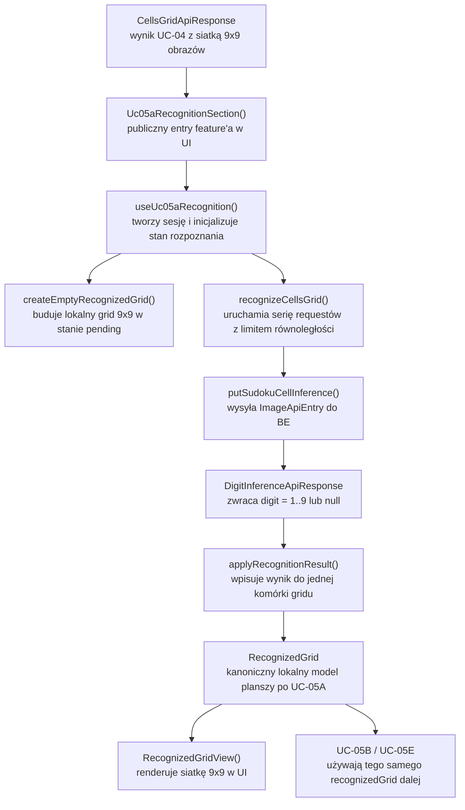
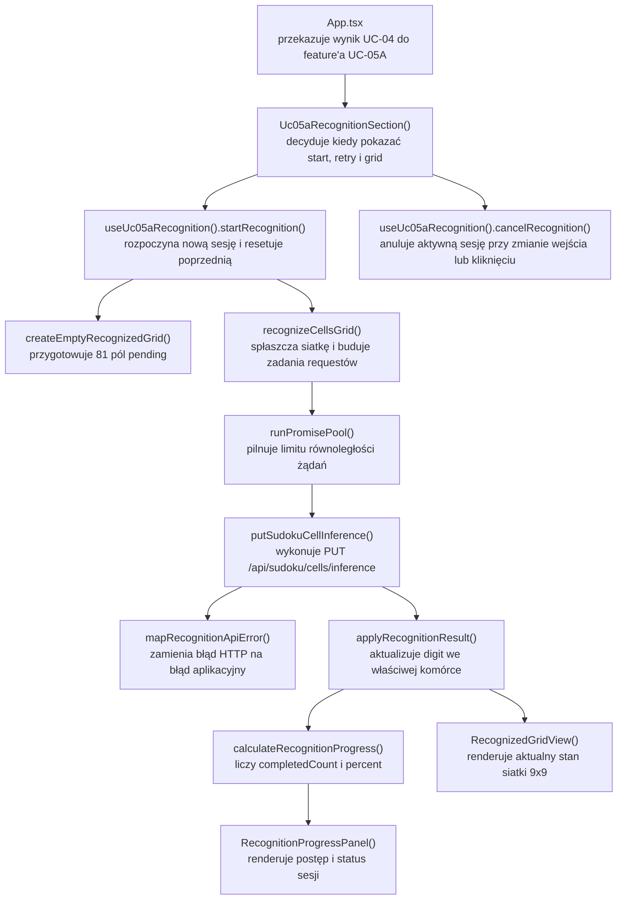

# UC-05A-FE - Plan implementacyjny dla `PUT /api/sudoku/cells/inference`

## 1) Przeznaczenie endpointa
- Z perspektywy `FE` endpoint `PUT /api/sudoku/cells/inference` realizuje pojedynczy krok rozpoznania: `jedna komórka obrazu -> jedna odpowiedź { digit }`.
- `FE` nie buduje dodatkowego endpointu pośredniego do rysowania siatki 9x9. Po scaleniu dawnego `UC-05C` do `UC-05A` to sam frontend:
  - bierze `CellsGridApiResponse` z `UC-04`,
  - tworzy lokalny `recognizedGrid`,
  - uzupełnia go odpowiedziami z `PUT /api/sudoku/cells/inference`,
  - renderuje ten sam grid jako bazę pod `UC-05B` i później `UC-05E`.
- Endpoint pozostaje publiczną częścią ścieżki solve i nie wymaga tokenu administracyjnego z `UC-13`.
- `FE` komunikuje się wyłącznie z `BE`; nie ma bezpośrednich wywołań do `ML`.

## 2) Zakres i założenia
- Plan dotyczy wyłącznie części `FE`.
- Punkty odniesienia:
  - `PRD`,
  - `UC-04`,
  - `UC-05`,
  - `UC-05A`,
  - notka scalająca `UC-05C`,
  - `UC-05B`,
  - `UC-05E`,
  - `UC-06`, `UC-11`, `UC-12`, `UC-13`,
  - istniejące konwencje `src/Frontend`.
- Nie sugerujemy się aktualnym stanem implementacji `BE` ani `ML`; plan opiera się na kontraktach i architekturze docelowej.
- `UC-05A` po stronie `FE` ma obsłużyć:
  - uruchomienie rozpoznania dla 81 komórek,
  - ograniczoną równoległość wywołań,
  - progres rozpoznania,
  - budowę `recognizedGrid`,
  - podstawowy widok siatki 9x9,
  - gotowość do przekazania tego samego gridu do `UC-05B` i `UC-05E`.
- Nie wchodzi jeszcze:
  - solver,
  - `SignalR` dla backtrackingu,
  - overlay graficzny,
  - ręczna edycja komórek jako osobny workflow biznesowy.
- Wariant `MVP` pozostaje zgodny z dokumentacją `UC-05A`: `FE` wysyła pojedyncze komórki osobno, ale nie robi tego sekwencyjnie 1-po-1, tylko przez kontrolowany pool równoległości.

## 3) Kontrakt `FE -> BE`

### 3.1 Endpoint
- Metoda i ścieżka: `PUT /api/sudoku/cells/inference`
- Request body: `ImageApiEntry`
- Response success: `DigitInferenceApiResponse`
- Response error: `ErrorApiResponse`

### 3.2 Request

```json
{
  "mimeType": "image/png",
  "base64": "iVBORw0KGgoAAA..."
}
```

### 3.3 Response sukcesu

```json
{
  "digit": 7
}
```

albo

```json
{
  "digit": null
}
```

### 3.4 Response błędów
- `400 Bad Request` -> niepoprawny obraz komórki lub zły payload.
- `409 Conflict` -> brak poprawnie skonfigurowanego aktywnego modelu inferencyjnego.
- `422 Unprocessable Entity` -> komórka nie nadaje się do przetworzenia.
- `502 Bad Gateway` -> backend dostał niepoprawną odpowiedź z `ML`.
- `503 Service Unavailable` -> backend nie może aktualnie skorzystać z `ML`.
- `504 Gateway Timeout` -> timeout ścieżki `BE -> ML`.
- `500 Internal Server Error` -> błąd techniczny po stronie `BE`.

### 3.5 Model API, którego FE ma używać bez zmiany nazw
- `[REUSE]` `ImageApiEntry`
- `[NOWY]` `DigitInferenceApiResponse`
- `[REUSE]` `ErrorApiResponse`
- `[REUSE]` `CellsGridApiResponse`

## 4) Interpretacja warstw FE dla tego planu
Ponieważ plan dotyczy tylko frontendu, warstwy interpretujemy tak:

- `Api`
  - publiczny punkt wejścia feature'a do reszty aplikacji,
  - komponenty widoku, propsy, integracja z `App.tsx`.
- `Application`
  - orkiestracja use case'u,
  - zarządzanie sesją rozpoznania,
  - progres, anulowanie, retry, decyzje kiedy można przejść dalej.
- `Domain`
  - modele planszy i reguły biznesowe lokalne dla `FE`,
  - bez `fetch`, bez React API, bez `AbortController`.
- `Infrastructure`
  - wywołania HTTP do `BE`,
  - techniczne helpery współdzielone,
  - limitowanie równoległości, mapowanie błędów transportowych, helpery obrazu.

## 5) Zachowanie per warstwa

### Api
- Integruje nowy feature z istniejącym `App.tsx`.
- Dostaje gotowy `CellsGridApiResponse` z `UC-04`.
- Renderuje:
  - stan początkowy,
  - przycisk startu rozpoznania,
  - pasek postępu,
  - siatkę 9x9 z wartościami rozpoznanymi,
  - stan błędu i retry.
- Nie zawiera pętli `fetch` dla 81 komórek.
- Nie trzyma logiki budowy `recognizedGrid` poza prostym przekazaniem danych do warstwy `Application`.

### Application
- Tworzy pusty `recognizedGrid` 9x9.
- Uruchamia sesję rozpoznania na bazie `CellsGridApiResponse`.
- Ogranicza równoległość żądań, np. do `4` równoległych wywołań.
- Po każdej odpowiedzi:
  - identyfikuje pozycję komórki,
  - zapisuje `digit` do odpowiedniego pola gridu,
  - aktualizuje progres.
- Anuluje aktywną sesję, gdy:
  - użytkownik zmieni przykład,
  - użytkownik uruchomi ponownie `UC-04`,
  - użytkownik ręcznie kliknie anulowanie,
  - komponent zostanie odmontowany.
- Blokuje przejście do `UC-05B`, jeśli sesja zakończyła się błędem technicznym.
- Zachowuje `recognizedGrid` jako kanoniczny stan wejściowy dla dalszych use case'ów.

### Domain
- Definiuje semantykę komórki:
  - `digit: 1..9 | null`,
  - `source: "recognized" | "pending" | "error"`,
  - `isEditable: boolean`,
  - `isLocked: boolean`,
  - `rowIndex`,
  - `columnIndex`.
- Definiuje `RecognizedGrid` jako dokładnie 9 wierszy po 9 komórek.
- Pilnuje niezmienników lokalnych:
  - grid zawsze ma rozmiar 9x9,
  - `digit` może być tylko `null` albo `1..9`,
  - komórka nie przechodzi ze stanu `error` do `recognized` bez nowej sesji albo retry.
- Przygotowuje model zgodny z przyszłym `UC-05B` i `UC-05E`, żeby nie zmieniać nazw i struktury później.

### Infrastructure
- Wywołuje `PUT /api/sudoku/cells/inference`.
- Waliduje shape odpowiedzi z `BE`.
- Mapuje błędy transportowe i kontraktowe na jedną klasę błędu klienta.
- Udostępnia generyczny helper poola równoległości, możliwy do reuse także w innych use case'ach, jeśli później pojawią się serie niezależnych requestów.
- Udostępnia generyczny helper zamiany `ImageApiResponse` na `data:` URL, żeby nie trzymać tej logiki w `App.tsx`.

## 6) Weryfikacja istniejących usług i antyduplikacja
- W repo istnieją już wzorce klientów HTTP:
  - `src/api/examples.ts`,
  - `src/api/auth.ts`,
  - `src/api/datasets.ts`,
  - `src/api/trainings.ts`.
- W repo nie istnieje jeszcze klient dla `PUT /api/sudoku/cells/inference`.
- W repo nie istnieje też wspólny, generyczny helper do:
  - parsowania `ErrorApiResponse`,
  - walidacji JSON response,
  - budowy jednego typu błędu dla JSON API.
- Wniosek:
  - nie tworzyć logiki HTTP wewnątrz komponentu,
  - dodać nowy klient API dla `UC-05A`,
  - jeśli wprowadzamy helper wspólny, zrobić go generycznie tak, by później mógł obsłużyć też `UC-05B`, `UC-05D` i kolejne endpointy.
- W repo istnieją już użyteczne elementy do reuse:
  - `src/types/api.ts` jako centralne miejsce publicznych kontraktów HTTP,
  - `src/api/examples.ts` jako źródło komórek z `UC-04`,
  - `src/context/AdminSessionContext.tsx`, ale w `UC-05A` nie dokładamy tu żadnej zależności, bo flow jest publiczny,
  - `src/App.tsx` jako composition root.

## 7) Pliki per warstwa i odpowiedzialności

### 7.1 Api
- `[MODYFIKACJA]` `src/Frontend/src/App.tsx`
  - wpiąć nowy moduł `UC-05A` pod istniejący flow `UC-04`,
  - przekazać do feature'a wynik `cellsStageState`,
  - nie trzymać w `App.tsx` pętli rozpoznania 81 komórek.
- `[NOWY]` `src/Frontend/src/features/uc05a/api/Uc05aRecognitionSection.tsx`
  - główny komponent sekcji `UC-05A`,
  - renderowanie stanów `idle/loading/success/error/cancelled`,
  - przycisk startu, retry, anulowanie.
- `[NOWY]` `src/Frontend/src/features/uc05a/api/RecognizedGridView.tsx`
  - prezentacja siatki 9x9,
  - rozróżnienie pól pustych, rozpoznanych i jeszcze nierozpoznanych,
  - gotowość pod przyszłe oznaczenia solvera z `UC-05E`.
- `[NOWY]` `src/Frontend/src/features/uc05a/api/RecognitionProgressPanel.tsx`
  - licznik rozpoznanych komórek,
  - status sesji,
  - komunikat błędu lub sukcesu.
- `[NOWY]` `src/Frontend/src/features/uc05a/api/index.ts`
  - publiczny eksport feature'a do `App.tsx`.

### 7.2 Application
- `[NOWY]` `src/Frontend/src/features/uc05a/application/useUc05aRecognition.ts`
  - główny hook use case'u,
  - start/stop/retry rozpoznania,
  - zarządzanie `AbortController`,
  - spinanie `CellsGridApiResponse` z `recognizedGrid`.
- `[NOWY]` `src/Frontend/src/features/uc05a/application/recognizeCellsGrid.ts`
  - orkiestrator requestów dla wszystkich komórek,
  - użycie limitera równoległości,
  - callback progresu per odpowiedź.
- `[NOWY]` `src/Frontend/src/features/uc05a/application/recognitionSessionReducer.ts`
  - spójna maszyna stanów sesji rozpoznania,
  - redukcja przypadków typu `sessionStarted`, `cellRecognized`, `sessionFailed`, `sessionCancelled`, `sessionCompleted`.
- `[NOWY]` `src/Frontend/src/features/uc05a/application/recognitionSessionTypes.ts`
  - typy stanów i zdarzeń hooka.

### 7.3 Domain
- `[NOWY]` `src/Frontend/src/features/uc05a/domain/recognizedGrid.ts`
  - definicja `RecognizedGrid`, `RecognizedCell`, `RecognizedDigit`.
- `[NOWY]` `src/Frontend/src/features/uc05a/domain/gridCoordinates.ts`
  - `GridCoordinates`, helpery indeksowania `rowIndex`, `columnIndex`.
- `[NOWY]` `src/Frontend/src/features/uc05a/domain/createEmptyRecognizedGrid.ts`
  - tworzenie początkowego gridu 9x9 dla stanu `pending`.
- `[NOWY]` `src/Frontend/src/features/uc05a/domain/applyRecognitionResult.ts`
  - czysta funkcja aktualizująca jedną komórkę w gridzie.
- `[NOWY]` `src/Frontend/src/features/uc05a/domain/recognitionProgress.ts`
  - helper liczenia `completedCount`, `pendingCount`, `recognizedCount`, `emptyCount`.

### 7.4 Infrastructure
- `[MODYFIKACJA]` `src/Frontend/src/types/api.ts`
  - dodać `DigitInferenceApiResponse`,
  - nie zmieniać nazw istniejących kontraktów z `UC-04`, `UC-06`, `UC-12`, `UC-13`.
- `[NOWY]` `src/Frontend/src/api/shared/fetchJson.ts`
  - opcjonalny, ale rekomendowany wspólny helper JSON API,
  - parsowanie `ErrorApiResponse`,
  - jeden kształt błędu klienta do reuse.
- `[NOWY]` `src/Frontend/src/api/sudokuCellsInference.ts`
  - klient `PUT /api/sudoku/cells/inference`,
  - walidacja `DigitInferenceApiResponse`,
  - mapowanie błędów HTTP.
- `[NOWY]` `src/Frontend/src/features/uc05a/infrastructure/runPromisePool.ts`
  - generyczny limiter równoległości dla listy asynchronicznych zadań.
- `[NOWY]` `src/Frontend/src/shared/images/toImageDataUrl.ts`
  - helper do renderowania obrazów base64 zarówno dla `UC-04`, jak i `UC-05A`.
- `[MODYFIKACJA]` `src/Frontend/src/index.css`
  - style dla siatki rozpoznania, statusów komórek i progresu.

## 8) Docelowy przepływ w FE
1. `UC-04` zwraca `CellsGridApiResponse`.
2. `App.tsx` przekazuje siatkę komórek do `Uc05aRecognitionSection`.
3. Użytkownik uruchamia rozpoznanie albo feature startuje automatycznie po uzyskaniu siatki, zależnie od finalnej decyzji UX.
4. `useUc05aRecognition()` tworzy nową sesję:
   - resetuje poprzedni stan,
   - tworzy pusty `recognizedGrid`,
   - zakłada `AbortController`,
   - uruchamia `recognizeCellsGrid(...)`.
5. `recognizeCellsGrid(...)` buduje listę 81 zadań i uruchamia je przez limiter równoległości.
6. Każde zadanie wywołuje `putSudokuCellInference(...)` dla jednej komórki.
7. Po każdej odpowiedzi hook:
   - wpisuje `digit` do odpowiedniej pozycji,
   - zwiększa licznik progresu,
   - renderuje częściowo uzupełniony grid.
8. Po sukcesie wszystkich komórek sesja przechodzi w `completed`, a `recognizedGrid` staje się wejściem do `UC-05B`.
9. Jeśli wystąpi błąd techniczny:
   - aktywna sesja przechodzi w `failed`,
   - częściowy grid może pozostać widoczny diagnostycznie,
   - przejście do solvera jest blokowane.
10. Jeśli użytkownik zmieni przykład albo ponownie uruchomi `UC-04`, aktualna sesja jest anulowana i nie może dalej nadpisywać stanu.

## 9) Skrócony przepływ po stronie BE wymagany przez FE
Ta sekcja jest tylko kontraktowym minimum potrzebnym frontendowi, nie planem BE.

1. `FE` wysyła `ImageApiEntry` do `PUT /api/sudoku/cells/inference`.
2. `BE` waliduje payload.
3. `BE` rozwiązuje aktywny model inferencyjny.
4. `BE` wywołuje `ML`.
5. `BE` zwraca do `FE`:
   - `200 { digit }`, albo
   - `ErrorApiResponse` z właściwym statusem HTTP.

`FE` nie zakłada nic więcej:
- nie zna ścieżek runtime,
- nie zna nazwy aktywnego modelu,
- nie odczytuje `model.json`,
- nie interpretuje błędów `ML` bezpośrednio.

## 10) Główne funkcje
- `Uc05aRecognitionSection()`
- `RecognizedGridView()`
- `RecognitionProgressPanel()`
- `useUc05aRecognition()`
- `startRecognition()`
- `cancelRecognition()`
- `retryRecognition()`
- `recognizeCellsGrid()`
- `putSudokuCellInference()`
- `createEmptyRecognizedGrid()`
- `applyRecognitionResult()`
- `calculateRecognitionProgress()`
- `runPromisePool()`
- `toImageDataUrl()`

## 11) Wyjątki, fallbacki i zachowanie błędowe

### 11.1 Statusy sesji po stronie FE
- `idle`
  - brak uruchomionej sesji albo brak siatki z `UC-04`.
- `running`
  - trwa rozpoznawanie części albo wszystkich komórek.
- `completed`
  - wszystkie komórki mają finalny wynik `digit`.
- `failed`
  - co najmniej jedno wywołanie zakończyło się błędem technicznym.
- `cancelled`
  - sesja została przerwana przez użytkownika albo zmianę wejścia.

### 11.2 Mapowanie błędów HTTP na zachowanie UI
- `400`
  - potraktować jako błąd kontraktowy albo niespójność danych wejściowych,
  - pokazać komunikat techniczny,
  - sesję zakończyć jako `failed`.
- `409`
  - komunikat typu "Brak aktywnego modelu inferencyjnego albo model jest niespójny",
  - sesję zakończyć jako `failed`,
  - nie podstawiać `null` zamiast błędu.
- `422`
  - komunikat: komórka nie nadaje się do przetworzenia,
  - sesję zakończyć jako `failed`,
  - zachować częściowy grid diagnostycznie.
- `502`, `503`, `504`, `500`
  - błąd techniczny backendu lub integracji z `ML`,
  - sesję zakończyć jako `failed`,
  - umożliwić retry bez ponownego wykonywania `UC-04`, jeśli siatka komórek nadal jest w pamięci.

### 11.3 Fallbacki
- Brak fallbacku do `digit = null` w przypadku błędu technicznego.
- Brak fallbacku do wywołania `ML` bezpośrednio z `FE`.
- Brak fallbacku do lokalnego modelu w przeglądarce.
- Brak fallbacku do ręcznego zgadywania cyfry na podstawie OCR w `FE`.
- Jedyny dopuszczalny wynik biznesowy oznaczający "pusto" to `200 OK` z `digit = null`.

### 11.4 Scenariusze graniczne
- Użytkownik uruchamia nowe rozpoznanie w trakcie starego:
  - stara sesja musi zostać anulowana,
  - jej odpowiedzi nie mogą nadpisywać nowego gridu.
- Użytkownik zmienia plik przykładu podczas trwania rozpoznania:
  - anulować aktywne requesty,
  - wyczyścić stan `UC-05A`.
- Część requestów wraca po anulowaniu:
  - ignorować je na podstawie lokalnego `sessionId`.
- `digit = null`
  - traktować jako poprawny sukces dla pustej komórki, nie jako błąd.
- Grid `UC-04` nie ma 9x9
  - traktować jako błąd wejściowy feature'a i nie wysyłać requestów do `BE`.

## 12) Pseudokod specyficznej logiki

### 12.1 Orkiestracja sesji

```text
startRecognition(cellsGrid):
  assert cellsGrid has 9 rows and 9 columns

  cancelPreviousSessionIfExists()

  sessionId = createLocalSessionId()
  controller = new AbortController()
  recognizedGrid = createEmptyRecognizedGrid()

  setState(
    status = "running",
    sessionId = sessionId,
    controller = controller,
    recognizedGrid = recognizedGrid,
    completedCount = 0,
    error = null
  )

  tasks = []
  for each cell at [rowIndex, columnIndex] in cellsGrid:
    tasks.push(() => recognizeSingleCell(sessionId, cell, rowIndex, columnIndex, controller.signal))

  runPromisePool(tasks, concurrency = 4)
    .then(() => {
      if currentSessionId != sessionId:
        return

      setState(status = "completed")
    })
    .catch(error => {
      if controller.signal.aborted:
        setState(status = "cancelled")
        return

      if currentSessionId != sessionId:
        return

      setState(
        status = "failed",
        error = mapRecognitionError(error)
      )
    })
```

### 12.2 Rozpoznanie pojedynczej komórki

```text
recognizeSingleCell(sessionId, cellImage, rowIndex, columnIndex, signal):
  response = putSudokuCellInference(cellImage, signal)

  if currentSessionId != sessionId:
    return

  updateState(previous => {
    nextGrid = applyRecognitionResult(
      previous.recognizedGrid,
      rowIndex,
      columnIndex,
      digit = response.digit
    )

    return {
      ...previous,
      recognizedGrid = nextGrid,
      completedCount = previous.completedCount + 1
    }
  })
```

### 12.3 Anulowanie

```text
cancelRecognition():
  if activeController exists:
    activeController.abort()

  setState(previous => ({
    ...previous,
    status = "cancelled"
  }))
```

## 13) Mermaid flowchart - flow modeli



## 14) Mermaid flowchart - logika aplikacji z funkcjami



## 15) Workflow GitHub i runtime
- Dla `UC-05A` nie ma potrzeby zmiany `frontend-cd.yml`, jeśli frontend dalej korzysta z istniejącego `VITE_API_BASE_URL`.
- `frontend-cd.yml` już buduje frontend z:
  - `VITE_API_BASE_URL="${FE_VITE_API_BASE_URL:-/api}"`.
- Wniosek:
  - brak nowych zmiennych środowiskowych FE dla tej historyjki,
  - brak zmian w paczkowaniu `dist/`,
  - brak zmian w deployu FE.
- Zależność środowiskowa jest po stronie `BE`, nie `FE`:
  - `backend-cd.yml` już przewiduje konfigurację `BE_ML_CELL_INFERENCE_PATH` i sekcji `SudokuCellsInference`,
  - frontend ma korzystać wyłącznie z publicznego `/api`, bez wiedzy o `ML`.
- Lokalnie:
  - `VITE_API_BASE_URL` może pozostać `/api` albo wskazywać lokalny backend,
  - nie dodawać osobnego, sztywnego env tylko dla limitu równoległości lub timeoutów `UC-05A`; to nie jest kontrakt deploymentowy.

## 16) Logging i diagnostyka FE
- Cel: ułatwić debugowanie bez spamowania konsoli 81 komunikatami na sukces.
- `console.info`
  - start sesji rozpoznania,
  - koniec sesji sukcesem,
  - anulowanie sesji.
- `console.warn`
  - `409`,
  - `422`,
  - anulowanie przez zmianę wejścia.
- `console.error`
  - `500`,
  - `502`,
  - `503`,
  - `504`,
  - niepoprawny kształt odpowiedzi JSON.
- Guardraile logowania:
  - nie logować `base64`,
  - nie logować pełnych payloadów obrazów,
  - nie logować sukcesu każdej pojedynczej komórki,
  - jeśli logować postęp, to najwyżej agregat, np. start / błąd / sukces końcowy.

## 17) Inne istotne reguły
- Nie tworzyć osobnego backendowego endpointu do złożenia `recognizedGrid`; to już zostało rozstrzygnięte przez scalenie `UC-05C`.
- Nie zmieniać nazw istniejących kontraktów:
  - `ImageApiEntry`,
  - `CellsGridApiResponse`,
  - `ErrorApiResponse`,
  - `AuthTokenApiResponse`.
- Nie przenosić logiki HTTP do `App.tsx` ani do komponentów widoku.
- Nie zakładać, że `digit = null` oznacza błąd.
- Nie traktować błędów technicznych jako pustych komórek.
- Nie wiązać `UC-05A` z tokenem z `UC-13`, bo to ścieżka publiczna.
- Nie projektować nowego, niezależnego modelu planszy dla `UC-05E`; ten sam `recognizedGrid` ma zostać reuse'owany później.

## 18) Kolejność implementacji kodu dla historyjki
1. Dodać `DigitInferenceApiResponse` do `src/types/api.ts`.
2. Dodać generyczny helper `src/api/shared/fetchJson.ts`, jeśli chcemy uniknąć kolejnego kopiowania parsowania błędów.
3. Dodać `src/api/sudokuCellsInference.ts`.
4. Wyciągnąć helper `toImageDataUrl()` z `App.tsx` do współdzielonego modułu.
5. Utworzyć folder feature'a `src/features/uc05a/`.
6. Dodać modele domenowe `RecognizedGrid`, `RecognizedCell`, helpery gridu i progresu.
7. Dodać warstwę `Application`:
   - reducer sesji,
   - hook,
   - orkiestrator batcha z limitowaną równoległością.
8. Dodać warstwę `Api`:
   - `Uc05aRecognitionSection`,
   - `RecognizedGridView`,
   - `RecognitionProgressPanel`.
9. Wpiąć feature do `App.tsx` pod flow `UC-04`.
10. Dodać style do `index.css`.
11. Zweryfikować ręcznie scenariusze:
   - sukces z pełnym gridem,
   - `digit = null`,
   - `409`,
   - `422`,
   - anulowanie przy zmianie przykładu.
12. Uruchomić `npm run check` i poprawić ewentualne błędy typów.

## 19) Guardraile implementacyjne
- `App.tsx` ma pozostać composition root, nie miejscem dla pełnej logiki use case'u.
- Komponenty warstwy `Api` nie wykonują `fetch`.
- Warstwa `Domain` nie importuje Reacta, `fetch`, `AbortController` ani kontraktów HTTP.
- Warstwa `Infrastructure` nie decyduje o biznesowym stanie sesji i nie buduje `recognizedGrid`.
- Nie wprowadzać nowego globalnego store tylko dla `UC-05A`; lokalny hook feature'a wystarczy.
- Nie tworzyć osobnego trybu auth dla `UC-05A`.
- Nie wysyłać batch requestu do `BE`, jeśli kontrakt use case'u nadal przewiduje pojedynczą komórkę.
- Nie nadpisywać stanu z odpowiedzi starej, anulowanej sesji.
- Nie dodawać ciężkiego telemetry/logowania per komórka.
- Nie zmieniać nazw modeli i pól ustalonych wcześniej przez `UC-04`, `UC-06`, `UC-12`, `UC-13`.

## 20) Zależności pomiędzy historyjkami
- Wejściowe:
  - `UC-04` - dostarcza `CellsGridApiResponse`.
  - `UC-05C` - potwierdza, że budowa i prezentacja `recognizedGrid` należy teraz do `UC-05A`.
  - `UC-10` - dostarcza po stronie systemu aktywny model inferencyjny, ale bez udziału `FE`.
  - `UC-13` - publiczny/demowy charakter ścieżki solve; brak obowiązku logowania.
- Wyjściowe:
  - `UC-05B` - przyjmie `recognizedGrid` zbudowany tutaj.
  - `UC-05E` - będzie aktualizował ten sam grid przez `SignalR`.
  - `UC-05D` - później użyje wyniku solve i nie zmieni kontraktu `UC-05A`.
- Powiązania z istniejącymi historiami:
  - `UC-06` uczy, że nie zmieniamy ustalonych nazw kontraktów i statusów bez potrzeby.
  - `UC-11`, `UC-12`, `UC-13` pokazują obowiązujący styl klientów `api/*`, typów `types/api.ts` i obsługi `ErrorApiResponse`.

## 21) Model API wejściowy i wyjściowy w komunikacji z BE

### FE -> BE
- `ImageApiEntry`
  - `mimeType: string`
  - `base64: string`

### BE -> FE
- `DigitInferenceApiResponse`
  - `digit: number | null`
- `ErrorApiResponse`
  - `errorType: string`
  - `message: string`

### Lokalny model domenowy FE
- `RecognizedCell`
  - `rowIndex: number`
  - `columnIndex: number`
  - `digit: number | null`
  - `source: "pending" | "recognized" | "error"`
  - `isEditable: boolean`
  - `isLocked: boolean`
- `RecognizedGrid`
  - `RecognizedCell[][]`

## 22) Rekomendacja nazewnicza plików i symboli
- klient API: `putSudokuCellInference`
- błąd klienta API: `SudokuCellInferenceApiError`
- hook use case'u: `useUc05aRecognition`
- sekcja widoku: `Uc05aRecognitionSection`
- model domenowy: `RecognizedGrid`
- pojedyncza komórka: `RecognizedCell`
- reducer: `recognitionSessionReducer`
- helper batcha: `runPromisePool`

## 23) Podsumowanie decyzji architektonicznych
- `FE` pozostaje właścicielem `recognizedGrid`.
- `BE` rozpoznaje tylko jedną komórkę na request.
- `UC-05A` reuse'uje wynik `UC-04` i nie tworzy nowego źródła prawdy.
- Nowy feature powinien zostać dodany warstwowo, najlepiej w pierwszym folderze `src/features/uc05a/`, bez wymuszania dużego refaktoru całego FE.
- Komunikacja z `BE` ma pozostać cienka i zgodna z istniejącym stylem `api/*` + `types/api.ts`.
- Limit równoległości ma zostać rozwiązany po stronie `Application`, a nie przez zmiany workflow czy środowiska.
- Dokument nie zakłada zmian w `frontend-cd.yml`; ewentualne wymagania runtime pozostają po stronie `BE`.
