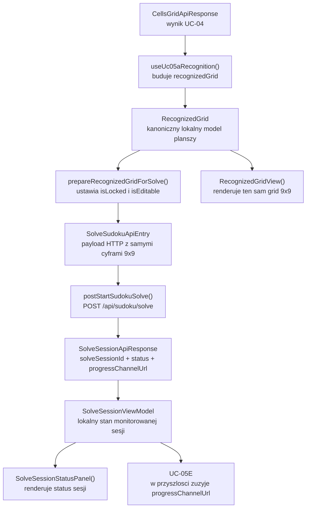
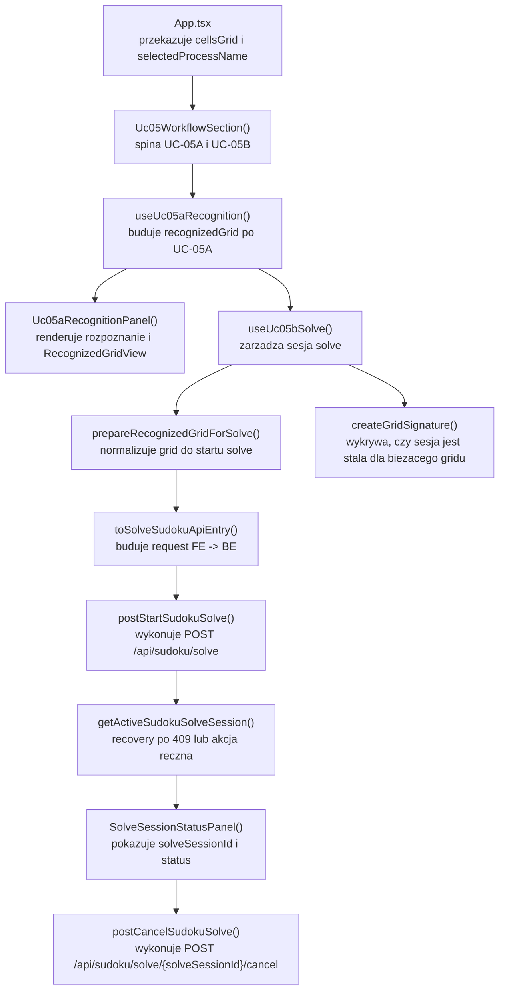

# UC-05B-FE - Plan implementacyjny dla `POST /api/sudoku/solve`

## 1) Przeznaczenie endpointa
- Z perspektywy `FE` endpoint `POST /api/sudoku/solve` uruchamia asynchroniczna sesje rozwiazywania sudoku dla juz zbudowanego `recognizedGrid` z `UC-05A`.
- `FE` nie oczekuje tu synchronicznego `solvedGrid`. Odpowiedz `202 Accepted` oznacza tylko: "sesja solve zostala przyjeta i ma publiczny identyfikator".
- `FE` komunikuje sie wyłącznie z `BE`; nie ma bezposrednich wywolan do `ML`.
- `UC-05C` jest juz scalone, wiec `UC-05B-FE` nie tworzy drugiego modelu planszy ani drugiego endpointu do rysowania siatki. Reuse'ujemy ten sam `recognizedGrid`, ktory powstal w `UC-05A`.
- Zakres tej historyjki po stronie `FE` obejmuje:
  - przygotowanie `recognizedGrid` do startu solvera,
  - wywolanie `POST /api/sudoku/solve`,
  - odzyskanie aktywnej sesji przez `GET /api/sudoku/solve/active`,
  - kooperacyjne anulowanie przez `POST /api/sudoku/solve/{solveSessionId}/cancel`,
  - prezentacje stanu sesji solve i gotowosc pod `UC-05E`.
- Zakres tej historyjki po stronie `FE` nie obejmuje jeszcze:
  - renderowania live krokow solve przez `SignalR`,
  - finalnego `currentGrid` lub `solvedGrid`,
  - overlay na obrazie,
  - manualnej korekty blednego gridu jako osobnego workflow.

## 2) Zakres i zalozenia
- Plan dotyczy wylacznie frontendu w `src/Frontend`.
- Punkty odniesienia:
  - `PRD`,
  - `UC-05`,
  - `UC-05A`,
  - `UC-05B`,
  - `UC-05C`,
  - `UC-05E`,
  - istniejace wzorce z `UC-06`, `UC-11`, `UC-12`, `UC-13`,
  - aktualna struktura `src/Frontend`.
- Nie sugerujemy sie tym, co jest dzisiaj zaimplementowane po stronie `BE` ani `ML`; plan bazuje na kontraktach i docelowym przeplywie produktu.
- `UC-05B-FE` ma korzystac z juz istniejacego `recognizedGrid` z `UC-05A`, zamiast skladac grid od nowa z `CellsGridApiResponse`.
- `UC-05B-FE` ma respektowac kontrakty i nazwy ustalone juz wczesniej:
  - `RecognizedGrid`,
  - `RecognizedCell`,
  - `solveSessionId`,
  - `progressChannelUrl`,
  - `ErrorApiResponse`.
- `UC-05B-FE` ma byc gotowe pod `UC-05E`, ale nie ma symulowac live solve przed dodaniem `SignalR`.
- `UC-05B-FE` nie powinno automatycznie pobierac aktywnej sesji na kazdym mount. To byloby mylace, bo `GET /api/sudoku/solve/active` nie niesie `inputGrid`, wiec po odswiezeniu nie da sie potwierdzic, czy aktywna sesja dotyczy aktualnie widocznego gridu.
- Rekomendowane zachowanie:
  - `GET /api/sudoku/solve/active` uruchamiamy jawnie przyciskiem "Odzyskaj aktywna sesje",
  - albo automatycznie tylko jako recovery po `409 Conflict` z endpointu startowego.

## 3) Kontrakt `FE -> BE`

### 3.1 `POST /api/sudoku/solve`
- Request body: `SolveSudokuApiEntry`
- Success: `202 Accepted` -> `SolveSessionApiResponse`
- Error: `ErrorApiResponse`

Przyklad requestu:

```json
{
  "grid": [
    [5, 3, null, null, 7, null, null, null, null],
    [6, null, null, 1, 9, 5, null, null, null],
    [null, 9, 8, null, null, null, null, 6, null],
    [8, null, null, null, 6, null, null, null, 3],
    [4, null, null, 8, null, 3, null, null, 1],
    [7, null, null, null, 2, null, null, null, 6],
    [null, 6, null, null, null, null, 2, 8, null],
    [null, null, null, 4, 1, 9, null, null, 5],
    [null, null, null, null, 8, null, null, 7, 9]
  ]
}
```

Przyklad odpowiedzi:

```json
{
  "solveSessionId": "solve-20260515-184000-demo-01",
  "status": "queued",
  "progressChannelUrl": "/ws/sudoku/solving/solve-20260515-184000-demo-01"
}
```

Oczekiwane bledy:
- `400 Bad Request` -> payload nie ma poprawnego ksztaltu 9x9.
- `409 Conflict` -> istnieje juz aktywna sesja solve.
- `422 Unprocessable Entity` -> grid jest nielegalny biznesowo, np. lamie reguly sudoku.
- `500 Internal Server Error` -> blad techniczny backendu.

### 3.2 `GET /api/sudoku/solve/active`
- Success:
  - `200 OK` -> `SolveSessionApiResponse`
  - `204 No Content`
- Error: `ErrorApiResponse`

Semantyka po stronie `FE`:
- `200` oznacza: istnieje aktywna sesja i mozna przelaczyc UI do jej monitoringu.
- `204` oznacza tylko: nie ma aktywnej sesji.
- `204` nie oznacza automatycznie sukcesu solve, bo `UC-05B` nie ma jeszcze kontraktu na finalny wynik sesji.

### 3.3 `POST /api/sudoku/solve/{solveSessionId}/cancel`
- Success: `202 Accepted` -> `CancelSolveSessionApiResponse`
- Error: `ErrorApiResponse`

Minimalny kontrakt odpowiedzi:

```json
{
  "status": "cancelling",
  "requestDisposition": "accepted"
}
```

Uwagi:
- `requestDisposition` traktujemy jako `string`, bez usztywniania wszystkich wartosci po stronie `FE`.
- `status` moze byc `null`, jesli backend przyjal no-op dla niedopasowanej lub juz zakonczonej sesji.

### 3.4 Modele API, ktorych `FE` ma uzywac bez zmiany nazw
- `[NOWY]` `SolveSudokuApiEntry`
- `[NOWY]` `SolveSessionApiResponse`
- `[NOWY]` `CancelSolveSessionApiResponse`
- `[REUSE]` `ErrorApiResponse`
- `[REUSE]` `DigitInferenceApiResponse`
- `[REUSE]` `RecognizedGrid` jako kanoniczny lokalny model planszy w UI

## 4) Interpretacja warstw FE dla tego planu
Poniewaz plan dotyczy tylko frontendu, warstwy interpretujemy tak:

- `Api`
  - publiczny entry point feature'a i komponenty widoku,
  - integracja z `App.tsx`,
  - renderowanie panelu solve, stanu sesji i reuse gridu z `UC-05A`.
- `Application`
  - orkiestracja use case'u:
    - start solve,
    - recovery po `409`,
    - manualne odzyskanie aktywnej sesji,
    - cancel,
    - blokowanie niedozwolonych akcji.
- `Domain`
  - transformacje i walidacje lokalne na `RecognizedGrid`,
  - przygotowanie gridu do solve,
  - budowa requestu HTTP,
  - reguly statusow sesji.
- `Infrastructure`
  - klient HTTP do `BE`,
  - walidacja ksztaltu odpowiedzi JSON,
  - mapowanie bledow transportowych i kontraktowych.

## 5) Zachowanie per warstwa

### Api
- Wprowadza wspolny ekran `UC-05` jako kompozycje:
  - panelu `UC-05A`,
  - panelu `UC-05B`.
- Renderuje przyciski:
  - `Start solve`,
  - `Odzyskaj aktywna sesje`,
  - `Anuluj solve`.
- Reuse'uje ten sam widok gridu 9x9 z `UC-05A`; nie buduje drugiego komponentu planszy tylko dla solvera.
- Pokazuje:
  - czy grid jest gotowy do solve,
  - `solveSessionId`,
  - status sesji,
  - czy sesja jest "stala" wobec aktualnie widocznego gridu,
  - blad startu / recovery / cancel.
- Nie wykonuje `fetch`.
- Nie transformuje `RecognizedGrid` do `SolveSudokuApiEntry`.

### Application
- Odbiera `recognizedGrid` z `UC-05A`.
- Dopuszcza start solve tylko wtedy, gdy:
  - `UC-05A` zakonczylo sie sukcesem,
  - grid nie ma komorek `pending` ani `error`,
  - nie trwa juz aktywna operacja startu albo cancel.
- Przy starcie solve:
  - normalizuje grid do stanu "solve-ready",
  - zamienia go na `SolveSudokuApiEntry`,
  - zapamietuje podpis (signature) gridu,
  - wywoluje `POST /api/sudoku/solve`.
- Przy `409 Conflict` automatycznie probuje `GET /api/sudoku/solve/active`.
- Umozliwia jawny recovery aktywnej sesji przyciskiem.
- Umozliwia cancel tylko dla lokalnie znanej aktywnej sesji.
- Trzyma osobno:
  - lokalny stan requestu,
  - ostatnia znana sesje backendowa,
  - blad operacji,
  - flage `isSessionStaleForCurrentGrid`.
- Nie udaje finalnego wyniku solve bez `UC-05E`.

### Domain
- Reuse'uje istniejacy `RecognizedGrid` z `UC-05A` jako jedyny model planszy po stronie `FE`.
- Nie tworzy drugiego modelu typu `SudokuGridViewModel`, jesli nie daje on nowej wartosci biznesowej.
- Dodaje czyste funkcje:
  - przygotowanie gridu do solve (`isLocked`, `isEditable`),
  - walidacja, czy grid nadaje sie do startu,
  - transformacja do `SolveSudokuApiEntry`,
  - klasyfikacja statusow sesji (`active`, `terminal`),
  - tworzenie lekkiego podpisu gridu dla wykrywania stalej sesji.
- Nie zna:
  - `fetch`,
  - `AbortController`,
  - React hookow,
  - `console`,
  - `SignalR`.

### Infrastructure
- Dodaje nowy klient `src/api/sudokuSolve.ts` dla wszystkich endpointow `UC-05B`.
- Reuse'uje istniejacy `fetchJson()` z `src/api/shared/fetchJson.ts`.
- Waliduje shape:
  - `SolveSessionApiResponse`,
  - `CancelSolveSessionApiResponse`.
- Mapuje `ErrorApiResponse` na jeden typ bledu klienta `SudokuSolveApiError`.
- Nie trzyma:
  - logiki 409 -> recovery,
  - reguly "kiedy wolno kliknac Start solve",
  - reguly stalego gridu,
  - biznesowego stanu sesji.

## 6) Weryfikacja istniejacych uslug i antyduplikacja
- W repo juz istnieje generyczny helper JSON API:
  - `src/Frontend/src/api/shared/fetchJson.ts`
  - wniosek: nie tworzyc drugiego helpera parsowania `ErrorApiResponse`.
- W repo juz istnieje klient `src/Frontend/src/api/sudokuCellsInference.ts`.
  - wniosek: nie dopisywac solve do klienta `UC-05A`; stworzyc osobny `src/api/sudokuSolve.ts`, bo endpointy i bledy sa inne.
- W repo juz istnieje caly feature `UC-05A`:
  - `useUc05aRecognition()`,
  - `RecognizedGrid`,
  - `RecognizedGridView`,
  - `RecognitionProgressPanel`.
  - wniosek: `UC-05B` ma konsumowac gotowy wynik `UC-05A`, a nie ponownie skladac grid z obrazkow komorek.
- `UC-05C` zostalo scalone.
  - wniosek: nie tworzyc osobnego gridu "solverowego" tylko po to, by cos wyswietlic.
- W repo istnieje juz wzorzec asynchronicznej sesji z `UC-06`:
  - `202 Accepted`,
  - `progressChannelUrl`,
  - recovery po `409`,
  - endpoint `active`,
  - endpoint `cancel`.
  - wniosek: reuse semantyki UX, ale nie kopiowac 1:1 kodu `Uc06TrainingSection.tsx`, bo `UC-05B` ma byc feature'em warstwowym.
- W repo jest juz zaleznosc `@microsoft/signalr` z `UC-06`.
  - wniosek: dla `UC-05B` nie dodajemy nowej zaleznosci. Realtime nalezy do `UC-05E`.
- W `UC-06` istnieje lokalny helper `buildHubUrl()`.
  - wniosek: nie wydzielac go w `UC-05B`, bo ta historyjka jeszcze nie laczy sie z websocketem. Ekstrakcje zrobic dopiero przy `UC-05E`, jesli bedzie potrzebna.

## 7) Pliki per warstwa i odpowiedzialnosci

### 7.1 Api
- `[NOWY]` `src/Frontend/src/features/uc05/api/Uc05WorkflowSection.tsx`
  - kompozycyjny entry point dla `UC-05A` i `UC-05B`,
  - utrzymuje wspolny przeplyw `cellsGrid -> recognizedGrid -> solve session`,
  - przekazuje `recognizedGrid` do panelu solve bez wynoszenia calej logiki do `App.tsx`.
- `[NOWY]` `src/Frontend/src/features/uc05/api/index.ts`
  - eksport `Uc05WorkflowSection` do `App.tsx`.
- `[NOWY]` `src/Frontend/src/features/uc05a/api/Uc05aRecognitionPanel.tsx`
  - czysto prezentacyjna wersja panelu `UC-05A`,
  - renderuje stan i akcje przekazane z zewnatrz,
  - pozwala reuse'owac UI `UC-05A` we wspolnym workspace.
- `[MODYFIKACJA]` `src/Frontend/src/features/uc05a/api/Uc05aRecognitionSection.tsx`
  - zostaje cienkim wrapperem standalone:
    - korzysta z `useUc05aRecognition()`,
    - deleguje render do `Uc05aRecognitionPanel`.
- `[REUSE]` `src/Frontend/src/features/uc05a/api/RecognizedGridView.tsx`
  - dalej renderuje ten sam grid 9x9,
  - wymaga lekkiego rozszerzenia wizualnego o styl "pole zablokowane" vs "pole solvera", ale bez zmiany jego podstawowej odpowiedzialnosci.
- `[REUSE]` `src/Frontend/src/features/uc05a/api/RecognitionProgressPanel.tsx`
  - zostaje bez zmian merytorycznych dla panelu rozpoznania.
- `[NOWY]` `src/Frontend/src/features/uc05b/api/Uc05bSolveSection.tsx`
  - glowny panel `UC-05B`,
  - renderowanie przyciskow start/recover/cancel,
  - komunikaty o gotowosci gridu,
  - komunikaty o stalej sesji.
- `[NOWY]` `src/Frontend/src/features/uc05b/api/SolveSessionStatusPanel.tsx`
  - renderowanie `solveSessionId`, statusu, `progressChannelUrl`, bledow i wskazowek UX.
- `[MODYFIKACJA]` `src/Frontend/src/App.tsx`
  - zamiast bezposrednio renderowac tylko `Uc05aRecognitionSection`, wpina `Uc05WorkflowSection`,
  - nadal pozostaje composition root, ale nie staje sie miejscem dla logiki solve.

### 7.2 Application
- `[REUSE]` `src/Frontend/src/features/uc05a/application/useUc05aRecognition.ts`
  - dalej jest zrodlem prawdy dla stanu `UC-05A`.
- `[REUSE]` `src/Frontend/src/features/uc05a/application/recognitionSessionReducer.ts`
  - bez zmian kontraktowych.
- `[REUSE]` `src/Frontend/src/features/uc05a/application/recognitionSessionTypes.ts`
  - bez zmian kontraktowych.
- `[NOWY]` `src/Frontend/src/features/uc05b/application/useUc05bSolve.ts`
  - glowny hook use case'u `UC-05B`,
  - start solve,
  - recovery aktywnej sesji,
  - cancel,
  - wykrywanie stalej sesji wobec aktualnego gridu.
- `[NOWY]` `src/Frontend/src/features/uc05b/application/solveSessionReducer.ts`
  - spójna maszyna stanow sesji solve,
  - przypadki typu:
    - `startRequested`,
    - `startAccepted`,
    - `recoverRequested`,
    - `recoverSucceeded`,
    - `cancelRequested`,
    - `cancelAccepted`,
    - `sessionCleared`,
    - `sessionMarkedStale`,
    - `requestFailed`.
- `[NOWY]` `src/Frontend/src/features/uc05b/application/solveSessionTypes.ts`
  - typy stanu, bledu, akcji reducera i lekkiego view modelu sesji.

### 7.3 Domain
- `[REUSE]` `src/Frontend/src/features/uc05a/domain/recognizedGrid.ts`
  - pozostaje kanonicznym lokalnym modelem planszy dla `UC-05A`, `UC-05B` i pozniej `UC-05E`.
- `[REUSE]` `src/Frontend/src/features/uc05a/domain/gridCoordinates.ts`
  - reuse do operacji na polach 9x9.
- `[REUSE]` `src/Frontend/src/features/uc05a/domain/recognitionProgress.ts`
  - pozostaje odpowiedzialne tylko za progres rozpoznania; `UC-05B` nie dubluje tej logiki.
- `[NOWY]` `src/Frontend/src/features/uc05b/domain/prepareRecognizedGridForSolve.ts`
  - czysta funkcja normalizujaca grid po `UC-05A`:
    - pola z cyfra -> `isLocked = true`, `isEditable = false`,
    - pola puste -> `isLocked = false`, `isEditable = true`,
    - brak zgody na `pending` i `error`.
- `[NOWY]` `src/Frontend/src/features/uc05b/domain/toSolveSudokuApiEntry.ts`
  - zamienia `RecognizedGrid` na publiczny payload `SolveSudokuApiEntry`.
- `[NOWY]` `src/Frontend/src/features/uc05b/domain/solveSessionStatus.ts`
  - lokalny union statusow backendowych:
    - `queued`,
    - `running`,
    - `cancelling`,
    - `completed`,
    - `failed`,
    - `cancelled`,
  - helpery:
    - `isActiveSolveSessionStatus()`,
    - `isTerminalSolveSessionStatus()`.
- `[NOWY]` `src/Frontend/src/features/uc05b/domain/createGridSignature.ts`
  - lekki podpis aktualnego gridu na potrzeby wykrywania, czy aktywna sesja zostala wystartowana z innego stanu planszy.

### 7.4 Infrastructure
- `[MODYFIKACJA]` `src/Frontend/src/types/api.ts`
  - dodac:
    - `SolveSudokuApiEntry`,
    - `SolveSessionApiResponse`,
    - `CancelSolveSessionApiResponse`.
  - nie zmieniac nazw istniejacych modeli z `UC-05A`, `UC-06`, `UC-12`, `UC-13`.
- `[NOWY]` `src/Frontend/src/api/sudokuSolve.ts`
  - klient dla:
    - `POST /api/sudoku/solve`,
    - `GET /api/sudoku/solve/active`,
    - `POST /api/sudoku/solve/{solveSessionId}/cancel`.
  - walidacja ksztaltu odpowiedzi,
  - jeden typ bledu `SudokuSolveApiError`.
- `[REUSE]` `src/Frontend/src/api/shared/fetchJson.ts`
  - generyczny helper JSON API dla `UC-05B`.
- `[MODYFIKACJA]` `src/Frontend/src/index.css`
  - style panelu solve,
  - statusy sesji,
  - subtelne oznaczenie komorek zablokowanych i roboczych,
  - brak nowego, osobnego stylu gridu.

## 8) Docelowy przeplyw w FE
1. `UC-04` dostarcza `CellsGridApiResponse`.
2. `Uc05WorkflowSection` uruchamia `useUc05aRecognition()` i renderuje panel `UC-05A`.
3. `UC-05A` buduje `recognizedGrid`.
4. Po sukcesie `UC-05A` hook `useUc05bSolve()` otrzymuje `recognizedGrid`.
5. `prepareRecognizedGridForSolve()` normalizuje grid:
   - pola z cyframi staja sie zablokowane,
   - pola puste staja sie robocze.
6. Uzytkownik klika `Start solve`.
7. `useUc05bSolve()` buduje `SolveSudokuApiEntry` i wysyla `POST /api/sudoku/solve`.
8. Jesli backend zwroci `202`, UI zapisuje:
   - `solveSessionId`,
   - `status`,
   - `progressChannelUrl`,
   - podpis gridu, z ktorego wystartowano sesje.
9. Jesli backend zwroci `409`, `useUc05bSolve()` automatycznie probuje `GET /api/sudoku/solve/active`.
10. Uzytkownik moze tez recznie kliknac `Odzyskaj aktywna sesje`.
11. Jesli aktywna sesja istnieje, UI przechodzi w tryb monitoringu sesji, ale jeszcze bez live `SignalR`.
12. Uzytkownik moze kliknac `Anuluj solve`, co wywoluje `POST /api/sudoku/solve/{solveSessionId}/cancel`.
13. Finalny postep i finalny `currentGrid` zostana dopiete dopiero w `UC-05E`.

## 9) Skrocony przeplyw po stronie BE wymagany przez FE
Ta sekcja jest tylko kontraktowym minimum potrzebnym frontendowi.

1. `FE` wysyla `POST /api/sudoku/solve` z `SolveSudokuApiEntry`.
2. `BE` waliduje ksztalt i biznesowa poprawnosc gridu.
3. `BE` sprawdza, czy istnieje aktywna sesja solve.
4. `BE` dla sukcesu zwraca `202 Accepted` z:
   - `solveSessionId`,
   - `status`,
   - `progressChannelUrl`.
5. `BE` dla konfliktu aktywnej sesji zwraca `409 Conflict`.
6. `BE` wystawia `GET /api/sudoku/solve/active`, aby FE moglo odzyskac aktywna sesje.
7. `BE` wystawia `POST /api/sudoku/solve/{solveSessionId}/cancel`, aby FE moglo wyslac cancel.
8. Finalny sukces, porazka albo anulowanie wraca dopiero przez `SignalR` opisany w `UC-05E`.

## 10) Glowne funkcje
- `Uc05WorkflowSection()`
- `Uc05aRecognitionPanel()`
- `Uc05bSolveSection()`
- `SolveSessionStatusPanel()`
- `useUc05aRecognition()`
- `useUc05bSolve()`
- `startSolve()`
- `recoverActiveSolve()`
- `cancelSolve()`
- `prepareRecognizedGridForSolve()`
- `toSolveSudokuApiEntry()`
- `createGridSignature()`
- `isActiveSolveSessionStatus()`
- `isTerminalSolveSessionStatus()`
- `postStartSudokuSolve()`
- `getActiveSudokuSolveSession()`
- `postCancelSudokuSolve()`

## 11) Wyjatki, fallbacki i zachowanie bledowe

### 11.1 Start solve
- `400`
  - traktowac jako blad kontraktowy albo niespojnosc `FE`,
  - pokazac komunikat techniczny,
  - nie probowac recovery.
- `409`
  - nie pokazywac od razu twardego bledu,
  - automatycznie wywolac `GET /api/sudoku/solve/active`,
  - jesli recovery zwroci `200`, przejsc do monitoringu istniejacej sesji.
- `422`
  - pokazac czytelny komunikat, ze rozpoznany grid lamie reguly sudoku,
  - pozostawic grid na ekranie,
  - nie resetowac wyniku `UC-05A`,
  - nie probowac startu ponownie bez zmiany danych wejscia.
- `500`
  - pokazac blad techniczny,
  - pozostawic grid na ekranie,
  - umozliwic retry.

### 11.2 Recovery aktywnej sesji
- `200`
  - zapisac sesje i pokazac monitoring aktywnego solve.
- `204`
  - wyczyscic lokalny stan aktywnej sesji,
  - nie inferowac, czy poprzednia sesja zakonczyla sie sukcesem, porazka czy cancel.
- `401` albo `403`
  - traktowac jako regres kontraktu, bo solve ma byc publiczny.
- `500`
  - pokazac blad recovery i pozostawic uzytkownikowi reczny retry.

### 11.3 Cancel
- `202` z `status = "cancelling"`
  - pokazac, ze zadanie cancel zostalo przyjete.
- `202` z `status = null`
  - jesli `requestDisposition` wskazuje no-op lub brak dopasowania, wyczyscic lokalny stan sesji.
- blad techniczny
  - nie tracic lokalnej wiedzy o aktywnej sesji,
  - pozwolic sprobowac cancel ponownie albo recznie uruchomic recovery.

### 11.4 Fallbacki
- Brak fallbacku do lokalnego solvera w przegladarce.
- Brak fallbacku do bezposredniego wywolania `ML`.
- Brak fallbacku do pollingowego zgadywania finalnego wyniku na podstawie `GET /active`.
- Brak fallbacku do "udawanego sukcesu" po `204 No Content`.
- Brak fallbacku do nowego, drugiego modelu planszy tylko dla `UC-05B`.

### 11.5 Scenariusze graniczne
- `recognizedGrid` nie jest jeszcze gotowy
  - `Start solve` ma byc zablokowany.
- `recognizedGrid` zawiera `pending` albo `error`
  - `Start solve` ma byc zablokowany.
- aktywna sesja powstala dla starszego gridu, a uzytkownik ponownie uruchomil `UC-05A`
  - UI ma oznaczyc sesje jako stala wobec biezacego gridu,
  - nie wolno cicho nadpisac nowego stanu stara sesja.
- odswiezenie strony w trakcie solve
  - `FE` nie moze samodzielnie odtworzyc finalnego wyniku,
  - uzytkownik moze tylko sprobowac `Odzyskaj aktywna sesje`.
- `UC-05A` zakonczyl sie sukcesem, ale grid jest biznesowo niepoprawny
  - backend zwroci `422`,
  - `FE` ma zachowac grid i pokazac, ze problem jest w tresci sudoku, nie w HTTP.

## 12) Specyficzna logika i pseudokod

### 12.1 Przygotowanie gridu do solve

```text
prepareRecognizedGridForSolve(recognizedGrid):
  assert recognizedGrid has 9 rows and 9 columns

  for each cell in recognizedGrid:
    if cell.source != "recognized":
      throw GridNotReadyForSolveError

  return recognizedGrid.map(cell => {
    if cell.digit is not null:
      return {
        ...cell,
        isLocked: true,
        isEditable: false
      }
    return {
      ...cell,
      isLocked: false,
      isEditable: true
    }
  })
```

### 12.2 Start solve z recovery po `409`

```text
startSolve(recognizedGrid):
  solveReadyGrid = prepareRecognizedGridForSolve(recognizedGrid)
  request = toSolveSudokuApiEntry(solveReadyGrid)
  signature = createGridSignature(solveReadyGrid)

  setState(phase = "starting", error = null)

  try:
    session = postStartSudokuSolve(request)

    setState(
      phase = "active",
      session = session,
      startedGridSignature = signature,
      isSessionStaleForCurrentGrid = false
    )
  catch error:
    if error.status == 409:
      recovered = getActiveSudokuSolveSession()

      if recovered != null:
        setState(
          phase = "active",
          session = recovered,
          startedGridSignature = null,
          isSessionStaleForCurrentGrid = false
        )
        return

      setState(
        phase = "error",
        error = "Backend zglosil konflikt aktywnej sesji, ale recovery nie znalazl sesji."
      )
      return

    setState(
      phase = "error",
      error = mapSolveApiError(error)
    )
```

### 12.3 Wykrywanie stalej sesji po zmianie gridu

```text
onRecognizedGridChanged(currentGrid):
  if no active session:
    return

  if startedGridSignature is null:
    return

  currentSignature = createGridSignature(currentGrid)

  if currentSignature != startedGridSignature:
    setState(isSessionStaleForCurrentGrid = true)
  else:
    setState(isSessionStaleForCurrentGrid = false)
```

### 12.4 Cancel

```text
cancelSolve(activeSession):
  if activeSession is null:
    return

  setState(phase = "cancelling", error = null)

  response = postCancelSudokuSolve(activeSession.solveSessionId)

  if response.status is null:
    clearSession()
    return

  setState(
    phase = "active",
    session = {
      ...activeSession,
      status = response.status
    },
    cancelDisposition = response.requestDisposition
  )
```

## 13) Mermaid flowchart - flow modeli



## 14) Mermaid flowchart - logika aplikacji z funkcjami



## 15) Workflow GitHub i runtime
- `[BRAK ZMIAN]` `.github/workflows/frontend-cd.yml`
  - feature dalej buduje zwykla aplikacje statyczna,
  - korzysta z istniejacego `VITE_API_BASE_URL`,
  - nie wymaga nowych zmiennych srodowiskowych tylko dla `UC-05B`.
- Lokalnie:
  - `App.tsx` juz normalizuje `VITE_API_BASE_URL`,
  - fallback `"/api"` pozostaje poprawny.
- Produkcyjnie:
  - frontend dalej korzysta z publicznego proxy `nginx -> /api/...`,
  - nie zna zadnych `appsettings*.json`,
  - nie zna zadnych sciezek runtime backendu.
- Wniosek:
  - brak zmian w `frontend-cd.yml`,
  - brak zmian w paczkowaniu `dist/`,
  - brak zmian w deployu `FE`.
- Jesli workflow backendu zmieni produkcyjne `appsettings`, to z perspektywy `FE` nadal jedynym kontraktem pozostaje publiczne `/api`.

## 16) Logging i diagnostyka FE
- Cel logow:
  - pomoc w diagnozie startu i recovery sesji solve,
  - brak spamu w konsoli.

### 16.1 `console.info`
- start solve przyjety przez backend,
- recovery aktywnej sesji zakonczony sukcesem,
- cancel request przyjety.

### 16.2 `console.warn`
- `409` i przelaczenie do recovery,
- `422`,
- wykrycie stalej sesji wobec aktualnego gridu.

### 16.3 `console.error`
- niepoprawny ksztalt `SolveSessionApiResponse`,
- nieudany recovery po `409`,
- `500`,
- nieoczekiwane `401/403` dla publicznego flow.

### 16.4 Guardraile logowania
- nie logowac `base64`,
- nie logowac pelnego `grid` przy kazdej operacji,
- jesli logowac grid diagnostycznie, to tylko w `Debug` i tylko lekki podpis albo liczbe komorek,
- logowac co najwyzej:
  - `solveSessionId`,
  - `status`,
  - `requestDisposition`,
  - `errorType`.

## 17) Inne istotne reguly
- Nie tworzyc nowego modelu planszy obok `RecognizedGrid`.
- Nie wykonywac `fetch` w komponentach warstwy `Api`.
- Nie przenosic stanu solve do `App.tsx`.
- Nie wiac `UC-05B` z tokenem administracyjnym z `UC-13`.
- Nie probowac zgadywac finalnego wyniku solve na podstawie `204` z endpointu `active`.
- Nie dodawac nowej zaleznosci npm dla tej historyjki.
- Nie wydzielac `SignalR` helperow tylko pod `UC-05B`.
- Nie zmieniac nazw juz ustalonych symboli:
  - `RecognizedGrid`,
  - `RecognizedCell`,
  - `solveSessionId`,
  - `progressChannelUrl`.
- Jesli `RecognizedGridView` potrzebuje lekkich zmian wizualnych, utrzymac jego odpowiedzialnosc jako jedynego komponentu siatki 9x9 dla `UC-05`.

## 18) Kolejnosc implementacji kodu dla historyjki
1. Dodac typy HTTP do `src/Frontend/src/types/api.ts`:
   - `SolveSudokuApiEntry`,
   - `SolveSessionApiResponse`,
   - `CancelSolveSessionApiResponse`.
2. Dodac klient `src/Frontend/src/api/sudokuSolve.ts` na bazie `fetchJson()`.
3. Dodac warstwe domenowa `UC-05B`:
   - `prepareRecognizedGridForSolve()`,
   - `toSolveSudokuApiEntry()`,
   - `solveSessionStatus.ts`,
   - `createGridSignature()`.
4. Dodac `solveSessionTypes.ts` i `solveSessionReducer.ts`.
5. Dodac hook `useUc05bSolve()`.
6. Wydzielic prezentacyjny `Uc05aRecognitionPanel.tsx`.
7. Utrzymac `Uc05aRecognitionSection.tsx` jako cienki wrapper standalone.
8. Dodac `Uc05bSolveSection.tsx` i `SolveSessionStatusPanel.tsx`.
9. Dodac wspolny `Uc05WorkflowSection.tsx`.
10. Wpiac `Uc05WorkflowSection` do `App.tsx`.
11. Rozszerzyc `index.css` o panel solve i subtelne oznaczenia siatki.
12. Zweryfikowac recznie scenariusze:
    - start solve `202`,
    - `409` + auto-recovery,
    - `422`,
    - manualny recovery,
    - cancel,
    - oznaczenie stalej sesji po zmianie gridu.
13. Uruchomic `npm run check`.

## 19) Guardraile implementacyjne
- `App.tsx` ma pozostac composition root, nie storem `UC-05B`.
- `UC-05B` nie moze ponownie liczyc `recognizedGrid` z obrazow komorek.
- `UC-05B` nie moze importowac `Uc06TrainingSection.tsx`; wolno reuse'owac wzorzec, nie komponent.
- `Domain` nie importuje Reacta ani klientow API.
- `Infrastructure` nie decyduje o recovery po `409`.
- Nie dodawac automatycznego `GET /active` na kazde wejscie do ekranu.
- Nie tworzyc pollingowego obejscia zamiast `UC-05E`.
- Nie nadpisywac nowego gridu stanem starej sesji bez oznaczenia stalej sesji.
- Nie resetowac wyniku `UC-05A` przy bledzie `UC-05B`.
- Nie dodawac ciezkiego telemetry/logowania per klik.

## 20) Zaleznosci pomiedzy historyjkami

### Wejsciowe
- `UC-01`, `UC-02`, `UC-04`
  - dostarczaja wybor przykladu i `CellsGridApiResponse`.
- `UC-05A`
  - dostarcza `recognizedGrid`,
  - dostarcza istniejacy widok planszy 9x9,
  - dostarcza istniejaca logike statusow rozpoznania.
- `UC-05C`
  - potwierdza, ze nie ma drugiego endpointu ani drugiego modelu tylko do rysowania gridu.
- `UC-06`
  - dostarcza wzorzec UX dla:
    - `202 Accepted`,
    - `progressChannelUrl`,
    - recovery po `409`,
    - endpointu `active`,
    - endpointu `cancel`.
- `UC-13`
  - potwierdza, ze publiczny flow solve nie wymaga tokenu administracyjnego.

### Wyjsciowe
- `UC-05E`
  - reuse'uje:
    - `solveSessionId`,
    - `progressChannelUrl`,
    - ten sam `RecognizedGrid`,
    - panel statusu sesji,
    - flage stalej sesji.
- przyszla historyjka recznej korekty gridu
  - skorzysta z zachowania `422` i zachowanego `recognizedGrid`.
- `UC-05D`
  - nie zmienia kontraktu `UC-05B`; ewentualnie zuzyje wynik sesji solve dopiero po dopieciu `UC-05E` lub finalnego wyniku.

### Co juz istnieje i ma byc reuse'owane
- `src/Frontend/src/features/uc05a/**`
- `src/Frontend/src/api/shared/fetchJson.ts`
- `src/Frontend/src/api/sudokuCellsInference.ts`
- `src/Frontend/src/types/api.ts`
- `src/Frontend/src/App.tsx`
- `src/Frontend/src/index.css`

## 21) Model API wejsciowy i wyjsciowy w komunikacji z BE

### FE -> BE
- `SolveSudokuApiEntry`
  - `grid: (number | null)[][]`

Przyklad:

```json
{
  "grid": [
    [5, 3, null, null, 7, null, null, null, null],
    [6, null, null, 1, 9, 5, null, null, null],
    [null, 9, 8, null, null, null, null, 6, null],
    [8, null, null, null, 6, null, null, null, 3],
    [4, null, null, 8, null, 3, null, null, 1],
    [7, null, null, null, 2, null, null, null, 6],
    [null, 6, null, null, null, null, 2, 8, null],
    [null, null, null, 4, 1, 9, null, null, 5],
    [null, null, null, null, 8, null, null, 7, 9]
  ]
}
```

### BE -> FE
- `SolveSessionApiResponse`
  - `solveSessionId: string`
  - `status: string`
  - `progressChannelUrl: string`
- `CancelSolveSessionApiResponse`
  - `status: string | null`
  - `requestDisposition: string`
- `ErrorApiResponse`
  - `errorType: string`
  - `message: string`

### Lokalny model FE
- `RecognizedCell`
  - `rowIndex: number`
  - `columnIndex: number`
  - `digit: 1..9 | null`
  - `source: "pending" | "recognized" | "error"`
  - `isEditable: boolean`
  - `isLocked: boolean`
- `RecognizedGrid`
  - `RecognizedCell[][]`
- `SolveSessionViewModel`
  - `solveSessionId: string`
  - `status: SolveSessionStatus`
  - `progressChannelUrl: string`
  - `startedGridSignature: string | null`
  - `isSessionStaleForCurrentGrid: boolean`

## 22) Plan weryfikacji minimum
- `npm run check`
- scenariusz happy path:
  - `UC-05A` konczy sie sukcesem,
  - `POST /api/sudoku/solve` zwraca `202`,
  - panel statusu pokazuje `solveSessionId`.
- scenariusz konfliktu:
  - backend zwraca `409`,
  - `FE` wykonuje `GET /active`,
  - przy `200` przechodzi do monitoringu.
- scenariusz niepoprawnego biznesowo gridu:
  - backend zwraca `422`,
  - grid pozostaje widoczny,
  - solve nie startuje.
- scenariusz cancel:
  - `POST /cancel` zwraca `202`,
  - panel pokazuje `requestDisposition`.
- scenariusz stalej sesji:
  - po starcie solve zmienia sie aktualny `recognizedGrid`,
  - UI oznacza aktywna sesje jako stala.

## 23) Podsumowanie decyzji architektonicznych
- `UC-05B-FE` nie tworzy drugiego modelu planszy; reuse'uje `RecognizedGrid` z `UC-05A`.
- `UC-05B-FE` dodaje tylko warstwe startu i monitoringu sesji solve po HTTP:
  - start,
  - recovery aktywnej sesji,
  - cancel.
- Realtime i finalne `currentGrid` pozostaja zakresem `UC-05E`.
- `App.tsx` pozostaje cienkie; nowy przeplyw nalezy zamknac we wspolnym `Uc05WorkflowSection`.
- Klient HTTP dla solve ma byc osobny, ale oparty o istniejacy `fetchJson()`.
- UX ma reuse'owac wzorce z `UC-06`, ale kod `UC-05B` ma byc warstwowy i osobny od komponentu treningow.
