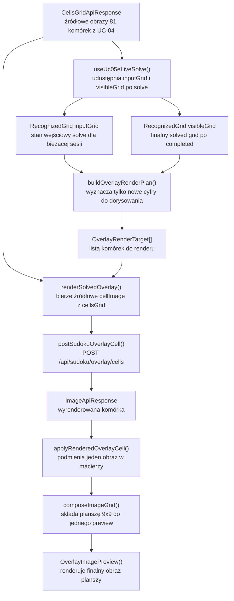
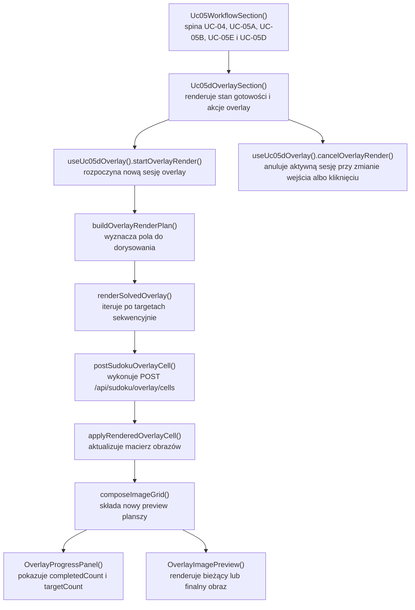

# UC-05D-FE - Plan implementacyjny dla `POST /api/sudoku/overlay/cells`

## 1) Przeznaczenie endpointa
- Z perspektywy `FE` endpoint `POST /api/sudoku/overlay/cells` realizuje jeden krok graficznego overlay:
  - `jedna komórka obrazu + jedna cyfra rozwiązania -> jedna wyrenderowana komórka`.
- Endpoint nie zwraca gotowej planszy 9x9 i nie zastępuje istniejącego workflow:
  - `UC-04` nadal dostarcza źródłowe obrazy 81 komórek,
  - `UC-05A` nadal buduje kanoniczny `RecognizedGrid`,
  - `UC-05B` nadal uruchamia sesję solve,
  - `UC-05E` nadal dostarcza finalny `visibleGrid` oraz terminalny status `completed`.
- `UC-05D` po stronie `FE` ma:
  - wyznaczyć, które pola wymagają dorysowania nowych cyfr,
  - wysyłać tylko te komórki, które są pustymi polami wejściowymi i dostały cyfrę po solve,
  - odbierać wyrenderowane komórki,
  - składać lokalnie finalny obraz planszy 9x9 bez marginesów i odstępów.
- `FE` komunikuje się wyłącznie z `BE`; nie ma bezpośrednich wywołań do `ML`.
- Overlay pozostaje dodatkiem prezentacyjnym. Jeśli overlay się nie wygeneruje, użytkownik nadal ma mieć czytelny wynik tekstowy/gridowy z `UC-05A` i `UC-05E`.

## 2) Zakres i założenia
- Plan dotyczy wyłącznie frontendu w `src/Frontend`.
- Plan bazuje na kontraktach i wcześniej opisanych historyjkach, a nie na tym, co jest aktualnie zaimplementowane po stronie `BE` albo `ML`.
- `UC-05D-FE` ma być `reuse-first`:
  - nie tworzymy drugiego workflow solve obok `UC-05`,
  - nie tworzymy drugiego modelu planszy obok `RecognizedGrid`,
  - nie kopiujemy logiki `SignalR`, recovery ani `sessionStorage` do nowej ścieżki overlay.
- Wybrany wariant implementacyjny pozostaje zgodny z dokumentem `UC-05D`:
  - render odbywa się per-komórka,
  - `FE` zleca render kolejnych komórek sekwencyjnie,
  - finalna plansza jest składana po stronie `FE`.
- Overlay powinien korzystać z dokładnie tych danych, które już istnieją w workflow:
  - `cellsGrid` z `UC-04` jako źródło obrazów komórek,
  - `inputGrid` z `UC-05E` jako stan wejściowy solve dla bieżącej sesji,
  - `visibleGrid` z `UC-05E` jako finalny solved grid po terminalnym `completed`.
- `UC-05D` nie powinien:
  - dodawać nowego endpointu do generacji całej planszy,
  - tworzyć nowego kanału realtime,
  - przenosić `cellsGrid` do `sessionStorage`,
  - trzymać `base64` obrazów w globalnym store.
- Jeżeli po solve nie ma żadnych nowych cyfr do dorysowania, `FE` powinno pominąć wywołania `POST /api/sudoku/overlay/cells` i złożyć finalny obraz bezpośrednio z oryginalnych komórek z `UC-04`.

## 3) Kontrakt `FE -> BE`

### 3.1 Endpoint
- Metoda i ścieżka: `POST /api/sudoku/overlay/cells`
- Request body: `RenderSudokuOverlayCellApiEntry`
- Success: `200 OK` -> `ImageApiResponse`
- Error: `ErrorApiResponse`

### 3.2 Request

```json
{
  "cellImage": {
    "mimeType": "image/png",
    "base64": "iVBORw0KGgoAAA..."
  },
  "digit": 4,
  "rowIndex": 0,
  "columnIndex": 2
}
```

### 3.3 Response sukcesu

```json
{
  "mimeType": "image/png",
  "base64": "iVBORw0KGgoAAA..."
}
```

### 3.4 Błędy
- `400 Bad Request`
  - niepoprawny payload albo zły kształt requestu.
- `422 Unprocessable Entity`
  - komórka albo cyfra nie nadaje się do renderowania.
- `503 Service Unavailable`
  - backend nie może skorzystać z renderera `ML`.
- `500 Internal Server Error`
  - błąd techniczny po stronie `BE`.

### 3.5 Modele API, których `FE` ma używać bez zmiany nazw
- `[NOWY]` `RenderSudokuOverlayCellApiEntry`
- `[REUSE]` `ImageApiEntry`
- `[REUSE]` `ImageApiResponse`
- `[REUSE]` `ErrorApiResponse`
- `[REUSE]` `CellsGridApiResponse`
- `[REUSE]` `RecognizedGrid`

## 4) Interpretacja warstw FE dla tego planu
- `Api`
  - publiczny entry point feature'a overlay i komponenty widoku,
  - integracja z istniejącym `Uc05WorkflowSection`,
  - prezentacja postępu i finalnego obrazu planszy.
- `Application`
  - orkiestracja sesji overlay:
    - przygotowanie planu renderu,
    - wysyłanie żądań per-komórka,
    - aktualizacja częściowo złożonego obrazu,
    - anulowanie i retry.
- `Domain`
  - czyste reguły wyznaczania pól do overlay,
  - walidacja zgodności `inputGrid` i `solvedGrid`,
  - model lokalnej sesji overlay bez `fetch`, Reacta i canvas API.
- `Infrastructure`
  - klient HTTP do `POST /api/sudoku/overlay/cells`,
  - generyczne helpery pracy z obrazem i canvasem,
  - konwersje techniczne potrzebne do złożenia finalnej planszy.

## 5) Zachowanie per warstwa

### Api
- Warstwa `Api` pokazuje osobny panel `UC-05D` dopiero wtedy, gdy:
  - solve ma terminalny stan `completed`,
  - istnieje `cellsGrid` z `UC-04`,
  - istnieje finalny `visibleGrid` z `UC-05E`.
- Panel `UC-05D` powinien pokazywać:
  - gotowość do wygenerowania overlay,
  - przycisk startu,
  - przycisk retry,
  - przycisk anulowania aktywnej sesji overlay,
  - postęp liczby wyrenderowanych komórek,
  - finalny obraz planszy.
- Warstwa `Api` nie wykonuje `fetch`, nie używa bezpośrednio canvas API i nie liczy, które pola trzeba dorysować.
- `Api` nie może traktować overlay jako nowego źródła prawdy planszy; źródłem pozostaje `RecognizedGrid` z workflow solve.

### Application
- Warstwa `Application` bierze trzy wejścia:
  - `cellsGrid` z `UC-04`,
  - `inputGrid` z `UC-05E`,
  - `visibleGrid` z `UC-05E`.
- `Application` buduje plan renderu tylko dla pól, które spełniają warunki:
  - wejściowo były `null`,
  - po solve mają cyfrę `1..9`.
- Render jest wykonywany sekwencyjnie, żeby możliwe było stopniowe budowanie końcowego obrazu i prostsze debugowanie.
- Po każdym sukcesie:
  - wyrenderowana komórka trafia do lokalnej macierzy obrazów,
  - lokalnie składany jest nowy preview całej planszy.
- `Application` anuluje sesję overlay, gdy:
  - użytkownik uruchomi nowy `UC-04`,
  - użytkownik ponownie uruchomi solve,
  - użytkownik ręcznie kliknie anulowanie,
  - komponent zostanie odmontowany.
- `Application` nie uruchamia overlay w trybie zdegradowanym `UC-05E`, jeśli brakuje `inputGrid` albo `cellsGrid`.

### Domain
- Warstwa `Domain` nie zna `ImageApiEntry`, `ImageApiResponse`, `fetch`, `AbortController`, `canvas` ani React hooków.
- `Domain` wyznacza:
  - czy `inputGrid` i `solvedGrid` są zgodne rozmiarem i semantyką,
  - które pozycje są targetami overlay,
  - czy solve faktycznie zachował cyfry wejściowe.
- `Domain` pilnuje niezmienników:
  - oba gridy mają rozmiar 9x9,
  - solve nie może zmienić istniejącej cyfry wejściowej na inną wartość,
  - overlay dotyczy tylko nowych cyfr, nie pól wejściowych.

### Infrastructure
- `Infrastructure` udostępnia klient `POST /api/sudoku/overlay/cells`.
- `Infrastructure` dostarcza generyczne helpery do:
  - wczytania obrazu do elementu/canvas,
  - złożenia siatki obrazów 9x9 w jeden obraz,
  - zamiany finalnego canvas na preview URL.
- Jeśli powstanie nowy helper obrazkowy, powinien być generyczny i trafić do `src/shared/images/*`, a nie do pliku komponentu `UC-05D`.
- `Infrastructure` nie decyduje, które pola trzeba wyrenderować i nie interpretuje terminalnego statusu solve.

## 6) Weryfikacja istniejących usług i antyduplikacja
- W repo istnieją już gotowe klocki, które trzeba reuse'ować:
  - `src/Frontend/src/features/uc05/api/Uc05WorkflowSection.tsx`
  - `src/Frontend/src/features/uc05/api/Uc05GridWorkspace.tsx`
  - `src/Frontend/src/features/uc05a/domain/recognizedGrid.ts`
  - `src/Frontend/src/features/uc05e/application/useUc05eLiveSolve.ts`
  - `src/Frontend/src/features/uc05e/application/solveLiveTypes.ts`
  - `src/Frontend/src/api/shared/fetchJson.ts`
  - `src/Frontend/src/shared/images/toImageDataUrl.ts`
- W repo nie istnieje jeszcze:
  - klient API dla `POST /api/sudoku/overlay/cells`,
  - feature `uc05d`,
  - generyczny helper składania siatki obrazów do jednego preview,
  - generyczny helper ładowania obrazów do canvas.
- Wniosek architektoniczny:
  - nie dokładać logiki overlay do `useUc05eLiveSolve()`,
  - nie dokładać logiki canvas do `Uc05WorkflowSection.tsx`,
  - dodać osobny feature `uc05d`,
  - helpery obrazkowe wydzielić generycznie do `src/shared/images/*`.

## 7) Pliki per warstwa i odpowiedzialności

### 7.1 Api
- `[MODYFIKACJA]` `src/Frontend/src/features/uc05/api/Uc05WorkflowSection.tsx`
  - wpiąć sekcję `UC-05D` do istniejącego workflow,
  - przekazać do niej:
    - `cellsGrid`,
    - `liveSolve.state.inputGrid`,
    - `liveSolve.visibleGrid`,
    - `liveSolve.state.terminalEventType`,
    - informację o stanie zdegradowanym.
- `[REUSE, BRAK ZMIAN MERYTORYCZNYCH]` `src/Frontend/src/features/uc05/api/Uc05GridWorkspace.tsx`
  - pozostaje widokiem tekstowego/gridowego wyniku solve,
  - nie staje się miejscem renderu finalnego obrazu overlay.
- `[NOWY]` `src/Frontend/src/features/uc05d/api/Uc05dOverlaySection.tsx`
  - główny panel `UC-05D`,
  - renderuje gotowość, start/retry/cancel, błędy i finalny obraz.
- `[NOWY]` `src/Frontend/src/features/uc05d/api/OverlayProgressPanel.tsx`
  - renderuje postęp renderowania komórek,
  - pokazuje licznik `completedCount/targetCount`.
- `[NOWY]` `src/Frontend/src/features/uc05d/api/OverlayImagePreview.tsx`
  - renderuje finalny obraz planszy i ewentualnie preview częściowy.
- `[NOWY]` `src/Frontend/src/features/uc05d/api/index.ts`
  - eksport publiczny feature'a do workflow `UC-05`.

### 7.2 Application
- `[REUSE]` `src/Frontend/src/features/uc05e/application/useUc05eLiveSolve.ts`
  - pozostaje źródłem `inputGrid`, `visibleGrid` i `terminalEventType`,
  - `UC-05D` ma konsumować jego stan, a nie odtwarzać solve lokalnie.
- `[NOWY]` `src/Frontend/src/features/uc05d/application/useUc05dOverlay.ts`
  - główny hook use case'u,
  - start/stop/retry overlay,
  - kontrola sesji i `AbortController`,
  - spinanie planu renderu z finalnym preview.
- `[NOWY]` `src/Frontend/src/features/uc05d/application/renderSolvedOverlay.ts`
  - orkiestrator renderu per-komórka,
  - pętla sekwencyjna,
  - callback postępu po każdej odpowiedzi.
- `[NOWY]` `src/Frontend/src/features/uc05d/application/overlaySessionReducer.ts`
  - maszyna stanów sesji overlay:
    - `sessionStarted`,
    - `cellRendered`,
    - `sessionCompleted`,
    - `sessionFailed`,
    - `sessionCancelled`.
- `[NOWY]` `src/Frontend/src/features/uc05d/application/overlaySessionTypes.ts`
  - typy stanu sesji, błędu i view modelu overlay.

### 7.3 Domain
- `[REUSE]` `src/Frontend/src/features/uc05a/domain/recognizedGrid.ts`
  - kanoniczny model `RecognizedGrid` dla wejścia solve i finalnego solved gridu.
- `[NOWY]` `src/Frontend/src/features/uc05d/domain/overlayRenderTarget.ts`
  - model pojedynczego targetu overlay:
    - `rowIndex`,
    - `columnIndex`,
    - `digit`.
- `[NOWY]` `src/Frontend/src/features/uc05d/domain/buildOverlayRenderPlan.ts`
  - czysta funkcja wyznaczająca listę targetów na podstawie `inputGrid` i `solvedGrid`.
- `[NOWY]` `src/Frontend/src/features/uc05d/domain/assertOverlayGridConsistency.ts`
  - waliduje rozmiar 9x9 i zgodność cyfr wejściowych z finalnym solve.
- `[NOWY]` `src/Frontend/src/features/uc05d/domain/applyRenderedOverlayCell.ts`
  - czysta aktualizacja lokalnej macierzy obrazów po sukcesie jednego requestu.
- `[NOWY]` `src/Frontend/src/features/uc05d/domain/overlayProgress.ts`
  - liczenie `targetCount`, `completedCount`, `remainingCount`.

### 7.4 Infrastructure
- `[MODYFIKACJA]` `src/Frontend/src/types/api.ts`
  - dodać `RenderSudokuOverlayCellApiEntry`,
  - nie zmieniać nazw istniejących modeli z `UC-04`, `UC-05A`, `UC-05B`, `UC-05E`, `UC-14`, `UC-15`.
- `[NOWY]` `src/Frontend/src/api/sudokuOverlayCells.ts`
  - klient `POST /api/sudoku/overlay/cells`,
  - walidacja `ImageApiResponse`,
  - mapowanie błędów HTTP do jednego typu błędu klienta.
- `[REUSE]` `src/Frontend/src/api/shared/fetchJson.ts`
  - wspólny helper JSON API.
- `[REUSE]` `src/Frontend/src/shared/images/toImageDataUrl.ts`
  - konwersja `ImageApiResponse` do `data:` URL.
- `[NOWY, GENERYCZNY]` `src/Frontend/src/shared/images/loadImageElement.ts`
  - techniczne wczytywanie obrazu do `HTMLImageElement`,
  - helper możliwy do reuse także poza `UC-05D`.
- `[NOWY, GENERYCZNY]` `src/Frontend/src/shared/images/composeImageGrid.ts`
  - składanie siatki obrazów w jeden obraz przez canvas,
  - helper bez logiki sudoku-specyficznej poza przyjęciem macierzy obrazów.
- `[MODYFIKACJA]` `src/Frontend/src/index.css`
  - style sekcji overlay, postępu i preview obrazu.

## 8) Docelowy przepływ w FE
1. `UC-04` dostarcza `CellsGridApiResponse`.
2. `UC-05A` buduje `recognizedGrid`.
3. `UC-05B` uruchamia solve.
4. `UC-05E` dostarcza finalnie:
   - `inputGrid`,
   - `visibleGrid`,
   - `terminalEventType = "completed"`.
5. `Uc05WorkflowSection` przekazuje te dane do `UC-05D`.
6. `useUc05dOverlay()` sprawdza, czy overlay da się uruchomić:
   - jest `cellsGrid`,
   - jest `inputGrid`,
   - jest `visibleGrid`,
   - solve zakończył się `completed`,
   - workflow nie jest w trybie zdegradowanym bez kontekstu obrazów.
7. `buildOverlayRenderPlan()` wyznacza tylko te pola, które trzeba dorysować.
8. Jeśli plan jest pusty:
   - `FE` lokalnie składa planszę wyłącznie z oryginalnych komórek,
   - bez wywoływania `POST /api/sudoku/overlay/cells`.
9. Jeśli plan nie jest pusty:
   - `renderSolvedOverlay()` przechodzi po targetach sekwencyjnie,
   - dla każdej komórki wysyła `POST /api/sudoku/overlay/cells`.
10. Po każdej odpowiedzi:
    - `applyRenderedOverlayCell()` podmienia obraz jednej komórki,
    - `composeImageGrid()` składa aktualny preview planszy,
    - UI odświeża obraz i postęp.
11. Po zakończeniu wszystkich targetów sesja przechodzi w `completed`.
12. Jeżeli użytkownik zmieni dane wejściowe albo uruchomi nową sesję solve, overlay jest anulowany i jego odpowiedzi nie mogą nadpisywać nowego stanu.

## 9) Skrócony przepływ po stronie BE wymagany przez FE
Ta sekcja jest tylko kontraktowym minimum potrzebnym frontendowi.

1. `FE` wysyła `RenderSudokuOverlayCellApiEntry` do `POST /api/sudoku/overlay/cells`.
2. `BE` waliduje payload publiczny.
3. `BE` przekazuje żądanie do `ML`.
4. `ML` renderuje cyfrę na pojedynczej komórce i zwraca `ImageApiResponse`.
5. `BE` zwraca do `FE`:
   - `200 OK` z `ImageApiResponse`, albo
   - `ErrorApiResponse` z właściwym statusem HTTP.

`FE` nie zakłada nic więcej:
- nie zna ścieżek runtime renderera,
- nie zna wewnętrznego endpointu `ML`,
- nie przechowuje publicznej sesji overlay po stronie `BE`,
- nie wymaga osobnego endpointu statusowego do overlay.

## 10) Główne funkcje
- `Uc05dOverlaySection()`
- `OverlayProgressPanel()`
- `OverlayImagePreview()`
- `useUc05dOverlay()`
- `startOverlayRender()`
- `cancelOverlayRender()`
- `retryOverlayRender()`
- `renderSolvedOverlay()`
- `postSudokuOverlayCell()`
- `buildOverlayRenderPlan()`
- `assertOverlayGridConsistency()`
- `applyRenderedOverlayCell()`
- `calculateOverlayProgress()`
- `loadImageElement()`
- `composeImageGrid()`
- `toImageDataUrl()`

## 11) Wyjątki, fallbacki i zachowanie błędowe

### 11.1 Gotowość do overlay
- Brak `cellsGrid`
  - overlay jest zablokowany,
  - UI pokazuje komunikat, że brakuje źródłowych obrazów komórek z `UC-04`.
- Brak `inputGrid` albo `visibleGrid`
  - overlay jest zablokowany,
  - UI pozostaje przy tekstowym/gridowym wyniku solve.
- `terminalEventType !== "completed"`
  - overlay nie startuje,
  - w stanach `failed` i `cancelled` nie próbujemy rysować finalnej planszy.

### 11.2 Błędy HTTP per-komórka
- `400`
  - traktować jako błąd kontraktowy albo niespójność danych wejściowych `FE`,
  - zatrzymać sesję overlay jako `failed`.
- `422`
  - traktować jako błąd biznesowy renderu danej komórki,
  - zatrzymać sesję overlay jako `failed`,
  - zachować częściowy preview diagnostycznie.
- `503`, `500`
  - błąd techniczny po stronie backendu/integracji,
  - zatrzymać sesję overlay jako `failed`,
  - umożliwić retry.

### 11.3 Fallbacki
- Jeżeli `buildOverlayRenderPlan()` zwróci `0` targetów:
  - fallback do lokalnego złożenia planszy z oryginalnych komórek bez requestów.
- Jeżeli overlay się nie uda:
  - fallback do istniejącego tekstowego/gridowego wyniku solve,
  - bez lokalnego rysowania cyfr w przeglądarce jako substytutu `ML`.
- Brak fallbacku do:
  - bezpośredniego wywołania `ML`,
  - nowego endpointu board-level,
  - przechowywania obrazów w `sessionStorage`.

### 11.4 Scenariusze graniczne
- Solve po refresh został odzyskany w trybie zdegradowanym bez `cellsGrid`
  - overlay nie może zostać wznowiony.
- `inputGrid` i `visibleGrid` są niespójne, np. solve zmienił cyfrę wejściową
  - potraktować jako błąd niezmiennika i nie wysyłać requestów overlay.
- Część requestów wraca po anulowaniu
  - ignorować je na podstawie lokalnego `sessionId`.
- Użytkownik uruchamia nowe solve po wygenerowaniu overlay
  - overlay preview powinien zostać wyczyszczony albo oznaczony jako nieaktualny dla starej sesji.

## 12) Specyficzna logika i pseudokod

### 12.1 Budowa planu renderu

```text
buildOverlayRenderPlan(inputGrid, solvedGrid):
  assert both grids have 9 rows and 9 columns

  targets = []

  for each cell [rowIndex, columnIndex]:
    inputDigit = inputGrid[rowIndex][columnIndex].digit
    solvedDigit = solvedGrid[rowIndex][columnIndex].digit

    if inputDigit is not null and solvedDigit != inputDigit:
      throw OverlayGridConsistencyError

    if inputDigit is null and solvedDigit is not null:
      targets.push({
        rowIndex,
        columnIndex,
        digit: solvedDigit
      })

  return targets
```

### 12.2 Orkiestracja sesji overlay

```text
startOverlayRender(cellsGrid, inputGrid, solvedGrid):
  cancelPreviousSessionIfExists()

  targets = buildOverlayRenderPlan(inputGrid, solvedGrid)
  sessionId = createLocalSessionId()
  controller = new AbortController()
  renderedCells = cloneOriginalCellsGrid(cellsGrid)

  setState(
    status = "running",
    sessionId = sessionId,
    renderedCells = renderedCells,
    completedCount = 0,
    targetCount = targets.length,
    error = null
  )

  if targets.length == 0:
    preview = composeImageGrid(renderedCells)
    setState(status = "completed", preview = preview)
    return

  for each target in targets:
    response = postSudokuOverlayCell(
      cellImage = cellsGrid.cells[target.rowIndex][target.columnIndex],
      digit = target.digit,
      rowIndex = target.rowIndex,
      columnIndex = target.columnIndex,
      signal = controller.signal
    )

    if currentSessionId != sessionId:
      return

    renderedCells = applyRenderedOverlayCell(renderedCells, target, response)
    preview = composeImageGrid(renderedCells)

    setState(
      renderedCells = renderedCells,
      preview = preview,
      completedCount = previous.completedCount + 1
    )

  setState(status = "completed")
```

### 12.3 Guardrail dla trybu zdegradowanego

```text
canGenerateOverlay(liveState, cellsGrid):
  if liveState.terminalEventType != "completed":
    return false

  if cellsGrid is null:
    return false

  if liveState.inputGrid is null or liveState.visibleGrid is null:
    return false

  if liveState.degradedReason is not null and liveState.inputGrid is null:
    return false

  return true
```

## 13) Mermaid flowchart - flow modeli



## 14) Mermaid flowchart - logika aplikacji z funkcjami



## 15) Workflow GitHub i runtime
- `[BRAK ZMIAN FE]` `.github/workflows/frontend-cd.yml`
  - frontend dalej buduje statyczny bundle,
  - dalej używa `VITE_API_BASE_URL="${FE_VITE_API_BASE_URL:-/api}"`,
  - `UC-05D` nie wymaga nowych zmiennych środowiskowych `FE`.
- Lokalnie:
  - `FE` nadal korzysta z publicznego `/api` albo lokalnego backendu,
  - nie dokładamy lokalnych envów dla overlay.
- Produkcyjnie:
  - frontend nie zna `appsettings.production.json`,
  - frontend nie zna ścieżki `BE -> ML`,
  - cały routing pozostaje za publicznym `/api`.
- Zależność po stronie `BE/infra`, którą trzeba odnotować kontraktowo:
  - jeśli backend utrzymuje konfigurowalną ścieżkę do renderera overlay, to:
    - workflow backendu powinien dopisać ją do generowanego `appsettings.production.json`,
    - lokalnie odpowiednia wartość powinna być wpisana na sztywno w `appsettings.local.json`.
- Wniosek dla tego planu:
  - brak zmian w `frontend-cd.yml`,
  - brak zmian w paczkowaniu `dist/`,
  - ewentualne zmiany workflow dotyczą `BE`, nie `FE`.

## 16) Logging i diagnostyka FE
- Cel logów:
  - ułatwić diagnozę sesji overlay,
  - nie spamować konsoli 81 logami z sukcesami.

### 16.1 `console.info`
- start sesji overlay,
- zakończenie sukcesem,
- przypadek `0` targetów i lokalne złożenie planszy bez requestów.

### 16.2 `console.warn`
- brak `cellsGrid` albo brak danych do overlay po recovery,
- `422`,
- anulowanie sesji overlay,
- wykrycie niespójności solve względem cyfr wejściowych.

### 16.3 `console.error`
- niepoprawny kształt `ImageApiResponse`,
- `500`,
- `503`,
- błąd składania planszy przez canvas,
- naruszenie niezmienników `inputGrid` vs `solvedGrid`.

### 16.4 Guardraile logowania
- nie logować `base64`,
- nie logować pełnych obrazów komórek,
- nie logować sukcesu każdej pojedynczej komórki,
- logować co najwyżej:
  - `sessionId`,
  - `completedCount`,
  - `targetCount`,
  - `rowIndex`,
  - `columnIndex`,
  - `errorType`,
  - `httpStatus`.

## 17) Inne istotne reguły
- Nie tworzyć nowego board-level endpointu tylko po to, by ominąć render per-komórka.
- Nie przenosić logiki canvas do `Uc05WorkflowSection.tsx` ani do `App.tsx`.
- Nie przechowywać `cellsGrid` ani finalnego obrazu overlay w `sessionStorage`.
- Nie mieszać `UC-05D` z panelem parametrów `UC-14`, jeśli overlay nie ma jeszcze własnych parametrów.
- Nie traktować overlay jako warunku sukcesu solve.
- Nie wymagać tokenu administracyjnego z `UC-13`; to nadal publiczny flow solve.
- Nie zmieniać nazw już ustalonych modeli:
  - `RecognizedGrid`,
  - `CellsGridApiResponse`,
  - `ImageApiEntry`,
  - `ImageApiResponse`,
  - `ErrorApiResponse`,
  - `solveSessionId`,
  - `progressChannelUrl`.

## 18) Kolejność implementacji kodu dla historyjki
1. Dodać `RenderSudokuOverlayCellApiEntry` do `src/Frontend/src/types/api.ts`.
2. Dodać klient `src/Frontend/src/api/sudokuOverlayCells.ts` oparty o `fetchJson()`.
3. Dodać generyczne helpery obrazkowe:
   - `loadImageElement.ts`,
   - `composeImageGrid.ts`.
4. Utworzyć folder feature'a `src/Frontend/src/features/uc05d/`.
5. Dodać warstwę domenową:
   - `overlayRenderTarget.ts`,
   - `buildOverlayRenderPlan.ts`,
   - `assertOverlayGridConsistency.ts`,
   - `applyRenderedOverlayCell.ts`,
   - `overlayProgress.ts`.
6. Dodać warstwę `Application`:
   - `overlaySessionTypes.ts`,
   - `overlaySessionReducer.ts`,
   - `renderSolvedOverlay.ts`,
   - `useUc05dOverlay.ts`.
7. Dodać warstwę `Api`:
   - `Uc05dOverlaySection.tsx`,
   - `OverlayProgressPanel.tsx`,
   - `OverlayImagePreview.tsx`,
   - `index.ts`.
8. Wpiąć `UC-05D` do `Uc05WorkflowSection.tsx`.
9. Dodać style do `src/Frontend/src/index.css`.
10. Zweryfikować scenariusze ręcznie:
    - solve `completed` + poprawny overlay,
    - `0` targetów,
    - `422`,
    - `503`,
    - anulowanie przy zmianie wejścia,
    - brak `cellsGrid` po recovery.
11. Uruchomić `npm run check`.

## 19) Guardraile implementacyjne
- `UC-05D` ma konsumować dane solve, a nie ponownie uruchamiać solve.
- `useUc05dOverlay()` nie może duplikować logiki z `useUc05eLiveSolve()`.
- `Domain` nie importuje Reacta, `fetch`, canvas API ani kontraktów HTTP.
- `Infrastructure` nie decyduje, które pola są nowymi cyframi do dorysowania.
- Nie wolno przechowywać 81 obrazów `base64` w `sessionStorage`.
- Nie wolno robić fallbacku do lokalnego rysowania cyfr w przeglądarce, jeśli produkt wybrał render przez `ML`.
- Nie wolno nadpisywać nowej sesji solve odpowiedziami starej sesji overlay.
- Nie dodawać nowych zależności npm tylko dla `UC-05D`, jeśli wystarcza natywne `canvas`.
- `Uc05WorkflowSection.tsx` ma pozostać composition root, nie orkiestratorem całego overlay.

## 20) Zależności pomiędzy historyjkami

### Wejściowe
- `UC-04`
  - dostarcza `CellsGridApiResponse` z obrazami komórek,
  - bez tego `UC-05D` nie ma materiału wejściowego do renderu.
- `UC-05A`
  - dostarcza semantykę `RecognizedGrid`.
- `UC-05B`
  - dostarcza publiczną sesję solve i statusy workflow.
- `UC-05E`
  - dostarcza:
    - `inputGrid`,
    - `visibleGrid`,
    - `terminalEventType`,
    - stan zdegradowany recovery.
- `UC-13`
  - potwierdza, że flow solve pozostaje publiczny i bez tokenu.
- `UC-14`
  - na dziś nie wnosi nowego parametru overlay; trzeba utrzymać brak sztucznego subkontekstu parametrów dla `UC-05D`.
- `UC-15`
  - potwierdza, że parametry live solve pozostają w `POST /api/sudoku/solve`, a nie przeciekają do innych endpointów.

### Wyjściowe
- przyszły wariant ambitny `UC-05D` dla overlay na oryginalnym zdjęciu
  - może reuse'ować część helperów obrazkowych, ale będzie wymagał osobnej logiki transformacji perspektywy.
- przyszły eksport/pobranie wyniku
  - może reuse'ować finalny preview obrazu złożony już w `FE`.

### Co już istnieje i ma być reuse'owane
- `src/Frontend/src/features/uc05/api/Uc05WorkflowSection.tsx`
- `src/Frontend/src/features/uc05/api/Uc05GridWorkspace.tsx`
- `src/Frontend/src/features/uc05a/domain/recognizedGrid.ts`
- `src/Frontend/src/features/uc05e/application/useUc05eLiveSolve.ts`
- `src/Frontend/src/features/uc05e/application/solveLiveTypes.ts`
- `src/Frontend/src/api/shared/fetchJson.ts`
- `src/Frontend/src/shared/images/toImageDataUrl.ts`
- `src/Frontend/src/types/api.ts`

## 21) Model API wejściowy i wyjściowy w komunikacji z BE

### FE -> BE
- `RenderSudokuOverlayCellApiEntry`
  - `cellImage: ImageApiEntry`
  - `digit: number`
  - `rowIndex?: number`
  - `columnIndex?: number`

Przykład:

```json
{
  "cellImage": {
    "mimeType": "image/png",
    "base64": "iVBORw0KGgoAAA..."
  },
  "digit": 8,
  "rowIndex": 4,
  "columnIndex": 6
}
```

### BE -> FE
- `ImageApiResponse`
  - `mimeType: string`
  - `base64: string`
- `ErrorApiResponse`
  - `errorType: string`
  - `message: string`

### Lokalny model FE
- `OverlayRenderTarget`
  - `rowIndex: number`
  - `columnIndex: number`
  - `digit: 1..9`
- `OverlaySessionState`
  - `status: "idle" | "running" | "completed" | "failed" | "cancelled"`
  - `completedCount: number`
  - `targetCount: number`
  - `previewUrl: string | null`
  - `error: OverlaySessionError | null`
- `RecognizedGrid`
  - pozostaje kanonicznym modelem logicznym planszy,
  - overlay go nie zastępuje.

## 22) Plan weryfikacji minimum
- `npm run check`
- scenariusz happy path:
  - solve kończy się `completed`,
  - `UC-05D` renderuje wszystkie nowe cyfry,
  - pojawia się finalny obraz planszy.
- scenariusz `0` targetów:
  - overlay nie wysyła żadnego requestu,
  - lokalnie składa planszę z oryginalnych komórek.
- scenariusz `422`:
  - sesja overlay kończy się `failed`,
  - częściowy preview zostaje diagnostycznie,
  - grid tekstowy nadal jest widoczny.
- scenariusz `503`:
  - sesja kończy się błędem technicznym,
  - retry jest możliwy.
- scenariusz recovery po refresh bez `cellsGrid`:
  - solve może być widoczny w trybie tekstowym,
  - `UC-05D` pozostaje zablokowany z czytelnym komunikatem.
- scenariusz zmiany wejścia:
  - overlay się anuluje,
  - stare odpowiedzi nie nadpisują nowego stanu.

## 23) Podsumowanie decyzji architektonicznych
- `UC-05D-FE` ma być osobnym feature'em `uc05d`, ale osadzonym we wspólnym workflow `UC-05`.
- `UC-05D` reuse'uje:
  - obrazy komórek z `UC-04`,
  - modele planszy z `UC-05A`,
  - stan solve z `UC-05E`.
- `FE` składa finalny obraz planszy lokalnie, ale nie przejmuje renderu cyfr, który pozostaje po stronie `ML` za publicznym `BE`.
- Nowe helpery obrazkowe powinny być generyczne i trafić do `src/shared/images/*`.
- Overlay jest warstwą prezentacyjną nad istniejącym workflow solve, a nie nowym źródłem prawdy i nie nowym workflow biznesowym.
