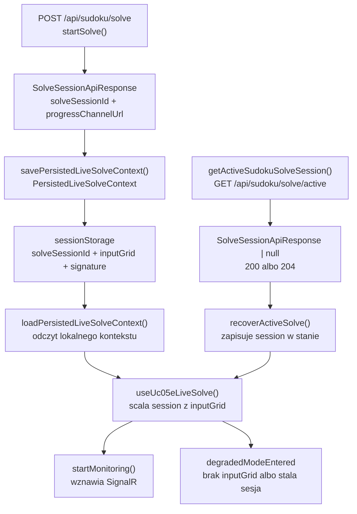
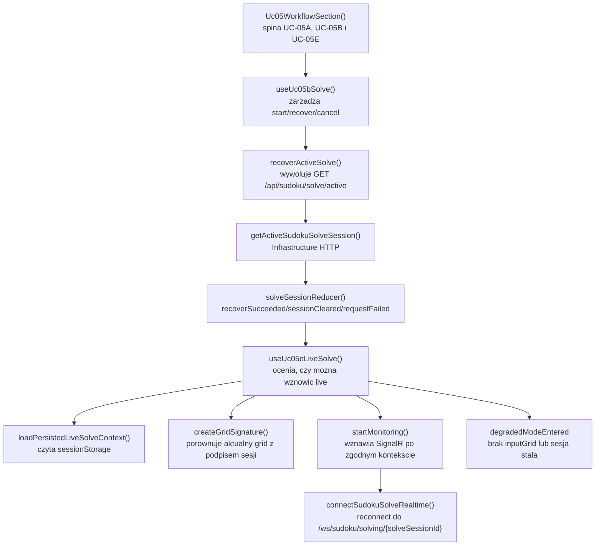

# UC-05E-FE - Plan implementacyjny dla `GET /api/sudoku/solve/active`

## 1) Przeznaczenie endpointa
- Z perspektywy `FE` endpoint `GET /api/sudoku/solve/active` sluzy do odzyskania aktywnej sesji rozwiazywania sudoku uruchomionej w `UC-05B` i obserwowanej live w `UC-05E`.
- To nie jest endpoint startowy i nie zwraca finalnego wyniku solve.
- Endpoint ma tylko odpowiedziec na pytanie: "czy istnieje jeszcze sesja, do ktorej da sie wrocic?".
- `FE` wykorzystuje ten endpoint w trzech scenariuszach:
  - automatyczny recovery po `409 Conflict` z `POST /api/sudoku/solve`,
  - jawna akcja uzytkownika "Odzyskaj aktywna sesje",
  - auto-wznowienie po refresh tylko wtedy, gdy lokalnie istnieje poprawny kontekst sesji w `sessionStorage`.
- Endpoint jest publiczny, tak jak caly flow solve. Nie uzywa tokenu administracyjnego z `UC-13`.
- `FE` komunikuje sie wyłącznie z `BE`; nie ma zadnego fallbacku do `ML`.

## 2) Zakres i zalozenia
- Plan dotyczy tylko warstwy `FE` w `src/Frontend`.
- Plan jest powiazany z:
  - `UC-05`,
  - `UC-05B`,
  - `UC-05E`,
  - `UC-05B-FE - POST /api/sudoku/solve`,
  - `UC-05E-FE - SignalR /ws/sudoku/solving/{solveSessionId}`.
- Nie sugerujemy sie biezaca implementacja `BE` ani `ML`; plan bazuje na kontrakcie produktu i wymaganiach historyjki.
- Jednoczesnie trzeba uwzglednic, ze w repo sa juz gotowe elementy po `UC-05B` i `UC-05E`, wiec nie wolno projektowac drugiego, rownoleglego flow recovery.
- `GET /api/sudoku/solve/active` nie przenosi `inputGrid`, nie zwraca `recognizedGrid` i nie moze samoistnie odtworzyc widoku live solve po refresh.
- Dlatego `FE` musi laczyc odpowiedz `200 OK` z lokalnym kontekstem sesji:
  - `solveSessionId`,
  - `progressChannelUrl`,
  - `startedGridSignature`,
  - `inputGrid` przechowywanym w `sessionStorage`.
- Auto-recovery na mount jest dozwolone tylko wtedy, gdy `sessionStorage` zawiera poprawny kontekst tej samej sesji. W pozostalych przypadkach recovery powinno byc jawne albo uruchamiane tylko jako odpowiedz na `409`.

## 3) Kontrakt `FE -> BE`

### 3.1 `GET /api/sudoku/solve/active`
- Request body: brak.
- Naglowki:
  - `Accept: application/json`
- Sukces:
  - `200 OK` -> `SolveSessionApiResponse`
  - `204 No Content`
- Blad:
  - `ErrorApiResponse`

Przyklad `200 OK`:

```json
{
  "solveSessionId": "solve-20260515-193200-demo-01",
  "status": "running",
  "progressChannelUrl": "/ws/sudoku/solving/solve-20260515-193200-demo-01"
}
```

Semantyka po stronie `FE`:
- `200` oznacza, ze `BE` zna sesje, ktora jest jeszcze do odzyskania lub domkniecia.
- `204` oznacza tylko brak aktywnej sesji. To nie jest synonim sukcesu solve ani cancel.
- `FE` nie moze po `204` "zgadywac", czy poprzednia sesja zakonczyla sie `completed`, `failed` czy `cancelled`.

### 3.2 Model odpowiedzi
- `[REUSE]` `SolveSessionApiResponse`
  - `solveSessionId: string`
  - `status: string`
  - `progressChannelUrl: string`
- `[REUSE]` `ErrorApiResponse`
  - `errorType: string`
  - `message: string`

### 3.3 Defensywna interpretacja statusu
- Kontraktowo endpoint powinien zwracac do recovery przede wszystkim statusy aktywne:
  - `queued`,
  - `running`,
  - `cancelling`.
- `FE` powinno jednak defensywnie tolerowac ten sam ksztalt `SolveSessionApiResponse`, jesli przez race condition backend zwroci status terminalny:
  - `completed`,
  - `failed`,
  - `cancelled`.
- W takim przypadku `FE` nie powinno wznawiac nowego monitoringu live, tylko:
  - zachowac informacje diagnostyczna,
  - wyczyscic stary persisted context,
  - pozostac przy lokalnym `recognizedGrid` / `visibleGrid`,
  - pozwolic uzytkownikowi uruchomic nowa sesje od poczatku.

## 4) Interpretacja warstw FE dla tego planu
- `Api`
  - komponenty widoku i kompozycja workflow,
  - przyciski recovery,
  - komunikaty o stanie odzyskiwania i stanie degradowanym.
- `Application`
  - orkiestracja `GET /active`,
  - polaczenie odpowiedzi HTTP z lokalnym kontekstem live solve,
  - decyzja, czy wolno wznowic `SignalR`, czy tylko pokazac status.
- `Domain`
  - klasyfikacja statusow sesji,
  - porownanie sygnatur gridu,
  - reguly "czy sesja jest resumable" oraz "czy sesja jest stala dla aktualnego gridu".
- `Infrastructure`
  - klient HTTP `GET /api/sudoku/solve/active`,
  - walidacja shape `SolveSessionApiResponse`,
  - adapter `sessionStorage`,
  - adapter `SignalR`.

## 5) Zachowanie per warstwa

### Api
- Warstwa `Api` udostepnia uzytkownikowi:
  - przycisk do jawnego recovery,
  - komunikat "znaleziono aktywna sesje",
  - komunikat "brak aktywnej sesji",
  - komunikat "brakuje lokalnego kontekstu do wznowienia live solve".
- `Api` nie wykonuje `fetch`.
- `Api` nie interpretuje `204` jako finalnego sukcesu.
- `Api` nie czyta bezposrednio `sessionStorage`.
- `Api` nie podejmuje decyzji, czy wznowic `SignalR`.

### Application
- Warstwa `Application` odpowiada za:
  - wywolanie `getActiveSudokuSolveSession()`,
  - mapowanie `200 | 204 | blad`,
  - powiazanie sesji z aktualnym `recognizedGrid`,
  - decyzje:
    - wznow live monitoring,
    - wejdz w tryb zdegradowany,
    - wyczysc lokalny stan sesji.
- Reguly orkiestracyjne:
  - po `409` z `POST /api/sudoku/solve` recovery uruchamiamy automatycznie,
  - po refresh recovery uruchamiamy automatycznie tylko wtedy, gdy `sessionStorage` zawiera poprawny persisted context,
  - po recznym kliknieciu "Odzyskaj aktywna sesje" recovery mozna uruchomic bez persisted context, ale bez `inputGrid` wolno wejsc co najwyzej w tryb statusowy, nie w pelne live resume.
- `Application` nie moze tworzyc nowego lokalnego modelu planszy obok `RecognizedGrid`.

### Domain
- Warstwa `Domain` dostarcza czyste reguly:
  - czy status sesji jest aktywny,
  - czy status sesji jest terminalny,
  - czy aktywna sesja jest stala wobec aktualnego gridu,
  - czy mozna wznowic live monitoring przy danym zestawie:
    - `solveSession`,
    - `inputGrid`,
    - `startedGridSignature`,
    - aktualny `recognizedGrid`.
- `Domain` nie zna:
  - React hookow,
  - `fetch`,
  - `sessionStorage`,
  - `SignalR`,
  - `console`.

### Infrastructure
- Warstwa `Infrastructure` odpowiada za:
  - wykonanie `GET /api/sudoku/solve/active`,
  - zwrot `null` dla `204`,
  - walidacje shape `SolveSessionApiResponse`,
  - odczyt i zapis persisted context w `sessionStorage`,
  - nawiazanie polaczenia `SignalR` po odzyskaniu sesji.
- `Infrastructure` nie decyduje:
  - czy sesja jest stala,
  - czy `204` oznacza sukces solve,
  - czy bez `inputGrid` wolno wznowic live grid.

## 6) Weryfikacja istniejacych uslug i antyduplikacja
- W repo juz istnieje klient HTTP:
  - `[REUSE]` `src/Frontend/src/api/sudokuSolve.ts`
  - wniosek: nie tworzyc drugiego klienta tylko dla `GET /active`.
- W repo juz istnieje hook recovery:
  - `[REUSE]` `src/Frontend/src/features/uc05b/application/useUc05bSolve.ts`
  - wniosek: nie dodawac osobnego hooka `useUc05eRecovery()`, jesli nie wnosi nowej wartosci biznesowej.
- W repo juz istnieje logika live solve:
  - `[REUSE]` `src/Frontend/src/features/uc05e/application/useUc05eLiveSolve.ts`
  - wniosek: nowe zachowanie `GET /active` ma byc tam konsumowane, a nie dublowane w `Api`.
- W repo juz istnieje persisted context:
  - `[REUSE]` `src/Frontend/src/features/uc05e/infrastructure/solveLiveSessionStorage.ts`
  - wniosek: nie tworzyc osobnego storage dla recovery active session.
- W repo juz istnieje wspolny model HTTP:
  - `[REUSE]` `src/Frontend/src/types/api.ts`
  - wniosek: nie zmieniac nazw:
    - `SolveSessionApiResponse`,
    - `ErrorApiResponse`,
    - `solveSessionId`,
    - `progressChannelUrl`.
- W repo juz istnieje jeden wspolny workflow `UC-05`:
  - `[REUSE]` `src/Frontend/src/features/uc05/api/Uc05WorkflowSection.tsx`
  - wniosek: nie projektowac osobnego, rownoleglego ekranu recovery.
- W repo juz istnieje `SignalR` i helper URL:
  - `[REUSE]` `src/Frontend/src/api/sudokuSolveRealtime.ts`
  - `[REUSE]` `src/Frontend/src/shared/realtime/buildHubUrl.ts`
  - wniosek: endpoint `GET /active` ma tylko dostarczyc dane do ich ponownego uzycia.

## 7) Pliki per warstwa i odpowiedzialnosci

### 7.1 Api
- `[REUSE]` `src/Frontend/src/features/uc05/api/Uc05WorkflowSection.tsx`
  - spina `UC-05A`, `UC-05B` i `UC-05E`,
  - przekazuje `recoverActiveSolve()` do warstwy live,
  - pozostaje glownym entry pointem workflow.
- `[REUSE]` `src/Frontend/src/features/uc05b/api/Uc05bSolveSection.tsx`
  - renderuje akcje:
    - start solve,
    - recover active solve,
    - cancel solve.
- `[REUSE]` `src/Frontend/src/features/uc05b/api/SolveSessionStatusPanel.tsx`
  - pokazuje stan sesji odzyskanej przez `GET /active`,
  - wyswietla status, `solveSessionId`, `progressChannelUrl`, bledy i komunikaty UX.
- `[REUSE]` `src/Frontend/src/features/uc05e/api/Uc05eLiveSolvePanel.tsx`
  - pokazuje, czy monitoring po recovery zostal wznowiony,
  - pokazuje tryb zdegradowany, jesli `GET /active` znalazl sesje, ale brakuje `inputGrid`.
- `[REUSE]` `src/Frontend/src/features/uc05/api/Uc05GridWorkspace.tsx`
  - renderuje jeden widoczny grid roboczy po ewentualnym recovery.
- `[REUSE]` `src/Frontend/src/App.tsx`
  - pozostaje composition root,
  - nie przejmuje logiki recovery.

### 7.2 Application
- `[REUSE]` `src/Frontend/src/features/uc05b/application/useUc05bSolve.ts`
  - zawiera `recoverActiveSolve()`,
  - wykonuje `GET /api/sudoku/solve/active`,
  - mapuje `200`, `204` i bledy do stanu aplikacyjnego.
- `[REUSE]` `src/Frontend/src/features/uc05b/application/solveSessionReducer.ts`
  - aktualizuje stan sesji po `recoverRequested`, `recoverSucceeded`, `sessionCleared`, `requestFailed`.
- `[REUSE]` `src/Frontend/src/features/uc05b/application/solveSessionTypes.ts`
  - trzyma typy stanu sesji i bledu recovery.
- `[REUSE]` `src/Frontend/src/features/uc05e/application/useUc05eLiveSolve.ts`
  - po refresh wykrywa persisted context,
  - uruchamia auto-recovery,
  - laczy odpowiedz `GET /active` z `sessionStorage`,
  - decyduje, czy wznowic live monitoring, czy wejsc w degraded mode.
- `[REUSE]` `src/Frontend/src/features/uc05e/application/solveLiveReducer.ts`
  - trzyma stan polaczenia i stan zdegradowany po recovery.
- `[REUSE]` `src/Frontend/src/features/uc05e/application/solveLiveTypes.ts`
  - typy persisted context, connection state i live error.

### 7.3 Domain
- `[REUSE]` `src/Frontend/src/features/uc05a/domain/recognizedGrid.ts`
  - kanoniczny lokalny model planszy; recovery nie wprowadza drugiego modelu.
- `[REUSE]` `src/Frontend/src/features/uc05b/domain/createGridSignature.ts`
  - porownuje aktualny grid z gridem, z ktorego wystartowala sesja.
- `[REUSE]` `src/Frontend/src/features/uc05b/domain/prepareRecognizedGridForSolve.ts`
  - buduje `inputGrid` potrzebny do wznowienia live monitoring.
- `[REUSE]` `src/Frontend/src/features/uc05b/domain/solveSessionStatus.ts`
  - klasyfikuje statusy jako aktywne lub terminalne.
- `[REUSE]` `src/Frontend/src/features/uc05e/domain/shouldAcceptSolveProgressEvent.ts`
  - przyjmuje tylko eventy z wlasciwej sesji i z nowszym `sequence`.
- `[REUSE]` `src/Frontend/src/features/uc05e/domain/assertInputCellsInvariant.ts`
  - pilnuje, zeby wznowiony monitoring nie nadpisal pol wejsciowych.
- `[REUSE]` `src/Frontend/src/features/uc05e/domain/mapCurrentGridToRecognizedGrid.ts`
  - sklada widoczny grid po recovery.
- `[REUSE]` `src/Frontend/src/features/uc05e/domain/isSolveProgressEventTerminal.ts`
  - rozpoznaje terminalne eventy po wznowieniu monitoringu.
- `[REUSE]` `src/Frontend/src/features/uc05e/domain/solveProgressEvent.ts`
  - utrwala shape eventu live po wznowieniu sesji.

### 7.4 Infrastructure
- `[REUSE]` `src/Frontend/src/api/sudokuSolve.ts`
  - funkcja `getActiveSudokuSolveSession()`,
  - zwraca `null` dla `204`,
  - waliduje `SolveSessionApiResponse`.
- `[REUSE]` `src/Frontend/src/api/shared/fetchJson.ts`
  - shared helper dla pozostalych endpointow JSON,
  - nie trzeba tworzyc alternatywy tylko dla recovery.
- `[REUSE]` `src/Frontend/src/api/sudokuSolveRealtime.ts`
  - po odzyskaniu sesji wznawia `SignalR`.
- `[REUSE]` `src/Frontend/src/features/uc05e/infrastructure/solveLiveSessionStorage.ts`
  - przechowuje i czyta `PersistedLiveSolveContext` z `sessionStorage`.
- `[REUSE]` `src/Frontend/src/shared/realtime/buildHubUrl.ts`
  - sklada URL realtime po `progressChannelUrl`.
- `[REUSE]` `src/Frontend/src/types/api.ts`
  - wspolne typy HTTP:
    - `SolveSessionApiResponse`,
    - `ErrorApiResponse`.
- `[REUSE]` `src/Frontend/src/index.css`
  - style komunikatow recovery, trybu zdegradowanego i stanu sesji.

## 8) Docelowy przeplyw w FE
1. `UC-05A` buduje `recognizedGrid`.
2. `UC-05B` startuje solve przez `POST /api/sudoku/solve`.
3. `UC-05E` zapisuje persisted context w `sessionStorage`:
   - `solveSessionId`,
   - `progressChannelUrl`,
   - `startedGridSignature`,
   - `inputGrid`.
4. Uzytkownik odswieza strone albo backend zwraca `409`.
5. `useUc05bSolve()` uruchamia `getActiveSudokuSolveSession()`.
6. Jesli `GET /active` zwroci `204`, `FE`:
   - czyści lokalny stan aktywnej sesji,
   - czyści stary persisted context, jesli juz nie ma odpowiadajacej sesji,
   - zostaje przy lokalnym `recognizedGrid`.
7. Jesli `GET /active` zwroci `200`, `FE` zapisuje odzyskana sesje w stanie aplikacyjnym.
8. `useUc05eLiveSolve()` probuje dopasowac odzyskana sesje do lokalnego persisted context.
9. Jesli:
   - `solveSessionId` pasuje,
   - persisted context jest poprawny,
   - sesja nie jest stala wobec aktualnego gridu,
   to `FE` wznawia `SignalR`.
10. Jesli sesja istnieje, ale brakuje poprawnego `inputGrid`, `FE` wchodzi w tryb zdegradowany:
    - pokazuje status sesji,
    - nie odtwarza pelnego live grid,
    - prosi uzytkownika o ponowne przejscie przez `UC-05A`, jesli chce odzyskac pelny kontekst.
11. Po wznowieniu `SignalR` backend wysyla `snapshot`, a dalsza logika jest kontynuowana przez `UC-05E`.

## 9) Skrocony przeplyw po stronie BE wymagany przez FE
Ta sekcja opisuje tylko kontraktowe minimum potrzebne frontendowi.

1. `FE` wysyla `GET /api/sudoku/solve/active`.
2. `BE` sprawdza, czy istnieje aktualnie aktywna sesja solve.
3. Jesli aktywna sesja istnieje, `BE` zwraca `200 OK` z:
   - `solveSessionId`,
   - `status`,
   - `progressChannelUrl`.
4. Jesli aktywnej sesji nie ma, `BE` zwraca `204 No Content`.
5. `BE` nie zwraca przez ten endpoint:
   - `inputGrid`,
   - `recognizedGrid`,
   - `currentGrid`,
   - finalnego `solvedGrid`.
6. Jesli sesja jest nadal zywa, `BE` pozwala `FE` wznowic monitoring przez `SignalR`.
7. Jesli w miedzyczasie sesja zdazyla sie zakonczyc, `snapshot` po reconnect moze juz byc terminalny.

## 10) Glowne funkcje
- `getActiveSudokuSolveSession()`
- `recoverActiveSolve()`
- `useUc05eLiveSolve()`
- `loadPersistedLiveSolveContext()`
- `savePersistedLiveSolveContext()`
- `clearPersistedLiveSolveContext()`
- `createGridSignature()`
- `prepareRecognizedGridForSolve()`
- `startMonitoring()`
- `retryMonitoring()`
- `connectSudokuSolveRealtime()`
- `shouldAcceptSolveProgressEvent()`
- `assertInputCellsInvariant()`
- `mapCurrentGridToRecognizedGrid()`
- `isActiveSolveSessionStatus()`
- `isTerminalSolveSessionStatus()`

## 11) Wyjatki, fallbacki i zachowanie bledowe

### 11.1 `200 OK`
- Jesli istnieje poprawny persisted context tej samej sesji:
  - wznowic live monitoring.
- Jesli persisted context nie istnieje:
  - nie udawac, ze `FE` zna `inputGrid`,
  - wejsc w tryb zdegradowany albo pozostac na poziomie statusu sesji.
- Jesli odzyskana sesja jest stala wobec aktualnego `recognizedGrid`:
  - nie wznawiac live monitoringu,
  - pokazac komunikat o starej sesji.

### 11.2 `204 No Content`
- wyczyscic lokalny stan aktywnej sesji,
- wyczyscic przestarzaly persisted context,
- nie interpretowac `204` jako:
  - `completed`,
  - `failed`,
  - `cancelled`,
  - sukcesu biznesowego.

### 11.3 `401` albo `403`
- traktowac jako regres kontraktu, bo flow solve ma pozostac publiczny,
- pokazac blad techniczny,
- zalogowac `console.error`,
- nie probowac obejscia przez token administracyjny.

### 11.4 `5xx`
- zachowac aktualny lokalny widok,
- nie czyscic na slepo aktywnej sesji,
- pozwolic na retry recovery.

### 11.5 Uszkodzony `sessionStorage`
- wyczyscic persisted context,
- pokazac komunikat diagnostyczny,
- nie crashowac widoku.

### 11.6 Brak `inputGrid`
- brak fallbacku do lokalnego solvera,
- brak fallbacku do odtworzenia `inputGrid` z samego `progressChannelUrl`,
- brak fallbacku do zgadywania pol locked po ostatnim `currentGrid`.

### 11.7 Status terminalny zwrocony przez `GET /active`
- nie startowac nowego live monitoringu,
- wyczyscic persisted context tej sesji,
- pozwolic uzytkownikowi rozpoczac nowa sesje solve.

## 12) Specyficzna logika i pseudokod

### 12.1 Recovery aktywnej sesji

```text
recoverActiveSolve():
  setSolveState(phase = "recovering", error = null)

  response = getActiveSudokuSolveSession()

  if response is null:
    clearSolveSession()
    clearPersistedLiveSolveContext()
    return

  saveSolveSession(response)
```

### 12.2 Polaczenie odpowiedzi `GET /active` z lokalnym kontekstem

```text
resumeLiveSolveAfterRecovery(recoveredSession, currentRecognizedGrid):
  persistedContext = loadPersistedLiveSolveContext()

  if persistedContext is null:
    enterDegradedMode(
      reason = "Brakuje inputGrid potrzebnego do wznowienia live monitoringu."
    )
    return

  if persistedContext.solveSessionId != recoveredSession.solveSessionId:
    clearPersistedLiveSolveContext()
    enterDegradedMode(
      reason = "Lokalny persisted context dotyczy innej sesji."
    )
    return

  if currentRecognizedGrid exists:
    currentSignature = createGridSignature(
      prepareRecognizedGridForSolve(currentRecognizedGrid)
    )

    if persistedContext.startedGridSignature != null and
       currentSignature != persistedContext.startedGridSignature:
      enterDegradedMode(
        reason = "Aktywna sesja dotyczy starszego stanu planszy."
      )
      return

  startMonitoring(
    session = recoveredSession,
    inputGrid = persistedContext.inputGrid
  )
```

### 12.3 Odpowiedz `204`

```text
onNoActiveSession():
  clearSolveSession()
  clearPersistedLiveSolveContext()
  keepVisibleGridFromCurrentWorkflow()
  showInfo("Brak aktywnej sesji solve do odzyskania.")
```

## 13) Mermaid flowchart - flow modeli



## 14) Mermaid flowchart - logika aplikacji z funkcjami



## 15) Workflow GitHub i runtime
- `[BRAK ZMIAN FE]` `.github/workflows/frontend-cd.yml`
  - frontend dalej buduje statyczny bundle,
  - dalej uzywa `VITE_API_BASE_URL`,
  - nie potrzebuje nowej zmiennej srodowiskowej tylko dla `GET /api/sudoku/solve/active`.
- Lokalnie:
  - `VITE_API_BASE_URL` moze fallbackowac do `"/api"`,
  - lokalne wartosci backendowe sa ustawiane na sztywno po stronie `appsettings.local.json`,
  - frontend nie czyta `appsettings`.
- Produkcyjnie:
  - workflow backendu generuje `appsettings.production.json`,
  - frontend pozostaje przy publicznym `/api/...`,
  - `FE` nie zna sciezek runtime backendu ani serwera.
- Wniosek dla tej historyjki:
  - brak zmian w `frontend-cd.yml`,
  - brak zmian w paczkowaniu `dist/`,
  - ewentualne zmiany proxy websocket/HTTP to zaleznosc `BE/infra`, nie implementacja `FE`.

## 16) Logging i diagnostyka FE
- Logi maja pomagac diagnozowac recovery bez spamowania konsoli.

### 16.1 `console.info`
- start manualnego recovery,
- odzyskanie aktywnej sesji `200`,
- auto-recovery po refresh,
- przejscie do wznowionego monitoringu live.

### 16.2 `console.warn`
- `204 No Content`,
- stale persisted context,
- aktywna sesja stala wobec aktualnego gridu,
- recovery zwrocilo sesje, ale bez lokalnego `inputGrid` mozliwy jest tylko degraded mode.

### 16.3 `console.error`
- `401/403` dla publicznego recovery,
- `5xx`,
- niepoprawny ksztalt `SolveSessionApiResponse`,
- nieudane wznowienie monitoringu po teoretycznie poprawnym recovery.

### 16.4 Guardraile logowania
- nie logowac `base64`,
- nie logowac pelnego `inputGrid` ani `currentGrid`,
- logowac co najwyzej:
  - `solveSessionId`,
  - `status`,
  - `errorType`,
  - `requestDisposition`,
  - czy persisted context byl dostepny.

## 17) Inne istotne reguly
- Nie tworzyc drugiego klienta HTTP tylko dla `GET /active`.
- Nie tworzyc drugiego store dla recovery obok `useUc05bSolve()`.
- Nie odtwarzac live grid bez `inputGrid`.
- Nie traktowac `204` jako finalnego rezultatu solve.
- Nie probowac uzyc tokenu administracyjnego do publicznego flow solve.
- Nie czytac `sessionStorage` w warstwie `Api`.
- Nie przenosic logiki recovery do `App.tsx`.
- Nie dublowac modeli:
  - `RecognizedGrid`,
  - `SolveSessionApiResponse`,
  - `PersistedLiveSolveContext`.

## 18) Kolejnosc implementacji kodu dla historyjki
Poniewaz podstawowe klocki juz istnieja w repo, kolejnosc dla tej historyjki powinna byc reuse-first:

1. Zweryfikowac i utrzymac jako kanoniczny klient `getActiveSudokuSolveSession()` w `src/api/sudokuSolve.ts`.
2. Zweryfikowac `useUc05bSolve()` jako jedyne miejsce dla recovery HTTP.
3. Zweryfikowac `useUc05eLiveSolve()` jako jedyne miejsce laczace recovery z persisted context i `SignalR`.
4. Dopiac brakujace komunikaty UX w panelach `UC-05B` i `UC-05E`, jesli nie sa jeszcze czytelne:
   - brak aktywnej sesji,
   - brak lokalnego kontekstu,
   - sesja stala,
   - wznowiony monitoring.
5. Utrzymac albo dopracowac czyszczenie persisted context przy:
   - `204`,
   - uszkodzonym storage,
   - statusie terminalnym.
6. Zweryfikowac manualnie wszystkie scenariusze recovery.
7. Uruchomic `npm run check`.

## 19) Guardraile implementacyjne
- `GET /api/sudoku/solve/active` nie moze byc traktowany jako endpoint finalnego wyniku.
- `UC-05E` nie moze bezwarunkowo auto-wywolywac recovery na kazdym mount bez persisted context.
- `Application` nie moze zakladac, ze `200` zawsze oznacza komplet danych do live resume.
- `Infrastructure` nie moze decydowac o stalej sesji wobec aktualnego gridu.
- `sessionStorage` musi byc lekkie:
  - bez obrazow,
  - bez `base64`,
  - tylko dane potrzebne do wznowienia sesji.
- Nie wolno tworzyc pollingowego obejscia zamiast `SignalR`.
- Nie wolno nadpisywac nowego `recognizedGrid` stanem starej sesji bez wyraznego oznaczenia stalej sesji.

## 20) Zaleznosci pomiedzy historyjkami

### Wejsciowe
- `UC-04`
  - dostarcza `CellsGridApiResponse`.
- `UC-05A`
  - dostarcza `recognizedGrid`.
- `UC-05B`
  - dostarcza:
    - `POST /api/sudoku/solve`,
    - `SolveSessionApiResponse`,
    - bazowy flow recovery po `409`,
    - cancel.
- `UC-05E`
  - dostarcza:
    - `SignalR`,
    - `PersistedLiveSolveContext`,
    - `sessionStorage`,
    - live grid i `sequence`.
- `UC-13`
  - potwierdza, ze solve pozostaje publiczny i bez tokenu.

### Wyjsciowe
- `UC-05E` live monitoring po refresh i po `409`.
- `UC-05D`
  - ewentualnie reuse finalnego wznowionego kontekstu solve.
- przyszla reczna korekta gridu
  - moze reuse'owac reguly stalej sesji i ochrony aktualnego `recognizedGrid`.

### Co juz istnieje i ma byc reuse'owane
- `src/Frontend/src/api/sudokuSolve.ts`
- `src/Frontend/src/features/uc05b/application/useUc05bSolve.ts`
- `src/Frontend/src/features/uc05e/application/useUc05eLiveSolve.ts`
- `src/Frontend/src/features/uc05e/infrastructure/solveLiveSessionStorage.ts`
- `src/Frontend/src/api/sudokuSolveRealtime.ts`
- `src/Frontend/src/shared/realtime/buildHubUrl.ts`
- `src/Frontend/src/features/uc05/api/Uc05WorkflowSection.tsx`
- `src/Frontend/src/types/api.ts`

## 21) Model API wejsciowy i wyjsciowy w komunikacji z BE

### FE -> BE
- `GET /api/sudoku/solve/active`
  - request body: brak
  - headers:
    - `Accept: application/json`

### BE -> FE
- `200 OK` -> `SolveSessionApiResponse`

```json
{
  "solveSessionId": "solve-20260515-193200-demo-01",
  "status": "running",
  "progressChannelUrl": "/ws/sudoku/solving/solve-20260515-193200-demo-01"
}
```

- `204 No Content`
  - brak body

- `4xx/5xx` -> `ErrorApiResponse`

```json
{
  "errorType": "solve_session_lookup_failed",
  "message": "Nie udalo sie odczytac aktywnej sesji solve."
}
```

### Lokalny model FE wykorzystywany przez recovery
- `SolveSessionViewModel`
  - `solveSessionId: string`
  - `status: SolveSessionStatus`
  - `progressChannelUrl: string`
  - `startedGridSignature: string | null`
  - `isSessionStaleForCurrentGrid: boolean`
- `PersistedLiveSolveContext`
  - `solveSessionId: string`
  - `progressChannelUrl: string`
  - `startedGridSignature: string | null`
  - `inputGrid: RecognizedGrid`

## 22) Plan weryfikacji minimum
- `npm run check`
- scenariusz `409 -> GET /active -> 200`
  - `FE` odzyskuje sesje,
  - `SignalR` wznawia monitoring.
- scenariusz refresh + poprawny `sessionStorage`
  - `FE` auto-uruchamia recovery,
  - po `200` wznowienie live dziala.
- scenariusz refresh + brak persisted context
  - brak automatycznego "magicznego" wznowienia,
  - recovery tylko jawnie albo w degraded mode.
- scenariusz `204`
  - sesja lokalna jest czyszczona,
  - UI nie pokazuje falszywego sukcesu.
- scenariusz uszkodzonego `sessionStorage`
  - storage jest czyszczony,
  - UI nie crashuje.
- scenariusz stalej sesji
  - `GET /active` znajduje sesje,
  - ale aktualny grid ma inna sygnature,
  - UI przechodzi w komunikat o starej sesji zamiast cicho ja wznowic.
- scenariusz `401/403`
  - blad jest raportowany jako regres kontraktu publicznego.

## 23) Podsumowanie decyzji architektonicznych
- `GET /api/sudoku/solve/active` jest endpointem recovery sesji, nie wyniku biznesowego.
- `FE` nie moze wznowic pelnego live solve bez lokalnego `inputGrid`.
- Recovery HTTP nalezy do `UC-05B`, a wznowienie realtime po recovery nalezy do `UC-05E`.
- Trzeba reuse'owac juz istniejace pliki i funkcje zamiast tworzyc nowy, rownolegly flow.
- `sessionStorage` pozostaje jedynym lekkim magazynem lokalnego kontekstu sesji.
- Brak zmian w workflow `FE`; zaleznosci produkcyjne dotyczace `appsettings.production.json` pozostaja po stronie `BE` i deployu.
