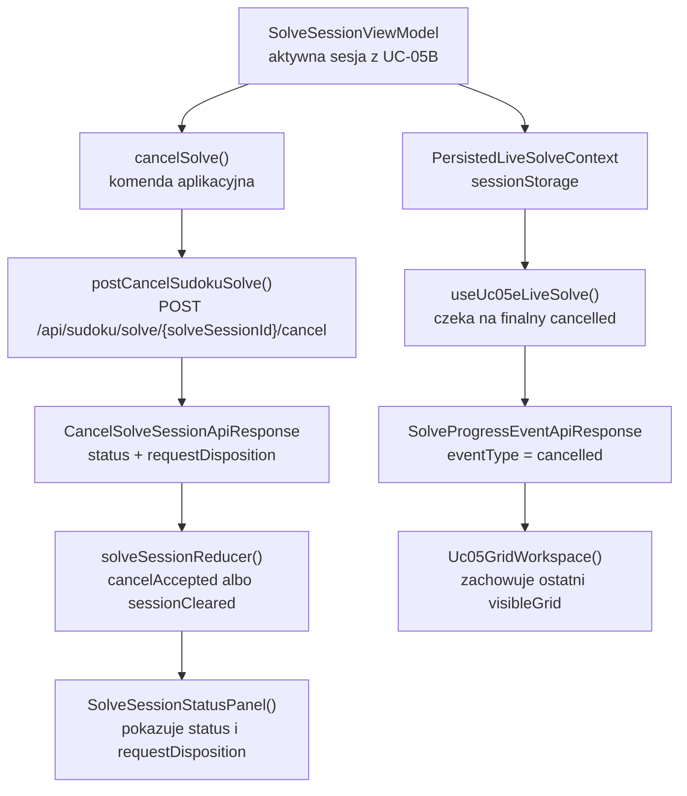
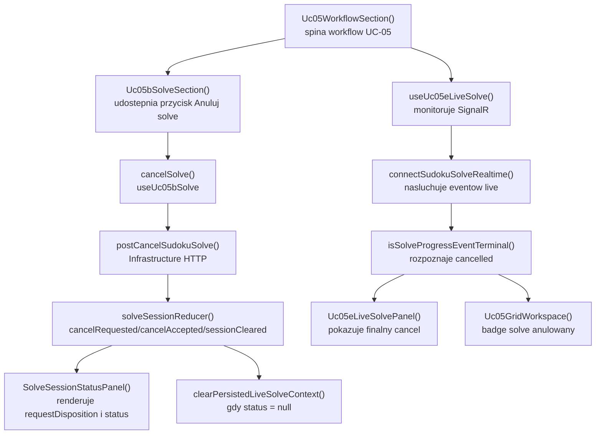

# UC-05E-FE - Plan implementacyjny dla `POST /api/sudoku/solve/{solveSessionId}/cancel`

## 1) Przeznaczenie endpointa
- Z perspektywy `FE` endpoint `POST /api/sudoku/solve/{solveSessionId}/cancel` sluzy do kooperacyjnego anulowania aktywnej sesji rozwiazywania sudoku uruchomionej w `UC-05B` i monitorowanej w `UC-05E`.
- To nie jest endpoint wyniku koncowego. Odpowiedz `202 Accepted` nie oznacza jeszcze, ze sesja jest juz w stanie `cancelled`.
- Publiczny kontrakt ma rozdzielac dwa etapy:
  - komenda HTTP "przyjmij zadanie anulowania",
  - finalny stan `cancelled`, ktory wraca asynchronicznie przez `SignalR`.
- `FE` komunikuje sie tylko z `BE`; nie ma zadnego fallbacku do `ML`.
- Historyjka jest powiazana z:
  - `UC-05B`, bo reuse'uje te sama sesje solve i ten sam `solveSessionId`,
  - `UC-05E`, bo finalne domkniecie cancel odbywa sie przez event `cancelled`.

## 2) Zakres i zalozenia
- Plan dotyczy tylko frontendu w `src/Frontend`.
- Plan ma byc `reuse-first`, bo w repo sa juz gotowe elementy `UC-05B` i `UC-05E`.
- Nie sugerujemy sie biezaca implementacja `BE` ani `ML`; plan bazuje na kontraktach historyjek i `PRD`.
- Nie wolno zmieniac juz ustalonych nazw kontraktow i pol:
  - `solveSessionId`,
  - `progressChannelUrl`,
  - `CancelSolveSessionApiResponse`,
  - `SolveSessionApiResponse`,
  - `SolveProgressEventApiResponse`,
  - `ErrorApiResponse`,
  - `RecognizedGrid`.
- `Cancel` jest komenda na istniejacej sesji i nie moze budowac osobnego store, osobnego klienta API ani osobnego workflow UI.
- `FE` nie moze po samym `202` udawac, ze sesja jest juz terminalnie anulowana.
- Jesli backend zwroci `status = null`, `FE` interpretuje to jako accepted no-op dla sesji juz zakonczonej albo niedopasowanej i czyści lokalny kontekst sesji, ale nadal nie generuje sztucznego eventu `cancelled`.

## 3) Kontrakt `FE -> BE`

### 3.1 `POST /api/sudoku/solve/{solveSessionId}/cancel`
- Request body: brak.
- Path param:
  - `solveSessionId: string`
- Naglowki:
  - `Accept: application/json`
- Sukces:
  - `202 Accepted` -> `CancelSolveSessionApiResponse`
- Blad:
  - `ErrorApiResponse`

Przyklad odpowiedzi:

```json
{
  "status": "cancelling",
  "requestDisposition": "accepted"
}
```

### 3.2 Znaczenie odpowiedzi po stronie `FE`
- `202` z `status = "cancelling"`
  - backend przyjal zadanie anulowania,
  - `FE` utrzymuje sesje jako aktywna w stanie przejsciowym,
  - `FE` nadal czeka na terminalny event `cancelled`.
- `202` z `status = "queued"` albo `status = "running"`
  - backend przyjal komende, ale zwraca jeszcze biezacy stan sesji,
  - `FE` nie wymusza lokalnie `cancelling`,
  - `FE` pokazuje `requestDisposition` i pozostaje w monitoringu.
- `202` z `status = null`
  - `FE` czyści lokalna sesje oraz persisted context live solve,
  - traktuje odpowiedz jako accepted no-op dla sesji juz zakonczonej albo niedopasowanej.

### 3.3 Defensywna interpretacja `requestDisposition`
- `requestDisposition` ma byc traktowane jako publiczny `string`.
- `FE` nie powinno usztywniac wszystkich wartosci enumem lokalnym, jesli nie ma takiego wymagania biznesowego.
- `FE` moze jedynie rozroznic dwie klasy zachowan:
  - "zadanie przyjete / sesja istnieje nadal" -> utrzymujemy sesje,
  - "no-op / brak dopasowania" -> czyscimy sesje, jesli `status = null`.

### 3.4 Modele API, ktorych `FE` ma uzywac bez zmiany nazw
- `[REUSE]` `CancelSolveSessionApiResponse`
- `[REUSE]` `SolveSessionApiResponse`
- `[REUSE]` `SolveProgressEventApiResponse`
- `[REUSE]` `ErrorApiResponse`

## 4) Interpretacja warstw FE dla tego planu
- `Api`
  - widok przycisku cancel i statusow UX,
  - prezentacja `requestDisposition`, `cancelling` i finalnego `cancelled`.
- `Application`
  - orkiestracja klikniecia cancel,
  - aktualizacja stanu sesji po odpowiedzi `202`,
  - czyszczenie lokalnego stanu i persisted context, jesli sesja nie istnieje,
  - pozostawienie domkniecia koncowego dla `UC-05E`.
- `Domain`
  - statusy sesji i reguly aktywnosci/terminalnosci,
  - brak logiki transportowej.
- `Infrastructure`
  - wykonanie `POST /cancel`,
  - walidacja `CancelSolveSessionApiResponse`,
  - storage `sessionStorage` dla kontekstu live solve,
  - kanal `SignalR`, ktory dostarcza finalne `cancelled`.

## 5) Zachowanie per warstwa

### Api
- Warstwa `Api` udostepnia:
  - przycisk `Anuluj solve`,
  - stan `Anulowanie...`,
  - czytelny komunikat o `requestDisposition`,
  - komunikat, ze finalny stan przyjdzie przez `SignalR`.
- `Api` nie wykonuje `fetch`.
- `Api` nie interpretuje `requestDisposition` biznesowo poza prezentacja tekstu.
- `Api` nie czyta `sessionStorage`.
- `Api` nie generuje sztucznego `cancelled`.

### Application
- Warstwa `Application` odpowiada za:
  - blokade cancel, gdy nie ma lokalnie znanej aktywnej sesji,
  - wyslanie `POST /cancel`,
  - mapowanie `202` do lokalnego stanu sesji,
  - wyczyszczenie stanu i persisted context, gdy `status = null`,
  - pozostawienie finalnego `cancelled` do `useUc05eLiveSolve()`.
- `Application` nie moze zakladac, ze odpowiedz cancel jest rownoznaczna z eventem terminalnym.
- `Application` nie moze resetowac aktualnego `visibleGrid`, dopoki nie przyjdzie finalny event albo no-op `status = null`.

### Domain
- Warstwa `Domain` reuse'uje:
  - `SolveSessionStatus`,
  - `isActiveSolveSessionStatus()`,
  - `isTerminalSolveSessionStatus()`.
- `Domain` nie potrzebuje osobnego modelu tylko dla cancel.
- `Domain` nie zna:
  - `fetch`,
  - React hookow,
  - `console`,
  - `sessionStorage`,
  - `SignalR`.

### Infrastructure
- Warstwa `Infrastructure` wykonuje:
  - `postCancelSudokuSolve()`,
  - `clearPersistedLiveSolveContext()`,
  - `connectSudokuSolveRealtime()`.
- `Infrastructure` nie decyduje:
  - czy sesje nalezy utrzymac lokalnie po `202`,
  - czy `requestDisposition` jest duplikatem czy no-opem w sensie UX,
  - kiedy uznac cancel za zakonczony biznesowo.

## 6) Weryfikacja istniejacych uslug i antyduplikacja
- W repo istnieje juz klient HTTP:
  - `[REUSE]` `src/Frontend/src/api/sudokuSolve.ts`
  - wniosek: nie tworzyc drugiego klienta tylko dla cancel.
- W repo istnieje juz glowna orkiestracja sesji solve:
  - `[REUSE]` `src/Frontend/src/features/uc05b/application/useUc05bSolve.ts`
  - wniosek: cancel pozostaje tutaj; nie tworzyc osobnego hooka `useUc05CancelSolve()`.
- W repo istnieje juz reducer sesji solve:
  - `[REUSE]` `src/Frontend/src/features/uc05b/application/solveSessionReducer.ts`
  - wniosek: nie budowac rownoleglego store cancel.
- W repo istnieje juz live workflow:
  - `[REUSE]` `src/Frontend/src/features/uc05e/application/useUc05eLiveSolve.ts`
  - wniosek: finalny event `cancelled` ma nadal domykac sesje tam, a nie w warstwie HTTP.
- W repo istnieje juz adapter storage:
  - `[REUSE]` `src/Frontend/src/features/uc05e/infrastructure/solveLiveSessionStorage.ts`
  - wniosek: przy `status = null` trzeba reuse'owac ten sam adapter do czyszczenia persisted context, a nie dodawac nowego klucza storage.
- W repo istnieje juz wspolny komponent statusu:
  - `[REUSE]` `src/Frontend/src/features/uc05b/api/SolveSessionStatusPanel.tsx`
  - wniosek: tam nalezy pokazywac `requestDisposition`, a nie budowac osobnego panelu cancel.

## 7) Pliki per warstwa i odpowiedzialnosci

### 7.1 Api
- `[REUSE]` `src/Frontend/src/features/uc05/api/Uc05WorkflowSection.tsx`
  - spina `UC-05A`, `UC-05B` i `UC-05E`,
  - przekazuje `cancelSolve()` do panelu solve,
  - nie przejmuje logiki anulowania.
- `[MODYFIKACJA]` `src/Frontend/src/features/uc05b/api/Uc05bSolveSection.tsx`
  - renderuje przycisk `Anuluj solve`,
  - blokuje przycisk zgodnie z `canCancelSolve`,
  - komunikuje stan `Anulowanie...`,
  - opcjonalnie doprecyzowuje copy, ze finalny `cancelled` przyjdzie przez live monitoring.
- `[MODYFIKACJA]` `src/Frontend/src/features/uc05b/api/SolveSessionStatusPanel.tsx`
  - pokazuje:
    - status backendu,
    - `requestDisposition`,
    - komunikat o stanie `cancelling`,
    - roznice miedzy "request accepted" a "session cancelled".
- `[REUSE]` `src/Frontend/src/features/uc05e/api/Uc05eLiveSolvePanel.tsx`
  - pokazuje finalny event `cancelled`,
  - nie wymaga osobnego flow cancel.
- `[REUSE]` `src/Frontend/src/features/uc05/api/Uc05GridWorkspace.tsx`
  - zachowuje ostatni poprawny `visibleGrid`,
  - po event `cancelled` pokazuje badge `solve anulowany`.
- `[BRAK ZMIAN]` `src/Frontend/src/App.tsx`
  - pozostaje composition root,
  - nie przejmuje stanu cancel.

### 7.2 Application
- `[MODYFIKACJA]` `src/Frontend/src/features/uc05b/application/useUc05bSolve.ts`
  - glowna orkiestracja cancel po HTTP,
  - wysyla `postCancelSudokuSolve()`,
  - mapuje `202`,
  - przy `status = null` czyści lokalna sesje i persisted context,
  - nie generuje lokalnie terminalnego `cancelled`.
- `[REUSE]` `src/Frontend/src/features/uc05b/application/solveSessionReducer.ts`
  - obsluguje:
    - `cancelRequested`,
    - `cancelAccepted`,
    - `sessionCleared`.
- `[REUSE]` `src/Frontend/src/features/uc05b/application/solveSessionTypes.ts`
  - przechowuje:
    - `cancelDisposition`,
    - `phase = "cancelling"`,
    - `SolveSessionError`.
- `[REUSE]` `src/Frontend/src/features/uc05e/application/useUc05eLiveSolve.ts`
  - domyka workflow po event `cancelled`,
  - czyści persisted context po terminalnym evencie,
  - nie powinien dostawac sztucznego eventu z warstwy HTTP.
- `[REUSE]` `src/Frontend/src/features/uc05e/application/solveLiveReducer.ts`
  - utrzymuje `terminalEventType = "cancelled"`,
  - ustawia stan connection jako terminalny bez dodawania osobnego `cancelled` w `SolveLiveConnectionState`.

### 7.3 Domain
- `[REUSE]` `src/Frontend/src/features/uc05b/domain/solveSessionStatus.ts`
  - zrodlo prawdy dla statusow:
    - `queued`,
    - `running`,
    - `cancelling`,
    - `completed`,
    - `failed`,
    - `cancelled`.
- `[REUSE]` `src/Frontend/src/features/uc05b/domain/createGridSignature.ts`
  - pomocniczo chroni przed wznowieniem starej sesji po cancel/recovery.
- `[REUSE]` `src/Frontend/src/features/uc05e/domain/solveProgressEvent.ts`
  - utrzymuje `eventType = "cancelled"`.
- `[REUSE]` `src/Frontend/src/features/uc05e/domain/isSolveProgressEventTerminal.ts`
  - klasyfikuje `cancelled` jako terminalne.
- `[REUSE]` `src/Frontend/src/features/uc05e/domain/shouldAcceptSolveProgressEvent.ts`
  - chroni przed opoznionymi eventami po cancel.
- `[REUSE]` `src/Frontend/src/features/uc05e/domain/assertInputCellsInvariant.ts`
  - pozostaje aktywne rowniez dla eventu `cancelled`.
- `[REUSE]` `src/Frontend/src/features/uc05a/domain/recognizedGrid.ts`
  - jedyny lokalny model planszy; cancel nie wprowadza nowego modelu.

### 7.4 Infrastructure
- `[REUSE]` `src/Frontend/src/api/sudokuSolve.ts`
  - funkcja `postCancelSudokuSolve()`,
  - walidacja `CancelSolveSessionApiResponse`,
  - `SudokuSolveApiError`.
- `[REUSE]` `src/Frontend/src/api/shared/fetchJson.ts`
  - wspolny helper JSON.
- `[REUSE]` `src/Frontend/src/features/uc05e/infrastructure/solveLiveSessionStorage.ts`
  - `clearPersistedLiveSolveContext()` przy no-op `status = null` albo po finalnym `cancelled`.
- `[REUSE]` `src/Frontend/src/api/sudokuSolveRealtime.ts`
  - nadal odbiera finalny event `cancelled`.
- `[BRAK ZMIAN]` `src/Frontend/src/types/api.ts`
  - typy `CancelSolveSessionApiResponse` i `SolveProgressEventApiResponse` juz istnieja.
- `[BRAK ZMIAN]` `src/Frontend/src/shared/realtime/buildHubUrl.ts`
  - cancel nie wymaga zmiany budowy URL realtime.
- `[MODYFIKACJA OPCJONALNA]` `src/Frontend/src/index.css`
  - tylko jesli potrzebne sa drobne poprawki copy/badge dla `cancelling` i `requestDisposition`.

## 8) Docelowy przeplyw w FE
1. `UC-05A` buduje `recognizedGrid`.
2. `UC-05B` uruchamia `POST /api/sudoku/solve` i zapisuje aktywna sesje.
3. `UC-05E` rozpoczyna monitoring live i zapisuje persisted context w `sessionStorage`.
4. Uzytkownik klika `Anuluj solve`.
5. `useUc05bSolve()` wysyla `POST /api/sudoku/solve/{solveSessionId}/cancel`.
6. Jesli backend zwroci `202` z `status != null`:
   - `FE` aktualizuje status sesji,
   - zapisuje `requestDisposition`,
   - pozostawia monitoring live aktywny.
7. Jesli backend zwroci `202` z `status = null`:
   - `FE` czyści lokalna sesje,
   - czyści persisted context,
   - nie generuje sztucznego `cancelled`.
8. Jesli sesja nadal istnieje, `SignalR` dostarcza finalny event `cancelled`.
9. `useUc05eLiveSolve()` przyjmuje event terminalny:
   - zachowuje ostatni poprawny `visibleGrid`,
   - ustawia `terminalEventType = "cancelled"`,
   - czyści persisted context,
   - rozlacza monitoring.

## 9) Skrocony przeplyw po stronie BE wymagany przez FE
Ta sekcja opisuje tylko kontraktowe minimum potrzebne frontendowi.

1. `FE` wysyla `POST /api/sudoku/solve/{solveSessionId}/cancel`.
2. `BE` sprawdza, czy wskazana sesja jest aktywna i czy da sie jej przekazac zadanie anulowania.
3. `BE` zawsze zwraca `202 Accepted`, rowniez dla no-op albo duplikatu.
4. `BE` zwraca:
   - `status` dopasowanej sesji albo `null`,
   - `requestDisposition`.
5. `BE` nie zwraca przez ten endpoint finalnego `currentGrid`.
6. Jesli sesja istnieje i anulowanie zostalo przyjete, `BE` publikuje finalnie event `cancelled` przez `SignalR`.
7. Jesli sesja nie istnieje albo jest juz zakonczona, `BE` moze zwrocic `status = null` i odpowiedni `requestDisposition`, bez dodatkowego eventu.

## 10) Glowne funkcje
- `cancelSolve()`
- `postCancelSudokuSolve()`
- `solveSessionReducer()`
- `isActiveSolveSessionStatus()`
- `isTerminalSolveSessionStatus()`
- `clearPersistedLiveSolveContext()`
- `useUc05eLiveSolve()`
- `connectSudokuSolveRealtime()`
- `isSolveProgressEventTerminal()`
- `shouldAcceptSolveProgressEvent()`

## 11) Wyjatki, fallbacki i zachowanie bledowe

### 11.1 `202 Accepted`
- `status = "cancelling"`
  - pokazac, ze zadanie anulowania zostalo przyjete,
  - nie domykac sesji lokalnie.
- `status = "queued"` albo `status = "running"`
  - traktowac jako accepted request z opozniona zmiana statusu,
  - nadal czekac na live eventy.
- `status = null`
  - wyczyscic lokalna sesje,
  - wyczyscic persisted context,
  - nie zgadywac, czy finalnie byla to sesja `cancelled`, `completed` czy juz niedopasowana.

### 11.2 `4xx`
- Docelowy kontrakt produktu zaklada `202 Accepted`, wiec `4xx` traktujemy defensywnie jako regres albo blad techniczny.
- `400`
  - blad kontraktowy albo niepoprawny `solveSessionId`,
  - pokazac techniczny blad,
  - nie czyscic sesji na slepo.
- `404`
  - traktowac jako regres kontraktu `cancel-always-202`,
  - zalogowac `console.warn` albo `console.error`,
  - nie budowac glownego UX wokol tego scenariusza.
- `401` albo `403`
  - traktowac jako regres, bo flow solve ma pozostac publiczny,
  - nie probowac fallbacku do tokenu administracyjnego.

### 11.3 `5xx`
- pokazac techniczny blad cancel,
- pozostawic lokalna sesje,
- pozwolic na retry cancel albo manualny recovery.

### 11.4 Fallbacki
- Brak fallbacku do lokalnego solvera w przegladarce.
- Brak fallbacku do bezposredniego `ML`.
- Brak fallbacku do sztucznego eventu `cancelled`.
- Brak fallbacku do pollingowego zgadywania wyniku po samym `cancel`.

### 11.5 Scenariusze graniczne
- Uzytkownik klika `Anuluj solve`, gdy nie ma lokalnie aktywnej sesji
  - przycisk ma byc zablokowany.
- `cancel` przychodzi po tym, jak live sesja juz terminalnie sie domknela
  - `FE` powinno obsluzyc no-op bez crasha.
- Po `202` live monitoring rozlacza sie chwilowo
  - `FE` nie traci sesji; nadal mozna oczekiwac na `cancelled` po reconnect.
- `cancel` zwrocil `status = null`, ale w storage zostal stary kontekst
  - plan wymaga wyczyszczenia storage od razu przy `sessionCleared`.

## 12) Specyficzna logika i pseudokod

### 12.1 Cancel po HTTP

```text
cancelSolve(activeSession):
  if activeSession is null:
    return

  setState(phase = "cancelling", error = null)

  response = postCancelSudokuSolve(activeSession.solveSessionId)

  if response.status is null:
    clearPersistedLiveSolveContext()
    clearSession(requestDisposition = response.requestDisposition)
    return

  setState(
    phase = "active",
    session.status = response.status,
    cancelDisposition = response.requestDisposition
  )
```

### 12.2 Domkniecie cancel przez live event

```text
ingestSolveEvent(event):
  if event.eventType != "cancelled":
    handle normally
    return

  accept event by solveSessionId and sequence
  keep last valid currentGrid as visibleGrid
  set terminalEventType = "cancelled"
  clearPersistedLiveSolveContext()
  disconnectRealtime()
```

### 12.3 Defensive clear przy no-op

```text
onCancelAcceptedWithNullStatus():
  clearPersistedLiveSolveContext()
  dispatch(sessionCleared)
  showInfo("Aktywna sesja solve nie byla juz dostepna do anulowania.")
```

## 13) Mermaid flowchart - flow modeli



## 14) Mermaid flowchart - logika aplikacji z funkcjami



## 15) Workflow GitHub i runtime
- `[BRAK ZMIAN FE]` `.github/workflows/frontend-cd.yml`
  - cancel nie wymaga nowych zmiennych frontendowych,
  - frontend nadal buduje statyczny bundle,
  - dalej uzywa `VITE_API_BASE_URL`.
- Lokalnie:
  - frontend fallbackuje do `"/api"`,
  - backendowe wartosci runtime sa ustalane po stronie `appsettings.local.json`,
  - `FE` nie czyta `appsettings`.
- Produkcyjnie:
  - workflow backendu generuje produkcyjne `appsettings*.json`,
  - nginx wystawia publiczne `/api/...`,
  - `FE` nie zna sciezek runtime backendu ani ML.
- Wniosek dla tej historyjki:
  - brak zmian w `frontend-cd.yml`,
  - brak zmian w paczkowaniu `dist/`,
  - ewentualne wymagania po stronie infra/BE to tylko utrzymanie publicznego routingu `/api/sudoku/solve/{solveSessionId}/cancel` oraz websocket proxy dla domkniecia `cancelled`.

## 16) Logging i diagnostyka FE
- Logi maja pomoc sledzic cancel bez spamowania konsoli.

### 16.1 `console.info`
- wyslanie cancel przyjete przez backend,
- `requestDisposition`,
- finalny event `cancelled`.

### 16.2 `console.warn`
- cancel przyjety jako no-op (`status = null`),
- `404` jako regres kontraktu,
- opoznione eventy po cancel.

### 16.3 `console.error`
- `401/403` dla publicznego cancel,
- `5xx`,
- niepoprawny ksztalt `CancelSolveSessionApiResponse`,
- nieudane domkniecie live po teoretycznie przyjetym cancel.

### 16.4 Guardraile logowania
- nie logowac pelnego `currentGrid` per event,
- nie logowac `base64`,
- logowac tylko lekkie dane:
  - `solveSessionId`,
  - `status`,
  - `requestDisposition`,
  - `eventType`,
  - `errorType`.

## 17) Inne istotne reguly
- Nie tworzyc osobnego klienta API dla cancel.
- Nie przenosic cancel do `App.tsx`.
- Nie traktowac `202` jako finalnego `cancelled`.
- Nie wiazac cancel z tokenem administracyjnym z `UC-13`.
- Nie dublowac storage tylko dla cancel.
- Nie kasowac `visibleGrid`, jesli cancel dopiero zostal przyjety.
- Nie zmieniac nazw kontraktow, ktore juz istnieja.

## 18) Kolejnosc implementacji kodu dla historyjki
Poniewaz wiekszosc klockow juz istnieje, kolejnosc powinna byc `reuse-first`:

1. Zweryfikowac `postCancelSudokuSolve()` w `src/api/sudokuSolve.ts` jako jedyny klient HTTP cancel.
2. Zweryfikowac `useUc05bSolve()` jako jedyne miejsce orkiestracji cancel po HTTP.
3. Dopiac w `useUc05bSolve()` czyszczenie `PersistedLiveSolveContext`, gdy `response.status === null`.
4. Zweryfikowac `solveSessionReducer()` i `solveSessionTypes.ts`, czy poprawnie utrzymuja `cancelDisposition` i `phase = "cancelling"`.
5. Dopracowac `SolveSessionStatusPanel.tsx`, aby czytelnie rozdzielal:
   - request accepted,
   - no-op,
   - finalny `cancelled`.
6. Zweryfikowac `useUc05eLiveSolve()`, aby finalny event `cancelled` pozostawal jedynym zrodlem domkniecia live workflow.
7. Dopracowac copy w `Uc05bSolveSection.tsx` i `Uc05eLiveSolvePanel.tsx`, jesli komunikaty sa niejednoznaczne.
8. Uruchomic reczna weryfikacje scenariuszy.
9. Uruchomic `npm run check`.

## 19) Guardraile implementacyjne
- `cancel` po HTTP nie moze generowac lokalnego `terminalEventType = "cancelled"`.
- `useUc05bSolve()` nie moze tworzyc drugiego store obok `solveSessionReducer`.
- `useUc05eLiveSolve()` pozostaje jedynym miejscem domkniecia live eventem `cancelled`.
- `Infrastructure` nie interpretuje biznesowo `requestDisposition`.
- `Api` nie czyta `sessionStorage`.
- Przy `status = null` trzeba czyscic persisted context od razu, zeby nie zostawic stalego resume po refresh.
- Nie dodawac pollingu jako obejscia dla cancel.
- Nie dodawac nowych zaleznosci npm.

## 20) Zaleznosci pomiedzy historyjkami

### Wejsciowe
- `UC-05A`
  - dostarcza `RecognizedGrid`, na ktorym opiera sie cala sesja solve.
- `UC-05B`
  - dostarcza:
    - start sesji solve,
    - `SolveSessionApiResponse`,
    - bazowy stan sesji po HTTP.
- `UC-05E`
  - dostarcza:
    - live monitoring,
    - terminalny event `cancelled`,
    - persisted context w `sessionStorage`.
- `UC-06`
  - dostarcza wzorzec UX i realtime dla asynchronicznych workflow.
- `UC-13`
  - potwierdza, ze flow solve pozostaje publiczny i bez tokenu admina.

### Wyjsciowe
- `UC-05E` finalizuje cancel w czasie rzeczywistym.
- przyszle historyjki korekty gridu
  - moga reuse'owac zachowanie "nie nadpisuj stalej sesji".
- `UC-05D`
  - nie zmienia kontraktu cancel, ale skorzysta z poprawnie domknietej sesji solve.

### Co juz istnieje i ma byc reuse'owane
- `src/Frontend/src/api/sudokuSolve.ts`
- `src/Frontend/src/features/uc05b/application/useUc05bSolve.ts`
- `src/Frontend/src/features/uc05b/application/solveSessionReducer.ts`
- `src/Frontend/src/features/uc05b/application/solveSessionTypes.ts`
- `src/Frontend/src/features/uc05b/api/Uc05bSolveSection.tsx`
- `src/Frontend/src/features/uc05b/api/SolveSessionStatusPanel.tsx`
- `src/Frontend/src/features/uc05e/application/useUc05eLiveSolve.ts`
- `src/Frontend/src/features/uc05e/infrastructure/solveLiveSessionStorage.ts`
- `src/Frontend/src/api/sudokuSolveRealtime.ts`

## 21) Model API wejsciowy i wyjsciowy w komunikacji z BE

### FE -> BE
- `POST /api/sudoku/solve/{solveSessionId}/cancel`
  - request body: brak
  - path param:
    - `solveSessionId: string`
  - headers:
    - `Accept: application/json`

### BE -> FE
- `202 Accepted` -> `CancelSolveSessionApiResponse`

```json
{
  "status": "cancelling",
  "requestDisposition": "accepted"
}
```

- `4xx/5xx` -> `ErrorApiResponse`

```json
{
  "errorType": "solve_cancel_failed",
  "message": "Nie udalo sie przyjac zadania anulowania sesji solve."
}
```

### Lokalny model FE
- `SolveSessionViewModel`
  - `solveSessionId: string`
  - `status: SolveSessionStatus`
  - `progressChannelUrl: string`
  - `startedGridSignature: string | null`
  - `isSessionStaleForCurrentGrid: boolean`
- `SolveSessionState`
  - `phase: "idle" | "starting" | "recovering" | "active" | "cancelling" | "error"`
  - `session: SolveSessionViewModel | null`
  - `cancelDisposition: string | null`
- `SolveLiveState`
  - `terminalEventType: "completed" | "failed" | "cancelled" | null`
  - `visibleGrid: RecognizedGrid | null`

## 22) Plan weryfikacji minimum
- `npm run check`
- scenariusz happy path cancel:
  - aktywna sesja istnieje,
  - `POST /cancel` zwraca `202` z `status = "cancelling"`,
  - finalnie przychodzi event `cancelled`.
- scenariusz no-op:
  - `POST /cancel` zwraca `202` z `status = null`,
  - `FE` czyści sesje i storage,
  - nie pokazuje sztucznego `cancelled`.
- scenariusz `5xx`:
  - sesja pozostaje lokalnie,
  - uzytkownik moze ponowic cancel.
- scenariusz refresh po no-op:
  - brak stalego persisted context.
- scenariusz opoznionego eventu po cancel:
  - starszy event jest ignorowany przez `sequence`.

## 23) Podsumowanie decyzji architektonicznych
- `POST /api/sudoku/solve/{solveSessionId}/cancel` jest tylko komenda anulowania, nie wynikiem koncowym.
- `UC-05B` pozostaje wlascicielem HTTP cancel.
- `UC-05E` pozostaje wlascicielem terminalnego `cancelled`.
- Plan nie doklada nowych plikow ani nowych zaleznosci; opiera sie glownie na `REUSE` i kilku punktowych modyfikacjach.
- Najwazniejsza korekta implementacyjna dla tej historyjki to spójne czyszczenie lokalnego kontekstu przy odpowiedzi `202` z `status = null`, bez psucia kontraktu live solve.
