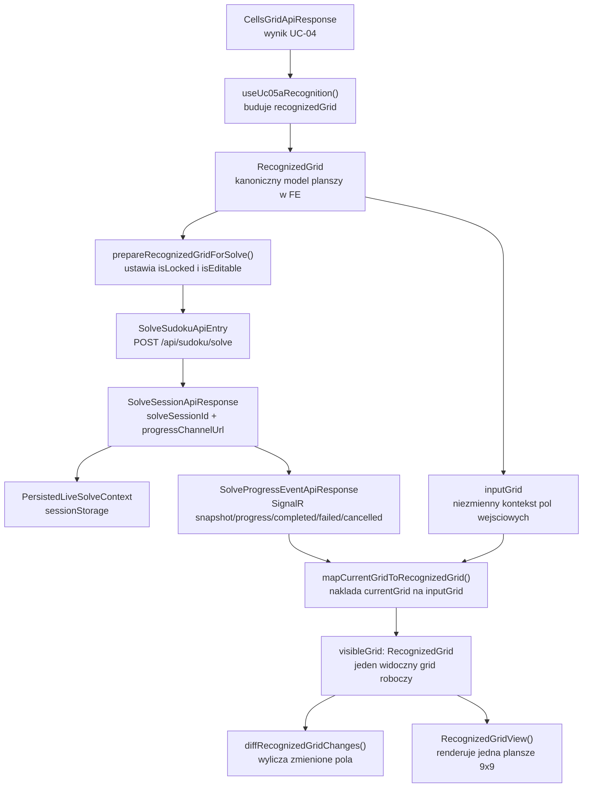
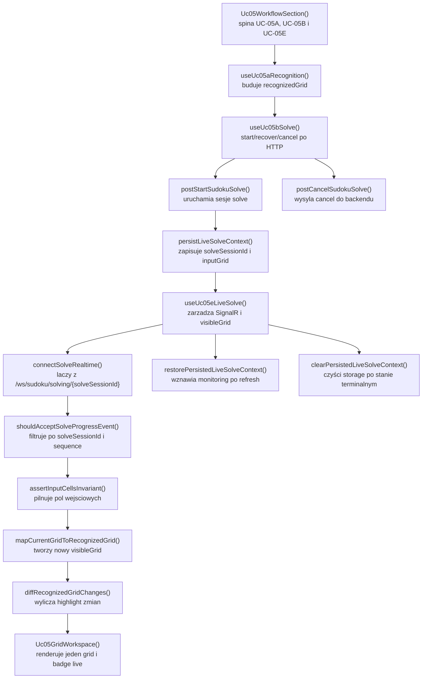

# UC-05E-FE - Plan implementacyjny dla `SignalR /ws/sudoku/solving/{solveSessionId}`

## 1) Przeznaczenie endpointa
- Z perspektywy `FE` kanal `SignalR /ws/sudoku/solving/{solveSessionId}` sluzy do publicznego monitorowania aktywnej sesji backtrackingu uruchomionej w `UC-05B`.
- Kanal nie startuje solvera. Start sesji nadal odbywa sie przez `POST /api/sudoku/solve`.
- Kanal nie zwraca osobnego modelu delty. Kazdy event niesie pelny `currentGrid`, ktory `FE` przyjmuje albo odrzuca na podstawie:
  - `solveSessionId`,
  - `sequence`.
- `UC-05E-FE` ma pokazac jeden widoczny grid roboczy dla calego `UC-05`, a nie trzeci, osobny widok planszy obok `recognizedGrid` z `UC-05A`.
- Zakres historyjki po stronie `FE` obejmuje:
  - podlaczenie do kanalu live solve po `202 Accepted` z `UC-05B`,
  - przyjecie `snapshot`, `progress`, `completed`, `failed`, `cancelled`,
  - nadpisywanie jednego widocznego gridu pelnym `currentGrid`,
  - lokalne wyliczanie zmian miedzy poprzednim i nowym snapshotem,
  - odzyskanie monitoringu aktywnej sesji z zachowaniem kontekstu gridu,
  - obsluge reconnect, duplikatow i opoznionych eventow,
  - pokazanie finalnego sukcesu, porazki lub anulowania.
- Zakres historyjki po stronie `FE` nie obejmuje:
  - bezposredniego wywolania `ML`,
  - pollingowego zastepnika dla live progress,
  - nowego endpointu startowego,
  - zmiany kontraktow `UC-05A`, `UC-05B`, `UC-06`,
  - overlay z `UC-05D`.

## 2) Zakres i zalozenia
- Plan dotyczy wylacznie `src/Frontend`.
- Punkty odniesienia:
  - `PRD`,
  - `UC-05`,
  - `UC-05B`,
  - `UC-05E`,
  - wzorce realtime z `UC-06`,
  - aktualna implementacja `UC-05A` i `UC-05B` w `src/Frontend`.
- Nie sugerujemy sie tym, co jest aktualnie zaimplementowane po stronie `BE` i `ML`; plan opiera sie na docelowych kontraktach historyjek.
- `UC-05E-FE` nie zmienia nazw juz ustalonych obiektow i pol, m.in.:
  - `RecognizedGrid`,
  - `RecognizedCell`,
  - `SolveSudokuApiEntry`,
  - `SolveSessionApiResponse`,
  - `solveSessionId`,
  - `progressChannelUrl`,
  - `ErrorApiResponse`.
- `UC-05E-FE` ma reuse'owac istniejacy flow `UC-05B`, a nie zastapic go nowym hookiem startowym.
- Widok ma utrzymywac jeden grid roboczy w `UC-05`, ktory przechodzi przez stany:
  - `recognizedGrid` po `UC-05A`,
  - `solve-ready grid` po `UC-05B`,
  - kolejne snapshoty `currentGrid` po `UC-05E`.
- Poniewaz `GET /api/sudoku/solve/active` nie niesie `inputGrid`, `FE` musi utrwalic lekki kontekst lokalny sesji live, aby po odswiezeniu nadal wiedziec, ktore pola byly wejsciowe i zablokowane.
- Do utrwalenia lokalnego nalezy uzyc `sessionStorage`, a nie `localStorage`, zeby nie robic stalego, dlugozyjacego cache'u cudzych sesji solve.

## 3) Kontrakt `FE -> BE`

### 3.1 Start sesji live solve
`UC-05E` reuse'uje start z `UC-05B`.

#### `POST /api/sudoku/solve`
- Request body: `SolveSudokuApiEntry`
- Success: `202 Accepted` -> `SolveSessionApiResponse`
- Error: `ErrorApiResponse`

Przyklad:

```json
{
  "grid": [
    [5, 3, null, null, 7, null, null, null, null],
    [6, null, null, 1, 9, 5, null, null, null],
    [null, 9, 8, null, null, null, null, 6, null],
    [8, null, null, null, 6, null, null, null, 3],
    [4, null, null, 8, null, 3, null, null, 1],
    [7, null, null, null, 2, null, null, null, 6],
    [null, 6, null, null, null, null, 2, 8, null],
    [null, null, null, 4, 1, 9, null, null, 5],
    [null, null, null, null, 8, null, null, 7, 9]
  ]
}
```

```json
{
  "solveSessionId": "solve-20260515-191500-demo-01",
  "status": "queued",
  "progressChannelUrl": "/ws/sudoku/solving/solve-20260515-191500-demo-01"
}
```

### 3.2 Odczyt aktywnej sesji
#### `GET /api/sudoku/solve/active`
- Success:
  - `200 OK` -> `SolveSessionApiResponse`
  - `204 No Content`
- Error: `ErrorApiResponse`

Semantyka po stronie `FE`:
- `200` oznacza: istnieje aktywna sesja, do ktorej mozna sprobowac podpiac monitoring live.
- `204` oznacza: brak aktywnej sesji.
- Sam `GET /active` nie wystarcza do odtworzenia jednego gridu roboczego po refresh bez lokalnie utrwalonego `inputGrid`.

### 3.3 Anulowanie aktywnej sesji
#### `POST /api/sudoku/solve/{solveSessionId}/cancel`
- Success: `202 Accepted` -> `CancelSolveSessionApiResponse`
- Error: `ErrorApiResponse`

Przyklad:

```json
{
  "status": "cancelling",
  "requestDisposition": "accepted"
}
```

### 3.4 Kanal live progress
#### `SignalR /ws/sudoku/solving/{solveSessionId}`
- Nie przyjmuje request body.
- `FE` laczy sie dopiero po:
  - sukcesie `POST /api/sudoku/solve`,
  - albo po potwierdzonym odzyskaniu aktywnej sesji.
- Rekomendowany publiczny kontrakt metod huba, analogiczny do wzorca z `UC-06`:
  - `solveSnapshot`,
  - `solveEvent`.
- `FE` nie wysyla aplikacyjnego `ACK`.
- `FE` nie steruje solverem przez kanal.

### 3.5 Wspolny model eventu
- `[NOWY]` `SolveProgressEventApiResponse`

Minimalny kontrakt:

```json
{
  "eventType": "progress",
  "solveSessionId": "solve-20260515-191500-demo-01",
  "status": "running",
  "sequence": 14,
  "currentGrid": [
    [5, 3, 4, null, 7, null, null, null, null],
    [6, null, null, 1, 9, 5, null, null, null],
    [null, 9, 8, null, null, null, null, 6, null],
    [8, null, null, null, 6, null, null, 2, 3],
    [4, null, null, 8, null, 3, null, null, 1],
    [7, null, null, null, 2, null, null, null, 6],
    [null, 6, null, null, null, null, 2, 8, null],
    [null, null, null, 4, 1, 9, null, null, 5],
    [null, null, null, null, 8, null, null, 7, 9]
  ],
  "errorType": null,
  "message": null
}
```

### 3.6 Modele API, ktorych `FE` ma uzywac bez zmiany nazw
- `[REUSE]` `SolveSudokuApiEntry`
- `[REUSE]` `SolveSessionApiResponse`
- `[REUSE]` `CancelSolveSessionApiResponse`
- `[REUSE]` `ErrorApiResponse`
- `[NOWY]` `SolveProgressEventApiResponse`
- `[REUSE]` `RecognizedGrid` jako kanoniczny lokalny model widocznej planszy

## 4) Interpretacja warstw FE dla tego planu
Poniewaz architektura FE jest feature-based, a nie globalnie ustalona, warstwy interpretujemy lokalnie w obrebie `UC-05`:

- `Api`
  - komponenty widoku,
  - kompozycja workflow,
  - jeden widoczny grid,
  - panele statusu i akcji.
- `Application`
  - orkiestracja sesji live solve,
  - polaczenie `UC-05A`, `UC-05B` i `UC-05E`,
  - start / recover / connect / reconnect / cancel,
  - reducery i hooki use case'u.
- `Domain`
  - czyste funkcje mapujace `currentGrid` na `RecognizedGrid`,
  - porownanie gridow,
  - filtrowanie eventow po `sequence`,
  - invariants dla pol wejsciowych.
- `Infrastructure`
  - klient HTTP z `UC-05B`,
  - klient `SignalR`,
  - adapter `sessionStorage`,
  - shared helper do budowy URL websocketu.

## 5) Zachowanie per warstwa

### Api
- Wyswietla jeden wspolny grid dla calego `UC-05`.
- Nie tworzy trzeciej planszy "tylko dla live solve".
- Pokazuje:
  - status sesji HTTP,
  - status polaczenia realtime,
  - `lastAcceptedSequence`,
  - ostatnio zmienione pola,
  - finalny sukces / porazke / cancel.
- Nie wykonuje `fetch`.
- Nie zna szczegolow `HubConnectionBuilder`.
- Nie interpretuje duplikatow `sequence`.

### Application
- Odbiera `recognizedGrid` z `UC-05A`.
- Reuse'uje `useUc05bSolve()` do startu, recovery i cancel po HTTP.
- Dodaje osobna logike live progress, zamiast rozdymac `useUc05bSolve()` o cala komunikacje `SignalR`.
- Po `startAccepted`:
  - zapisuje kontekst sesji w `sessionStorage`,
  - laczy sie z `SignalR`,
  - oczekuje na `snapshot`.
- Po `recoverSucceeded`:
  - probuje odtworzyc lokalny kontekst gridu z `sessionStorage`,
  - jesli kontekst pasuje do `solveSessionId`, wznawia monitoring live,
  - jesli kontekst nie istnieje albo jest uszkodzony, przechodzi do degradowanego trybu monitoringu statusu z czytelnym komunikatem albo wymaga restartu przeplywu `UC-05A` zgodnie z guardrailami.
- Trzyma osobno:
  - stan sesji HTTP,
  - stan polaczenia realtime,
  - jeden widoczny `visibleGrid`,
  - `inputGrid`,
  - `lastAcceptedSequence`,
  - `changedCells`,
  - blad live progress.

### Domain
- Traktuje `RecognizedGrid` jako jedyny lokalny model planszy.
- Przyjmuje `currentGrid` z eventu i mapuje go na `RecognizedGrid`, zachowujac:
  - pola wejsciowe jako `isLocked = true`,
  - pola solvera jako `isLocked = false`,
  - spojnosc `rowIndex` i `columnIndex`.
- Wylicza lokalnie zmiany miedzy poprzednim a nowym snapshotem.
- Odrzuca eventy:
  - z innym `solveSessionId`,
  - z `sequence <= lastAcceptedSequence`,
  - naruszajace pola wejsciowe z `recognizedGrid`.
- Nie zna Reacta.
- Nie zna `sessionStorage`.
- Nie zna `HubConnection`.

### Infrastructure
- Reuse'uje `src/api/sudokuSolve.ts` z `UC-05B`.
- Dodaje adapter `SignalR` dla `UC-05E`.
- Nie duplikuje helpera `buildHubUrl()` z `UC-06`, tylko wydziela go do wspolnego miejsca.
- Dodaje lekki adapter browser storage dla kontekstu live solve.
- Nie trzyma logiki:
  - czy event wolno przyjac,
  - jak porownac dwa gridy,
  - jak klasyfikowac pola jako locked / solver.

## 6) Weryfikacja istniejacych uslug i antyduplikacja
- W repo juz istnieje `@microsoft/signalr` w `src/Frontend/package.json`.
  - Wniosek: nie dodawac nowej zaleznosci npm.
- W repo juz istnieje wzorzec realtime z `UC-06` w `src/Frontend/src/components/Uc06TrainingSection.tsx`.
  - Wniosek: reuse'owac semantyke:
    - `snapshot`,
    - `sequence`,
    - `withAutomaticReconnect()`,
    - `accessTokenFactory` tylko tam, gdzie kanal jest chroniony.
- W repo juz istnieje lokalny helper `buildHubUrl()` w `Uc06TrainingSection.tsx`.
  - Wniosek: nie kopiowac go 1:1 do `UC-05E`.
  - Zamiast tego wydzielic generyczny helper, np. `src/Frontend/src/shared/realtime/buildHubUrl.ts`, i podlaczyc do niego zarowno `UC-06`, jak i `UC-05E`.
- W repo juz istnieje `src/Frontend/src/api/sudokuSolve.ts`.
  - Wniosek: nie budowac drugiego klienta HTTP dla `POST /api/sudoku/solve`, `GET /active`, `POST /cancel`.
- W repo juz istnieje `RecognizedGrid`, `RecognizedGridView`, `Uc05WorkflowSection`, `useUc05bSolve()`.
  - Wniosek: `UC-05E` ma rozszerzac istniejacy przeplyw, a nie tworzyc rownoleglego "uc05-live" od zera.
- W repo nie ma generycznego adaptera `SignalR` dla roznych use case'ow.
  - Wniosek: nie wyciagac na sile wszystkiego do wielkiej wspolnej abstrakcji.
  - Wystarczy:
    - shared helper URL,
    - osobny adapter realtime dla `UC-05E`.

## 7) Pliki per warstwa i odpowiedzialnosci

### 7.1 Api
- `[MODYFIKACJA]` `src/Frontend/src/features/uc05/api/Uc05WorkflowSection.tsx`
  - staje sie miejscem kompozycji:
    - `UC-05A`,
    - `UC-05B`,
    - `UC-05E`,
    - jednego wspolnego widocznego gridu.
- `[NOWY]` `src/Frontend/src/features/uc05/api/Uc05GridWorkspace.tsx`
  - jeden panel planszy dla calego `UC-05`,
  - renderuje `visibleGrid`,
  - pokazuje legende, tryb live, highlight zmienionych pol i stan koncowy.
- `[MODYFIKACJA]` `src/Frontend/src/features/uc05a/api/Uc05aRecognitionPanel.tsx`
  - pozostaje panelem sterowania rozpoznaniem i progresu,
  - przestaje byc wlascicielem jedynej widocznej planszy workflow.
- `[MODYFIKACJA]` `src/Frontend/src/features/uc05a/api/RecognizedGridView.tsx`
  - rozszerzenie o propsy prezentacyjne:
    - `title`,
    - `highlightedCells`,
    - `mode`,
    - `statusBadge`,
  - nadal pozostaje jedynym niskopoziomowym komponentem siatki 9x9.
- `[MODYFIKACJA]` `src/Frontend/src/features/uc05b/api/Uc05bSolveSection.tsx`
  - nadal renderuje akcje start / recover / cancel,
  - pokazuje takze CTA do wznowienia live monitoringu po reconnect.
- `[MODYFIKACJA]` `src/Frontend/src/features/uc05b/api/SolveSessionStatusPanel.tsx`
  - rozszerzenie o:
    - stan polaczenia realtime,
    - `lastAcceptedSequence`,
    - stan terminalny,
    - komunikaty fallback / degraded mode.
- `[NOWY]` `src/Frontend/src/features/uc05e/api/Uc05eLiveSolvePanel.tsx`
  - panel stricte dla transportu live:
    - status websocketu,
    - ostatni event,
    - ilosc zmienionych pol,
    - restart monitoringu,
    - komunikaty o opoznionych eventach.

### 7.2 Application
- `[REUSE]` `src/Frontend/src/features/uc05b/application/useUc05bSolve.ts`
  - pozostaje odpowiedzialne za HTTP:
    - start,
    - recovery,
    - cancel.
- `[MODYFIKACJA]` `src/Frontend/src/features/uc05b/application/solveSessionTypes.ts`
  - rozszerzenie o dane potrzebne `UC-05E`, ale bez mieszania w nim wszystkich typow eventow live.
- `[NOWY]` `src/Frontend/src/features/uc05e/application/useUc05eLiveSolve.ts`
  - glowny hook live progress:
    - connect,
    - disconnect,
    - reconnect,
    - apply snapshot,
    - restore from `sessionStorage`,
    - clear persisted context po stanie terminalnym.
- `[NOWY]` `src/Frontend/src/features/uc05e/application/solveLiveReducer.ts`
  - reducer dla stanu realtime.
- `[NOWY]` `src/Frontend/src/features/uc05e/application/solveLiveTypes.ts`
  - typy:
    - connection state,
    - live error,
    - last accepted event metadata,
    - changed cells,
    - persisted session payload.

### 7.3 Domain
- `[REUSE]` `src/Frontend/src/features/uc05a/domain/recognizedGrid.ts`
  - nadal kanoniczny model planszy.
- `[REUSE]` `src/Frontend/src/features/uc05b/domain/prepareRecognizedGridForSolve.ts`
  - dalej przygotowuje `inputGrid`.
- `[REUSE]` `src/Frontend/src/features/uc05b/domain/solveSessionStatus.ts`
  - reuse statusow sesji.
- `[NOWY]` `src/Frontend/src/features/uc05e/domain/solveProgressEvent.ts`
  - union typow:
    - `eventType`,
    - `status`,
    - shape `currentGrid`.
- `[NOWY]` `src/Frontend/src/features/uc05e/domain/isSolveProgressEventTerminal.ts`
  - helper `completed | failed | cancelled`.
- `[NOWY]` `src/Frontend/src/features/uc05e/domain/shouldAcceptSolveProgressEvent.ts`
  - czysta funkcja akceptacji eventu po `solveSessionId` i `sequence`.
- `[NOWY]` `src/Frontend/src/features/uc05e/domain/mapCurrentGridToRecognizedGrid.ts`
  - buduje nowy `RecognizedGrid` z `currentGrid` oraz `inputGrid`.
- `[NOWY]` `src/Frontend/src/features/uc05e/domain/diffRecognizedGridChanges.ts`
  - zwraca liste zmienionych pol:
    - wpisanie cyfry,
    - usuniecie cyfry,
    - zmiana cyfry.
- `[NOWY]` `src/Frontend/src/features/uc05e/domain/assertInputCellsInvariant.ts`
  - broni reguly, ze pola wejsciowe nie moga zostac nadpisane przez event.

### 7.4 Infrastructure
- `[REUSE]` `src/Frontend/src/api/sudokuSolve.ts`
  - bez dublowania klienta HTTP.
- `[MODYFIKACJA]` `src/Frontend/src/types/api.ts`
  - dodac:
    - `SolveProgressEventApiResponse`.
- `[NOWY]` `src/Frontend/src/api/sudokuSolveRealtime.ts`
  - adapter `SignalR` dla kanalu live solve,
  - walidacja ksztaltu payloadu eventu,
  - podpinka pod `solveSnapshot` i `solveEvent`.
- `[NOWY]` `src/Frontend/src/shared/realtime/buildHubUrl.ts`
  - generyczny helper URL, wspolny dla `UC-06` i `UC-05E`.
- `[MODYFIKACJA]` `src/Frontend/src/components/Uc06TrainingSection.tsx`
  - podmienic lokalne `buildHubUrl()` na shared helper, bez zmiany zachowania `UC-06`.
- `[NOWY]` `src/Frontend/src/features/uc05e/infrastructure/solveLiveSessionStorage.ts`
  - lekki adapter do `sessionStorage`:
    - save,
    - load,
    - clear.
- `[MODYFIKACJA]` `src/Frontend/src/index.css`
  - style dla:
    - highlighted solve cells,
    - stanu `queued` / `running` / `cancelling`,
    - reconnect,
    - terminalnego sukcesu / bledu / anulowania.

## 8) Docelowy przeplyw w FE
1. `UC-04` dostarcza `CellsGridApiResponse`.
2. `UC-05A` buduje `recognizedGrid`.
3. `UC-05B` uruchamia `POST /api/sudoku/solve`.
4. Po `202 Accepted` `useUc05bSolve()` zapisuje:
   - `solveSessionId`,
   - `status`,
   - `progressChannelUrl`.
5. `useUc05eLiveSolve()` otrzymuje:
   - `inputGrid`,
   - `solveSessionId`,
   - `progressChannelUrl`.
6. `FE` zapisuje lekki kontekst sesji w `sessionStorage`:
   - `solveSessionId`,
   - `startedGridSignature`,
   - `inputGrid`.
7. `FE` laczy sie z `SignalR /ws/sudoku/solving/{solveSessionId}`.
8. Po `solveSnapshot`:
   - waliduje `solveSessionId`,
   - sprawdza `sequence`,
   - mapuje `currentGrid` do `RecognizedGrid`,
   - podstawia jeden `visibleGrid`.
9. Po kazdym `progress`:
   - porownuje nowy grid z poprzednim,
   - zapisuje `changedCells`,
   - aktualizuje `lastAcceptedSequence`.
10. Po `completed`:
    - podstawia finalny grid,
    - pokazuje sukces,
    - czysci persisted session.
11. Po `failed`:
    - zachowuje ostatni przyjety grid,
    - pokazuje `errorType` i `message`,
    - czysci persisted session.
12. Po `cancelled`:
    - zachowuje ostatni przyjety grid,
    - zatrzymuje monitoring,
    - czysci persisted session.
13. Po odswiezeniu strony:
    - `FE` probuje odczytac lokalny kontekst z `sessionStorage`,
    - sprawdza `GET /api/sudoku/solve/active`,
    - jesli sesja pasuje, wznawia `SignalR`,
    - jesli nie pasuje, czyisci lokalny kontekst.

## 9) Skrocony przeplyw po stronie BE wymagany przez FE
Ta sekcja opisuje tylko kontraktowe minimum potrzebne frontendowi.

1. `FE` wysyla `POST /api/sudoku/solve`.
2. `BE` waliduje grid i uruchamia sesje solve.
3. `BE` zwraca `202 Accepted` z `solveSessionId` i `progressChannelUrl`.
4. `FE` laczy sie do `SignalR /ws/sudoku/solving/{solveSessionId}`.
5. `BE` po podlaczeniu wysyla `snapshot` z pelnym `currentGrid`.
6. `BE` emituje kolejne `progress` w tej samej kolejnosci, w jakiej solver modyfikuje plansze.
7. `BE` emituje dokladnie jeden event terminalny:
   - `completed`,
   - `failed`,
   - `cancelled`.
8. `GET /api/sudoku/solve/active` pozwala `FE` odczytac aktywna sesje, ale nie przenosi calego stanu wejscia.
9. `POST /api/sudoku/solve/{solveSessionId}/cancel` uruchamia cancel HTTP; finalny stan i tak domyka `SignalR`.

## 10) Glowne funkcje
- `Uc05WorkflowSection()`
- `Uc05GridWorkspace()`
- `Uc05eLiveSolvePanel()`
- `useUc05bSolve()`
- `useUc05eLiveSolve()`
- `connectSolveRealtime()`
- `disconnectSolveRealtime()`
- `restorePersistedLiveSolveContext()`
- `persistLiveSolveContext()`
- `clearPersistedLiveSolveContext()`
- `shouldAcceptSolveProgressEvent()`
- `mapCurrentGridToRecognizedGrid()`
- `diffRecognizedGridChanges()`
- `assertInputCellsInvariant()`
- `isSolveProgressEventTerminal()`
- `createGridSignature()`
- `buildHubUrl()`

## 11) Wyjatki, fallbacki i zachowanie bledowe

### 11.1 Start sesji HTTP
- Reuse zachowan z `UC-05B`:
  - `400`,
  - `409`,
  - `422`,
  - `500`.
- `UC-05E` nie dodaje osobnych fallbackow dla startu.

### 11.2 Bledy polaczenia realtime
- Nieudane `connection.start()`
  - pokazac blad live monitoringu,
  - pozostawic sesje HTTP i przycisk retry monitoringu,
  - nie gubic `solveSessionId`.
- `onclose`
  - pokazac stan `disconnected`,
  - nie oznaczac sesji jako zakonczonej.
- `onreconnecting`
  - pokazac stan `reconnecting`,
  - nie resetowac `visibleGrid`.
- `onreconnected`
  - czekac na kolejny `snapshot`,
  - nie obnizac `lastAcceptedSequence` lokalnie.

### 11.3 Walidacja eventow
- Event z innym `solveSessionId`
  - ignorowac,
  - zalogowac `console.warn`.
- Event z `sequence <= lastAcceptedSequence`
  - ignorowac jako opozniony albo zduplikowany.
- Event z niepoprawnym ksztaltem `currentGrid`
  - traktowac jako blad kontraktowy backendu,
  - rozlaczyc kanal,
  - pokazac techniczny blad UI.
- Event naruszajacy pola wejsciowe
  - zatrzymac przyjmowanie kolejnych snapshotow,
  - pokazac komunikat o niespelnionym invariancie.

### 11.4 Stany terminalne
- `completed`
  - zaktualizowac `visibleGrid`,
  - oznaczyc sesje jako zakonczona sukcesem,
  - wyczyscic persisted context.
- `failed`
  - zachowac ostatni poprawny `visibleGrid`,
  - pokazac `errorType` i `message`,
  - wyczyscic persisted context.
- `cancelled`
  - zachowac ostatni poprawny `visibleGrid`,
  - pokazac status anulowania,
  - wyczyscic persisted context.

### 11.5 Recovery po odswiezeniu
- Jesli `sessionStorage` zawiera poprawny kontekst tej samej sesji
  - wznowic monitoring live.
- Jesli `GET /active` zwroci `204`
  - wyczyscic persisted context.
- Jesli persisted context istnieje, ale dotyczy innego `solveSessionId`
  - wyczyscic persisted context,
  - nie probowac "dopasowywac" go heurystycznie.
- Jesli persisted context jest uszkodzony
  - wyczyscic go,
  - pokazac komunikat diagnostyczny,
  - nie crashowac widoku.

### 11.6 Fallbacki
- Brak fallbacku do bezposredniego `ML`.
- Brak fallbacku do lokalnego solvera w przegladarce.
- Brak fallbacku do pollingowego odpytywania progresu.
- Brak fallbacku do budowania drugiego modelu planszy obok `RecognizedGrid`.
- Brak fallbacku do "odgadywania" zmiany po `message` zamiast po diffie gridu.

### 11.7 Scenariusze graniczne
- `snapshot` przychodzi jako terminalny
  - `FE` powinno od razu wyrenderowac stan koncowy bez oczekiwania na kolejne eventy.
- Solve konczy sie zanim `SignalR` zdazy sie podlaczyc
  - `snapshot` moze byc juz terminalny i to jest poprawne.
- Uzytkownik ponownie uruchamia `UC-05A`, gdy trwa stara sesja
  - nowy `recognizedGrid` nie moze zostac cicho nadpisany stara sesja.
- `GET /active` zwraca sesje, ale lokalny `inputGrid` nie istnieje
  - rekomendowany fallback to tryb ograniczony tylko do statusu sesji albo wymuszenie restartu przeplywu rozpoznania, zamiast udawania poprawnie oznaczonych pol locked.

## 12) Specyficzna logika i pseudokod

### 12.1 Przyjecie eventu live

```text
ingestSolveEvent(event, state):
  if event.solveSessionId != state.activeSolveSessionId:
    ignore event
    return

  if event.sequence <= state.lastAcceptedSequence:
    ignore event
    return

  assertInputCellsInvariant(state.inputGrid, event.currentGrid)

  nextVisibleGrid = mapCurrentGridToRecognizedGrid(
    inputGrid = state.inputGrid,
    currentGrid = event.currentGrid
  )

  changedCells = diffRecognizedGridChanges(
    previousGrid = state.visibleGrid,
    nextGrid = nextVisibleGrid
  )

  setState(
    visibleGrid = nextVisibleGrid,
    changedCells = changedCells,
    lastAcceptedSequence = event.sequence,
    terminalEvent = event.eventType if terminal
  )
```

### 12.2 Mapowanie `currentGrid` do `RecognizedGrid`

```text
mapCurrentGridToRecognizedGrid(inputGrid, currentGrid):
  for each cell at [rowIndex][columnIndex]:
    inputCell = inputGrid[rowIndex][columnIndex]
    currentDigit = currentGrid[rowIndex][columnIndex]

    if inputCell.digit is not null:
      assert currentDigit == inputCell.digit
      emit cell {
        rowIndex,
        columnIndex,
        digit: currentDigit,
        source: "recognized",
        isLocked: true,
        isEditable: false
      }
    else:
      emit cell {
        rowIndex,
        columnIndex,
        digit: currentDigit,
        source: "recognized",
        isLocked: false,
        isEditable: true
      }
```

### 12.3 Odtworzenie sesji po refresh

```text
restoreLiveSolve():
  persisted = loadPersistedLiveSolveContext()

  if persisted is null:
    return no-op

  activeSession = getActiveSudokuSolveSession()

  if activeSession is null:
    clearPersistedLiveSolveContext()
    return

  if activeSession.solveSessionId != persisted.solveSessionId:
    clearPersistedLiveSolveContext()
    return

  connectSolveRealtime(
    solveSessionId = activeSession.solveSessionId,
    progressChannelUrl = activeSession.progressChannelUrl,
    inputGrid = persisted.inputGrid
  )
```

### 12.4 Reconnect

```text
onSignalRDisconnected():
  setConnectionState("disconnected")

onSignalRReconnecting():
  setConnectionState("reconnecting")

onSignalRReconnected():
  setConnectionState("connected")
  wait for next snapshot
```

## 13) Mermaid flowchart - flow modeli



## 14) Mermaid flowchart - logika aplikacji z funkcjami



## 15) Workflow GitHub i runtime
- `[BRAK ZMIAN FE]` `.github/workflows/frontend-cd.yml`
  - frontend nadal buduje zwykla aplikacje statyczna,
  - wykorzystuje ten sam `VITE_API_BASE_URL`,
  - nie potrzebuje nowej zmiennej typu `VITE_SIGNALR_BASE_URL`.
- Lokalnie:
  - `App.tsx` dalej fallbackuje do `"/api"`,
  - websocket powinien byc budowany wzgledem tego samego publicznego base URL.
- Produkcyjnie:
  - `FE` nadal komunikuje sie wyłącznie z publicznym `BE` za `nginx`,
  - `FE` nie zna `appsettings.production.json`,
  - `FE` nie zna sciezek runtime backendu.
- Z perspektywy zaleznosci poza FE trzeba dopilnowac, aby:
  - `BE` wystawial publiczne `progressChannelUrl`,
  - reverse proxy wspieral upgrade dla `SignalR`,
  - workflow backendu nadal generowal `appsettings.production.json`,
  - local mial wartosci wpisane na sztywno w `appsettings.local.json`,
  - produkcja dostawala wartosci przez workflow, zgodnie z dokumentacja deployu.
- Wniosek:
  - brak zmian w paczkowaniu `dist/`,
  - brak zmian w deployu `FE`,
  - ewentualne zmiany dla websocket proxy to zaleznosc `BE/infra`, nie implementacja `FE`.

## 16) Logging i diagnostyka FE
- Cel logow:
  - pomoc w diagnozie realtime,
  - brak spamu,
  - brak logowania pelnych danych obrazowych albo pelnego gridu przy kazdym kroku.

### 16.1 `console.info`
- start polaczenia live solve,
- pierwszy `snapshot` przyjety,
- terminalny event przyjety,
- wznowienie sesji po refresh.

### 16.2 `console.warn`
- event odrzucony przez `sequence`,
- event z innym `solveSessionId`,
- stale persisted context,
- reconnect.

### 16.3 `console.error`
- niepoprawny ksztalt `SolveProgressEventApiResponse`,
- naruszenie pol wejsciowych,
- nieudane `connection.start()`,
- nieoczekiwane `401/403` dla publicznego flow solve.

### 16.4 Guardraile logowania
- nie logowac `base64`,
- nie logowac pelnego `currentGrid` per event,
- do logow wystarcza:
  - `solveSessionId`,
  - `eventType`,
  - `status`,
  - `sequence`,
  - `errorType`.

## 17) Inne istotne reguly
- Jeden widoczny grid w `UC-05`, nie dwa albo trzy.
- `FE` nie laczy sie z `ML`.
- `FE` nie buduje lokalnego solvera.
- `Domain` nie importuje Reacta, `SignalR`, `sessionStorage` ani klienta HTTP.
- `Infrastructure` nie podejmuje decyzji, czy event ma byc zaakceptowany.
- Nie dublowac `buildHubUrl()` z `UC-06`.
- Nie tworzyc drugiego klienta HTTP dla solve.
- Nie zmieniac nazw kontraktow z `UC-05B`.
- Nie traktowac `message` z eventu jako zrodla prawdy dla planszy; zrodlem prawdy jest `currentGrid`.
- Nie dopisywac ciezkiego telemetry per krok solvera.

## 18) Kolejnosc implementacji kodu dla historyjki
1. Dodac `SolveProgressEventApiResponse` do `src/Frontend/src/types/api.ts`.
2. Wydzielic shared `buildHubUrl()` do `src/Frontend/src/shared/realtime/buildHubUrl.ts`.
3. Podmienic `UC-06`, aby reuse'owal nowy helper bez zmiany zachowania.
4. Dodac adapter `src/Frontend/src/api/sudokuSolveRealtime.ts`.
5. Dodac warstwe domenowa `UC-05E`:
   - `solveProgressEvent.ts`,
   - `isSolveProgressEventTerminal.ts`,
   - `shouldAcceptSolveProgressEvent.ts`,
   - `mapCurrentGridToRecognizedGrid.ts`,
   - `diffRecognizedGridChanges.ts`,
   - `assertInputCellsInvariant.ts`.
6. Dodac `solveLiveTypes.ts` i `solveLiveReducer.ts`.
7. Dodac adapter `solveLiveSessionStorage.ts`.
8. Dodac hook `useUc05eLiveSolve()`.
9. Dodac `Uc05GridWorkspace.tsx` jako jeden wspolny panel planszy.
10. Rozszerzyc `RecognizedGridView.tsx` o highlight zmian.
11. Zmodyfikowac `Uc05WorkflowSection.tsx`, aby spiac:
    - recognition,
    - solve session,
    - live grid.
12. Rozszerzyc `Uc05bSolveSection.tsx` i `SolveSessionStatusPanel.tsx`.
13. Dodac `Uc05eLiveSolvePanel.tsx`.
14. Rozszerzyc style w `index.css`.
15. Zweryfikowac recznie scenariusze live solve.
16. Uruchomic `npm run check`.

## 19) Guardraile implementacyjne
- Nie przenosic calego stanu `UC-05` do `App.tsx`.
- Nie mutowac `RecognizedGrid` in place.
- Nie budowac drugiego komponentu siatki 9x9 od zera, skoro istnieje `RecognizedGridView`.
- Nie kopiowac `buildHubUrl()` z `UC-06`; trzeba go wydzielic.
- Nie uzalezniac publicznego solve od tokenu administracyjnego z `UC-13`.
- Nie przyjmowac eventow o `sequence` nizszym lub rownym ostatniemu zaakceptowanemu.
- Nie przyjmowac eventow zmieniajacych pola wejsciowe.
- Nie czytac z `sessionStorage` pelnych obrazow ani danych `base64`.
- Nie trzymac persisted context po stanie terminalnym.
- Nie robic automatycznego "sprytnego" dopasowania sesji po samym `progressChannelUrl`.

## 20) Zaleznosci pomiedzy historyjkami

### Wejsciowe
- `UC-04`
  - dostarcza siatke komorek 9x9.
- `UC-05A`
  - dostarcza `recognizedGrid`,
  - dostarcza `RecognizedGridView`,
  - dostarcza stan rozpoznania.
- `UC-05B`
  - dostarcza:
    - `SolveSudokuApiEntry`,
    - `SolveSessionApiResponse`,
    - start solve,
    - recovery aktywnej sesji,
    - cancel aktywnej sesji,
    - `useUc05bSolve()`.
- `UC-06`
  - dostarcza wzorzec dla `SignalR`, `snapshot`, `sequence`, reconnect i shared helpera URL.
- `UC-13`
  - potwierdza, ze flow solve pozostaje publiczny i nie powinien wymagac tokenu.

### Wyjsciowe
- `UC-05D`
  - moze reuse'owac finalny `visibleGrid` lub finalny event `completed`.
- przyszla historyjka recznej korekty gridu
  - moze reuse'owac `inputGrid`, `visibleGrid` i highlight zmian.
- ewentualny future refactor shared realtime
  - skorzysta z `buildHubUrl()` i wzorca adaptera `SignalR`.

### Co juz istnieje i ma byc reuse'owane
- `src/Frontend/src/features/uc05/api/Uc05WorkflowSection.tsx`
- `src/Frontend/src/features/uc05a/**`
- `src/Frontend/src/features/uc05b/**`
- `src/Frontend/src/api/sudokuSolve.ts`
- `src/Frontend/src/api/shared/fetchJson.ts`
- `src/Frontend/src/components/Uc06TrainingSection.tsx`
- `src/Frontend/src/types/api.ts`
- `src/Frontend/src/index.css`

## 21) Model API wejsciowy i wyjsciowy w komunikacji z BE

### FE -> BE
- `SolveSudokuApiEntry`
  - `grid: (number | null)[][]`
- `SignalR /ws/sudoku/solving/{solveSessionId}`
  - brak request body,
  - publiczne polaczenie realtime,
  - bez tokenu administracyjnego.

### BE -> FE
- `SolveSessionApiResponse`
  - `solveSessionId: string`
  - `status: string`
  - `progressChannelUrl: string`
- `SolveProgressEventApiResponse`
  - `eventType: string`
  - `solveSessionId: string`
  - `status: string`
  - `sequence: number`
  - `currentGrid: (number | null)[][]`
  - `errorType: string | null`
  - `message: string | null`
- `CancelSolveSessionApiResponse`
  - `status: string | null`
  - `requestDisposition: string`
- `ErrorApiResponse`
  - `errorType: string`
  - `message: string`

### Lokalny model FE
- `RecognizedCell`
  - `rowIndex: number`
  - `columnIndex: number`
  - `digit: 1..9 | null`
  - `source: "recognized" | "pending" | "error"`
  - `isEditable: boolean`
  - `isLocked: boolean`
- `RecognizedGrid`
  - `RecognizedCell[][]`
- `SolveLiveConnectionState`
  - `disconnected | connecting | connected | reconnecting | completed | failed`
- `SolveLiveViewModel`
  - `inputGrid: RecognizedGrid | null`
  - `visibleGrid: RecognizedGrid | null`
  - `lastAcceptedSequence: number`
  - `changedCells: ChangedSolveCell[]`
  - `connectionState: SolveLiveConnectionState`
  - `terminalEventType: string | null`
- `PersistedLiveSolveContext`
  - `solveSessionId: string`
  - `progressChannelUrl: string`
  - `startedGridSignature: string | null`
  - `inputGrid: RecognizedGrid`

## 22) Plan weryfikacji minimum
- `npm run check`
- scenariusz happy path:
  - `POST /api/sudoku/solve` zwraca `202`,
  - `SignalR` dostarcza `snapshot`,
  - `visibleGrid` aktualizuje sie po `progress`,
  - `completed` domyka sesje.
- scenariusz duplikatu:
  - event z tym samym `sequence` nie cofa UI.
- scenariusz opoznionego eventu:
  - event z nizszym `sequence` jest ignorowany.
- scenariusz reconnect:
  - polaczenie traci sie i wraca,
  - `FE` zachowuje ostatni grid do czasu nowego `snapshot`.
- scenariusz cancel:
  - `POST /cancel` zwraca `202`,
  - kanal konczy sie eventem `cancelled`.
- scenariusz failed:
  - event `failed` pokazuje `errorType` i `message`.
- scenariusz refresh:
  - `sessionStorage` zawiera poprawny kontekst,
  - `GET /active` potwierdza aktywna sesje,
  - monitoring wznawia sie bez utraty locked fields.
- scenariusz broken storage:
  - uszkodzony persisted context zostaje wyczyszczony bez crasha aplikacji.

## 23) Podsumowanie decyzji architektonicznych
- `UC-05E-FE` rozszerza `UC-05B`, a nie tworzy nowego przeplywu startowego.
- `RecognizedGrid` pozostaje jedynym kanonicznym modelem planszy w `FE`.
- Widok ma miec jeden wspolny grid roboczy dla `UC-05A`, `UC-05B` i `UC-05E`.
- `SignalR` niesie pelne snapshoty `currentGrid`; `FE` samo wylicza diff.
- Reconnect i refresh sa obslugiwane przez:
  - `sequence`,
  - `snapshot`,
  - lekki persisted context w `sessionStorage`.
- Nie ma nowych zaleznosci npm.
- Jedyna rekomendowana wspolna ekstrakcja miedzy `UC-06` a `UC-05E` to helper URL realtime; reszta logiki pozostaje use-case specific.
