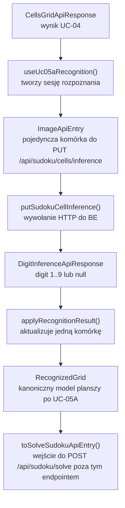
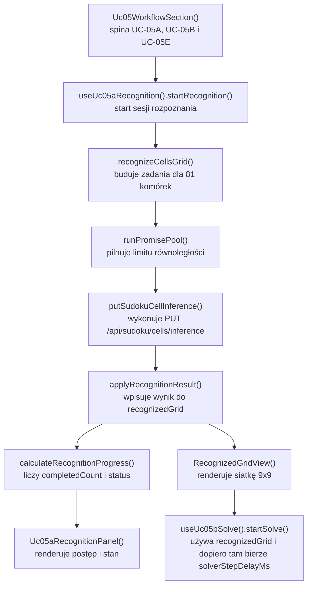

# UC-15-FE - Plan implementacyjny dla `PUT /api/sudoku/cells/inference`

## 1) Przeznaczenie endpointa
- Z perspektywy `FE` endpoint `PUT /api/sudoku/cells/inference` realizuje wyłącznie inferencję pojedynczej komórki Sudoku:
  - `jedna komórka obrazu -> jedna odpowiedź { digit }`.
- Endpoint należy do podkontekstu `solveCellInference` z `UC-05A`.
- Ten endpoint nie uruchamia live solve, nie steruje tempem backtrackingu i nie jest miejscem na parametr `solverStepDelayMs`.
- Dla `UC-15` ten endpoint pozostaje częścią istniejącego workflow `UC-05A` i ma zostać zachowany bez rozszerzania kontraktu.
- Właściwa zmiana funkcjonalna `UC-15` po stronie `FE` dotyczy startu live solve przez `POST /api/sudoku/solve`, ale w tym dokumencie opisujemy żądany przez Ciebie endpoint i guardraile, które mają zapobiec zmieszaniu odpowiedzialności między:
  - `solveCellInference`,
  - `solveLive`.

## 2) Uwaga o zakresie historyjki
- Zgodnie z opisem `UC-15` parametr `solverStepDelayMs` należy do `POST /api/sudoku/solve`.
- Po stronie `FE` ma istnieć tymczasowa, zahardcodowana domyślna wartość:
  - `solverStepDelayMs = 50 ms`.
- Ta wartość domyślna jest częścią logiki `solveLive`, a nie części `solveCellInference`.
- `PUT /api/sudoku/cells/inference` nie powinien zostać zmieniony biznesowo w ramach `UC-15`.
- Ten dokument ma więc charakter:
  - planu utrzymania zgodności kontraktu,
  - planu reuse istniejących warstw,
  - planu zabezpieczenia przed regresją przy rozbudowie `UC-15` w innych częściach `FE`.
- Jeśli w kolejnym kroku powstanie dokument `UC-15` dla `POST /api/sudoku/solve`, ten plik powinien być traktowany jako dokument zależności i guardraili dla ścieżki rozpoznawania komórek.

## 3) Zakres i główne założenia
- Plan dotyczy wyłącznie części `FE`.
- Nie sugerujemy się tym, co obecnie zostało zaimplementowane po stronie `BE` i `ML`, poza obowiązującymi kontraktami oraz wcześniej ustalonymi historyjkami.
- Frontend ma zachować architekturę warstwową i feature-based:
  - `src/features/*`,
  - `src/shared/*`,
  - `src/api/*`,
  - `src/types/*`.
- `UC-15` nie powinien:
  - dodawać `solverStepDelayMs` do `PUT /api/sudoku/cells/inference`,
  - zmieniać `recognizedGrid`,
  - przebudowywać `UC-05A`,
  - dokładać nowego klienta HTTP dla tego endpointu,
  - zmieniać workflow `frontend-cd.yml`.
- Ten endpoint ma pozostać gotowy pod późniejszą parametryzację z `UC-14`, ale bez mieszania parametrów `solveLive`.

## 4) Kontrakt `FE -> BE`

### 4.1 Endpoint
- Metoda i ścieżka: `PUT /api/sudoku/cells/inference`
- Request body:
  - aktualnie `ImageApiEntry`
- Response success:
  - `DigitInferenceApiResponse`
- Response error:
  - `ErrorApiResponse`

### 4.2 Model wejściowy

```json
{
  "mimeType": "image/png",
  "base64": "iVBORw0KGgoAAA..."
}
```

### 4.3 Model wyjściowy sukcesu

```json
{
  "digit": 7
}
```

albo

```json
{
  "digit": null
}
```

### 4.4 Błędy
- `400 Bad Request`
  - niepoprawny payload obrazu albo błędny kształt requestu.
- `409 Conflict`
  - brak aktywnego modelu inferencyjnego albo niespójny stan inferencji.
- `422 Unprocessable Entity`
  - komórka nie nadaje się do przetworzenia.
- `500 Internal Server Error`
  - błąd techniczny `BE`.
- `502 Bad Gateway`
  - `BE` dostał niepoprawną odpowiedź z `ML`.
- `503 Service Unavailable`
  - `BE` nie może skorzystać z `ML`.
- `504 Gateway Timeout`
  - timeout ścieżki `BE -> ML`.

### 4.5 Reguła dla `UC-15`
- `solverStepDelayMs` nie należy do tego kontraktu.
- Domyślna, zahardcodowana po stronie `FE` wartość `50 ms` także nie należy do tego requestu.
- `FE` ma ją wykorzystać dopiero przy budowie payloadu dla `POST /api/sudoku/solve`.
- `UC-15` nie może dopisać do requestu tego endpointu pola:
  - `solverStepDelayMs`.
- `UC-15` nie może dopisać do odpowiedzi tego endpointu pól opisujących live solve.

## 5) Model API wejściowy i wyjściowy w komunikacji z BE

### FE -> BE
- `ImageApiEntry`
  - `mimeType: string`
  - `base64: string`

### BE -> FE
- `DigitInferenceApiResponse`
  - `digit: number | null`
- `ErrorApiResponse`
  - `errorType: string`
  - `message: string`

### Lokalny model domenowy FE używany dalej
- `RecognizedCell`
  - `rowIndex: number`
  - `columnIndex: number`
  - `digit: number | null`
  - `source: "pending" | "recognized" | "error"`
  - `isEditable: boolean`
  - `isLocked: boolean`
- `RecognizedGrid`
  - `RecognizedCell[][]`

### Reguła kontraktowa dla `UC-15`
- Lokalny model `RecognizedGrid` pozostaje wejściem do `POST /api/sudoku/solve`.
- `UC-15` nie powinien zmieniać nazw:
  - `ImageApiEntry`,
  - `DigitInferenceApiResponse`,
  - `ErrorApiResponse`,
  - `RecognizedGrid`,
  - `RecognizedCell`.

## 6) Interpretacja warstw FE dla tego planu
- `Api`
  - komponenty widoku i publiczny entry point feature'a.
- `Application`
  - orkiestracja sesji rozpoznania 81 komórek i budowy `recognizedGrid`.
- `Domain`
  - czyste modele i transformacje gridu bez `fetch`, Reacta i transportu.
- `Infrastructure`
  - klient HTTP do `BE`, helpery transportowe i techniczne utility.

W `UC-15` dla tego endpointu celem nie jest rozbudowa warstw, tylko utrzymanie ich obecnych granic i brak przecieku logiki live solve do ścieżki inferencji komórek.

## 7) Zachowanie per warstwa

### Api
- Warstwa `Api` dalej uruchamia rozpoznanie komórek dokładnie tak jak w `UC-05A`.
- Nie dodaje elementów UI dla `solverStepDelayMs` do sekcji rozpoznania komórek.
- Jeśli w aplikacji istnieje lub powstaje panel parametrów z `UC-14`, to:
  - parametry inferencji komórki pozostają w subkontekście `solveCellInference`,
  - parametr `solverStepDelayMs` należy do subkontekstu `solveLive`,
  - sekcja `UC-05A` nie może wysyłać parametru live solve do `PUT /api/sudoku/cells/inference`.

### Application
- Warstwa `Application` dla `UC-05A` dalej:
  - tworzy pusty `recognizedGrid`,
  - uruchamia rozpoznanie 81 komórek,
  - obsługuje progres, anulowanie i błąd.
- Zahardcodowana domyślna wartość `50 ms` ma zostać utrzymana po stronie `FE`, ale w warstwie `Application` dla startu live solve, nie dla `UC-05A`.
- `UC-15` nie powinien dopisywać tu logiki:
  - opóźniania requestów inferencji,
  - throttlingu udającego live solve,
  - mapowania `solverStepDelayMs` do requestów inferencji komórki.
- Jedyna dopuszczalna zależność na `UC-15` w tej warstwie to zachowanie kompatybilności z tym, że wynik `RecognizedGrid` staje się wejściem do live solve uruchamianego gdzie indziej.

### Domain
- Warstwa `Domain` pozostaje właścicielem:
  - `RecognizedGrid`,
  - `RecognizedCell`,
  - funkcji aktualizujących wynik rozpoznania,
  - reguł 9x9.
- `UC-15` nie powinien dodawać do modelu domenowego komórki pól opisujących:
  - delay,
  - realtime,
  - kanał `SignalR`,
  - statusy sesji solve.
- Parametr `solverStepDelayMs` nie jest częścią domeny rozpoznania pojedynczej komórki.

### Infrastructure
- Warstwa `Infrastructure` dla tego endpointu dalej tylko:
  - wykonuje `PUT /api/sudoku/cells/inference`,
  - waliduje kształt odpowiedzi,
  - mapuje błędy HTTP.
- `UC-15` nie może dokładać do klienta `putSudokuCellInference()`:
  - dodatkowego pola `solverStepDelayMs`,
  - nowego URL-a,
  - zależności od `SignalR`,
  - zależności od klienta `POST /api/sudoku/solve`.

## 8) Co już istnieje i musi zostać reuse'owane
- W repo istnieje kompletna implementacja `UC-05A` po stronie `FE`.
- Istnieje klient:
  - `src/Frontend/src/api/sudokuCellsInference.ts`
- Istnieją typy API:
  - `src/Frontend/src/types/api.ts`
- Istnieje hook use case'u:
  - `src/Frontend/src/features/uc05a/application/useUc05aRecognition.ts`
- Istnieje orkiestrator batcha:
  - `src/Frontend/src/features/uc05a/application/recognizeCellsGrid.ts`
- Istnieją modele domenowe:
  - `RecognizedGrid`,
  - `RecognizedCell`,
  - helpery progresu i aktualizacji siatki.
- Istnieje wspólny helper JSON:
  - `src/Frontend/src/api/shared/fetchJson.ts`

Wniosek:
- nie tworzyć nowego feature'a dla tego endpointu,
- nie duplikować klienta HTTP,
- nie tworzyć drugiego modelu `recognizedGrid`,
- nie wydzielać osobnego param store tylko dla `UC-15` w ścieżce inferencji komórek.

## 9) Pliki per warstwa i odpowiedzialności

### 9.1 Api
- `[REUSE, BRAK ZMIAN]` `src/Frontend/src/features/uc05/api/Uc05WorkflowSection.tsx`
  - kompozycja workflow `UC-05A -> UC-05B -> UC-05E`;
  - nie powinien przekazywać `solverStepDelayMs` do części `UC-05A`.
- `[REUSE, BRAK ZMIAN]` `src/Frontend/src/features/uc05a/api/Uc05aRecognitionSection.tsx`
  - standalone wrapper dla rozpoznania komórek.
- `[REUSE, BRAK ZMIAN]` `src/Frontend/src/features/uc05a/api/Uc05aRecognitionPanel.tsx`
  - prezentacja stanu rozpoznania, akcji i progresu.
- `[REUSE, BRAK ZMIAN]` `src/Frontend/src/features/uc05a/api/RecognizedGridView.tsx`
  - widok siatki 9x9 po rozpoznaniu.
- `[REUSE, BRAK ZMIAN]` `src/Frontend/src/features/uc05a/api/RecognitionProgressPanel.tsx`
  - panel postępu rozpoznania.
- `[REUSE, BRAK ZMIAN]` `src/Frontend/src/features/uc05a/api/index.ts`
  - publiczny eksport części `UC-05A`.
- `[REUSE, BRAK ZMIAN]` `src/Frontend/src/App.tsx`
  - composition root; bez logiki parametru live solve dla tego endpointu.

### 9.2 Application
- `[REUSE, BRAK ZMIAN]` `src/Frontend/src/features/uc05a/application/useUc05aRecognition.ts`
  - główny hook sesji rozpoznania.
- `[REUSE, BRAK ZMIAN]` `src/Frontend/src/features/uc05a/application/recognizeCellsGrid.ts`
  - batch requestów 81 komórek.
- `[REUSE, BRAK ZMIAN]` `src/Frontend/src/features/uc05a/application/recognitionSessionReducer.ts`
  - reduktor stanu sesji rozpoznania.
- `[REUSE, BRAK ZMIAN]` `src/Frontend/src/features/uc05a/application/recognitionSessionTypes.ts`
  - typy sesji rozpoznania.

### 9.3 Domain
- `[REUSE, BRAK ZMIAN]` `src/Frontend/src/features/uc05a/domain/recognizedGrid.ts`
  - definicje `RecognizedGrid`, `RecognizedCell`, `RecognizedDigit`.
- `[REUSE, BRAK ZMIAN]` `src/Frontend/src/features/uc05a/domain/gridCoordinates.ts`
  - pozycje i indeksowanie komórek.
- `[REUSE, BRAK ZMIAN]` `src/Frontend/src/features/uc05a/domain/createEmptyRecognizedGrid.ts`
  - budowa pustego gridu 9x9.
- `[REUSE, BRAK ZMIAN]` `src/Frontend/src/features/uc05a/domain/applyRecognitionResult.ts`
  - czysta aktualizacja wyniku jednej komórki.
- `[REUSE, BRAK ZMIAN]` `src/Frontend/src/features/uc05a/domain/recognitionProgress.ts`
  - obliczanie progresu.

### 9.4 Infrastructure
- `[REUSE, BRAK ZMIAN]` `src/Frontend/src/types/api.ts`
  - kontrakty `ImageApiEntry`, `DigitInferenceApiResponse`, `ErrorApiResponse`.
- `[REUSE, BRAK ZMIAN]` `src/Frontend/src/api/shared/fetchJson.ts`
  - wspólny helper parsowania JSON API.
- `[REUSE, BRAK ZMIAN]` `src/Frontend/src/api/sudokuCellsInference.ts`
  - klient `PUT /api/sudoku/cells/inference`.
- `[REUSE, BRAK ZMIAN]` `src/Frontend/src/features/uc05a/infrastructure/runPromisePool.ts`
  - limiter równoległości.
- `[REUSE, BRAK ZMIAN]` `src/Frontend/src/shared/images/toImageDataUrl.ts`
  - pomocnicza konwersja obrazu do renderowania.

### 9.5 Pliki sąsiednie, których nie należy mieszać z tym endpointem
- `[REUSE, ZMIANY UC-15 DZIEJĄ SIĘ GDZIE INDZIEJ]` `src/Frontend/src/features/uc05b/domain/toSolveSudokuApiEntry.ts`
  - to tutaj trafia payload do `POST /api/sudoku/solve`, nie do `PUT /api/sudoku/cells/inference`.
- `[REUSE, ZMIANY UC-15 DZIEJĄ SIĘ GDZIE INDZIEJ]` `src/Frontend/src/api/sudokuSolve.ts`
  - klient live solve.
- `[REUSE, ZMIANY UC-15 DZIEJĄ SIĘ GDZIE INDZIEJ]` `src/Frontend/src/features/uc05b/application/useUc05bSolve.ts`
  - start i cancel sesji solve.
- `[REUSE, ZMIANY UC-15 DZIEJĄ SIĘ GDZIE INDZIEJ]` `src/Frontend/src/features/uc05e/application/useUc05eLiveSolve.ts`
  - monitoring live solve.

## 10) Docelowy przepływ w FE dla tego endpointu
1. `UC-04` dostarcza `CellsGridApiResponse`.
2. `UC-05A` uruchamia sesję rozpoznania.
3. `recognizeCellsGrid()` buduje 81 zadań.
4. `runPromisePool()` ogranicza równoległość wywołań.
5. `putSudokuCellInference()` wysyła `ImageApiEntry` do `PUT /api/sudoku/cells/inference`.
6. Odpowiedzi są mapowane do `RecognizedGrid`.
7. Po zakończeniu `UC-05A` gotowy `RecognizedGrid` staje się wejściem do `UC-05B`.
8. `UC-15` nie zmienia kroków `1-7`.
9. `UC-15` wykorzystuje wynik tego flow dopiero na etapie startu `POST /api/sudoku/solve`.

## 11) Skrócony przepływ po stronie BE wymagany przez FE
Ta sekcja jest tylko kontraktowym minimum potrzebnym frontendowi.

1. `FE` wysyła `ImageApiEntry` do `PUT /api/sudoku/cells/inference`.
2. `BE` waliduje payload.
3. `BE` rozwiązuje aktywny model inferencyjny.
4. `BE` woła `ML`.
5. `BE` zwraca:
   - `200 { digit }`,
   - albo `ErrorApiResponse`.
6. `UC-15` nie powinien zmieniać tego przepływu.
7. Parametr `solverStepDelayMs` nie powinien pojawić się w tej ścieżce `BE`.

## 12) Główne funkcje
- `Uc05WorkflowSection()`
- `Uc05aRecognitionSection()`
- `Uc05aRecognitionPanel()`
- `RecognizedGridView()`
- `RecognitionProgressPanel()`
- `useUc05aRecognition()`
- `startRecognition()`
- `cancelRecognition()`
- `retryRecognition()`
- `recognizeCellsGrid()`
- `putSudokuCellInference()`
- `createEmptyRecognizedGrid()`
- `applyRecognitionResult()`
- `calculateRecognitionProgress()`
- `runPromisePool()`

### Funkcje, które są ważne dla granicy `UC-15`, ale nie należą do tego endpointu
- `toSolveSudokuApiEntry()`
- `postStartSudokuSolve()`
- `startSolve()`

## 13) Wyjątki, fallbacki i zachowanie błędowe

### 13.1 Zachowanie już obowiązujące dla tego endpointu
- `400`
  - błąd kontraktowy lub zły obraz wejściowy,
  - sesja `UC-05A` kończy się `failed`.
- `409`
  - brak aktywnego modelu inferencyjnego albo niespójny stan inferencji,
  - sesja kończy się `failed`,
  - bez fallbacku do `digit = null`.
- `422`
  - komórka nie nadaje się do przetworzenia,
  - sesja kończy się `failed`,
  - można zachować częściowy grid diagnostycznie.
- `500`, `502`, `503`, `504`
  - błąd techniczny,
  - sesja kończy się `failed`,
  - możliwy retry bez ponownego wykonywania wcześniejszego preprocessingu, jeśli stan wejściowy jest nadal w pamięci.

### 13.2 Fallbacki
- Brak fallbacku do lokalnego modelu w przeglądarce.
- Brak fallbacku do bezpośredniego wywołania `ML`.
- Brak fallbacku do zgadywania pustej komórki po stronie `FE`.
- Jedyny poprawny biznesowo przypadek pustej komórki to:
  - `200 OK` z `digit = null`.

### 13.3 Guardrail dla `UC-15`
- Brak fallbacku polegającego na wysyłaniu `solverStepDelayMs` do tego endpointu.
- Brak fallbacku polegającego na sztucznym opóźnianiu `UC-05A`, żeby imitować live solve.
- Brak fallbacku polegającego na przepinaniu panelu parametrów `solveLive` do inferencji pojedynczej komórki.

## 14) Specyficzna logika i pseudokod

### 14.1 Orkiestracja rozpoznania pozostaje bez zmian

```text
startRecognition(cellsGrid):
  cancelPreviousSessionIfExists()
  recognizedGrid = createEmptyRecognizedGrid()
  tasks = build81Tasks(cellsGrid)

  runPromisePool(tasks, concurrency = 4)
    -> putSudokuCellInference(imageApiEntry)
    -> applyRecognitionResult()
    -> updateProgress()
```

### 14.2 Guardrail dla mapowania parametrów `UC-14` i `UC-15`

```text
buildSolveFeatureRequests(context):
  if context.subcontext == "solveCellInference":
    request = ImageApiEntry
    // w przyszlosci tylko parametry heurystyki pustej komorki
    // nigdy solverStepDelayMs
    return request

  if context.subcontext == "solveLive":
    request = SolveSudokuApiEntry
    request.solverStepDelayMs = selectedDelay
    return request
```

### 14.3 Pseudokod reguły anty-regresyjnej

```text
when implementing UC-15:
  do not modify putSudokuCellInference()
  do not extend ImageApiEntry with solverStepDelayMs
  do not read live-solve state inside useUc05aRecognition()
  keep recognizedGrid as the only output of UC-05A
```

## 15) Mermaid flowchart - flow modeli



## 16) Mermaid flowchart - logika aplikacji z funkcjami



## 17) Workflow GitHub i runtime
- `[BRAK ZMIAN]` `.github/workflows/frontend-cd.yml`
  - workflow buduje statyczny frontend,
  - przekazuje `VITE_API_BASE_URL`,
  - nie zarządza parametrami funkcjonalnymi `UC-15`.
- Dla tego endpointu nie dodajemy żadnej nowej zmiennej środowiskowej.
- Zahardcodowana domyślna wartość `50 ms` ma być wpisana bezpośrednio w kodzie `FE`, a nie w workflow i nie w env.
- Lokalnie:
  - `VITE_API_BASE_URL` może dalej wskazywać `"/api"` albo lokalny `BE`,
  - parametry funkcjonalne nie są brane z workflow.
- Produkcyjnie:
  - FE dalej zna wyłącznie publiczne `/api`,
  - workflow może zmieniać jedynie ustawienia środowiskowe i release packaging,
  - workflow nie może stać się źródłem prawdy dla `solverStepDelayMs`.
- Zgodnie z dokumentacją deployu:
  - workflow FE buduje `dist`,
  - nie dotyka `appsettings.production.json`,
  - lokalne wartości są przypinane po stronie aplikacji lub lokalnego środowiska, a nie przez produkcyjny workflow FE.

## 18) Logging i diagnostyka FE
- Cel:
  - łatwo diagnozować błędy rozpoznania komórek,
  - nie spamować konsoli.

### `console.info`
- start sesji rozpoznania,
- sukces całej sesji,
- anulowanie sesji.

### `console.warn`
- `409`,
- `422`,
- anulowanie przez zmianę wejścia.

### `console.error`
- `500`,
- `502`,
- `503`,
- `504`,
- niepoprawny kształt odpowiedzi JSON.

### Guardraile logowania
- nie logować `base64`,
- nie logować pełnych obrazów,
- nie logować sukcesu każdej z 81 komórek,
- nie dodawać logów `solverStepDelayMs` do ścieżki inferencji komórek,
- jeśli potrzeba diagnostyki, logować tylko:
  - `sessionId`,
  - status sesji,
  - `httpStatus`,
  - `errorType`.

## 19) Inne istotne reguły
- Nie mieszać parametrów `solveCellInference` z `solveLive`.
- Nie zmieniać nazw istniejących kontraktów i modeli.
- Nie dodawać do `ImageApiEntry` pól od live solve.
- Nie wykonywać `fetch` w komponentach warstwy `Api`.
- Nie przenosić logiki rozpoznania komórek do `App.tsx`.
- Nie tworzyć nowego global store tylko po to, by odseparować `UC-15`.
- Nie dublować klienta `putSudokuCellInference()`.
- Nie robić obejścia przez sztuczne opóźnianie `UC-05A`.

## 20) Kolejność implementacji kodu dla historyjki
Ponieważ ten endpoint nie powinien być zmieniany biznesowo przez `UC-15`, kolejność prac dla tej ścieżki jest defensywna:

1. Zweryfikować, że `src/Frontend/src/types/api.ts` nie dostaje pola `solverStepDelayMs` w modelach inferencji komórki.
2. Zweryfikować, że `src/Frontend/src/api/sudokuCellsInference.ts` nadal wysyła wyłącznie payload inferencji komórki.
3. Zweryfikować, że `useUc05aRecognition()` nie importuje stanu live solve ani parametrów `solverStepDelayMs`.
4. Zweryfikować, że `Uc05WorkflowSection.tsx` nie przekazuje parametru live solve do `UC-05A`.
5. Jeśli istnieje lub powstaje panel parametrów z `UC-14`, przypisać:
   - parametry heurystyki pustej komórki do `PUT /api/sudoku/cells/inference`,
   - `solverStepDelayMs` tylko do `POST /api/sudoku/solve`.
6. W części odpowiedzialnej za live solve dodać albo utrzymać zahardcodowaną wartość domyślną:
   - `const DEFAULT_SOLVER_STEP_DELAY_MS = 50`.
7. Uruchomić regresyjnie `UC-05A` i potwierdzić brak zmian zachowania.
8. Uruchomić `npm run check`.

## 21) Guardraile implementacyjne
- `PUT /api/sudoku/cells/inference` nie może zostać nośnikiem `solverStepDelayMs`.
- `useUc05aRecognition()` nie może zależeć od `useUc05bSolve()` ani `useUc05eLiveSolve()`.
- `recognizedGrid` pozostaje wyjściem `UC-05A`, a nie stanem live solve.
- `Infrastructure` nie może dostać warunkowego branchowania typu:
  - "jeśli live solve jest włączone, to zmień request inferencji komórki".
- Nie dodawać nowych envów do `frontend-cd.yml` dla tego endpointu.
- Nie dodawać ciężkiego logowania per komórka.
- Nie zmieniać istniejących nazw plików, klas i typów.

## 22) Zależności pomiędzy historyjkami

### Wejściowe
- `UC-04`
  - dostarcza `CellsGridApiResponse`.
- `UC-05A`
  - dostarcza cały flow inferencji komórek i `recognizedGrid`.
- `UC-05B`
  - konsumuje `recognizedGrid` i startuje solve.
- `UC-05E`
  - monitoruje live solve.
- `UC-14`
  - rozdziela parametry na:
    - `solveCellInference`,
    - `solveLive`.

### Wyjściowe
- `UC-15`
  - nie zmienia tego endpointu, ale korzysta z jego wyniku pośrednio przez `recognizedGrid`.

### Zależność architektoniczna
- `UC-15` nie może naruszyć ustalonej granicy:
  - `PUT /api/sudoku/cells/inference` dla rozpoznania komórek,
  - `POST /api/sudoku/solve` dla live solve i `solverStepDelayMs`.

## 23) Plan weryfikacji minimum
- `npm run check`
- scenariusz happy path:
  - `UC-05A` nadal wykonuje 81 requestów i buduje `recognizedGrid`.
- scenariusz `digit = null`:
  - pusta komórka dalej jest poprawnym sukcesem.
- scenariusz `409`:
  - brak aktywnego modelu inferencyjnego nadal kończy `UC-05A` błędem, bez nowych fallbacków.
- scenariusz `422`:
  - komórka nie nadaje się do przetworzenia, a częściowy grid pozostaje diagnostycznie.
- scenariusz regresyjny `UC-15`:
  - po wdrożeniu zmian dla live solve request `PUT /api/sudoku/cells/inference` nie zawiera `solverStepDelayMs`.

## 24) Podsumowanie decyzji architektonicznych
- Dla `UC-15` endpoint `PUT /api/sudoku/cells/inference` pozostaje bez zmian biznesowych.
- Jego rola to nadal wyłącznie inferencja pojedynczej komórki i budowa `recognizedGrid`.
- Parametr `solverStepDelayMs` należy do `POST /api/sudoku/solve`, nie do tego endpointu.
- Po stronie `FE` tymczasowa wartość domyślna dla `solverStepDelayMs` ma być zahardcodowana jako `50 ms`.
- Głównym zadaniem po stronie `FE` dla tej ścieżki jest utrzymanie warstwowej separacji i brak regresji kontraktowej.
- Jeśli pojawi się panel parametrów z `UC-14`, należy pilnować rozdziału:
  - heurystyka pustej komórki -> `PUT /api/sudoku/cells/inference`,
  - live solve delay -> `POST /api/sudoku/solve`.
