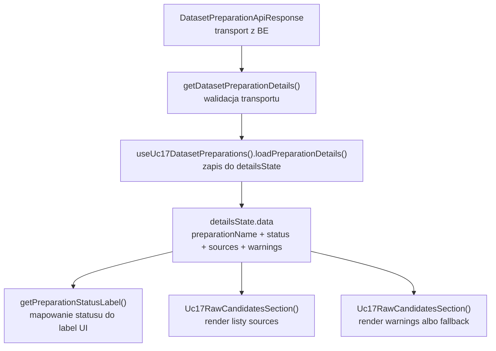
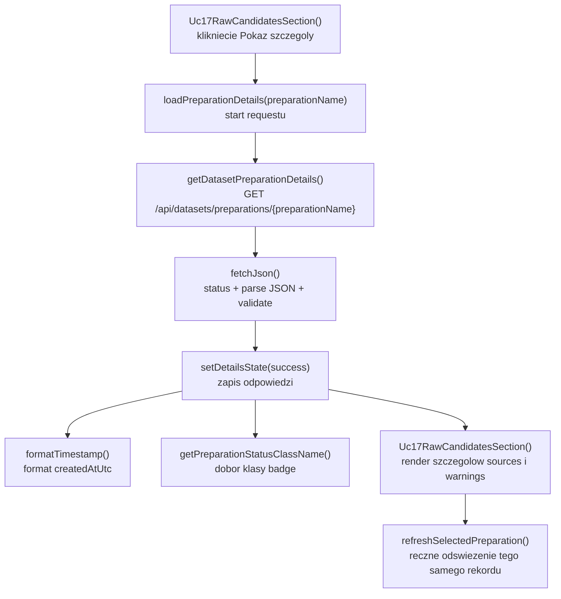

# UC-17-FE - Plan implementacyjny dla `GET /api/datasets/preparations/{preparationName}`

## 1) Przeznaczenie endpointa
- Endpoint `GET /api/datasets/preparations/{preparationName}` zwraca aktualny status i szczegóły konkretnego przygotowania datasetu.
- Z perspektywy `FE` ten endpoint:
  - zasila panel szczegółów w kroku `UC-17`,
  - pozwala operatorowi sprawdzić wynik przygotowania uruchomionego wcześniej z `POST /api/datasets/preparations`,
  - może być wywoływany ręcznie ponownie dla odświeżenia statusu,
  - nie tworzy nowego preparation,
  - nie zwraca artefaktów plikowych ani ścieżek runtime,
  - nie zastępuje listy z `GET /api/datasets/preparations`, tylko ją uzupełnia.
- Endpoint jest ważny w workflow `UC-11 -> UC-17 -> UC-18 -> UC-19`, bo daje operatorowi punkt kontroli, czy preparation jest gotowe do dalszego czyszczenia i budowy `.npz`.
- `Backend` pozostaje jedynym źródłem prawdy dla:
  - `status`,
  - `createdAtUtc`,
  - listy `sources`,
  - `preparedItemsCount`,
  - `warnings`.

## 2) Zakres planu
- Plan dotyczy wyłącznie części `FE`.
- Plan nie projektuje implementacji `BE` ani `ML`; opisuje tylko kontrakt i minimalny przepływ potrzebny frontendowi.
- Należy trzymać się istniejących nazw typów i pól w `src/Frontend/src/types/api.ts`.
- Nie należy sugerować się bieżącą implementacją `BE` i `ML` poza już ustalonym kontraktem publicznym.
- Jeśli rozwiązanie już istnieje w `src/Frontend`, należy je reuse'ować i ewentualnie utwardzić, a nie dublować.

## 3) Główne założenia architektoniczne
- Architektura FE globalnie jest jeszcze `TBD`, ale bieżący kod `UC-17` jest już ułożony praktycznie warstwowo i feature-based.
- Dla tego endpointa trzeba utrzymać rozdział MVVC:
  - `Model` - kontrakty API, stan szczegółów, reguły interpretacji odpowiedzi,
  - `View` - render panelu szczegółów, statusów, listy źródeł i ostrzeżeń,
  - `ViewController` - orkiestracja pobrania szczegółów, obsługa `AbortController`, błędów i odświeżenia,
  - `Infrastructure` - klient HTTP, walidacja JSON i mapowanie błędów transportowych.
- Nie wolno przenosić `fetch`, walidacji odpowiedzi i obsługi statusów HTTP do komponentów React.
- Nie tworzyć nowej usługi do pobrania szczegółów, jeśli istnieje już `getDatasetPreparationDetails()` w `src/Frontend/src/api/datasetPreparations.ts`.
- Nie tworzyć osobnego hooka tylko dla tego endpointa, jeśli obecny `useUc17DatasetPreparations()` już agreguje listę, create i details w sposób spójny dla use-case'u.
- Nie mieszać nowego flow `UC-17` z legacy workflow `UC-12`.

## 4) Interpretacja MVVC dla tego endpointa

### Model
- Obejmuje:
  - kontrakt transportowy `DatasetPreparationApiResponse`,
  - kontrakt `DatasetPreparationSourceApiResponse`,
  - lokalny stan `detailsState`,
  - regułę zachowania poprzednich szczegółów tylko dla tego samego `preparationName` podczas odświeżania,
  - regułę prezentacji `warnings` jako lekkiego sygnału diagnostycznego, nie jako błędu krytycznego.

### View
- Obejmuje:
  - panel "Szczegóły wybranego przygotowania",
  - przycisk `Odswiez szczegoly`,
  - stany `idle`, `loading`, `error`, `success`,
  - badge statusu,
  - listę źródeł z `preparedItemsCount`,
  - listę ostrzeżeń albo komunikat o ich braku.

### ViewController
- Obejmuje:
  - `loadPreparationDetails(preparationName)`,
  - `refreshSelectedPreparation()`,
  - ustawienie `selectedPreparationName`,
  - obsługę `AbortController`,
  - zachowanie poprzednich danych przy refreshu tego samego preparation,
  - reakcję na `401`,
  - lekkie logi diagnostyczne.

### Infrastructure
- Obejmuje:
  - `getDatasetPreparationDetails()`,
  - `fetchJson()`,
  - walidację odpowiedzi `200`,
  - mapowanie `ErrorApiResponse` do `DatasetPreparationsApiError`,
  - bezpieczne `encodeURIComponent(preparationName)`.

## 5) Model API w komunikacji z BE

### 5.1 Request `FE -> BE`
- Metoda i ścieżka: `GET /api/datasets/preparations/{preparationName}`
- Path param:
  - `preparationName: string`
- Body requestu: brak
- Query params: brak
- Nagłówki:
  - `Accept: application/json`
  - `Authorization: Bearer <token>` gdy aktywna jest sesja administratora z `UC-13`

### 5.2 Model wejściowy
- Brak payloadu JSON.
- Jedyną daną wejściową jest `preparationName` w ścieżce.

### 5.3 Model wyjściowy sukcesu
- `DatasetPreparationApiResponse`
  - `preparationName: string`
  - `createdAtUtc: string`
  - `status: string`
  - `sources: DatasetPreparationSourceApiResponse[]`
  - `warnings: string[]`
- `DatasetPreparationSourceApiResponse`
  - `name: string`
  - `type: string`
  - `preparedItemsCount: number`

Przykład:

```json
{
  "preparationName": "preparation-001",
  "createdAtUtc": "2026-06-18T07:42:00Z",
  "status": "running",
  "sources": [
    {
      "name": "v1_training",
      "type": "board",
      "preparedItemsCount": 128
    },
    {
      "name": "mnist_train",
      "type": "digit",
      "preparedItemsCount": 5000
    }
  ],
  "warnings": [
    "Pominieto czesc niepoprawnych rekordow raw."
  ]
}
```

### 5.4 Model błędu
- `ErrorApiResponse`
  - `errorType: string`
  - `message: string`

### 5.5 Reguły kontraktowe
- Nie zmieniać nazw:
  - `DatasetPreparationApiResponse`
  - `DatasetPreparationSourceApiResponse`
  - `ErrorApiResponse`
- `status` pozostaje transportowo typu `string`.
- `type` w `sources` pozostaje transportowo typu `string`; `FE` może znać `board` i `digit`, ale nie może się wywracać na innej wartości.
- `FE` nie wylicza `preparedItemsCount` lokalnie i nie rekonstruuje go z innych endpointów.

## 6) Co już istnieje i należy reuse'ować
- Implementacja tego endpointa już istnieje w FE.
- Istnieje generyczny helper transportowy:
  - `src/Frontend/src/api/shared/fetchJson.ts`
- Istnieje klient preparation API:
  - `src/Frontend/src/api/datasetPreparations.ts`
- Istnieją typy transportowe:
  - `src/Frontend/src/types/api.ts`
- Istnieje hook orkiestrujący cały use-case:
  - `src/Frontend/src/features/uc17/application/useUc17DatasetPreparations.ts`
- Istnieje osadzenie widoku details:
  - `src/Frontend/src/features/uc17/api/Uc17RawCandidatesSection.tsx`
- Istnieją style panelu:
  - `src/Frontend/src/styles/datasets.css`

Wniosek:
- nie tworzyć drugiego `getDatasetPreparationDetails()`,
- nie tworzyć osobnego `useUc17PreparationDetails()` bez realnej potrzeby,
- nie dublować klas błędów poza `DatasetPreparationsApiError`,
- najpierw utrzymać i dopracować obecny flow, dopiero później rozważać ekstrakcję komponentów prezentacyjnych.

## 7) Zachowanie per warstwa

### View
- Panel szczegółów jest nieaktywny, dopóki użytkownik nie wybierze rekordu z listy preparation.
- Po wyborze rekordu:
  - pokazuje stan ładowania,
  - po sukcesie pokazuje nagłówek z nazwą i datą,
  - pokazuje badge statusu,
  - renderuje listę źródeł wraz z `preparedItemsCount`,
  - renderuje listę ostrzeżeń lub komunikat "Brak ostrzezen".
- Przy ręcznym odświeżeniu szczegółów przycisk `Odswiez szczegoly` jest blokowany na czas requestu.
- View nie podejmuje decyzji o retry, auth ani interpretacji HTTP.

### ViewController
- `loadPreparationDetails(preparationName)`:
  - anuluje poprzedni request details,
  - ustawia `selectedPreparationName`,
  - przełącza `detailsState` na `loading`,
  - zachowuje poprzednie dane tylko wtedy, gdy należą do tego samego `preparationName`,
  - wywołuje klient HTTP,
  - mapuje wynik na `detailsState.success`,
  - w przypadku błędu mapuje wynik na `detailsState.error`.
- `refreshSelectedPreparation()`:
  - nic nie robi, jeśli żaden rekord nie jest wybrany,
  - ponownie pobiera szczegóły dla bieżącego `selectedPreparationName`.
- Reakcja na `401` jest wspólna dla całego hooka i uruchamia `onUnauthorized`.

### Model
- `detailsState` przechowuje:
  - `kind`,
  - `data`,
  - `error`,
  - `errorType`,
  - `httpStatus`.
- `selectedPreparationName` jest źródłem prawdy dla aktywnego rekordu w panelu details.
- `warnings` są danymi biznesowo pomocniczymi:
  - nie blokują renderu sukcesu,
  - nie powinny być mapowane na `error`.

### Infrastructure
- `getDatasetPreparationDetails()` odpowiada za:
  - zbudowanie URL z path param,
  - dołączenie auth header tylko gdy token istnieje,
  - walidację kształtu odpowiedzi,
  - stworzenie `DatasetPreparationsApiError` dla błędów HTTP.
- `fetchJson()` pozostaje wspólnym, generycznym mechanizmem i nie wymaga nowego równoległego wrappera.

## 8) Pliki per warstwa i odpowiedzialności

### 8.1 View
- `[REUSE]` `src/Frontend/src/app/views/DatasetsView.tsx`
  - osadza feature `UC-17` w module datasetowym;
  - przekazuje `apiBaseUrl`, `accessToken`, `onUnauthorized`.
- `[REUSE]` `src/Frontend/src/features/uc17/api/index.ts`
  - publiczny entry point feature'a `UC-17`.
- `[REUSE]` `src/Frontend/src/features/uc17/api/Uc17RawCandidatesSection.tsx`
  - renderuje sekcję z listą preparation i panel details;
  - obsługuje kliknięcie `Pokaz szczegoly` i `Odswiez szczegoly`;
  - zawiera pomocnicze funkcje prezentacyjne `formatTimestamp()`, `getPreparationStatusLabel()`, `getPreparationStatusClassName()`.
- `[REUSE]` `src/Frontend/src/styles/datasets.css`
  - style dla panelu details, badge'y statusu, list źródeł i komunikatów.

### 8.2 ViewController
- `[REUSE]` `src/Frontend/src/features/uc17/application/useUc17DatasetPreparations.ts`
  - jedno miejsce orkiestracji dla:
    - `POST /api/datasets/preparations`,
    - `GET /api/datasets/preparations`,
    - `GET /api/datasets/preparations/{preparationName}`;
  - dla tego endpointa odpowiada za `loadPreparationDetails()` i `refreshSelectedPreparation()`;
  - zarządza `detailsState`, `selectedPreparationName`, abortami i błędami sesji.

### 8.3 Model
- `[REUSE]` `src/Frontend/src/types/api.ts`
  - źródło prawdy dla:
    - `DatasetPreparationApiResponse`,
    - `DatasetPreparationSourceApiResponse`,
    - `ErrorApiResponse`.
- `[REUSE]` `src/Frontend/src/features/uc17/application/useUc17DatasetPreparations.ts`
  - lokalny model stanu `LoadableState<T>`;
  - lokalny model aktywnego wyboru `selectedPreparationName`.

### 8.4 Infrastructure
- `[REUSE]` `src/Frontend/src/api/datasetPreparations.ts`
  - klient `getDatasetPreparationDetails()`;
  - guardy walidujące `DatasetPreparationApiResponse`.
- `[REUSE]` `src/Frontend/src/api/shared/fetchJson.ts`
  - generyczny mechanizm `fetch + parse + validate + errorFactory`.

### 8.5 Pliki sąsiednie, które trzeba traktować jako kontekst
- `[CONTEXT ONLY]` `src/Frontend/src/features/uc17/application/useUc17RawCandidates.ts`
  - dostarcza etap wyboru źródeł;
  - nie odpowiada za pobieranie szczegółów preparation.
- `[CONTEXT ONLY]` `src/Frontend/src/api/datasetsRawCandidates.ts`
  - klient poprzedniego kroku `UC-17`;
  - nie należy mieszać go ze szczegółami preparation.
- `[LEGACY / NIE ROZWIJAĆ]` `src/Frontend/src/components/Uc12DatasetPreparationSection.tsx`
  - dotyczy starego workflow `UC-12`;
  - nie może być bazą dla nowego panelu details `UC-17`.

## 9) Główne funkcje
- `getDatasetPreparationDetails()`
- `fetchJson()`
- `loadPreparationDetails()`
- `refreshSelectedPreparation()`
- `handleUnauthorizedError()`
- `logPreparationsError()`
- `formatTimestamp()`
- `getPreparationStatusLabel()`
- `getPreparationStatusClassName()`
- `Uc17RawCandidatesSection()`

## 10) Specyficzna logika i pseudokod

### 10.1 Pobranie szczegółów preparation

```text
loadPreparationDetails(preparationName):
  abort previous details request
  controller = new AbortController()
  selectedPreparationName = preparationName

  set detailsState = loading
  keep previous data only if previous.data.preparationName == preparationName

  response = getDatasetPreparationDetails(apiBaseUrl, preparationName, accessToken, controller.signal)

  if request was aborted:
    return

  set detailsState = success(response)
```

### 10.2 Obsługa błędu bez utraty poprawnych danych tego samego rekordu

```text
catch error:
  if request was aborted:
    return

  if error.status == 401:
    onUnauthorized()

  set detailsState = error
  keep previous.data only if it belongs to the same preparationName
```

### 10.3 Guardrail dla path param

```text
getDatasetPreparationDetails():
  encodedPreparationName = encodeURIComponent(preparationName)
  url = `${apiBaseUrl}/datasets/preparations/${encodedPreparationName}`
```

### 10.4 Guardrail dla ostrzeżeń

```text
if response.warnings.length > 0:
  render success state
  show warnings list
else:
  render "Brak ostrzezen"
```

### 10.5 Guardrail dla nieznanego statusu

```text
status label mapping:
  queued -> "W kolejce"
  running -> "W trakcie"
  completed -> "Gotowe"
  failed -> "Niepowodzenie"
  other -> render raw status string
```

## 11) Wyjątki, fallbacki i zachowanie błędowe

### 11.1 Statusy HTTP
- `200 OK`
  - poprawne szczegóły preparation.
- `401 Unauthorized`
  - sesja administratora wygasła albo token jest niepoprawny;
  - `FE` ma wywołać `onUnauthorized`.
- `403 Forbidden`
  - użytkownik nie ma dostępu do zasobu administracyjnego;
  - `FE` pokazuje błąd bez automatycznego retry.
- `404 Not Found`
  - wskazane `preparationName` nie istnieje;
  - `FE` pokazuje błąd, nie zgaduje nowego aktywnego rekordu.
- `409 Conflict`
  - raczej nietypowe dla `GET`, ale jeśli wystąpi kontraktowo, traktować jako błąd backendu.
- `500 Internal Server Error`
  - błąd backendu.
- `502`, `503`, `504`
  - błąd ścieżki infrastrukturalnej.

### 11.2 Błędy kontraktu
- Jeśli odpowiedź `200` nie spełnia kontraktu `DatasetPreparationApiResponse`:
  - traktować to jako błąd techniczny,
  - nie mapować do pustego obiektu,
  - nie czyścić poprzednich poprawnych danych tego samego rekordu bez potrzeby,
  - nie próbować rekonstruować brakujących pól po stronie `FE`.

### 11.3 Fallbacki
- Dopuszczalne fallbacki:
  - zachowanie poprzednich szczegółów podczas odświeżenia tego samego rekordu,
  - zachowanie poprzednich szczegółów przy błędzie refreshu tego samego rekordu.
- Niedopuszczalne fallbacki:
  - zgadywanie `sources` na podstawie listy preparation,
  - rekonstruowanie `warnings` po stronie `FE`,
  - podstawienie pustych szczegółów jako sukcesu,
  - bezpośrednie połączenie `FE -> ML`.

### 11.4 Zachowanie UI
- `idle`
  - brak wybranego rekordu; panel pokazuje instrukcję wyboru.
- `loading`
  - pokazuje banner ładowania;
  - przy refreshu może zachować ostatnie dane tego samego rekordu.
- `error`
  - pokazuje banner błędu;
  - nie powinien wymuszać utraty poprawnego poprzedniego `data`, jeśli nadal pasuje do tego samego `preparationName`.
- `success`
  - pokazuje status, datę, źródła i ostrzeżenia.

## 12) Logging i diagnostyka FE
- Logowanie ma pomagać diagnozować problemy, ale nie może spamować.

### `console.info`
- ręczne odświeżenie listy preparation już istnieje;
- dla szczegółów warto logować tylko:
  - rozpoczęcie ręcznego odświeżenia wybranego rekordu,
  - opcjonalnie sukces pobrania z liczbą źródeł.

### `console.warn`
- `401` i czyszczenie sesji,
- ewentualnie próba odświeżenia bez wybranego rekordu nie wymaga logu,
- `404` można logować jako lekkie ostrzeżenie, jeśli ułatwia diagnozę niespójności UI vs backend.

### `console.error`
- `5xx`,
- błąd walidacji JSON,
- techniczny brak możliwości pobrania szczegółów.

### Guardraile logowania
- nie logować tokena,
- nie logować pełnego payloadu odpowiedzi,
- nie logować całej tablicy `sources`,
- logować tylko lekkie metadane:
  - `httpStatus`,
  - `errorType`,
  - `preparationName`,
  - `sourcesCount`,
  - `warningsCount`.

## 13) Flow modeli - mermaid



## 14) Logika aplikacji - mermaid



## 15) Opis przepływu w obrębie BE potrzebny frontendowi
Ta sekcja opisuje wyłącznie kontraktowe minimum potrzebne frontendowi.

1. `FE` wywołuje `GET /api/datasets/preparations/{preparationName}` z tokenem administratora.
2. `BE` weryfikuje autoryzację.
3. `BE` odczytuje rekord konkretnego preparation ze swojego źródła prawdy.
4. `BE` zwraca:
   - `preparationName`,
   - `createdAtUtc`,
   - `status`,
   - `sources`,
   - `warnings`.
5. `BE` nie zwraca fizycznych ścieżek katalogów, nazw plików ani detali implementacyjnych ML.
6. `FE` używa odpowiedzi tylko do prezentacji statusu i gotowości do dalszych kroków workflow.

## 16) Workflow GitHub i runtime
- Dla tego endpointa nie jest potrzebna nowa zmienna środowiskowa ani osobna zmiana w `.github/workflows/frontend-cd.yml`.
- Aktualny workflow FE:
  - buduje `src/Frontend`,
  - podstawia `VITE_API_BASE_URL`,
  - pakuje `dist`,
  - wysyła archiwum do release,
  - promuje build statyczny na serwerze.
- Lokalnie:
  - `FE` może działać na sztywnym `/api` albo na lokalnym `VITE_API_BASE_URL`,
  - nie dotykamy `appsettings` z poziomu FE.
- Produkcyjnie:
  - workflow może podstawiać publiczny adres API,
  - zmiany `appsettings` produkcyjnych dotyczą `BE`, nie tego endpointa FE.
- Guardrail:
  - nie kodować środowiskowych URL-i na sztywno w komponencie,
  - nie przenosić żadnej logiki statusów preparation do workflow,
  - pamiętać, że workflow produkcyjny może modyfikować konfigurację backendu, ale lokalnie `FE` powinien mieć prosty, stały punkt wejścia do `/api`.

## 17) Kolejność implementacji kodu dla historyjki
1. Zweryfikować kontrakty w `src/Frontend/src/types/api.ts`.
2. Zweryfikować, że `src/Frontend/src/api/datasetPreparations.ts` pozostaje jedynym klientem `GET /api/datasets/preparations/{preparationName}`.
3. Zweryfikować, że `useUc17DatasetPreparations()` pozostaje jedynym miejscem orkiestracji details endpointu.
4. Potwierdzić, że `Uc17RawCandidatesSection.tsx` poprawnie renderuje stany:
   - brak wyboru,
   - `loading`,
   - `error`,
   - `success`.
5. Potwierdzić zachowanie odświeżenia szczegółów bez utraty poprzednich danych tego samego rekordu.
6. Uzupełnić lekkie logi tylko tam, gdzie realnie pomagają diagnostycznie.
7. Rozważyć ekstrakcję małego komponentu prezentacyjnego dla panelu details tylko wtedy, gdy sekcja `Uc17RawCandidatesSection.tsx` zacznie rosnąć zbyt mocno.
8. Uruchomić kontrolę jakości FE.

## 18) Guardraile implementacyjne
- Nie tworzyć nowego klienta HTTP dla tego endpointa.
- Nie dublować `buildAuthHeaders()` ani klas błędów, jeśli obecny moduł `datasetPreparations.ts` wystarcza.
- Nie przenosić `loadPreparationDetails()` do komponentu View.
- Nie czyścić szczegółów na starcie każdego odświeżenia tego samego rekordu.
- Nie zamieniać błędnej odpowiedzi na pusty sukces.
- Nie zgadywać statusu ani źródeł na podstawie listy preparation.
- Nie robić auto-pollingu bez jawnego wymagania historyjki.
- Nie trzymać szczegółów preparation w `localStorage`, jeśli nie ma takiego wymagania.
- Nie mieszać tego endpointa z logiką `UC-18` ani `UC-19`.

## 19) Zależności pomiędzy historyjkami

### Wejściowe
- `UC-13`
  - dostarcza sesję administracyjną i token.
- `UC-11`
  - dostarcza wcześniejszy kontekst workflow datasetowego.
- `UC-17 GET /api/datasets/preparations`
  - dostarcza listę rekordów, z których wybierane jest `preparationName`.
- `UC-17 POST /api/datasets/preparations`
  - tworzy rekordy, których szczegóły są później odczytywane tym endpointem.

### Sąsiednie
- `UC-17 GET /api/datasets/raw-candidates`
  - buduje wybór źródeł do utworzenia preparation;
  - nie bierze udziału w pobraniu szczegółów, ale jest częścią tego samego use-case'u.

### Wyjściowe
- `UC-18`
  - będzie pracował na preparation, którego status i skład operator sprawdza właśnie tutaj.
- `UC-19`
  - pośrednio zależy od istnienia poprawnych przygotowań datasetu.

## 20) Inne istotne reguły
- Trzymać się nazw klas, funkcji i pól już obecnych w kodzie.
- Dane transportowe pozostają w `camelCase`.
- `createdAtUtc` formatować tylko w View.
- `warnings` nie są błędem biznesowym samym w sobie.
- Jeśli kiedyś pojawi się potrzeba współdzielenia mapowania statusów, najpierw sprawdzić, czy ta sama logika jest naprawdę używana w więcej niż jednym miejscu.
- Jeśli ma powstać nowa usługa lub helper, najpierw sprawdzić, czy istniejące:
  - `fetchJson()`,
  - `datasetPreparations.ts`,
  - `useUc17DatasetPreparations()`
  nie rozwiązują problemu wystarczająco generycznie.

## 21) Co dodać, a czego nie dodawać

### Dodać / dopracować
- ewentualny lekki log sukcesu pobrania szczegółów z liczbą źródeł,
- ewentualne drobne uporządkowanie panelu details w osobny komponent prezentacyjny tylko jeśli wzrośnie złożoność JSX,
- ewentualne testy po pojawieniu się sensownego runnera testowego dla FE.

### Nie dodawać
- nowego store'a globalnego,
- nowej biblioteki do pobierania danych,
- nowych envów dla tego endpointa,
- własnego parsera dat poza lekkim formatowaniem w View,
- fallbacków zgadujących dane po stronie FE.

## 22) Plan weryfikacji minimum
- `npm run check`
- `npm run build`
- scenariusz happy path:
  - użytkownik wybiera rekord z listy,
  - szczegóły ładują się poprawnie,
  - źródła i `preparedItemsCount` są widoczne,
  - ostrzeżenia renderują się poprawnie.
- scenariusz bez ostrzeżeń:
  - widoczny jest komunikat `Brak ostrzezen`.
- scenariusz `401`:
  - `onUnauthorized` zostaje wywołane.
- scenariusz `404`:
  - użytkownik widzi błąd, a UI nie wywraca się.
- scenariusz odświeżenia szczegółów:
  - poprzednie dane tego samego preparation nie migają bez potrzeby,
  - przycisk odświeżenia jest blokowany tylko na czas requestu.
- scenariusz błędnego JSON:
  - odpowiedź jest traktowana jako błąd techniczny,
  - nie jest renderowany sztuczny pusty sukces.

## 23) Podsumowanie decyzji
- Dla `GET /api/datasets/preparations/{preparationName}` kluczowy jest reuse istniejącego FE, nie budowa nowej architektury.
- W projekcie są już gotowe fundamenty:
  - klient API,
  - wspólny helper transportowy,
  - hook orkiestracyjny,
  - panel renderujący szczegóły.
- Najważniejsze granice odpowiedzialności:
  - `Infrastructure` pobiera i waliduje dane,
  - `ViewController` steruje cyklem życia requestu i stanem,
  - `View` tylko renderuje status, źródła i ostrzeżenia,
  - `Backend` pozostaje źródłem prawdy dla szczegółów preparation.
- Najważniejsze guardraile:
  - brak duplikacji klienta i hooka,
  - brak zgadywania danych,
  - brak mieszania z `UC-12`,
  - brak ciężkiego logowania,
  - brak zmian workflow, jeśli obecne `VITE_API_BASE_URL` wystarcza.
