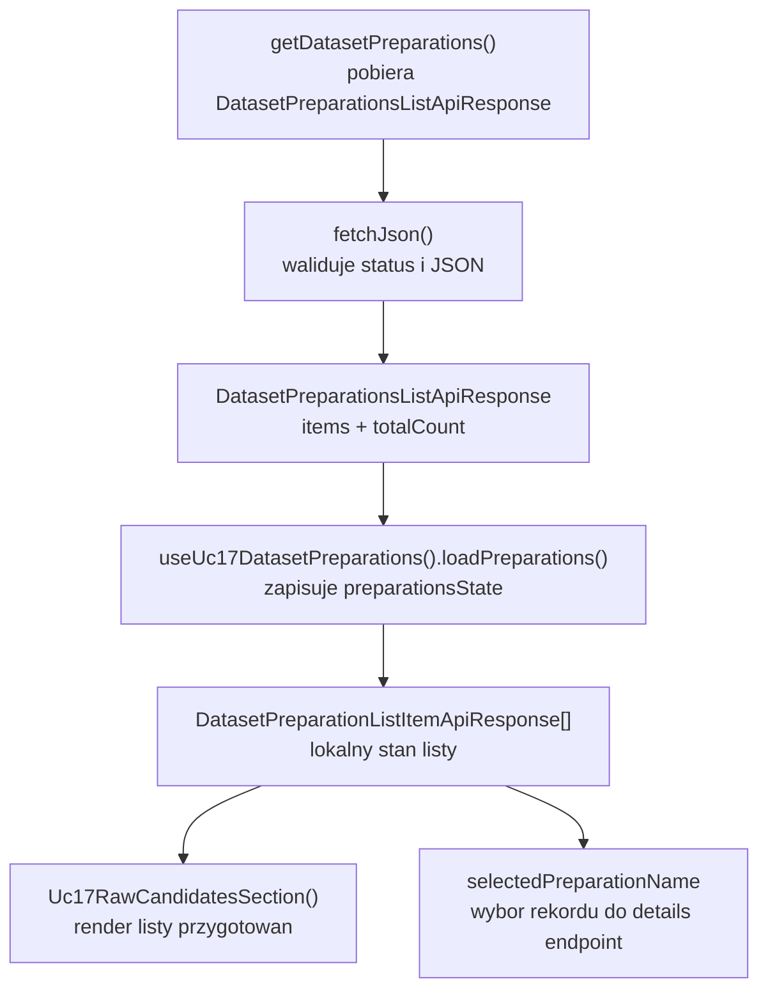
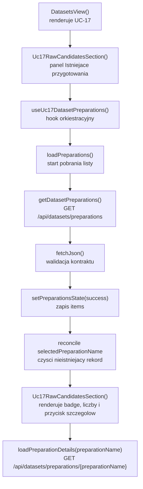

# UC-17-FE - Plan implementacyjny dla `GET /api/datasets/preparations`

## 1) Przeznaczenie endpointa
- Endpoint `GET /api/datasets/preparations` zwraca listę istniejących przygotowań datasetu utworzonych w `UC-17`.
- Z perspektywy `FE` ten endpoint:
  - zasila listę rekordów widoczną w kroku `UC-17`,
  - pozwala użytkownikowi wybrać rekord do obejrzenia szczegółów,
  - nie tworzy nowego preparation,
  - nie uruchamia preprocessingu,
  - nie zwraca detali pojedynczego preparation,
  - nie zwraca fizycznych ścieżek runtime.
- Wynik endpointa ma być źródłem danych do:
  - podglądu historii przygotowań,
  - wyboru aktywnego rekordu do `GET /api/datasets/preparations/{preparationName}`,
  - szybkiej oceny stanu workflow `raw -> preparation`.
- `Backend` pozostaje jedynym źródłem prawdy dla:
  - listy przygotowań,
  - statusu każdego preparation,
  - liczby źródeł `board` i `digit`,
  - daty utworzenia rekordu.

## 2) Zakres planu
- Plan dotyczy wyłącznie `FE`.
- Plan nie projektuje implementacji `BE` ani `ML`; używa tylko ich ustalonego kontraktu publicznego.
- Plan musi być zgodny z już istniejącymi kontraktami i nazwami typów w `src/Frontend/src/types/api.ts`.
- Jeśli coś już istnieje w `src/Frontend`, należy to reuse'ować i ewentualnie doprecyzować, a nie budować równoległe rozwiązanie.
- Plan obejmuje również minimalny kontekst integracyjny z:
  - `POST /api/datasets/preparations`,
  - `GET /api/datasets/preparations/{preparationName}`,
  bo bez tego nie da się poprawnie opisać miejsca endpointa w flow `UC-17`.

## 3) Główne założenia architektoniczne
- Globalna reguła FE jest nadal `TBD`, ale aktualny kod dla `UC-17` jest już praktycznie ułożony warstwowo i feature-based.
- Dla tego endpointa należy utrzymać podział:
  - `View`: render listy, przycisk odświeżenia, banner błędu, aktywny rekord,
  - `ViewController`: pobranie listy, abort poprzedniego requestu, reakcja na `401`, zachowanie poprzednich danych przy błędzie,
  - `Model`: kontrakty API i lokalny stan listy przygotowań,
  - `Infrastructure`: klient HTTP, walidacja JSON, mapowanie błędów HTTP.
- Nie przenosić `fetch`, walidacji JSON ani obsługi statusów HTTP do komponentów React.
- Nie tworzyć nowego klienta dla tego samego endpointa, jeżeli istnieje już `src/Frontend/src/api/datasetPreparations.ts`.
- Nie tworzyć osobnego global store tylko dla listy przygotowań, dopóki dane są używane lokalnie w kroku `UC-17`.
- Nie mieszać listy przygotowań z legacy workflow `UC-12`.

## 4) Warstwowa interpretacja MVVC

### Model
- Obejmuje:
  - kontrakt transportowy `DatasetPreparationsListApiResponse`,
  - rekord listy `DatasetPreparationListItemApiResponse`,
  - lokalny stan `LoadableState<DatasetPreparationListItemApiResponse[]>`,
  - regułę utrzymania wybranego `preparationName` tylko wtedy, gdy rekord nadal istnieje na liście.

### View
- Obejmuje:
  - panel "Istniejące przygotowania",
  - listę rekordów,
  - badge statusu,
  - przycisk `Odswiez przygotowania`,
  - stany `idle/loading/error/success/empty`,
  - akcję wyboru rekordu do dalszego pobrania szczegółów.

### ViewController
- Obejmuje:
  - funkcję `loadPreparations()`,
  - obsługę `AbortController`,
  - zachowanie poprzednich danych w trakcie odświeżenia,
  - reset wyboru, gdy rekord znika z backendu,
  - reakcję na `401` przez `onUnauthorized`,
  - lekkie logowanie diagnostyczne.

### Infrastructure
- Obejmuje:
  - `getDatasetPreparations()`,
  - generyczne `fetchJson()`,
  - walidację statusu `200`,
  - walidację kształtu JSON,
  - mapowanie `ErrorApiResponse` do `DatasetPreparationsApiError`.

## 5) Co już istnieje i należy reuse'ować
- Implementacja `UC-17` na FE już zawiera obsługę tego endpointa.
- Istnieje generyczny helper transportowy:
  - `src/Frontend/src/api/shared/fetchJson.ts`
- Istnieje klient endpointów preparation:
  - `src/Frontend/src/api/datasetPreparations.ts`
- Istnieją typy transportowe:
  - `src/Frontend/src/types/api.ts`
- Istnieje hook orkiestrujący cały preparation flow:
  - `src/Frontend/src/features/uc17/application/useUc17DatasetPreparations.ts`
- Istnieje ekran osadzający listę:
  - `src/Frontend/src/features/uc17/api/Uc17RawCandidatesSection.tsx`
- Istnieje osadzenie sekcji w module datasetowym:
  - `src/Frontend/src/app/views/DatasetsView.tsx`
- Istnieją style dla listy i statusów:
  - `src/Frontend/src/styles/datasets.css`

Wniosek:
- nie tworzyć drugiego `getDatasetPreparations()`,
- nie tworzyć drugiego hooka tylko do odczytu tej samej listy,
- nie przenosić obsługi tego endpointa do `DatasetsView.tsx`,
- nie budować osobnego "service layer" ponad `fetchJson()`, jeśli nie dodaje realnej wartości.

## 6) Model API w komunikacji z BE

### 6.1 Request `FE -> BE`
- Metoda i ścieżka: `GET /api/datasets/preparations`
- Body requestu: brak
- Query params: brak
- Nagłówki:
  - `Accept: application/json`
  - `Authorization: Bearer <token>` gdy aktywna jest sesja administratora

### 6.2 Model wejściowy
- Brak payloadu JSON.

### 6.3 Model wyjściowy sukcesu
- `DatasetPreparationsListApiResponse`
  - `items: DatasetPreparationListItemApiResponse[]`
  - `totalCount: number`
- `DatasetPreparationListItemApiResponse`
  - `preparationName: string`
  - `createdAtUtc: string`
  - `status: string`
  - `boardSourcesCount: number`
  - `digitSourcesCount: number`

Przykład:

```json
{
  "items": [
    {
      "preparationName": "preparation-001",
      "createdAtUtc": "2026-06-17T20:15:00Z",
      "status": "completed",
      "boardSourcesCount": 1,
      "digitSourcesCount": 1
    },
    {
      "preparationName": "preparation-002",
      "createdAtUtc": "2026-06-18T07:42:00Z",
      "status": "running",
      "boardSourcesCount": 2,
      "digitSourcesCount": 0
    }
  ],
  "totalCount": 2
}
```

### 6.4 Model błędu
- `ErrorApiResponse`
  - `errorType: string`
  - `message: string`

### 6.5 Reguły kontraktowe
- Nie zmieniać nazw:
  - `DatasetPreparationsListApiResponse`
  - `DatasetPreparationListItemApiResponse`
  - `ErrorApiResponse`
- `status` pozostaje po stronie transportowej typu `string`.
- `FE` może mapować znane statusy do labeli UI, ale nie może założyć, że backend nigdy nie zwróci innej wartości.
- `FE` nie powinien sam wyliczać `boardSourcesCount` ani `digitSourcesCount` z innych endpointów.

## 7) Zachowanie per warstwa

### View
- Po wejściu w sekcję `UC-17` renderuje panel listy przygotowań.
- Pokazuje przycisk ręcznego odświeżenia.
- Renderuje:
  - listę rekordów,
  - znacznik aktywnego rekordu,
  - badge statusu,
  - liczniki źródeł `board` i `digit`,
  - pusty stan, jeśli `items.length === 0`.
- Umożliwia użytkownikowi wybranie rekordu do pobrania szczegółów przez `GET /api/datasets/preparations/{preparationName}`.

### ViewController
- Startuje odczyt listy przy montowaniu sekcji.
- Anuluje poprzednie żądanie listy przy kolejnym odświeżeniu.
- Zachowuje poprzednią listę podczas stanu `loading`, żeby UI nie "migał".
- Po sukcesie:
  - zapisuje nowe `items`,
  - czyści błąd,
  - ustawia `httpStatus = 200`.
- Jeśli wcześniej wybrany `preparationName` zniknął z nowej listy:
  - czyści `selectedPreparationName`,
  - czyści stan szczegółów,
  - nie trzyma martwego wyboru.

### Model
- Przechowuje stan listy jako loadable state.
- Przechowuje `selectedPreparationName` niezależnie od samej listy.
- Nie miesza stanu listy przygotowań ze stanem tworzenia nowego preparation.
- Nie miesza stanu listy z detalem pojedynczego rekordu.

### Infrastructure
- Wysyła wyłącznie `GET`.
- Waliduje, że odpowiedź `200` ma kształt:
  - obiekt,
  - `items` jest tablicą,
  - `totalCount` jest liczbą,
  - każdy element ma wymagane pola list item.
- Błędny JSON mapuje na błąd techniczny.
- `Authorization` dołącza tylko wtedy, gdy token istnieje.

## 8) Pliki per warstwa i odpowiedzialności

### 8.1 View
- `[REUSE]` `src/Frontend/src/app/views/DatasetsView.tsx`
  - osadza sekcję `UC-17` w głównym workflow datasetowym;
  - przekazuje `apiBaseUrl`, `accessToken`, `onUnauthorized`.
- `[REUSE]` `src/Frontend/src/features/uc17/api/index.ts`
  - publiczny entry point feature'a `UC-17`.
- `[REUSE]` `src/Frontend/src/features/uc17/api/Uc17RawCandidatesSection.tsx`
  - renderuje panel listy przygotowań;
  - obsługuje przycisk odświeżenia;
  - renderuje stany listy i wybór rekordu do pobrania szczegółów.
- `[REUSE]` `src/Frontend/src/styles/datasets.css`
  - style listy przygotowań, badge'y statusu, aktywnego rekordu i paneli.

### 8.2 ViewController
- `[REUSE]` `src/Frontend/src/features/uc17/application/useUc17DatasetPreparations.ts`
  - jedno miejsce orkiestracji dla:
    - `GET /api/datasets/preparations`,
    - `GET /api/datasets/preparations/{preparationName}`,
    - `POST /api/datasets/preparations`;
  - dla tego endpointa odpowiada konkretnie za `loadPreparations()`, obsługę `AbortController`, reset wyboru i błędy.

### 8.3 Model
- `[REUSE]` `src/Frontend/src/types/api.ts`
  - źródło prawdy dla modeli:
    - `DatasetPreparationsListApiResponse`,
    - `DatasetPreparationListItemApiResponse`,
    - `ErrorApiResponse`.
- `[REUSE]` `src/Frontend/src/features/uc17/application/useUc17DatasetPreparations.ts`
  - zawiera lokalne modele stanu `LoadableState<T>` oraz `selectedPreparationName`.

### 8.4 Infrastructure
- `[REUSE]` `src/Frontend/src/api/datasetPreparations.ts`
  - klient HTTP dla listy preparation;
  - walidacja transportu i kształtu JSON.
- `[REUSE]` `src/Frontend/src/api/shared/fetchJson.ts`
  - generyczne `fetch + parse + walidacja + errorFactory`;
  - wspólna baza do kolejnych endpointów REST.

### 8.5 Pliki sąsiednie, które trzeba traktować jako kontekst
- `[CONTEXT ONLY]` `src/Frontend/src/features/uc17/application/useUc17RawCandidates.ts`
  - dostarcza wybór źródeł do tworzenia preparation;
  - nie odpowiada za listę istniejących preparation.
- `[CONTEXT ONLY]` `src/Frontend/src/api/datasetsRawCandidates.ts`
  - klient poprzedniego kroku `UC-17`;
  - nie powinien być mieszany z listą preparation.
- `[LEGACY / NIE ROZWIJAĆ]` `src/Frontend/src/components/Uc12DatasetPreparationSection.tsx`
  - dotyczy starego workflow `UC-12`;
  - nie jest właściwym miejscem dla listy preparation z `UC-17`.

## 9) Główne funkcje
- `getDatasetPreparations()`
- `fetchJson()`
- `loadPreparations()`
- `handleUnauthorizedError()`
- `loadPreparationDetails()`
- `refreshSelectedPreparation()`
- `createPreparationRequest()`
- `getPreparationStatusLabel()`
- `getPreparationStatusClassName()`
- `Uc17RawCandidatesSection()`

## 10) Specyficzna logika i pseudokod

### 10.1 Odczyt listy przygotowań

```text
loadPreparations():
  abort previous list request if exists
  create new AbortController
  set state.kind = "loading" and keep previous data

  response = getDatasetPreparations(apiBaseUrl, accessToken, signal)

  set preparationsState.kind = "success"
  set preparationsState.data = response.items

  if selectedPreparationName exists and is not present in response.items:
    set selectedPreparationName = null
    reset detailsState to default
```

### 10.2 Zachowanie przy zniknięciu wybranego rekordu

```text
if selectedPreparationNameRef.current is not null:
  stillExists = response.items.some(
    item => item.preparationName === selectedPreparationNameRef.current
  )

  if not stillExists:
    clear selectedPreparationName
    clear detailsState
```

### 10.3 Guardrail dla statusów UI

```text
status label mapping:
  queued -> "W kolejce"
  running -> "W trakcie"
  completed -> "Gotowe"
  failed -> "Niepowodzenie"
  other -> render raw status string
```

### 10.4 Guardrail dla błędnego JSON

```text
if response.status == 200 and JSON shape is invalid:
  throw technical error
  do not replace previous preparationsState.data with empty list
  do not clear selected record blindly
```

## 11) Wyjątki, fallbacki i zachowanie błędowe

### 11.1 Statusy HTTP
- `200 OK`
  - poprawna lista;
  - lista może być pusta.
- `401 Unauthorized`
  - sesja administratora wygasła albo token jest błędny;
  - `FE` ma wywołać `onUnauthorized`.
- `403 Forbidden`
  - użytkownik nie ma dostępu do widoku administracyjnego;
  - `FE` pokazuje błąd i nie robi automatycznego retry.
- `404 Not Found`
  - dla samej listy raczej nie powinno wystąpić kontraktowo;
  - jeśli jednak backend zwróci `404`, traktować to jako błąd endpointa, nie jako pustą listę.
- `500 Internal Server Error`
  - błąd backendu.
- `502`, `503`, `504`
  - błąd ścieżki infrastrukturalnej między przeglądarką, nginx i backendem.

### 11.2 Błędy kontraktu
- Jeśli odpowiedź `200` nie spełnia kontraktu `DatasetPreparationsListApiResponse`:
  - traktować to jako błąd techniczny,
  - nie mapować do pustej listy,
  - nie zgadywać brakujących pól,
  - nie czyścić poprzednich danych, jeśli były poprawne.

### 11.3 Fallbacki
- Dopuszczalne fallbacki:
  - zachowanie poprzedniej listy podczas kolejnego `loading`,
  - zachowanie poprzedniej listy przy błędzie odświeżenia.
- Niedopuszczalne fallbacki:
  - podstawienie pustej listy jako sukcesu,
  - rekonstruowanie listy preparation z `POST` response lokalnie jako jedynego źródła prawdy,
  - odtwarzanie listy z pamięci przeglądarki po twardym reloadzie bez odczytu z backendu,
  - bezpośrednie łączenie `FE -> ML`.

### 11.4 Zachowanie UI
- `idle`
  - stan przejściowy przed pierwszym pobraniem.
- `loading`
  - blokuje przycisk odświeżenia;
  - zachowuje poprzednią listę, jeśli istnieje.
- `error`
  - pokazuje banner z błędem;
  - przy `401` użytkownik dostaje sygnał o konieczności ponownego logowania.
- `success + empty`
  - pokazuje informację, że brak zapisanych przygotowań datasetu.
- `success + data`
  - lista jest interaktywna i pozwala wybrać rekord do szczegółów.

## 12) Logging i diagnostyka FE
- Logi mają pomagać w diagnostyce, ale nie mogą spamować.

### `console.info`
- rozpoczęcie ręcznego odświeżenia listy,
- opcjonalnie sukces odczytu listy z liczbą rekordów.

### `console.warn`
- `401` i wyczyszczenie sesji,
- usunięcie `selectedPreparationName`, jeśli backend nie zwrócił już tego rekordu.

### `console.error`
- `5xx`,
- błąd walidacji JSON,
- brak możliwości pobrania listy z powodów technicznych.

### Guardraile logowania
- nie logować tokena,
- nie logować pełnej odpowiedzi backendu,
- nie logować całej tablicy `items`,
- logować wyłącznie lekkie metadane:
  - `httpStatus`,
  - `errorType`,
  - `totalCount`,
  - `selectedPreparationName`.

## 13) Flow modeli - mermaid



## 14) Logika aplikacji - mermaid



## 15) Opis przepływu w obrębie BE potrzebny frontendowi
Ta sekcja opisuje wyłącznie kontraktowe minimum, którego FE potrzebuje do sensownego działania.

1. `FE` wywołuje `GET /api/datasets/preparations` z tokenem administratora.
2. `BE` weryfikuje autoryzację.
3. `BE` odczytuje listę istniejących preparation z własnego źródła prawdy.
4. `BE` zwraca listę rekordów:
   - `preparationName`,
   - `createdAtUtc`,
   - `status`,
   - `boardSourcesCount`,
   - `digitSourcesCount`.
5. `BE` nie zwraca szczegółów źródeł ani ostrzeżeń w tym endpointcie.
6. `FE` używa tej listy tylko do prezentacji i wyboru rekordu do dalszego odczytu szczegółów.

## 16) Workflow GitHub i runtime
- Dla `GET /api/datasets/preparations` nie jest potrzebna osobna zmiana workflow, jeśli publiczny `apiBaseUrl` pozostaje bez zmian.
- Obowiązujący workflow FE:
  - `src/Frontend` jest budowany w CI/CD,
  - release zawiera wyłącznie statyczny build,
  - produkcyjny adres API jest podstawiany przez `VITE_API_BASE_URL`,
  - archiwum trafia do `/opt/sudoku/releases/fe/`,
  - deploy promuje build do `/var/www/sudoku/fe`.
- Lokalnie:
  - można używać sztywnego `/api` albo lokalnego `VITE_API_BASE_URL`,
  - nie dotykamy żadnych `appsettings` z poziomu FE.
- Produkcyjnie:
  - workflow może podmieniać wartość `VITE_API_BASE_URL`,
  - ewentualne zmiany `appsettings` produkcyjnych dotyczą backendu, nie tego planu FE.
- Guardrail:
  - nie kodować URL-i środowiskowych na sztywno w komponentach,
  - nie traktować workflow jako źródła prawdy dla danych endpointa,
  - nie dodawać nowej zmiennej środowiskowej, jeśli istniejąca `VITE_API_BASE_URL` wystarcza.

## 17) Kolejność implementacji kodu dla historyjki
1. Zweryfikować kontrakty w `src/Frontend/src/types/api.ts`.
2. Zweryfikować, że `src/Frontend/src/api/datasetPreparations.ts` pozostaje jedynym klientem `GET /api/datasets/preparations`.
3. Zweryfikować, że `useUc17DatasetPreparations()` jest jedynym miejscem orkiestracji listy preparation.
4. Potwierdzić, że `Uc17RawCandidatesSection.tsx` renderuje poprawnie stany:
   - `loading`,
   - `error`,
   - `success + empty`,
   - `success + data`.
5. Potwierdzić zachowanie resetu `selectedPreparationName`, gdy rekord znika z backendu.
6. Uzupełnić lekkie logi sukcesu / ostrzeżeń tylko tam, gdzie realnie pomagają.
7. Dodać testy dla klienta API lub czystych helperów tylko wtedy, gdy projekt dostanie runner testowy.
8. Uruchomić `npm run check` i `npm run build`.

## 18) Guardraile implementacyjne
- Nie tworzyć nowego klienta HTTP dla `GET /api/datasets/preparations`.
- Nie dublować `buildAuthHeaders()` w kolejnych miejscach, jeśli da się współdzielić istniejący wzorzec.
- Nie przenosić `loadPreparations()` do komponentu View.
- Nie czyścić listy na starcie każdego odświeżenia.
- Nie zamieniać błędnej odpowiedzi na pustą listę.
- Nie robić auto-pollingu listy bez jawnego wymagania historyjki.
- Nie trzymać listy preparation w `localStorage`, jeśli nie ma takiego wymagania.
- Nie mieszać w tym endpointcie szczegółów pojedynczego preparation z listą.
- Nie rozbudowywać kontraktu o pola, których backend jeszcze nie obiecał.

## 19) Zależności pomiędzy historyjkami

### Wejściowe
- `UC-13`
  - dostarcza sesję administracyjną i token.
- `UC-11`
  - dostarcza wcześniejszy krok workflow datasetowego.
- `UC-17 POST /api/datasets/preparations`
  - tworzy rekordy, które później pojawiają się na liście.

### Sąsiednie
- `UC-17 GET /api/datasets/preparations/{preparationName}`
  - konsumuje `preparationName` wybrane z listy;
  - jest bezpośrednią kontynuacją interakcji użytkownika po kliknięciu rekordu.

### Wyjściowe
- `UC-18`
  - będzie pracował na utworzonych preparation, nie na samej liście.
- `UC-19`
  - zależy pośrednio od istnienia poprawnych przygotowań datasetu.

## 20) Inne istotne reguły
- Trzymać się już dodanych nazw klas, typów i pól.
- Nie przenosić odpowiedzialności między warstwami tylko po to, żeby "uproscić" pojedynczy endpoint.
- Jeśli w przyszłości pojawi się potrzeba ekstrakcji wspólnego panelu listy preparation, najpierw sprawdzić, czy da się wydzielić komponent prezentacyjny bez duplikowania hooka i klienta API.
- `status` traktować defensywnie:
  - FE może znać label dla `queued/running/completed/failed`,
  - ale nie może się wywracać na nowym statusie.
- `createdAtUtc` formatować tylko w warstwie View.
- Dane transportowe pozostawiają `camelCase`, zgodnie z istniejącym kontraktem.

## 21) Co dodać, a czego nie dodawać

### Dodać / dopracować
- ewentualny lekki log sukcesu dla pobrania listy,
- ewentualną drobną separację prezentacji listy preparation w osobny komponent `api/*`, jeśli sekcja `Uc17RawCandidatesSection.tsx` zacznie rosnąć zbyt mocno,
- testy dopiero wtedy, gdy w projekcie pojawi się realny runner testowy.

### Nie dodawać
- nowego store'a globalnego,
- nowej biblioteki do pobierania danych,
- nowych envów dla tego endpointa,
- własnego parsera dat poza lekkim formatowaniem w View,
- fallbacków zgadujących dane po stronie FE.

## 22) Plan weryfikacji minimum
- `npm run check`
- `npm run build`
- scenariusz happy path:
  - backend zwraca listę preparation,
  - widok pokazuje rekordy i statusy,
  - kliknięcie rekordu prowadzi do pobrania szczegółów.
- scenariusz pustej listy:
  - widok pokazuje komunikat o braku przygotowań.
- scenariusz `401`:
  - `onUnauthorized` zostaje wywołane.
- scenariusz `500`:
  - użytkownik widzi błąd,
  - poprzednia lista nie znika bez potrzeby.
- scenariusz usunięcia rekordu po stronie backendu:
  - po odświeżeniu lista się aktualizuje,
  - znikający rekord przestaje być zaznaczony jako aktywny.

## 23) Podsumowanie decyzji
- Dla `GET /api/datasets/preparations` najważniejszy jest reuse już istniejącego FE, nie budowa nowej architektury.
- W projekcie istnieją już:
  - klient API,
  - wspólny helper transportowy,
  - hook orkiestracyjny,
  - widok osadzony w `UC-17`.
- Najważniejsze granice odpowiedzialności:
  - `Infrastructure` pobiera i waliduje dane,
  - `ViewController` steruje cyklem życia requestu i stanem,
  - `View` tylko renderuje i deleguje akcje,
  - `Backend` pozostaje źródłem prawdy dla listy przygotowań.
- Najważniejsze guardraile:
  - brak duplikacji klienta,
  - brak zgadywania danych,
  - brak mieszania z legacy `UC-12`,
  - brak ciężkiego logowania,
  - brak zmian workflow, jeśli istniejący `VITE_API_BASE_URL` wystarcza.
