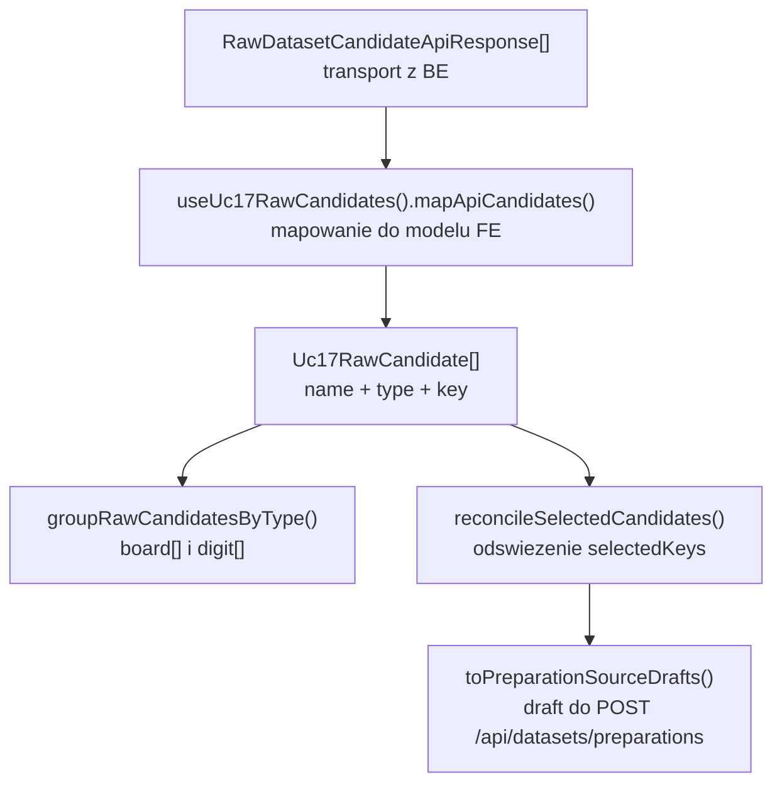
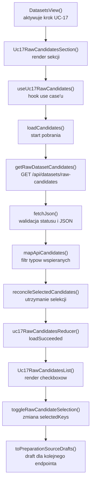

# UC-17-FE - Plan implementacyjny dla `GET /api/datasets/raw-candidates`

## 1) Przeznaczenie endpointa
- Endpoint `GET /api/datasets/raw-candidates` jest wejściem `FE` do docelowego workflow `UC-11 -> UC-17 -> UC-18 -> UC-19`.
- Z perspektywy `FE` ten endpoint:
  - pobiera listę logicznych źródeł `raw`,
  - zwraca tylko rekordy do wyboru,
  - nie tworzy preparation,
  - nie uruchamia preprocessingu,
  - nie wybiera splitów,
  - nie odsłania fizycznych ścieżek runtime.
- Wynik endpointa ma służyć jako źródło danych do zbudowania draftu `name + type`, który później zasili `POST /api/datasets/preparations`.
- Frontend ma traktować `Backend` jako jedyne źródło prawdy dla:
  - listy kandydatów,
  - typu `board` lub `digit`,
  - dostępności źródła.

## 2) Zakres planu
- Plan dotyczy wyłącznie `FE`.
- Nie sugerujemy się bieżącą implementacją `BE` ani `ML` poza ustalonym kontraktem i już istniejącymi typami.
- Plan uwzględnia kod już obecny w repozytorium `src/Frontend`.
- Jeśli coś już istnieje, należy to reuse'ować i ewentualnie utwardzić, zamiast tworzyć równoległe rozwiązanie.

## 3) Główne założenia architektoniczne
- Architektura FE w repo jest obecnie praktycznie `feature-based`, mimo że globalna reguła FE jest jeszcze `TBD`.
- Dla tego endpointa należy utrzymać warstwowość:
  - `View` / publiczny entry feature'a: `src/features/uc17/api/*` i `src/app/views/*`,
  - `ViewController` / orkiestracja: `src/features/uc17/application/*`,
  - `Model`: `src/features/uc17/domain/*` oraz kontrakty `src/types/api.ts`,
  - `Infrastructure`: klient HTTP i wspólne helpery `src/api/*`.
- Nie przenosić `fetch`, walidacji transportu ani mapowania błędów do komponentów React.
- Nie odgadywać typu źródła po stronie `FE`; `type` pochodzi z odpowiedzi API.

## 4) Kontrakt `FE -> BE`

### 4.1 Endpoint
- Metoda i ścieżka: `GET /api/datasets/raw-candidates`
- Body requestu: brak
- Query params: brak
- Nagłówki:
  - `Accept: application/json`
  - `Authorization: Bearer <token>` gdy aktywna jest sesja administratora z `UC-13`

### 4.2 Model wejściowy
- Brak payloadu JSON.

### 4.3 Model wyjściowy sukcesu
- `RawDatasetCandidateApiResponse[]`
- Każdy element:
  - `name: string`
  - `type: string`

Przykład:

```json
[
  {
    "name": "v1_training",
    "type": "board"
  },
  {
    "name": "mnist_train",
    "type": "digit"
  }
]
```

### 4.4 Model błędu
- `ErrorApiResponse`
  - `errorType: string`
  - `message: string`

### 4.5 Reguła kontraktowa
- `FE` nie zmienia nazw:
  - `RawDatasetCandidateApiResponse`
  - `ErrorApiResponse`
- `FE` mapuje znane typy `board` i `digit` do własnego modelu domenowego, ale nie zawęża kontraktu transportowego w `src/types/api.ts` do literału, bo kontrakt BE już istnieje jako `string`.

## 5) Interpretacja warstw MVVC dla tego endpointa

### Model
- Obejmuje:
  - kontrakt HTTP z `BE`,
  - lokalny model `Uc17RawCandidate`,
  - reguły grupowania,
  - reguły wyboru i utrzymania selekcji po odświeżeniu.

### View
- Obejmuje:
  - ekran datasetowy,
  - sekcję `UC-17`,
  - listę kandydatów,
  - stany `loading`, `error`, `empty`, `success`,
  - draft źródeł do następnego endpointa.

### ViewController
- Obejmuje:
  - pobieranie danych,
  - obsługę `AbortController`,
  - retry,
  - reduktor stanu,
  - reakcję na `401`,
  - logi diagnostyczne.

### Infrastructure
- Obejmuje:
  - `fetch`,
  - walidację JSON,
  - mapowanie statusów HTTP do błędów domeny aplikacyjnej `FE`.

## 6) Zachowanie per warstwa

### View
- Po wejściu w krok `UC-17` ekran wywołuje pobranie kandydatów.
- Renderuje liczniki:
  - łączna liczba rekordów,
  - liczba `board`,
  - liczba `digit`,
  - liczba zaznaczonych.
- Umożliwia ręczne odświeżenie listy.
- Pozwala zaznaczać rekordy, ale jeszcze nie wysyła ich do `BE`.
- Pokazuje draft `name + type`, który ma być wykorzystany przez kolejny endpoint.

### ViewController
- Startuje pierwszy odczyt przy montowaniu sekcji.
- Anuluje poprzednie żądanie przy kolejnym odświeżeniu.
- Odrzuca rekordy o nieznanym `type`, zamiast dopuszczać je do dalszej logiki UI.
- Po odświeżeniu zachowuje tylko te zaznaczenia, które nadal istnieją w świeżej odpowiedzi.
- W przypadku `401` uruchamia `onUnauthorized`.

### Model
- Definiuje lokalnie tylko dwa wspierane typy:
  - `board`
  - `digit`
- Buduje stabilny klucz rekordu `type:name`.
- Liczy podsumowania i grupuje rekordy bez zależności od Reacta i `fetch`.
- Buduje draft źródeł do `POST /api/datasets/preparations`.

### Infrastructure
- Wysyła wyłącznie `GET`.
- Waliduje, że odpowiedź jest tablicą rekordów `{ name, type }`.
- Mapuje błędny kształt JSON na błąd techniczny, a nie na pustą listę.
- Przekazuje `Authorization` tylko wtedy, gdy token jest dostępny.

## 7) Co już istnieje i należy reuse'ować
- Implementacja feature'a `UC-17` dla pobrania i zaznaczania kandydatów już istnieje.
- Istnieje generyczny helper:
  - `src/Frontend/src/api/shared/fetchJson.ts`
- Istnieje klient endpointa:
  - `src/Frontend/src/api/datasetsRawCandidates.ts`
- Istnieją typy transportowe:
  - `src/Frontend/src/types/api.ts`
- Istnieje pełna ścieżka feature'a:
  - `src/Frontend/src/features/uc17/api/*`
  - `src/Frontend/src/features/uc17/application/*`
  - `src/Frontend/src/features/uc17/domain/*`
- Istnieje osadzenie widoku w workflow datasetowym:
  - `src/Frontend/src/app/views/DatasetsView.tsx`
- Istnieją style sekcji:
  - `src/Frontend/src/styles/datasets.css`

Wniosek:
- nie tworzyć drugiego klienta `getRawDatasetCandidates()`,
- nie tworzyć drugiego hooka tylko po to, by pobrać tę samą listę,
- nie używać starego `Uc12DatasetPreparationSection` jako bazy dla nowego flow `UC-17`,
- nie duplikować logiki `group`, `counts`, `selection reconciliation`.

## 8) Pliki per warstwa i odpowiedzialności

### 8.1 View
- `[REUSE]` `src/Frontend/src/app/views/DatasetsView.tsx`
  - osadza krok `UC-17` w głównym module datasetowym;
  - przełącza widoki `uc11`, `uc17`, `uc06`, `uc08`.
- `[REUSE]` `src/Frontend/src/features/uc17/api/index.ts`
  - publiczny eksport sekcji `UC-17`.
- `[REUSE]` `src/Frontend/src/features/uc17/api/Uc17RawCandidatesSection.tsx`
  - kontener widoku use case'u;
  - renderuje stany ekranu, liczniki i draft kolejnego requestu.
- `[REUSE]` `src/Frontend/src/features/uc17/api/Uc17RawCandidatesList.tsx`
  - renderuje listy `board` i `digit`;
  - obsługuje zaznaczanie checkboxów.
- `[REUSE]` `src/Frontend/src/styles/datasets.css`
  - style dla `UC-17`, badge'y typów, draftu i liczników.

### 8.2 ViewController
- `[REUSE]` `src/Frontend/src/features/uc17/application/useUc17RawCandidates.ts`
  - główny hook use case'u;
  - pobiera dane, steruje stanem, loguje, robi retry i abort.
- `[REUSE]` `src/Frontend/src/features/uc17/application/uc17RawCandidatesReducer.ts`
  - reduktor stanów ładowania i zaznaczania.
- `[REUSE]` `src/Frontend/src/features/uc17/application/uc17RawCandidatesTypes.ts`
  - typy stanu, akcji i interfejs publiczny hooka.

### 8.3 Model
- `[REUSE]` `src/Frontend/src/features/uc17/domain/uc17RawCandidate.ts`
  - lokalny model `Uc17RawCandidate`;
  - dozwolone typy `board | digit`.
- `[REUSE]` `src/Frontend/src/features/uc17/domain/toUc17RawCandidateKey.ts`
  - buduje stabilny klucz `type:name`.
- `[REUSE]` `src/Frontend/src/features/uc17/domain/groupRawCandidatesByType.ts`
  - grupowanie i liczniki.
- `[REUSE]` `src/Frontend/src/features/uc17/domain/reconcileSelectedCandidates.ts`
  - czyści zaznaczenia po odświeżeniu.
- `[REUSE]` `src/Frontend/src/features/uc17/domain/toPreparationSourceDrafts.ts`
  - buduje draft wejściowy dla kolejnego endpointa.
- `[REUSE]` `src/Frontend/src/types/api.ts`
  - kontrakty transportowe `RawDatasetCandidateApiResponse` i `ErrorApiResponse`.

### 8.4 Infrastructure
- `[REUSE]` `src/Frontend/src/api/datasetsRawCandidates.ts`
  - klient `GET /api/datasets/raw-candidates`.
- `[REUSE]` `src/Frontend/src/api/shared/fetchJson.ts`
  - generyczny helper `fetch + parse + validate + errorFactory`.

### 8.5 Pliki sąsiednie, które trzeba traktować jako kontekst, ale nie rozwijać w tym endpointcie
- `[CONTEXT ONLY]` `src/Frontend/src/components/Uc11RawCandidatesSection.tsx`
  - starszy krok podsumowania `UC-11`;
  - nie powinien być miejscem logiki selekcji dla `UC-17`.
- `[LEGACY / NIE ROZWIJAĆ DLA UC-17]` `src/Frontend/src/components/Uc12DatasetPreparationSection.tsx`
  - dotyczy wcześniejszego workflow `UC-12`;
  - zawiera splitowanie i budowę `.npz`, co jest poza zakresem `UC-17`.

## 9) Co należy dodać lub dopracować
- Jeśli plan ma służyć do domknięcia jakości tego endpointa, zakres zmian powinien być mały i defensywny.
- Preferowany zakres:
  - potwierdzić, że `UC-17` korzysta wyłącznie z istniejącego `getRawDatasetCandidates()`,
  - dopisać brakujące testy jednostkowe dla czystych funkcji `domain`,
  - ewentualnie dodać test hooka / integracyjny dla zachowania `retry + reconcile`,
  - zachować obecną strukturę plików bez dokładania nowych serwisów.
- Nie planować nowych klas ani nowych global store'ów, jeśli nie wynika to z realnej luki.

## 10) Główne funkcje
- `getRawDatasetCandidates()`
- `fetchJson()`
- `useUc17RawCandidates()`
- `loadRawCandidates()`
- `retryLoadRawCandidates()`
- `toggleRawCandidateSelection()`
- `uc17RawCandidatesReducer()`
- `groupRawCandidatesByType()`
- `countRawCandidatesByType()`
- `reconcileSelectedCandidates()`
- `toPreparationSourceDrafts()`
- `toUc17RawCandidateKey()`
- `Uc17RawCandidatesSection()`
- `Uc17RawCandidatesList()`

## 11) Docelowy przepływ w FE
1. Użytkownik przechodzi do kroku `UC-17`.
2. `DatasetsView` renderuje `Uc17RawCandidatesSection`.
3. `useUc17RawCandidates()` startuje pierwszy odczyt.
4. `getRawDatasetCandidates()` wysyła `GET /api/datasets/raw-candidates`.
5. `fetchJson()` waliduje status i kształt odpowiedzi.
6. `useUc17RawCandidates()` mapuje odpowiedź do `Uc17RawCandidate[]`.
7. Rekordy o nieznanym typie są odrzucane i logowane jako `warn`.
8. `reconcileSelectedCandidates()` czyści nieaktualne zaznaczenia.
9. View renderuje listy `board` i `digit`.
10. Użytkownik zaznacza rekordy.
11. `toPreparationSourceDrafts()` buduje draft dla kolejnego endpointa.

## 12) Minimalny przepływ w obrębie BE wymagany przez FE
Ta sekcja jest tylko kontraktowym minimum potrzebnym frontendowi.

1. `BE` odbiera `GET /api/datasets/raw-candidates`.
2. `BE` weryfikuje uprawnienia administracyjne.
3. `BE` skanuje własne źródła prawdy dla kandydatów `raw`.
4. `BE` rozpoznaje typ logiczny każdego kandydata.
5. `BE` zwraca listę `{ name, type }`.
6. `BE` nie zwraca ścieżek serwerowych ani detali `ML`.
7. `FE` nie zakłada nic więcej niż stabilność kontraktu i semantyki `board` / `digit`.

## 13) Wyjątki, fallbacki i zachowanie błędowe

### 13.1 Statusy HTTP
- `200 OK`
  - lista poprawna;
  - może być pusta.
- `401 Unauthorized`
  - sesja admina wygasła lub token jest niepoprawny;
  - `FE` ma wyczyścić ścieżkę administracyjną przez `onUnauthorized`.
- `403 Forbidden`
  - użytkownik nie ma dostępu do kroku administracyjnego;
  - `FE` pokazuje błąd bez retry automatycznego.
- `500 Internal Server Error`
  - błąd po stronie `BE`.
- `502`, `503`, `504`
  - błędy techniczne ścieżki backendowej.

### 13.2 Błędy kontraktu
- Jeśli odpowiedź `200` ma zły kształt JSON:
  - traktować to jako błąd techniczny,
  - nie mapować tego do pustej listy,
  - nie nadpisywać tym świeżych danych, jeśli wcześniej były poprawne.

### 13.3 Fallbacki
- Dopuszczalny fallback:
  - zachowanie ostatniego poprawnego widoku listy przy błędzie kolejnego odświeżenia.
- Niedopuszczalne fallbacki:
  - zgadywanie typu po `name`,
  - samodzielne skanowanie struktury danych po stronie `FE`,
  - podstawianie sztucznej pustej listy jako sukcesu,
  - bezpośrednie połączenie `FE -> ML`.

### 13.4 Zachowanie UI
- `loading`
  - blokuje przycisk odświeżania;
  - zachowuje poprzedni stan listy, jeśli istniał.
- `error`
  - pokazuje banner z błędem;
  - przy `401` dopisuje komunikat o ponownym logowaniu.
- `success + empty`
  - pokazuje informację, że backend zwrócił pustą listę.

## 14) Logging i diagnostyka FE
- Logi powinny pomagać diagnozować problemy, ale nie spamować.

### `console.info`
- start pierwszego ładowania listy,
- ręczny retry,
- sukces odczytu wraz z licznikami `total`, `board`, `digit`.

### `console.warn`
- odrzucenie rekordów z nieznanym `type`,
- usunięcie nieaktualnych zaznaczeń po odświeżeniu,
- `401` lub inne przewidywalne błędy sesji / autoryzacji.

### `console.error`
- `5xx`,
- błąd walidacji kształtu odpowiedzi,
- nieprzetwarzalna odpowiedź z backendu.

### Guardraile logowania
- nie logować tokena,
- nie logować pełnej odpowiedzi backendu, jeśli nie jest to potrzebne,
- nie logować każdego kliknięcia checkboxa na poziomie `info`,
- logować tylko lekkie metadane:
  - `httpStatus`,
  - `errorType`,
  - `count`,
  - `removedCount`.

## 15) Specyficzna logika i pseudokod

### 15.1 Mapowanie odpowiedzi API do modelu FE

```text
loadCandidates():
  response = getRawDatasetCandidates()
  items = []
  unknownTypeCount = 0

  for candidate in response:
    if candidate.type not in ["board", "digit"]:
      unknownTypeCount += 1
      continue

    items.push({
      name: candidate.name,
      type: candidate.type,
      key: `${candidate.type}:${candidate.name}`
    })

  selectedKeys = reconcileSelectedCandidates(previousSelectedKeys, items)
  return { items, selectedKeys, unknownTypeCount }
```

### 15.2 Reconcile zaznaczeń po odświeżeniu

```text
reconcileSelectedCandidates(previousSelectedKeys, items):
  availableKeys = Set(items.map(item => item.key))
  selectedKeys = previousSelectedKeys.filter(key => availableKeys.has(key))
  removedKeys = previousSelectedKeys.filter(key => !availableKeys.has(key))
  return { selectedKeys, removedKeys }
```

### 15.3 Guardrail dla nieznanych typów

```text
if backend returns unknown type:
  do not render unknown section
  do not auto-cast to "digit"
  do not crash whole screen
  log warning
  continue with valid items
```

## 16) Mermaid flowchart - flow modeli



## 17) Mermaid flowchart - logika aplikacji z funkcjami



## 18) Workflow GitHub i runtime
- Dla tego endpointa nie jest potrzebna zmiana `.github/workflows/frontend-cd.yml`.
- Aktualny workflow FE:
  - buduje `src/Frontend`,
  - podstawia `VITE_API_BASE_URL`,
  - pakuje `dist`,
  - publikuje statyczny build.
- Ten endpoint nie potrzebuje nowej zmiennej środowiskowej.
- Lokalnie:
  - `FE` może używać stałego `/api` albo lokalnego `VITE_API_BASE_URL`,
  - nie powinien znać produkcyjnych ścieżek runtime ani `appsettings`.
- Produkcyjnie:
  - workflow i deploy dotyczą tylko publicznego adresu API;
  - ewentualne zmiany `appsettings` produkcyjnych są po stronie `BE`, nie po stronie tego planu FE.
- Guardrail:
  - nie przenosić logiki biznesowej tego endpointa do workflow,
  - nie używać workflow jako źródła prawdy dla typu danych lub dostępności kandydatów.

## 19) Inne istotne reguły
- Trzymać się istniejących kontraktów z poprzednich historyjek.
- Nie zmieniać nazw istniejących typów i plików bez realnej konieczności.
- Nie mieszać nowego workflow `UC-17` ze starym `UC-12`.
- Nie dodawać splitów do tego ekranu.
- Nie wystawiać ścieżek serwerowych ani struktur folderów w UI.
- Nie robić `fetch` bezpośrednio w `DatasetsView`.
- Nie przenosić logiki odświeżania i zaznaczania do CSS, `App.tsx` ani globalnego store'a.

## 20) Kolejność implementacji kodu dla historyjki
1. Zweryfikować istniejący kontrakt w `src/Frontend/src/types/api.ts`.
2. Zweryfikować, że `src/Frontend/src/api/datasetsRawCandidates.ts` pozostaje jedynym klientem tego endpointa.
3. Zweryfikować i utrzymać hook `useUc17RawCandidates()` jako jedyne miejsce orkiestracji pobrania listy.
4. Potwierdzić, że `Uc17RawCandidatesSection.tsx` renderuje stany `loading/error/empty/success`.
5. Potwierdzić, że selekcja buduje tylko draft `name + type`, bez splitów.
6. Dodać lub uzupełnić testy dla:
   - `groupRawCandidatesByType()`,
   - `reconcileSelectedCandidates()`,
   - `toPreparationSourceDrafts()`.
7. Opcjonalnie dodać test hooka dla scenariusza `401` i retry.
8. Uruchomić kontrolę jakości FE.

## 21) Guardraile implementacyjne
- Nie tworzyć nowego klienta HTTP dla `raw-candidates`.
- Nie kopiować logiki z `Uc12DatasetPreparationSection.tsx`.
- Nie dodawać do tego endpointa parametrów splitów, nazwy preparation ani opcji preprocessingu.
- Nie wprowadzać zależności na `ML`.
- Nie zamieniać błędnej odpowiedzi na pustą listę.
- Nie przechowywać zaznaczeń w `localStorage`, jeśli nie ma takiego wymagania historyjki.
- Nie usuwać zachowania `AbortController`.
- Nie przepinać logiki auth do komponentu View.

## 22) Zależności pomiędzy historyjkami

### Wejściowe
- `UC-11`
  - dostarcza semantykę kandydatów `raw`;
  - w UI jest poprzednim krokiem workflow.
- `UC-13`
  - dostarcza sesję administracyjną i token dla wywołania endpointa.

### Równoległe / sąsiednie
- `UC-16` częściowo
  - nie daje bezpośredniej logiki do `GET /api/datasets/raw-candidates`,
  - ale przypomina, że stare i nowe workflow nie mogą się mieszać.

### Wyjściowe
- `UC-17` `POST /api/datasets/preparations`
  - konsumuje draft `name + type`.
- `UC-18`
  - będzie korzystał z rezultatów preparation, nie z samej listy `raw-candidates`.
- `UC-19`
  - zależy pośrednio od przygotowań utworzonych dalej w workflow.

## 23) Plan weryfikacji minimum
- `npm run build`
- `npm run check` lub równoważna komenda projektu, jeśli istnieje
- scenariusz happy path:
  - poprawna lista `board` i `digit`,
  - działające zaznaczanie,
  - poprawny draft `name + type`
- scenariusz pustej listy:
  - poprawny banner informacyjny
- scenariusz `401`:
  - wywołanie `onUnauthorized`
- scenariusz nieznanego typu:
  - rekord nie trafia do UI,
  - ekran nadal działa
- scenariusz odświeżenia:
  - niedostępne już rekordy znikają z zaznaczenia

## 24) Podsumowanie decyzji
- Dla `GET /api/datasets/raw-candidates` większość ścieżki FE już istnieje i powinna zostać reuse'owana.
- Ten endpoint ma pozostać lekki: tylko odczyt listy źródeł i budowa draftu do kolejnego kroku.
- Główne zadanie implementacyjne nie polega tu na budowie nowej architektury, tylko na utrzymaniu warstwowości, kontraktu i małych guardraili jakościowych.
- Najważniejsze granice:
  - `BE` jest źródłem prawdy dla kandydatów i typów,
  - `FE` tylko renderuje, filtruje typy wspierane i buduje lokalny draft,
  - stare `UC-12` nie może być wzorcem dla nowego `UC-17`.
