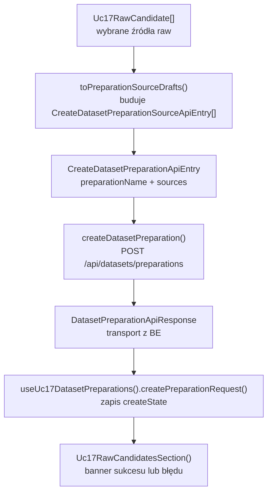
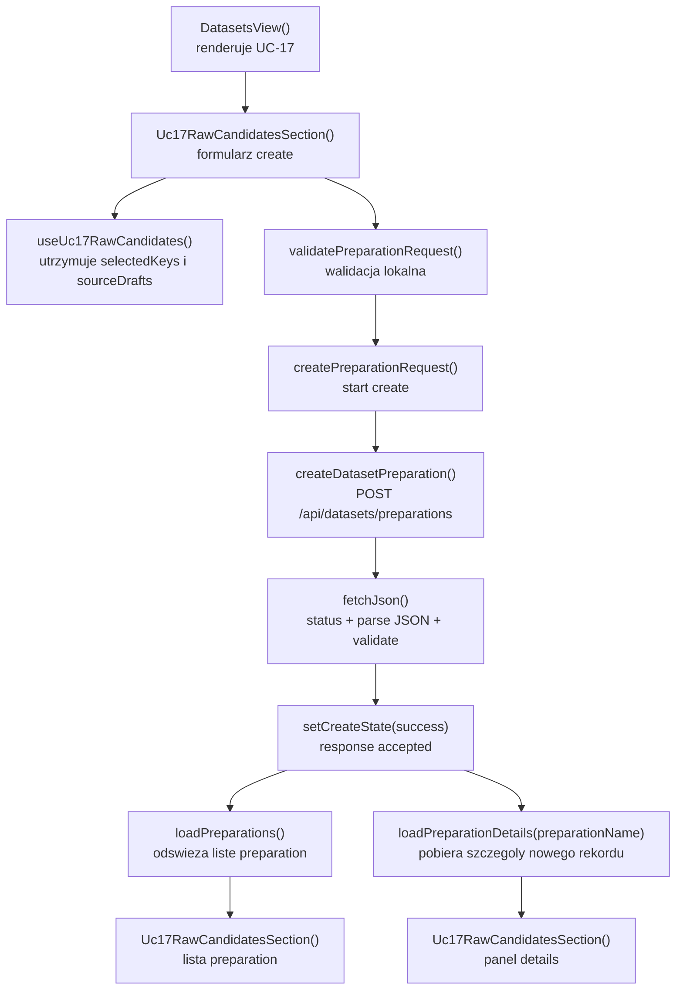

# UC-17-FE - Plan implementacyjny dla `POST /api/datasets/preparations`

## 1) Przeznaczenie endpointa
- Endpoint `POST /api/datasets/preparations` rozpoczyna trwałe przygotowanie datasetu na podstawie wybranych źródeł `raw`.
- Z perspektywy `FE` ten endpoint:
  - zbiera `preparationName` i wybrane `sources`,
  - wysyła lekki request `name + type`,
  - nie wybiera splitów,
  - nie buduje `.npz`,
  - nie pokazuje ścieżek runtime,
  - nie komunikuje się bezpośrednio z `ML`.
- Jest to krok spinający workflow `UC-11 -> UC-17 -> UC-18 -> UC-19`.
- `Backend` pozostaje jedynym źródłem prawdy dla:
  - akceptacji requestu,
  - statusu preparation,
  - listy istniejących preparation,
  - szczegółów preparation.

## 2) Zakres planu
- Plan dotyczy wyłącznie części `FE`.
- Plan nie projektuje implementacji `BE` ani `ML`; opiera się tylko na ustalonym kontrakcie publicznym oraz obecnym kodzie `src/Frontend`.
- Nie należy sugerować się bieżącą implementacją `BE` i `ML` poza publicznym API oraz obowiązującymi nazwami modeli.
- Jeżeli element już istnieje w `src/Frontend`, należy go reuse'ować i ewentualnie doprecyzować, a nie budować równoległe rozwiązanie.
- Plan obejmuje też minimalny kontekst integracyjny z:
  - `GET /api/datasets/raw-candidates`,
  - `GET /api/datasets/preparations`,
  - `GET /api/datasets/preparations/{preparationName}`,
  bo `POST` jest tylko jednym etapem całego use-case'u.

## 3) Główne założenia architektoniczne
- Reguła FE jest globalnie nadal `TBD`, ale aktualny kod dla `UC-17` jest już praktycznie `feature-based` i warstwowy.
- Dla tego endpointa należy utrzymać podział MVVC:
  - `Model`: kontrakt request/response, model wybranych źródeł i walidacja nazwy,
  - `View`: input nazwy, draft źródeł, przycisk startu, bannery sukcesu i błędu,
  - `ViewController`: walidacja przed wysłaniem, request `POST`, reakcja na `401`, odświeżenie listy i szczegółów po sukcesie,
  - `Infrastructure`: klient HTTP, walidacja JSON, mapowanie błędów transportowych.
- Nie wolno przenosić `fetch`, walidacji JSON ani obsługi statusów HTTP do komponentów React.
- Nie wolno tworzyć nowej osobnej usługi do `POST`, jeśli istnieje już `src/Frontend/src/api/datasetPreparations.ts`.
- Jeśli kiedyś trzeba wydzielić bardziej generyczny helper tworzenia requestów autoryzowanych, najpierw należy sprawdzić, czy obecne `fetchJson()` i moduł `datasetPreparations.ts` nie są już wystarczająco generyczne.
- Nie mieszać nowego flow `UC-17` ze starym `UC-12`.

## 4) Miejsce endpointa w workflow
1. `GET /api/datasets/raw-candidates` dostarcza listę źródeł `raw`.
2. Użytkownik zaznacza rekordy `board` i `digit`.
3. `FE` buduje draft `sources: [{ name, type }]`.
4. Użytkownik wpisuje `preparationName`.
5. `POST /api/datasets/preparations` wysyła request do `BE`.
6. `BE` akceptuje request i zwraca rekord preparation.
7. `FE` odświeża:
   - listę preparation przez `GET /api/datasets/preparations`,
   - szczegóły nowo utworzonego rekordu przez `GET /api/datasets/preparations/{preparationName}`.

## 5) Model API w komunikacji z BE

### 5.1 Request `FE -> BE`
- Metoda i ścieżka: `POST /api/datasets/preparations`
- Nagłówki:
  - `Accept: application/json`
  - `Content-Type: application/json`
  - `Authorization: Bearer <token>` gdy aktywna jest sesja administratora

### 5.2 Model wejściowy
- `CreateDatasetPreparationApiEntry`
  - `preparationName: string`
  - `sources: CreateDatasetPreparationSourceApiEntry[]`
- `CreateDatasetPreparationSourceApiEntry`
  - `name: string`
  - `type: string`

Przykład requestu:

```json
{
  "preparationName": "preparation-001",
  "sources": [
    {
      "name": "v1_training",
      "type": "board"
    },
    {
      "name": "mnist_train",
      "type": "digit"
    }
  ]
}
```

### 5.3 Model wyjściowy sukcesu
- Oczekiwany status HTTP: `202 Accepted`
- `DatasetPreparationApiResponse`
  - `preparationName: string`
  - `createdAtUtc: string`
  - `status: string`
  - `sources: DatasetPreparationSourceApiResponse[]`
  - `warnings: string[]`
- `DatasetPreparationSourceApiResponse`
  - `name: string`
  - `type: string`
  - `preparedItemsCount: number`

Przykład response:

```json
{
  "preparationName": "preparation-001",
  "createdAtUtc": "2026-06-19T18:45:00Z",
  "status": "queued",
  "sources": [
    {
      "name": "v1_training",
      "type": "board",
      "preparedItemsCount": 0
    },
    {
      "name": "mnist_train",
      "type": "digit",
      "preparedItemsCount": 0
    }
  ],
  "warnings": []
}
```

### 5.4 Model błędu
- `ErrorApiResponse`
  - `errorType: string`
  - `message: string`

### 5.5 Reguły kontraktowe
- Nie zmieniać nazw:
  - `CreateDatasetPreparationApiEntry`
  - `CreateDatasetPreparationSourceApiEntry`
  - `DatasetPreparationApiResponse`
  - `DatasetPreparationSourceApiResponse`
  - `ErrorApiResponse`
- Dane transportowe zostają w `camelCase`.
- `FE` nie zawęża transportowego `type: string` do literalnych typów w `src/types/api.ts`; zawężenie domenowe może istnieć tylko lokalnie.
- `FE` nie zakłada, że `status` po create zawsze będzie `queued`; może to być inna wartość zgodna z kontraktem backendu.

## 6) Zachowanie z każdej warstwy MVVC

### Model
- Utrzymuje kontrakty HTTP i model zaznaczonych źródeł.
- Definiuje lokalny draft `sources` wyliczany z zaznaczeń.
- Zawiera regułę walidacji nazwy preparation przed wysyłką:
  - nazwa nie może być pusta po `trim`,
  - nazwa nie może przekroczyć limitu długości,
  - nazwa nie może zawierać niedozwolonych znaków,
  - musi istnieć co najmniej jedno źródło.
- Nie zna `fetch`, Reacta ani statusów HTTP.

### View
- Renderuje:
  - pole `preparationName`,
  - draft requestu do `POST`,
  - banner walidacyjny,
  - banner błędu backendu,
  - banner sukcesu po `202`,
  - przycisk `Rozpocznij przygotowanie`.
- Nie podejmuje decyzji o auth, retry ani mapowaniu statusów HTTP.
- Pokazuje użytkownikowi tylko to, co jest potrzebne do wysłania requestu i oceny wyniku.

### ViewController
- Łączy wybór źródeł z kroku `raw-candidates` z requestem create.
- Wykonuje walidację `preparationName` i `selectedCount`.
- Wysyła `POST /api/datasets/preparations`.
- Po sukcesie:
  - zapisuje response create,
  - czyści lokalne `formError`,
  - czyści `preparationName`,
  - odświeża listę preparation,
  - pobiera szczegóły nowo utworzonego preparation.
- Po błędzie:
  - zachowuje poprzedni response create, jeśli był,
  - mapuje statusy na czytelne hinty,
  - obsługuje `401` przez `onUnauthorized`.

### Infrastructure
- Wysyła request `POST` z JSON-em.
- Dokleja `Authorization` tylko wtedy, gdy token istnieje.
- Oczekuje `202 Accepted`.
- Waliduje kształt JSON response.
- Zwraca spójny `DatasetPreparationsApiError` dla błędów HTTP.

## 7) Pliki per warstwa i odpowiedzialności

### 7.1 View
- `[REUSE]` `src/Frontend/src/app/views/DatasetsView.tsx`
  - osadza cały feature `UC-17` w workflow datasetowym;
  - przekazuje `apiBaseUrl`, `accessToken`, `onUnauthorized`.
- `[REUSE]` `src/Frontend/src/features/uc17/api/index.ts`
  - publiczny entry point feature'a.
- `[REUSE]` `src/Frontend/src/features/uc17/api/Uc17RawCandidatesSection.tsx`
  - renderuje krok wyboru źródeł, formularz create, listę preparation i panel details;
  - zawiera input nazwy, draft requestu, bannery create i przycisk startu;
  - jest głównym widokiem dla `POST /api/datasets/preparations`.
- `[REUSE]` `src/Frontend/src/features/uc17/api/Uc17RawCandidatesList.tsx`
  - renderuje listy `board` i `digit`;
  - pozwala zbudować selekcję źródeł wejściowych do `POST`.
- `[REUSE]` `src/Frontend/src/styles/datasets.css`
  - style formularza, draftu, badge'y statusów, listy preparation i bannerów.

### 7.2 ViewController
- `[REUSE]` `src/Frontend/src/features/uc17/application/useUc17RawCandidates.ts`
  - pobiera kandydatów `raw`;
  - utrzymuje selekcję;
  - dostarcza `sourceDrafts`, które są wejściem do `POST`.
- `[REUSE]` `src/Frontend/src/features/uc17/application/useUc17DatasetPreparations.ts`
  - jedno miejsce orkiestracji dla:
    - `POST /api/datasets/preparations`,
    - `GET /api/datasets/preparations`,
    - `GET /api/datasets/preparations/{preparationName}`;
  - zawiera `createPreparationRequest()`, `loadPreparations()` i `loadPreparationDetails()`;
  - obsługuje aborty, błędy auth i odświeżenie po sukcesie.
- `[REUSE]` `src/Frontend/src/features/uc17/application/uc17RawCandidatesReducer.ts`
  - reduktor wyboru źródeł wejściowych.
- `[REUSE]` `src/Frontend/src/features/uc17/application/uc17RawCandidatesTypes.ts`
  - typy stanu i wyniku hooka `useUc17RawCandidates`.

### 7.3 Model
- `[REUSE]` `src/Frontend/src/types/api.ts`
  - źródło prawdy dla modeli transportowych create/list/details.
- `[REUSE]` `src/Frontend/src/features/uc17/domain/uc17RawCandidate.ts`
  - domenowy model kandydata `raw`;
  - lokalne zawężenie wspieranych typów `board | digit`.
- `[REUSE]` `src/Frontend/src/features/uc17/domain/toPreparationSourceDrafts.ts`
  - buduje `CreateDatasetPreparationSourceApiEntry[]` z zaznaczeń użytkownika.
- `[REUSE]` `src/Frontend/src/features/uc17/domain/toUc17RawCandidateKey.ts`
  - generuje stabilny klucz kandydata do selekcji.
- `[REUSE]` `src/Frontend/src/features/uc17/domain/reconcileSelectedCandidates.ts`
  - usuwa nieaktualne zaznaczenia po odświeżeniu listy `raw`.
- `[REUSE]` `src/Frontend/src/features/uc17/domain/groupRawCandidatesByType.ts`
  - grupuje kandydatów `board` i `digit` do prezentacji.

### 7.4 Infrastructure
- `[REUSE]` `src/Frontend/src/api/datasetPreparations.ts`
  - klient create/list/details dla endpointów preparation;
  - guardy odpowiedzi JSON;
  - `buildAuthHeaders()` i klasa `DatasetPreparationsApiError`.
- `[REUSE]` `src/Frontend/src/api/datasetsRawCandidates.ts`
  - klient poprzedniego kroku `UC-17`;
  - źródło danych wejściowych do create.
- `[REUSE]` `src/Frontend/src/api/shared/fetchJson.ts`
  - generyczny mechanizm `fetch + parse + walidacja + errorFactory`.

### 7.5 Pliki kontekstowe, których nie rozwijać dla tego endpointa
- `[LEGACY / NIE ROZWIJAĆ]` `src/Frontend/src/components/Uc12DatasetPreparationSection.tsx`
  - dotyczy starego workflow `UC-12`;
  - zawiera splitowanie i build `.npz`, więc nie może być wzorcem dla `UC-17 POST`.

## 8) Co już istnieje i należy reuse'ować
- `POST /api/datasets/preparations` jest już obecny w kodzie FE:
  - klient `createDatasetPreparation()` istnieje,
  - hook `createPreparationRequest()` istnieje,
  - widok formularza i draft requestu istnieje.
- Oznacza to, że plan nie powinien dodawać:
  - drugiego klienta HTTP,
  - drugiego hooka create,
  - drugiego formularza create w innym miejscu,
  - osobnej biblioteki do requestów.
- Jeśli będą potrzebne dalsze poprawki, powinny dotyczyć głównie:
  - utwardzenia walidacji,
  - doprecyzowania logowania,
  - utrzymania czystych granic między warstwami,
  - ewentualnej ekstrakcji małego komponentu prezentacyjnego tylko wtedy, gdy JSX urośnie zbyt mocno.

## 9) Główne funkcje
- `getRawDatasetCandidates()`
- `useUc17RawCandidates()`
- `toPreparationSourceDrafts()`
- `validatePreparationRequest()`
- `createDatasetPreparation()`
- `createPreparationRequest()`
- `loadPreparations()`
- `loadPreparationDetails()`
- `handleUnauthorizedError()`
- `logPreparationsError()`
- `Uc17RawCandidatesSection()`
- `fetchJson()`

## 10) Docelowy przepływ w FE
1. `DatasetsView()` renderuje `Uc17RawCandidatesSection()`.
2. `useUc17RawCandidates()` pobiera kandydatów `raw`.
3. Użytkownik zaznacza rekordy `board` i `digit`.
4. `toPreparationSourceDrafts()` buduje `sources`.
5. Użytkownik wpisuje `preparationName`.
6. `validatePreparationRequest()` sprawdza poprawność danych lokalnych.
7. `createPreparationRequest()` wywołuje `createDatasetPreparation()`.
8. `createDatasetPreparation()` wysyła `POST /api/datasets/preparations`.
9. Po `202` hook zapisuje sukces create.
10. Hook odświeża listę preparation przez `loadPreparations()`.
11. Hook pobiera szczegóły nowego rekordu przez `loadPreparationDetails(response.preparationName)`.
12. View pokazuje status utworzonego preparation i gotowość do dalszych kroków.

## 11) Opis przepływu w obrębie BE potrzebny frontendowi
Ta sekcja opisuje wyłącznie kontraktowe minimum potrzebne `FE`.

1. `FE` wysyła `POST /api/datasets/preparations` z tokenem administratora.
2. `BE` weryfikuje autoryzację.
3. `BE` waliduje:
   - `preparationName`,
   - listę `sources`,
   - spójność `name + type`.
4. `BE` rejestruje nowe preparation w swoim źródle prawdy i uruchamia dalszy workflow po swojej stronie.
5. `BE` zwraca `202 Accepted` z aktualnym snapshotem preparation.
6. `FE` nie zakłada nic o wewnętrznym sposobie uruchamiania `ML`.
7. `FE` używa odpowiedzi tylko jako potwierdzenia, że backend przyjął request, a nie jako substytutu pełnej listy i szczegółów.

## 12) Wyjątki, fallbacki i zachowanie błędowe

### 12.1 Statusy HTTP
- `202 Accepted`
  - request został przyjęty;
  - create kończy się sukcesem.
- `400 Bad Request`
  - niepoprawna nazwa lub pusty / niepoprawny payload;
  - `FE` pokazuje błąd i nie robi automatycznego retry.
- `401 Unauthorized`
  - sesja administratora wygasła albo token jest niepoprawny;
  - `FE` wywołuje `onUnauthorized`.
- `404 Not Found`
  - jedno ze źródeł nie istnieje;
  - `FE` pokazuje czytelny komunikat.
- `409 Conflict`
  - preparation o tej nazwie już istnieje;
  - `FE` pokazuje błąd domenowy bez czyszczenia wyboru źródeł.
- `422 Unprocessable Entity`
  - backend odrzucił niespójny request;
  - `FE` pokazuje błąd kontraktowy lub walidacyjny.
- `500 Internal Server Error`
  - błąd backendu.
- `502`, `503`, `504`
  - błąd infrastrukturalny pomiędzy przeglądarką, nginx i backendem.

### 12.2 Błędy kontraktu
- Jeśli `202` zwróci niepoprawny JSON:
  - traktować to jako błąd techniczny,
  - nie mapować tego do sztucznego sukcesu,
  - nie zakładać, że create się udał tylko dlatego, że request wrócił ze statusem sukcesu.

### 12.3 Fallbacki
- Dopuszczalne fallbacki:
  - zachowanie poprzedniego `createState.response`, jeśli trwa nowa próba,
  - zachowanie zaznaczeń źródeł po nieudanym create,
  - zachowanie listy `raw` i listy preparation przy błędzie create.
- Niedopuszczalne fallbacki:
  - zgadywanie `type` po nazwie,
  - samodzielne tworzenie "fake preparation" po stronie `FE`,
  - przejście bezpośrednio `FE -> ML`,
  - podstawianie pustego response jako sukcesu.

### 12.4 Zachowanie UI
- `formError`
  - pokazuje błąd walidacji lokalnej jeszcze przed requestem.
- `createState.loading`
  - blokuje przycisk startu;
  - nie powinien czyścić listy kandydatów ani draftu.
- `createState.error`
  - pokazuje komunikat błędu z backendu;
  - może pokazać dodatkowy `statusHint`.
- `createState.success`
  - pokazuje nazwę i status utworzonego preparation;
  - nie oznacza jeszcze końca całego preprocessingu, tylko akceptację requestu.

## 13) Zachowanie wyjątkowe i fallbacki domenowe
- Jeśli użytkownik nie zaznaczy żadnego źródła:
  - nie wysyłać requestu;
  - pokazać lokalny błąd walidacyjny.
- Jeśli `preparationName` zawiera znaki niedozwolone:
  - zablokować create lokalnie;
  - nie liczyć na walidację dopiero po stronie `BE`.
- Jeśli użytkownik kliknie create kilka razy:
  - aktywny request powinien zablokować przycisk;
  - nie tworzyć wielokrotnych równoległych requestów create z tego samego widoku.
- Jeśli nowa próba create startuje w trakcie starej:
  - poprzedni create request można anulować na poziomie hooka;
  - stan widoku musi pozostać spójny.

## 14) Logging i diagnostyka FE
- Logowanie ma pomagać diagnozować problemy, ale nie może spamować.

### `console.info`
- start tworzenia preparation,
- sukces przyjęcia requestu przez backend,
- ręczne odświeżenie listy preparation po create,
- ręczne odświeżenie szczegółów nowo utworzonego preparation tylko wtedy, gdy ma wartość diagnostyczną.

### `console.warn`
- `401` i wyczyszczenie sesji,
- przewidywalne błędy domenowe typu `409` lub `404`, jeśli wymagają lekkiego śladu diagnostycznego.

### `console.error`
- `5xx`,
- niepoprawny kształt response `202`,
- techniczna niemożność przetworzenia odpowiedzi.

### Guardraile logowania
- nie logować tokena,
- nie logować całego payloadu requestu,
- nie logować pełnego response backendu,
- logować tylko lekkie metadane:
  - `httpStatus`,
  - `errorType`,
  - `sourcesCount`,
  - `status`,
  - `preparationName`.

## 15) Specyficzna logika i pseudokod

### 15.1 Walidacja formularza create

```text
validatePreparationRequest(preparationName, selectedCount):
  trimmedName = preparationName.trim()

  if trimmedName is empty:
    return "Podaj nazwę przygotowania."

  if trimmedName.length > MAX_PREPARATION_NAME_LENGTH:
    return "Nazwa przygotowania jest za długa."

  if trimmedName contains disallowed characters or "..":
    return "Nazwa przygotowania zawiera niedozwolone znaki."

  if selectedCount == 0:
    return "Wybierz przynajmniej jedno źródło raw."

  return null
```

### 15.2 Orkiestracja create requestu

```text
handleCreatePreparation():
  validationError = validatePreparationRequest(preparationName, selectedCount)

  if validationError exists:
    setFormError(validationError)
    return

  setFormError(null)

  wasCreated = createPreparationRequest({
    preparationName: preparationName.trim(),
    sources: sourceDrafts
  })

  if wasCreated:
    setPreparationName("")
```

### 15.3 Zachowanie hooka po sukcesie `202`

```text
createPreparationRequest(params):
  abort previous create request
  set createState = loading

  response = createDatasetPreparation(apiBaseUrl, params, accessToken, signal)

  set createState = success(response)
  await loadPreparations()
  await loadPreparationDetails(response.preparationName)
  return true
```

### 15.4 Mapowanie błędów create na hinty UI

```text
toCreateStatusHint(status):
  400 -> "Sprawdź nazwę przygotowania i listę źródeł."
  401 -> "Sesja administracyjna wygasła. Zaloguj się ponownie."
  404 -> "Jedno z wybranych źródeł nie jest już dostępne."
  409 -> "Przygotowanie o tej nazwie już istnieje."
  422 -> "Backend odrzucił request z powodu niespójności danych."
  500 -> "Backend nie rozpoczął przygotowania z powodu błędu technicznego."
  other -> null
```

## 16) Mermaid flowchart - flow modeli



## 17) Mermaid flowchart - logika aplikacji z funkcjami



## 18) Workflow GitHub i runtime
- Dla tego endpointa nie jest potrzebna nowa zmienna środowiskowa ani osobna zmiana workflow, jeśli istniejące `VITE_API_BASE_URL` pozostaje poprawne.
- Aktualny workflow FE w `.github/workflows/frontend-cd.yml`:
  - buduje `src/Frontend`,
  - uruchamia `npm install`,
  - uruchamia `npm run build`,
  - przekazuje `VITE_API_BASE_URL="${FE_VITE_API_BASE_URL:-/api}"`,
  - pakuje `dist`,
  - publikuje statyczny build.
- Lokalnie:
  - `FE` może działać na stałym `/api`,
  - lokalna konfiguracja nie powinna wymagać ręcznej zabawy w `appsettings`,
  - lokalne zachowanie ma być proste i deterministyczne.
- Produkcyjnie:
  - workflow może podstawiać publiczny adres API,
  - workflow backendowy może modyfikować produkcyjne `appsettings`,
  - ten plan FE nie powinien jednak zakładać żadnej dodatkowej wiedzy o ich zawartości.
- Guardrail:
  - nie hardcodować URL-i środowiskowych w komponentach,
  - nie wprowadzać logiki biznesowej do workflow,
  - nie traktować workflow jako źródła prawdy dla statusu preparation.

## 19) Kolejność implementacji kodu dla historyjki
1. Zweryfikować kontrakty w `src/Frontend/src/types/api.ts`.
2. Zweryfikować, że `src/Frontend/src/api/datasetPreparations.ts` pozostaje jedynym klientem create/list/details dla preparation.
3. Zweryfikować, że `useUc17RawCandidates()` jest jedynym źródłem `sourceDrafts`.
4. Zweryfikować, że `useUc17DatasetPreparations()` pozostaje jedynym miejscem orkiestracji create flow.
5. Potwierdzić walidację `preparationName` i `selectedCount` w `Uc17RawCandidatesSection.tsx`.
6. Potwierdzić, że po sukcesie create wykonywane są:
   - refresh listy,
   - load szczegółów nowego rekordu.
7. Dopracować lekkie logowanie i hinty błędów tylko tam, gdzie mają realną wartość.
8. Jeśli JSX sekcji urośnie zbyt mocno, rozważyć ekstrakcję małego komponentu prezentacyjnego bez rozbijania hooków i klienta.
9. Uruchomić kontrolę jakości FE.

## 20) Guardraile implementacyjne
- Nie tworzyć nowego klienta HTTP dla `POST /api/datasets/preparations`.
- Nie tworzyć nowego hooka create tylko dla jednego przycisku.
- Nie kopiować logiki z legacy `UC-12`.
- Nie przenosić `fetch` do `DatasetsView.tsx` ani do komponentów listy.
- Nie wysyłać requestu, jeśli lokalna walidacja już wie, że dane są błędne.
- Nie zgadywać odpowiedzi backendu po stronie `FE`.
- Nie traktować `202 Accepted` jako zakończenia całego preprocessingu, tylko jako przyjęcie zadania.
- Nie dodawać auto-pollingu bez jawnego wymagania historyjki.
- Nie przechowywać draftu create w `localStorage`, jeśli nie ma takiego wymagania.
- Nie rozdzielać create/list/details na trzy różne feature'y, jeśli należą do jednego use-case'u `UC-17`.

## 21) Zależności pomiędzy historyjkami

### Wejściowe
- `UC-11`
  - dostarcza listę kandydatów `raw`;
  - bez niego nie ma źródeł do create.
- `UC-13`
  - dostarcza sesję administracyjną i token.
- `UC-17 GET /api/datasets/raw-candidates`
  - daje użytkownikowi selekcję `name + type`.

### Sąsiednie
- `UC-17 GET /api/datasets/preparations`
  - pokazuje listę preparation po create.
- `UC-17 GET /api/datasets/preparations/{preparationName}`
  - pokazuje szczegóły preparation po create.
- `UC-16` częściowo
  - jest kontekstem historycznym starego workflow, ale nie może narzucać kształtu nowego `UC-17`.

### Wyjściowe
- `UC-18`
  - korzysta z utworzonych preparation do przeglądu i usuwania elementów.
- `UC-19`
  - zależy pośrednio od poprawnie utworzonych preparation.

## 22) Inne istotne reguły
- Trzymać się już dodanych nazw typów, pól i funkcji.
- Jeśli potrzebna jest nowa abstrakcja, najpierw sprawdzić:
  - czy da się użyć istniejącego `fetchJson()`,
  - czy da się rozbudować `datasetPreparations.ts`,
  - czy da się zostać w obrębie `useUc17DatasetPreparations()`.
- Utrzymać warstwowość:
  - logika domenowa nie trafia do CSS ani do widoku,
  - logika transportowa nie trafia do Modelu i View,
  - logika UI nie trafia do modułu API.
- `FE` ma komunikować się tylko z `BE`.
- `FE` nie zna fizycznych ścieżek runtime, katalogów `raw`, `processed` ani struktur serwerowych.
- `warnings` z response to informacja pomocnicza, a nie automatyczny stan błędu.

## 23) Plan weryfikacji minimum
- `npm run check`
- `npm run build`
- scenariusz happy path:
  - są wybrane źródła,
  - poprawna nazwa preparation,
  - backend zwraca `202`,
  - UI pokazuje sukces,
  - lista preparation i szczegóły odświeżają się poprawnie.
- scenariusz pustej selekcji:
  - brak requestu,
  - lokalny błąd walidacyjny.
- scenariusz błędnej nazwy:
  - brak requestu,
  - lokalny błąd walidacyjny.
- scenariusz `401`:
  - `onUnauthorized` zostaje wywołane.
- scenariusz `409`:
  - użytkownik dostaje komunikat o konflikcie nazwy,
  - zaznaczone źródła nie znikają.
- scenariusz `422`:
  - UI pokazuje błąd backendu bez udawanego sukcesu.
- scenariusz błędnego JSON `202`:
  - odpowiedź jest traktowana jako błąd techniczny.

## 24) Podsumowanie decyzji
- Dla `POST /api/datasets/preparations` fundamenty FE już istnieją i należy je reuse'ować.
- Najważniejsze granice odpowiedzialności:
  - `Infrastructure` wysyła request i waliduje response,
  - `ViewController` orkiestruje create oraz odświeżenie dalszych danych,
  - `Model` utrzymuje draft requestu i reguły walidacji,
  - `View` tylko renderuje formularz i stany UI.
- Najważniejsze guardraile:
  - brak duplikacji klienta i hooka,
  - brak mieszania z `UC-12`,
  - brak zgadywania danych po stronie `FE`,
  - brak ciężkiego logowania,
  - brak zmian workflow, jeśli obecne `VITE_API_BASE_URL` wystarcza.
- Ten endpoint ma być na FE traktowany jako lekki start workflow, a nie miejsce implementacji logiki preprocessingu.
