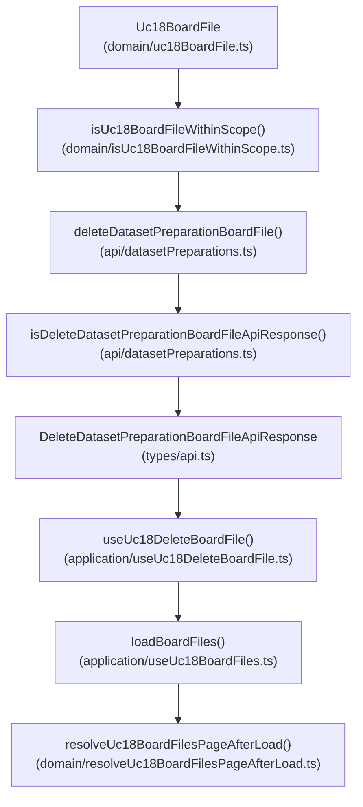
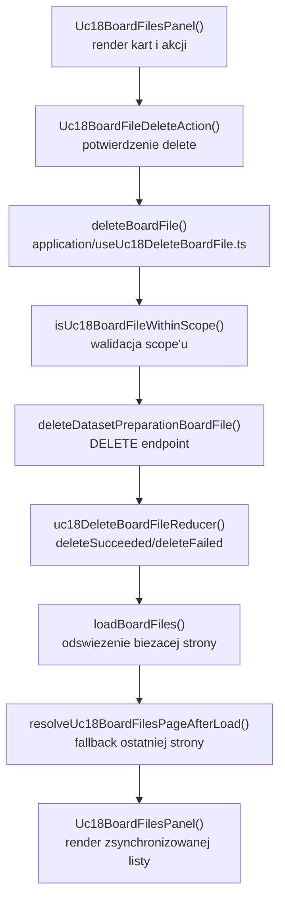

# UC-18-FE - Plan implementacyjny dla `DELETE /api/datasets/preparations/{preparationName}/board/{sourceName}/files/{boardFolderName}`

## 1) Przeznaczenie endpointa
- Endpoint usuwa jeden logiczny element `board` z istniejacego `preparation`.
- Z perspektywy `FE` ten endpoint:
  - nie wybiera `preparation`,
  - nie wybiera `sourceName`,
  - nie pobiera listy plansz,
  - nie pobiera obrazu preview,
  - wykonuje mutacje danych i wymaga pozniejszego odswiezenia listy z `Backendu`.
- Gdy operator usuwa `boardFolderName`, `Backend` pozostaje jedynym zrodlem prawdy dla:
  - tego, czy wskazany rekord nadal istnieje,
  - tego, czy usuniecie sie powiodlo,
  - liczby pozostalych rekordow,
  - finalnego ksztaltu listy po usunieciu,
  - ewentualnej korekty paginacji po zmianie `totalCount`.
- `FE` ma jedynie:
  - wystawic akcje usuniecia,
  - pokazac bezpieczne potwierdzenie,
  - zablokowac konfliktowe akcje w trakcie mutacji,
  - odswiezyc liste przy uzyciu juz istniejacego mechanizmu `GET /board/{sourceName}/files`.

## 2) Zakres planu
- Plan dotyczy tylko `FE`.
- Plan nie projektuje implementacji `BE` ani `ML`; opiera sie tylko na:
  - publicznym kontrakcie endpointa,
  - wymaganiach `UC-18`,
  - aktualnym stanie `src/Frontend`,
  - juz wdrozonych czesciach `UC-17` i `UC-18`.
- Nie nalezy sugerowac sie biezaca implementacja `BE` i `ML` poza kontraktem HTTP i opisem historyjki.
- Plan musi pozostac warstwowy i zgodny z praktycznym ukladem:
  - `src/features/*`
  - `src/api/*`
  - `src/types/*`
  - `src/app/*`

## 3) Miejsce endpointa w workflow `UC-18`
1. Operator wybiera `preparationName`.
2. `FE` pobiera `board/folders`.
3. Operator wybiera `sourceName`.
4. `FE` pobiera `board/{sourceName}/files?page={page}&pageSize={pageSize}`.
5. `FE` renderuje liste plansz i preview obrazow.
6. Operator inicjuje usuniecie jednej planszy `boardFolderName`.
7. `FE` wysyla `DELETE /api/datasets/preparations/{preparationName}/board/{sourceName}/files/{boardFolderName}`.
8. Po sukcesie `FE` nie zgaduje nowej listy lokalnie, tylko odswieza biezaca strone przez istniejacy hook `useUc18BoardFiles()`.
9. Jesli po usunieciu biezaca strona przestala istniec, obecny fallback `useUc18BoardFiles()` ma przeladowac ostatnia dostepna strone.

## 4) Co juz istnieje i czego nalezy uzyc
- Istnieje shell `UC-18`:
  - `src/Frontend/src/features/uc18/api/Uc18BoardFoldersSection.tsx`
- Istnieje panel listy plansz:
  - `src/Frontend/src/features/uc18/api/Uc18BoardFilesPanel.tsx`
- Istnieje hook listowania plansz i paginacji:
  - `src/Frontend/src/features/uc18/application/useUc18BoardFiles.ts`
  - `src/Frontend/src/features/uc18/application/uc18BoardFilesReducer.ts`
  - `src/Frontend/src/features/uc18/application/uc18BoardFilesTypes.ts`
- Istnieje model domenowy planszy:
  - `src/Frontend/src/features/uc18/domain/uc18BoardFile.ts`
  - `src/Frontend/src/features/uc18/domain/resolveUc18BoardFilesPageAfterLoad.ts`
- Istnieje preview obrazu per karta:
  - `src/Frontend/src/features/uc18/api/Uc18BoardImagePreview.tsx`
  - `src/Frontend/src/features/uc18/application/useUc18BoardImage.ts`
- Istnieje wspolny klient HTTP dla preparation:
  - `src/Frontend/src/api/datasetPreparations.ts`
- Istnieje wspolny helper transportowy:
  - `src/Frontend/src/api/shared/fetchJson.ts`
- Istnieja aktualne kontrakty `UC-18`:
  - `src/Frontend/src/types/api.ts`

Wniosek:
- nie tworzyc nowego pliku API obok `datasetPreparations.ts`,
- nie dublowac logiki odswiezania listy z `useUc18BoardFiles()`,
- nie implementowac optymistycznej rekonstrukcji paginowanej listy po stronie klienta,
- reuse'owac istniejace `page`, `pageSize`, `totalCount` i fallback strony po odswiezeniu.

## 5) Strategia generycznosci i reuse
- Najpierw trzeba sprawdzic, czy usluga juz istnieje.
- Wlasciwe miejsce rozszerzenia juz istnieje:
  - `src/Frontend/src/api/datasetPreparations.ts`
- Nowa funkcja nie musi byc globalnie generyczna dla wszystkich mutacji datasetowych, ale powinna byc napisana tak, by dalo sie ja reuse'owac przy:
  - recznym ponowieniu delete,
  - przyszlym batchowym czyszczeniu kart w tym samym feature,
  - ewentualnych testach integracyjnych hooka mutacji.
- Reuse ma byc pragmatyczny:
  - wspolny klient HTTP i `fetchJson()` tak,
  - reuse `Uc18BoardFile` jako targetu delete tak,
  - reuse `useUc18BoardFiles().loadBoardFiles()` do finalnego reconcile tak,
  - tworzenie nowego globalnego store dla mutacji nie.
- Najwazniejsza decyzja architektoniczna:
  - po sukcesie delete nie mutowac lokalnej paginowanej listy "na slepo",
  - tylko przeladowac biezacy widok z `Backendu`.

## 6) Model API w komunikacji z BE

### 6.1 Request `FE -> BE`
- Metoda i sciezka:
  - `DELETE /api/datasets/preparations/{preparationName}/board/{sourceName}/files/{boardFolderName}`
- Path params:
  - `preparationName: string`
  - `sourceName: string`
  - `boardFolderName: string`
- Query params:
  - brak
- Body:
  - brak
- Naglowki:
  - `Accept: application/json`
  - `Authorization: Bearer <token>` gdy sesja administracyjna jest aktywna

### 6.2 Model wejscia po stronie FE
- `FE` nie wysyla JSON body.
- Warstwa `ViewController` potrzebuje:
  - `Uc18BoardFile`
  - aktualne `page`
  - aktualne `pageSize`
  - `preparationName` i `sourceName` aktywnego scope'u
- Delete powinien byc uruchamiany tylko dla planszy widocznej na aktualnej liscie.

### 6.3 Model wyjsciowy sukcesu
- Oczekiwany status:
  - `200 OK`
- Nalezy dodac do `src/Frontend/src/types/api.ts`:
  - `DeleteDatasetPreparationBoardFileApiResponse`
    - `preparationName: string`
    - `sourceName: string`
    - `boardFolderName: string`
    - `deleted: boolean`
    - `remainingItemsCount: number`

Przyklad:

```json
{
  "preparationName": "preparation-001",
  "sourceName": "v1_training",
  "boardFolderName": "Image1079",
  "deleted": true,
  "remainingItemsCount": 241
}
```

### 6.4 Model bledu
- Reuse:
  - `ErrorApiResponse`
    - `errorType: string`
    - `message: string`

### 6.5 Reguly kontraktowe
- Nie zmieniac nazw juz istniejacych kontraktow i nowych nazw wynikajacych z historyjki:
  - `DeleteDatasetPreparationBoardFileApiResponse`
  - `ErrorApiResponse`
- Dane JSON pozostaja w `camelCase`.
- `deleted` nie jest sygnalem do lokalnego zgadywania nowej strony; to tylko potwierdzenie mutacji.
- `remainingItemsCount` jest metadana diagnostyczno-UI, ale nadal nie daje prawa do samodzielnego przebudowania paginowanej listy po stronie `FE`.
- Odpowiedz `200` z `deleted = false` nalezy traktowac jako niespojny kontrakt dla tego use-case'u, a nie jako cichy sukces.

## 7) Zachowanie z kazdej warstwy MVVC

### Model
- Obejmuje:
  - kontrakt `DeleteDatasetPreparationBoardFileApiResponse`,
  - istniejacy model `Uc18BoardFile`,
  - ewentualna lekka strukture lokalnego sukcesu delete do UI,
  - czyste reguly zgodnosci scope'u delete z aktywna lista.
- Nie zna Reacta, `fetch` ani statusow HTTP.

### View
- Obejmuje:
  - przycisk usuniecia na karcie planszy,
  - lokalny stan potwierdzenia akcji,
  - informacje "trwa usuwanie",
  - komunikat sukcesu / bledu mutacji,
  - zablokowanie konfliktowych akcji podczas delete.
- Nie wykonuje `fetch`.
- Nie buduje URL-i endpointow.

### ViewController
- Obejmuje:
  - `useUc18DeleteBoardFile()`,
  - uruchomienie requestu `DELETE`,
  - ochrone przed wieloma rownoleglymi delete'ami,
  - `AbortController`,
  - reakcje na `401`, `404`, `409`, `422`, `5xx`,
  - odswiezenie listy przez reuse `loadBoardFiles()`,
  - lekkie logowanie diagnostyczne.

### Infrastructure
- Obejmuje:
  - guard odpowiedzi delete,
  - klient `deleteDatasetPreparationBoardFile(...)`,
  - URL-encode `preparationName`, `sourceName`, `boardFolderName`,
  - mapowanie bledow transportowych na `DatasetPreparationsApiError`.

## 8) Pliki per warstwa i odpowiedzialnosci

### 8.1 View
- `[UPDATE]` `src/Frontend/src/features/uc18/api/Uc18BoardFilesPanel.tsx`
  - osadza akcje usuniecia per karta,
  - pokazuje komunikat mutacji,
  - blokuje paginacje i reczne odswiezanie listy w trakcie delete,
  - nie przejmuje logiki `fetch`.
- `[ADD]` `src/Frontend/src/features/uc18/api/Uc18BoardFileDeleteAction.tsx`
  - czysto prezentacyjny komponent akcji delete,
  - pokazuje dwuetapowe potwierdzenie inline albo kontrolowany stan potwierdzenia,
  - przyjmuje `isDeleting`, `isDisabled`, `error`, `onConfirm`, `onCancel`.
- `[REUSE]` `src/Frontend/src/features/uc18/api/Uc18BoardImagePreview.tsx`
  - pozostaje osobnym preview i nie powinien przejmowac stanu delete.
- `[REUSE / CONTEXT]` `src/Frontend/src/features/uc18/api/Uc18BoardFoldersSection.tsx`
  - dalej spina shell calego `UC-18`, ale nie powinien zawierac logiki delete.
- `[UPDATE]` `src/Frontend/src/styles/datasets.css`
  - style przycisku delete,
  - style lekkiego ostrzezenia przed usunieciem,
  - style komunikatu sukcesu i bledu mutacji,
  - style stanu "karta zablokowana podczas usuwania".

### 8.2 ViewController
- `[ADD]` `src/Frontend/src/features/uc18/application/useUc18DeleteBoardFile.ts`
  - glowny hook mutacji delete,
  - pilnuje jednego aktywnego delete na panel,
  - po sukcesie wywoluje odswiezenie przez `loadBoardFiles(...)`.
- `[ADD]` `src/Frontend/src/features/uc18/application/uc18DeleteBoardFileReducer.ts`
  - reduktor stanu mutacji delete.
- `[ADD]` `src/Frontend/src/features/uc18/application/uc18DeleteBoardFileTypes.ts`
  - typy stanu, akcji, payloadow i kontraktu hooka.
- `[REUSE]` `src/Frontend/src/features/uc18/application/useUc18BoardFiles.ts`
  - pozostaje jedynym miejscem pobrania i reconcile paginowanej listy po mutacji,
  - nie duplikowac w nim klienta `DELETE`.
- `[REUSE]` `src/Frontend/src/features/uc18/application/uc18BoardFilesTypes.ts`
  - dostarcza `page`, `pageSize`, `sourceName`, `preparationName`.

### 8.3 Model
- `[UPDATE]` `src/Frontend/src/types/api.ts`
  - dodac `DeleteDatasetPreparationBoardFileApiResponse`.
- `[REUSE]` `src/Frontend/src/features/uc18/domain/uc18BoardFile.ts`
  - istniejacy model planszy jest targetem delete,
  - istniejacy `key` moze sluzyc do identyfikacji pending akcji.
- `[REUSE]` `src/Frontend/src/features/uc18/domain/resolveUc18BoardFilesPageAfterLoad.ts`
  - po sukcesie delete nadal odpowiada za fallback strony juz na etapie reloadu listy.
- `[ADD]` `src/Frontend/src/features/uc18/domain/isUc18BoardFileWithinScope.ts`
  - czysta funkcja sprawdzajaca, czy klikniety `boardFile` nalezy do aktualnego `preparationName + sourceName`;
  - chroni przed uruchomieniem delete na karcie z nieaktualnego scope'u po szybkiej zmianie widoku.

### 8.4 Infrastructure
- `[UPDATE]` `src/Frontend/src/api/datasetPreparations.ts`
  - dodac guard `isDeleteDatasetPreparationBoardFileApiResponse()`,
  - dodac klient `deleteDatasetPreparationBoardFile(apiBaseUrl, params, accessToken, signal)`.
- `[REUSE]` `src/Frontend/src/api/shared/fetchJson.ts`
  - wspolny mechanizm `fetch + parse + validate + errorFactory`.

### 8.5 Pliki kontekstowe, ktorych nie nalezy tutaj rozwijac
- `[REUSE / UPSTREAM]` `src/Frontend/src/features/uc17/application/useUc17DatasetPreparations.ts`
  - dostarcza wybor `preparationName`.
- `[REUSE / UPSTREAM]` `src/Frontend/src/features/uc18/application/useUc18BoardFolders.ts`
  - dostarcza wybor `sourceName`.
- `[LEGACY / NIE ROZWIJAC]` `src/Frontend/src/components/Uc12DatasetPreparationSection.tsx`
  - stary workflow `UC-12`, bez znaczenia dla nowego delete w `UC-18`.

## 9) Glowne funkcje
- `deleteDatasetPreparationBoardFile()`
- `isDeleteDatasetPreparationBoardFileApiResponse()`
- `useUc18DeleteBoardFile()`
- `deleteBoardFile()`
- `retryDeleteBoardFile()`
- `clearDeleteFeedback()`
- `uc18DeleteBoardFileReducer()`
- `isUc18BoardFileWithinScope()`
- `loadBoardFiles()`
- `resolveUc18BoardFilesPageAfterLoad()`
- `Uc18BoardFileDeleteAction()`

## 10) Zachowanie aplikacyjne
- Delete ma byc dostepny tylko wtedy, gdy:
  - istnieje aktywne `preparationName`,
  - istnieje aktywne `sourceName`,
  - rekord planszy jest aktualnie widoczny na liscie,
  - lista nie jest w trakcie przeladowania dla innego scope'u.
- Preferowane UX:
  - pierwszy klik pokazuje lekkie potwierdzenie inline,
  - drugi klik wykonuje `DELETE`,
  - anulowanie cofa widok do stanu neutralnego.
- W trakcie delete:
  - zablokowac przycisk odswiezenia listy,
  - zablokowac paginacje,
  - zablokowac inne przyciski delete w tym panelu,
  - jasno oznaczyc, ktora plansza jest usuwana.
- Po sukcesie:
  - pokazac lekki komunikat sukcesu z `boardFolderName`,
  - odswiezyc liste przez `loadBoardFiles(preparationName, sourceName, page, pageSize)`,
  - pozwolic istniejacemu hookowi listy rozwiazac ewentualny fallback strony.
- `FE` nie powinien:
  - lokalnie usuwac rekordu i uznawac sprawy za zakonczona bez reloadu,
  - zgadywac nowego `totalCount`,
  - przesuwac elementow miedzy stronami po stronie klienta,
  - komunikowac sie z `ML`.

## 11) Szczegolowa strategia mutacji
- Delete jest mutacja zmieniajaca globalna liste w danym `source`.
- Dlatego bezpieczniejsza od optymistycznej mutacji listy jest strategia:
  1. oznacz rekord jako `deleting`,
  2. wykonaj request `DELETE`,
  3. jesli sukces -> odswiez biezaca strone listy,
  4. jesli po odswiezeniu strona jest nieaktualna -> reuse fallbacku z `useUc18BoardFiles()`.
- Ta strategia:
  - respektuje `Backend` jako source of truth,
  - minimalizuje ryzyko rozjazdu kolejnosci i paginacji,
  - nie duplikuje logiki listowania w hooku mutacji.

## 12) Wyjatki, fallbacki i zachowanie bledowe

### 12.1 Brak wejscia
- Gdy `preparationName`, `sourceName` albo `boardFolderName` sa puste:
  - nie wysylac requestu,
  - pokazac lokalny blad techniczny,
  - nie uruchamiac retry automatycznego.

### 12.2 `401 Unauthorized`
- Wywolac `onUnauthorized`.
- Zatrzymac mutacje.
- Pozostawic liste w ostatnim poprawnym stanie.
- Pokazac komunikat o wygaslej sesji.

### 12.3 `404 Not Found`
- Traktowac jako stale view:
  - plansza mogla juz zostac usunieta,
  - preparation moglo zniknac,
  - source moglo przestac istniec.
- Zachowanie FE:
  - pokazac lekki blad mutacji,
  - jednorazowo odswiezyc aktualna liste, aby usunac ewentualnego "ducha",
  - nie wchodzic w petle retry.

### 12.4 `409 Conflict` lub `422 Unprocessable Entity`
- Traktowac jako blad biznesowy / workflow.
- Nie wykonywac automatycznego reloadu.
- Zachowac liste w ostatnim poprawnym stanie.
- Pokazac czytelny komunikat z `message`.

### 12.5 `5xx`, `502`, `503`, `504`
- Pokazac blad mutacji.
- Nie usuwac lokalnie rekordu.
- Nie wykonywac automatycznego retry.
- Pozostawic operatorowi jawne ponowienie akcji.

### 12.6 Niepoprawny ksztalt JSON przy `200`
- Traktowac jako blad techniczny.
- `console.error`.
- Nie zakladac sukcesu tylko dlatego, ze status byl `200`.
- Nie odswiezac listy "w ciemno", jesli nie ma poprawnego potwierdzenia kontraktu.

### 12.7 Dopuszczalne fallbacki
- Jednorazowy reload aktualnej listy po sukcesie delete.
- Jednorazowy reload aktualnej listy po `404`, aby zsynchronizowac UI.
- Zachowanie ostatniej poprawnej listy przy bledzie mutacji.
- Uzycie istniejacego fallbacku strony po reloadzie listy.

### 12.8 Niedopuszczalne fallbacki
- Ciche uznanie `404` za sukces bez poinformowania operatora.
- Lokalna rekonstrukcja brakujacych rekordow / stron po `remainingItemsCount`.
- Automatyczne wielokrotne delete lub auto-retry w petli.
- Rownolegle delete wielu kart na tej samej liscie w pierwszej wersji.

## 13) Zachowanie UI
- Stan neutralny:
  - przycisk `Usun plansze` dostepny per karta.
- Stan potwierdzenia:
  - karta pokazuje lekkie ostrzezenie, ze usuwany jest caly logiczny folder planszy.
- Stan `deleting`:
  - karta pokazuje "Usuwanie...",
  - przyciski paginacji i `Odswiez liste plansz` sa zablokowane,
  - inne delete sa zablokowane.
- Stan sukcesu:
  - panel pokazuje krotki komunikat, np. "Usunieto Image1079. Odswiezono liste."
- Stan bledu:
  - komunikat nie powinien zaslaniac calego widoku,
  - powinien byc osadzony przy panelu listy albo przy konkretnej karcie,
  - przy `401` zawiera wskazanie ponownego logowania.

## 14) Zachowanie Model
- `Uc18BoardFile` pozostaje podstawowym targetem delete.
- Nowy kontrakt `DeleteDatasetPreparationBoardFileApiResponse` opisuje tylko wynik mutacji, nie nowa liste.
- `isUc18BoardFileWithinScope()` powinno:
  - porownac `preparationName`,
  - porownac `sourceName`,
  - upewnic sie, ze kliknieta karta nalezy do aktualnego panelu.
- `remainingItemsCount` sluzy do:
  - lekkiego komunikatu sukcesu,
  - logowania,
  - ewentualnej diagnostyki,
  - ale nie do recznego liczenia nowej paginacji w `View`.

## 15) Zachowanie Infrastructure
- Klient delete powinien:
  - `encodeURIComponent` dla wszystkich trzech path params,
  - uzyc `fetchJson()`,
  - oczekiwac `200`,
  - walidowac shape odpowiedzi.
- Guard odpowiedzi ma sprawdzac:
  - `preparationName` jako `string`,
  - `sourceName` jako `string`,
  - `boardFolderName` jako `string`,
  - `deleted` jako `boolean`,
  - `remainingItemsCount` jako `number`.
- Odpowiedz `200` z `deleted !== true` nalezy traktowac jako blad kontraktu w hooku mutacji.

## 16) Specyficzna logika i pseudokod

### 16.1 Klient infrastrukturalny `DELETE`

```text
deleteDatasetPreparationBoardFile(apiBaseUrl, params, accessToken, signal):
  encodedPreparationName = encodeURIComponent(params.preparationName)
  encodedSourceName = encodeURIComponent(params.sourceName)
  encodedBoardFolderName = encodeURIComponent(params.boardFolderName)

  return fetchJson({
    url: `${apiBaseUrl}/datasets/preparations/${encodedPreparationName}/board/${encodedSourceName}/files/${encodedBoardFolderName}`,
    method: DELETE,
    expectedStatus: 200,
    validateResponse: isDeleteDatasetPreparationBoardFileApiResponse
  })
```

### 16.2 Ochrona scope'u mutacji

```text
isUc18BoardFileWithinScope(boardFile, preparationName, sourceName):
  return (
    boardFile.preparationName == preparationName &&
    boardFile.sourceName == sourceName
  )
```

### 16.3 Hook mutacji delete

```text
deleteBoardFile(boardFile):
  if preparationName or sourceName missing:
    set error("Brak aktywnego scope'u delete.")
    return false

  if !isUc18BoardFileWithinScope(boardFile, preparationName, sourceName):
    set error("Klikniety rekord nie nalezy do aktualnej listy.")
    return false

  abort previous delete
  dispatch(deleteStarted(boardFile.key, boardFile.boardFolderName))

  response = await deleteDatasetPreparationBoardFile(...)

  if response.deleted != true:
    throw contract error

  dispatch(deleteSucceeded(response))
  await loadBoardFiles(preparationName, sourceName, page, pageSize)
  return true
```

### 16.4 Fallback po `404`

```text
catch error:
  if error.status == 404:
    dispatch(deleteFailed(...))
    await loadBoardFiles(preparationName, sourceName, page, pageSize)
    return false
```

## 17) Logging i diagnostyka
- Logi maja pomagac, ale nie moga spamowac przy wielu kartach na stronie.

### `console.info`
- start delete:
  - `preparationName`
  - `sourceName`
  - `boardFolderName`
  - `page`
  - `pageSize`
- sukces delete:
  - `boardFolderName`
  - `remainingItemsCount`
- start odswiezenia listy po sukcesie delete

### `console.warn`
- `401`
- `404`
- odrzucenie delete przez walidacje scope'u
- `409`
- `422`

### `console.error`
- `5xx`
- niepoprawny ksztalt `DeleteDatasetPreparationBoardFileApiResponse`
- inne nieoczekiwane wyjatki techniczne

### Guardraile logowania
- nie logowac tokena,
- nie logowac pelnej odpowiedzi backendu,
- nie logowac calej listy plansz,
- logowac tylko lekkie metadane:
  - `preparationName`
  - `sourceName`
  - `boardFolderName`
  - `page`
  - `pageSize`
  - `httpStatus`
  - `errorType`
  - `remainingItemsCount`

## 18) Mermaid - flow modeli



## 19) Mermaid - flow logiki aplikacji



## 20) Opis przeplywu w obrebie BE potrzebny frontendowi
- To nie jest plan implementacji `BE`.
- Z perspektywy `FE` wymagany jest tylko taki kontraktowy przeplyw:
  1. `FE` wysyla `DELETE` z `preparationName`, `sourceName`, `boardFolderName`.
  2. `BE` autoryzuje request.
  3. `BE` weryfikuje, czy wskazany rekord istnieje i nalezy do danego `source`.
  4. `BE` usuwa logiczny folder planszy.
  5. `BE` aktualizuje liste zrodlowa tak, aby po dalszym `GET /files` nie bylo martwego wpisu.
  6. `BE` zwraca `deleted = true` i `remainingItemsCount`.
  7. `FE` nie zaklada nic wiecej o strukturze plikow i nie odtwarza tej logiki lokalnie.

## 21) Workflow GitHub i runtime
- Dla tego endpointa nie widze potrzeby zmiany workflow `FE`.
- Aktualny workflow:
  - `.github/workflows/frontend-cd.yml`
  - buduje `src/Frontend`
  - ustawia `VITE_API_BASE_URL="${FE_VITE_API_BASE_URL:-/api}"`
  - pakuje statyczny build
- Ten endpoint korzysta z tego samego `apiBaseUrl`, wiec:
  - nie trzeba dodawac nowej zmiennej CI/CD,
  - nie trzeba zmieniac layoutu artefaktu,
  - nie trzeba zmieniac deployu FE.
- Lokalnie:
  - `FE` dalej korzysta z przypisania "na sztywno" przez obecny mechanizm `VITE_API_BASE_URL`,
  - plan FE nie dotyka `appsettings`.
- Produkcyjnie:
  - workflow backendowy moze podmieniac produkcyjne `appsettings`,
  - ale FE ma zalezec tylko od publicznego `/api`, a nie od wiedzy o `appsettings`.
- Guardraile:
  - nie hardcodowac produkcyjnych hostow w kodzie,
  - nie dodawac nowego env-a tylko dla delete,
  - nie traktowac workflow jako miejsca sterowania logika usuwania.

## 22) Kolejnosc implementacji kodu
1. Rozszerzyc `src/Frontend/src/types/api.ts` o `DeleteDatasetPreparationBoardFileApiResponse`.
2. Rozszerzyc `src/Frontend/src/api/datasetPreparations.ts` o:
   - `isDeleteDatasetPreparationBoardFileApiResponse()`
   - `deleteDatasetPreparationBoardFile(...)`
3. Dodac helper domenowy `isUc18BoardFileWithinScope.ts`.
4. Dodac `uc18DeleteBoardFileTypes.ts` i `uc18DeleteBoardFileReducer.ts`.
5. Dodac hook `useUc18DeleteBoardFile.ts`.
6. Dodac komponent `Uc18BoardFileDeleteAction.tsx`.
7. Zintegrowac delete z `Uc18BoardFilesPanel.tsx`.
8. Dopracowac style w `datasets.css`.
9. Zweryfikowac recznie:
   - sukces delete,
   - delete ostatniego rekordu na stronie,
   - `401`,
   - `404`,
   - `409/422`,
   - `5xx`.

## 23) Guardraile implementacyjne
- Nie tworzyc nowego klienta API poza `datasetPreparations.ts`.
- Nie robic optymistycznego przestawiania elementow miedzy stronami.
- Nie duplikowac logiki paginacji juz obecnej w `useUc18BoardFiles()`.
- Nie odswiezac calego workflow `UC-18` po sukcesie delete, jesli wystarczy reload listy plansz.
- Nie pozwalac na kilka rownoleglych delete'ow w pierwszej iteracji.
- Nie mieszac stanu delete ze stanem preview obrazu.
- Nie przenosic logiki `fetch` do `View`.
- Nie tworzyc obejsc `FE -> ML`.
- Nie logowac ciezkich payloadow i nie spamowac konsoli sukcesem kazdej re-renderowanej karty.

## 24) Zaleznosci pomiedzy historyjkami

### Wejsciowe
- `UC-13`
  - dostarcza sesje administracyjna i token.
- `UC-17 GET /api/datasets/preparations`
  - pozwala wybrac `preparation`.
- `UC-17 GET /api/datasets/preparations/{preparationName}`
  - daje kontekst szczegolow preparation.
- `UC-18 GET /api/datasets/preparations/{preparationName}/board/folders`
  - pozwala wybrac `sourceName`.
- `UC-18 GET /api/datasets/preparations/{preparationName}/board/{sourceName}/files`
  - dostarcza liste kart i paginacje, na ktorej pracuje delete.
- `UC-18 GET /api/datasets/preparations/{preparationName}/board/{sourceName}/files/{boardFolderName}/image`
  - dostarcza preview tej samej karty, ale nie bierze udzialu w mutacji delete.

### Wyjsciowe
- `UC-18 GET /api/datasets/preparations/{preparationName}/board/{sourceName}/files`
  - po delete musi zwracac juz zsynchronizowana liste bez "ducha".
- `UC-19`
  - korzysta z oczyszczonego preparation po review i usunieciach.

## 25) Inne istotne reguly
- `View` ma pozostac cienki:
  - renderuje,
  - pyta o potwierdzenie,
  - deleguje akcje.
- `ViewController` ma byc jedynym miejscem:
  - mutacji delete,
  - odswiezenia po sukcesie,
  - mapowania bledow technicznych.
- `Infrastructure` ma znac tylko publiczny kontrakt HTTP.
- `Backend` pozostaje zrodlem prawdy dla:
  - kolejnosci rekordow,
  - paginacji,
  - remaining count,
  - finalnej listy po usunieciu.
- Jesli przyszla historyjka doda batch delete, nalezy najpierw reuse'owac ten hook i dopiero potem ocenic, czy potrzebny jest nowy kontrakt mutacji zbiorczej.

## 26) Plan weryfikacji minimum
- `npm run check`
- `npm run build`
- scenariusz happy path:
  - karta jest widoczna,
  - operator potwierdza delete,
  - backend zwraca `200`,
  - lista odswieza sie bez usunietej planszy.
- scenariusz usuniecia ostatniej planszy na stronie:
  - delete sukces,
  - reload listy,
  - fallback na ostatnia dostepna strone dziala poprawnie.
- scenariusz `401`:
  - `onUnauthorized` zostaje wywolane,
  - lista pozostaje w ostatnim poprawnym stanie.
- scenariusz `404`:
  - UI pokazuje blad stalego widoku,
  - lista wykonuje jeden reconcile reload.
- scenariusz `409/422`:
  - UI pokazuje blad biznesowy,
  - nic nie jest usuwane lokalnie.
- scenariusz niepoprawnego kontraktu `200`:
  - odpowiedz jest traktowana jako blad techniczny.

## 27) Podsumowanie decyzji
- Delete dla `UC-18` powinien zostac zaimplementowany jako osobna mutacja w `ViewController`, a nie jako rozszerzenie logiki listowania.
- Najwazniejsze reuse:
  - `datasetPreparations.ts`
  - `fetchJson()`
  - `Uc18BoardFile`
  - `useUc18BoardFiles().loadBoardFiles()`
  - `resolveUc18BoardFilesPageAfterLoad()`
- Najwazniejsze granice odpowiedzialnosci:
  - `Infrastructure` wykonuje `DELETE` i waliduje kontrakt,
  - `ViewController` steruje mutacja oraz reloadem,
  - `Model` pilnuje scope'u i typow,
  - `View` renderuje akcje i komunikaty.
- Najwazniejsze guardraile:
  - brak nowego klienta API,
  - brak optymistycznej przebudowy paginacji,
  - brak wielu rownoleglych delete'ow w pierwszej iteracji,
  - brak zaleznosci od `ML`,
  - brak zmian w workflow FE.
