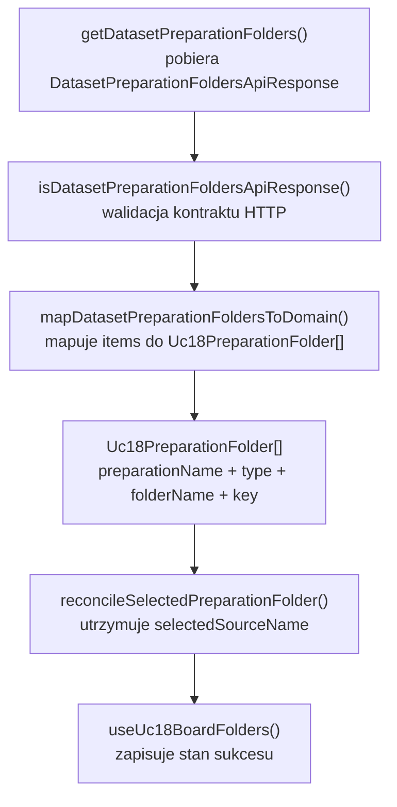
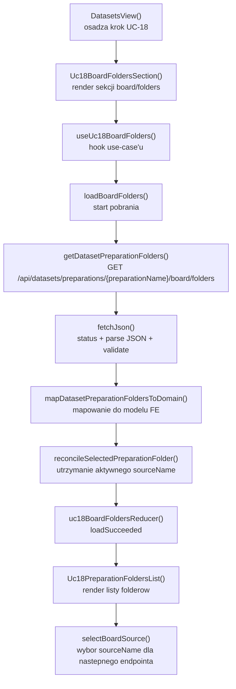

# UC-18-FE - Plan implementacyjny dla `GET /api/datasets/preparations/{preparationName}/board/folders`

## 1) Przeznaczenie endpointa
- Endpoint `GET /api/datasets/preparations/{preparationName}/board/folders` zwraca liste logicznych zrodel typu `board` dla wybranego preparation.
- Z perspektywy `FE` ten endpoint:
  - zasila pierwszy ekran przegladania w `UC-18`,
  - pokazuje tylko nazwy folderow zrodlowych `board`,
  - nie laduje jeszcze listy plansz,
  - nie laduje obrazow `corrected-board.png`,
  - nie usuwa zadnych danych,
  - nie odczytuje bezposrednio struktury katalogow runtime.
- Wynik endpointa jest wejsciem do kolejnego kroku:
  - wyboru `sourceName`,
  - a potem dopiero `GET /api/datasets/preparations/{preparationName}/board/{sourceName}/files`.
- `Backend` pozostaje jedynym zrodlem prawdy dla:
  - istnienia preparation,
  - listy zrodel `board`,
  - kolejnosci elementow zwracanych z `folders.json`,
  - lacznej liczby rekordow.

## 2) Zakres planu
- Plan dotyczy wyłącznie `FE`.
- Plan nie projektuje implementacji `BE` ani `ML`; opiera sie tylko na:
  - kontrakcie publicznym,
  - wymaganiach `UC-18`,
  - kodzie obecnym w `src/Frontend`.
- Nie nalezy sugerowac sie biezaca implementacja `BE` i `ML` poza publicznym API i ustalonym kontraktem historyjki.
- Plan uwzglednia warstwowosc MVVC i obecny kierunek `feature-based`.
- Plan obejmuje tez minimalny kontekst upstream / downstream, bo ten endpoint nie dziala w izolacji:
  - upstream: wybor `preparationName`,
  - downstream: wybor `sourceName` do dalszego listowania plansz.

## 3) Miejsce endpointa w docelowym workflow
1. Uzytkownik ma juz istniejace preparation utworzone w `UC-17`.
2. `FE` zna `preparationName` wybrane przez uzytkownika.
3. `FE` wywoluje `GET /api/datasets/preparations/{preparationName}/board/folders`.
4. `BE` zwraca liste nazw folderow zrodlowych typu `board`.
5. `FE` renderuje tylko te nazwy i licznik.
6. Uzytkownik wybiera jedno `sourceName`.
7. Dopiero wtedy `FE` moze przejsc do `GET /api/datasets/preparations/{preparationName}/board/{sourceName}/files`.

## 4) Główne zalozenia architektoniczne
- Globalna architektura FE jest nadal formalnie `TBD`, ale aktualny kod jest praktycznie `feature-based` i warstwowy:
  - `src/app/*`
  - `src/features/*`
  - `src/api/*`
  - `src/types/*`
- Dla tego endpointa nalezy utrzymac podzial:
  - `Model`: kontrakt transportowy, lokalny model folderu i czyste reguly reconcile,
  - `View`: panel listy folderow, stany `loading/error/empty/success`,
  - `ViewController`: pobranie danych, abort, retry, reset aktywnego wyboru,
  - `Infrastructure`: klient HTTP, walidacja JSON, mapowanie bledow transportowych.
- `FE` nie moze:
  - skanowac katalogow,
  - zgadywac nazw folderow,
  - budowac listy `board` z innych endpointow,
  - komunikowac sie bezposrednio z `ML`.
- Jesli trzeba tworzyc nowa usluge, najpierw nalezy sprawdzic, czy istnieje juz odpowiedni modul.
- W tym repo istnieje juz odpowiedni modul infrastrukturalny:
  - `src/Frontend/src/api/datasetPreparations.ts`
- Wniosek:
  - nie tworzyc nowego pliku `datasetPreparationBoardFolders.ts`,
  - tylko rozszerzyc `datasetPreparations.ts` o generyczny klient folders.

## 5) Regula generycznosci dla tej historyjki
- Chociaz ten dokument dotyczy endpointa `board/folders`, implementacja warstwy `Infrastructure` nie powinna byc hardcoded tylko pod `board`.
- Nalezy dodac generyczna funkcje:
  - `getDatasetPreparationFolders(apiBaseUrl, preparationName, folderType, accessToken, signal)`
- Dzieki temu ten sam klient bedzie mogl zostac reuse'owany dla:
  - `GET /api/datasets/preparations/{preparationName}/board/folders`
  - `GET /api/datasets/preparations/{preparationName}/digit/folders`
- Warstwa `ViewController` dla tego dokumentu pozostaje endpoint-specific:
  - `loadBoardFolders(preparationName)`
- Warstwa `Model` moze miec lokalne zawężenie domenowe:
  - wspiera `board | digit`,
  - ale dla tego konkretnego use-case'u oczekuje finalnie `board`.

## 6) Model API w komunikacji z BE

### 6.1 Request `FE -> BE`
- Metoda i sciezka:
  - `GET /api/datasets/preparations/{preparationName}/board/folders`
- Path params:
  - `preparationName: string`
- Query params:
  - brak
- Body:
  - brak
- Naglowki:
  - `Accept: application/json`
  - `Authorization: Bearer <token>` gdy aktywna jest sesja administratora

### 6.2 Model wejsciowy
- Brak payloadu JSON.
- Jedynym wymaganym wejsciem jest poprawny `preparationName`.

### 6.3 Model wyjsciowy sukcesu
- Oczekiwany status HTTP:
  - `200 OK`
- Nowy / rozszerzany kontrakt transportowy w `src/Frontend/src/types/api.ts`:
  - `DatasetPreparationFoldersApiResponse`
    - `preparationName: string`
    - `type: string`
    - `items: string[]`
    - `totalCount: number`

Przyklad:

```json
{
  "preparationName": "preparation-001",
  "type": "board",
  "items": [
    "v1_training",
    "v2_training"
  ],
  "totalCount": 2
}
```

### 6.4 Model bledu
- `ErrorApiResponse`
  - `errorType: string`
  - `message: string`

### 6.5 Reguly kontraktowe
- Nie zmieniac nazw:
  - `DatasetPreparationFoldersApiResponse`
  - `ErrorApiResponse`
- Dane transportowe zostaja w `camelCase`.
- `type` w `src/types/api.ts` pozostaje `string`, zgodnie z dotychczasowym stylem kontraktow FE.
- Zawężenie do `board | digit` ma byc lokalne i domenowe, nie transportowe.
- Dla wywolania `/board/folders` odpowiedz z `type != "board"` nalezy traktowac jako blad kontraktu, a nie jako czesciowy sukces.

## 7) Zachowanie z kazdej warstwy MVVC

### Model
- Obejmuje:
  - kontrakt `DatasetPreparationFoldersApiResponse`,
  - lokalny typ `Uc18PreparationFolderType`,
  - lokalny model folderu do renderowania,
  - logike utrzymania aktywnego `sourceName` po odswiezeniu.
- Nie zna Reacta, `fetch` ani statusow HTTP.

### View
- Obejmuje:
  - panel wyboru zrodel `board`,
  - licznik rekordow,
  - przycisk `Odswiez liste zrodel`,
  - stany `loading/error/empty/success`,
  - akcje wyboru konkretnego `sourceName`.
- Nie tworzy URL-i endpointow.
- Nie zawiera walidacji transportu.

### ViewController
- Obejmuje:
  - `loadBoardFolders(preparationName)`,
  - `retryLoadBoardFolders()`,
  - `selectBoardSource(sourceName)`,
  - `AbortController`,
  - reakcje na `401`,
  - reset wyboru, gdy `sourceName` zniknie po odswiezeniu,
  - lekkie logowanie diagnostyczne.

### Infrastructure
- Obejmuje:
  - `getDatasetPreparationFolders()`,
  - guard odpowiedzi JSON,
  - `buildAuthHeaders()`,
  - `fetchJson()`,
  - mapowanie bledow HTTP na `DatasetPreparationsApiError`.

## 8) Co juz istnieje i nalezy reuse'owac
- Istnieje wspolny klient preparation:
  - `src/Frontend/src/api/datasetPreparations.ts`
- Istnieje wspolny helper HTTP:
  - `src/Frontend/src/api/shared/fetchJson.ts`
- Istnieja juz kontrakty preparation:
  - `src/Frontend/src/types/api.ts`
- Istnieje juz wzorzec hookow z:
  - `AbortController`,
  - loadable state,
  - lekkim logowaniem,
  - obsluga `401`,
  - zachowaniem poprzednich danych podczas `loading`.
- Ten wzorzec widac szczegolnie w:
  - `src/Frontend/src/features/uc17/application/useUc17RawCandidates.ts`
  - `src/Frontend/src/features/uc17/application/useUc17DatasetPreparations.ts`

Wniosek:
- reuse'owac `datasetPreparations.ts`,
- reuse'owac `fetchJson()`,
- reuse'owac schemat logowania i abortow,
- nie importowac slepo hooka `useUc17DatasetPreparations()` do `UC-18`, bo to zly poziom odpowiedzialnosci i zla nazwa use-case'u.

## 9) Pliki per warstwa i odpowiedzialnosci

### 9.1 View
- `[ADD]` `src/Frontend/src/features/uc18/api/index.ts`
  - publiczny entry point feature'a `UC-18`.
- `[ADD]` `src/Frontend/src/features/uc18/api/Uc18BoardFoldersSection.tsx`
  - glowny widok endpointa `board/folders`;
  - renderuje stany `loading/error/empty/success`;
  - pokazuje liste nazw folderow i aktywny wybor.
- `[ADD]` `src/Frontend/src/features/uc18/api/Uc18PreparationFoldersList.tsx`
  - czysto prezentacyjna lista `sourceName`;
  - nie zawiera `fetch`;
  - nie zna `apiBaseUrl`.
- `[REUSE / INTEGRACJA UC-18]` `src/Frontend/src/app/views/DatasetsView.tsx`
  - osadza nowy krok `UC-18` w workflow datasetowym;
  - przekazuje `apiBaseUrl`, `accessToken`, `onUnauthorized`.
- `[REUSE / INTEGRACJA UC-18]` `src/Frontend/src/app/state.ts`
  - rozszerza `DatasetsStep` o `uc18`.
- `[REUSE]` `src/Frontend/src/styles/datasets.css`
  - style panelu `UC-18`, listy folderow, aktywnego rekordu i bannerow.

### 9.2 ViewController
- `[ADD]` `src/Frontend/src/features/uc18/application/useUc18BoardFolders.ts`
  - glowny hook use-case'u dla tego endpointa;
  - pobiera foldery `board`,
  - utrzymuje stan, retry, abort i aktywne `sourceName`.
- `[ADD]` `src/Frontend/src/features/uc18/application/uc18BoardFoldersReducer.ts`
  - reduktor czystego stanu widoku.
- `[ADD]` `src/Frontend/src/features/uc18/application/uc18BoardFoldersTypes.ts`
  - typy stanu, akcji i interfejs publiczny hooka.
- `[CONTEXT ONLY]` `src/Frontend/src/features/uc17/application/useUc17DatasetPreparations.ts`
  - wzorzec loadable-state i `401`;
  - nie powinien byc miejscem implementacji endpointa `UC-18`.

### 9.3 Model
- `[REUSE + EXTEND]` `src/Frontend/src/types/api.ts`
  - dodac `DatasetPreparationFoldersApiResponse`.
- `[ADD]` `src/Frontend/src/features/uc18/domain/uc18PreparationFolder.ts`
  - lokalny model domenowy folderu;
  - lokalny typ `Uc18PreparationFolderType = "board" | "digit"`.
- `[ADD]` `src/Frontend/src/features/uc18/domain/mapDatasetPreparationFoldersToDomain.ts`
  - mapuje transport do modelu lokalnego;
  - odrzuca niespojny `type`.
- `[ADD]` `src/Frontend/src/features/uc18/domain/reconcileSelectedPreparationFolder.ts`
  - utrzymuje aktywny `sourceName` tylko, gdy nadal istnieje po odswiezeniu.
- `[ADD]` `src/Frontend/src/features/uc18/domain/toUc18PreparationFolderKey.ts`
  - buduje stabilny klucz np. `board:v1_training`.

### 9.4 Infrastructure
- `[REUSE + EXTEND]` `src/Frontend/src/api/datasetPreparations.ts`
  - dodac:
    - guard `isDatasetPreparationFoldersApiResponse()`,
    - generyczna funkcje `getDatasetPreparationFolders(...)`.
- `[REUSE]` `src/Frontend/src/api/shared/fetchJson.ts`
  - wspolny mechanizm `fetch + parse + validate + errorFactory`.

### 9.5 Pliki kontekstowe, ktorych nie rozwijac w tym endpointcie
- `[REUSE / UPSTREAM]` `src/Frontend/src/api/datasetPreparations.ts`
  - istnieje juz jako klient create/list/details dla preparation;
  - nowa funkcja folders powinna tam dopasowac sie do istniejacego modulu.
- `[CONTEXT ONLY]` `src/Frontend/src/features/uc17/api/Uc17RawCandidatesSection.tsx`
  - pokazuje istniejące preparation w `UC-17`;
  - nie powinien zostac przepelniony logika `UC-18`.
- `[LEGACY / NIE ROZWIJAC]` `src/Frontend/src/components/Uc12DatasetPreparationSection.tsx`
  - dotyczy starego workflow `UC-12`;
  - nie jest wzorcem dla nowego flow `UC-17 -> UC-18 -> UC-19`.

## 10) Co nalezy dodac lub dopracowac
- Dodac brakujacy kontrakt transportowy `DatasetPreparationFoldersApiResponse`.
- Rozszerzyc `datasetPreparations.ts` o generyczny klient folders zamiast tworzyc nowy plik API.
- Dodac nowy feature `src/features/uc18/*` zamiast dopisywac cala logike do `uc17`.
- Utrzymac osobny reducer i hook dla `UC-18`, bo stan tego ekranu jest inny niz:
  - create preparation,
  - list details,
  - raw candidates.
- Nie sortowac i nie deduplikowac listy folderow po stronie `FE`, o ile historia nie wymaga inaczej.
- Zachowac kolejnosc zwrocona przez `BE`, bo powinna odpowiadac `folders.json`.

## 11) Glowne funkcje
- `getDatasetPreparationFolders()`
- `isDatasetPreparationFoldersApiResponse()`
- `useUc18BoardFolders()`
- `loadBoardFolders()`
- `retryLoadBoardFolders()`
- `selectBoardSource()`
- `uc18BoardFoldersReducer()`
- `mapDatasetPreparationFoldersToDomain()`
- `reconcileSelectedPreparationFolder()`
- `toUc18PreparationFolderKey()`
- `Uc18BoardFoldersSection()`
- `Uc18PreparationFoldersList()`
- `fetchJson()`

## 12) Zachowanie View
- Po otrzymaniu poprawnego `preparationName` widok uruchamia pobranie listy folderow `board`.
- Widok pokazuje:
  - nazwe wybranego preparation,
  - licznik `totalCount`,
  - liste `sourceName`,
  - stan aktywnego wyboru,
  - przycisk odswiezenia.
- Widok nie powinien:
  - pokazywac miniaturek plansz,
  - pobierac `board/{sourceName}/files`,
  - pobierac `image`,
  - wykonywac delete.
- Po kliknieciu konkretnego `sourceName` widok tylko aktualizuje lokalny wybor i przygotowuje dane dla kolejnego endpointa.

## 13) Zachowanie ViewController
- Hook powinien pobierac dane automatycznie po zmianie `preparationName`.
- Jesli uzytkownik zmieni `preparationName` w trakcie requestu:
  - poprzedni request trzeba anulowac,
  - nowy request staje sie jedynym aktywnym.
- W stanie `loading` nalezy zachowac poprzednia liste tylko dla tego samego `preparationName`.
- Po sukcesie:
  - zapisac nowa liste,
  - wyczyscic blad,
  - zrobic reconcile aktywnego `sourceName`.
- Jesli aktywny `sourceName` zniknal po odswiezeniu:
  - wyczyscic go,
  - zalogowac lekkie `warn`.
- Przy `401`:
  - wywolac `onUnauthorized`.

## 14) Zachowanie Model
- Lokalny model domenowy nie powinien byc zwykla lista `string[]`, jesli od razu wiadomo, ze kolejny krok potrzebuje stabilnych kluczy i typu.
- Preferowany lokalny model:
  - `preparationName: string`
  - `type: "board" | "digit"`
  - `folderName: string`
  - `key: string`
- Mapowanie powinno:
  - zachowac kolejnosc z `items`,
  - odrzucic nieobslugiwany `type`,
  - nie zmieniac nazw folderow,
  - nie obcinac wartosci,
  - nie normalizowac wielkosci liter.

## 15) Zachowanie Infrastructure
- Klient powinien URL-encode'owac `preparationName`.
- Funkcja ma byc generyczna po `folderType`, ale dla tego endpointa wywolywana z `"board"`.
- Oczekiwany status:
  - `200`
- Guard odpowiedzi ma sprawdzac:
  - `preparationName` jako `string`,
  - `type` jako `string`,
  - `items` jako `string[]`,
  - `totalCount` jako `number`.
- Bledny ksztalt JSON jest bledem technicznym, a nie pustym stanem.

## 16) Specyficzna logika i pseudokod

### 16.1 Generyczny klient folders

```text
getDatasetPreparationFolders(apiBaseUrl, preparationName, folderType, accessToken, signal):
  encodedPreparationName = encodeURIComponent(preparationName)

  return fetchJson({
    url: `${apiBaseUrl}/datasets/preparations/${encodedPreparationName}/${folderType}/folders`,
    method: GET,
    expectedStatus: 200,
    validateResponse: isDatasetPreparationFoldersApiResponse
  })
```

### 16.2 Mapowanie odpowiedzi do modelu domenowego

```text
mapDatasetPreparationFoldersToDomain(response, expectedType):
  if response.type != expectedType:
    throw contract error

  return response.items.map(folderName => ({
    preparationName: response.preparationName,
    type: expectedType,
    folderName,
    key: `${expectedType}:${folderName}`
  }))
```

### 16.3 Reconcile aktywnego zrodla po odswiezeniu

```text
reconcileSelectedPreparationFolder(previousSelectedSourceName, folders):
  if previousSelectedSourceName is null:
    return { selectedSourceName: null, wasRemoved: false }

  stillExists = folders.some(folder => folder.folderName == previousSelectedSourceName)

  if stillExists:
    return { selectedSourceName: previousSelectedSourceName, wasRemoved: false }

  return { selectedSourceName: null, wasRemoved: true }
```

### 16.4 Orkiestracja hooka

```text
loadBoardFolders(preparationName):
  if preparationName.trim() is empty:
    set state.error = "Wybierz poprawne preparation."
    do not call backend
    return

  abort previous request
  set state = loading

  response = getDatasetPreparationFolders(apiBaseUrl, preparationName, "board", accessToken, signal)
  mappedFolders = mapDatasetPreparationFoldersToDomain(response, "board")
  reconciled = reconcileSelectedPreparationFolder(previousSelectedSourceName, mappedFolders)

  if reconciled.wasRemoved:
    log warn

  set state = success(mappedFolders, reconciled.selectedSourceName)
```

## 17) Wyjatki, fallbacki i zachowanie bledowe

### 17.1 Statusy HTTP
- `200 OK`
  - lista poprawna;
  - moze byc pusta.
- `401 Unauthorized`
  - sesja administratora wygasla albo token jest niepoprawny;
  - `FE` wywoluje `onUnauthorized`.
- `403 Forbidden`
  - uzytkownik nie ma dostepu do kroku administracyjnego;
  - `FE` pokazuje blad bez retry automatycznego.
- `404 Not Found`
  - preparation nie istnieje albo nie jest juz dostepne;
  - `FE` traktuje to jako stale / nieaktualne wejscie.
- `500 Internal Server Error`
  - blad backendu.
- `502`, `503`, `504`
  - blad infrastrukturalny na sciezce przegladarka -> nginx -> backend.

### 17.2 Bledy kontraktu
- Jesli odpowiedz `200` ma zly ksztalt:
  - traktowac to jako blad techniczny,
  - nie zamieniac tego na pusta liste,
  - nie zgadywac brakujacych pol.
- Jesli endpoint `/board/folders` zwroci `type = "digit"` albo inny typ:
  - traktowac to jako blad kontraktowy,
  - nie renderowac listy.

### 17.3 Fallbacki dopuszczalne
- Zachowanie poprzedniej listy podczas kolejnego `loading` dla tego samego `preparationName`.
- Zachowanie poprzedniej listy przy chwilowym `500`, `502`, `503`, `504`, jesli nie zmienil sie `preparationName`.
- Wyczyszczenie tylko aktywnego `sourceName`, jesli zniknal po odswiezeniu.

### 17.4 Fallbacki niedopuszczalne
- Zgadywanie listy folderow na podstawie `sources` z `GET /api/datasets/preparations/{preparationName}`.
- Samodzielne budowanie listy po nazwach katalogow po stronie FE.
- Sortowanie listy alfabetycznie "dla wygody", jesli backend zwrocil inna kolejnosc.
- Bezposrednie przejscie `FE -> ML`.
- Automatyczne pobieranie `board/{sourceName}/files` dla wszystkich pozycji po sukcesie `board/folders`.

### 17.5 Zachowanie UI
- `idle`
  - stan przed pierwszym pobraniem lub przy braku `preparationName`.
- `loading`
  - blokuje przycisk odswiezenia;
  - moze zachowac poprzednia liste.
- `error`
  - pokazuje banner z bledem;
  - przy `401` dopisuje komunikat o ponownym logowaniu;
  - przy `404` powinien zasugerowac ponowny wybor preparation.
- `success + empty`
  - pokazuje informacje, ze preparation nie ma jeszcze zadnych zrodel `board`.
- `success + data`
  - lista jest interaktywna i pozwala wybrac jedno `sourceName`.

## 18) Zachowanie wyjatkowe i fallbacki domenowe
- Jesli `preparationName` jest pusty lub sklada sie z bialych znakow:
  - nie wysylac requestu;
  - pokazac stan oczekiwania na wybor preparation.
- Jesli uzytkownik szybko zmienia selection preparation:
  - anulowac poprzednie requesty;
  - nie dopuscic do nadpisania swiezszego stanu przez starsza odpowiedz.
- Jesli backend zwroci pusta liste:
  - traktowac to jako poprawny wynik;
  - nie pokazywac tego jako blad.
- Jesli preparation zostalo usuniete pomiedzy odczytami:
  - `404` nie powinno zostawic aktywnego `sourceName`;
  - nalezy wyczyscic lokalny wybor zrodla dla tego ekranu.

## 19) Logging i diagnostyka FE
- Logi maja pomagac w diagnozie, ale nie moga spamowac ani logowac duzych payloadow.

### `console.info`
- start ladowania folderow `board`,
- reczne odswiezenie listy,
- sukces pobrania listy wraz z `totalCount`.

### `console.warn`
- `401` i wyczyszczenie sesji,
- usuniecie aktywnego `sourceName` po odswiezeniu,
- `404` dla nieaktualnego `preparationName`.

### `console.error`
- `5xx`,
- blad walidacji ksztaltu odpowiedzi,
- niespojny `type` odpowiedzi,
- nieprzetwarzalna odpowiedz backendu.

### Guardraile logowania
- nie logowac tokena,
- nie logowac pelnego response backendu,
- nie logowac calej listy `items`,
- logowac tylko lekkie metadane:
  - `preparationName`,
  - `type`,
  - `httpStatus`,
  - `errorType`,
  - `totalCount`,
  - `removedSelection`.

## 20) Mermaid flowchart - flow modeli



## 21) Mermaid flowchart - logika aplikacji z funkcjami



## 22) Opis przeplywu w obrebie BE potrzebny frontendowi
Ta sekcja opisuje tylko kontraktowe minimum potrzebne `FE`.

1. `FE` wysyla `GET /api/datasets/preparations/{preparationName}/board/folders`.
2. `BE` weryfikuje autoryzacje.
3. `BE` rozpoznaje preparation na podstawie `preparationName`.
4. `BE` odczytuje logiczna liste zrodel `board` dla tego preparation.
5. `BE` zwraca:
   - `preparationName`,
   - `type = "board"`,
   - `items`,
   - `totalCount`.
6. `BE` nie wywoluje `ML` dla tego endpointa.
7. `FE` nie zaklada nic o fizycznym layoutcie katalogow poza semantyka kontraktu.

## 23) Workflow GitHub i runtime
- Ten endpoint nie wymaga nowej zmiennej srodowiskowej po stronie FE.
- Obowiazujacy workflow FE w `.github/workflows/frontend-cd.yml` juz:
  - buduje `src/Frontend`,
  - ustawia `VITE_API_BASE_URL="${FE_VITE_API_BASE_URL:-/api}"`,
  - pakuje `dist`,
  - publikuje statyczny build.
- Lokalnie:
  - `FE` powinien dzialac na stalym `/api` lub lokalnym `VITE_API_BASE_URL`,
  - nie dotykamy z poziomu FE zadnych `appsettings`.
- Produkcyjnie:
  - workflow backendowy moze podmieniac produkcyjne `appsettings`,
  - ten plan FE nie moze od tego zalezec inaczej niz przez publiczny adres `/api`.
- Guardrail:
  - nie hardcodowac produkcyjnych URL-i w komponentach,
  - nie dodawac nowego env-a, jesli istniejący `VITE_API_BASE_URL` wystarcza,
  - nie traktowac workflow jako zrodla prawdy dla listy folderow.

## 24) Kolejnosc implementacji kodu dla historyjki
1. Zweryfikowac obecne kontrakty w `src/Frontend/src/types/api.ts`.
2. Dodac `DatasetPreparationFoldersApiResponse` bez zmiany istniejacych nazw typow.
3. Rozszerzyc `src/Frontend/src/api/datasetPreparations.ts` o:
   - guard odpowiedzi,
   - generyczne `getDatasetPreparationFolders(...)`.
4. Dodac model domenowy `UC-18` i czyste helpery mapowania / reconcile.
5. Dodac typy stanu i reducer `UC-18`.
6. Dodac hook `useUc18BoardFolders()`.
7. Dodac widoki `Uc18BoardFoldersSection.tsx` i `Uc18PreparationFoldersList.tsx`.
8. Zintegrowac nowy krok z `DatasetsView.tsx` i `app/state.ts`, jesli shell `UC-18` jest wdrazany w tej samej iteracji.
9. Dopracowac lekkie logowanie diagnostyczne.
10. Uruchomic kontrole jakosci FE.

## 25) Guardraile implementacyjne
- Nie tworzyc nowego klienta HTTP poza `datasetPreparations.ts`.
- Nie duplikowac `buildAuthHeaders()`.
- Nie przenosic `fetch` do komponentow React.
- Nie importowac logiki `UC-18` do legacy `UC-12`.
- Nie traktowac `items: []` jako bledu.
- Nie zgadywac `sourceName` z innych danych.
- Nie sortowac odpowiedzi po stronie FE bez twardego wymagania.
- Nie pobierac wszystkich kolejnych endpointow hurtowo po sukcesie `board/folders`.
- Nie dodawac ciezkiego logowania ani `console.log` na kazdy klik elementu listy.

## 26) Zaleznosci pomiedzy historyjkami

### Wejsciowe
- `UC-13`
  - dostarcza sesje administracyjna i token.
- `UC-17 POST /api/datasets/preparations`
  - tworzy preparation, na ktorym pracuje `UC-18`.
- `UC-17 GET /api/datasets/preparations`
  - daje liste preparation do wyboru.
- `UC-17 GET /api/datasets/preparations/{preparationName}`
  - daje kontekst statusu i szczegolow preparation, jesli ekran `UC-18` chce go wyswietlic obok.

### Rownolegle / sasiednie
- `UC-18 GET /api/datasets/preparations/{preparationName}/digit/folders`
  - powinien reuse'owac ten sam klient infrastrukturalny i ten sam model typu folderow.

### Wyjsciowe
- `UC-18 GET /api/datasets/preparations/{preparationName}/board/{sourceName}/files`
  - konsumuje wybrane `sourceName`.
- `UC-18 GET /api/datasets/preparations/{preparationName}/board/{sourceName}/files/{boardFolderName}/image`
  - bedzie downstream po wyborze planszy.
- `UC-18 DELETE /api/datasets/preparations/{preparationName}/board/{sourceName}/files/{boardFolderName}`
  - zalezy od poprawnego wejscia w source i liste plansz.
- `UC-19`
  - korzysta z oczyszczonego preparation.

## 27) Inne istotne reguly
- Trzymac sie istniejacych kontraktow i nazw typow z poprzednich historyjek.
- Jesli nowa abstrakcja nie daje realnego reuse, nie tworzyc jej na zapas.
- Generycznosc powinna dotyczyc przede wszystkim:
  - klienta folders w `datasetPreparations.ts`,
  - lokalnego typu `board | digit`,
  - helpera reconcile.
- `createdAtUtc`, statusy preparation i inne detale preparation nie sa odpowiedzialnoscia tego endpointa.
- `FE` ma renderowac tylko publiczna semantyke API, nie layout runtime.
- `FE` ma pozostac cienki:
  - backend zwraca liste,
  - frontend ja prezentuje,
  - frontend nie rekonstruuje logiki plikowej.

## 28) Plan weryfikacji minimum
- `npm run check`
- `npm run build`
- scenariusz happy path:
  - poprawny `preparationName`,
  - backend zwraca `type = "board"`,
  - lista folderow renderuje sie poprawnie,
  - wybor `sourceName` dziala.
- scenariusz pustej listy:
  - `200 OK`,
  - UI pokazuje pusty stan bez bledu.
- scenariusz `401`:
  - `onUnauthorized` zostaje wywolane.
- scenariusz `404`:
  - UI pokazuje blad stalego / niedostepnego preparation,
  - aktywne `sourceName` zostaje wyczyszczone.
- scenariusz niepoprawnego `type` w response:
  - odpowiedz jest traktowana jako blad kontraktowy.
- scenariusz odswiezenia:
  - jezeli wybrane `sourceName` zniknie z listy, zostaje wyczyszczone.

## 29) Podsumowanie decyzji
- Dla `GET /api/datasets/preparations/{preparationName}/board/folders` nalezy dodac nowy feature `UC-18` po stronie `View`, `ViewController` i `Model`, ale warstwe `Infrastructure` trzeba rozszerzyc w istniejacym `datasetPreparations.ts`.
- Najwazniejsze granice odpowiedzialnosci:
  - `Infrastructure` pobiera i waliduje kontrakt,
  - `ViewController` steruje requestem i stanem,
  - `Model` mapuje dane i utrzymuje selection,
  - `View` tylko renderuje i deleguje akcje.
- Najwazniejsze guardraile:
  - brak duplikacji klienta API,
  - brak mieszania z `UC-12`,
  - brak zgadywania danych po stronie FE,
  - brak eager-loadu plansz i obrazow,
  - brak ciezkiego logowania.
- Najwazniejsza decyzja pod reuse:
  - klient folders ma byc od razu generyczny dla `board` i `digit`,
  - ale hook i widok w tym dokumencie pozostaja konkretne dla `board/folders`.
