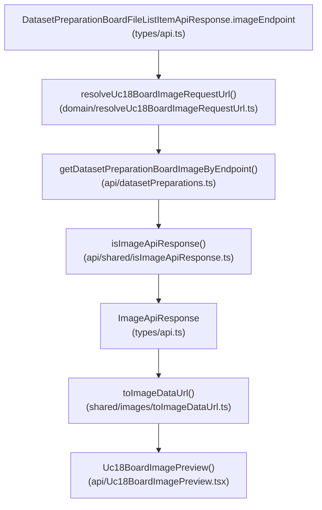
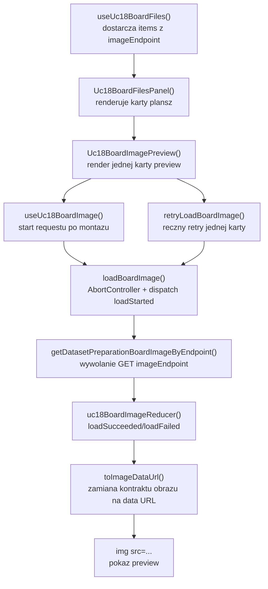

# UC-18-FE - Plan implementacyjny dla `GET /api/datasets/preparations/{preparationName}/board/{sourceName}/files/{boardFolderName}/image`

## 1) Przeznaczenie endpointa
- Endpoint zwraca obraz preview pojedynczej logicznej planszy `board` dla juz wybranego:
  - `preparationName`,
  - `sourceName`,
  - `boardFolderName`.
- Z perspektywy `FE` endpoint:
  - uzupelnia placeholder preview w juz istniejacym kroku listy plansz,
  - dostarcza wizualizacje `corrected-board.png`,
  - nie sluzy do pobrania listy plansz,
  - nie sluzy do wyboru `preparation` ani `source`,
  - nie wykonuje usuwania danych,
  - nie daje prawa do zgadywania URL-a lub struktury plikow po stronie klienta.
- `Backend` pozostaje jedynym zrodlem prawdy dla:
  - istnienia wskazanego `boardFolderName`,
  - tego, jaki obraz nalezy zwrocic jako preview,
  - finalnego kontraktu `ImageApiResponse`,
  - dostarczonego wczesniej `imageEndpoint`.

## 2) Zakres planu
- Plan dotyczy tylko `FE`.
- Plan nie projektuje implementacji `BE` ani `ML`; opiera sie tylko na:
  - publicznym kontrakcie HTTP,
  - wymaganiach `UC-18`,
  - aktualnym stanie `src/Frontend`,
  - juz wdrozonych historyjkach `UC-17` i czesci `UC-18`.
- Nie nalezy sugerowac sie biezaca implementacja `BE` i `ML` poza ustalonym kontraktem publicznym.
- Plan musi pozostac warstwowy i zgodny z praktycznym ukladem:
  - `src/features/*`
  - `src/api/*`
  - `src/shared/*`
  - `src/types/*`
  - `src/app/*`

## 3) Miejsce endpointa w workflow `UC-18`
1. Uzytkownik wybiera `preparationName`.
2. `FE` pobiera `board/folders`.
3. Uzytkownik wybiera `sourceName`.
4. `FE` pobiera `board/{sourceName}/files?page={page}&pageSize={pageSize}`.
5. `BE` zwraca dla kazdej planszy:
   - `boardFolderName`
   - `imageEndpoint`
6. `FE` renderuje liste plansz dla aktualnej strony.
7. Dla kazdej aktualnie renderowanej planszy `FE` pobiera obraz przez `imageEndpoint`.
8. Kazda karta planszy pokazuje:
   - nazwe folderu,
   - stan ladowania preview,
   - obraz albo lokalny blad tylko dla tej jednej planszy.
9. Ewentualny blad jednego preview nie moze unieruchomic calej listy `board/files`.

## 4) Co juz istnieje i czego nalezy uzyc
- Istnieje shell `UC-18` i lista plansz:
  - `src/Frontend/src/features/uc18/api/Uc18BoardFoldersSection.tsx`
  - `src/Frontend/src/features/uc18/api/Uc18BoardFilesPanel.tsx`
- Istnieje pobieranie listy plansz:
  - `src/Frontend/src/features/uc18/application/useUc18BoardFiles.ts`
  - `src/Frontend/src/features/uc18/application/uc18BoardFilesReducer.ts`
  - `src/Frontend/src/features/uc18/application/uc18BoardFilesTypes.ts`
- Istnieje model listy plansz z `imageEndpoint`:
  - `src/Frontend/src/features/uc18/domain/uc18BoardFile.ts`
  - `src/Frontend/src/features/uc18/domain/mapDatasetPreparationBoardFilesToDomain.ts`
- Istnieje klient preparation:
  - `src/Frontend/src/api/datasetPreparations.ts`
- Istnieje wspolny helper HTTP:
  - `src/Frontend/src/api/shared/fetchJson.ts`
- Istnieje repozytoryjny kontrakt obrazu:
  - `src/Frontend/src/types/api.ts`
  - `ImageApiResponse`
- Istnieje helper zamiany kontraktu obrazu na `img src`:
  - `src/Frontend/src/shared/images/toImageDataUrl.ts`
- Istnieja juz co najmniej dwa lokalne guardy `ImageApiResponse` w innych modulach API:
  - `src/Frontend/src/api/examples.ts`
  - `src/Frontend/src/api/sudokuOverlayCells.ts`

Wniosek:
- nie tworzyc nowego rownoleglego formatu obrazu,
- nie tworzyc nowego top-level kroku `UC-18`,
- nie budowac URL-a obrazka z `preparationName/sourceName/boardFolderName` w `View`,
- wykorzystac upstream `imageEndpoint` z listy plansz,
- rozwazyc wydzielenie wspolnego guarda `isImageApiResponse()` zamiast dodawania trzeciej kopii tej samej funkcji.

## 5) Strategia reuse i generycznosci
- Najpierw trzeba sprawdzic, czy dana usluga juz istnieje.
- Dla tego endpointa istnieja juz dwa istotne reuse points:
  - transport obrazu `ImageApiResponse`,
  - helper `toImageDataUrl(image)`.
- Najwazniejsza decyzja reuse:
  - preview obrazu ma korzystac z istniejacego `imageEndpoint`,
  - nie wolno odtwarzac URL-a na podstawie nazw folderow.
- Poniewaz w repo sa juz powielone guardy `ImageApiResponse`, wejscie trzeciego klienta obrazu uzasadnia dodanie wspolnego helpera:
  - `src/Frontend/src/api/shared/isImageApiResponse.ts`
- Zakres generycznosci powinien byc umiarkowany:
  - wspolny guard obrazu i wspolny `fetchJson()` tak,
  - nowy feature-local hook `useUc18BoardImage()` tak,
  - globalny, wspoldzielony cache obrazow dla calej aplikacji nie jest teraz konieczny.
- Nie importowac typow stanu obrazu z `src/app/state.ts` do feature'a `uc18`, bo to psuje kierunek zaleznosci `feature -> app`.
- Stan preview obrazu ma pozostac lokalny dla `UC-18`, ale kontrakt obrazu i helper data-url maja byc wspoldzielone.

## 6) Model API w komunikacji z BE

### 6.1 Request `FE -> BE`
- Metoda i sciezka:
  - `GET /api/datasets/preparations/{preparationName}/board/{sourceName}/files/{boardFolderName}/image`
- Path params:
  - `preparationName: string`
  - `sourceName: string`
  - `boardFolderName: string`
- Query params:
  - brak
- Body:
  - brak
- Naglowki:
  - `Accept: application/json`
  - `Authorization: Bearer <token>` gdy sesja administratora jest aktywna

### 6.2 Model wejscia po stronie FE
- Formalnie endpoint przyjmuje tylko path params.
- Praktycznie `FE` nie powinien ich ponownie sklejac do URL-a w `View`.
- Preferred input dla warstwy `ViewController`:
  - `imageEndpoint: string`
  - `preparationName: string`
  - `sourceName: string`
  - `boardFolderName: string`
- `imageEndpoint` pochodzi z kontraktu `DatasetPreparationBoardFileListItemApiResponse`.
- Pozostale pola sa potrzebne glownie do:
  - kluczy React,
  - alt tekstu,
  - lekkiego logowania,
  - stabilnej identyfikacji karty.

### 6.3 Model wyjsciowy sukcesu
- Oczekiwany status:
  - `200 OK`
- Nalezy reuse'owac juz istniejacy kontrakt:
  - `ImageApiResponse`
    - `mimeType: string`
    - `base64: string`

Przyklad:

```json
{
  "mimeType": "image/png",
  "base64": "<base64>"
}
```

### 6.4 Model bledu
- Reuse:
  - `ErrorApiResponse`
    - `errorType: string`
    - `message: string`

### 6.5 Reguly kontraktowe
- Nie tworzyc nowego typu `DatasetPreparationBoardImageApiResponse`, jesli odpowiedz ma taki sam ksztalt jak inne obrazy w repo.
- Nie zmieniac nazw:
  - `ImageApiResponse`
  - `ErrorApiResponse`
- Dane JSON pozostaja w `camelCase`.
- Mimo ze dokument historyjki wspomina alternatywny opis payloadu obrazu, FE musi podporzadkowac sie juz istniejacemu kontraktowi repo:
  - `mimeType`
  - `base64`
- `imageEndpoint` nalezy traktowac jako publiczna, juz policzona dana z `BE`, nie jako cos do rekonstrukcji po stronie klienta.

## 7) Zachowanie z kazdej warstwy MVVC

### Model
- Obejmuje:
  - `ImageApiResponse`,
  - czyste helpery do identyfikacji i normalizacji requestu preview,
  - konwersje `ImageApiResponse -> data URL`.
- Nie zna Reacta, `fetch`, statusow HTTP ani `AbortController`.
- Nie powinien przechowywac globalnego cache aplikacji.

### View
- Obejmuje:
  - render karty preview w ramach jednej planszy,
  - stany `idle/loading/success/error`,
  - obraz `img`,
  - placeholder,
  - lokalny przycisk retry dla pojedynczej planszy.
- Nie sklada URL-a endpointa.
- Nie parsuje JSON.
- Nie uruchamia pobierania listy plansz.

### ViewController
- Obejmuje:
  - `useUc18BoardImage()`,
  - start pobrania po montazu karty i zmianie `imageEndpoint`,
  - `AbortController`,
  - retry tylko dla jednego preview,
  - reakcje na `401/404/5xx`,
  - lekki log diagnostyczny bez spamowania.
- Blad w tym hooku nie moze zmieniac stanu `useUc18BoardFiles()`.

### Infrastructure
- Obejmuje:
  - walidacje JSON dla `ImageApiResponse`,
  - klient HTTP pobierajacy obraz po `imageEndpoint`,
  - podpiety `Authorization`,
  - mapowanie bledow transportowych na `DatasetPreparationsApiError`.
- `Infrastructure` ma konsumowac gotowy endpoint, a nie rekonstruowac trase z domenowych nazw.

## 8) Pliki per warstwa i odpowiedzialnosci

### 8.1 View
- `[UPDATE]` `src/Frontend/src/features/uc18/api/Uc18BoardFilesPanel.tsx`
  - zamienia placeholder preview na realny komponent obrazu per karta;
  - nie przejmuje logiki `fetch`.
- `[ADD]` `src/Frontend/src/features/uc18/api/Uc18BoardImagePreview.tsx`
  - czysto prezentacyjny komponent jednego preview;
  - przyjmuje dane planszy i wynik hooka;
  - renderuje `loading/error/success`.
- `[REUSE / CONTEXT]` `src/Frontend/src/features/uc18/api/Uc18BoardFoldersSection.tsx`
  - pozostaje shellem calego kroku `UC-18`;
  - bez nowego top-level stanu obrazu.
- `[UPDATE]` `src/Frontend/src/styles/datasets.css`
  - style placeholdera, obrazka, stanu bledu i retry dla preview.

### 8.2 ViewController
- `[ADD]` `src/Frontend/src/features/uc18/application/useUc18BoardImage.ts`
  - glowny hook dla pojedynczego preview;
  - pobiera obraz po `imageEndpoint`;
  - utrzymuje lokalny stan i retry.
- `[ADD]` `src/Frontend/src/features/uc18/application/uc18BoardImageTypes.ts`
  - typy stanu, akcji i opcji hooka.
- `[ADD]` `src/Frontend/src/features/uc18/application/uc18BoardImageReducer.ts`
  - reduktor czystego stanu preview, zgodny z istniejacym stylem `UC-18`.
- `[REUSE]` `src/Frontend/src/features/uc18/application/useUc18BoardFiles.ts`
  - dostarcza `imageEndpoint` i dane planszy;
  - nie powinien byc rozszerzany o stan obrazow wszystkich kart.

### 8.3 Model
- `[REUSE]` `src/Frontend/src/types/api.ts`
  - `ImageApiResponse` pozostaje repozytoryjnym kontraktem transportowym obrazu.
- `[REUSE]` `src/Frontend/src/shared/images/toImageDataUrl.ts`
  - zamienia `ImageApiResponse` na `data:` URL dla `img src`.
- `[ADD]` `src/Frontend/src/features/uc18/domain/resolveUc18BoardImageRequestUrl.ts`
  - normalizuje `imageEndpoint` do finalnego URL-a requestu bez zgadywania sciezki z nazw folderow.
- `[ADD]` `src/Frontend/src/features/uc18/domain/toUc18BoardImageRequestKey.ts`
  - buduje stabilny klucz np. z `preparationName`, `sourceName`, `boardFolderName`;
  - sluzy do identyfikacji instancji preview i bezpiecznego resetu stanu.

### 8.4 Infrastructure
- `[UPDATE]` `src/Frontend/src/api/datasetPreparations.ts`
  - dodac klient pobierania obrazu po `imageEndpoint`, np.:
    - `getDatasetPreparationBoardImageByEndpoint(...)`
  - wykorzystac `fetchJson()`.
- `[ADD]` `src/Frontend/src/api/shared/isImageApiResponse.ts`
  - wspolny guard kontraktu obrazu.
- `[REUSE]` `src/Frontend/src/api/shared/fetchJson.ts`
  - wspolny mechanizm `fetch + parse + validate + errorFactory`.

### 8.5 Pliki kontekstowe, ktorych nie nalezy tutaj przebudowywac
- `[REUSE / CONTEXT]` `src/Frontend/src/api/examples.ts`
  - ma lokalny guard `ImageApiResponse`; mozna go przepiac na wspolny helper tylko jesli zakres PR to obejmuje.
- `[REUSE / CONTEXT]` `src/Frontend/src/api/sudokuOverlayCells.ts`
  - analogicznie do `examples.ts`.
- `[REUSE / UPSTREAM]` `src/Frontend/src/features/uc18/domain/uc18BoardFile.ts`
  - przechowuje `imageEndpoint`.
- `[LEGACY / NIE ROZWIJAC]` `src/Frontend/src/components/Uc12DatasetPreparationSection.tsx`
  - dotyczy starego workflow.

## 9) Glowne funkcje
- `isImageApiResponse()`
- `resolveUc18BoardImageRequestUrl()`
- `toUc18BoardImageRequestKey()`
- `getDatasetPreparationBoardImageByEndpoint()`
- `useUc18BoardImage()`
- `loadBoardImage()`
- `retryLoadBoardImage()`
- `uc18BoardImageReducer()`
- `toImageDataUrl()`
- `Uc18BoardImagePreview()`

## 10) Zachowanie aplikacyjne
- `Uc18BoardFilesPanel` pozostaje odpowiedzialny za:
  - liste plansz,
  - paginacje,
  - render kart.
- Kazda karta planszy ma wlasny, izolowany preview controller:
  - startuje po wyrenderowaniu karty,
  - pobiera tylko swoj obraz,
  - nie blokuje innych kart.
- `FE` ma pobierac obrazy tylko dla plansz z aktualnie renderowanej strony.
- `FE` nie powinien:
  - pobierac obrazow dla wszystkich stron z gory,
  - pobierac obrazow dla wszystkich `sourceName`,
  - pobierac obrazow dla `digit`.
- Zmiana `page` lub `sourceName` powinna odmontowac stare karty i anulowac ich aktywne requesty.
- W przypadku rerenderu tej samej karty z tym samym `imageEndpoint` hook nie powinien inicjowac nowego requestu bez realnej zmiany wejscia.

## 11) Wyjatki, fallbacki i zachowanie bledowe

### 11.1 Brak wejscia
- Gdy `imageEndpoint` jest pusty lub sklada sie z bialych znakow:
  - nie wysylac requestu,
  - pokazac lokalny stan bledu preview,
  - nie oznaczac calej listy plansz jako uszkodzonej.

### 11.2 `401 Unauthorized`
- Wywolac `onUnauthorized`.
- Oznaczyc tylko dany preview jako blad.
- Nie wykonywac automatycznego retry bez nowego logowania.

### 11.3 `404 Not Found`
- Traktowac jako brak aktualnosci tej jednej planszy lub obrazu.
- Karta planszy zostaje na liscie, ale preview pokazuje stan bledu z przyciskiem retry.
- Nie resetowac z tego powodu calej listy `board/files`.

### 11.4 `403 Forbidden`
- Pokazac lokalny blad dla karty.
- Nie probowac cichego fallbacku.

### 11.5 `5xx`, `502`, `503`, `504`
- Pokazac lokalny blad tylko dla danej planszy.
- Zachowac reszte kart bez zmian.
- Pozwolic na reczne ponowienie dla pojedynczego preview.

### 11.6 Niepoprawny ksztalt JSON przy `200`
- Traktowac jako blad techniczny.
- Nie zgadywac brakujacych pol.
- Nie probowac parsowac `contentType/base64Content`, jesli kontrakt repo oczekuje `mimeType/base64`.

### 11.7 Abort / szybka zmiana strony
- Jesli karta zostala odmontowana lub request zastapiony nowszym:
  - przerwac poprzedni request,
  - nie nadpisywac stanu nowszej instancji starsza odpowiedzia.

### 11.8 Dopuszczalne fallbacki
- Placeholder / skeleton podczas ladowania.
- Lokalny komunikat o bledzie zamiast obrazu.
- Reczny retry dla jednej karty.
- Zachowanie listy plansz nawet wtedy, gdy czesc preview sie nie zaladuje.

### 11.9 Niedopuszczalne fallbacki
- Rekonstrukcja `imageEndpoint` z nazw folderow po stronie `View`.
- Generowanie falszywego obrazu z innych danych.
- Automatyczne przeladowanie calej listy plansz po bledzie jednego preview.
- Cichy retry w petli.
- Bezposrednia komunikacja `FE -> ML`.

## 12) Specyficzna logika i pseudokod

### 12.1 Normalizacja URL-a requestu

```text
resolveUc18BoardImageRequestUrl(apiBaseUrl, imageEndpoint):
  trimmedEndpoint = imageEndpoint.trim()

  if trimmedEndpoint startsWith "http://" or "https://":
    return trimmedEndpoint

  if trimmedEndpoint startsWith "/":
    return trimmedEndpoint

  normalizedBase = apiBaseUrl without trailing "/"
  normalizedPath = trimmedEndpoint without leading "/"

  return `${normalizedBase}/${normalizedPath}`
```

### 12.2 Pobranie obrazu po gotowym endpointcie

```text
getDatasetPreparationBoardImageByEndpoint(apiBaseUrl, imageEndpoint, accessToken, signal):
  url = resolveUc18BoardImageRequestUrl(apiBaseUrl, imageEndpoint)

  return fetchJson({
    url,
    method: GET,
    expectedStatus: 200,
    validateResponse: isImageApiResponse
  })
```

### 12.3 Hook pojedynczego preview

```text
loadBoardImage(boardFile):
  if boardFile.imageEndpoint is empty:
    set state = error("Brak endpointu preview.")
    return

  abort previous request
  requestKey = toUc18BoardImageRequestKey(boardFile)
  dispatch(loadStarted(requestKey))

  response = await getDatasetPreparationBoardImageByEndpoint(...)

  if aborted:
    return

  dispatch(loadSucceeded({
    requestKey,
    image: response
  }))
```

### 12.4 Retry dla jednej karty

```text
retryLoadBoardImage():
  if current boardFile is missing:
    return

  call loadBoardImage(currentBoardFile)
```

## 13) Logging i diagnostyka
- Logowanie ma pomagac, ale nie moze spamowac przy kilkunastu kartach na stronie.

### `console.info`
- opcjonalnie tylko dla jawnego retry pojedynczej karty,
- bez logowania sukcesu kazdego obrazka, bo to szybko zasypie konsola.

### `console.warn`
- `401` dla preview,
- `403`,
- `404`,
- brak `imageEndpoint`,
- wyczyszczenie starego requestu po zmianie karty tylko jesli potrzebne diagnostycznie.

### `console.error`
- `5xx`,
- niepoprawny ksztalt `ImageApiResponse`,
- inne nieoczekiwane wyjatki techniczne.

### Guardraile logowania
- nie logowac `base64`,
- nie logowac tokena,
- nie logowac pelnego payloadu obrazu,
- nie logowac kazdego sukcesu na stronie,
- logowac tylko lekkie metadane:
  - `preparationName`,
  - `sourceName`,
  - `boardFolderName`,
  - `httpStatus`,
  - `errorType`.

## 14) Mermaid - flow modeli



## 15) Mermaid - flow logiki aplikacji



## 16) Opis przeplywu w obrebie BE potrzebny frontendowi
- To nie jest plan implementacji `BE`.
- Z perspektywy `FE` wymagany jest tylko taki przeplyw kontraktowy:
  1. `FE` pobiera liste plansz przez `board/{sourceName}/files`.
  2. `BE` zwraca `imageEndpoint` dla kazdej planszy.
  3. `FE` wywoluje wskazany endpoint preview.
  4. `BE` autoryzuje request.
  5. `BE` zwraca `ImageApiResponse` dla `corrected-board.png`.
  6. `BE` nie musi do tego endpointa uruchamiac `ML`.
  7. `FE` nie zaklada nic o fizycznym polozeniu pliku poza semantyka publicznego API.

## 17) Workflow GitHub i runtime
- Ten endpoint nie wymaga nowej zmiennej srodowiskowej po stronie FE.
- Aktualny workflow FE:
  - `.github/workflows/frontend-cd.yml`
  - buduje `src/Frontend`
  - ustawia `VITE_API_BASE_URL="${FE_VITE_API_BASE_URL:-/api}"`
  - pakuje statyczny build
- Lokalnie:
  - `FE` moze dzialac na stalym `/api` albo na lokalnym `VITE_API_BASE_URL`
  - lokalne przypisanie pozostaje "na sztywno" w obecnym mechanizmie `VITE_API_BASE_URL`
- Produkcyjnie:
  - workflow `BE` moze podmieniac produkcyjny `appsettings`
  - plan FE nie powinien od tego zalezec inaczej niz przez publiczne `/api`
- Guardraile:
  - nie dodawac nowego env-a tylko dla tego endpointa,
  - nie hardcodowac produkcyjnych hostow w komponencie preview,
  - nie traktowac `imageEndpoint` jako wartosci zalezonej od workflow.

## 18) Kolejnosc implementacji kodu dla historyjki
1. Zweryfikowac reuse aktualnego kontraktu `ImageApiResponse`.
2. Dodac wspolny guard `isImageApiResponse()` do `src/api/shared`.
3. Rozszerzyc `src/Frontend/src/api/datasetPreparations.ts` o klient obrazu po `imageEndpoint`.
4. Dodac czyste helpery domenowe:
   - `resolveUc18BoardImageRequestUrl()`
   - `toUc18BoardImageRequestKey()`
5. Dodac `uc18BoardImageTypes.ts` i `uc18BoardImageReducer.ts`.
6. Dodac hook `useUc18BoardImage.ts`.
7. Dodac komponent `Uc18BoardImagePreview.tsx`.
8. Zintegrowac preview z `Uc18BoardFilesPanel.tsx`.
9. Dopracowac style w `datasets.css`.
10. Zweryfikowac scenariusze happy-path i bledowe.

## 19) Guardraile implementacyjne
- Nie budowac URL-a obrazu z `preparationName/sourceName/boardFolderName`, jesli upstream podal `imageEndpoint`.
- Nie przenosic stanu preview wszystkich kart do `useUc18BoardFiles()`.
- Nie importowac stanu `ImageStageState` z `app/state.ts` do feature'a `uc18`.
- Nie tworzyc nowego kontraktu obrazu obok `ImageApiResponse`.
- Nie logowac `base64`.
- Nie robic retry w petli.
- Nie blokowac calej listy plansz przez blad jednego preview.
- Nie pobierac obrazow dla wszystkich stron lub wszystkich zrodel.
- Nie tworzyc obejsc `FE -> ML`.

## 20) Zaleznosci pomiedzy historyjkami

### Wejsciowe
- `UC-13`
  - dostarcza sesje administracyjna i token.
- `UC-17 GET /api/datasets/preparations`
  - pozwala wybrac preparation.
- `UC-17 GET /api/datasets/preparations/{preparationName}`
  - daje kontekst rekordu preparation.
- `UC-18 GET /api/datasets/preparations/{preparationName}/board/folders`
  - pozwala wybrac `sourceName`.
- `UC-18 GET /api/datasets/preparations/{preparationName}/board/{sourceName}/files`
  - dostarcza liste plansz i `imageEndpoint`.

### Rownolegle / sasiednie
- `UC-18 GET /api/datasets/preparations/{preparationName}/digit/folders`
  - nie blokuje preview obrazu, ale jest czescia tego samego ekranu.

### Wyjsciowe
- `UC-18 DELETE /api/datasets/preparations/{preparationName}/board/{sourceName}/files/{boardFolderName}`
  - po usunieciu karty preview powinno zniknac razem z rekordem planszy.
- `UC-19`
  - korzysta z oczyszczonego preparation po review danych.

## 21) Inne istotne reguly
- `View` ma pozostac cienki: renderuje i deleguje akcje.
- `ViewController` ma byc per-karta, a nie per-cala lista preview.
- `Infrastructure` ma konsumowac publiczny kontrakt i walidowac odpowiedz.
- Jesli refaktor wspolnego guarda obrazu zahacza o inne moduly, nalezy ograniczyc zmiany do bezpiecznego zakresu bez przemodelowania calego API layer.
- Jesli w przyszlosci pojawi sie potrzeba optymalizacji masowego ladowania, to:
  - `IntersectionObserver`,
  - ograniczenie rownoleglosci,
  - cache per endpoint
  powinny byc osobna decyzja, a nie ukrytym rozszerzeniem tej historyjki.

## 22) Podsumowanie decyzji
- Ten endpoint powinien zostac zaimplementowany jako lekki, izolowany preview obrazu per karta planszy.
- Najwazniejsze reuse:
  - `ImageApiResponse`
  - `toImageDataUrl()`
  - `fetchJson()`
  - `imageEndpoint` z upstream listy plansz
- Najwazniejsze granice odpowiedzialnosci:
  - `Infrastructure` pobiera i waliduje obraz,
  - `ViewController` steruje pojedynczym requestem i retry,
  - `Model` utrzymuje czyste helpery URL/klucza/data-url,
  - `View` tylko renderuje placeholder, obraz albo blad.
- Najwazniejsze guardraile:
  - brak duplikacji kontraktu obrazu,
  - brak rekonstrukcji URL-a po stronie `FE`,
  - brak ciezkiego logowania,
  - brak blokowania calej listy przez blad pojedynczego preview.
