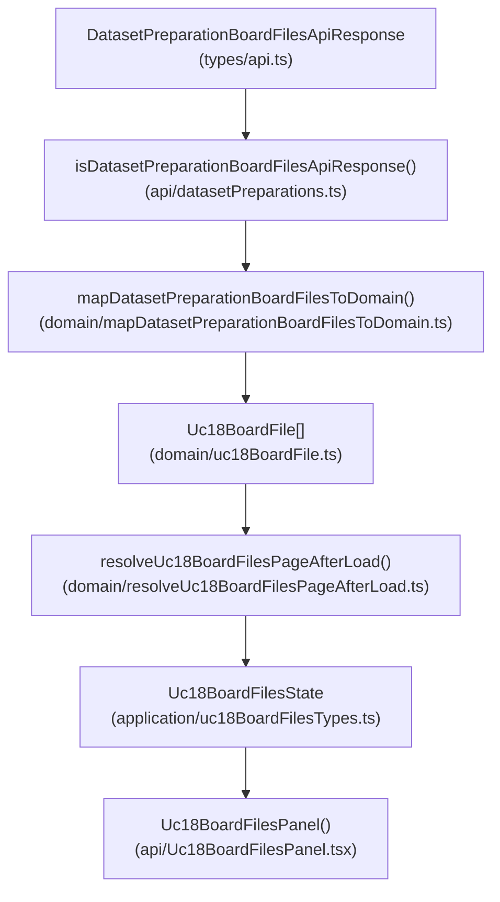
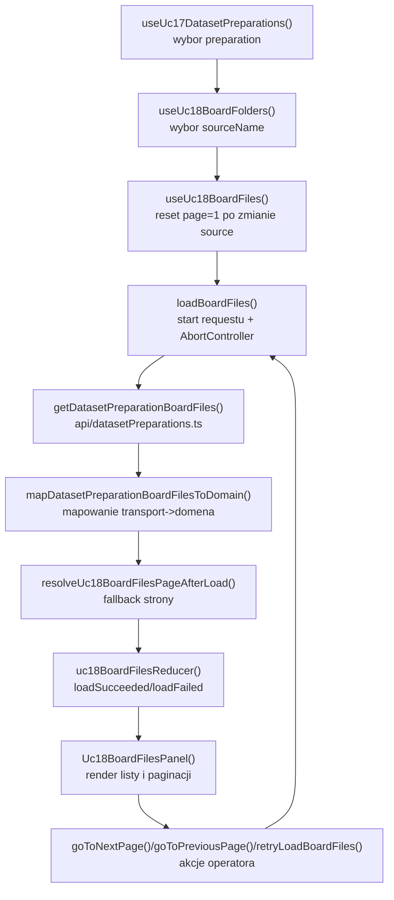

# UC-18-FE - Plan implementacyjny dla `GET /api/datasets/preparations/{preparationName}/board/{sourceName}/files?page={page}&pageSize={pageSize}`

## 1) Przeznaczenie endpointa
- Endpoint zwraca paginowana liste logicznych plansz `board` dla jednego, juz wybranego zrodla `sourceName`.
- Z perspektywy `FE` endpoint:
  - nie sluzy do wyboru `preparation`,
  - nie sluzy do wyboru listy zrodel `board`,
  - nie wykonuje usuwania,
  - nie zwraca jeszcze samej zawartosci obrazu,
  - dostarcza dane do kolejnego kroku przegladu plansz w `UC-18`.
- Ten endpoint jest drugim krokiem przegladania `board`:
  1. `FE` wybiera `preparationName`,
  2. `FE` pobiera `board/folders`,
  3. operator wybiera `sourceName`,
  4. dopiero wtedy `FE` pobiera `board/{sourceName}/files?page={page}&pageSize={pageSize}`.
- `Backend` pozostaje jedynym zrodlem prawdy dla:
  - istnienia `preparationName`,
  - istnienia `sourceName`,
  - kolejnosci rekordow na liscie,
  - lacznej liczby rekordow,
  - `imageEndpoint` przypisanego do danego `boardFolderName`.

## 2) Zakres planu
- Plan dotyczy wylacznie `FE`.
- Plan nie projektuje implementacji `BE` ani `ML`; opiera sie tylko na:
  - publicznym kontrakcie HTTP,
  - wymaganiach `UC-18`,
  - aktualnym stanie `src/Frontend`,
  - juz dodanych historyjkach i kontraktach.
- Nie nalezy sugerowac sie biezaca implementacja `BE` i `ML` poza uzgodnionym kontraktem API.
- Plan ma byc warstwowy i zgodny z praktycznym ukladem `feature-based`:
  - `src/features/*`
  - `src/api/*`
  - `src/types/*`
  - `src/app/*`

## 3) Zaleznosci miedzy historyjkami
- `UC-13`
  - dostarcza sesje administracyjna i `accessToken`; bez niej `401` ma zatrzymac przeplyw i wywolac `onUnauthorized`.
- `UC-17`
  - dostarcza wybor `preparationName` oraz szczegoly preparation.
- `UC-18 board/folders`
  - dostarcza wybor `sourceName`; ten plan zaklada reuse juz istniejacych:
    - `useUc18BoardFolders()`
    - `Uc18PreparationFoldersList`
    - `Uc18BoardFoldersSection`
- `UC-18 digit/folders`
  - jest tylko kontekstem; nie blokuje listowania `board/files`.
- `UC-18 board/{sourceName}/files/{boardFolderName}/image`
  - downstream od tego planu; lista ma juz przechowywac `imageEndpoint`, ale nie wolno sztucznie budowac URL-i po stronie `FE`.
- `UC-18 DELETE /files/{boardFolderName}`
  - downstream od tego planu; stan listy i paginacji powinien byc przygotowany pod przyszle odswiezanie po delete.
- `UC-19`
  - korzysta z oczyszczonego preparation po `UC-18`; ten endpoint nie buduje `.npz`, ale pomaga operatorowi przejrzec dane przed kolejnym krokiem.

## 4) Co juz istnieje i czego nalezy uzyc
- Istnieje selekcja preparation:
  - `src/Frontend/src/features/uc17/application/useUc17DatasetPreparations.ts`
- Istnieje shell `UC-18`:
  - `src/Frontend/src/features/uc18/api/Uc18BoardFoldersSection.tsx`
- Istnieje selekcja zrodel `board`:
  - `src/Frontend/src/features/uc18/application/useUc18BoardFolders.ts`
  - `src/Frontend/src/features/uc18/application/uc18BoardFoldersReducer.ts`
  - `src/Frontend/src/features/uc18/application/uc18BoardFoldersTypes.ts`
- Istnieje wspolny klient preparation:
  - `src/Frontend/src/api/datasetPreparations.ts`
- Istnieje wspolny helper HTTP:
  - `src/Frontend/src/api/shared/fetchJson.ts`
- Istnieje wspolny kontrakt folders:
  - `src/Frontend/src/types/api.ts`
- Istnieje model folderow `UC-18`:
  - `src/Frontend/src/features/uc18/domain/uc18PreparationFolder.ts`
  - `src/Frontend/src/features/uc18/domain/mapDatasetPreparationFoldersToDomain.ts`
  - `src/Frontend/src/features/uc18/domain/reconcileSelectedPreparationFolder.ts`

Wniosek:
- nie tworzyc rownoleglego klienta API poza `datasetPreparations.ts`,
- nie duplikowac selekcji `preparation` ani `sourceName`,
- nie wpychac logiki listowania plansz do `UC-17`,
- nie rozszerzac starego `UC-12` legacy.

## 5) Model API w komunikacji z BE

### 5.1 Request `FE -> BE`
- Metoda i sciezka:
  - `GET /api/datasets/preparations/{preparationName}/board/{sourceName}/files?page={page}&pageSize={pageSize}`
- Path params:
  - `preparationName: string`
  - `sourceName: string`
- Query params:
  - `page: number`
  - `pageSize: number`
- Body:
  - brak
- Naglowki:
  - `Accept: application/json`
  - `Authorization: Bearer <token>` gdy sesja administratora jest aktywna

### 5.2 Model wejscia po stronie FE
- `FE` nie wysyla JSON body.
- `FE` musi znac:
  - `preparationName`,
  - `sourceName`,
  - `page`,
  - `pageSize`.
- `page` i `pageSize` musza byc kontrolowane przez `ViewController`, a nie wpisywane recznie w `View`.

### 5.3 Model wyjsciowy sukcesu
- Oczekiwany status:
  - `200 OK`
- Nalezy dodac do `src/Frontend/src/types/api.ts`:
  - `DatasetPreparationBoardFileListItemApiResponse`
    - `boardFolderName: string`
    - `imageEndpoint: string`
  - `DatasetPreparationBoardFilesApiResponse`
    - `preparationName: string`
    - `sourceName: string`
    - `items: DatasetPreparationBoardFileListItemApiResponse[]`
    - `page: number`
    - `pageSize: number`
    - `totalCount: number`

Przyklad:

```json
{
  "preparationName": "preparation-001",
  "sourceName": "v1_training",
  "items": [
    {
      "boardFolderName": "Image1",
      "imageEndpoint": "/api/datasets/preparations/preparation-001/board/v1_training/files/Image1/image"
    },
    {
      "boardFolderName": "Image2",
      "imageEndpoint": "/api/datasets/preparations/preparation-001/board/v1_training/files/Image2/image"
    }
  ],
  "page": 1,
  "pageSize": 24,
  "totalCount": 128
}
```

### 5.4 Model bledu
- Reuse istniejacego kontraktu:
  - `ErrorApiResponse`
    - `errorType: string`
    - `message: string`

### 5.5 Reguly kontraktowe
- Nie zmieniac nazw juz istniejacych kontraktow.
- Dane transportowe pozostaja w `camelCase`.
- `imageEndpoint` traktowac jako dane z `Backendu`, a nie jako cos, co `FE` moze sobie odtworzyc z innych pol.
- Ten plan dotyczy listy files, ale trzeba pamietac o zgodnosci downstream z istniejacym `ImageApiResponse` w `src/Frontend/src/types/api.ts`:
  - `mimeType`
  - `base64`
- Nie wprowadzac nowego, rownoleglego modelu obrazu tylko dlatego, ze tekst historyjki opisuje go inaczej.

## 6) Zachowanie z kazdej warstwy MVVC

### Model
- Obejmuje:
  - kontrakty transportowe `DatasetPreparationBoardFilesApiResponse` i `DatasetPreparationBoardFileListItemApiResponse`,
  - lokalny model domenowy planszy,
  - czyste funkcje mapowania,
  - czyste funkcje wyliczania stanu paginacji.
- Nie zna Reacta, `fetch`, statusow HTTP ani `AbortController`.

### View
- Obejmuje:
  - panel listy plansz dla wybranego `sourceName`,
  - kontrolki `Poprzednia / Nastepna`,
  - informacje o stronie i liczbie rekordow,
  - stan `loading/error/empty/success`,
  - placeholder pod przyszly preview obrazu.
- Nie tworzy URL-i endpointow.
- Nie wykonuje walidacji odpowiedzi.

### ViewController
- Obejmuje:
  - automatyczne pobranie listy po zmianie `sourceName`,
  - utrzymanie `page` i `pageSize`,
  - reset strony do `1` po zmianie `sourceName`,
  - `retryLoadBoardFiles()`,
  - `goToNextPage()` / `goToPreviousPage()` / `goToPage(page)`,
  - abort poprzedniego requestu,
  - reakcje na `401`, `404`, `400`, `5xx`,
  - lekki mechanizm fallbacku, gdy strona stala sie nieaktualna.

### Infrastructure
- Obejmuje:
  - walidacje JSON,
  - klient `GET /files`,
  - kodowanie `preparationName` i `sourceName`,
  - doklejenie query params `page` i `pageSize`,
  - mapowanie bledow HTTP na `DatasetPreparationsApiError`.

## 7) Pliki per warstwa i odpowiedzialnosci

### 7.1 View
- `[UPDATE]` `src/Frontend/src/features/uc18/api/Uc18BoardFoldersSection.tsx`
  - pozostaje glownym shellem `UC-18`;
  - po wybraniu `sourceName` osadza nowy panel listowania plansz;
  - nie przejmuje logiki `fetch`.
- `[ADD]` `src/Frontend/src/features/uc18/api/Uc18BoardFilesPanel.tsx`
  - nowy panel kroku `board/files`;
  - renderuje stany `loading/error/empty/success`;
  - pokazuje liste plansz i paginacje;
  - przyjmuje dane z hooka zamiast wykonywac `fetch`.
- `[REUSE]` `src/Frontend/src/features/uc18/api/index.ts`
  - publiczny export feature'a pozostaje ten sam.
- `[REUSE / CONTEXT]` `src/Frontend/src/app/views/DatasetsView.tsx`
  - bez nowego top-level kroku;
  - `UC-18` nadal pozostaje jednym krokiem workflow datasetowego.
- `[UPDATE]` `src/Frontend/src/styles/datasets.css`
  - style panelu listy plansz, statusow, paginacji i placeholdera preview.

### 7.2 ViewController
- `[ADD]` `src/Frontend/src/features/uc18/application/useUc18BoardFiles.ts`
  - glowny hook use-case'u dla tego endpointa;
  - utrzymuje stan listy, paginacji, retry i abort.
- `[ADD]` `src/Frontend/src/features/uc18/application/uc18BoardFilesReducer.ts`
  - czysty reducer stanu listowania plansz.
- `[ADD]` `src/Frontend/src/features/uc18/application/uc18BoardFilesTypes.ts`
  - typy stanu, akcji, opcji hooka i stale domyslnego `pageSize`.
- `[REUSE]` `src/Frontend/src/features/uc18/application/useUc18BoardFolders.ts`
  - dalej dostarcza `selectedSourceName`;
  - nie nalezy duplikowac w nim stanu plansz.

### 7.3 Model
- `[UPDATE]` `src/Frontend/src/types/api.ts`
  - dodac transportowe typy `DatasetPreparationBoardFileListItemApiResponse` i `DatasetPreparationBoardFilesApiResponse`.
- `[ADD]` `src/Frontend/src/features/uc18/domain/uc18BoardFile.ts`
  - lokalny model planszy:
    - `key`
    - `preparationName`
    - `sourceName`
    - `boardFolderName`
    - `imageEndpoint`
- `[ADD]` `src/Frontend/src/features/uc18/domain/mapDatasetPreparationBoardFilesToDomain.ts`
  - mapuje transport na model lokalny;
  - waliduje spojnosc `preparationName` i `sourceName`.
- `[ADD]` `src/Frontend/src/features/uc18/domain/resolveUc18BoardFilesPageAfterLoad.ts`
  - czysta logika fallbacku strony po odpowiedzi.

### 7.4 Infrastructure
- `[UPDATE]` `src/Frontend/src/api/datasetPreparations.ts`
  - dodac guard:
    - `isDatasetPreparationBoardFileListItemApiResponse()`
    - `isDatasetPreparationBoardFilesApiResponse()`
  - dodac klient:
    - `getDatasetPreparationBoardFiles(apiBaseUrl, params, accessToken, signal)`
- `[REUSE]` `src/Frontend/src/api/shared/fetchJson.ts`
  - wspolny mechanizm `fetch + parse + validate + errorFactory`.

### 7.5 Pliki kontekstowe, ktorych nie nalezy tu rozwijac
- `[REUSE / UPSTREAM]` `src/Frontend/src/features/uc17/application/useUc17DatasetPreparations.ts`
  - selekcja `preparationName`.
- `[REUSE / CONTEXT]` `src/Frontend/src/features/uc18/application/useUc18DigitFolders.ts`
  - bez zmian; nie miesza sie z listowaniem `board/files`.
- `[LEGACY / NIE ROZWIJAC]` `src/Frontend/src/components/Uc12DatasetPreparationSection.tsx`
  - stary workflow, bez znaczenia dla nowego kroku `UC-18`.

## 8) Strategia generycznosci i reuse
- Najpierw sprawdzamy, czy usluga juz istnieje.
- W tym repo istnieje wlasciwe miejsce rozszerzenia:
  - `src/Frontend/src/api/datasetPreparations.ts`
- Nie tworzyc nowego pliku API typu:
  - `datasetPreparationBoardFiles.ts`
  - `uc18BoardFilesApi.ts`
- Nowa funkcja moze pozostac endpoint-specific:
  - `getDatasetPreparationBoardFiles(...)`
- Ale powinna byc napisana tak, by downstream dalo sie reuse'owac:
  - ten sam klient bedzie uzywany przy odswiezaniu po delete,
  - ten sam model danych bedzie uzywany przez przyszly preview obrazu,
  - ta sama logika paginacji obsluzy ponowne ladowanie po zmianach listy.

## 9) Glowne funkcje
- `getDatasetPreparationBoardFiles()`
- `isDatasetPreparationBoardFileListItemApiResponse()`
- `isDatasetPreparationBoardFilesApiResponse()`
- `useUc18BoardFiles()`
- `loadBoardFiles()`
- `retryLoadBoardFiles()`
- `goToPage()`
- `goToNextPage()`
- `goToPreviousPage()`
- `uc18BoardFilesReducer()`
- `mapDatasetPreparationBoardFilesToDomain()`
- `resolveUc18BoardFilesPageAfterLoad()`
- `Uc18BoardFilesPanel()`

## 10) Zachowanie aplikacyjne
- Po zmianie `selectedSourceName`:
  - reset strony do `1`,
  - rozpoczecie ladowania plansz dla nowego zrodla.
- Po zmianie samej strony:
  - zostawic `preparationName` i `sourceName`,
  - pobrac tylko nowy zakres listy.
- W stanie `loading` dla tej samej kombinacji `preparationName + sourceName`:
  - mozna zachowac poprzednie `items`, aby nie migal caly panel.
- W stanie `loading` po zmianie `sourceName`:
  - wyczyscic poprzednia strone, bo dane nalezaly do innego zrodla.
- `View` ma pokazywac:
  - nazwe preparation,
  - nazwe source,
  - `page`,
  - `pageSize`,
  - `totalCount`,
  - liste `boardFolderName`.
- `View` nie powinien jeszcze:
  - pobierac `ImageApiResponse`,
  - wykonywac `DELETE`,
  - budowac fallbackowego `imageEndpoint`,
  - skanowac katalogow lokalnie.

## 11) Wyjatki i fallbacki

### 11.1 Brak wejscia
- Gdy `preparationName` jest puste:
  - nie wysylac requestu,
  - stan `idle`.
- Gdy `sourceName` jest `null`:
  - nie wysylac requestu,
  - pokazac komunikat, ze trzeba wybrac zrodlo `board`.

### 11.2 `401 Unauthorized`
- Wywolac `onUnauthorized`.
- Pokazac komunikat o wygaslej sesji.
- Nie probowac cichego retry bez nowego logowania.

### 11.3 `404 Not Found`
- Traktowac jako utrate aktualnosci preparation albo source.
- Wyczyscic stan listy plansz.
- Zachowac informacje diagnostyczna w logu `warn`.
- Pozostawic operatorowi jawny krok ponownego wyboru zrodla.

### 11.4 `400 Bad Request`
- To blad kontraktu lub lokalnej logiki paginacji.
- Nie retry'owac automatycznie.
- Zalogowac `warn`.
- Pokazac komunikat techniczny i zostawic przycisk `Sprobuj ponownie`.

### 11.5 `5xx`
- Pokazac banner bledu.
- Zachowac ostatnia poprawna liste dla tego samego `sourceName`, jesli byla juz zaladowana.
- Pozwolic na reczne odswiezenie.

### 11.6 Niepoprawny ksztalt JSON
- Traktowac jako blad techniczny.
- `console.error`.
- Nie probowac sklejac danych z czesci odpowiedzi.

### 11.7 Nieaktualna strona po zmianach danych
- Mozliwy scenariusz:
  - operator byl na wysokiej stronie,
  - liczba rekordow zmniejszyla sie,
  - backend zwrocil pusta strone albo strone spoza aktualnego zakresu.
- Fallback:
  - jednorazowo wyliczyc `lastPage = max(1, ceil(totalCount / pageSize))`,
  - jesli `requestedPage > lastPage` i `totalCount > 0`, automatycznie przeladowac `lastPage`,
  - zalogowac pojedyncze `warn`,
  - nie wchodzic w petle retry.

## 12) Lekka strategia logowania
- `console.info`
  - start ladowania listy,
  - sukces ladowania,
  - reczne odswiezenie,
  - zmiana strony.
- `console.warn`
  - `401`,
  - `404`,
  - `400`,
  - fallback z nieaktualnej strony na `lastPage`.
- `console.error`
  - `5xx`,
  - niepoprawny ksztalt odpowiedzi,
  - inne nieoczekiwane wyjatki.
- Logi maja byc pojedyncze per przejscie stanu, bez spamowania na kazdy render.

## 13) Przeplyw kontraktowy w obrebie BE widziany z FE
- To nie jest plan implementacji `BE`.
- Z perspektywy `FE` zakladamy tylko taki kontraktowy przeplyw:
  1. `FE` wysyla `preparationName`, `sourceName`, `page`, `pageSize`.
  2. `BE` autoryzuje request.
  3. `BE` waliduje, czy wskazane `preparation` i `source` istnieja.
  4. `BE` zwraca gotowa strone listy logicznych plansz.
  5. `BE` zwraca `imageEndpoint` jako publiczny kontrakt do dalszego preview.
  6. `FE` nie zaklada nic wiecej o strukturze plikow ani sposobie wyliczenia strony.

## 14) Pseudokod dla logiki specyficznej

```text
function loadBoardFiles(preparationName, sourceName, requestedPage, pageSize):
  if preparationName is empty or sourceName is empty:
    reset state to idle
    return

  abort previous request
  dispatch(loadStarted(preparationName, sourceName, requestedPage, pageSize))

  response = await getDatasetPreparationBoardFiles(...)
  items = mapDatasetPreparationBoardFilesToDomain(response, preparationName, sourceName)

  pageResolution = resolveUc18BoardFilesPageAfterLoad(
    requestedPage,
    response.page,
    response.pageSize,
    response.totalCount,
    items.length
  )

  if pageResolution.shouldReloadLastPage:
    log warn once
    dispatch(pageChanged(pageResolution.lastPage))
    call loadBoardFiles(preparationName, sourceName, pageResolution.lastPage, response.pageSize)
    return

  dispatch(loadSucceeded({
    preparationName,
    sourceName,
    items,
    page: response.page,
    pageSize: response.pageSize,
    totalCount: response.totalCount
  }))
```

## 15) Mermaid - flow modeli



## 16) Mermaid - flow logiki aplikacji



## 17) Workflow GitHub i konfiguracja
- Dla tego endpointa nie widze potrzeby zmiany workflow `FE`.
- Aktualny `frontend-cd.yml` juz buduje frontend z:
  - `VITE_API_BASE_URL="${FE_VITE_API_BASE_URL:-/api}"`
- Ten endpoint korzysta z tego samego `apiBaseUrl`, wiec:
  - nie trzeba dodawac nowej zmiennej CI/CD,
  - nie trzeba ruszac deployu,
  - nie trzeba zmieniac build output.
- `pageSize` dla tego kroku powinien byc lokalna, jawna stala w FE, a nie zmienna workflow.
- Poniewaz plan dotyczy tylko `FE`, nie ma tu zmian w `appsettings`; wzmianka o produkcyjnym `appsettings` dotyczy glownie warstwy `BE`, nie tego endpointa.

## 18) Kolejnosc implementacji kodu
1. Rozszerzyc `src/Frontend/src/types/api.ts` o nowe kontrakty transportowe listy files.
2. Rozszerzyc `src/Frontend/src/api/datasetPreparations.ts` o guardy i `getDatasetPreparationBoardFiles(...)`.
3. Dodac model domenowy `Uc18BoardFile` oraz mapper.
4. Dodac czysta logike fallbacku strony.
5. Dodac `uc18BoardFilesTypes.ts` i `uc18BoardFilesReducer.ts`.
6. Dodac hook `useUc18BoardFiles.ts`.
7. Dodac `Uc18BoardFilesPanel.tsx`.
8. Zintegrowac panel z `Uc18BoardFoldersSection.tsx`.
9. Dopisac style do `datasets.css`.
10. Zweryfikowac recznie scenariusze:
   - wybor preparation,
   - wybor source,
   - przejscie miedzy stronami,
   - `401`,
   - `404`,
   - pusty wynik,
   - stale page po zmianie danych.

## 19) Guardraile implementacyjne
- Nie zgadywac `imageEndpoint` po stronie klienta.
- Nie przenosic logiki `fetch` do komponentu `View`.
- Nie mieszac stanu `board/files` ze stanem `board/folders`.
- Nie dokladac nowego top-level kroku w `DatasetsView`.
- Nie uzalezniac `UC-18` od `ML`.
- Nie wprowadzac nowego kontraktu obrazu obok istniejacego `ImageApiResponse`.
- Nie robic cichego nieskonczonego retry.
- Nie deduplikowac i nie sortowac listy po stronie `FE`, jesli backend nie zleca tego w kontrakcie.
- Nie wynosic `pageSize` do workflow ani do globalnej konfiguracji, dopoki nie ma realnej potrzeby produktowej.
- Zachowac nazewnictwo zgodne z juz dodanym `UC-18`:
  - `datasetPreparations.ts`
  - `useUc18BoardFolders()`
  - `Uc18BoardFoldersSection`

## 20) Inne istotne reguly
- `View` ma pozostac cienki, a logika pobierania i fallbackow ma pozostac w `ViewController`.
- `sourceName` jest wybierane wyzej; nowy panel nie ma robic drugiej, rownoleglej selekcji zrodla.
- Jesli ten endpoint zostanie zaimplementowany przed endpointem `image`, panel powinien byc gotowy na pozniejszy preview, ale bez sztucznych obejsc.
- Jezeli w kolejnym kroku dojdzie delete, hook listy files powinien byc jedynym miejscem odswiezania po zmianie listy.
- Caly plan ma pozostac w granicach `FE`, bez przepisywania odpowiedzialnosci na `BE` i `ML`.
