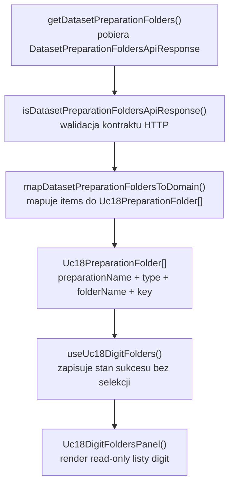
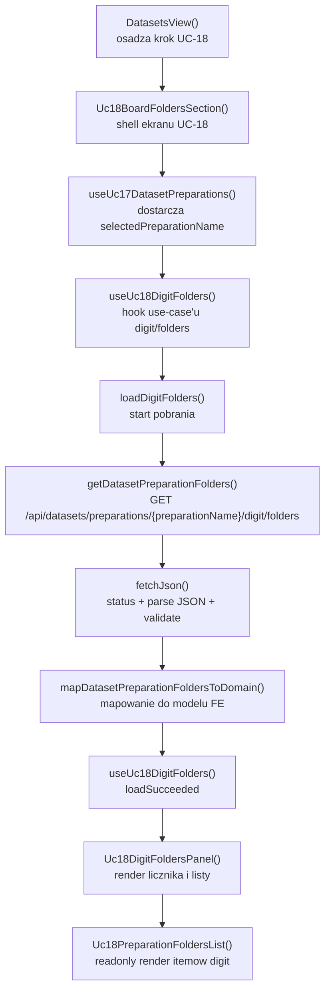

# UC-18-FE - Plan implementacyjny dla `GET /api/datasets/preparations/{preparationName}/digit/folders`

## 1) Przeznaczenie endpointa
- Endpoint `GET /api/datasets/preparations/{preparationName}/digit/folders` zwraca liste logicznych zrodel typu `digit` dla wybranego preparation.
- Z perspektywy `FE` ten endpoint:
  - zasila pomocniczy, read-only widok `digit` w `UC-18`,
  - pokazuje tylko nazwy folderow zrodlowych `digit`,
  - nie laduje listy pojedynczych probek cyfr,
  - nie laduje obrazow,
  - nie wykonuje usuwania danych,
  - nie odczytuje bezposrednio struktury katalogow runtime.
- Wynik endpointa ma znaczenie informacyjne i kontekstowe:
  - potwierdza, jakie logiczne zrodla `digit` sa czescia preparation,
  - pozwala operatorowi sprawdzic komplet preparation,
  - nie uruchamia kolejnego kroku przegladania w ramach `UC-18`, bo `digit` nie ma tutaj osobnego preview ani delete.
- `Backend` pozostaje jedynym zrodlem prawdy dla:
  - istnienia preparation,
  - listy zrodel `digit`,
  - kolejnosci elementow zwracanych z `digit/folders.json`,
  - lacznej liczby rekordow.

## 2) Zakres planu
- Plan dotyczy wylacznie `FE`.
- Plan nie projektuje implementacji `BE` ani `ML`; opiera sie tylko na:
  - publicznym kontrakcie HTTP,
  - wymaganiach `UC-18`,
  - istniejacym kodzie `src/Frontend`,
  - juz dodanym endpointcie `board/folders`.
- Nie nalezy sugerowac sie biezaca implementacja `BE` i `ML` poza ustalonym kontraktem i semantyka use case'a.
- Plan uwzglednia warstwowosc MVVC oraz obecny praktyczny uklad `feature-based`.
- Plan musi podporzadkowac sie istniejacym nazwom i kontraktom z poprzednich historyjek:
  - nie zmieniamy nazw juz dodanych typow,
  - nie przepinamy odpowiedzialnosci miedzy warstwami,
  - nie robimy nowego rownoleglego klienta API.

## 3) Miejsce endpointa w docelowym workflow
1. Uzytkownik ma juz istniejace preparation utworzone w `UC-17`.
2. `FE` zna `preparationName` wybrane przez uzytkownika.
3. `FE` wywoluje rownolegle lub sekwencyjnie dwa odczyty dla tego samego preparation:
   - `GET /api/datasets/preparations/{preparationName}/board/folders`
   - `GET /api/datasets/preparations/{preparationName}/digit/folders`
4. `BE` zwraca liste nazw folderow zrodlowych `digit`.
5. `FE` renderuje read-only liste `digit`.
6. Uzytkownik otrzymuje kontekst preparation:
   - jakie sa zrodla `board`,
   - jakie sa zrodla `digit`.
7. Tylko `board` prowadzi dalej do `GET /api/datasets/preparations/{preparationName}/board/{sourceName}/files`.
8. `digit` w `UC-18` konczy sie na pokazaniu listy logicznych folderow.

## 4) Glowne zalozenia architektoniczne
- Globalna architektura FE jest formalnie nadal `TBD`, ale obecny kod jest praktycznie warstwowy i `feature-based`:
  - `src/app/*`
  - `src/features/*`
  - `src/api/*`
  - `src/types/*`
- Dla tego endpointa trzeba utrzymac podzial:
  - `Model`: kontrakt transportowy, lokalny model folderu i reguly mapowania,
  - `View`: panel listy `digit`, stany `loading/error/empty/success`,
  - `ViewController`: pobranie danych, abort, retry, reakcja na `401/404`,
  - `Infrastructure`: klient HTTP, walidacja JSON, mapowanie bledow transportowych.
- `FE` nie moze:
  - skanowac katalogow,
  - zgadywac nazw folderow `digit`,
  - wyprowadzac listy `digit` z innych endpointow jako fallback sukcesu,
  - komunikowac sie bezposrednio z `ML`.
- `digit/folders` jest tylko odczytem kontekstowym, wiec warstwa `View` nie powinna doklejac sztucznej logiki selekcji ani downstream delete.
- Jesli trzeba dodac nowa abstrakcje, najpierw nalezy sprawdzic, co juz istnieje i reuse'owac to, co daje realna wartosc.

## 5) Strategia reuse i generycznosci
- Generyczna warstwa `Infrastructure` dla `board | digit` juz istnieje i nalezy z niej korzystac:
  - `src/Frontend/src/api/datasetPreparations.ts`
  - `getDatasetPreparationFolders(...)`
- Generyczna warstwa `Model` dla `board | digit` juz istnieje i nalezy z niej korzystac:
  - `src/Frontend/src/features/uc18/domain/uc18PreparationFolder.ts`
  - `src/Frontend/src/features/uc18/domain/mapDatasetPreparationFoldersToDomain.ts`
  - `src/Frontend/src/features/uc18/domain/toUc18PreparationFolderKey.ts`
- Nie nalezy tworzyc nowego klienta `getDatasetPreparationDigitFolders()`, bo powielalby juz gotowa warstwe `Infrastructure`.
- Poniewaz `digit` ma inne zachowanie UI niz `board`, generycznosc powinna byc rozwazna:
  - wspolne ma byc pobranie danych i mapowanie,
  - `board` zachowuje wybor `sourceName`,
  - `digit` pozostaje lista read-only.
- Preferowany kierunek:
  - zostawic publiczne nazwy juz dodanych elementow `board`,
  - dodac wspolny, wewnetrzny loader zasobu folderow tylko wtedy, gdy realnie usuwa duplikacje,
  - na zewnatrz nie zmieniac nazw juz uzywanych plikow ani hookow `board`.
- Minimalna bezpieczna granica generycznosci:
  - wspolny klient API,
  - wspolny model domenowy,
  - wspolna lista prezentacyjna po dopracowaniu tekstow dla trybu read-only.

## 6) Model API w komunikacji z BE

### 6.1 Request `FE -> BE`
- Metoda i sciezka:
  - `GET /api/datasets/preparations/{preparationName}/digit/folders`
- Path params:
  - `preparationName: string`
- Query params:
  - brak
- Body:
  - brak
- Naglowki:
  - `Accept: application/json`
  - `Authorization: Bearer <token>` gdy aktywna jest sesja administratora

### 6.2 Model wejsciowy
- Brak payloadu JSON.
- Jedynym wymaganym wejsciem jest poprawny `preparationName`.

### 6.3 Model wyjsciowy sukcesu
- Oczekiwany status HTTP:
  - `200 OK`
- Kontrakt transportowy:
  - `DatasetPreparationFoldersApiResponse`
    - `preparationName: string`
    - `type: string`
    - `items: string[]`
    - `totalCount: number`

Przyklad:

```json
{
  "preparationName": "preparation-001",
  "type": "digit",
  "items": [
    "mnist_train",
    "mnist_test"
  ],
  "totalCount": 2
}
```

### 6.4 Model bledu
- `ErrorApiResponse`
  - `errorType: string`
  - `message: string`

### 6.5 Reguly kontraktowe
- Nie zmieniac nazw:
  - `DatasetPreparationFoldersApiResponse`
  - `ErrorApiResponse`
- Dane transportowe pozostaja w `camelCase`.
- `type` w `src/types/api.ts` pozostaje `string`.
- Zawazenie do `board | digit` ma pozostac lokalne i domenowe.
- Dla wywolania `/digit/folders` odpowiedz z `type != "digit"` nalezy traktowac jako blad kontraktu, a nie jako czesciowy sukces.

## 7) Zachowanie z kazdej warstwy MVVC

### Model
- Obejmuje:
  - kontrakt `DatasetPreparationFoldersApiResponse`,
  - lokalny typ `Uc18PreparationFolderType`,
  - lokalny model folderu do renderowania,
  - reguly mapowania transportu do domeny.
- Nie zna Reacta, `fetch` ani statusow HTTP.
- Dla `digit` nie musi utrzymywac aktywnego `sourceName`, bo ten endpoint nie prowadzi do dalszej nawigacji w `UC-18`.

### View
- Obejmuje:
  - panel listy `digit`,
  - licznik rekordow,
  - przycisk `Odswiez liste digit`,
  - stany `loading/error/empty/success`.
- Powinien byc read-only:
  - bez delete,
  - bez lazy-loadu obrazow,
  - bez akcji przejscia do listy plikow.
- Nie tworzy URL-i endpointow.
- Nie zawiera walidacji transportu.

### ViewController
- Obejmuje:
  - `loadDigitFolders(preparationName)`,
  - `retryLoadDigitFolders()`,
  - `AbortController`,
  - reakcje na `401`,
  - reakcje na `404`,
  - lekkie logowanie diagnostyczne.
- Nie powinien utrzymywac stanu selekcji, jesli widok jest read-only.

### Infrastructure
- Obejmuje:
  - `getDatasetPreparationFolders()`,
  - guard odpowiedzi JSON,
  - `buildAuthHeaders()`,
  - `fetchJson()`,
  - mapowanie bledow HTTP na `DatasetPreparationsApiError`.

## 8) Co juz istnieje i nalezy reuse'owac
- Istnieje wspolny klient preparation:
  - `src/Frontend/src/api/datasetPreparations.ts`
- Istnieje wspolny helper HTTP:
  - `src/Frontend/src/api/shared/fetchJson.ts`
- Istnieja juz kontrakty transportowe:
  - `src/Frontend/src/types/api.ts`
- Istnieje juz model folderow `UC-18` obslugujacy `board | digit`:
  - `src/Frontend/src/features/uc18/domain/uc18PreparationFolder.ts`
  - `src/Frontend/src/features/uc18/domain/mapDatasetPreparationFoldersToDomain.ts`
  - `src/Frontend/src/features/uc18/domain/toUc18PreparationFolderKey.ts`
- Istnieje juz shell ekranu `UC-18`, ktory pobiera preparation i listuje `board/folders`:
  - `src/Frontend/src/features/uc18/api/Uc18BoardFoldersSection.tsx`
  - `src/Frontend/src/features/uc18/application/useUc18BoardFolders.ts`
- Istnieje juz upstream do wyboru preparation:
  - `src/Frontend/src/features/uc17/application/useUc17DatasetPreparations.ts`
- Istnieje juz integracja kroku `UC-18` w module datasetowym:
  - `src/Frontend/src/app/views/DatasetsView.tsx`
- Istnieja juz style datasetowe:
  - `src/Frontend/src/styles/datasets.css`

Wniosek:
- nie tworzyc nowego pliku API tylko dla `digit`,
- nie tworzyc osobnej, rownoleglej reprezentacji modelu folderu,
- nie dublowac selektora preparation z `UC-17`,
- nie budowac osobnego top-level ekranu `UC-18` tylko dla `digit`.

## 9) Pliki per warstwa i odpowiedzialnosci

### 9.1 View
- `[REUSE + UPDATE]` `src/Frontend/src/features/uc18/api/Uc18BoardFoldersSection.tsx`
  - pozostaje glownym shellem `UC-18`;
  - dalej odpowiada za wybor preparation i panel `board`;
  - powinien zostac rozszerzony o osadzenie panelu `digit`, bez dublowania kroku wyboru preparation.
- `[ADD]` `src/Frontend/src/features/uc18/api/Uc18DigitFoldersPanel.tsx`
  - nowy panel read-only dla endpointa `digit/folders`;
  - renderuje stany `loading/error/empty/success`;
  - pokazuje licznik i liste nazw folderow `digit`;
  - nie ma akcji wyboru do dalszego listowania.
- `[REUSE + UPDATE]` `src/Frontend/src/features/uc18/api/Uc18PreparationFoldersList.tsx`
  - wspolny komponent listy nazw folderow;
  - powinien obslugiwac tryb:
    - `selectable` dla `board`,
    - `readonly` dla `digit`;
  - teksty UI nie moga byc na stale zwiazane z `board`.
- `[REUSE]` `src/Frontend/src/features/uc18/api/index.ts`
  - publiczny export feature'a `UC-18`;
  - nie wymaga zmiany publicznego kontraktu exportu, jesli top-level komponent pozostaje ten sam.
- `[REUSE]` `src/Frontend/src/app/views/DatasetsView.tsx`
  - osadza `UC-18` jako jeden krok workflow datasetowego;
  - nie powinien dostawac dodatkowego kroku nawigacyjnego tylko dla `digit/folders`.
- `[REUSE]` `src/Frontend/src/styles/datasets.css`
  - style panelu `digit`, listy nazw, badge'y/liczniki, stany bannerow.

### 9.2 ViewController
- `[ADD]` `src/Frontend/src/features/uc18/application/useUc18DigitFolders.ts`
  - glowny hook use case'u dla `digit/folders`;
  - pobiera dane,
  - utrzymuje loadable state,
  - obsluguje retry, abort, `401`, `404`,
  - nie utrzymuje selekcji.
- `[OPTIONAL ADD - PREFERRED]` `src/Frontend/src/features/uc18/application/useUc18PreparationFoldersResource.ts`
  - wewnetrzny, wspolny loader dla `board | digit`, jesli chcemy usunac duplikacje request/abort/log/error;
  - nie musi byc publicznym API feature'a.
- `[OPTIONAL ADD - PREFERRED]` `src/Frontend/src/features/uc18/application/uc18PreparationFoldersResourceReducer.ts`
  - czysty reducer wspolnego stanu odczytu listy folderow.
- `[OPTIONAL ADD - PREFERRED]` `src/Frontend/src/features/uc18/application/uc18PreparationFoldersResourceTypes.ts`
  - typy stanu i akcji wspolnego loadera.
- `[REUSE + UPDATE]` `src/Frontend/src/features/uc18/application/useUc18BoardFolders.ts`
  - zachowuje istniejaca nazwe i publiczny interfejs;
  - po ewentualnej ekstrakcji wspolnego loadera powinien dalej odpowiadac tylko za logike `board`, zwlaszcza selekcje `sourceName`.
- `[CONTEXT ONLY]` `src/Frontend/src/features/uc17/application/useUc17DatasetPreparations.ts`
  - dostarcza `selectedPreparationName`;
  - nie powinien przejmowac logiki `digit/folders`.

### 9.3 Model
- `[REUSE]` `src/Frontend/src/types/api.ts`
  - utrzymuje `DatasetPreparationFoldersApiResponse`.
- `[REUSE]` `src/Frontend/src/features/uc18/domain/uc18PreparationFolder.ts`
  - lokalny model domenowy folderu i typ `board | digit`.
- `[REUSE]` `src/Frontend/src/features/uc18/domain/mapDatasetPreparationFoldersToDomain.ts`
  - mapuje transport do modelu lokalnego;
  - dla `digit/folders` wymusza `expectedType = "digit"`.
- `[REUSE]` `src/Frontend/src/features/uc18/domain/toUc18PreparationFolderKey.ts`
  - buduje stabilny klucz np. `digit:mnist_train`.
- `[CONTEXT ONLY]` `src/Frontend/src/features/uc18/domain/reconcileSelectedPreparationFolder.ts`
  - zostaje potrzebny dla `board`;
  - nie powinien byc sztucznie doklejany do `digit`, jesli ten widok nie wymaga selekcji.

### 9.4 Infrastructure
- `[REUSE]` `src/Frontend/src/api/datasetPreparations.ts`
  - juz zawiera `getDatasetPreparationFolders(...)`;
  - jest jedynym klientem infrastrukturalnym dla `board/folders` i `digit/folders`.
- `[REUSE]` `src/Frontend/src/api/shared/fetchJson.ts`
  - wspolny mechanizm `fetch + parse + validate + errorFactory`.

### 9.5 Pliki kontekstowe, ktorych nie rozwijac w tym endpointcie
- `[CONTEXT ONLY]` `src/Frontend/src/features/uc17/api/Uc17RawCandidatesSection.tsx`
  - dotyczy tworzenia preparation;
  - nie jest miejscem renderowania listy `digit/folders`.
- `[CONTEXT ONLY]` `src/Frontend/src/features/uc18/api/Uc18BoardFoldersSection.tsx`
  - juz obsluguje `board/folders`;
  - ma byc shellem ekranu, a nie miejscem kopiowania calego hooka `digit`.
- `[LEGACY / NIE ROZWIJAC]` `src/Frontend/src/components/Uc12DatasetPreparationSection.tsx`
  - dotyczy starego workflow `UC-12`;
  - nie moze byc wzorcem dla `UC-18`.

## 10) Co nalezy dodac lub dopracowac
- Dodac panel widoku dla `digit/folders` wewnatrz istniejacego ekranu `UC-18`.
- Dodac hook `useUc18DigitFolders()` bez dublowania klienta HTTP.
- Uogolnic `Uc18PreparationFoldersList.tsx`, aby obslugiwal:
  - tryb wybieralny dla `board`,
  - tryb read-only dla `digit`.
- Zachowac istniejacy shell `Uc18BoardFoldersSection.tsx`, ale rozszerzyc go o nowy panel `digit`.
- Nie dodawac akcji:
  - delete,
  - preview,
  - image fetch,
  - dalszej nawigacji po `digit`.
- Opcjonalnie wyciagnac wspolny loader folderow do warstwy `application`, jesli po dodaniu `digit` kod `board` i `digit` bylby niemal identyczny.

## 11) Glowne funkcje
- `getDatasetPreparationFolders()`
- `isDatasetPreparationFoldersApiResponse()`
- `useUc18DigitFolders()`
- `loadDigitFolders()`
- `retryLoadDigitFolders()`
- `mapDatasetPreparationFoldersToDomain()`
- `toUc18PreparationFolderKey()`
- `Uc18DigitFoldersPanel()`
- `Uc18PreparationFoldersList()`
- `fetchJson()`

Jesli wdrazamy ekstrakcje wspolnego loadera:
- `useUc18PreparationFoldersResource()`
- `uc18PreparationFoldersResourceReducer()`

## 12) Zachowanie View
- Po otrzymaniu poprawnego `preparationName` widok uruchamia pobranie listy folderow `digit`.
- Widok pokazuje:
  - nazwe wybranego preparation,
  - licznik `totalCount`,
  - liste nazw folderow `digit`,
  - przycisk odswiezenia.
- Widok nie powinien:
  - pokazywac miniaturek cyfr,
  - pobierac listy pojedynczych digit files,
  - pobierac obrazow,
  - wykonywac delete,
  - udawac, ze `digit` ma ten sam flow dalszych krokow co `board`.
- Widok ma charakter informacyjny:
  - operator widzi, jakie logiczne zrodla `digit` naleza do preparation,
  - ale nie przechodzi dalej do osobnego ekranu `digit`.

## 13) Zachowanie ViewController
- Hook powinien pobierac dane automatycznie po zmianie `preparationName`.
- Jesli uzytkownik zmieni `preparationName` w trakcie requestu:
  - poprzedni request trzeba anulowac,
  - nowy request staje sie jedynym aktywnym.
- W stanie `loading` nalezy zachowac poprzednia liste tylko dla tego samego `preparationName`.
- Po sukcesie:
  - zapisac nowa liste,
  - wyczyscic blad,
  - ustawic `httpStatus = 200`.
- Przy `401`:
  - wywolac `onUnauthorized`.
- Przy `404`:
  - pokazac blad stalego / nieaktualnego `preparationName`,
  - nie zgadywac nowej listy `digit`.
- Poniewaz widok jest read-only:
  - brak `selectedSourceName`,
  - brak reconcile selekcji,
  - brak lokalnego draftu do kolejnego endpointa.

## 14) Zachowanie Model
- Lokalny model domenowy moze pozostac wspolny z `board`, bo format danych jest ten sam:
  - `preparationName: string`
  - `type: "board" | "digit"`
  - `folderName: string`
  - `key: string`
- Mapowanie powinno:
  - zachowac kolejnosc z `items`,
  - wymusic `expectedType = "digit"`,
  - nie zmieniac nazw folderow,
  - nie obcinac wartosci,
  - nie normalizowac wielkosci liter.
- Dla `digit` lokalny model nie musi byc rozszerzany o stan wyboru, bo byloby to sztuczne i nieuzasadnione funkcjonalnie.

## 15) Zachowanie Infrastructure
- Klient powinien URL-encode'owac `preparationName`.
- Funkcja `getDatasetPreparationFolders()` ma pozostac generyczna po `folderType`, ale dla tego endpointa wywolywana z `"digit"`.
- Oczekiwany status:
  - `200`
- Guard odpowiedzi ma sprawdzac:
  - `preparationName` jako `string`,
  - `type` jako `string`,
  - `items` jako `string[]`,
  - `totalCount` jako `number`.
- Bledny ksztalt JSON jest bledem technicznym, a nie pustym stanem.
- `Infrastructure` nie moze robic fallbacku do innego endpointa przy bledzie `digit/folders`.

## 16) Specyficzna logika i pseudokod

### 16.1 Wywolanie endpointa `digit/folders`

```text
loadDigitFolders(preparationName):
  normalizedPreparationName = preparationName.trim()

  if normalizedPreparationName is empty:
    reset state
    do not call backend
    return

  abort previous request
  set state = loading

  response = getDatasetPreparationFolders(
    apiBaseUrl,
    normalizedPreparationName,
    "digit",
    accessToken,
    signal
  )

  folders = mapDatasetPreparationFoldersToDomain(response, "digit")

  set state = success(folders)
```

### 16.2 Mapowanie odpowiedzi do modelu domenowego

```text
mapDatasetPreparationFoldersToDomain(response, expectedType):
  if response.type is not "board" and is not "digit":
    throw contract error

  if response.type != expectedType:
    throw contract error

  return response.items.map(folderName => ({
    preparationName: response.preparationName,
    type: expectedType,
    folderName,
    key: `${expectedType}:${folderName}`
  }))
```

### 16.3 Orkiestracja shellem `UC-18`

```text
Uc18BoardFoldersSection():
  datasetPreparations = useUc17DatasetPreparations(...)

  boardFolders = useUc18BoardFolders({
    preparationName: datasetPreparations.selectedPreparationName
  })

  digitFolders = useUc18DigitFolders({
    preparationName: datasetPreparations.selectedPreparationName
  })

  render:
    panel wyboru preparation
    panel szczegolow preparation
    panel board folders
    panel digit folders
```

### 16.4 Render listy wspolnym komponentem

```text
Uc18PreparationFoldersList({
  folders,
  mode,
  onSelect
}):
  if folders.length == 0:
    render empty state

  if mode == "readonly":
    render static list items
    do not render button labels typu "Wybierz zrodlo"

  if mode == "selectable":
    render buttons i selected state
```

## 17) Wyjatki, fallbacki i zachowanie bledowe

### 17.1 Statusy HTTP
- `200 OK`
  - lista poprawna;
  - moze byc pusta.
- `401 Unauthorized`
  - sesja administratora wygasla albo token jest niepoprawny;
  - `FE` wywoluje `onUnauthorized`.
- `403 Forbidden`
  - uzytkownik nie ma dostepu do kroku administracyjnego;
  - `FE` pokazuje blad bez retry automatycznego.
- `404 Not Found`
  - preparation nie istnieje albo nie jest juz dostepne;
  - `FE` traktuje to jako stale / nieaktualne wejscie.
- `500 Internal Server Error`
  - blad backendu.
- `502`, `503`, `504`
  - blad infrastrukturalny na sciezce przegladarka -> nginx -> backend.

### 17.2 Bledy kontraktu
- Jesli odpowiedz `200` ma zly ksztalt:
  - traktowac to jako blad techniczny,
  - nie zamieniac tego na pusta liste,
  - nie zgadywac brakujacych pol.
- Jesli endpoint `/digit/folders` zwroci `type = "board"` albo inny typ:
  - traktowac to jako blad kontraktowy,
  - nie renderowac listy jako sukcesu.

### 17.3 Fallbacki dopuszczalne
- Zachowanie poprzedniej listy podczas kolejnego `loading` dla tego samego `preparationName`.
- Zachowanie poprzedniej listy przy chwilowym `500`, `502`, `503`, `504`, jesli nie zmienil sie `preparationName`.
- Pokazanie pustego stanu przy `200` i `items: []`.

### 17.4 Fallbacki niedopuszczalne
- Zgadywanie listy `digit` na podstawie `sources` z `GET /api/datasets/preparations/{preparationName}` jako sukcesu.
- Samodzielne budowanie listy po nazwach katalogow po stronie FE.
- Sortowanie listy alfabetycznie "dla wygody", jesli backend zwrocil inna kolejnosc.
- Bezposrednie przejscie `FE -> ML`.
- Tworzenie sztucznej selekcji `digit`, jesli use case nie wymaga dalszego wyboru.

### 17.5 Zachowanie UI
- `idle`
  - stan przed pierwszym pobraniem lub przy braku `preparationName`.
- `loading`
  - blokuje przycisk odswiezenia;
  - moze zachowac poprzednia liste.
- `error`
  - pokazuje banner z bledem;
  - przy `401` dopisuje komunikat o ponownym logowaniu;
  - przy `404` sugeruje ponowny wybor preparation.
- `success + empty`
  - pokazuje informacje, ze preparation nie ma jeszcze zadnych zrodel `digit`.
- `success + data`
  - lista jest czytelna, ale read-only.

## 18) Logging i diagnostyka FE
- Logi maja pomagac w diagnozie, ale nie moga spamowac ani logowac duzych payloadow.

### `console.info`
- start ladowania folderow `digit`,
- reczne odswiezenie listy,
- sukces pobrania listy wraz z `totalCount`.

### `console.warn`
- `401` i wyczyszczenie sesji,
- `404` dla nieaktualnego `preparationName`,
- proba renderowania nieaktualnego kroku po zmianie preparation.

### `console.error`
- `5xx`,
- blad walidacji ksztaltu odpowiedzi,
- niespojny `type` odpowiedzi,
- nieprzetwarzalna odpowiedz backendu.

### Guardraile logowania
- nie logowac tokena,
- nie logowac pelnej odpowiedzi backendu,
- nie logowac calej listy `items`,
- logowac tylko lekkie metadane:
  - `preparationName`,
  - `type`,
  - `httpStatus`,
  - `errorType`,
  - `totalCount`.

## 19) Mermaid flowchart - flow modeli



## 20) Mermaid flowchart - logika aplikacji z funkcjami



## 21) Opis przeplywu w obrebie BE potrzebny frontendowi
Ta sekcja opisuje tylko kontraktowe minimum potrzebne `FE`.

1. `FE` wysyla `GET /api/datasets/preparations/{preparationName}/digit/folders`.
2. `BE` weryfikuje autoryzacje.
3. `BE` rozpoznaje preparation na podstawie `preparationName`.
4. `BE` odczytuje logiczna liste zrodel `digit` dla tego preparation.
5. `BE` zwraca:
   - `preparationName`,
   - `type = "digit"`,
   - `items`,
   - `totalCount`.
6. `BE` nie wywoluje `ML` dla tego endpointa.
7. `FE` nie zaklada nic o fizycznym layoutcie katalogow poza publiczna semantyka kontraktu.

## 22) Workflow GitHub i runtime
- Ten endpoint nie wymaga nowej zmiennej srodowiskowej po stronie FE.
- Obowiazujacy workflow FE w `.github/workflows/frontend-cd.yml` juz:
  - buduje `src/Frontend`,
  - ustawia `VITE_API_BASE_URL="${FE_VITE_API_BASE_URL:-/api}"`,
  - pakuje `dist`,
  - publikuje statyczny build.
- Lokalnie:
  - `FE` powinien dzialac na stalym `/api` albo lokalnym `VITE_API_BASE_URL`,
  - nie dotykamy z poziomu FE zadnych `appsettings`,
  - lokalne przypisanie pozostaje "na sztywno" w ramach obecnego mechanizmu `VITE_API_BASE_URL` / `/api`.
- Produkcyjnie:
  - workflow backendowy moze podmieniac produkcyjne `appsettings`,
  - ten plan FE nie moze od tego zalezec inaczej niz przez publiczny adres `/api`.
- Dla tego endpointa nie ma potrzeby zmiany `.github/workflows/frontend-cd.yml`.
- Jesli w przyszlosci zostana dodane testy FE dla `UC-18`, ich uruchomienie w workflow nalezy rozwazac osobno, bo obecne `package.json` nie ma skryptu testowego.

## 23) Kolejnosc implementacji kodu dla historyjki
1. Zweryfikowac, ze `src/Frontend/src/api/datasetPreparations.ts` pozostaje jedynym klientem dla `digit/folders`.
2. Zweryfikowac, ze `src/Frontend/src/types/api.ts` nie wymaga nowego kontraktu transportowego, bo `DatasetPreparationFoldersApiResponse` juz istnieje.
3. Dodac `useUc18DigitFolders.ts`.
4. Dodac `Uc18DigitFoldersPanel.tsx`.
5. Uogolnic `Uc18PreparationFoldersList.tsx`, aby obslugiwal tryb `readonly` i nie byl tekstowo zwiazany tylko z `board`.
6. Rozszerzyc `Uc18BoardFoldersSection.tsx`, aby jako shell `UC-18` renderowal rowniez panel `digit`.
7. Opcjonalnie dopiero na tym etapie wyciagnac wspolny loader folderow, jesli kod `board` i `digit` zacznie sie istotnie duplikowac.
8. Dopracowac lekkie logowanie diagnostyczne.
9. Uruchomic kontrole jakosci FE.

## 24) Guardraile implementacyjne
- Nie tworzyc nowego klienta HTTP poza `datasetPreparations.ts`.
- Nie dublowac `buildAuthHeaders()`.
- Nie przenosic `fetch` do komponentow React.
- Nie importowac logiki `UC-18` do legacy `UC-12`.
- Nie traktowac `items: []` jako bledu.
- Nie zgadywac listy `digit` z innych danych.
- Nie sortowac odpowiedzi po stronie FE bez twardego wymagania.
- Nie dodawac delete ani preview dla `digit` w tej historyjce.
- Nie tworzyc sztucznego `selectedSourceName` tylko po to, by reuse'owac komponent 1:1.
- Nie dodawac ciezkiego logowania ani `console.log` na kazdy render elementu listy.

## 25) Zaleznosci pomiedzy historyjkami

### Wejsciowe
- `UC-13`
  - dostarcza sesje administracyjna i token.
- `UC-17 POST /api/datasets/preparations`
  - tworzy preparation, na ktorym pracuje `UC-18`.
- `UC-17 GET /api/datasets/preparations`
  - daje liste preparation do wyboru.
- `UC-17 GET /api/datasets/preparations/{preparationName}`
  - daje kontekst statusu i szczegolow preparation.
- `UC-18 GET /api/datasets/preparations/{preparationName}/board/folders`
  - juz istnieje;
  - stanowi glowna sciezke przegladu `UC-18`;
  - daje gotowy wzorzec dla warstw `Infrastructure` i `Model`.

### Rownolegle / sasiednie
- `UC-18 GET /api/datasets/preparations/{preparationName}/digit/folders`
  - ma korzystac z tej samej infrastruktury i tego samego modelu folderow co `board/folders`,
  - ale z innym zachowaniem `View`.

### Wyjsciowe
- `UC-18 board/{sourceName}/files`
  - downstream tylko dla `board`, nie dla `digit`.
- `UC-19`
  - wykorzysta oczyszczone preparation po zakonczonym `UC-18`;
  - lista `digit` z tego endpointa jest tylko kontekstem przygotowania.

## 26) Inne istotne reguly
- Trzymac sie istniejacych kontraktow i nazw typow z poprzednich historyjek.
- Nie zmieniac nazw istniejacych plikow `board`, jesli nie ma takiej koniecznosci.
- `digit/folders` ma pozostac cienkim read-only dodatkiem do ekranu `UC-18`, a nie nowym, niezaleznym workflow.
- `FE` ma renderowac tylko publiczna semantyke API, nie layout runtime.
- Kolejnosc z backendu jest istotna i nie powinna byc przepisywana przez frontend.
- Jesli po dodaniu `digit` komponent listy staje sie zbyt mocno "board-specific", nalezy go uogolnic, a nie kopiowac do drugiego pliku 1:1.
- Generycznosc ma sluzyc realnemu reuse'owi, a nie tworzeniu nadmiarowych abstrakcji przed potrzeba.

## 27) Plan weryfikacji minimum
- `npm run check`
- `npm run build`
- scenariusz happy path:
  - poprawny `preparationName`,
  - backend zwraca `type = "digit"`,
  - lista folderow renderuje sie poprawnie,
  - licznik `totalCount` zgadza sie z odpowiedzia.
- scenariusz pustej listy:
  - `200 OK`,
  - UI pokazuje pusty stan bez bledu.
- scenariusz `401`:
  - `onUnauthorized` zostaje wywolane.
- scenariusz `404`:
  - UI pokazuje blad stalego / niedostepnego preparation.
- scenariusz niepoprawnego `type` w response:
  - odpowiedz jest traktowana jako blad kontraktowy.
- scenariusz szybkiej zmiany preparation:
  - starsza odpowiedz nie nadpisuje nowszego stanu.

## 28) Podsumowanie decyzji
- Dla `GET /api/datasets/preparations/{preparationName}/digit/folders` wiekszosc warstw jest juz przygotowana:
  - `Infrastructure` jest gotowe,
  - `Model` jest gotowy,
  - brakujace sa glownie elementy `View` i `ViewController`.
- Najwazniejsze granice odpowiedzialnosci:
  - `Infrastructure` pobiera i waliduje kontrakt,
  - `ViewController` steruje requestem i stanem,
  - `Model` mapuje dane,
  - `View` tylko renderuje read-only liste `digit`.
- Najwazniejsze guardraile:
  - brak duplikacji klienta API,
  - brak mieszania z `UC-12`,
  - brak zgadywania danych po stronie FE,
  - brak preview/delete dla `digit`,
  - brak ciezkiego logowania.
- Najwazniejsza decyzja pod reuse:
  - wykorzystac istniejace `getDatasetPreparationFolders(...)` i wspolny model domenowy,
  - nie zmieniac istniejacych publicznych nazw z `board/folders`,
  - dopisac `digit` jako lekki panel oparty o te same fundamenty, ale z read-only zachowaniem zgodnym z `UC-18`.
