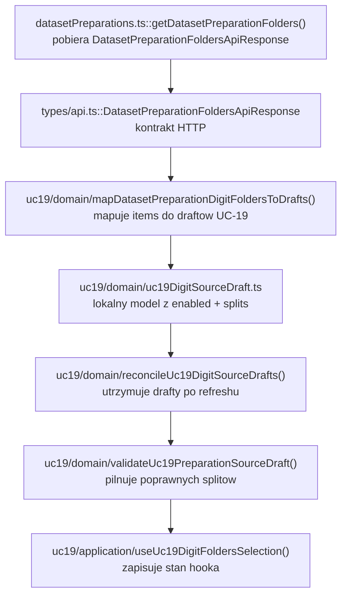
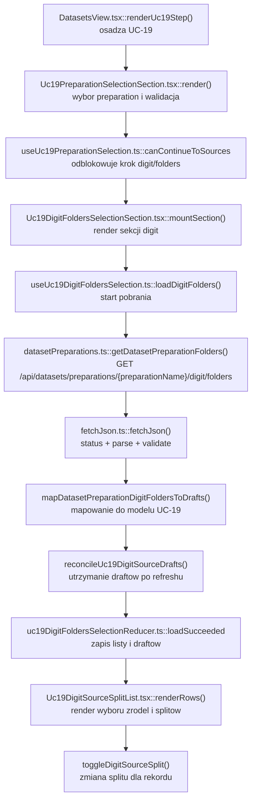

# UC-19-FE - Plan implementacyjny dla `GET /api/datasets/preparations/{preparationName}/digit/folders`

## 1) Przeznaczenie endpointa
- Endpoint `GET /api/datasets/preparations/{preparationName}/digit/folders` zwraca liste logicznych zrodel typu `digit` dla wybranego `preparation`.
- W `UC-19` ten endpoint nie jest tylko read-only podgladem jak w `UC-18`, ale jednym z dwoch wejsc do konfiguracji builda finalnego datasetu `.npz`.
- Z perspektywy `FE` endpoint:
  - pobiera kandydatow `digit`, ktorzy moga trafic do payloadu `POST /api/datasets/processed`,
  - daje operatorowi liste nazw folderow, ktore beda potem mapowane na `sources[].name`,
  - pozwala wlaczyc lub wylaczyc zrodlo `digit` do builda,
  - pozwala przypisac splity `mix` albo `train/val/test`,
  - nie pobiera pojedynczych obrazow cyfr,
  - nie pobiera indeksow runtime,
  - nie wykonuje delete,
  - nie komunikuje sie bezposrednio z `ML`.
- `Backend` pozostaje jedynym zrodlem prawdy dla:
  - istnienia `preparationName`,
  - listy zrodel `digit`,
  - kolejnosci rekordow,
  - `totalCount`,
  - tego, czy wskazane `sourceName` jest legalnym wejsciem do dalszego builda.
- W `UC-19` odpowiedz tego endpointa jest jednym z wejsc do formularza builda:
  - `board/folders` dostarcza zrodla typu `board`,
  - `digit/folders` dostarcza zrodla typu `digit`,
  - lokalny stan `FE` dopiero sklada z nich finalne drafty do `POST /api/datasets/processed`.

## 2) Zakres planu
- Plan dotyczy wylacznie `FE`.
- Plan nie projektuje `BE` ani `ML`; uwzglednia tylko publiczny kontrakt endpointa i miejsce tego kroku w `UC-19`.
- Nie nalezy sugerowac sie obecna implementacja `BE` i `ML` poza ustalonym kontraktem use-case'u.
- Plan musi respektowac juz istniejace typy, nazwy plikow i odpowiedzialnosci dodane w:
  - `UC-17`,
  - `UC-18`,
  - istniejacej czesci `UC-19`.
- Plan jest warstwowy i trzyma MVVC:
  - `Model`,
  - `View`,
  - `ViewController`,
  - `Infrastructure`.
- Dokument opisuje tylko etap `digit/folders`, ale pokazuje jego miejsce w szerszym flow `UC-19`, bo w przeciwnym razie latwo byloby:
  - reuse'owac nie ten komponent,
  - pomieszac ten krok z read-only `UC-18`,
  - albo zbudowac zbyt mocny coupling do legacy `UC-12`.

## 3) Miejsce endpointa w docelowym workflow `UC-19`
1. Uzytkownik wybiera `preparation` przez:
   - `GET /api/datasets/preparations`
   - `GET /api/datasets/preparations/{preparationName}`.
2. `FE` potwierdza, ze wybrane `preparationName` nadal jest poprawne i gotowe do dalszego kroku.
3. `FE` wywoluje:
   - `GET /api/datasets/preparations/{preparationName}/board/folders`
   - `GET /api/datasets/preparations/{preparationName}/digit/folders`.
4. `BE` zwraca logiczna liste nazw folderow `digit`.
5. `FE` renderuje te nazwy jako kandydatow do wlaczenia w build `.npz`.
6. Operator:
   - zaznacza, ktore zrodla `digit` maja wejsc do builda,
   - przypisuje im splity `mix` albo `train/val/test`,
   - nie oglada pojedynczych probek.
7. Lokalny stan `FE` laczy drafty `board` i `digit`.
8. Dopiero po zebraniu poprawnych zrodel `board` i `digit` `FE` sklada payload do `POST /api/datasets/processed`.

Wniosek:
- W `UC-19` `digit/folders` jest krokiem konfiguracji builda, a nie read-only dodatkiem informacyjnym jak w `UC-18`.
- Nie wolno reuse'owac 1:1 hooka ani widoku `UC-18` dla `digit`, bo tamten krok:
  - nie utrzymuje draftow splitow,
  - nie wspiera wielu zaznaczonych zrodel,
  - ma inna semantyke biznesowa.

## 4) Glowne zalozenia architektoniczne
- Aktualna architektura FE formalnie pozostaje `TBD`, ale repo jest praktycznie:
  - `feature-based`,
  - warstwowe,
  - z rozdzialem `app`, `features`, `api`, `shared`, `types`.
- Dla tego endpointa nalezy utrzymac podzial:
  - `Model`: kontrakt transportowy, lokalny model zrodla `digit` dla `UC-19`, lokalne reguly draftu splitow,
  - `View`: lista zrodel `digit`, checkbox wlaczenia, kontrolki splitow, stany `loading/error/empty/success`,
  - `ViewController`: pobranie listy, abort, retry, utrzymanie draftow zrodel, reset nieaktualnych wpisow po refreshu,
  - `Infrastructure`: klient HTTP, walidacja JSON, mapowanie bledow.
- `FE` nie moze:
  - skanowac katalogow,
  - zgadywac listy `digit` na podstawie details endpointu,
  - budowac listy z `UC-18` przez import gotowego hooka read-only,
  - rozmawiac z `ML`,
  - pobierac artefaktow technicznych z runtime.
- Zasada generycznosci:
  - usluga HTTP juz jest generyczna po `folderType`,
  - nie trzeba tworzyc nowego klienta tylko dla `UC-19`,
  - nowa logika ma byc generyczna tam, gdzie dotyczy:
    - splitow,
    - walidacji aktywnego draftu,
    - pogodzenia draftow po refreshu,
    - ewentualnie wspolnego loadera dla `board` i `digit`,
  - ale domena i widok `UC-19` moga pozostac endpoint-specific, jesli to ogranicza ryzyko zmian w juz dzialajacej czesci `board`.
- Zasada warstwowa:
  - `Infrastructure` ma tylko pobrac i zwalidowac kontrakt,
  - `ViewController` ma zrobic stan listy i draftow,
  - `Model` ma pilnowac zgodnosci splitow,
  - `View` ma byc cienki i nie zawierac `fetch`.

## 5) Co juz istnieje i nalezy reuse'owac
- Istnieje klient HTTP preparation:
  - `src/Frontend/src/api/datasetPreparations.ts`
- Istnieje helper transportowy:
  - `src/Frontend/src/api/shared/fetchJson.ts`
- Istnieja kontrakty API:
  - `src/Frontend/src/types/api.ts`
- Istnieje juz transport dla tego endpointa:
  - `getDatasetPreparationFolders(apiBaseUrl, preparationName, folderType, accessToken, signal)`
- Istnieje juz guard odpowiedzi:
  - `isDatasetPreparationFoldersApiResponse()`
- Istnieje juz shell `UC-19` dla wyboru preparation:
  - `src/Frontend/src/features/uc19/api/Uc19PreparationSelectionSection.tsx`
  - `src/Frontend/src/features/uc19/application/useUc19PreparationSelection.ts`
- Istnieje juz krok `board` w `UC-19`:
  - `src/Frontend/src/features/uc19/api/Uc19BoardFoldersSelectionSection.tsx`
  - `src/Frontend/src/features/uc19/api/Uc19BoardSourceSplitList.tsx`
  - `src/Frontend/src/features/uc19/application/useUc19BoardFoldersSelection.ts`
  - `src/Frontend/src/features/uc19/application/uc19BoardFoldersSelectionReducer.ts`
  - `src/Frontend/src/features/uc19/application/uc19BoardFoldersSelectionTypes.ts`
  - `src/Frontend/src/features/uc19/domain/uc19BoardSourceDraft.ts`
  - `src/Frontend/src/features/uc19/domain/mapDatasetPreparationBoardFoldersToDrafts.ts`
  - `src/Frontend/src/features/uc19/domain/reconcileUc19BoardSourceDrafts.ts`
  - `src/Frontend/src/features/uc19/domain/toggleUc19BoardSourceSplit.ts`
  - `src/Frontend/src/features/uc19/domain/validateUc19BoardSourceDraft.ts`
- Istnieje juz `UC-18`-owy hook read-only dla `digit/folders`:
  - `src/Frontend/src/features/uc18/application/useUc18DigitFolders.ts`

Wniosek:
- Nie dodawac nowego klienta HTTP.
- Nie dodawac nowego kontraktu transportowego.
- Nie importowac bezposrednio `useUc18DigitFolders()` do `UC-19`, bo hook ma semantyke:
  - read-only,
  - bez splitow,
  - bez draftow builda.
- Dla `UC-19` trzeba reuse'owac warstwe `Infrastructure`, ale zbudowac osobny `Model` i `ViewController` dla konfiguracji builda `digit`.
- Jesli po dodaniu `digit` powstanie duplikacja logiczna z `board`, nalezy wyciagnac wspolne helpery nizej w warstwach, bez zmiany juz istniejacych publicznych nazw plikow `board`.

## 6) Model API w komunikacji z `BE`

### 6.1 Request `FE -> BE`
- Metoda i sciezka:
  - `GET /api/datasets/preparations/{preparationName}/digit/folders`
- Path params:
  - `preparationName: string`
- Query params:
  - brak
- Body:
  - brak
- Naglowki:
  - `Accept: application/json`
  - `Authorization: Bearer <token>` gdy istnieje sesja administratora

### 6.2 Model wejsciowy
- Brak payloadu JSON.
- Jedyna dana wejsciowa to poprawny `preparationName`.

### 6.3 Model wyjsciowy sukcesu
- `DatasetPreparationFoldersApiResponse`
  - `preparationName: string`
  - `type: string`
  - `items: string[]`
  - `totalCount: number`

Przyklad:

```json
{
  "preparationName": "preparation-001",
  "type": "digit",
  "items": [
    "mnist_train",
    "mnist_test"
  ],
  "totalCount": 2
}
```

### 6.4 Model bledu
- `ErrorApiResponse`
  - `errorType: string`
  - `message: string`

### 6.5 Reguly kontraktowe
- Nie zmieniac nazw:
  - `DatasetPreparationFoldersApiResponse`
  - `ErrorApiResponse`
- Dane transportowe pozostaja w `camelCase`.
- `type` w transporcie pozostaje `string`.
- Dla tego endpointa `FE` oczekuje finalnie `type === "digit"`.
- Odpowiedz `200` z `type != "digit"` jest bledem kontraktu, a nie czesciowym sukcesem.
- `items` to nazwy folderow, ktore pozniej maja byc kopiowane 1:1 do:
  - refaktoryzowanego `CreateProcessedDatasetApiEntry.sources[].name` w dalszej czesci `UC-19`.
- `FE` nie moze:
  - normalizowac wielkosci liter,
  - obcinac nazw,
  - deduplikowac po swojemu,
  - sortowac alfabetycznie bez wymagania.

## 7) Zachowanie z kazdej warstwy MVVC

### Model
- Obejmuje:
  - transport `DatasetPreparationFoldersApiResponse`,
  - lokalny model `UC-19` dla zrodla `digit`,
  - lokalny draft splitow dla pojedynczego zrodla,
  - logike pogodzenia draftow po refreshu,
  - regule `mix` wyklucza `train/val/test`.
- `Model` nie zna:
  - Reacta,
  - `fetch`,
  - `AbortController`,
  - statusow HTTP.

### View
- Obejmuje:
  - panel listy zrodel `digit` w `UC-19`,
  - licznik rekordow,
  - akcje `Odswiez liste digit`,
  - stany `loading/error/empty/success`,
  - lokalna interakcje:
    - wlacz / wylacz zrodlo,
    - ustaw splity,
    - pokaz, ktore zrodla sa wybrane do builda.
- `View` nie:
  - buduje URL-i,
  - nie waliduje kontraktu,
  - nie pobiera pojedynczych probek,
  - nie resetuje sesji.

### ViewController
- Obejmuje:
  - `loadDigitFolders(preparationName)`,
  - `retryLoadDigitFolders()`,
  - utrzymanie listy zrodel,
  - utrzymanie lokalnych draftow splitow,
  - pogodzenie draftow po refreshu,
  - `AbortController`,
  - reakcje na `401`,
  - wyczyszczenie zrodel po zmianie `preparationName`,
  - lekkie logowanie diagnostyczne.
- `ViewController` dla `UC-19` nie powinien:
  - dziedziczyc po read-only `UC-18`,
  - importowac 1:1 logiki `board`, jesli wymaga to masowego rename'u istniejacych plikow,
  - przechowywac stanu w komponencie `View`.

### Infrastructure
- Obejmuje:
  - `getDatasetPreparationFolders()`,
  - `fetchJson()`,
  - guard odpowiedzi JSON,
  - `buildAuthHeaders()`,
  - mapowanie bledow na `DatasetPreparationsApiError`.
- To jest juz gotowe i powinno byc reuse'owane bez duplikacji.

## 8) Pliki per warstwa i odpowiedzialnosci

### 8.1 View
- `[REUSE + ADJUST]` `src/Frontend/src/features/uc19/api/Uc19PreparationSelectionSection.tsx`
  - pozostaje shellem `UC-19`;
  - po sekcji `board` powinien osadzic tez krok `digit/folders`;
  - nie powinien przenosic do siebie logiki requestow `digit`.
- `[ADD]` `src/Frontend/src/features/uc19/api/Uc19DigitFoldersSelectionSection.tsx`
  - glowny widok endpointa `digit/folders` w kontekscie `UC-19`;
  - renderuje liste zrodel `digit`,
  - pokazuje zaznaczenie zrodel do builda,
  - pokazuje kontrolki splitow per zrodlo,
  - nie zna `fetch`.
- `[ADD]` `src/Frontend/src/features/uc19/api/Uc19DigitSourceSplitList.tsx`
  - czysto prezentacyjna lista rekordow `digit`;
  - renderuje:
    - nazwe folderu,
    - wlaczenie / wylaczenie,
    - split chips / checkboxy,
    - lokalne hinty walidacyjne.
- `[REUSE]` `src/Frontend/src/features/uc19/api/Uc19BoardSourceSplitList.tsx`
  - pozostaje istniejacym komponentem `board`;
  - jesli po dodaniu `digit` duplikacja JSX bedzie znaczaca, mozna wewnetrznie wydzielic maly wspolny komponent pomocniczy, ale bez zrywania juz dodanego API pliku.
- `[REUSE + UPDATE]` `src/Frontend/src/features/uc19/api/index.ts`
  - publiczny entry point feature'a `UC-19`;
  - eksportuje nowy panel `digit`.
- `[REUSE]` `src/Frontend/src/app/views/DatasetsView.tsx`
  - shell krokow datasetowych juz istnieje;
  - nie wymaga nowego kroku nawigacyjnego, bo `digit/folders` jest nadal czescia `uc19`.
- `[REUSE]` `src/Frontend/src/styles/datasets.css`
  - style listy, badge'y, chips splitow, bannerow i disabled state.

### 8.2 ViewController
- `[ADD]` `src/Frontend/src/features/uc19/application/useUc19DigitFoldersSelection.ts`
  - glowny hook use-case'u dla `digit/folders` w `UC-19`;
  - pobiera liste zrodel `digit`,
  - utrzymuje drafty zrodel wybranych do builda,
  - wspiera retry, abort i reset po zmianie `preparationName`.
- `[ADD]` `src/Frontend/src/features/uc19/application/uc19DigitFoldersSelectionReducer.ts`
  - reduktor czystego stanu listy i draftow `digit`.
- `[ADD]` `src/Frontend/src/features/uc19/application/uc19DigitFoldersSelectionTypes.ts`
  - typy stanu, akcji i interfejs publiczny hooka.
- `[OPTIONAL ADD - PREFERRED]` `src/Frontend/src/features/uc19/application/useUc19PreparationFoldersSelectionResource.ts`
  - wewnetrzny, wspolny loader dla `board | digit`, jesli chcemy usunac duplikacje:
    - request,
    - abort,
    - retry,
    - error mapping,
    - zachowanie danych podczas refreshu;
  - nie musi byc publicznym API feature'a.
- `[OPTIONAL ADD - PREFERRED]` `src/Frontend/src/features/uc19/application/uc19PreparationFoldersSelectionResourceReducer.ts`
  - czysty reducer wspolnego stanu odczytu listy folderow.
- `[OPTIONAL ADD - PREFERRED]` `src/Frontend/src/features/uc19/application/uc19PreparationFoldersSelectionResourceTypes.ts`
  - typy stanu i akcji wspolnego loadera.
- `[REUSE + POSSIBLE INTERNAL REFACTOR]` `src/Frontend/src/features/uc19/application/useUc19BoardFoldersSelection.ts`
  - zachowuje obecna nazwe i publiczny interfejs;
  - jesli wydzielimy wspolny loader, ma go reuse'owac wewnetrznie bez zmiany obecnego kontraktu hooka.
- `[REUSE]` `src/Frontend/src/features/uc19/application/useUc19PreparationSelection.ts`
  - dostarcza wybrane `preparationName` i gating do wejscia w kroki `board` i `digit`.
- `[CONTEXT ONLY]` `src/Frontend/src/features/uc18/application/useUc18DigitFolders.ts`
  - pokazuje kontrakt i zachowanie transportowe read-only;
  - nie powinien byc importowany 1:1 do `UC-19`.

### 8.3 Model
- `[REUSE]` `src/Frontend/src/types/api.ts`
  - zrodlo prawdy dla `DatasetPreparationFoldersApiResponse`.
- `[ADD]` `src/Frontend/src/features/uc19/domain/uc19DigitSourceDraft.ts`
  - lokalny model domenowy rekordu `digit` dla builda;
  - np.:
    - `preparationName`
    - `folderName`
    - `type`
    - `key`
    - `enabled`
    - `splits`
- `[ADD]` `src/Frontend/src/features/uc19/domain/mapDatasetPreparationDigitFoldersToDrafts.ts`
  - mapuje transport do lokalnych draftow `UC-19`;
  - pilnuje `type === "digit"`.
- `[ADD]` `src/Frontend/src/features/uc19/domain/reconcileUc19DigitSourceDrafts.ts`
  - po refreshu zachowuje tylko te drafty, ktore nadal istnieja w odpowiedzi backendu;
  - usuwa nieaktualne wpisy.
- `[REUSE + PREFERRED UOGOLNIENIE]` `src/Frontend/src/features/uc19/domain/toggleUc19BoardSourceSplit.ts`
  - obecnie zawiera logike wspolna dla splitow;
  - preferowane jest wydzielenie wspolnego helpera, np. `toggleUc19PreparationSourceSplit.ts`, a ten plik `board` moze stac sie cienkim adapterem lub zostac przepiety wewnetrznie.
- `[REUSE + PREFERRED UOGOLNIENIE]` `src/Frontend/src/features/uc19/domain/validateUc19BoardSourceDraft.ts`
  - obecnie zawiera logike wspolna dla walidacji splitow;
  - preferowane jest wydzielenie wspolnego helpera, np. `validateUc19PreparationSourceDraft.ts`, przy zachowaniu kompatybilnosci istniejacego pliku `board`.
- `[REUSE + PREFERRED UOGOLNIENIE]` `src/Frontend/src/features/uc19/domain/reconcileUc19BoardSourceDrafts.ts`
  - logika pogodzenia draftow po refreshu jest prawie identyczna dla `board` i `digit`;
  - jesli wprowadzamy wspolny helper, nie zmieniac zewnetrznych nazw juz uzywanych przez `board`.
- `[CONTEXT ONLY]` `src/Frontend/src/features/uc19/domain/uc19BoardSourceDraft.ts`
  - istnieje jako model dla `board`;
  - nie trzeba go zmieniac, jesli dodanie `digit` bedzie bezpieczniejsze przez osobny model.

### 8.4 Infrastructure
- `[REUSE]` `src/Frontend/src/api/datasetPreparations.ts`
  - klient HTTP:
    - `getDatasetPreparationFolders()`
    - `isDatasetPreparationFoldersApiResponse()`
- `[REUSE]` `src/Frontend/src/api/shared/fetchJson.ts`
  - wspolny mechanizm:
    - `fetch`
    - parse
    - validate
    - errorFactory

### 8.5 Pliki sasiednie i downstream
- `[DOWNSTREAM / REUSE LATER]` `src/Frontend/src/api/datasets.ts`
  - tu znajduje sie obecny klient `POST /api/datasets/processed`;
  - osobny plan powinien zrefaktorowac go z modelu `raw` na model `preparation`.
- `[DOWNSTREAM / REUSE LATER]` `src/Frontend/src/features/uc19/api/Uc19BoardFoldersSelectionSection.tsx`
  - stanowi krok sasiedni;
  - `digit` powinien zachowywac podobny poziom odpowiedzialnosci, ale nie musi miec identycznych nazw i komunikatow.
- `[CONTEXT ONLY]` `src/Frontend/src/features/uc18/api/Uc18DigitFoldersPanel.tsx`
  - ekran read-only z `UC-18`;
  - nie jest docelowym ekranem konfiguracji builda.
- `[LEGACY / NIE ROZWIJAC]` `src/Frontend/src/components/Uc12DatasetPreparationSection.tsx`
  - stary workflow `raw -> processed`;
  - nie powinien byc fallbackiem dla `UC-19`.

## 9) Co nalezy dodac lub dopracowac
- Nie trzeba dodawac nowego klienta HTTP ani nowego typu transportowego.
- Trzeba dodac osobny `UC-19`-owy stan i widok dla `digit/folders`, bo obecny `UC-18`:
  - jest read-only,
  - nie utrzymuje splitow,
  - nie prowadzi do finalnego payloadu builda.
- Lokalny model `UC-19` musi wspierac:
  - wiele zaznaczonych zrodel,
  - osobne splity per zrodlo,
  - walidacje `mix` vs `train/val/test`,
  - bezpieczne pogodzenie stanu po odswiezeniu listy.
- Preferowane jest wydzielenie wspolnych helperow splitow i walidacji, bo logika `board` i `digit` jest tu semantycznie taka sama.
- Nie robic duzego refaktoru nazw juz dodanych plikow `board`, jesli wystarczy:
  - dopisac nowe pliki `digit`,
  - albo dodac wspolne helpery nizej i wewnetrznie przepiac `board`.

## 10) Glowne funkcje
- `getDatasetPreparationFolders()`
- `isDatasetPreparationFoldersApiResponse()`
- `useUc19DigitFoldersSelection()`
- `loadDigitFolders()`
- `retryLoadDigitFolders()`
- `toggleDigitSourceEnabled()`
- `toggleDigitSourceSplit()`
- `updateDigitSourceSplits()`
- `reconcileUc19DigitSourceDrafts()`
- `validateUc19PreparationSourceDraft()` lub `validateUc19DigitSourceDraft()`
- `mapDatasetPreparationDigitFoldersToDrafts()`
- `Uc19DigitFoldersSelectionSection()`
- `Uc19DigitSourceSplitList()`
- `fetchJson()`

Jesli wdrazamy uogolnienie:
- `useUc19PreparationFoldersSelectionResource()`
- `toggleUc19PreparationSourceSplit()`
- `reconcileUc19PreparationSourceDrafts()`

## 11) Zachowanie endpointa w `UC-19`
- Po poprawnym wyborze `preparationName` widok uruchamia pobranie listy `digit/folders`.
- Widok pokazuje:
  - nazwe wybranego `preparation`,
  - licznik `totalCount`,
  - liste nazw folderow,
  - stan zaznaczenia do builda,
  - lokalne splity per zrodlo,
  - przycisk odswiezenia.
- Endpoint nie powinien:
  - otwierac listy pojedynczych obrazow cyfr,
  - ladowac preview,
  - wykonywac usuwania,
  - pobierac runtime `index.json`.
- Po zaznaczeniu zrodla operator ustawia splity lokalnie, a `FE` trzyma draft do czasu finalnego `POST /api/datasets/processed`.
- Odwzorowanie na payload downstream:
  - `folderName` z odpowiedzi backendu -> `sources[].name`
  - stale `type = "digit"` -> `sources[].type`
  - lokalny stan splitow -> `sources[].splits`

## 12) Specyficzna logika i pseudokod

### 12.1 Ladowanie listy `digit/folders`

```text
loadDigitFolders(preparationName):
  normalizedPreparationName = preparationName.trim()

  if normalizedPreparationName is empty:
    reset state
    return

  abort previous request
  set state = loading

  response = getDatasetPreparationFolders(
    apiBaseUrl,
    normalizedPreparationName,
    "digit",
    accessToken,
    signal
  )

  drafts = mapDatasetPreparationDigitFoldersToDrafts(response)
  reconciledDrafts = reconcileUc19DigitSourceDrafts(previousDrafts, drafts)

  set state = success(reconciledDrafts, response.totalCount)
```

### 12.2 Mapowanie transportu do lokalnego modelu `UC-19`

```text
mapDatasetPreparationDigitFoldersToDrafts(response):
  if response.type != "digit":
    throw contract error

  return response.items.map(folderName => ({
    key: `digit:${folderName}`,
    preparationName: response.preparationName,
    folderName,
    type: "digit",
    enabled: false,
    splits: []
  }))
```

### 12.3 Pogodzenie draftow po refreshu

```text
reconcileUc19DigitSourceDrafts(previousDrafts, freshDrafts):
  byName = map previousDrafts by folderName

  result = []
  removedDrafts = []

  for each freshDraft in freshDrafts:
    previous = byName[freshDraft.folderName]

    if previous exists:
      result.push({
        ...freshDraft,
        enabled: previous.enabled,
        splits: previous.splits
      })
    else:
      result.push(freshDraft)

  for each previousDraft in previousDrafts:
    if not freshDrafts contains previousDraft.folderName and previousDraft.enabled:
      removedDrafts.push(previousDraft.folderName)

  return { drafts: result, removedDrafts }
```

### 12.4 Zmiana splitow dla pojedynczego zrodla

```text
toggleDigitSourceSplit(previousSplits, split):
  if split == "mix":
    return previousSplits includes "mix" ? [] : ["mix"]

  withoutMix = previousSplits.filter(item => item != "mix")

  if withoutMix includes split:
    return withoutMix.filter(item => item != split)

  return [...withoutMix, split]
```

### 12.5 Walidacja pojedynczego draftu

```text
validateDigitSourceDraft(draft):
  if draft.enabled is false:
    return valid

  if draft.splits.length == 0:
    return invalid("Wybierz split dla zrodla digit.")

  if draft.splits includes "mix" and draft.splits.length > 1:
    return invalid("Split mix nie moze byc laczony z train/val/test.")

  return valid
```

### 12.6 Spiecie z krokiem wyboru preparation

```text
Uc19PreparationSelectionSection():
  selection = useUc19PreparationSelection(...)

  boardFolders = useUc19BoardFoldersSelection({
    preparationName: selection.canContinueToSources ? selection.selectedPreparationName : null
  })

  digitFolders = useUc19DigitFoldersSelection({
    preparationName: selection.canContinueToSources ? selection.selectedPreparationName : null
  })

  render:
    step 1 = lista preparation
    step 2 = walidacja preparation
    step 3 = board/folders
    step 4 = digit/folders
```

## 13) Wyjatki, fallbacki i zachowanie bledowe

### 13.1 Statusy HTTP
- `200 OK`
  - lista poprawna;
  - moze byc pusta.
- `401 Unauthorized`
  - sesja administratora wygasla albo token jest niepoprawny;
  - `FE` wywoluje `onUnauthorized()`.
- `403 Forbidden`
  - operator nie ma dostepu do kroku administracyjnego;
  - `FE` pokazuje blad bez automatycznego retry.
- `404 Not Found`
  - `preparationName` nie istnieje albo zostalo usuniete;
  - `FE` traktuje to jako stale wejscie i blokuje dalsza konfiguracje.
- `500 Internal Server Error`
  - blad backendu.
- `502`, `503`, `504`
  - blad infrastrukturalny na sciezce przegladarka -> nginx -> backend.

### 13.2 Bledy kontraktu
- Jesli odpowiedz `200` ma zly ksztalt:
  - traktowac jako blad techniczny,
  - nie zamieniac tego na pusta liste,
  - nie zgadywac brakujacych pol.
- Jesli `/digit/folders` zwroci `type = "board"` albo inny typ:
  - traktowac jako blad kontraktu,
  - nie renderowac listy jako sukcesu.

### 13.3 Fallbacki dopuszczalne
- Zachowanie poprzedniej listy podczas kolejnego `loading` dla tego samego `preparationName`.
- Zachowanie poprzednich draftow tylko dla zrodel, ktore nadal istnieja po refreshu.
- Zachowanie poprzedniej listy przy chwilowym `5xx`, jesli `preparationName` sie nie zmienil.
- Wyczyszczenie tylko tych draftow, ktore zniknely z odpowiedzi backendu.

### 13.4 Fallbacki niedopuszczalne
- Zgadywanie listy `digit` na podstawie:
  - `details.sources`,
  - cache'a `UC-18`,
  - innych endpointow.
- Samodzielne sortowanie odpowiedzi po stronie FE bez wymagania.
- Przejscie `FE -> ML`.
- Reuse calego `useUc18DigitFolders()` jako gotowego kroku builda.
- Traktowanie tego kroku jako read-only w `UC-19`, skoro use-case wymaga draftow splitow.

### 13.5 Zachowanie UI
- `idle`
  - brak poprawnego `preparationName`.
- `loading`
  - pokazuje banner ladowania;
  - moze zachowac poprzednia liste dla tego samego `preparationName`.
- `error`
  - pokazuje blad i blokuje dalszy krok.
- `success + empty`
  - pokazuje informacje, ze preparation nie ma zrodel `digit`.
- `success + data`
  - lista jest interaktywna i pozwala:
    - wlaczyc zrodlo do builda,
    - ustawic splity.

## 14) Logging i diagnostyka FE
- Logowanie ma pomagac diagnozowac problemy, ale nie moze spamowac.

### `console.info`
- start ladowania `digit/folders`,
- reczne odswiezenie listy,
- sukces pobrania listy wraz z `totalCount`,
- liczba aktualnie zaznaczonych zrodel po zmianie, jesli ma wartosc diagnostyczna.

### `console.warn`
- `401` i czyszczenie sesji,
- `404` dla stalego `preparationName`,
- usuniecie zaznaczonego draftu po odswiezeniu,
- proba przejscia dalej z niepoprawnymi splitami.

### `console.error`
- `5xx`,
- bledny ksztalt odpowiedzi,
- niespojny `type`,
- nieprzetwarzalna odpowiedz backendu.

### Guardraile logowania
- nie logowac tokena,
- nie logowac pelnej odpowiedzi backendu,
- nie logowac calej listy `items`,
- nie logowac kazdego rerenderu,
- logowac tylko lekkie metadane:
  - `preparationName`,
  - `type`,
  - `httpStatus`,
  - `errorType`,
  - `totalCount`,
  - `selectedCount`,
  - `removedDraftsCount`.

## 15) Mermaid flowchart - flow modeli



## 16) Mermaid flowchart - logika aplikacji z funkcjami



## 17) Opis przeplywu w obrebie `BE` potrzebny frontendowi
Ta sekcja opisuje tylko kontraktowe minimum potrzebne `FE`.

1. `FE` wysyla `GET /api/datasets/preparations/{preparationName}/digit/folders`.
2. `BE` weryfikuje autoryzacje.
3. `BE` rozpoznaje `preparationName`.
4. `BE` odczytuje logiczna liste zrodel typu `digit`.
5. `BE` zwraca:
   - `preparationName`,
   - `type = "digit"`,
   - `items`,
   - `totalCount`.
6. `BE` nie powinien wywolywac `ML` dla tego endpointa.
7. `FE` nie powinien zakladac nic o fizycznym layoutcie katalogow poza semantyka kontraktu.

## 18) Workflow GitHub i runtime
- Dla tego endpointa nie jest potrzebna nowa zmienna srodowiskowa FE.
- Obowiazujacy workflow:
  - `.github/workflows/frontend-cd.yml`
  - buduje FE z:
    - `VITE_API_BASE_URL="${FE_VITE_API_BASE_URL:-/api}"`.
- W local:
  - `FE` powinien dzialac na stalym `/api` albo lokalnym `VITE_API_BASE_URL`;
  - po stronie FE nie dotykamy `appsettings`;
  - lokalne przypisanie pozostaje "na sztywno" przez obecny mechanizm `VITE_API_BASE_URL` / `/api`.
- W produkcji:
  - workflow backendowy moze podstawic produkcyjne `appsettings`,
  - ten plan FE nie moze od tego zalezec inaczej niz przez publiczny adres `/api`.
- Wniosek:
  - nie dodawac nowego env-a,
  - nie hardcodowac URL-i produkcyjnych,
  - nie traktowac workflow jako zrodla prawdy dla listy `digit`.

## 19) Kolejnosc implementacji kodu dla historyjki
1. Zweryfikowac, ze `src/Frontend/src/api/datasetPreparations.ts` pozostaje jedynym klientem `digit/folders`.
2. Zweryfikowac, ze `src/Frontend/src/types/api.ts` nie wymaga nowego kontraktu transportowego.
3. Dodac model domenowy `UC-19` dla zrodla `digit` i helpery mapowania / reconcile.
4. Dodatkowo ocenic, czy logika:
   - splitow,
   - walidacji,
   - pogodzenia draftow
   powinna zostac czesciowo wyciagnieta do helperow wspolnych dla `board` i `digit`.
5. Dodac typy stanu i reducer `UC-19` dla listy `digit/folders`.
6. Dodac hook `useUc19DigitFoldersSelection()`.
7. Dodac widoki `Uc19DigitFoldersSelectionSection.tsx` i `Uc19DigitSourceSplitList.tsx`.
8. Spiac nowy panel z `useUc19PreparationSelection()` tak, aby pojawial sie dopiero po poprawnym wyborze `preparation`.
9. Dopracowac logowanie diagnostyczne.
10. Podpiac stan wybranych zrodel `digit` pod dalszy plan dla `POST /api/datasets/processed`.
11. Uruchomic kontrole jakosci FE.

## 20) Guardraile implementacyjne
- Nie tworzyc nowego klienta HTTP dla `digit/folders`.
- Nie kopiowac `useUc18DigitFolders()` 1:1 do `UC-19`.
- Nie przenosic `fetch` do komponentow React.
- Nie traktowac `items: []` jako bledu.
- Nie pobierac pojedynczych plikow lub obrazow cyfr w ramach tego kroku.
- Nie zgadywac `sources[].name` z innych danych niz odpowiedz tego endpointa.
- Nie zmieniac istniejacych nazw typow transportowych.
- Nie rozbijac `UC-19` na nowy krok steppera tylko dlatego, ze dochodzi sekcja `digit`.
- Nie dodawac ciezkiego logowania ani `console.log` na kazda akcje UI.
- Nie robic agresywnego rename'u istniejacych plikow `board`, jesli wystarczy dodanie warstwy wspolnej pod spodem.

## 21) Zaleznosci pomiedzy historyjkami

### Wejsciowe
- `UC-13`
  - dostarcza sesje administracyjna i token.
- `UC-17 GET /api/datasets/preparations`
  - daje liste preparation do wyboru.
- `UC-17 GET /api/datasets/preparations/{preparationName}`
  - potwierdza gotowosc wybranego preparation przed `digit/folders`.

### Sasiednie
- `UC-19 GET /api/datasets/preparations/{preparationName}/board/folders`
  - istnieje juz jako krok konfiguracji builda dla `board`;
  - `digit` powinien miec analogiczne zachowanie biznesowe.
- `UC-18 GET /api/datasets/preparations/{preparationName}/digit/folders`
  - istnieje juz jako krok read-only;
  - w `UC-19` reuse'ujemy kontrakt i infrastrukture, ale nie caly `ViewController`.

### Wyjsciowe
- `UC-19 POST /api/datasets/processed`
  - konsumuje `folderName` jako `sources[].name` i lokalne `splits`.
- `UC-06`
  - finalny `.npz` zbudowany po `UC-19` zasila trening.

## 22) Inne istotne reguly
- Trzymac sie istniejacych kontraktow i nazw typow z poprzednich historyjek.
- `FE` ma respektowac kolejnosc z backendu.
- `FE` ma pozostac cienki:
  - backend zwraca liste,
  - `ViewController` utrzymuje liste i drafty builda,
  - `Model` pilnuje zgodnosci splitow,
  - `View` renderuje.
- Lokalny model `UC-19` dla `digit` moze byc inny niz `UC-18`, bo obsluguje inna semantyke biznesowa.
- Generycznosc ma dotyczyc przede wszystkim:
  - klienta HTTP,
  - helpera transportowego,
  - helperow splitow i walidacji,
  - ewentualnego wspolnego loadera request/abort/retry.
- Ten endpoint ma pozostac krokiem konfiguracji, a nie miejscem realizacji calego builda `.npz`.

## 23) Plan weryfikacji minimum
- `npm run check`
- `npm run build`
- scenariusz happy path:
  - poprawny `preparationName`,
  - backend zwraca `type = "digit"`,
  - lista folderow renderuje sie poprawnie,
  - operator moze zaznaczyc zrodla i ustawic splity.
- scenariusz pustej listy:
  - `200 OK`,
  - UI pokazuje pusty stan bez bledu.
- scenariusz `401`:
  - `onUnauthorized` zostaje wywolane.
- scenariusz `404`:
  - UI pokazuje blad stalego preparation,
  - krok builda zostaje zablokowany.
- scenariusz niepoprawnego `type`:
  - odpowiedz jest traktowana jako blad kontraktowy.
- scenariusz odswiezenia:
  - zrodla nadal istniejace zachowuja zaznaczenie i splity,
  - zrodla usuniete z backendu sa zdejmowane z lokalnego draftu.
- scenariusz walidacji splitow:
  - `mix` nie laczy sie z `train/val/test`,
  - aktywne zrodlo bez splitu jest traktowane jako niepoprawne.

## 24) Podsumowanie decyzji
- Dla `GET /api/datasets/preparations/{preparationName}/digit/folders` w `UC-19` reuse'ujemy:
  - kontrakt,
  - klient HTTP,
  - helper transportowy,
  - ogolne wzorce requestu i logowania.
- Nie reuse'ujemy 1:1 calego `UC-18`-owego hooka ani widoku, bo maja inna semantyke biznesowa.
- Najwazniejsze granice odpowiedzialnosci:
  - `Infrastructure` pobiera i waliduje kontrakt,
  - `ViewController` utrzymuje liste i drafty builda,
  - `Model` pilnuje zgodnosci splitow,
  - `View` tylko renderuje i deleguje akcje.
- Najwazniejsze guardraile:
  - brak duplikacji klienta,
  - brak mieszania z read-only `UC-18`,
  - brak zgadywania danych po stronie FE,
  - brak pobierania pojedynczych plikow cyfr,
  - brak ciezkiego logowania.
- Najwazniejsza decyzja pod reuse:
  - klient `folders` pozostaje wspolny,
  - logika splitow i walidacji powinna zostac maksymalnie ujednolicona dla `board` i `digit`,
  - ale bez zrywania istniejacych nazw i struktury juz dodanej galezi `board`.
