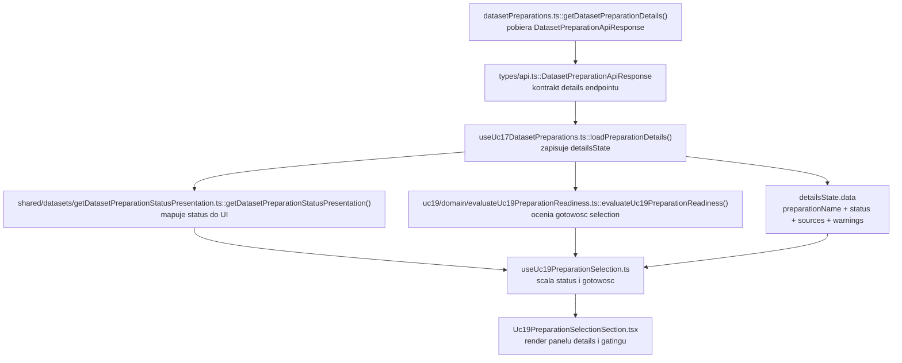
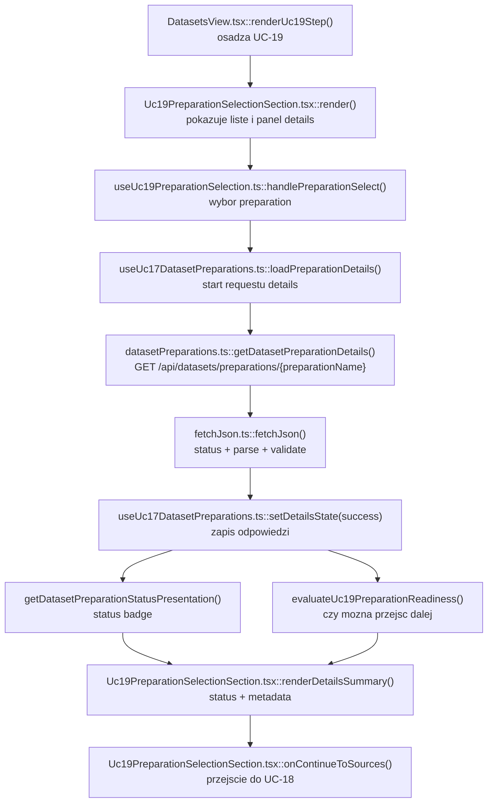

# UC-19-FE - Plan implementacyjny dla `GET /api/datasets/preparations/{preparationName}`

## 1) Przeznaczenie endpointa
- Endpoint `GET /api/datasets/preparations/{preparationName}` zwraca szczegoly i aktualny status konkretnego `preparation`.
- W `UC-19` endpoint nie jest osobnym ekranem historycznym jak w `UC-17`, tylko etapem walidacji i potwierdzenia kontekstu przed dalszym flow builda `.npz`.
- Z perspektywy `FE` endpoint:
  - potwierdza, ze wybrane `preparationName` nadal istnieje,
  - pokazuje operatorowi status, liste zrodel i ostrzezenia dla wybranego rekordu,
  - daje punkt kontroli przed pobieraniem:
    - `GET /api/datasets/preparations/{preparationName}/board/folders`
    - `GET /api/datasets/preparations/{preparationName}/digit/folders`,
  - nie zwraca list folderow `board` ani `digit`,
  - nie tworzy payloadu do `POST /api/datasets/processed`,
  - nie odczytuje fizycznych sciezek runtime,
  - nie zastępuje listy preparation z `GET /api/datasets/preparations`, tylko ja uzupelnia.
- `Backend` pozostaje jedynym zrodlem prawdy dla:
  - `status`,
  - `createdAtUtc`,
  - listy `sources`,
  - `preparedItemsCount`,
  - `warnings`,
  - istnienia wskazanego `preparationName`.

## 2) Zakres planu
- Plan dotyczy tylko `FE`.
- Plan nie projektuje implementacji `BE` ani `ML`; uwzglednia jedynie publiczny kontrakt HTTP i wymagania `UC-19`.
- Nie nalezy sugerowac sie biezaca implementacja `BE` i `ML` poza ustalonym kontraktem publicznym.
- Plan musi respektowac juz istniejace nazwy typow, hookow i pol danych dodanych we wczesniejszych historyjkach.
- Plan jest warstwowy i opiera sie o MVVC:
  - `Model`,
  - `View`,
  - `ViewController`,
  - `Infrastructure`.
- Endpoint trzeba traktowac jako element szerszego flow:
  - upstream: `GET /api/datasets/preparations`,
  - current step: `GET /api/datasets/preparations/{preparationName}`,
  - downstream:
    - `GET /api/datasets/preparations/{preparationName}/board/folders`
    - `GET /api/datasets/preparations/{preparationName}/digit/folders`
    - `POST /api/datasets/processed`.

## 3) Miejsce endpointa w docelowym workflow `UC-19`
1. Uzytkownik wchodzi w krok `UC-19` i widzi liste preparation z `GET /api/datasets/preparations`.
2. Uzytkownik wybiera konkretne `preparationName`.
3. `FE` pobiera `GET /api/datasets/preparations/{preparationName}`.
4. `BE` zwraca status, zrodla i ostrzezenia dla wybranego preparation.
5. `FE` renderuje panel potwierdzajacy kontekst builda:
   - nazwe preparation,
   - status,
   - date utworzenia,
   - liste zrodel,
   - ostrzezenia.
6. Jesli preparation nadal jest gotowe do dalszej pracy, `FE` przechodzi do pobrania:
   - `board/folders`
   - `digit/folders`.
7. Dopiero po tych krokach `FE` sklada payload do `POST /api/datasets/processed`.

Wniosek:
- W `UC-19` details endpoint nie sluzy do samego "podgladu danych", tylko do potwierdzenia, ze selection uzytkownika jest nadal spojnе z workflow builda `.npz`.
- Ten endpoint nie moze byc zastapiony lokalnym cache'em listy ani samymi licznikami z `GET /api/datasets/preparations`.

## 4) Glowne zalozenia architektoniczne
- Aktualna architektura FE formalnie pozostaje `TBD`, ale kod repo jest praktycznie:
  - `feature-based`,
  - warstwowy,
  - z podzialem na `src/app`, `src/features`, `src/api`, `src/shared`, `src/types`.
- Dla tego endpointa trzeba utrzymac podzial:
  - `Model` - kontrakty API, prezentacja statusu, interpretacja `warnings`, zasady gotowosci i stabilnosci selection,
  - `View` - panel szczegolow, stany `idle/loading/error/success`, przycisk odswiezania, komunikaty blokujace i informacyjne,
  - `ViewController` - pobranie szczegolow, abort requestu, refresh, obsluga `401`, spiecie z selection z `UC-19`,
  - `Infrastructure` - klient HTTP, walidacja JSON, mapowanie bledow transportowych.
- `FE` nie moze:
  - zgadywac szczegolow `preparation` na podstawie listy summary,
  - budowac `sources` z innych endpointow,
  - przechodzic bezposrednio do `ML`,
  - czytac layoutu runtime ani struktury katalogow,
  - traktowac `warnings` jako substytutu statusu backendowego.
- Jesli potrzebna jest usluga, najpierw trzeba sprawdzic, czy juz istnieje.
- W tym repo odpowiednie moduly juz istnieja:
  - `src/Frontend/src/api/datasetPreparations.ts`
  - `src/Frontend/src/features/uc17/application/useUc17DatasetPreparations.ts`
- Wniosek:
  - nie tworzyc nowego klienta `getDatasetPreparationDetails()`,
  - nie tworzyc nowego kontraktu `DatasetPreparationApiResponse`,
  - nie kopiowac logiki transportowej do `UC-19`,
  - w `UC-19` zrobic cienka adaptacje istniejacego flow `UC-17` zamiast duplikacji.

## 5) Co juz istnieje i nalezy reuse'owac
- Istnieje klient HTTP preparation:
  - `src/Frontend/src/api/datasetPreparations.ts`
- Istnieje helper transportowy:
  - `src/Frontend/src/api/shared/fetchJson.ts`
- Istnieja kontrakty API:
  - `src/Frontend/src/types/api.ts`
- Istnieje wspolny helper statusu:
  - `src/Frontend/src/shared/datasets/getDatasetPreparationStatusPresentation.ts`
- Istnieje hook agregujacy:
  - `GET /api/datasets/preparations`
  - `GET /api/datasets/preparations/{preparationName}`
  - `POST /api/datasets/preparations`
  w pliku:
  - `src/Frontend/src/features/uc17/application/useUc17DatasetPreparations.ts`
- Istnieje adapter `UC-19` do selection:
  - `src/Frontend/src/features/uc19/application/useUc19PreparationSelection.ts`
- Istnieje juz widok selection:
  - `src/Frontend/src/features/uc19/api/Uc19PreparationSelectionSection.tsx`
- Istnieje juz osadzenie kroku w shellu datasetowym:
  - `src/Frontend/src/app/views/DatasetsView.tsx`
  - `src/Frontend/src/app/state.ts`

Wniosek:
- Ten endpoint dla `UC-19` nie wymaga nowej infrastruktury.
- Implementacja ma polegac glownie na reuse i ewentualnym doprecyzowaniu odpowiedzialnosci pomiedzy:
  - `useUc17DatasetPreparations()`
  - `useUc19PreparationSelection()`
  - `Uc19PreparationSelectionSection.tsx`.

## 6) Model API w komunikacji z `BE`

### 6.1 Request `FE -> BE`
- Metoda i sciezka:
  - `GET /api/datasets/preparations/{preparationName}`
- Path params:
  - `preparationName: string`
- Query params:
  - brak
- Body:
  - brak
- Naglowki:
  - `Accept: application/json`
  - `Authorization: Bearer <token>` gdy istnieje aktywna sesja administratora

### 6.2 Model wejsciowy
- Brak payloadu JSON.
- Jedyna dana wejsciowa to poprawny `preparationName` w URL.

### 6.3 Model wyjsciowy sukcesu
- `DatasetPreparationApiResponse`
  - `preparationName: string`
  - `createdAtUtc: string`
  - `status: string`
  - `sources: DatasetPreparationSourceApiResponse[]`
  - `warnings: string[]`
- `DatasetPreparationSourceApiResponse`
  - `name: string`
  - `type: string`
  - `preparedItemsCount: number`

Przyklad:

```json
{
  "preparationName": "preparation-001",
  "createdAtUtc": "2026-06-19T09:15:00Z",
  "status": "completed",
  "sources": [
    {
      "name": "v1_training",
      "type": "board",
      "preparedItemsCount": 120
    },
    {
      "name": "mnist_train",
      "type": "digit",
      "preparedItemsCount": 5000
    }
  ],
  "warnings": []
}
```

### 6.4 Model bledu
- `ErrorApiResponse`
  - `errorType: string`
  - `message: string`

### 6.5 Reguly kontraktowe
- Nie zmieniac nazw:
  - `DatasetPreparationApiResponse`
  - `DatasetPreparationSourceApiResponse`
  - `ErrorApiResponse`
- Dane transportowe pozostaja w `camelCase`.
- `status` pozostaje transportowo typu `string`.
- `type` w `sources` pozostaje transportowo typu `string`.
- `FE` moze rozpoznawac znane typy `board` i `digit`, ale nie moze sie wywracac na innym `type`.
- `FE` nie liczy `preparedItemsCount` lokalnie.
- `FE` nie buduje listy zrodel do splitu z `sources`; te dane sa tylko kontekstem i walidacja dla operatora.

## 7) Zachowanie z kazdej warstwy MVVC

### Model
- Obejmuje:
  - kontrakty `DatasetPreparationApiResponse` i `DatasetPreparationSourceApiResponse`,
  - helper `getDatasetPreparationStatusPresentation()`,
  - regule gotowosci selection do dalszego kroku `UC-19`,
  - interpretacje `warnings` jako sygnalu diagnostycznego, a nie bledu krytycznego,
  - zachowanie poprzednich details tylko dla tego samego `preparationName` przy refreshu.
- `Model` nie zna:
  - Reacta,
  - `fetch`,
  - `AbortController`,
  - HTTP status codes jako logiki renderu.

### View
- Obejmuje:
  - panel "Walidacja wybranego preparation",
  - naglowek z nazwa i data utworzenia,
  - badge statusu,
  - liste `sources`,
  - liste `warnings` lub komunikat o ich braku,
  - przycisk `Odswiez szczegoly`,
  - komunikaty `loading/error/info/warning`,
  - przycisk przejscia do kolejnego kroku tylko gdy selection jest gotowe.
- `View` nie:
  - buduje URL-i,
  - nie waliduje JSON,
  - nie mapuje bledow transportowych,
  - nie decyduje o auth retry.

### ViewController
- Obejmuje:
  - `loadPreparationDetails(preparationName)`,
  - `refreshSelectedPreparation()`,
  - ustawienie i utrzymanie `selectedPreparationName`,
  - reakcje na zmiane selection z kroku listy preparation,
  - `AbortController`,
  - zachowanie poprzednich details dla tego samego rekordu podczas refreshu,
  - obsluge `401`,
  - lekkie logowanie diagnostyczne,
  - blokade przejscia dalej, gdy details lub summary wskazuja, ze preparation nie jest gotowe.

### Infrastructure
- Obejmuje:
  - `getDatasetPreparationDetails()`,
  - `fetchJson()`,
  - walidacje `DatasetPreparationApiResponse`,
  - `buildAuthHeaders()`,
  - mapowanie bledow HTTP na `DatasetPreparationsApiError`.

## 8) Pliki per warstwa i odpowiedzialnosci

### 8.1 View
- `[REUSE]` `src/Frontend/src/features/uc19/api/index.ts`
  - publiczny entry point feature'a `UC-19`.
- `[REUSE + ADJUST]` `src/Frontend/src/features/uc19/api/Uc19PreparationSelectionSection.tsx`
  - glowny widok selection i walidacji preparation dla `UC-19`;
  - renderuje liste summary oraz panel oparty o details endpoint;
  - pokazuje status, zrodla, ostrzezenia i stan gotowosci do kolejnego kroku.
- `[REUSE]` `src/Frontend/src/app/views/DatasetsView.tsx`
  - osadza `UC-19` w stepperze datasetowym;
  - przekazuje `apiBaseUrl`, `accessToken`, `onUnauthorized`;
  - utrzymuje wybrane `selectedUc19PreparationName` dla przejscia do `UC-18`.
- `[REUSE]` `src/Frontend/src/styles/datasets.css`
  - style dla kart preparation, badge statusu, bannerow i sekcji szczegolow.

### 8.2 ViewController
- `[REUSE]` `src/Frontend/src/features/uc17/application/useUc17DatasetPreparations.ts`
  - jedyne miejsce orkiestracji requestu:
    - `GET /api/datasets/preparations`
    - `GET /api/datasets/preparations/{preparationName}`
    - `POST /api/datasets/preparations`;
  - dla tego endpointa odpowiada za:
    - `loadPreparationDetails()`
    - `refreshSelectedPreparation()`
    - `detailsState`
    - `selectedPreparationName`
    - abort i obsluge bledow sesji.
- `[REUSE + ADJUST]` `src/Frontend/src/features/uc19/application/useUc19PreparationSelection.ts`
  - cienki adapter `UC-19`;
  - konsumuje `useUc17DatasetPreparations()`;
  - mapuje selection na gotowosc przejscia dalej;
  - scala dane summary i details w logike widoku `UC-19`;
  - pilnuje ostrzezen selection i downstream gating.

### 8.3 Model
- `[REUSE]` `src/Frontend/src/types/api.ts`
  - zrodlo prawdy dla:
    - `DatasetPreparationApiResponse`
    - `DatasetPreparationSourceApiResponse`
    - `DatasetPreparationListItemApiResponse`
    - `ErrorApiResponse`.
- `[REUSE]` `src/Frontend/src/shared/datasets/getDatasetPreparationStatusPresentation.ts`
  - wspolne mapowanie `status -> label/className/description`.
- `[REUSE]` `src/Frontend/src/features/uc19/domain/evaluateUc19PreparationReadiness.ts`
  - ocenia, czy preparation moze odblokowac dalszy krok `UC-19`.

### 8.4 Infrastructure
- `[REUSE]` `src/Frontend/src/api/datasetPreparations.ts`
  - klient `getDatasetPreparationDetails()`;
  - guard odpowiedzi `DatasetPreparationApiResponse`.
- `[REUSE]` `src/Frontend/src/api/shared/fetchJson.ts`
  - wspolny mechanizm:
    - `fetch`
    - parse
    - validate
    - errorFactory.

### 8.5 Pliki sasiednie i downstream
- `[DOWNSTREAM / REUSE LATER]` `src/Frontend/src/features/uc18/api/Uc18BoardFoldersSection.tsx`
  - kolejny krok po poprawnym wyborze `preparationName`.
- `[DOWNSTREAM / REUSE LATER]` `src/Frontend/src/features/uc18/application/useUc18BoardFolders.ts`
  - pobiera `board/folders`.
- `[DOWNSTREAM / REUSE LATER]` `src/Frontend/src/features/uc18/application/useUc18DigitFolders.ts`
  - pobiera `digit/folders`.
- `[LEGACY / NIE ROZWIJAC]` `src/Frontend/src/components/Uc12DatasetPreparationSection.tsx`
  - stary workflow `raw -> processed`;
  - nie powinien byc fallbackiem dla `UC-19`.

## 9) Co nalezy dodac lub dopracowac
- Nie trzeba dodawac nowej uslugi HTTP.
- Nie trzeba dodawac nowego kontraktu API.
- Nalezy dopracowac, aby `UC-19` traktowalo details endpoint jako zrodlo:
  - walidacji istnienia selection,
  - widoku zrodel i ostrzezen,
  - finalnego potwierdzenia przed przejsciem do `UC-18`.
- Jezeli aktualny JSX w `Uc19PreparationSelectionSection.tsx` stanie sie zbyt duzy, mozna wydzielic maly komponent prezentacyjny dla panelu szczegolow, ale tylko jesli realnie uprosciloby to warstwy.
- Nie przenosic logiki requestow do komponentu prezentacyjnego.
- Nie duplikowac helpera statusu ani logiki gotowosci w drugim miejscu.

## 10) Glowne funkcje
- `getDatasetPreparationDetails()`
- `fetchJson()`
- `useUc17DatasetPreparations()`
- `loadPreparationDetails()`
- `refreshSelectedPreparation()`
- `handleUnauthorizedError()`
- `logPreparationsError()`
- `useUc19PreparationSelection()`
- `handlePreparationSelect()`
- `evaluateUc19PreparationReadiness()`
- `getDatasetPreparationStatusPresentation()`
- `Uc19PreparationSelectionSection()`

## 11) Zachowanie endpointa w `UC-19`
- Po kliknieciu wyboru preparation `FE` pobiera details endpoint.
- W stanie `loading` widok moze zachowac ostatnie details, ale tylko gdy dotycza tego samego `preparationName`.
- Po sukcesie:
  - renderowana jest nazwa preparation,
  - renderowana jest data utworzenia,
  - renderowany jest status,
  - renderowana jest lista `sources`,
  - renderowane sa `warnings`,
  - oceniana jest gotowosc do przejscia dalej.
- Details endpoint nie powinien:
  - automatycznie pobierac `board/folders`,
  - automatycznie pobierac `digit/folders`,
  - skladac requestu do `POST /api/datasets/processed`.
- Details endpoint ma byc cienkim krokiem potwierdzenia kontekstu, nie miejscem realizacji calego build flow.

## 12) Wyjatki, fallbacki i zachowanie bledowe

### 12.1 Statusy HTTP
- `200 OK`
  - poprawne szczegoly preparation.
- `401 Unauthorized`
  - sesja administratora wygasla lub token jest niepoprawny;
  - `FE` wywoluje `onUnauthorized()`.
- `403 Forbidden`
  - operator nie ma dostepu do zasobu;
  - `FE` pokazuje blad bez automatycznego retry.
- `404 Not Found`
  - wskazane `preparationName` nie istnieje albo zostalo usuniete;
  - `FE` traktuje to jako stale selection i blokuje dalszy krok.
- `500 Internal Server Error`
  - blad backendu.
- `502`, `503`, `504`
  - blad infrastrukturalny na sciezce przegladarka -> nginx -> backend.

### 12.2 Bledy kontraktu
- Jesli odpowiedz `200` nie spelnia `DatasetPreparationApiResponse`:
  - traktowac to jako blad techniczny,
  - nie zamieniac odpowiedzi na pusty sukces,
  - nie zgadywac brakujacych pol,
  - nie rekonstruowac `sources` z innych endpointow.

### 12.3 Fallbacki dopuszczalne
- Zachowanie poprzednich details przy refreshu tego samego `preparationName`.
- Zachowanie poprzednich details przy chwilowym `5xx`, jesli selection sie nie zmienil.
- Zachowanie samej listy summary, nawet gdy details endpoint zwroci blad.
- Zablokowanie przejscia dalej bez kasowania calej listy preparation.

### 12.4 Fallbacki niedopuszczalne
- Zgadywanie szczegolow na podstawie `GET /api/datasets/preparations`.
- Budowanie listy zrodel do splitu z `details.sources`.
- Bezposrednie przejscie `FE -> ML`.
- Automatyczne przechodzenie do legacy `UC-12`.
- Traktowanie `warnings` jako twardego sukcesu lub twardej porazki zamiast osobnego sygnalu.

### 12.5 Zachowanie UI
- `idle`
  - brak wybranego rekordu; panel pokazuje instrukcje.
- `loading`
  - pokazuje banner ladowania;
  - moze zachowac poprzedni details dla tego samego `preparationName`.
- `error`
  - pokazuje blad i blokuje dalszy krok;
  - nie powinien niszczyc poprawnej listy preparation.
- `success`
  - pokazuje szczegoly i pozwala przejsc dalej tylko jesli selection jest gotowe.

### 12.6 Nieznany `status`
- Rekord pozostaje widoczny.
- Badge moze fallbackowac do surowej wartosci `status`.
- `evaluateUc19PreparationReadiness()` ma wtedy blokowac dalszy krok.

### 12.7 Nieznany `type` w `sources`
- `FE` nie powinien sie wywracac.
- Widok moze pokazac surowy `type`.
- Dane te nie powinny byc uzyte do budowy payloadu do dalszych krokow.

## 13) Logging i diagnostyka FE
- Logowanie ma pomagac diagnozowac problemy, ale nie moze spamowac.

### `console.info`
- wybor preparation do builda,
- start pobrania details,
- reczne odswiezenie details,
- sukces pobrania details z lekkimi metadanymi.

### `console.warn`
- `401` i czyszczenie sesji,
- `404` dla stalego selection,
- selection nadal istnieje, ale przestal byc gotowy do dalszego kroku,
- selection zniknal po odswiezeniu listy i wymaga ponownego wyboru.

### `console.error`
- `5xx`,
- niepoprawny ksztalt `DatasetPreparationApiResponse`,
- nieprzetwarzalna odpowiedz backendu,
- nieoczekiwany blad parsowania lub mapowania.

### Guardraile logowania
- nie logowac tokena,
- nie logowac pelnego payloadu `sources`,
- nie logowac calej odpowiedzi backendu,
- nie logowac przy kazdym rerenderze,
- logowac tylko lekkie metadane:
  - `preparationName`,
  - `httpStatus`,
  - `errorType`,
  - `sourcesCount`,
  - `warningsCount`,
  - `status`.

## 14) Specyficzna logika i pseudokod

### 14.1 Pobranie szczegolow po wyborze selection

```text
handlePreparationSelect(preparationName):
  clear local warning
  log info
  await loadPreparationDetails(preparationName)
```

### 14.2 Orkiestracja details endpointu

```text
loadPreparationDetails(preparationName):
  abort previous details request
  controller = new AbortController()
  selectedPreparationName = preparationName

  set detailsState = loading
  keep previous data only if previous.data.preparationName == preparationName

  response = getDatasetPreparationDetails(apiBaseUrl, preparationName, accessToken, controller.signal)

  if request aborted:
    return

  set detailsState = success(response)
```

### 14.3 Ochrona przed stale selection

```text
if details request returns 404:
  keep summary list
  block continue action
  show warning about stale preparation
  do not guess replacement selection
```

### 14.4 Ocena gotowosci do dalszego kroku

```text
evaluateUc19PreparationReadiness(item):
  if item.status == "completed":
    return { canContinue: true, reason: null, severity: "none" }

  if item.status == "running" or item.status == "queued":
    return {
      canContinue: false,
      reason: "Preparation nie jest jeszcze zakonczone.",
      severity: "info"
    }

  if item.status == "failed":
    return {
      canContinue: false,
      reason: "Preparation zakonczylo sie niepowodzeniem.",
      severity: "warning"
    }

  return {
    canContinue: false,
    reason: "Preparation ma nieznany status i nie odblokowuje kolejnego kroku.",
    severity: "warning"
  }
```

### 14.5 Render ostrzezen bez blokowania sukcesu

```text
if detailsState.kind == "success":
  render preparation header
  render sources list

  if response.warnings.length > 0:
    render warnings list
  else:
    render "Brak ostrzezen"
```

## 15) Mermaid flowchart - flow modeli



## 16) Mermaid flowchart - logika aplikacji z funkcjami



## 17) Opis przeplywu w obrebie `BE` potrzebny frontendowi
Ta sekcja opisuje tylko kontraktowe minimum potrzebne `FE`.

1. `FE` wysyla `GET /api/datasets/preparations/{preparationName}`.
2. `BE` weryfikuje autoryzacje.
3. `BE` odczytuje rekord konkretnego preparation ze swojego zrodla prawdy.
4. `BE` zwraca:
   - `preparationName`
   - `createdAtUtc`
   - `status`
   - `sources`
   - `warnings`
5. `BE` nie zwraca fizycznych sciezek, nazw katalogow runtime ani artefaktow ML.
6. `ML` nie uczestniczy bezposrednio w obsludze tego endpointa.
7. `FE` nie powinien zakladac nic o strukturze plikow po stronie serwera na podstawie tej odpowiedzi.

## 18) Workflow GitHub i runtime
- Dla tego endpointa nie jest potrzebna nowa zmienna srodowiskowa FE.
- Obowiazujacy workflow:
  - `.github/workflows/frontend-cd.yml`
  - buduje FE z:
    - `VITE_API_BASE_URL="${FE_VITE_API_BASE_URL:-/api}"`.
- W local:
  - `FE` powinien dzialac na stalym `/api` lub lokalnym `VITE_API_BASE_URL`;
  - z poziomu FE nie dotykamy `appsettings`.
- W produkcji:
  - workflow backendowy moze podstawic produkcyjne `appsettings`,
  - ten endpoint FE nie wymaga od tego zadnej dodatkowej logiki poza publicznym adresem `/api`.
- Wniosek:
  - nie dodawac nowego env-a tylko dla details endpointu,
  - nie hardcodowac URL-i produkcyjnych w komponentach,
  - nie traktowac workflow jako zrodla prawdy dla statusu preparation.

## 19) Kolejnosc implementacji kodu dla historyjki
1. Zweryfikowac kontrakty w `src/Frontend/src/types/api.ts`.
2. Zweryfikowac, ze `src/Frontend/src/api/datasetPreparations.ts` pozostaje jedynym klientem `GET /api/datasets/preparations/{preparationName}`.
3. Zweryfikowac, ze `useUc17DatasetPreparations()` pozostaje jedynym miejscem requestu details.
4. Dopracowac `useUc19PreparationSelection.ts`, aby details endpoint byl jednoznacznie czescia flow walidacji selection.
5. Dopracowac `Uc19PreparationSelectionSection.tsx`, aby czytelnie renderowal:
   - details,
   - warnings,
   - komunikaty blokujace przejscie dalej.
6. Zweryfikowac integracje z `DatasetsView.tsx`, aby przejscie do `UC-18` zalezalо od gotowego selection.
7. Dopracowac lekkie logowanie diagnostyczne bez spamowania.
8. Uruchomic kontrole jakosci FE.

## 20) Guardraile implementacyjne
- Nie tworzyc nowego klienta HTTP dla details endpointu.
- Nie kopiowac `loadPreparationDetails()` do `UC-19`.
- Nie przenosic `fetch` do komponentow React.
- Nie zgadywac `sources` na podstawie summary listy.
- Nie budowac listy folderow z `details.sources`.
- Nie odblokowywac przejscia dalej tylko dlatego, ze rekord istnieje; musi byc gotowy wg logiki `UC-19`.
- Nie kasowac calej listy preparation przy bledzie details endpointu.
- Nie przechodzic do `UC-12` jako fallbacku.
- Nie dodawac ciezkich logow payloadu ani logowania na kazdy rerender.
- Nie tworzyc nowego globalnego store'a dla selection, jesli obecny przeplyw przez `DatasetsView.tsx` wystarcza.

## 21) Zaleznosci pomiedzy historyjkami

### Wejsciowe
- `UC-13`
  - dostarcza sesje administracyjna i token.
- `UC-17 GET /api/datasets/preparations`
  - dostarcza liste preparation do wyboru.
- `UC-17 GET /api/datasets/preparations/{preparationName}`
  - ten sam kontrakt jest reuse'owany w `UC-19`.
- `UC-17 POST /api/datasets/preparations`
  - tworzy rekordy, ktore sa pozniej wybierane w `UC-19`.

### Sasiednie
- `UC-18 GET /api/datasets/preparations/{preparationName}/board/folders`
  - pierwszy downstream po poprawnym details selection.
- `UC-18 GET /api/datasets/preparations/{preparationName}/digit/folders`
  - drugi downstream po poprawnym details selection.

### Wyjsciowe
- `UC-19 POST /api/datasets/processed`
  - finalnie korzysta z `preparationName` zwalidowanego tym flow.
- `UC-06`
  - finalny `.npz` z `UC-19` jest dalej wykorzystywany do treningu.

## 22) Inne istotne reguly
- Trzymac sie istniejacych nazw klas, funkcji i pol.
- Dane transportowe pozostaja w `camelCase`.
- `createdAtUtc` formatowac tylko w `View`.
- `warnings` nie sa automatycznie bledem krytycznym.
- `details.sources` sluzy do potwierdzenia i diagnostyki, a nie do budowania nastepnych endpointow.
- Jesli selection przestal byc gotowy, lepiej:
  - zostawic go widocznego,
  - zablokowac dalszy krok,
  - pokazac powod,
  niz agresywnie resetowac kontekst.
- `FE` ma pozostac cienki:
  - `BE` zwraca kontrakt,
  - `ViewController` steruje stanem,
  - `View` renderuje,
  - `FE` nie rekonstruuje semantyki plikowej.

## 23) Plan weryfikacji minimum
- `npm run check`
- `npm run build`
- scenariusz happy path:
  - uzytkownik wybiera preparation,
  - details endpoint zwraca `200`,
  - UI pokazuje status, zrodla i ostrzezenia,
  - przycisk przejscia dalej odblokowuje sie tylko dla gotowego selection.
- scenariusz `401`:
  - `onUnauthorized` zostaje wywolane.
- scenariusz `404`:
  - UI pokazuje blad stalego selection,
  - lista preparation pozostaje widoczna,
  - dalszy krok jest zablokowany.
- scenariusz `5xx`:
  - UI pokazuje blad techniczny,
  - poprzednia lista summary nie znika.
- scenariusz pustych `warnings`:
  - renderuje sie komunikat typu `Brak ostrzezen`.
- scenariusz nieznanego `status`:
  - rekord jest widoczny,
  - przejscie dalej pozostaje zablokowane.
- scenariusz nieznanego `type` w `sources`:
  - UI nie wywraca sie,
  - typ moze byc pokazany surowo,
  - brak prob zgadywania dalszego flow.

## 24) Podsumowanie decyzji
- Dla `GET /api/datasets/preparations/{preparationName}` w `UC-19` najwazniejszy jest reuse istniejacych fundamentow z `UC-17` i ich cienka adaptacja do flow builda `.npz`.
- Najwazniejsze granice odpowiedzialnosci:
  - `Infrastructure` pobiera i waliduje kontrakt,
  - `ViewController` steruje requestem, selection i gatingiem,
  - `Model` ocenia gotowosc i prezentacje statusu,
  - `View` tylko renderuje szczegoly i komunikaty.
- Najwazniejsze guardraile:
  - brak duplikacji klienta i hooka,
  - brak zgadywania danych,
  - brak mieszania z legacy `UC-12`,
  - brak nadmiarowego logowania,
  - brak nowych env-ow i zmian workflow bez realnej potrzeby.
