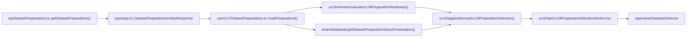
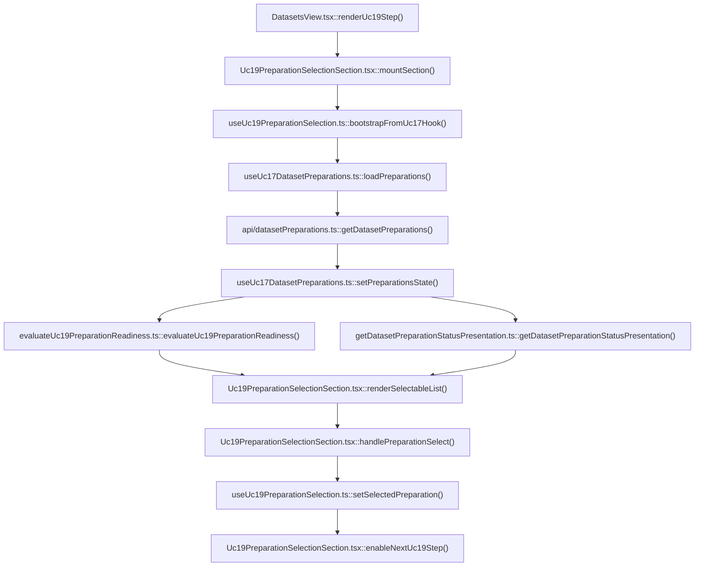

# UC-19-FE - Plan implementacyjny dla `GET /api/datasets/preparations`

## 1) Przeznaczenie endpointa
- Endpoint `GET /api/datasets/preparations` zwraca liste istniejacych preparation utworzonych w `UC-17`.
- W `UC-19` ten endpoint nie sluzy juz tylko do historii preparation, ale staje sie krokiem wejsciowym do builda finalnego datasetu `.npz`.
- Z perspektywy `FE` endpoint:
  - zasila liste preparation do wyboru przed `POST /api/datasets/processed`,
  - pokazuje status kazdego preparation,
  - pokazuje liczniki zrodel `board` i `digit`,
  - pozwala zdecydowac, czy rekord nadaje sie do dalszego flow `UC-19`,
  - nie zwraca listy folderow `board` ani `digit`,
  - nie buduje payloadu do `POST /api/datasets/processed`,
  - nie odczytuje zadnych danych runtime bezposrednio z systemu plikow.
- `Backend` pozostaje jedynym zrodlem prawdy dla:
  - listy preparation,
  - statusu preparation,
  - licznikow `boardSourcesCount` i `digitSourcesCount`,
  - kolejnosci rekordow zwracanych do UI,
  - decyzji, czy preparation faktycznie istnieje.

## 2) Zakres planu
- Plan dotyczy wylacznie `FE`.
- Plan nie projektuje implementacji `BE` ani `ML`; korzysta jedynie z publicznego kontraktu endpointa.
- Plan musi respektowac juz istniejace typy i nazwy z `src/Frontend/src/types/api.ts`.
- Plan nie moze sugerowac zmian na podstawie obecnej implementacji `BE` lub `ML`; liczy sie kontrakt use-case'u i warstwowy model aplikacji.
- Dla `UC-19` ten endpoint nalezy traktowac jako:
  - upstream dla wyboru `preparationName`,
  - wejscie do dalszych endpointow `board/folders`, `digit/folders` i pozniej `POST /api/datasets/processed`.
- Ten dokument opisuje tylko etap listowania i wyboru preparation, ale pokazuje jego miejsce w szerszym flow `UC-19`, bo bez tego latwo byloby zrobic zly coupling z legacy `UC-12`.

## 3) Miejsce endpointa w docelowym workflow `UC-19`
1. Uzytkownik wchodzi w nowy krok `UC-19` w module datasetowym.
2. `FE` pobiera `GET /api/datasets/preparations`.
3. `FE` renderuje liste rekordow preparation oraz ich status.
4. Uzytkownik wybiera rekord, ktory ma posluzyc jako zrodlo do builda `.npz`.
5. `FE` opcjonalnie dogrywa `GET /api/datasets/preparations/{preparationName}`, aby pokazac szczegoly wybranego preparation.
6. Dopiero po wyborze poprawnego preparation `FE` przechodzi do listowania:
   - `GET /api/datasets/preparations/{preparationName}/board/folders`
   - `GET /api/datasets/preparations/{preparationName}/digit/folders`
7. Finalnie `FE` sklada payload do `POST /api/datasets/processed`.

Wniosek:
- `GET /api/datasets/preparations` w `UC-19` nie jest samodzielnym ekranem.
- To jest bramka wyboru kontekstu do dalszych krokow builda `.npz`.

## 4) Glowne zalozenia architektoniczne
- Aktualna architektura FE jest formalnie `TBD`, ale kod repo jest praktycznie:
  - `feature-based`,
  - warstwowy,
  - z rozdzialem na `app`, `features`, `api`, `shared`, `types`.
- Dla tego endpointa nalezy utrzymac podzial MVVC:
  - `Model`: kontrakty API, lokalna ocena gotowosci rekordu do `UC-19`, prezentacja statusu,
  - `View`: lista preparation, akcje wyboru, stany `loading/error/empty/success`, komunikaty blokujace dalszy krok,
  - `ViewController`: pobranie listy, refresh, utrzymanie wyboru, reset downstream state po utracie selection, obsluga `401`,
  - `Infrastructure`: klient HTTP, walidacja JSON, mapowanie bledow.
- Nie wolno:
  - duplikowac klienta `GET /api/datasets/preparations`,
  - tworzyc drugiego kontraktu `DatasetPreparationsListApiResponse`,
  - liczyc `boardSourcesCount` lub `digitSourcesCount` po stronie FE z innych endpointow,
  - auto-wybierac pierwszego rekordu bez decyzji uzytkownika,
  - fallbackowac do legacy `UC-12` jako planu B.
- Jezeli potrzeba nowej uslugi, najpierw nalezy sprawdzic, czy juz istnieje modul generyczny.
- W tym repo juz istnieje odpowiedni modul infrastrukturalny:
  - `src/Frontend/src/api/datasetPreparations.ts`
- Wniosek:
  - nie tworzyc nowego `getDatasetPreparations()`,
  - nie tworzyc nowego typu transportowego listy preparation,
  - w `UC-19` reuse'owac istniejacy transport i ewentualnie dodac cienka adaptacje warstwy `application`.

## 5) Co juz istnieje i nalezy reuse'owac
- Istnieje transport:
  - `src/Frontend/src/api/datasetPreparations.ts`
- Istnieje helper HTTP:
  - `src/Frontend/src/api/shared/fetchJson.ts`
- Istnieja kontrakty:
  - `src/Frontend/src/types/api.ts`
- Istnieje hook obslugujacy:
  - `GET /api/datasets/preparations`
  - `GET /api/datasets/preparations/{preparationName}`
  - `POST /api/datasets/preparations`
  w pliku:
  - `src/Frontend/src/features/uc17/application/useUc17DatasetPreparations.ts`
- Istnieje juz osadzenie listy preparation w `UC-17` i `UC-18`, co daje gotowy wzorzec:
  - loadable state,
  - `AbortController`,
  - zachowanie poprzednich danych podczas `loading`,
  - lekkie logowanie,
  - reakcje na `401`,
  - reset selection po zniknieciu rekordu.
- Istnieje juz stepper datasetowy:
  - `src/Frontend/src/app/views/DatasetsView.tsx`
  - `src/Frontend/src/app/state.ts`

Wniosek dla `UC-19`:
- reuse'owac `getDatasetPreparations()`,
- reuse'owac `useUc17DatasetPreparations()` jako zrodlo prawdy dla listy,
- nie importowac calego widoku `Uc17RawCandidatesSection.tsx`,
- nie budowac nowego store globalnego,
- nie mieszac flow `UC-19` z komponentem legacy `Uc12DatasetPreparationSection.tsx`.

## 6) Model API w komunikacji z `BE`

### 6.1 Request `FE -> BE`
- Metoda i sciezka:
  - `GET /api/datasets/preparations`
- Query params:
  - brak
- Body:
  - brak
- Naglowki:
  - `Accept: application/json`
  - `Authorization: Bearer <token>` gdy aktywna jest sesja administratora

### 6.2 Model wejsciowy
- Brak payloadu JSON.

### 6.3 Model wyjsciowy sukcesu
- `DatasetPreparationsListApiResponse`
  - `items: DatasetPreparationListItemApiResponse[]`
  - `totalCount: number`
- `DatasetPreparationListItemApiResponse`
  - `preparationName: string`
  - `createdAtUtc: string`
  - `status: string`
  - `boardSourcesCount: number`
  - `digitSourcesCount: number`

Przyklad:

```json
{
  "items": [
    {
      "preparationName": "preparation-001",
      "createdAtUtc": "2026-06-19T09:15:00Z",
      "status": "completed",
      "boardSourcesCount": 2,
      "digitSourcesCount": 1
    },
    {
      "preparationName": "preparation-002",
      "createdAtUtc": "2026-06-19T09:40:00Z",
      "status": "running",
      "boardSourcesCount": 1,
      "digitSourcesCount": 0
    }
  ],
  "totalCount": 2
}
```

### 6.4 Model bledu
- `ErrorApiResponse`
  - `errorType: string`
  - `message: string`

### 6.5 Reguly kontraktowe
- Nie zmieniac nazw:
  - `DatasetPreparationsListApiResponse`
  - `DatasetPreparationListItemApiResponse`
  - `ErrorApiResponse`
- Dane transportowe pozostaja w `camelCase`.
- `status` pozostaje transportowo typu `string`.
- `FE` moze mapowac znane statusy na label UI, ale nie moze zalozyc zamknietego enum po stronie transportowej.
- `FE` nie powinien odrzucac rekordu tylko dlatego, ze status jest nieznany; ma pokazac rekord i zablokowac downstream, jesli logika `UC-19` tego wymaga.
- Dla `UC-19` rekord z `status !== "completed"` nie powinien odblokowywac dalszego build flow, ale sam rekord nadal moze byc widoczny na liscie.

## 7) Zachowanie z kazdej warstwy MVVC

### Model
- Obejmuje:
  - kontrakty transportowe z `src/types/api.ts`,
  - lokalna ocene, czy rekord jest gotowy do `UC-19`,
  - prezentacje statusu jako `label + className + canContinue`,
  - regule, czy aktywne `selectedPreparationName` pozostaje poprawne po refreshu.
- Model nie zna `fetch`, `AbortController` ani React UI.

### View
- Obejmuje:
  - panel wyboru preparation dla `UC-19`,
  - liste rekordow,
  - badge statusu,
  - liczniki `board` i `digit`,
  - przycisk `Odswiez przygotowania`,
  - przycisk lub akcje `Wybierz preparation do builda`,
  - komunikaty blokujace dalszy krok, gdy preparation nie jest gotowe,
  - stany `loading/error/empty/success`.
- View nie sklada URL-i endpointow.
- View nie mapuje bledow HTTP.
- View nie decyduje sam, czy rekord jest gotowy; dostaje to z warstwy `Model` / `ViewController`.

### ViewController
- Obejmuje:
  - reuse `loadPreparations()` z `useUc17DatasetPreparations()`,
  - reuse `refreshPreparations()`,
  - opcjonalny reuse `loadPreparationDetails(preparationName)`,
  - lokalne utrzymanie selection dla `UC-19`,
  - reset downstream flow, gdy wybrane preparation znika z listy,
  - blokade przejscia dalej, gdy preparation nie ma statusu `completed`,
  - obsluge `401`,
  - lekkie logowanie diagnostyczne.
- Warstwa `ViewController` dla `UC-19` moze byc cienkim adapterem na istniejacym hooku `UC-17`; nie powinna kopiowac calej logiki HTTP.

### Infrastructure
- Obejmuje:
  - `getDatasetPreparations()`,
  - `fetchJson()`,
  - walidacje odpowiedzi JSON,
  - mapowanie `ErrorApiResponse` na `DatasetPreparationsApiError`.
- Nie nalezy przenosic zadnej logiki statusow biznesowych `UC-19` do klienta HTTP.

## 8) Pliki per warstwa i odpowiedzialnosci

### 8.1 View
- `[ADD]` `src/Frontend/src/features/uc19/api/index.ts`
  - publiczny entry point feature'a `UC-19`.
- `[ADD]` `src/Frontend/src/features/uc19/api/Uc19PreparationSelectionSection.tsx`
  - glowny widok kroku wyboru preparation dla `UC-19`;
  - renderuje liste preparation, statusy, liczniki i stany `loading/error/empty/success`;
  - pokazuje, czy wybrany rekord moze odblokowac dalszy build `.npz`.
- `[REUSE + EXTEND]` `src/Frontend/src/app/views/DatasetsView.tsx`
  - dodaje nowy krok `uc19` do steppera datasetowego;
  - osadza `Uc19PreparationSelectionSection`;
  - nie przenosi do siebie logiki requestow.
- `[REUSE + EXTEND]` `src/Frontend/src/app/state.ts`
  - rozszerza `DatasetsStep` o `uc19`.
- `[REUSE + EXTEND]` `src/Frontend/src/styles/datasets.css`
  - style listy selection, badge'y statusu, disabled action, banner gotowosci i komunikaty blokujace.
- `[CONTEXT ONLY]` `src/Frontend/src/features/uc17/api/Uc17RawCandidatesSection.tsx`
  - zrodlo wzorca UI listy preparation;
  - nie importowac calego komponentu do `UC-19`.
- `[CONTEXT ONLY]` `src/Frontend/src/features/uc18/api/Uc18BoardFoldersSection.tsx`
  - pokazuje, jak selection preparation steruje kolejnym krokiem;
  - nie powinien byc rozszerzany o logike builda `.npz`.

### 8.2 ViewController
- `[ADD]` `src/Frontend/src/features/uc19/application/useUc19PreparationSelection.ts`
  - cienki adapter use-case'u `UC-19`;
  - konsumuje `useUc17DatasetPreparations()`;
  - mapuje rekordy listy na stan gotowosci do builda;
  - eksponuje `selectedPreparationName`, `selectedPreparation`, `canContinueToSources`, `selectionWarning`, `refreshPreparations`.
- `[REUSE]` `src/Frontend/src/features/uc17/application/useUc17DatasetPreparations.ts`
  - pozostaje jedynym miejscem odczytu `GET /api/datasets/preparations`;
  - odpowiada za request, abort, odswiezenie i obsluge bledow transportowych.

### 8.3 Model
- `[REUSE]` `src/Frontend/src/types/api.ts`
  - zrodlo prawdy dla:
    - `DatasetPreparationsListApiResponse`
    - `DatasetPreparationListItemApiResponse`
    - `DatasetPreparationApiResponse`
    - `ErrorApiResponse`
- `[ADD]` `src/Frontend/src/features/uc19/domain/evaluateUc19PreparationReadiness.ts`
  - ocenia, czy rekord preparation moze przejsc do dalszego flow `UC-19`;
  - zwraca np. `canContinue`, `reason`, `severity`.
- `[ADD]` `src/Frontend/src/shared/datasets/getDatasetPreparationStatusPresentation.ts`
  - generycznie mapuje `status: string` na:
    - label UI,
    - klase CSS,
    - informacje pomocnicza;
  - ma byc wspolny dla `UC-17`, `UC-18` i `UC-19`, zeby nie dodawac trzeciej kopii tej samej logiki.

### 8.4 Infrastructure
- `[REUSE]` `src/Frontend/src/api/datasetPreparations.ts`
  - klient HTTP dla `GET /api/datasets/preparations`;
  - zrodlo funkcji `getDatasetPreparations()`.
- `[REUSE]` `src/Frontend/src/api/shared/fetchJson.ts`
  - wspolny mechanizm:
    - `fetch`,
    - parse,
    - validate,
    - errorFactory.

### 8.5 Pliki sasiednie, ktore traktowac jako kontekst
- `[DOWNSTREAM / REUSE LATER]` `src/Frontend/src/api/datasets.ts`
  - klient `POST /api/datasets/processed` i `GET /api/datasets/processed`;
  - w `UC-19` bedzie wymagal osobnego refaktoru kontraktu, ale nie w ramach samego `GET /api/datasets/preparations`.
- `[LEGACY / NIE ROZWIJAC]` `src/Frontend/src/components/Uc12DatasetPreparationSection.tsx`
  - stary workflow `raw -> processed`;
  - nie jest wlasciwym miejscem dla selection preparation w `UC-19`.
- `[DOWNSTREAM / REUSE LATER]` `src/Frontend/src/features/uc18/application/useUc18BoardFolders.ts`
  - pokazuje wzorzec kolejnego kroku po wyborze preparation.
- `[DOWNSTREAM / REUSE LATER]` `src/Frontend/src/features/uc18/application/useUc18DigitFolders.ts`
  - analogiczny wzorzec dla zrodel `digit`.

## 9) Glowne funkcje
- `getDatasetPreparations()`
- `fetchJson()`
- `useUc17DatasetPreparations()`
- `loadPreparations()`
- `refreshPreparations()`
- `loadPreparationDetails()`
- `useUc19PreparationSelection()`
- `evaluateUc19PreparationReadiness()`
- `getDatasetPreparationStatusPresentation()`
- `handlePreparationSelect()`
- `handleRefreshPreparations()`

## 10) Zachowanie przy wyjatkach, fallbackach i odswiezaniu

### 10.1 `401 Unauthorized`
- ViewController wywoluje `onUnauthorized()`.
- UI pokazuje lekki komunikat o wygasnieciu sesji.
- Nie czyscic agresywnie poprzedniej listy w momencie bledu; zachowac ostatni znany stan, o ile jest.

### 10.2 `404` na downstream details
- Dla samej listy `GET /api/datasets/preparations` typowy `404` nie powinien wystepowac.
- Dla `GET /api/datasets/preparations/{preparationName}` moze wystapic, jesli rekord zniknal po wyborze.
- W takim przypadku:
  - zachowac liste,
  - wyczyscic selection tylko wtedy, gdy rekord nie istnieje juz na aktualnej liscie,
  - zresetowac dalsze kroki zalezne od selection.

### 10.3 `5xx`
- Pokazac blad techniczny.
- Zachowac poprzednia liste preparation, jesli istnieje.
- Nie przechodzic automatycznie do legacy flow.

### 10.4 Bledny JSON / zly ksztalt odpowiedzi
- Traktowac jako blad techniczny kontraktu.
- Logowac jako `console.error`.
- Pokazac uzytkownikowi komunikat ogolny bez dumpowania calego payloadu.

### 10.5 Pusta lista
- To nie jest blad.
- Renderowac stan pusty z informacja, ze nie ma jeszcze zadnych preparation.
- Nie probowac pobierac folderow `board` / `digit`.

### 10.6 Nieznany `status`
- Rekord pozostaje widoczny.
- Label moze fallbackowac do surowej wartosci statusu.
- Dalszy krok `UC-19` pozostaje zablokowany, dopoki `evaluateUc19PreparationReadiness()` nie uzna rekordu za gotowy.

### 10.7 Usuniety lub nieaktualny selection po refreshu
- Jesli rekord zniknal z listy:
  - wyczyscic `selectedPreparationName`,
  - wyczyscic downstream state `UC-19`,
  - pokazac lekki warning.
- Jesli rekord nadal istnieje, ale jego status zmienil sie z `completed` na inny:
  - nie kasowac selection,
  - zablokowac dalszy krok,
  - pokazac komunikat, ze rekord nie jest juz gotowy do builda.

## 11) Logi diagnostyczne
- Logi maja pomagac w diagnozie, ale nie spamowac.
- Zalecane:
  - `console.info`
    - start ladowania listy,
    - sukces ladowania listy,
    - reczne odswiezenie listy,
    - wybor preparation do builda.
  - `console.warn`
    - `401`,
    - usuniete selection po refreshu,
    - selection pozostalo, ale rekord przestal byc gotowy do `UC-19`,
    - downstream `404` dla szczegolow.
  - `console.error`
    - `5xx`,
    - bledny ksztalt odpowiedzi,
    - nieoczekiwany blad parsowania.
- Nie logowac:
  - tokena,
  - pelnych payloadow odpowiedzi,
  - danych renderowanych przy kazdym rerenderze,
  - kazdego klikniecia na liscie bez wartosci diagnostycznej.

## 12) Opis przeplywu w obrebie `BE` - tylko kontekst dla FE
1. `FE` wysyla `GET /api/datasets/preparations`.
2. `BE` pobiera swoja liste rekordow preparation z wlasnego magazynu metadanych.
3. `BE` zwraca zwarta liste summary:
   - `preparationName`
   - `createdAtUtc`
   - `status`
   - `boardSourcesCount`
   - `digitSourcesCount`
4. `FE` nie zna i nie powinien znac fizycznych sciezek runtime.
5. `ML` nie uczestniczy bezposrednio w obsludze tego endpointa.

Wniosek:
- `UC-19` po stronie FE opiera sie tu wylacznie na rekordzie summary zwroconym przez `BE`.
- To `BE`, a nie `FE`, jest wlascicielem prawdy o istnieniu i statusie preparation.

## 13) Mermaid - flow modeli



## 14) Mermaid - flow logiki aplikacji



## 15) Pseudokod dla specyficznej logiki

```text
function evaluateUc19PreparationReadiness(item):
  if item.status == "completed":
    return { canContinue: true, reason: null, severity: "none" }

  if item.status == "running" or item.status == "queued":
    return {
      canContinue: false,
      reason: "Preparation nie jest jeszcze zakonczone.",
      severity: "info"
    }

  if item.status == "failed":
    return {
      canContinue: false,
      reason: "Preparation zakonczone niepowodzeniem.",
      severity: "warning"
    }

  return {
    canContinue: false,
    reason: "Preparation ma nieznany status i nie odblokowuje kolejnego kroku.",
    severity: "warning"
  }
```

```text
function reconcileUc19Selection(previousSelection, items):
  if previousSelection is null:
    return { selectedPreparationName: null, resetDownstream: false }

  matched = items.find(item => item.preparationName == previousSelection)

  if matched is null:
    return { selectedPreparationName: null, resetDownstream: true }

  return {
    selectedPreparationName: previousSelection,
    resetDownstream: false,
    canContinue: evaluateUc19PreparationReadiness(matched).canContinue
  }
```

## 16) Kolejnosc implementacji kodu dla historyjki
1. Dodac krok `uc19` do `src/Frontend/src/app/state.ts`.
2. Osadzic nowy krok w `src/Frontend/src/app/views/DatasetsView.tsx`.
3. Dodac helper wspolnego statusu `getDatasetPreparationStatusPresentation.ts`.
4. Dodac logike domenowa `evaluateUc19PreparationReadiness.ts`.
5. Dodac adapter `useUc19PreparationSelection.ts`, reuse'ujacy `useUc17DatasetPreparations()`.
6. Dodac widok `Uc19PreparationSelectionSection.tsx`.
7. Rozszerzyc `datasets.css` o UI selection i stan blokady dalszego kroku.
8. Opcjonalnie podmienic duplikowana logike statusu w `UC-17` i `UC-18` na nowy helper wspolny.
9. Zweryfikowac, ze selection preparation poprawnie steruje dalszym flow i nie miesza sie z legacy `UC-12`.
10. Wykonac `tsc -b` lub `npm run check` dla `src/Frontend`.

## 17) Zaleznosci pomiedzy historyjkami
- `UC-17`
  - twarda zaleznosc kontraktowa i funkcjonalna;
  - to stad pochodza preparation i istniejacy hook listy.
- `UC-18`
  - zaleznosc downstream;
  - po wyborze preparation kolejne kroki bazuja na `board/folders` i `digit/folders`.
- `UC-19`
  - ten endpoint jest krokiem wejsciowym do builda `.npz`;
  - sam nie realizuje jeszcze POST builda.
- `UC-12`
  - legacy kontekst;
  - nie nalezy dalej rozwijac go jako glownego flow `UC-19`.
- `UC-06`
  - zaleznosc dalsza;
  - build `.npz` z `UC-19` ma ostatecznie karmic trening.

## 18) Workflow GitHub i konfiguracja runtime
- Dla samego `GET /api/datasets/preparations` nie jest potrzebna nowa konfiguracja workflow FE.
- Obecny workflow:
  - `/.github/workflows/frontend-cd.yml`
  - buduje FE z `VITE_API_BASE_URL="${FE_VITE_API_BASE_URL:-/api}"`.
- Poniewaz endpoint pozostaje pod sciezka `/api/...`, `UC-19` nie wymaga nowej zmiennej FE ani osobnej zmiany w deploy FE.
- Wniosek:
  - nie dodawac nowego env tylko dla tego endpointa,
  - w local nie wprowadzac nowego przelacznika konfiguracyjnego dla `UC-19`,
  - ewentualne zmiany `appsettings` produkcyjnych po stronie `BE` sa poza zakresem tego dokumentu i powinny byc opisane w planie backendowym.

## 19) Guardraile implementacyjne
- Nie tworzyc drugiego klienta `GET /api/datasets/preparations`.
- Nie kopiowac logiki `useUc17DatasetPreparations()` do `UC-19`.
- Nie importowac calego ekranu `UC-17` do `UC-19`.
- Nie auto-selektowac pierwszego rekordu z listy.
- Nie odblokowywac downstream tylko dlatego, ze rekord istnieje; musi przejsc ocene gotowosci.
- Nie tworzyc zaleznosci `UC-19 -> legacy UC-12`.
- Nie zakladac, ze `status` ma tylko 4 wartosci.
- Nie kasowac poprzedniej listy przy kazdym `loading`.
- Nie resetowac selection, jesli rekord nadal istnieje, ale chwilowo nie jest gotowy; w takim przypadku zablokowac kolejny krok i pokazac powod.
- Nie dodawac ciezkich logow payloadow ani cyklicznych logow per render.

## 20) Inne istotne reguly
- `FE` ma respektowac kolejnosc rekordow zwrocona przez `BE`; nie sortowac lokalnie bez wyraznego wymagania.
- `FE` nie powinien zgadywac, ze `boardSourcesCount > 0` i `digitSourcesCount > 0` oznacza gotowosc builda; o gotowosci decyduje najpierw status, a pelne potwierdzenie nadejdzie dopiero w dalszych krokach `UC-19`.
- `FE` moze pokazac szczegoly preparation po wyborze, ale nie powinien uzalezniac samego listowania od endpointu details.
- Jezeli w trakcie prac dotykamy `UC-17` i `UC-18`, warto usunac duplikaty mapowania statusu i przeniesc je do helpera wspolnego juz w tej historyjce.
- Ten endpoint ma pozostac cienkim etapem selection, a nie miejscem skladania requestu do `POST /api/datasets/processed`.
