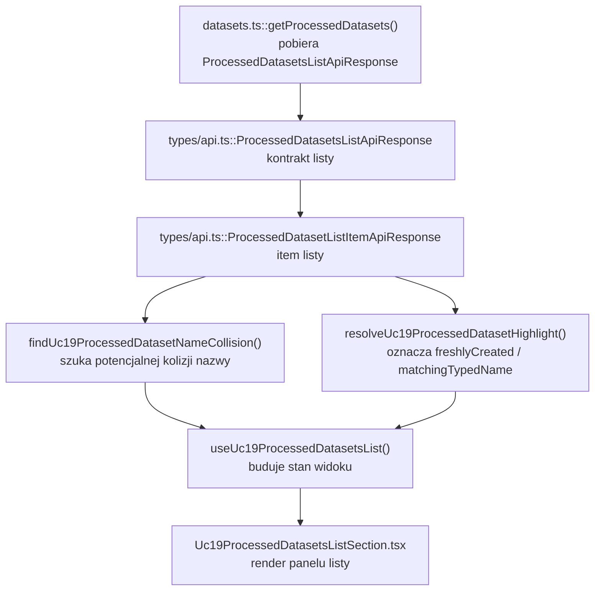
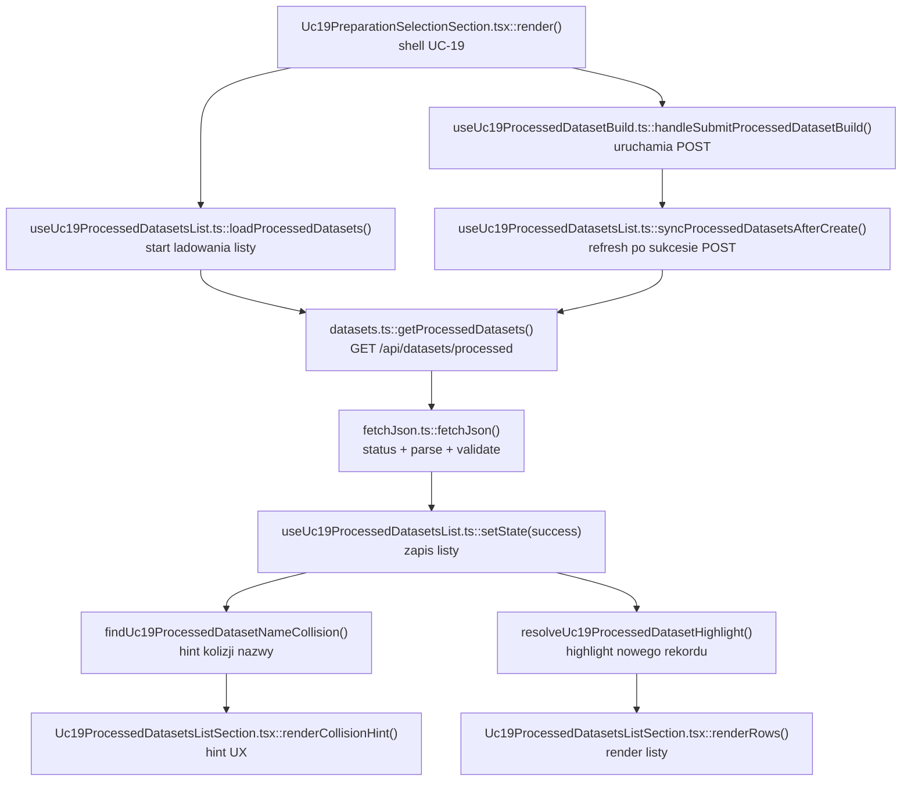

# UC-19-FE - Plan implementacyjny dla `GET /api/datasets/processed`

## 1) Przeznaczenie endpointa
- Endpoint `GET /api/datasets/processed` zwraca liste gotowych datasetow `.npz`, ktore zostaly juz zapisane przez backend jako finalne artefakty treningowe.
- W `UC-19` ten endpoint nie buduje datasetu i nie zastepuje `POST /api/datasets/processed`.
- Z perspektywy `FE` endpoint sluzy do:
  - pokazania operatorowi juz istniejacych datasetow przed buildem,
  - dania lekkiego kontekstu do wyboru unikalnej `name`,
  - odswiezenia katalogu po sukcesie `POST /api/datasets/processed`,
  - potwierdzenia, ze nowo zbudowany dataset pojawil sie w publicznym katalogu backendu,
  - przygotowania downstream dla `UC-06`, ktory ten katalog juz konsumuje.
- `Backend` pozostaje jedynym zrodlem prawdy dla:
  - listy gotowych datasetow,
  - kolejnosci rekordow,
  - `sampleCounts`,
  - `fileName`,
  - `preprocessingProfile`,
  - tego, czy nowo zbudowany dataset zostal faktycznie zmaterializowany i zapisany.

## 2) Zakres planu
- Plan dotyczy tylko `FE`.
- Plan nie projektuje implementacji `BE` ani `ML`; uwzglednia tylko publiczny kontrakt HTTP i role endpointa w `UC-19`.
- Nie nalezy sugerowac sie biezaca implementacja `BE` i `ML` poza:
  - ustalonym kontraktem endpointa,
  - istniejacymi nazwami modeli transportowych,
  - aktualnym kodem `src/Frontend`.
- Plan musi respektowac warstwowosc MVVC.
- Plan musi respektowac istniejace kontrakty z poprzednich historyjek i nie zmieniac nazw juz obecnych typow bez wyraznej potrzeby.
- Plan nie rozwija `UC-06` ani legacy `UC-12` funkcjonalnie; traktuje je jako kontekst i istniejacych konsumentow tego samego endpointa.
- Plan nie dodaje nowego workflow GitHub tylko dlatego, ze dochodzi kolejny widok listy.

## 3) Aktualny stan FE i wniosek dla tej historyjki
- Transport dla endpointa juz istnieje:
  - `src/Frontend/src/api/datasets.ts`
  - `src/Frontend/src/types/api.ts`
- Istniejacy konsumenci endpointa juz sa w repo:
  - `src/Frontend/src/components/Uc06TrainingSection.tsx`
  - `src/Frontend/src/components/Uc12DatasetPreparationSection.tsx`
- W nowym flow `UC-19` istnieje juz:
  - wybor `preparation`,
  - walidacja details,
  - konfiguracja `board/folders`,
  - konfiguracja `digit/folders`,
  - `POST /api/datasets/processed`,
  - widok wyniku builda na podstawie `ProcessedDatasetApiResponse`.
- Wniosek:
  - nie tworzyc nowego klienta HTTP dla `GET /api/datasets/processed`,
  - nie zmieniac bez potrzeby `ProcessedDatasetListItemApiResponse`,
  - dodac cienki, read-only krok katalogowy w `UC-19`,
  - reuse'owac istniejacy transport i pokazac liste jako:
    - kontekst przed buildem,
    - weryfikacje po buildzie,
    - przygotowanie do przejscia do `UC-06`.

## 4) Miejsce endpointa w docelowym workflow `UC-19`
1. Uzytkownik wybiera `preparation`.
2. `FE` waliduje details wybranego `preparation`.
3. `FE` pobiera `board/folders` i `digit/folders`.
4. Uzytkownik ustawia `name` oraz `sources`.
5. Rownolegle `FE` moze pokazac katalog juz gotowych datasetow z `GET /api/datasets/processed`.
6. Uzytkownik uruchamia `POST /api/datasets/processed`.
7. `FE` dostaje `ProcessedDatasetApiResponse` z wynikiem builda.
8. Po sukcesie `FE` odswieza `GET /api/datasets/processed`, aby:
   - potwierdzic pojawienie sie nowego rekordu,
   - wyswietlic go na liscie,
   - dac operatorowi szybka droge do kolejnego kroku `UC-06`.

Wniosek:
- W `UC-19` ten endpoint jest etapem read-only i weryfikacyjnym.
- Nie jest krokiem wymaganym do samego zbudowania payloadu `POST`, ale daje wartosc UX i porzadkuje przejscie do treningu.

## 5) Glowne zalozenia architektoniczne
- Aktualna architektura FE formalnie pozostaje `TBD`, ale kod repo jest praktycznie:
  - `feature-based`,
  - warstwowy,
  - z rozdzialem na `app`, `features`, `api`, `shared`, `types`.
- Dla tego endpointa nalezy utrzymac MVVC:
  - `Model`: transport listy processed datasetow i lekkie reguly domenowe UI,
  - `View`: read-only lista, refresh, highlight nowo utworzonego rekordu, loading/error/empty,
  - `ViewController`: pobranie listy, refresh, zachowanie poprzednich danych podczas odswiezania, synchronizacja po sukcesie `POST`,
  - `Infrastructure`: klient HTTP, walidacja JSON, mapowanie bledow.
- `FE` nie moze:
  - zgadywac listy datasetow na podstawie samego `POST` response,
  - skladac lokalnego katalogu z danych cache'owanych z innych ekranow,
  - rozmawiac bezposrednio z `ML`,
  - odczytywac runtime storage ani nazw katalogow serwera.
- Poniewaz usluga transportowa juz istnieje, generycznosc tej historyjki ma polegac na:
  - reuse istniejacego `getProcessedDatasets()`,
  - braku drugiego klienta API,
  - braku drugiego kontraktu listowego,
  - cienkim `ViewController`, ktory nie zmienia semantyki endpointa.

## 6) Co juz istnieje i nalezy reuse'owac
- Istnieje klient HTTP:
  - `src/Frontend/src/api/datasets.ts`
- Istnieje helper transportowy:
  - `src/Frontend/src/api/shared/fetchJson.ts`
- Istnieja kontrakty:
  - `src/Frontend/src/types/api.ts`
- Istnieje widok builda `UC-19`, do ktorego ten endpoint powinien zostac dopiety jako warstwa read-only:
  - `src/Frontend/src/features/uc19/api/Uc19ProcessedDatasetBuildSection.tsx`
  - `src/Frontend/src/features/uc19/application/useUc19ProcessedDatasetBuild.ts`
- Istnieje shell `UC-19`:
  - `src/Frontend/src/features/uc19/api/Uc19PreparationSelectionSection.tsx`
- Istnieje osadzenie kroku w shellu datasetowym:
  - `src/Frontend/src/app/views/DatasetsView.tsx`
  - `src/Frontend/src/app/state.ts`
- Istnieja juz konsumenci tego samego katalogu:
  - `src/Frontend/src/components/Uc06TrainingSection.tsx`
  - `src/Frontend/src/components/Uc12DatasetPreparationSection.tsx`

Wniosek:
- reuse'owac transport i nazwy typow,
- nie tworzyc nowego `processedCatalogApi.ts`,
- nie rozwalac kontraktu `UC-06`,
- nie kopiowac calej logiki z `Uc06TrainingSection.tsx`, bo to komponent monolityczny i ma inna odpowiedzialnosc biznesowa.

## 7) Model API w komunikacji z `BE`

### 7.1 Request `FE -> BE`
- Metoda i sciezka:
  - `GET /api/datasets/processed`
- Query params:
  - brak
- Body:
  - brak
- Naglowki:
  - `Accept: application/json`
  - `Authorization: Bearer <token>` gdy istnieje sesja administratora

### 7.2 Model wejsciowy
- Brak payloadu JSON.

### 7.3 Model wyjsciowy sukcesu
- `ProcessedDatasetsListApiResponse`
  - `items: ProcessedDatasetListItemApiResponse[]`
  - `totalCount: number`
- `ProcessedDatasetListItemApiResponse`
  - `name: string`
  - `fileName: string`
  - `preprocessingProfile: string`
  - `createdAtUtc: string`
  - `sampleCounts: SplitSampleCountsApiResponse`
- `SplitSampleCountsApiResponse`
  - `train: number`
  - `val: number`
  - `test: number`

Przyklad:

```json
{
  "items": [
    {
      "name": "digits-dataset-v2",
      "fileName": "digits-dataset-v2.npz",
      "preprocessingProfile": "default-28x28-v1",
      "createdAtUtc": "2026-06-20T00:30:00Z",
      "sampleCounts": {
        "train": 12000,
        "val": 1500,
        "test": 1500
      }
    }
  ],
  "totalCount": 1
}
```

### 7.4 Model bledu
- `ErrorApiResponse`
  - `errorType: string`
  - `message: string`

### 7.5 Reguly kontraktowe
- Nie zmieniac nazw:
  - `ProcessedDatasetListItemApiResponse`
  - `ProcessedDatasetsListApiResponse`
  - `SplitSampleCountsApiResponse`
  - `ErrorApiResponse`
- Dane transportowe pozostaja w `camelCase`.
- `GET /api/datasets/processed` ma pozostac kompatybilny z `UC-06`.
- Jesli backend kiedys doda nowe pola, plan `UC-19` nie powinien wymagac ich do MVP tego endpointa.
- `FE` nie sortuje listy lokalnie bez wyraznego wymagania.
- `FE` nie zgaduje brakujacych pol przy blednym JSON.

## 8) Zachowanie z kazdej warstwy MVVC

### Model
- Obejmuje:
  - transport `ProcessedDatasetsListApiResponse`,
  - transport `ProcessedDatasetListItemApiResponse`,
  - lekka lokalna regule wyroznienia rekordu:
    - nowo utworzonego po sukcesie `POST`,
    - potencjalnie kolidujacego z aktualnie wpisana `datasetName`.
- Model nie zna:
  - Reacta,
  - `fetch`,
  - statusow HTTP jako mechanizmu odswiezania.

### View
- Obejmuje:
  - read-only panel listy datasetow processed,
  - licznik `totalCount`,
  - przycisk `Odswiez liste datasetow`,
  - stany `loading/error/empty/success`,
  - highlight nowo utworzonego datasetu,
  - nieblokujacy hint, gdy wpisana `datasetName` pasuje do juz istniejacego rekordu.
- View nie:
  - sklada URL-i,
  - nie waliduje JSON,
  - nie wykonuje `POST`,
  - nie zna wewnetrznej logiki treningu `UC-06`.

### ViewController
- Obejmuje:
  - `loadProcessedDatasets()`,
  - `refreshProcessedDatasets()`,
  - zachowanie poprzedniej listy podczas refreshu,
  - synchronizacje po sukcesie `POST /api/datasets/processed`,
  - lekkie logowanie diagnostyczne,
  - obsluge `401`.
- ViewController nie powinien:
  - blokowac calego builda tylko dlatego, ze refresh listy sie nie udal,
  - nadpisywac sukcesu `POST` bledem nastepczego `GET`,
  - kopiowac logiki startu treningu z `UC-06`.

### Infrastructure
- Obejmuje:
  - `getProcessedDatasets()`,
  - `fetchJson()`,
  - walidacje `ProcessedDatasetsListApiResponse`,
  - `buildAuthHeaders()`,
  - mapowanie bledow na `DatasetsApiError`.
- Ta warstwa jest juz gotowa i ma byc reuse'owana bez duplikacji.

## 9) Pliki per warstwa i odpowiedzialnosci

### 9.1 View
- `[ADD]` `src/Frontend/src/features/uc19/api/Uc19ProcessedDatasetsListSection.tsx`
  - glowny read-only widok katalogu `processed` w kontekscie `UC-19`;
  - renderuje:
    - liste rekordow,
    - `totalCount`,
    - loading/error/empty/success,
    - highlight nowo utworzonego datasetu,
    - nieblokujacy hint o potencjalnej kolizji nazwy.
- `[REUSE + ADJUST]` `src/Frontend/src/features/uc19/api/Uc19ProcessedDatasetBuildSection.tsx`
  - pozostaje widokiem formularza i wyniku `POST`;
  - powinien osadzic lub sasiednio pokazac panel listy `processed`;
  - nie powinien sam wykonywac `GET`.
- `[REUSE + ADJUST]` `src/Frontend/src/features/uc19/api/Uc19PreparationSelectionSection.tsx`
  - shell `UC-19`;
  - spina:
    - selection `preparation`,
    - `board/folders`,
    - `digit/folders`,
    - build section,
    - nowy panel listy `processed`.
- `[REUSE]` `src/Frontend/src/features/uc19/api/index.ts`
  - publiczny entry point feature'a `UC-19`.
- `[REUSE + EXTEND]` `src/Frontend/src/styles/datasets.css`
  - style dla panelu listy `processed`,
  - highlight nowo utworzonego rekordu,
  - hint kolizji nazwy,
  - lekkie badge `sampleCounts`.
- `[REUSE]` `src/Frontend/src/app/views/DatasetsView.tsx`
  - nie wymaga nowego kroku steppera;
  - `GET /api/datasets/processed` pozostaje czescia jednego ekranu `UC-19`.
- `[CONTEXT ONLY]` `src/Frontend/src/components/Uc06TrainingSection.tsx`
  - istniejacy konsument listy `processed`;
  - nie jest miejscem implementacji `UC-19`.
- `[LEGACY CONTEXT]` `src/Frontend/src/components/Uc12DatasetPreparationSection.tsx`
  - nadal ma read-only odczyt listy `processed`;
  - nie nalezy go rozszerzac o nowa logike `UC-19`.

### 9.2 ViewController / Application
- `[ADD]` `src/Frontend/src/features/uc19/application/useUc19ProcessedDatasetsList.ts`
  - cienki hook listy `processed` tylko dla `UC-19`;
  - pobiera dane przez `getProcessedDatasets()`,
  - wspiera refresh,
  - zachowuje poprzednia liste podczas odswiezania,
  - umie zsynchronizowac liste po sukcesie `POST`,
  - nie zna JSX.
- `[REUSE + OPTIONAL ADJUST]` `src/Frontend/src/features/uc19/application/useUc19ProcessedDatasetBuild.ts`
  - pozostaje hookiem builda `POST`;
  - moze opcjonalnie wystawic `latestCreatedDatasetName`,
  - ale nie powinien pobierac listy `processed` samodzielnie.
- `[REUSE]` `src/Frontend/src/features/uc19/application/useUc19PreparationSelection.ts`
  - nadal kontroluje gating `UC-19`;
  - jego odpowiedzialnosc nie obejmuje listy `processed`.

### 9.3 Model / Domain
- `[REUSE]` `src/Frontend/src/types/api.ts`
  - zrodlo prawdy dla:
    - `ProcessedDatasetListItemApiResponse`
    - `ProcessedDatasetsListApiResponse`
    - `SplitSampleCountsApiResponse`
    - `ErrorApiResponse`
- `[ADD]` `src/Frontend/src/features/uc19/domain/findUc19ProcessedDatasetNameCollision.ts`
  - czysta funkcja sprawdzajaca, czy wpisana `datasetName` potencjalnie koliduje z juz istniejacym rekordem listy;
  - to tylko hint UX, nie zastepuje backendowego `409`.
- `[ADD]` `src/Frontend/src/features/uc19/domain/resolveUc19ProcessedDatasetHighlight.ts`
  - wyznacza, czy i ktory rekord listy ma byc oznaczony jako:
    - `freshlyCreated`,
    - `matchingTypedName`.

### 9.4 Infrastructure
- `[REUSE]` `src/Frontend/src/api/datasets.ts`
  - klient HTTP:
    - `getProcessedDatasets()`
    - `postCreateProcessedDataset()`
  - waliduje kontrakty i mapuje bledy.
- `[REUSE]` `src/Frontend/src/api/shared/fetchJson.ts`
  - wspolny mechanizm:
    - `fetch`
    - parse
    - validate
    - errorFactory

## 10) Glowne funkcje
- `getProcessedDatasets()`
- `useUc19ProcessedDatasetsList()`
- `loadProcessedDatasets()`
- `refreshProcessedDatasets()`
- `syncProcessedDatasetsAfterCreate()`
- `findUc19ProcessedDatasetNameCollision()`
- `resolveUc19ProcessedDatasetHighlight()`
- `Uc19ProcessedDatasetsListSection()`
- `postCreateProcessedDataset()`
- `useUc19ProcessedDatasetBuild()`

## 11) Zachowanie endpointa w `UC-19`
- Po wejsciu na ekran `UC-19` i przy istniejacej sesji administratora `FE` moze pobrac katalog `processed`, aby pokazac aktualny stan systemu.
- Lista jest pomocnicza i read-only:
  - nie steruje selection `preparation`,
  - nie zastepuje wyniku `POST`,
  - nie otwiera treningu,
  - nie robi delete.
- Wpisana `datasetName` moze byc porownywana z lista tylko w celu pokazania nieblokujacego ostrzezenia typu:
  - "Nazwa prawdopodobnie juz istnieje."
- Po sukcesie `POST /api/datasets/processed`:
  - sukces `POST` jest stanem nadrzednym,
  - `GET /api/datasets/processed` sluzy do synchronizacji katalogu,
  - nowy rekord powinien zostac wyrozniony na liscie.
- Jesli refresh po buildzie nie powiedzie sie:
  - sukces `POST` nadal pozostaje widoczny,
  - `FE` pokazuje tylko dodatkowy warning o braku potwierdzenia odswiezonego katalogu.

## 12) Wyjatki, fallbacki i zachowanie bledowe

### 12.1 Statusy HTTP
- `200 OK`
  - lista poprawna;
  - moze byc pusta.
- `401 Unauthorized`
  - sesja administratora wygasla;
  - `FE` wywoluje `onUnauthorized()`.
- `403 Forbidden`
  - operator nie ma dostepu do katalogu;
  - `FE` pokazuje blad bez automatycznego retry.
- `404 Not Found`
  - dla tego endpointa jest nietypowe;
  - traktowac jako blad techniczny routingu / konfiguracji.
- `500 Internal Server Error`
  - blad backendu.
- `502`, `503`, `504`
  - blad infrastrukturalny na sciezce przegladarka -> nginx -> backend.

### 12.2 Bledy kontraktu
- Jesli odpowiedz `200` nie spelnia `ProcessedDatasetsListApiResponse`:
  - traktowac jako blad techniczny,
  - nie mapowac na pusta liste,
  - nie rekonstruowac rekordu z innych danych.

### 12.3 Fallbacki dopuszczalne
- Zachowanie poprzedniej listy podczas refreshu.
- Zachowanie poprzedniej listy przy chwilowym `5xx`, jesli odswiezanie jest tylko pomocnicze.
- Zachowanie sukcesu `POST`, nawet jesli nastepczy `GET /processed` nie powiedzie sie.
- Pokazanie nieblokujacego warningu o potencjalnej kolizji nazwy bez twardego blokowania submitu.

### 12.4 Fallbacki niedopuszczalne
- Zgadywanie katalogu `processed` tylko na podstawie `ProcessedDatasetApiResponse` z `POST`.
- Nadpisanie sukcesu `POST` bledem pomocniczego refreshu listy.
- Sortowanie lokalne bez wymaganego kontraktu.
- Reuse calego `Uc06TrainingSection.tsx` jako gotowego panelu listy.
- Przejscie `FE -> ML`.

### 12.5 Zachowanie UI
- `idle`
  - lista nie zostala jeszcze pobrana albo brak sesji.
- `loading`
  - panel pokazuje ladowanie;
  - moze zachowac poprzednie rekordy.
- `error`
  - panel pokazuje blad;
  - nie powinien ukrywac poprawnego wyniku `POST`, jesli ten juz istnieje.
- `success + empty`
  - brak gotowych datasetow w systemie.
- `success + data`
  - lista pokazuje rekordy wraz z `sampleCounts`;
  - nowo utworzony rekord moze byc wyrozniony.

## 13) Logging i diagnostyka FE
- Logowanie ma pomagac, ale nie moze spamowac.

### `console.info`
- start ladowania listy `processed`,
- reczne odswiezenie listy,
- sukces pobrania listy wraz z `totalCount`,
- synchronizacja listy po sukcesie `POST`.

### `console.warn`
- `401`,
- refresh po buildzie nie potwierdzil katalogu, mimo ze `POST` zakonczyl sie sukcesem,
- wpisana `datasetName` pasuje do juz istniejacego rekordu,
- nowo utworzony dataset nie zostal znaleziony na odswiezonej liscie mimo sukcesu `POST`.

### `console.error`
- `5xx`,
- bledny ksztalt odpowiedzi,
- nieprzetwarzalna odpowiedz backendu,
- nieoczekiwany blad parsowania.

### Guardraile logowania
- nie logowac tokena,
- nie logowac calej odpowiedzi backendu,
- nie logowac calej listy rekordow,
- nie logowac kazdego rerenderu,
- logowac tylko lekkie metadane:
  - `datasetName`,
  - `httpStatus`,
  - `errorType`,
  - `totalCount`,
  - `freshlyCreatedFound`,
  - `collisionDetected`.

## 14) Opis przeplywu w obrebie `BE` potrzebny frontendowi
Ta sekcja opisuje tylko kontraktowe minimum potrzebne `FE`.

1. `FE` wysyla `GET /api/datasets/processed`.
2. `BE` weryfikuje autoryzacje.
3. `BE` odczytuje swoj katalog metadanych gotowych datasetow.
4. `BE` zwraca liste summary:
   - `name`
   - `fileName`
   - `preprocessingProfile`
   - `createdAtUtc`
   - `sampleCounts`
5. `BE` nie musi wywolywac `ML` dla samego odczytu listy.
6. `FE` nie powinien znac:
   - gdzie fizycznie lezy `.npz`,
   - jak backend utrzymuje index datasetow,
   - jak dane sa zapisane w storage runtime.

## 15) Mermaid flowchart - flow modeli



## 16) Mermaid flowchart - logika aplikacji z funkcjami



## 17) Specyficzna logika i pseudokod

### 17.1 Ladowanie listy `processed`

```text
loadProcessedDatasets():
  set state = loading
  keep previous items if they exist

  response = getProcessedDatasets(apiBaseUrl, accessToken, signal)

  set state = success({
    items: response.items,
    totalCount: response.totalCount
  })
```

### 17.2 Hint o potencjalnej kolizji nazwy

```text
findUc19ProcessedDatasetNameCollision(datasetName, items):
  normalizedName = datasetName.trim()

  if normalizedName is empty:
    return null

  normalizedFileName = `${normalizedName}.npz`

  return first item where
    item.name == normalizedName
    or item.fileName == normalizedFileName
```

### 17.3 Synchronizacja po sukcesie `POST`

```text
syncProcessedDatasetsAfterCreate(createdDatasetName):
  refreshResult = await loadProcessedDatasets()

  if refreshResult failed:
    show non-blocking warning
    keep POST success visible
    return

  createdItem = refreshed items.find(item => item.name == createdDatasetName)

  if createdItem exists:
    mark createdItem as freshlyCreated
  else:
    show warning that catalog refresh did not confirm the new record
```

### 17.4 Wyznaczenie highlightu na liscie

```text
resolveUc19ProcessedDatasetHighlight(items, createdDatasetName, typedDatasetName):
  for each item in items:
    isFreshlyCreated = createdDatasetName is not null and item.name == createdDatasetName
    isMatchingTypedName = typedDatasetName.trim() is not empty and item.name == typedDatasetName.trim()

    return item with derived flags
```

## 18) Workflow GitHub i konfiguracja runtime
- Dla `GET /api/datasets/processed` nie jest potrzebna nowa zmienna srodowiskowa FE.
- Obowiazujacy workflow FE:
  - `.github/workflows/frontend-cd.yml`
  - buduje `src/Frontend`,
  - ustawia `VITE_API_BASE_URL="${FE_VITE_API_BASE_URL:-/api}"`,
  - pakuje statyczny build.
- W local:
  - `FE` powinien dzialac na stalym `/api`, jesli `VITE_API_BASE_URL` nie jest ustawione;
  - to jest wystarczajacy, "na sztywno" przypisany fallback po stronie FE.
- W produkcji:
  - workflow backendowy moze podstawic produkcyjne `appsettings`,
  - ale plan FE nie moze od tego zalezec inaczej niz przez publiczny adres `/api`.
- Wniosek:
  - nie dodawac nowego env-a dla tego endpointa,
  - nie hardcodowac produkcyjnych URL-i w JSX,
  - nie traktowac workflow jako zrodla prawdy dla listy datasetow.

## 19) Kolejnosc implementacji kodu dla historyjki
1. Zweryfikowac, ze `src/Frontend/src/api/datasets.ts` pozostaje jedynym klientem `GET /api/datasets/processed`.
2. Zweryfikowac, ze `src/Frontend/src/types/api.ts` nie wymaga zmiany kontraktu listy.
3. Dodac helpery domenowe:
   - `findUc19ProcessedDatasetNameCollision.ts`
   - `resolveUc19ProcessedDatasetHighlight.ts`
4. Dodac hook `useUc19ProcessedDatasetsList.ts`.
5. Dodac widok `Uc19ProcessedDatasetsListSection.tsx`.
6. Dopic nowy panel do `Uc19ProcessedDatasetBuildSection.tsx` albo obok niego w `Uc19PreparationSelectionSection.tsx`.
7. Dodac synchronizacje listy po sukcesie `POST /api/datasets/processed`.
8. Dopracowac lekkie logowanie diagnostyczne.
9. Rozszerzyc `datasets.css`.
10. Zweryfikowac, ze `UC-06` nadal dziala bez zmian kontraktu.

## 20) Zaleznosci pomiedzy historyjkami

### Wejsciowe
- `UC-13`
  - dostarcza sesje administracyjna i token.
- `UC-17`
  - daje `preparation`, z ktorego powstaje finalny dataset.
- `UC-19 GET /api/datasets/preparations`
  - wybor `preparation`.
- `UC-19 GET /api/datasets/preparations/{preparationName}`
  - walidacja details.
- `UC-19 GET /api/datasets/preparations/{preparationName}/board/folders`
  - wybor zrodel `board`.
- `UC-19 GET /api/datasets/preparations/{preparationName}/digit/folders`
  - wybor zrodel `digit`.
- `UC-19 POST /api/datasets/processed`
  - nadrzedny krok write, po ktorym lista `GET` ma zostac odswiezona.

### Sasiednie
- `UC-06`
  - juz konsumuje `GET /api/datasets/processed`;
  - nie wolno popsuc jego kontraktu.
- `UC-12`
  - legacy read-only konsument listy `processed`;
  - nie wolno przywrocic starego flow `raw -> processed`.

### Wyjsciowe
- `UC-06`
  - operator po potwierdzeniu listy `processed` przechodzi do startu treningu.
- `UC-08`
  - downstream katalog modeli i runow pozostaje osobnym krokiem po treningu.

## 21) Guardraile implementacyjne
- Nie tworzyc nowego klienta HTTP dla `GET /api/datasets/processed`.
- Nie zmieniac nazw:
  - `ProcessedDatasetListItemApiResponse`
  - `ProcessedDatasetsListApiResponse`
  bez realnej potrzeby kontraktowej.
- Nie kopiowac calego kodu ladowania listy z `Uc06TrainingSection.tsx`.
- Nie nadpisywac sukcesu `POST` bledem refreshu `GET`.
- Nie blokowac submitu tylko dlatego, ze lista `processed` chwilowo sie nie odswieza.
- Nie traktowac hintu o kolizji nazwy jako twardej walidacji zamiast backendowego `409`.
- Nie sortowac ani nie deduplikowac odpowiedzi po stronie FE bez wymagania.
- Nie przenosic `fetch` do komponentow React.
- Nie rozbijac `UC-19` na osobny krok steppera tylko po to, aby pokazac liste `processed`.
- Nie dodawac ciezkiego logowania ani dumpow calego payloadu.

## 22) Inne istotne reguly
- `FE` ma pozostac cienki:
  - backend zwraca liste,
  - `ViewController` steruje odswiezaniem,
  - `View` renderuje,
  - `FE` nie rekonstruuje storage runtime.
- `createdAtUtc` formatowac tylko w `View`.
- `sampleCounts` prezentowac read-only; bez lokalnych wyliczen biznesowych.
- Gdy backend zwraca pusta liste, to nie jest blad.
- Gdy refresh po buildzie nie potwierdzi nowego rekordu, komunikat ma byc ostrzezeniem diagnostycznym, a nie cofnieciem sukcesu operatora.
- Jesli pojawi sie potrzeba kolejnego konsumenta tego samego `ViewController`, mozna w nastepnej historyjce wyciagnac nizej wspolny hook shared, ale ta historyjka nie powinna robic duzego refaktoru `UC-06`.

## 23) Plan weryfikacji minimum
- `npm run check`
- `npm run build`
- scenariusz happy path:
  - lista `processed` laduje sie poprawnie,
  - operator widzi istniejace datasety,
  - po sukcesie `POST` lista sie odswieza,
  - nowy rekord zostaje wyrozniony.
- scenariusz pustej listy:
  - `200 OK`,
  - UI pokazuje pusty stan bez bledu.
- scenariusz `401`:
  - `onUnauthorized` zostaje wywolane.
- scenariusz `5xx`:
  - UI pokazuje blad techniczny,
  - poprzednia lista nie musi znikac natychmiast.
- scenariusz kolizji nazwy:
  - wpisana `datasetName` odpowiada rekordowi z listy,
  - UI pokazuje tylko hint, bez twardego blokowania.
- scenariusz refresh po buildzie:
  - `POST` sukces,
  - `GET` blad,
  - sukces builda nadal pozostaje widoczny.
- scenariusz blednego JSON:
  - odpowiedz jest traktowana jako blad kontraktowy,
  - brak mapowania na sztuczna pusta liste.

## 24) Podsumowanie decyzji
- Dla `GET /api/datasets/processed` w `UC-19` reuse'ujemy:
  - kontrakt,
  - klient HTTP,
  - helper transportowy,
  - istniejacy shell `UC-19`.
- Dodajemy tylko cienka warstwe FE:
  - `ViewController` listy,
  - pomocnicze helpery domenowe,
  - read-only panel katalogu.
- Najwazniejsze granice odpowiedzialnosci:
  - `Infrastructure` pobiera i waliduje kontrakt,
  - `ViewController` steruje odswiezaniem i synchronizacja po `POST`,
  - `Model` pilnuje jedynie hintow i highlightu,
  - `View` renderuje liste i komunikaty.
- Najwazniejsze guardraile:
  - brak duplikacji klienta,
  - brak zmiany kontraktu `UC-06`,
  - brak nadpisywania sukcesu `POST` bledem pomocniczego `GET`,
  - brak nowego env-a i brak hardcodowania URL-i,
  - brak ciezkiego logowania.
