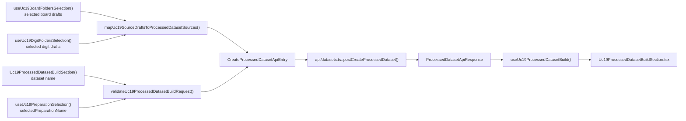
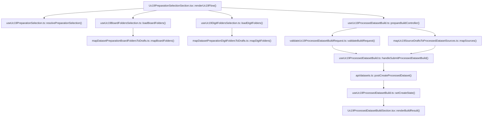

# UC-19-FE - Plan implementacyjny dla `POST /api/datasets/processed`

## 1) Przeznaczenie endpointa
- Endpoint `POST /api/datasets/processed` buduje finalny dataset `.npz` z juz istniejacego `preparation`, a nie bezposrednio z danych `raw`.
- Z perspektywy `FE` endpoint:
  - zbiera `preparationName`,
  - zbiera nazwe finalnego datasetu,
  - zbiera wybrane zrodla `board` i `digit` wraz z lokalnymi splitami,
  - wysyla jeden kontrakt do `BE`,
  - pokazuje wynik builda oraz ostrzezenia zwrocone przez `BE`,
  - nie zna fizycznych sciezek runtime,
  - nie komunikuje sie bezposrednio z `ML`.
- `Backend` pozostaje jedynym zrodlem prawdy dla:
  - istnienia `preparation`,
  - walidacji `sources`,
  - akceptacji lub odrzucenia builda,
  - finalnych metadanych datasetu `.npz`,
  - raportow `sourceReports`,
  - ostrzezen i licznikow probek.

## 2) Zakres planu
- Plan dotyczy wylacznie czesci `FE`.
- Plan nie projektuje implementacji `BE` ani `ML`; opisuje tylko publiczny kontrakt i minimalny kontekst wymagany frontendowi.
- Nie nalezy sugerowac sie biezaca implementacja `BE` i `ML` poza uzgodnionymi nazwami modeli, endpointami i aktualnym kodem `src/Frontend`.
- Plan musi respektowac warstwowosc i MVVC.
- Plan musi reuse'owac juz gotowe elementy z:
  - `UC-17`,
  - `UC-18`,
  - wczesniej dodanych endpointow `UC-19`:
    - `GET /api/datasets/preparations`
    - `GET /api/datasets/preparations/{preparationName}`
    - `GET /api/datasets/preparations/{preparationName}/board/folders`
    - `GET /api/datasets/preparations/{preparationName}/digit/folders`
- Plan nie moze rozwijac legacy flow `UC-12` jako glownej sciezki budowy `.npz`.

## 3) Aktualny stan FE i wniosek dla tej historyjki
- W `src/Frontend` istnieje juz nowy szkielet `UC-19`:
  - wybor `preparation`,
  - walidacja gotowosci wybranego rekordu,
  - pobieranie i selekcja `board/folders`,
  - pobieranie i selekcja `digit/folders`.
- Brakuje warstwy finalnego builda:
  - formularza nazwy datasetu,
  - agregacji wybranych zrodel `board + digit`,
  - walidacji requestu builda,
  - hooka do `POST /api/datasets/processed`,
  - prezentacji sukcesu / bledu / warningow po buildzie.
- Istnieje stary klient i stary widok legacy:
  - `src/Frontend/src/api/datasets.ts`
  - `src/Frontend/src/components/Uc12DatasetPreparationSection.tsx`
- Wniosek:
  - nie tworzyc rownoleglego klienta builda,
  - zrefaktoryzowac istniejacy klient `processed`,
  - dodac nowy build step do aktualnego feature `UC-19`,
  - potraktowac `UC-12` jako kontekst legacy i oslonic przed wysylaniem starego payloadu `raw`.

## 4) Glowne zalozenia architektoniczne
- FE pozostaje praktycznie `feature-based` i warstwowy:
  - `app`
  - `features`
  - `api`
  - `shared`
  - `types`
- Dla tego endpointa nalezy utrzymac MVVC:
  - `Model`: kontrakty API, draft wybranych zrodel, walidacja build requestu,
  - `View`: formularz nazwy datasetu, preview requestu, bannery bledu/sukcesu, wynik builda,
  - `ViewController`: orkiestracja selekcji, walidacji, POST requestu i refreshu stanow,
  - `Infrastructure`: klient HTTP, walidacja JSON, mapowanie bledow HTTP.
- Nie wolno:
  - skladac URL-a w komponentach React,
  - duplikowac `fetch + parse + validate`,
  - dublowac logiki mapowania `board/digit drafts -> API sources`,
  - mieszac nowego flow z legacy `raw -> processed`,
  - auto-fallbackowac do `UC-12`, gdy nowy flow napotka blad.
- Jesli potrzebna jest nowa usluga, najpierw nalezy sprawdzic, czy istnieje juz generyczny modul:
  - istnieje `fetchJson()` w `src/Frontend/src/api/shared/fetchJson.ts`,
  - istnieje `src/Frontend/src/api/datasets.ts`,
  - istnieja gotowe hooki wyboru `preparation`, `board`, `digit`.

## 5) Miejsce endpointa w docelowym workflow
1. Uzytkownik wchodzi do `UC-19`.
2. `FE` wybiera i waliduje `preparation`.
3. `FE` pobiera liste `board/folders` i `digit/folders`.
4. Uzytkownik zaznacza foldery i przypisuje im splity.
5. Uzytkownik wpisuje `name` finalnego datasetu.
6. `FE` buduje payload `CreateProcessedDatasetApiEntry`.
7. `FE` wysyla `POST /api/datasets/processed`.
8. `BE` zwraca `ProcessedDatasetApiResponse`.
9. `FE` pokazuje:
   - nazwe datasetu,
   - `fileName`,
   - `sampleCounts`,
   - `sourceReports`,
   - `warnings`.
10. Downstream `UC-06` moze pozniej reuse'owac `GET /api/datasets/processed` bez zmian semantyki listy.

## 6) Model API w komunikacji z `BE`

### 6.1 Request `FE -> BE`
- Metoda i sciezka: `POST /api/datasets/processed`
- Naglowki:
  - `Accept: application/json`
  - `Content-Type: application/json`
  - `Authorization: Bearer <token>` gdy aktywna jest sesja administratora

### 6.2 Model wejsciowy
- `CreateProcessedDatasetApiEntry`
  - `preparationName: string`
  - `name: string`
  - `sources: SelectedPreparedDatasetSourceApiEntry[]`
- `SelectedPreparedDatasetSourceApiEntry`
  - `name: string`
  - `type: string`
  - `splits: string[]`

Przyklad requestu:

```json
{
  "preparationName": "preparation-001",
  "name": "digits-dataset-v2",
  "sources": [
    {
      "name": "v1_training",
      "type": "board",
      "splits": ["mix"]
    },
    {
      "name": "mnist_train",
      "type": "digit",
      "splits": ["train", "val"]
    }
  ]
}
```

### 6.3 Model wyjsciowy sukcesu
- Domyslnie dla FE nalezy zalozyc `201 Created`, bo endpoint materializuje finalny rekord datasetu.
- Jesli wspolny kontrakt backendowy potwierdzi inny kod sukcesu, zmiana ma pozostac zamknieta w `src/api/datasets.ts`.
- `ProcessedDatasetApiResponse`
  - `name: string`
  - `fileName: string`
  - `preprocessingProfile: string`
  - `createdAtUtc: string`
  - `sources: SelectedPreparedDatasetSourceApiEntry[]`
  - `sampleCounts`
  - `sourceReports`
  - `warnings: string[]`
- `ProcessedDatasetSourceReportApiResponse`
  - `name: string`
  - `type: string`
  - `processedSampleCount: number`
  - `includedSampleCount: number`
  - `emptyCellCount: number`
  - `rejectedSampleCount: number`
  - `warnings: string[]`

### 6.4 Model bledu
- `ErrorApiResponse`
  - `errorType: string`
  - `message: string`

### 6.5 Reguly kontraktowe
- Nie zmieniac nazw transportowych:
  - `CreateProcessedDatasetApiEntry`
  - `ProcessedDatasetApiResponse`
  - `ProcessedDatasetSourceReportApiResponse`
  - `ProcessedDatasetsListApiResponse`
  - `ErrorApiResponse`
- Nalezy zmienic semantyke `sources` z `raw` na `prepared`, ale bez psucia nazw top-level modeli juz znanych w kodzie.
- Dla tej zmiany nalezy dodac nowy model:
  - `SelectedPreparedDatasetSourceApiEntry`
- Nie nalezy rozszerzac lub zmieniac `ProcessedDatasetListItemApiResponse`, jesli nie wymaga tego kontrakt, bo ten model jest downstream dla `UC-06`.
- Dane transportowe pozostaja w `camelCase`.

## 7) Zachowanie z kazdej warstwy MVVC

### Model
- Utrzymuje:
  - kontrakty `processed` w `src/types/api.ts`,
  - lokalny draft builda,
  - reguly walidacji nazwy datasetu,
  - reguly mapowania `board/digit drafts` na `sources`,
  - agregacje selected sources do preview requestu.
- Model nie zna `fetch`, Reacta ani statusow HTTP.

### View
- Renderuje:
  - input `name`,
  - summary wybranego `preparation`,
  - summary zaznaczonych zrodel `board` i `digit`,
  - preview payloadu,
  - przycisk startu builda,
  - bannery `loading/error/success`,
  - wynik `ProcessedDatasetApiResponse`,
  - warningi per dataset i per source.
- View nie wykonuje requestow.
- View nie interpretuje samodzielnie `401/409/422`.

### ViewController
- Reuse'uje istniejace hooki:
  - `useUc19PreparationSelection()`
  - `useUc19BoardFoldersSelection()`
  - `useUc19DigitFoldersSelection()`
- Dodaje nowa orkiestracje builda:
  - walidacja lokalna,
  - budowa payloadu,
  - `POST /api/datasets/processed`,
  - lekkie logowanie,
  - obsluga `401`,
  - opcjonalny refresh listy `processed` po sukcesie tylko wtedy, gdy jest realny konsument.
- ViewController nie zawiera walidacji ksztaltu JSON.

### Infrastructure
- Reuse'uje:
  - `fetchJson()`
  - `JsonApiError`
  - `buildAuthHeaders()` w kliencie `datasets.ts`
- Odpowiada za:
  - request `POST`,
  - expected status,
  - validate response,
  - mapowanie `ErrorApiResponse -> DatasetsApiError`.
- Infrastructure nie zna reguly:
  - ktore preparation jest gotowe,
  - czy zaznaczono sensowna kombinacje zrodel,
  - czy UI ma zablokowac przycisk.

## 8) Co juz istnieje i nalezy reuse'owac
- Istnieje os selection dla `UC-19`:
  - `src/Frontend/src/features/uc19/application/useUc19PreparationSelection.ts`
  - `src/Frontend/src/features/uc19/application/useUc19BoardFoldersSelection.ts`
  - `src/Frontend/src/features/uc19/application/useUc19DigitFoldersSelection.ts`
- Istnieja gotowe modele domenowe source draft:
  - `uc19PreparationSourceDraft.ts`
  - `uc19BoardSourceDraft.ts`
  - `uc19DigitSourceDraft.ts`
- Istnieja gotowe walidatory i helpery splitow:
  - `validateUc19PreparationSourceDraft.ts`
  - `validateUc19BoardSourceDraft.ts`
  - `validateUc19DigitSourceDraft.ts`
  - `toggleUc19PreparationSourceSplit.ts`
  - `toggleUc19BoardSourceSplit.ts`
  - `toggleUc19DigitSourceSplit.ts`
  - `reconcileUc19PreparationSourceDrafts.ts`
  - `reconcileUc19BoardSourceDrafts.ts`
  - `reconcileUc19DigitSourceDrafts.ts`
- Istnieje juz klient `processed`, ale legacy semantyczny:
  - `src/Frontend/src/api/datasets.ts`
- Istnieje generyczny mechanizm HTTP:
  - `src/Frontend/src/api/shared/fetchJson.ts`
- Istnieja kontrakty `processed` i `preparation`:
  - `src/Frontend/src/types/api.ts`
- Wniosek:
  - nie tworzyc nowego `processedApi.ts`,
  - nie tworzyc nowego globalnego store,
  - nie kopiowac gotowych hookow selection do nowego hooka builda,
  - dodac tylko cienka warstwe builda nad istniejacym flow `UC-19`.

## 9) Pliki per warstwa i odpowiedzialnosci

### 9.1 View
- `[REFACTOR]` `src/Frontend/src/features/uc19/api/Uc19PreparationSelectionSection.tsx`
  - pozostaje glownym shell-em `UC-19`;
  - ma skladac razem:
    - wybor `preparation`,
    - wybor `board`,
    - wybor `digit`,
    - nowy formularz builda;
  - nie powinien wykonywac `fetch`.
- `[REFACTOR]` `src/Frontend/src/features/uc19/api/Uc19BoardFoldersSelectionSection.tsx`
  - powinien stac sie cienszym widokiem dla stanu zwracanego przez hook;
  - nie powinien byc wlascicielem danych, jesli parent potrzebuje selected drafts do builda.
- `[REFACTOR]` `src/Frontend/src/features/uc19/api/Uc19DigitFoldersSelectionSection.tsx`
  - analogicznie jak sekcja `board`.
- `[ADD]` `src/Frontend/src/features/uc19/api/Uc19ProcessedDatasetBuildSection.tsx`
  - formularz `name`,
  - preview requestu,
  - przycisk `Buduj dataset .npz`,
  - prezentacja `ProcessedDatasetApiResponse`,
  - warningi i raporty zrodel.
- `[REUSE]` `src/Frontend/src/features/uc19/api/Uc19BoardSourceSplitList.tsx`
  - lista i togglowanie splitow dla `board`.
- `[REUSE]` `src/Frontend/src/features/uc19/api/Uc19DigitSourceSplitList.tsx`
  - lista i togglowanie splitow dla `digit`.
- `[REFACTOR]` `src/Frontend/src/features/uc19/api/index.ts`
  - eksport nowego `Uc19ProcessedDatasetBuildSection`.
- `[REUSE + EXTEND]` `src/Frontend/src/styles/datasets.css`
  - style formularza builda,
  - preview payloadu,
  - summary selected sources,
  - warningi i raporty source reports.
- `[CONTEXT ONLY]` `src/Frontend/src/app/views/DatasetsView.tsx`
  - nie wymaga nowego kroku steppera;
  - `UC-19` pozostaje jednym etapem widoku.
- `[LEGACY GUARD]` `src/Frontend/src/components/Uc12DatasetPreparationSection.tsx`
  - nie rozwijac go o nowy flow;
  - jesli endpoint zmienia semantyke payloadu, ten komponent trzeba co najmniej oslonic przed wysylka starego requestu.

### 9.2 ViewController / Application
- `[REUSE]` `src/Frontend/src/features/uc19/application/useUc19PreparationSelection.ts`
  - zrodlo prawdy dla wyboru `preparation`.
- `[REUSE]` `src/Frontend/src/features/uc19/application/useUc19BoardFoldersSelection.ts`
  - zrodlo prawdy dla selected `board` drafts.
- `[REUSE]` `src/Frontend/src/features/uc19/application/useUc19DigitFoldersSelection.ts`
  - zrodlo prawdy dla selected `digit` drafts.
- `[REUSE]` `src/Frontend/src/features/uc19/application/uc19BoardFoldersSelectionReducer.ts`
  - reducer wyboru `board`.
- `[REUSE]` `src/Frontend/src/features/uc19/application/uc19BoardFoldersSelectionTypes.ts`
  - typy stanu `board`.
- `[REUSE]` `src/Frontend/src/features/uc19/application/uc19DigitFoldersSelectionReducer.ts`
  - reducer wyboru `digit`.
- `[REUSE]` `src/Frontend/src/features/uc19/application/uc19DigitFoldersSelectionTypes.ts`
  - typy stanu `digit`.
- `[ADD]` `src/Frontend/src/features/uc19/application/useUc19ProcessedDatasetBuild.ts`
  - orkiestruje lokalny draft `name`,
  - liczy `requestPreview`,
  - waliduje request,
  - wywoluje `postCreateProcessedDataset()`,
  - mapuje statusy na hinty,
  - utrzymuje `createState`,
  - obsluguje `401`,
  - loguje lekko start/sukces/blad.
- `[REUSE]` `src/Frontend/src/features/uc17/application/useUc17DatasetPreparations.ts`
  - nadal dostarcza upstream dla listy i szczegolow `preparation`;
  - nie kopiowac tej logiki do build hooka.

### 9.3 Model / Domain
- `[REFACTOR]` `src/Frontend/src/types/api.ts`
  - refaktor kontraktow `processed` z semantyki `raw` na `prepared`;
  - dodanie `SelectedPreparedDatasetSourceApiEntry`;
  - utrzymanie kompatybilnej listy `ProcessedDatasetListItemApiResponse` dla `UC-06`.
- `[REUSE]` `src/Frontend/src/shared/datasets/getDatasetPreparationStatusPresentation.ts`
  - pozostaje upstream dla statusow `preparation`.
- `[REUSE]` `src/Frontend/src/features/uc19/domain/uc19PreparationSourceDraft.ts`
  - wspolny model source draft.
- `[REUSE]` `src/Frontend/src/features/uc19/domain/uc19BoardSourceDraft.ts`
  - model `board` draft.
- `[REUSE]` `src/Frontend/src/features/uc19/domain/uc19DigitSourceDraft.ts`
  - model `digit` draft.
- `[REUSE]` `src/Frontend/src/features/uc19/domain/evaluateUc19PreparationReadiness.ts`
  - upstream dla warunku `canContinueToSources`.
- `[REUSE]` `src/Frontend/src/features/uc19/domain/validateUc19PreparationSourceDraft.ts`
  - generyczna walidacja splitow enabled source.
- `[REUSE]` `src/Frontend/src/features/uc19/domain/toggleUc19PreparationSourceSplit.ts`
  - generyczna logika splitu.
- `[REUSE]` `src/Frontend/src/features/uc19/domain/reconcileUc19PreparationSourceDrafts.ts`
  - generyczne uzgadnianie draftow po reloadzie.
- `[REUSE]` `src/Frontend/src/features/uc19/domain/mapDatasetPreparationBoardFoldersToDrafts.ts`
  - mapowanie `board/folders -> board drafts`.
- `[REUSE]` `src/Frontend/src/features/uc19/domain/reconcileUc19BoardSourceDrafts.ts`
  - specyficzne uzgadnianie `board`.
- `[REUSE]` `src/Frontend/src/features/uc19/domain/validateUc19BoardSourceDraft.ts`
  - walidacja pojedynczego `board`.
- `[REUSE]` `src/Frontend/src/features/uc19/domain/toggleUc19BoardSourceSplit.ts`
  - togglowanie splitow `board`.
- `[REUSE]` `src/Frontend/src/features/uc19/domain/mapDatasetPreparationDigitFoldersToDrafts.ts`
  - mapowanie `digit/folders -> digit drafts`.
- `[REUSE]` `src/Frontend/src/features/uc19/domain/reconcileUc19DigitSourceDrafts.ts`
  - specyficzne uzgadnianie `digit`.
- `[REUSE]` `src/Frontend/src/features/uc19/domain/validateUc19DigitSourceDraft.ts`
  - walidacja pojedynczego `digit`.
- `[REUSE]` `src/Frontend/src/features/uc19/domain/toggleUc19DigitSourceSplit.ts`
  - togglowanie splitow `digit`.
- `[ADD]` `src/Frontend/src/features/uc19/domain/mapUc19SourceDraftsToProcessedDatasetSources.ts`
  - laczy `selected board drafts + selected digit drafts` do:
    - `SelectedPreparedDatasetSourceApiEntry[]`
  - sortuje tylko wtedy, gdy kontrakt lub UX tego wymaga; domyslnie zachowuje kolejnosc z list.
- `[ADD]` `src/Frontend/src/features/uc19/domain/validateUc19ProcessedDatasetBuildRequest.ts`
  - waliduje:
    - `preparationName`,
    - `name`,
    - przynajmniej jedno wybrane zrodlo,
    - brak niepoprawnych selected drafts,
    - brak pustych splitow,
    - zakaz mieszania `mix` z `train/val/test`.

### 9.4 Infrastructure
- `[REFACTOR]` `src/Frontend/src/api/datasets.ts`
  - pozostaje klientem `POST /api/datasets/processed` oraz `GET /api/datasets/processed`;
  - powinien przejsc na `fetchJson()`,
  - powinien walidowac nowy ksztalt `CreateProcessedDatasetApiEntry`,
  - powinien walidowac nowy ksztalt `ProcessedDatasetApiResponse.sources`.
- `[REUSE]` `src/Frontend/src/api/shared/fetchJson.ts`
  - wspolny mechanizm `fetch + parse + validate + errorFactory`.
- `[REUSE / DOWNSTREAM]` `src/Frontend/src/components/Uc06TrainingSection.tsx`
  - downstream konsument `GET /api/datasets/processed`;
  - nie psuc jego kontraktu listowego bez koniecznosci.

## 10) Glowne funkcje
- `postCreateProcessedDataset()`
- `getProcessedDatasets()`
- `fetchJson()`
- `useUc19PreparationSelection()`
- `useUc19BoardFoldersSelection()`
- `useUc19DigitFoldersSelection()`
- `useUc19ProcessedDatasetBuild()`
- `mapUc19SourceDraftsToProcessedDatasetSources()`
- `validateUc19ProcessedDatasetBuildRequest()`
- `handleSubmitProcessedDatasetBuild()`
- `toCreateStatusHint()`
- `renderRequestPreview()`

## 11) Docelowy przeplyw w FE
1. `Uc19PreparationSelectionSection()` pobiera i renderuje stan `preparation`.
2. Ten sam shell utrzymuje stan `board` i `digit` przez istniejace hooki.
3. `Uc19ProcessedDatasetBuildSection()` dostaje z parenta:
   - `selectedPreparationName`,
   - `canContinueToSources`,
   - `selectedBoardDrafts`,
   - `selectedDigitDrafts`.
4. Uzytkownik wpisuje nazwe datasetu.
5. `validateUc19ProcessedDatasetBuildRequest()` sprawdza, czy request ma sens lokalnie.
6. `mapUc19SourceDraftsToProcessedDatasetSources()` buduje `sources`.
7. `useUc19ProcessedDatasetBuild()` sklada `CreateProcessedDatasetApiEntry`.
8. Hook wywoluje `postCreateProcessedDataset()`.
9. Po sukcesie hook zapisuje `ProcessedDatasetApiResponse`.
10. View pokazuje summary builda i warningi.
11. Ewentualny refresh listy `processed` pozostaje opcjonalnym krokiem downstream, a nie warunkiem sukcesu create.

## 12) Wyjatki, fallbacki i zachowanie bledowe

### 12.1 Statusy HTTP
- `201 Created`
  - build zakonczony sukcesem;
  - pokazac wynik i warningi.
- `400 Bad Request`
  - niepoprawny request;
  - pokazac blad bez retry.
- `401 Unauthorized`
  - sesja wygasla;
  - wywolac `onUnauthorized()`.
- `404 Not Found`
  - `preparation` albo wybrane source zniknelo;
  - zablokowac build i pokazac czytelny komunikat.
- `409 Conflict`
  - dataset o tej nazwie juz istnieje albo build koliduje z istniejacym rekordem;
  - zostawic selection i formularz bez resetu.
- `422 Unprocessable Entity`
  - request jest semantycznie niespojny;
  - pokazac blad domenowy z backendu.
- `500`, `502`, `503`, `504`
  - blad techniczny;
  - bez automatycznego fallbacku do legacy flow.

### 12.2 Bledy kontraktu
- Jesli sukces HTTP zwroci zly JSON:
  - traktowac to jako blad techniczny,
  - nie mapowac na sztuczny sukces,
  - zalogowac `console.error`,
  - zostawic formularz i selection.

### 12.3 Fallbacki dopuszczalne
- Zachowanie poprzedniego `createState.response` w trakcie nowej proby.
- Zachowanie selected drafts po nieudanym buildzie.
- Zachowanie wpisanej nazwy datasetu po bledzie domenowym lub technicznym.

### 12.4 Fallbacki niedopuszczalne
- Zgadywanie `preparationName` z innego ekranu.
- Budowanie `sources` z niewybranych draftow.
- Automatyczne przejscie do `UC-12`.
- Wysylka pustego requestu tylko po to, by backend "powiedzial co jest zle".
- Bezposrednie odpytywanie `ML` z FE.

### 12.5 Zachowanie UI
- `loading`
  - blokuje przycisk submit,
  - nie czyści selected sources.
- `error`
  - pokazuje banner bledu i opcjonalny hint per status.
- `success`
  - pokazuje summary wyniku,
  - nie musi czyscic selection automatycznie, bo uzytkownik moze chciec zbudowac kolejny wariant.

## 13) Logi diagnostyczne FE
- Logi maja pomagac, ale nie spamowac.

### `console.info`
- start builda datasetu,
- sukces builda,
- reczne ponowienie proby,
- liczba selected `board`,
- liczba selected `digit`.

### `console.warn`
- `401`,
- `404`,
- `409`,
- utrata gotowosci `preparation` przed submit,
- wykrycie nieaktualnego selected source po odswiezeniu upstream list.

### `console.error`
- `5xx`,
- bledny ksztalt response sukcesu,
- nieoczekiwany blad parsowania lub walidacji odpowiedzi.

### Guardraile logowania
- nie logowac tokena,
- nie logowac pelnego payloadu requestu,
- nie logowac pelnego response body,
- logowac tylko lekkie metadane:
  - `preparationName`,
  - `datasetName`,
  - `boardSelectedCount`,
  - `digitSelectedCount`,
  - `httpStatus`,
  - `errorType`,
  - `warningsCount`.

## 14) Opis przeplywu w obrebie `BE` - tylko kontekst dla FE
1. `FE` wysyla `POST /api/datasets/processed`.
2. `BE` weryfikuje autoryzacje.
3. `BE` waliduje:
   - `preparationName`,
   - `name`,
   - liste `sources`,
   - spojnosc `name + type + splits` wzgledem wybranego `preparation`.
4. `BE` tlumaczy logiczne `sources` na swoja wewnetrzna polityke builda.
5. `BE` wywoluje warstwe aplikacyjna odpowiedzialna za build `.npz`.
6. `BE` zwraca jeden finalny response z metadanymi datasetu, warningami i raportami.
7. `FE` nie powinien znac:
   - jak `BE` rozmawia z `ML`,
   - gdzie plik jest zapisany na serwerze,
   - jak wyglada split policy w szczegolach technicznych.

## 15) Mermaid - flow modeli



## 16) Mermaid - flow logiki aplikacji



## 17) Specyficzna logika i pseudokod

### 17.1 Walidacja build requestu

```text
validateUc19ProcessedDatasetBuildRequest(input):
  if input.preparationName is null or empty:
    return "Wybierz preparation przed buildem."

  if input.canContinueToSources is false:
    return "Wybrane preparation nie odblokowuje jeszcze builda."

  trimmedName = input.name.trim()

  if trimmedName is empty:
    return "Podaj nazwe finalnego datasetu."

  if trimmedName contains disallowed characters or "..":
    return "Nazwa datasetu zawiera niedozwolone znaki."

  selectedSources = input.boardSelectedDrafts + input.digitSelectedDrafts

  if selectedSources.length == 0:
    return "Wybierz przynajmniej jedno zrodlo board lub digit."

  if any selected source is invalid:
    return "Popraw splity dla zaznaczonych zrodel."

  return null
```

### 17.2 Mapowanie draftow do requestu

```text
mapUc19SourceDraftsToProcessedDatasetSources(boardDrafts, digitDrafts):
  sources = []

  for each draft in boardDrafts where draft.enabled:
    sources.push({
      name: draft.folderName,
      type: draft.type,
      splits: draft.splits
    })

  for each draft in digitDrafts where draft.enabled:
    sources.push({
      name: draft.folderName,
      type: draft.type,
      splits: draft.splits
    })

  return sources
```

### 17.3 Orkiestracja submitu

```text
handleSubmitProcessedDatasetBuild():
  validationError = validateUc19ProcessedDatasetBuildRequest(input)

  if validationError exists:
    setFormError(validationError)
    return

  request = {
    preparationName: selectedPreparationName,
    name: datasetName.trim(),
    sources: mapUc19SourceDraftsToProcessedDatasetSources(
      boardSelectedDrafts,
      digitSelectedDrafts
    )
  }

  setCreateState(loading)

  response = postCreateProcessedDataset(apiBaseUrl, request, accessToken, signal)

  setCreateState(success(response))
  clearFormError()
```

### 17.4 Legacy guard dla `UC-12`

```text
if old legacy view still exposes POST /api/datasets/processed with raw payload:
  do not keep it active unchanged
  either:
    - disable create action and show info "build moved to UC-19"
    - or refactor it to reuse the new processed contract

preferred option:
  keep legacy view read-only or clearly blocked for create
```

## 18) Workflow GitHub i konfiguracja runtime
- Dla tego endpointa nie jest potrzebna nowa zmienna FE ani osobna zmiana w `frontend-cd.yml`.
- Aktualny workflow FE:
  - `.github/workflows/frontend-cd.yml`
  - buduje `src/Frontend`,
  - ustawia `VITE_API_BASE_URL="${FE_VITE_API_BASE_URL:-/api}"`,
  - pakuje statyczny build.
- Poniewaz endpoint pozostaje pod `/api/...`, FE powinien dalej dzialac:
  - lokalnie na stalym `/api`,
  - produkcyjnie przez `VITE_API_BASE_URL`.
- Jesli `BE` wymaga zmian `appsettings.production.json` dla runtime builda datasetow, to jest to zakres planu backendowego i workflow backendowego, nie frontendowego.
- Guardrail:
  - nie hardcodowac URL-i serwerowych w komponentach,
  - nie dokladac nowego env tylko dla `UC-19 POST`,
  - nie przenosic logiki biznesowej do workflow.

## 19) Kolejnosc implementacji kodu dla historyjki
1. Zweryfikowac i zrefaktoryzowac kontrakty `processed` w `src/Frontend/src/types/api.ts`.
2. Zrefaktoryzowac `src/Frontend/src/api/datasets.ts`, aby korzystal z `fetchJson()` i nowego kontraktu `prepared`.
3. Dodac `mapUc19SourceDraftsToProcessedDatasetSources.ts`.
4. Dodac `validateUc19ProcessedDatasetBuildRequest.ts`.
5. Dodac hook `useUc19ProcessedDatasetBuild.ts`.
6. Zrefaktoryzowac `Uc19PreparationSelectionSection.tsx`, aby parent mial dostep do selected drafts `board` i `digit`.
7. Zrefaktoryzowac sekcje `board` i `digit` do roli cienkich widokow sterowanych stanem z parenta.
8. Dodac `Uc19ProcessedDatasetBuildSection.tsx`.
9. Rozszerzyc `features/uc19/api/index.ts`.
10. Dostosowac `datasets.css`.
11. Dodac minimalny legacy guard w `Uc12DatasetPreparationSection.tsx`, jesli stary payload stalby sie niekompatybilny.
12. Zweryfikowac, ze `UC-06` nadal dziala na `GET /api/datasets/processed`.
13. Uruchomic kontrola jakosci FE.

## 20) Zaleznosci pomiedzy historyjkami
- `UC-17`
  - twarda zaleznosc funkcjonalna;
  - bez `preparation` nie ma nowego builda.
- `UC-18`
  - zaleznosc w zakresie browse/cleanup;
  - ten use-case nie jest bezposrednio wymagany do samego POST, ale dostarcza kontekst poruszania sie po `preparation`.
- `UC-19 FE GET /api/datasets/preparations`
  - upstream dla wyboru `preparation`.
- `UC-19 FE GET /api/datasets/preparations/{preparationName}`
  - upstream dla walidacji gotowosci szczegolow.
- `UC-19 FE GET /api/datasets/preparations/{preparationName}/board/folders`
  - upstream dla wyboru source `board`.
- `UC-19 FE GET /api/datasets/preparations/{preparationName}/digit/folders`
  - upstream dla wyboru source `digit`.
- `UC-12`
  - legacy zaleznosc kolizyjna, bo uzywa tego samego endpointa, ale starej semantyki;
  - wymaga guardraila, zeby nie zostawic zepsutego create flow.
- `UC-06`
  - downstream zaleznosc od listy `processed datasets`;
  - nie psuc `ProcessedDatasetListItemApiResponse` bez koniecznosci.

## 21) Guardraile implementacyjne
- Nie tworzyc nowego klienta HTTP obok `src/api/datasets.ts`.
- Nie kopiowac `fetchJson()` do `datasets.ts`.
- Nie skladac requestu `POST /api/datasets/processed` w JSX.
- Nie trzymac selected `board/digit` tylko lokalnie w child view, jesli parent potrzebuje ich do builda.
- Nie rozwijac `UC-12` jako glownej sciezki po tej zmianie.
- Nie zmieniac bez potrzeby kontraktu listowego `GET /api/datasets/processed`.
- Nie auto-czyscic selection po sukcesie, jesli nie ma takiego wymagania UX.
- Nie robic automatycznego retry na `409`, `422` ani `404`.
- Nie logowac ciezkich payloadow ani kazdego rerenderu.
- Nie zakladac, ze `type` jest zawsze zamkniete enumem transportowym; lokalne zawazenie domenowe moze istniec tylko wewnatrz `UC-19`.

## 22) Inne istotne reguly
- `FE` ma zachowac warstwowosc:
  - view nie robi requestow,
  - application nie waliduje JSON,
  - infrastructure nie zna regul biznesowych builda.
- `FE` ma respektowac juz dodane nazwy modeli top-level i pola kontraktu, o ile nie sa one jawnie refaktoryzowane przez sam use-case `UC-19`.
- Jesli refaktor `processed` dotknie starego typu `SelectedRawDatasetSourceApiEntry`, nalezy:
  - nie rozlewac tej semantyki poza miejsca legacy,
  - w nowym flow konsekwentnie przejsc na `SelectedPreparedDatasetSourceApiEntry`.
- `UC-19 POST` ma byc cienkim build requestem opartym o juz wybrane dane, a nie nowym ekranem do ponownego wybierania `preparation`.
- Build result moze byc pokazany od razu w `UC-19`, ale nie powinien przejmowac odpowiedzialnosci za trening ani katalog modeli.
