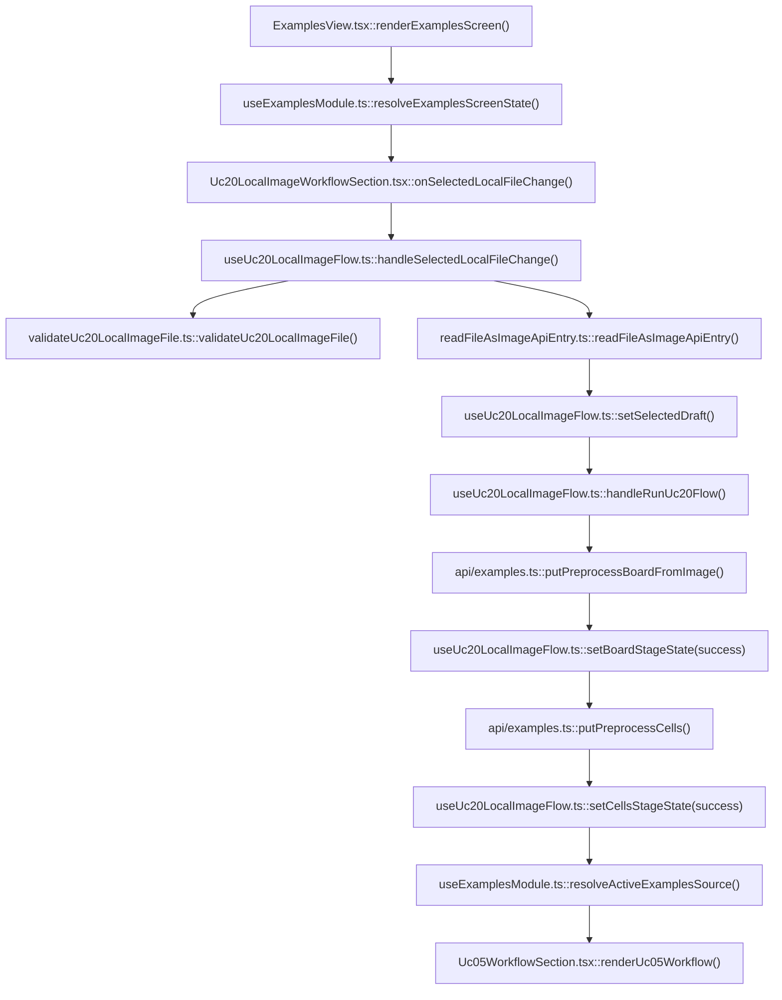

# UC-20-FE - Plan implementacyjny dla `PUT /api/examples/preprocess/board`

## 1) Przeznaczenie endpointa
- Endpoint `PUT /api/examples/preprocess/board` otwiera nowa publiczna sciezke preprocessingu dla lokalnego obrazu Sudoku wybranego z komputera uzytkownika.
- Z perspektywy `FE` ten endpoint:
  - przyjmuje lokalny obraz jako `ImageApiEntry`,
  - zwraca wynik etapu `board` jako `ImageApiResponse`,
  - nie wymaga wczesniejszego uploadu do biblioteki `examples`,
  - nie tworzy rekordu `example`,
  - nie zmienia semantyki juz istniejacego `PUT /api/examples/preprocess/cells`.
- Ten endpoint jest tylko pierwszym etapem calego workflow `UC-20`:
  - `lokalny plik -> board -> cells -> UC-05`.
- Po stronie `FE` endpoint ma byc traktowany jako alternatywne wejscie do juz istniejacego downstream flow:
  - `UC-04` i `UC-20` maja finalnie dostarczac ten sam typ wyniku do `UC-05`, czyli `CellsGridApiResponse`.

## 2) Zakres planu
- Plan dotyczy wylacznie czesci `FE`.
- Plan nie projektuje implementacji `BE` ani `ML`; opisuje tylko kontrakt publiczny i frontendowy sposob integracji.
- Nie nalezy sugerowac sie tym, co obecnie jest zaimplementowane w `BE` i `ML`, poza juz zaakceptowanymi kontraktami i nazwami modeli.
- Plan musi respektowac juz dodane historyjki i ich kontrakty, w szczegolnosci:
  - `UC-03`,
  - `UC-04`,
  - `UC-05A`,
  - `UC-05B`,
  - `UC-05D`,
  - `UC-05E`,
  - `UC-14`.
- Jesli cos juz istnieje w `src/Frontend`, ma byc reuse'owane albo lekko rozszerzone, a nie duplikowane.
- Dokument obejmuje tez minimalny kontekst integracyjny z:
  - `GET /api/examples/{name}`,
  - `PUT /api/examples/{name}/preprocess/board`,
  - `PUT /api/examples/preprocess/cells`,
  bo `UC-20` musi wspolistniec z juz gotowym ekranem `examples`.

## 3) Aktualny stan FE i wniosek dla tej historyjki
- W `src/Frontend` istnieje juz ekran `examples`, ktory obsluguje:
  - `UC-01`,
  - `UC-02`,
  - `UC-04`,
  - downstream `UC-05`.
- Istnieje juz klient API:
  - `src/Frontend/src/api/examples.ts`
  i to on jest naturalnym miejscem dla nowego requestu `PUT /api/examples/preprocess/board`.
- Istnieje juz downstream workflow rozpoznania i solve:
  - `src/Frontend/src/features/uc05/*`,
  - `src/Frontend/src/features/uc05a/*`,
  - `src/Frontend/src/features/uc05b/*`,
  - `src/Frontend/src/features/uc05d/*`,
  - `src/Frontend/src/features/uc05e/*`.
- Nie istnieje jeszcze generyczny helper:
  - `File -> ImageApiEntry`,
  - klientowy walidator lokalnego pliku obrazu,
  - wydzielony feature `UC-20` we frontendzie.
- Wniosek:
  - nie robic obejscia przez `POST /api/examples`,
  - nie upychac calej logiki `UC-20` w `ExamplesView.tsx`,
  - nie dublowac `UC-05`,
  - dodac osobny feature `uc20`,
  - zachowac jeden wspolny downstream `Uc05WorkflowSection`.

## 4) Glowne zalozenia architektoniczne
- FE pozostaje warstwowy i pragmatycznie feature-based:
  - `app/*` jako composition root i ekran,
  - `features/uc20/*` jako logika nowej historyjki,
  - `api/*` jako transport do `BE`,
  - `shared/*` jako generyczne utility wielokrotnego uzytku,
  - `types/*` jako kontrakty transportowe.
- Dla `UC-20` nalezy utrzymac MVVC:
  - `Model`: lokalny draft wybranego pliku, walidacja metadanych, kontrakty API,
  - `View`: picker pliku, preview, bannery walidacyjne i wyniki etapow,
  - `ViewController`: orkiestracja wyboru pliku, konwersji do `ImageApiEntry`, requestu `board`, requestu `cells`, resetow i retry,
  - `Infrastructure`: klient HTTP, helper `File -> ImageApiEntry`, walidacja JSON.
- `UC-20` nie moze tworzyc drugiego workflow rozpoznania `81` komorek.
- `UC-20` nie moze tworzyc drugiego modelu planszy obok `recognizedGrid`.
- `UC-20` ma dostarczyc jedynie nowe zrodlo wejscia do juz istniejacego `UC-05`.
- Nalezy utrzymac jedna aktywna sciezke wejscia na ekranie `examples`:
  - albo biblioteka `examples`,
  - albo lokalny plik `UC-20`.
- Lokalny obraz i wyniki jego preprocessingu maja istniec tylko w pamieci przegladarki:
  - bez `localStorage`,
  - bez `sessionStorage`,
  - bez `IndexedDB`.
- Jesli trzeba dodac nowa usluge, najpierw trzeba sprawdzic reuse:
  - `src/Frontend/src/api/examples.ts`,
  - `src/Frontend/src/api/shared/fetchJson.ts`,
  - `src/Frontend/src/api/shared/isImageApiResponse.ts`,
  - `src/Frontend/src/shared/images/toImageDataUrl.ts`.
- Jesli czegos brakuje, nowa abstrakcja ma byc generyczna pod kolejne use-case'y lokalnych obrazow, a nie zaszyta tylko pod `UC-20`.

## 5) Miejsce endpointa w docelowym workflow
1. Uzytkownik wchodzi do widoku `examples`.
2. Wybiera lokalny plik obrazu Sudoku z komputera.
3. `FE` waliduje typ i rozmiar pliku po stronie klienta.
4. `FE` tworzy lokalny preview bez odczytu przez `GET /api/examples/{name}`.
5. `FE` konwertuje plik do `ImageApiEntry`.
6. `FE` wysyla `PUT /api/examples/preprocess/board`.
7. `BE` zwraca `ImageApiResponse` z wyprostowana plansza.
8. `FE` trzyma wynik etapu `board` w pamieci i wysyla go do `PUT /api/examples/preprocess/cells`.
9. `BE` zwraca `CellsGridApiResponse`.
10. `FE` przekazuje `CellsGridApiResponse` do juz istniejacego `UC-05`.
11. `UC-05A` buduje `recognizedGrid`, a dalsze kroki solve dzialaja bez zmian kontraktowych.

## 6) Model API w komunikacji z `BE`

### 6.1 Request `FE -> BE`
- Metoda i sciezka: `PUT /api/examples/preprocess/board`
- Naglowki:
  - `Accept: application/json`
  - `Content-Type: application/json`
- Ten endpoint jest publiczny; `FE` nie dolacza tokena administracyjnego.

### 6.2 Model wejsciowy
- `ImageApiEntry`
  - `mimeType: string`
  - `base64: string`

Przyklad requestu:

```json
{
  "mimeType": "image/jpeg",
  "base64": "/9j/4AAQSkZJRgABAQAAAQABAAD..."
}
```

### 6.3 Model wyjsciowy sukcesu
- `200 OK`
- `ImageApiResponse`
  - `mimeType: string`
  - `base64: string`

Przyklad response:

```json
{
  "mimeType": "image/png",
  "base64": "iVBORw0KGgoAAAANSUhEUgAA..."
}
```

### 6.4 Dalszy request downstream
- `PUT /api/examples/preprocess/cells`
- Request body:
  - `ImageApiEntry`
- Response:
  - `CellsGridApiResponse`

### 6.5 Model bledu
- `ErrorApiResponse`
  - `errorType: string`
  - `message: string`

### 6.6 Reguly kontraktowe
- Nie zmieniac nazw:
  - `ImageApiEntry`,
  - `ImageApiResponse`,
  - `CellsGridApiResponse`,
  - `ErrorApiResponse`.
- Nie tworzyc nowego rownoleglego modelu typu:
  - `LocalImageApiEntry`,
  - `LocalBoardApiResponse`.
- `UC-20` ma reuse'owac istniejace kontrakty obrazow 1:1.
- Dane transportowe pozostaja w `camelCase`.

## 7) Zachowanie z kazdej warstwy MVVC

### Model
- Utrzymuje:
  - kontrakty API juz obecne w `src/types/api.ts`,
  - lokalny draft wybranego pliku,
  - klientowe reguly walidacji typu i rozmiaru,
  - informacje potrzebne do preview i ponownego uruchomienia flow.
- Model nie zna `fetch`, Reacta ani statusow HTTP.
- Model nie powinien przechowywac surowego `File` poza zakresem potrzeby aktywnego flow.

### View
- Renderuje:
  - `input type="file"`,
  - opis wspieranych typow,
  - banner walidacji lokalnej,
  - lokalny preview obrazu,
  - stan requestu `board`,
  - stan requestu `cells`,
  - akcje `Uruchom`, `Uruchom ponownie`, `Wyczysc wybor`.
- View nie wykonuje requestow.
- View nie wykonuje konwersji `File -> ImageApiEntry`.
- View nie podejmuje decyzji o tym, kiedy resetowac `UC-05`.

### ViewController
- Odpowiada za:
  - przyjecie pliku z `input`,
  - walidacje klientowa,
  - utworzenie preview,
  - utworzenie `ImageApiEntry`,
  - wysylke `PUT /api/examples/preprocess/board`,
  - wysylke `PUT /api/examples/preprocess/cells`,
  - trzymanie wynikow obu etapow w pamieci,
  - reset po zmianie zrodla,
  - lekkie logowanie diagnostyczne.
- ViewController ma tez pilnowac, aby `UC-04` i `UC-20` nie wystawialy jednoczesnie dwoch konkurencyjnych `cellsGrid` do `UC-05`.

### Infrastructure
- Odpowiada za:
  - klient HTTP dla nowego endpointu,
  - walidacje ksztaltu JSON response,
  - mapowanie `ErrorApiResponse`,
  - generyczny helper do odczytu lokalnego pliku obrazu.
- Infrastructure nie zna reguly:
  - ktore zrodlo jest aktywne na ekranie,
  - kiedy ma sie pokazac `UC-05`,
  - kiedy wyczyscic aktualne `recognizedGrid`.

## 8) Co juz istnieje i nalezy reuse'owac
- Istnieja kontrakty transportowe:
  - `src/Frontend/src/types/api.ts`
- Istnieje klient dla examples i preprocessingu:
  - `src/Frontend/src/api/examples.ts`
- Istnieje generyczny helper `fetch + parse + validate`:
  - `src/Frontend/src/api/shared/fetchJson.ts`
- Istnieje guard obrazu:
  - `src/Frontend/src/api/shared/isImageApiResponse.ts`
- Istnieje helper renderowania obrazow z `ImageApiResponse`:
  - `src/Frontend/src/shared/images/toImageDataUrl.ts`
- Istnieje ekran i shell examples:
  - `src/Frontend/src/app/views/ExamplesView.tsx`
  - `src/Frontend/src/app/hooks/useExamplesModule.ts`
- Istnieje downstream workflow:
  - `src/Frontend/src/features/uc05/api/Uc05WorkflowSection.tsx`
  - `src/Frontend/src/features/uc05a/application/useUc05aRecognition.ts`
  - `src/Frontend/src/features/uc05b/application/useUc05bSolve.ts`
  - `src/Frontend/src/features/uc05e/application/useUc05eLiveSolve.ts`

Wniosek:
- nie tworzyc nowego `uc05` dla `UC-20`,
- nie dublowac `putPreprocessCells()`,
- nie kopiowac typow `ImageApiEntry` do feature'a,
- nie rozbudowywac `app/state.ts`, jesli stan moze pozostac lokalny dla `uc20`.

## 9) Pliki per warstwa i odpowiedzialnosci

### 9.1 View
- `[REFACTOR]` `src/Frontend/src/app/views/ExamplesView.tsx`
  - pozostaje glownym ekranem `examples`;
  - ma osadzic nowa sekcje `UC-20`;
  - ma pokazywac tylko jeden aktywny downstream `Uc05WorkflowSection`;
  - ma nie wykonywac `fetch`.
- `[ADD]` `src/Frontend/src/features/uc20/api/Uc20LocalImageWorkflowSection.tsx`
  - sekcja wyboru lokalnego pliku, preview oraz wynikow `board/cells`;
  - renderuje bannery walidacyjne i przyciski akcji;
  - jest cienkim komponentem prezentacyjnym.
- `[ADD]` `src/Frontend/src/features/uc20/api/index.ts`
  - publiczny eksport feature'a `UC-20`.
- `[REFACTOR]` `src/Frontend/src/features/uc05a/api/Uc05aRecognitionPanel.tsx`
  - zmiana copy z `Aktywny przyklad` na bardziej neutralne `Aktywny obraz`;
  - bez zmiany dotychczasowego przeplywu rozpoznania.
- `[REFACTOR]` `src/Frontend/src/features/uc05/api/Uc05WorkflowSection.tsx`
  - ewentualne doprecyzowanie copy, ze upstream `cellsGrid` moze pochodzic z `UC-04` albo `UC-20`;
  - bez zmiany kontraktow hookow solve.
- `[REFACTOR]` `src/Frontend/src/styles/examples.css`
  - style dla nowej sekcji lokalnego pliku;
  - reuse istniejacych kart, stage-card i gridow, bez tworzenia osobnego stylesheetu tylko dla jednej historyjki.

### 9.2 ViewController / Application
- `[REFACTOR]` `src/Frontend/src/app/hooks/useExamplesModule.ts`
  - pozostaje screen-level orchestrator dla widoku `examples`;
  - ma delegowac logike `UC-20` do osobnego hooka feature'a;
  - ma rozstrzygac, ktore zrodlo jest aktywne i kiedy resetowac stan `UC-04` lub `UC-20`.
- `[ADD]` `src/Frontend/src/features/uc20/application/useUc20LocalImageFlow.ts`
  - glowny hook `UC-20`;
  - utrzymuje selected file draft, preview, `boardStageState`, `cellsStageState`, akcje run/reset/retry;
  - orkiestruje request `board -> cells`.
- `[ADD]` `src/Frontend/src/features/uc20/application/uc20LocalImageFlowTypes.ts`
  - typy stanu hooka `UC-20`;
  - default state dla draftu i obu etapow;
  - brak zaleznosci od widoku.
- `[REUSE, BRAK ZMIAN]` `src/Frontend/src/features/uc05a/application/useUc05aRecognition.ts`
  - nadal konsumuje wyłącznie `CellsGridApiResponse`.
- `[REUSE, BRAK ZMIAN]` `src/Frontend/src/features/uc05b/application/useUc05bSolve.ts`
  - downstream solve nie powinien wiedziec, czy `cellsGrid` pochodzi z `UC-04`, czy `UC-20`.
- `[REUSE, BRAK ZMIAN]` `src/Frontend/src/features/uc05e/application/useUc05eLiveSolve.ts`
  - monitoring live solve pozostaje bez zmian.

### 9.3 Model / Domain
- `[REUSE, BRAK ZMIAN]` `src/Frontend/src/types/api.ts`
  - zrodlo prawdy dla `ImageApiEntry`, `ImageApiResponse`, `CellsGridApiResponse`, `ErrorApiResponse`;
  - `UC-20` nie wymaga nowych modeli transportowych.
- `[ADD]` `src/Frontend/src/features/uc20/domain/uc20LocalImageDraft.ts`
  - lokalny model aktywnego pliku;
  - np. `fileName`, `mimeType`, `sizeBytes`, `previewUrl`, `requestEntry`.
- `[ADD]` `src/Frontend/src/features/uc20/domain/validateUc20LocalImageFile.ts`
  - czysta walidacja klientowa metadanych pliku;
  - jedno miejsce na dozwolone MIME type i staly limit rozmiaru.

### 9.4 Infrastructure
- `[REFACTOR]` `src/Frontend/src/api/examples.ts`
  - pozostaje jedynym klientem endpointow `examples` i preprocessingu;
  - ma dostac nowa funkcje `putPreprocessBoardFromImage()` albo analogiczna nazwe zgodna ze stylem pliku;
  - wewnetrznie warto reuse'owac `fetchJson()` i wspolne guardy odpowiedzi.
- `[REUSE]` `src/Frontend/src/api/shared/fetchJson.ts`
  - generyczny mechanizm requestu JSON i mapowania bledow.
- `[REUSE]` `src/Frontend/src/api/shared/isImageApiResponse.ts`
  - walidacja sukcesu `ImageApiResponse`.
- `[ADD]` `src/Frontend/src/shared/images/readFileAsImageApiEntry.ts`
  - generyczny helper `File -> Promise<ImageApiEntry>`;
  - implementacja oparta o `FileReader.readAsDataURL()` albo rownowazne API przegladarki;
  - niezaszyta pod `UC-20`, gotowa na przyszle lokalne use-case'y.
- `[REUSE]` `src/Frontend/src/shared/images/toImageDataUrl.ts`
  - renderowanie odpowiedzi `BE` jako ``.

### 9.5 Workflow / runtime
- `[BRAK ZMIAN]` `.github/workflows/frontend-cd.yml`
  - nowy endpoint nie wymaga nowego env ani nowego kroku builda.

## 10) Glowne funkcje
- `useUc20LocalImageFlow()`
- `handleSelectedLocalFileChange()`
- `handleRunUc20Flow()`
- `resetUc20Flow()`
- `validateUc20LocalImageFile()`
- `readFileAsImageApiEntry()`
- `putPreprocessBoardFromImage()`
- `putPreprocessCells()`
- `resolveActiveExamplesSource()`
- `Uc20LocalImageWorkflowSection()`
- `toImageDataUrl()`
- `Uc05WorkflowSection()`
- `useUc05aRecognition()`

## 11) Docelowy przeplyw w FE
1. `ExamplesView()` renderuje sekcje biblioteki przykladow i nowa sekcje `UC-20`.
2. `useExamplesModule()` pozostaje compositorem ekranu i wystawia stan obu zrodel.
3. `Uc20LocalImageWorkflowSection()` przyjmuje plik od uzytkownika.
4. `validateUc20LocalImageFile()` sprawdza MIME type i rozmiar.
5. `readFileAsImageApiEntry()` tworzy payload `ImageApiEntry`.
6. Hook zapisuje lokalny preview i gotowy request entry w pamieci.
7. `putPreprocessBoardFromImage()` wysyla `PUT /api/examples/preprocess/board`.
8. Po sukcesie hook zapisuje wynik `board`.
9. Hook natychmiast wywoluje `putPreprocessCells(board)`.
10. Po sukcesie hook zapisuje `CellsGridApiResponse`.
11. `useExamplesModule()` wystawia jeden aktywny `cellsGrid` do `Uc05WorkflowSection()`.
12. `UC-05A` uruchamia rozpoznanie komorek bez wiedzy, czy upstream byl z biblioteki czy z lokalnego pliku.

## 12) Opis przeplywu w obrebie `BE` potrzebny frontendowi
Ta sekcja opisuje tylko minimum kontraktowe potrzebne `FE`.

1. `FE` wysyla `ImageApiEntry` do `PUT /api/examples/preprocess/board`.
2. `BE` waliduje payload obrazu.
3. `BE` nie tworzy rekordu `example` i nie zapisuje obrazu jako trwalego uploadu.
4. `BE` przekazuje obraz do `ML` jako etap `board`.
5. `BE` zwraca `ImageApiResponse`.
6. `FE` wysyla wynik `board` do `PUT /api/examples/preprocess/cells`.
7. `BE` waliduje obraz wyprostowanej planszy i uruchamia etap `cells`.
8. `BE` zwraca `CellsGridApiResponse`.
9. `FE` nie powinien znac zadnych szczegolow zapisu plikow, cache ani runtime `ML`.

## 13) Wyjatki, fallbacki i zachowanie bledowe

### 13.1 Walidacja lokalna przed requestem
- Jesli plik nie zostal wybrany:
  - nie wysylac requestu,
  - pokazac lokalny komunikat walidacyjny.
- Jesli MIME type jest poza dozwolonym zestawem:
  - nie wysylac requestu,
  - pokazac blad klientowy.
- Jesli plik przekracza lokalny limit:
  - nie wysylac requestu,
  - pokazac blad klientowy.
- Jesli konwersja `File -> ImageApiEntry` nie powiedzie sie:
  - ustawic blad techniczny flow,
  - zachowac mozliwosc wyboru innego pliku.

### 13.2 Statusy HTTP dla `PUT /api/examples/preprocess/board`
- `200 OK`
  - etap `board` zakonczony sukcesem.
- `400 Bad Request`
  - niepoprawny payload obrazu;
  - `FE` pokazuje blad bez retry automatycznego.
- `422 Unprocessable Content`
  - obraz nie nadaje sie do wykrycia planszy albo backend odrzucil go semantycznie;
  - `FE` pokazuje blad domenowy i zachowuje lokalny preview.
- `503 Service Unavailable`
  - niedostepna warstwa serwerowa;
  - `FE` pokazuje blad infrastrukturalny i pozwala uruchomic flow ponownie.
- `504 Gateway Timeout`
  - timeout preprocessingu;
  - `FE` pokazuje blad i pozwala na reczny retry.

### 13.3 Statusy HTTP dla `PUT /api/examples/preprocess/cells`
- Obsluga pozostaje zgodna z juz istniejacym `UC-04`.
- Jesli etap `cells` zawiedzie:
  - nie tracic lokalnego preview,
  - nie czyscic automatycznie wyniku `board`, jesli jest w pamieci,
  - UI moze oferowac jeden przycisk `Uruchom ponownie`, ktory restartuje caly flow dla prostoty i spojnosc z `UC-04`.

### 13.4 Fallbacki dopuszczalne
- Zachowanie lokalnego preview po nieudanym `board`.
- Zachowanie wybranego pliku po bledzie HTTP.
- Zachowanie wyniku `board` w pamieci do momentu recznego resetu albo zmiany zrodla.

### 13.5 Fallbacki niedopuszczalne
- Upload pliku do `POST /api/examples` jako obejscie `UC-20`.
- Bezposredni request `FE -> ML`.
- Zgadywanie wyniku `board` po stronie klienta.
- Sztuczne podstawianie `cellsGrid` po nieudanym `board`.
- Przechowywanie obrazu w `localStorage` jako pseudo-cache.

## 14) Logi diagnostyczne FE
- Logi maja pomagac, ale nie spamowac konsoli i nie wynosic ciezkich danych.

### `console.info`
- start lokalnego flow,
- sukces etapu `board`,
- sukces etapu `cells`,
- reczny reset lub zmiana aktywnego zrodla.

### `console.warn`
- lokalna walidacja odrzucila plik,
- `400`,
- `422`,
- porzucenie wyniku z powodu zmiany pliku lub resetu flow.

### `console.error`
- blad konwersji `File -> ImageApiEntry`,
- niepoprawny ksztalt response JSON,
- `503`,
- `504`,
- inne `5xx`.

### Guardraile logowania
- nie logowac `base64`,
- nie logowac calego `File`,
- nie logowac pelnych odpowiedzi obrazowych,
- logowac tylko lekkie metadane:
  - `fileName`,
  - `mimeType`,
  - `sizeBytes`,
  - `httpStatus`,
  - `errorType`,
  - `stage`.

## 15) Specyficzna logika i pseudokod

### 15.1 Walidacja lokalnego pliku

```text
validateUc20LocalImageFile(file):
  if file is null:
    return "Wybierz plik obrazu Sudoku."

  if file.type not in ALLOWED_IMAGE_MIME_TYPES:
    return "Dozwolone sa tylko wspierane typy obrazow."

  if file.size > MAX_LOCAL_IMAGE_SIZE_BYTES:
    return "Plik jest zbyt duzy."

  return null
```

### 15.2 Budowa draftu i preview

```text
handleSelectedLocalFileChange(file):
  validationError = validateUc20LocalImageFile(file)

  if validationError exists:
    clearUc20ProcessingState()
    setFormError(validationError)
    return

  clearFormError()
  previewUrl = URL.createObjectURL(file)
  requestEntry = await readFileAsImageApiEntry(file)

  setSelectedDraft({
    fileName: file.name,
    mimeType: file.type,
    sizeBytes: file.size,
    previewUrl,
    requestEntry
  })

  resetDownstreamUc05StateBySourceSwitch()
```

### 15.3 Orkiestracja `board -> cells`

```text
handleRunUc20Flow():
  if selectedDraft is null:
    return

  setPreviewStageSuccessFromLocalDraft()
  setBoardStageLoading()

  board = putPreprocessBoardFromImage(apiBaseUrl, selectedDraft.requestEntry)

  setBoardStageSuccess(board)
  setCellsStageLoading()

  cells = putPreprocessCells(apiBaseUrl, {
    mimeType: board.mimeType,
    base64: board.base64
  })

  setCellsStageSuccess(cells)
```

### 15.4 Rozstrzyganie aktywnego zrodla dla wspolnego `UC-05`

```text
resolveActiveExamplesSource():
  if localFlow.cellsStageState.kind == "success":
    return {
      sourceKind: "local",
      sourceLabel: localFlow.selectedDraft.fileName,
      cellsGrid: localFlow.cellsStageState.cells
    }

  if uc04.cellsStageState.kind == "success":
    return {
      sourceKind: "example",
      sourceLabel: selectedExampleName,
      cellsGrid: uc04.cellsStageState.cells
    }

  return {
    sourceKind: null,
    sourceLabel: null,
    cellsGrid: null
  }
```

### 15.5 Cleanup specyficzny dla przegladarki

```text
when selected file changes or flow resets:
  if previous previewUrl exists:
    URL.revokeObjectURL(previousPreviewUrl)

when component unmounts:
  abort active requests
  revoke active previewUrl
```

## 16) Mermaid flowchart - flow modeli

```mermaid
flowchart LR
  A["HTML File<br/>wybor z input"] --> B["validateUc20LocalImageFile()<br/>walidacja MIME i size"]
  B --> C["readFileAsImageApiEntry()<br/>File -> ImageApiEntry"]
  C --> D["Uc20LocalImageDraft<br/>fileName + previewUrl + requestEntry"]
  D --> E["putPreprocessBoardFromImage()<br/>PUT /api/examples/preprocess/board"]
  E --> F["ImageApiResponse<br/>wynik board"]
  F --> G["putPreprocessCells()<br/>PUT /api/examples/preprocess/cells"]
  G --> H["CellsGridApiResponse<br/>wejscie do UC-05"]
  H --> I["useUc05aRecognition()<br/>buduje recognizedGrid"]
```



## 17) Mermaid flowchart - logika aplikacji z funkcjami



## 18) Workflow GitHub i konfiguracja runtime
- Dla `UC-20` nie jest potrzebna nowa zmienna srodowiskowa `FE`.
- `.github/workflows/frontend-cd.yml` powinien pozostac bez zmian:
  - dalej buduje `src/Frontend`,
  - dalej przekazuje `VITE_API_BASE_URL`,
  - dalej pakuje statyczny build.
- Lokalnie:
  - klientowe reguly walidacji obrazu sa wpisane na sztywno w kodzie `FE`,
  - nie sa sterowane workflow ani `appsettings`.
- Produkcyjnie:
  - `FE` dalej zna tylko publiczne `/api`,
  - ewentualne zmiany `appsettings.production.json` nalezaloby opisac w planie backendowym, nie tutaj.
- Guardrail:
  - nie dodawac env typu `VITE_LOCAL_IMAGE_MAX_SIZE`,
  - nie przenosic logiki biznesowej walidacji pliku do workflow,
  - nie traktowac workflow jako miejsca konfiguracji `UC-20`.

## 19) Kolejnosc implementacji kodu dla historyjki
1. Zweryfikowac, ze `src/Frontend/src/types/api.ts` nie wymaga zadnych zmian kontraktowych.
2. Dodac `src/Frontend/src/shared/images/readFileAsImageApiEntry.ts`.
3. Dodac `src/Frontend/src/features/uc20/domain/uc20LocalImageDraft.ts`.
4. Dodac `src/Frontend/src/features/uc20/domain/validateUc20LocalImageFile.ts`.
5. Dodac `src/Frontend/src/features/uc20/application/uc20LocalImageFlowTypes.ts`.
6. Dodac `src/Frontend/src/features/uc20/application/useUc20LocalImageFlow.ts`.
7. Rozszerzyc `src/Frontend/src/api/examples.ts` o klient `PUT /api/examples/preprocess/board` z payloadem `ImageApiEntry`.
8. Dodac `src/Frontend/src/features/uc20/api/Uc20LocalImageWorkflowSection.tsx` i `index.ts`.
9. Zrefaktoryzowac `src/Frontend/src/app/hooks/useExamplesModule.ts`, aby kompozycja ekranu umiala przelaczac aktywne zrodlo i resetowac konkurencyjny flow.
10. Zrefaktoryzowac `src/Frontend/src/app/views/ExamplesView.tsx`, aby osadzic nowa sekcje `UC-20` i jeden wspolny downstream `Uc05WorkflowSection`.
11. Zmienic copy w `Uc05aRecognitionPanel.tsx` i ewentualnie `Uc05WorkflowSection.tsx` na neutralne wzgledem zrodla obrazu.
12. Dostosowac `src/Frontend/src/styles/examples.css`.
13. Uruchomic frontendowe sprawdzenie jakosci i scenariusze manualne.

## 20) Guardraile implementacyjne
- Nie robic uploadu do `POST /api/examples` jako kroku posredniego.
- Nie tworzyc nowego klienta HTTP obok `src/api/examples.ts`.
- Nie dublowac `putPreprocessCells()`.
- Nie tworzyc drugiego `Uc05WorkflowSection` tylko dla lokalnych plikow.
- Nie przechowywac `ImageApiEntry.base64` w storage przegladarki.
- Nie wykonywac `fetch` w komponentach `View`.
- Nie umieszczac `FileReader` i walidacji pliku bezposrednio w `ExamplesView.tsx`.
- Nie zmieniac nazw istniejacych modeli transportowych.
- Nie zmieniac kontraktu `UC-05A`, ktory ma nadal konsumowac `CellsGridApiResponse`.
- Nie wiazac `UC-20` z admin tokenem.
- Nie dodawac ciezkiego logowania obrazow ani odpowiedzi base64.

## 21) Zaleznosci pomiedzy historyjkami

### Wejsciowe
- `UC-03`
  - daje kontekst istnienia preview obrazu po stronie `examples`;
  - `UC-20` nie reuse'uje jednak samego `GET /api/examples/{name}` dla lokalnego pliku.
- `UC-04`
  - daje dwuetapowy wzorzec `board -> cells`;
  - `UC-20` ma zachowac te sama semantyke drugiego etapu.
- `UC-05A`
  - konsumuje `CellsGridApiResponse` i buduje `recognizedGrid`.
- `UC-05B`
  - startuje solve na bazie `recognizedGrid`.
- `UC-05D`
  - downstream overlay korzysta z tych samych wynikow solve.
- `UC-05E`
  - live monitoring pozostaje downstream.
- `UC-14`
  - panel parametrow rozpoznania komorek i solve ma dalej dzialac dla wspolnego downstream `UC-05`.

### Sasiednie
- `UC-01` i `UC-02`
  - wspoldziela z nimi ekran `examples`, ale nie zalezy biznesowo od admin uploadu i listy biblioteki.

### Wyjsciowe
- `UC-20` staje sie drugim, rownoprawnym zrodlem `cellsGrid` dla istniejacego solve workflow.

## 22) Inne istotne reguly
- Zostawic `src/types/api.ts` jako jedyne zrodlo prawdy dla transportu.
- Jesli `src/api/examples.ts` zacznie za bardzo rosnac, najpierw wyciagnac wspolne helpery prywatne, a dopiero potem rozwazac podzial pliku.
- Limit rozmiaru i dozwolone MIME type maja byc zdefiniowane raz, w jednym miejscu feature'a albo shared helperze.
- Lokalny preview ma korzystac z lekkiego `object URL`, a nie wymuszac ponownego skladania `data:` z requestowego `base64`.
- `FE` ma komunikowac sie tylko z `BE`.
- `FE` nie zna fizycznych sciezek runtime, `appsettings`, katalogow serwera ani detali `ML`.
- Zmiana copy w UI jest dopuszczalna, ale nie nalezy bez potrzeby zmieniac nazw klas, hookow i typow juz dodanych w innych historyjkach.

## 23) Plan weryfikacji minimum
- `npm run build`
- `npm run check`
- scenariusz happy path:
  - wybor poprawnego lokalnego JPEG/PNG,
  - lokalny preview pojawia sie bez requestu `GET`,
  - `board` zwraca sukces,
  - `cells` zwraca sukces,
  - `UC-05A` moze ruszyc bez zmian kontraktowych.
- scenariusz zly typ pliku:
  - brak requestu HTTP,
  - lokalny komunikat walidacyjny.
- scenariusz zbyt duzy plik:
  - brak requestu HTTP,
  - lokalny komunikat walidacyjny.
- scenariusz `422` na `board`:
  - widoczny blad domenowy,
  - zachowany lokalny preview,
  - brak sztucznego `cellsGrid`.
- scenariusz `503/504`:
  - widoczny blad techniczny,
  - mozliwy reczny retry.
- scenariusz zmiany zrodla:
  - wybor bibliotecznego przykładu czyści aktywny flow lokalny albo odwrotnie,
  - downstream `UC-05` nie dostaje mieszanych danych z dwoch zrodel.

## 24) Podsumowanie decyzji
- `UC-20` ma dodac nowy frontendowy feature lokalnego obrazu, ale nie nowy solve workflow.
- Najwazniejsza decyzja architektoniczna to reuse:
  - istniejacych kontraktow obrazow,
  - istniejacego klienta `examples`,
  - istniejacego `PUT /api/examples/preprocess/cells`,
  - istniejacego downstream `UC-05`.
- Najwazniejsze nowe elementy to:
  - generyczny helper `File -> ImageApiEntry`,
  - hook `useUc20LocalImageFlow()`,
  - cienka sekcja widoku `Uc20LocalImageWorkflowSection()`.
- Najwazniejsze guardraile to:
  - brak trwałego zapisu po stronie klienta,
  - brak obejscia przez upload do biblioteki,
  - brak duplikacji `UC-05`,
  - brak zmian workflow GitHub,
  - brak zmian istniejacych kontraktow transportowych.
