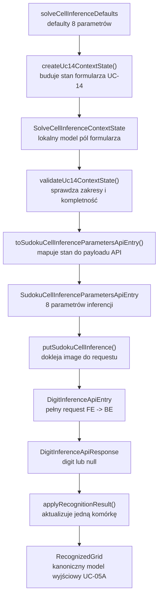
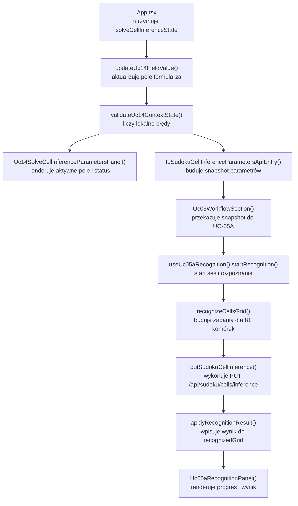

# UC-22-FE - Plan implementacyjny dla `PUT /api/sudoku/cells/inference`

## 1) Przeznaczenie endpointa
- Z perspektywy `FE` endpoint `PUT /api/sudoku/cells/inference` dalej realizuje tylko inferencję pojedynczej komórki Sudoku:
  - `jedna komórka obrazu -> jedna odpowiedź { digit }`.
- Endpoint pozostaje częścią publicznego workflow `UC-05A`, a jego wynik zasila lokalny `recognizedGrid`, który później konsumują `UC-05B`, `UC-05D` i `UC-05E`.
- `UC-22` nie zmienia biznesowej roli endpointa:
  - odpowiedź nadal ma znaczenie `digit: number | null`,
  - `digit = null` nadal oznacza poprawnie rozpoznaną pustą komórkę,
  - `FE` nadal komunikuje się wyłącznie z `BE`.
- Zmiana w tej historyjce dotyczy wyłącznie wejścia:
  - `FE` ma umieć przekazać bogatszy zestaw parametrów sterujących heurystyką wykrywania pustej komórki,
  - panel `UC-14` ma umieć te parametry edytować i walidować,
  - downstream `UC-05A` nie może przez to zmienić swojego modelu wyjściowego.

## 2) Zakres planu i założenia
- Plan dotyczy tylko części `FE`.
- Nie projektujemy tu implementacji `BE` ani `ML`; opisujemy wyłącznie:
  - kontrakt oczekiwany przez frontend,
  - warstwowy sposób podłączenia parametrów,
  - reuse istniejących modułów,
  - guardraile przeciw regresji.
- Nie sugerujemy się aktualnym stanem implementacji `BE` i `ML`, poza wcześniej ustalonymi kontraktami i już istniejącymi klasami/typami po stronie `FE`.
- Dla `UC-22` obowiązuje zachowanie dotychczasowych nazw i struktur już dodanych przez wcześniejsze historyjki.
- Najważniejsza konsekwencja dla `FE`:
  - nie wolno renamować istniejących pól kontekstów `UC-14`,
  - nie wolno tworzyć równoległego klienta HTTP,
  - nie wolno budować drugiego modelu planszy obok `recognizedGrid`.

## 3) Aktualny stan FE i decyzja architektoniczna dla `UC-22`
- W `src/Frontend` istnieje już kompletny tor dla tego endpointu:
  - `UC-14` dostarcza panel parametrów i lokalną walidację,
  - `UC-05A` wykonuje serię wywołań `PUT /api/sudoku/cells/inference`,
  - `UC-05` spina rozpoznanie, solve i live monitoring,
  - `UC-20` potwierdza, że źródło obrazu jest odseparowane od samego rozpoznania komórek.
- W repo istnieją już gotowe miejsca rozszerzenia:
  - `src/Frontend/src/types/api.ts`,
  - `src/Frontend/src/api/sudokuCellsInference.ts`,
  - `src/Frontend/src/features/uc14/domain/solveCellInferenceDefaults.ts`,
  - `src/Frontend/src/features/uc14/domain/solveCellInferenceParameterDefinitions.ts`,
  - `src/Frontend/src/features/uc14/domain/toSudokuCellInferenceParametersApiEntry.ts`.
- Wniosek:
  - `UC-22-FE` nie wymaga nowego feature'a,
  - `UC-22-FE` jest rozszerzeniem istniejącego subkontekstu `solveCellInference`,
  - cała historia powinna zostać dowieziona przez modyfikacje w istniejących warstwach `uc14`, `uc05a`, `api` i `types`.

## 4) Decyzja kontraktowa: ciągłość nazw ponad renaming
- Dokument `UC-22` na poziomie feature overview opisuje nowe parametry segmentowe i wspomina o semantyce progów pustej komórki.
- Jednocześnie wcześniejsze historyjki `FE` już ustaliły konkretne nazwy pól po stronie klienta:
  - `emptyCellDarkPixelRatioThreshold`,
  - `emptyCellInnerMarginRatio`,
  - `centerAreaRatio`,
  - `minComponentAreaRatio`,
  - `lineArtifactMinSpanRatio`,
  - `lineArtifactMaxThicknessRatio`.
- Zgodnie z zasadą kontynuacji wcześniejszych kontraktów:
  - tych nazw nie zmieniamy w `UC-22-FE`,
  - nie robimy migracji nazewniczej w tej historyjce,
  - nie dokładamy warstwy translacji tylko po stronie UI.
- Dlatego `UC-22-FE` powinno:
  - zachować wszystkie dotychczasowe pola requestu inferencji,
  - dodać tylko dwa nowe pola segmentowe:
    - `emptyCellMinSegmentLengthPx`,
    - `emptyCellFilteredSegmentCountThreshold`.
- Jeśli po stronie `BE` albo w dokumentacji międzywarstwowej pojawi się potrzeba ujednolicenia nazw, musi to zostać rozwiązane bez łamania już ustalonego kontraktu `FE`, najlepiej po stronie adaptera backendowego lub w odrębnej historyjce kontraktowej.

## 5) Kontrakt `FE -> BE`

### 5.1 Endpoint
- Metoda i ścieżka: `PUT /api/sudoku/cells/inference`
- Request success path:
  - `DigitInferenceApiEntry`
- Response success:
  - `DigitInferenceApiResponse`
- Response error:
  - `ErrorApiResponse`

### 5.2 Model wejściowy po `UC-22`
- Request pozostaje istniejącym kontraktem `DigitInferenceApiEntry`, rozszerzonym o dwa nowe pola.
- `FE` nadal pakuje obraz jako `image: ImageApiEntry`.
- Docelowy model po stronie `FE`:

```json
{
  "image": {
    "mimeType": "image/png",
    "base64": "iVBORw0KGgoAAA..."
  },
  "emptyCellDarkPixelRatioThreshold": 0.02,
  "emptyCellInnerMarginRatio": 0.12,
  "centerAreaRatio": 0.5,
  "minComponentAreaRatio": 0.055,
  "lineArtifactMinSpanRatio": 0.4,
  "lineArtifactMaxThicknessRatio": 0.08,
  "emptyCellMinSegmentLengthPx": 12,
  "emptyCellFilteredSegmentCountThreshold": 2
}
```

### 5.3 Model wyjściowy sukcesu

```json
{
  "digit": 7
}
```

albo

```json
{
  "digit": null
}
```

### 5.4 Model błędu

```json
{
  "errorType": "some_error_type",
  "message": "Opis błędu."
}
```

### 5.5 Reguły kontraktowe
- Nie zmieniamy nazw:
  - `ImageApiEntry`,
  - `DigitInferenceApiEntry`,
  - `DigitInferenceApiResponse`,
  - `SudokuCellInferenceParametersApiEntry`,
  - `ErrorApiResponse`.
- Nie zmieniamy semantyki:
  - `digit = null`,
  - `200 OK` jako sukces dla pustej komórki,
  - `PUT /api/sudoku/cells/inference` jako endpointu inferencji pojedynczej komórki.
- Nie dokładamy do tego requestu parametrów z `solveLive`, np.:
  - `solverStepDelayMs`.

## 6) Model API wejściowy i wyjściowy w komunikacji z `BE`

### FE -> BE
- `ImageApiEntry`
  - `mimeType: string`
  - `base64: string`
- `DigitInferenceApiEntry`
  - `image: ImageApiEntry`
  - `emptyCellDarkPixelRatioThreshold: number`
  - `emptyCellInnerMarginRatio: number`
  - `centerAreaRatio: number`
  - `minComponentAreaRatio: number`
  - `lineArtifactMinSpanRatio: number`
  - `lineArtifactMaxThicknessRatio: number`
  - `emptyCellMinSegmentLengthPx: number`
  - `emptyCellFilteredSegmentCountThreshold: number`
- `SudokuCellInferenceParametersApiEntry`
  - snapshot parametryzacji wejściowej wysyłanej z `UC-14`
  - powinien zawierać dokładnie osiem pól powyżej, bez `image`

### BE -> FE
- `DigitInferenceApiResponse`
  - `digit: number | null`
- `ErrorApiResponse`
  - `errorType: string`
  - `message: string`

### Lokalny model domenowy FE
- `RecognizedCell`
  - `rowIndex: number`
  - `columnIndex: number`
  - `digit: number | null`
  - `source: "pending" | "recognized" | "error"`
  - `isEditable: boolean`
  - `isLocked: boolean`
- `RecognizedGrid`
  - `RecognizedCell[][]`

## 7) Interpretacja warstw MVVC i architektury warstwowej
- W tym projekcie praktyczne odwzorowanie MVVC jest następujące:
  - `Model`:
    - `domain/*`,
    - `types/api.ts`,
    - definicje parametrów i walidacja formularza.
  - `View`:
    - komponenty `api/*.tsx` renderujące UI.
  - `ViewController`:
    - hooki i orkiestratory w `application/*`,
    - `App.tsx` jako composition root.
  - `Infrastructure`:
    - klienci HTTP w `src/api/*`,
    - helpery transportowe i walidacja odpowiedzi.
- `UC-22-FE` musi zostać zrealizowane warstwowo:
  - `View` pokazuje nowe pola,
  - `Model` definiuje nowe pola i reguły ich walidacji,
  - `ViewController` przekazuje pełny snapshot parametrów do `UC-05A`,
  - `Infrastructure` składa request i wysyła go do `BE`.

## 8) Zachowanie każdej warstwy MVVC

### Model
- Rozszerza model parametrów `solveCellInference` o dwa nowe pola liczbowe.
- Utrzymuje wartości domyślne tych pól na sztywno w kodzie `FE`.
- Waliduje zakresy i kompletność lokalnie jeszcze przed uruchomieniem rozpoznania.
- Nie zna Reacta, `fetch`, statusów HTTP ani `AbortController`.
- Nie podejmuje decyzji o tym, kiedy rozpocząć sesję `UC-05A`.

### View
- Renderuje dwa nowe pola w panelu `UC-14` dla rozpoznania komórek.
- Pokazuje bieżący stan walidacji lokalnej bez wykonywania requestów.
- Nie składa payloadu HTTP.
- Nie uruchamia inferencji pojedynczych komórek.

### ViewController
- Buduje pełny snapshot parametrów z kontekstu `UC-14`.
- Blokuje start rozpoznania, gdy lokalna walidacja parametrów jest niepoprawna.
- Przekazuje parametry do istniejącego flow `UC-05A`.
- Nie zmienia modelu wyjściowego `recognizedGrid`.
- Nie dodaje nowej strategii retry ani nowego trybu sesji.

### Infrastructure
- Rozszerza request JSON o dwa nowe pola.
- Utrzymuje lokalne defaulty requestu zgodne z `UC-14`.
- Waliduje shape odpowiedzi `DigitInferenceApiResponse` tak jak dotąd.
- Mapuje błędy transportowe bez fallbacku do alternatywnego payloadu.

## 9) Co już istnieje i musi zostać reuse'owane
- Istnieje klient endpointa:
  - `src/Frontend/src/api/sudokuCellsInference.ts`
- Istnieją kontrakty transportowe:
  - `src/Frontend/src/types/api.ts`
- Istnieje panel parametrów `solveCellInference`:
  - `src/Frontend/src/features/uc14/api/Uc14SolveCellInferenceParametersPanel.tsx`
- Istnieją defaulty i definicje pól:
  - `src/Frontend/src/features/uc14/domain/solveCellInferenceDefaults.ts`
  - `src/Frontend/src/features/uc14/domain/solveCellInferenceParameterDefinitions.ts`
- Istnieje mapowanie UI -> payload API:
  - `src/Frontend/src/features/uc14/domain/toSudokuCellInferenceParametersApiEntry.ts`
- Istnieje lokalna walidacja kontekstu:
  - `src/Frontend/src/features/uc14/domain/validateUc14ContextState.ts`
- Istnieje workflow rozpoznania:
  - `src/Frontend/src/features/uc05a/application/useUc05aRecognition.ts`
  - `src/Frontend/src/features/uc05a/application/recognizeCellsGrid.ts`
- Istnieje screen-level kompozycja:
  - `src/Frontend/src/features/uc05/api/Uc05WorkflowSection.tsx`
  - `src/Frontend/src/App.tsx`
  - `src/Frontend/src/app/views/ExamplesView.tsx`

Wniosek:
- nie tworzyć `uc22`,
- nie tworzyć `useUc22...`,
- nie dublować panelu `UC-14`,
- nie tworzyć drugiego klienta `putSudokuCellInference()`.

## 10) Pliki per warstwa i odpowiedzialności

### 10.1 View
- `[REUSE / OPCJONALNA DROBNA ZMIANA COPY]` `src/Frontend/src/features/uc14/api/Uc14SolveCellInferenceParametersPanel.tsx`
  - renderuje panel parametrów rozpoznania komórek,
  - po rozszerzeniu definicji ma automatycznie pokazać nowe pola,
  - opcjonalnie doprecyzować copy, że panel obejmuje heurystyki foreground i segmentowe.
- `[REUSE, BRAK ZMIAN LOGICZNYCH]` `src/Frontend/src/features/uc05a/api/Uc05aRecognitionPanel.tsx`
  - pokazuje stan sesji rozpoznania,
  - dalej korzysta tylko z `overrideCount`, `errorCount` i flag walidacji,
  - nie powinien znać nazw pojedynczych parametrów.
- `[REUSE, BRAK ZMIAN]` `src/Frontend/src/features/uc05/api/Uc05WorkflowSection.tsx`
  - spina `UC-05A`, `UC-05B`, `UC-05D`, `UC-05E`,
  - przekazuje snapshot parametrów `solveCellInference` do rozpoznania.
- `[REUSE, BRAK ZMIAN]` `src/Frontend/src/app/views/ExamplesView.tsx`
  - ekran osadzający wspólny workflow `UC-05`.
- `[REUSE, BRAK ZMIAN]` `src/Frontend/src/App.tsx`
  - composition root panelu `UC-14` i workflow examples.

### 10.2 ViewController / Application
- `[REUSE, BRAK ZMIAN ALBO MINIMALNE DOPRECYZOWANIE LOGU]` `src/Frontend/src/App.tsx`
  - utrzymuje stan formularza `solveCellInference`,
  - buduje `solveCellInferenceParameters`,
  - steruje resetem i zmianą wartości.
- `[REUSE, BRAK ZMIAN]` `src/Frontend/src/features/uc05a/application/useUc05aRecognition.ts`
  - przyjmuje `SudokuCellInferenceParametersApiEntry | null`,
  - uruchamia sesję rozpoznania,
  - nie powinien znać szczegółowej semantyki poszczególnych parametrów.
- `[REUSE, BRAK ZMIAN]` `src/Frontend/src/features/uc05a/application/recognizeCellsGrid.ts`
  - wykonuje serię requestów dla 81 komórek,
  - tylko przekazuje parametry dalej do klienta API.
- `[REUSE, BRAK ZMIAN]` `src/Frontend/src/app/hooks/useExamplesModule.ts`
  - dostarcza źródło `cellsGrid` do `UC-05`,
  - nie powinien znać nowych parametrów segmentowych.

### 10.3 Model / Domain
- `[MODYFIKACJA]` `src/Frontend/src/types/api.ts`
  - rozszerzyć `DigitInferenceApiEntry`,
  - rozszerzyć `SudokuCellInferenceParametersApiEntry`,
  - zachować istniejące nazwy pól.
- `[MODYFIKACJA]` `src/Frontend/src/features/uc14/domain/solveCellInferenceDefaults.ts`
  - dodać dwa nowe defaulty liczbowe dla segmentów.
- `[MODYFIKACJA]` `src/Frontend/src/features/uc14/domain/solveCellInferenceParameterDefinitions.ts`
  - dodać dwa nowe klucze,
  - dodać opisy, zakresy, step i guidance.
- `[MODYFIKACJA]` `src/Frontend/src/features/uc14/domain/toSudokuCellInferenceParametersApiEntry.ts`
  - mapować nowe pola do payloadu API,
  - zgłaszać błąd walidacji, gdy pole nie ma poprawnej liczby.
- `[REUSE, BRAK ZMIAN]` `src/Frontend/src/features/uc14/domain/createUc14ContextState.ts`
  - generuje stan formularza na podstawie definicji i defaultów.
- `[REUSE, BRAK ZMIAN]` `src/Frontend/src/features/uc14/domain/updateUc14FieldValue.ts`
  - aktualizuje pojedyncze pole formularza.
- `[REUSE, BRAK ZMIAN]` `src/Frontend/src/features/uc14/domain/validateUc14ContextState.ts`
  - już realizuje lokalną walidację na podstawie definicji pól; nowe parametry skorzystają z tego samego mechanizmu.
- `[REUSE, BRAK ZMIAN]` `src/Frontend/src/features/uc14/domain/uc14ParameterDefinition.ts`
  - wspólny model definicji pola parametru.
- `[REUSE, BRAK ZMIAN]` `src/Frontend/src/features/uc14/domain/uc14ParameterFieldState.ts`
  - wspólny model stanu pojedynczego pola.

### 10.4 Infrastructure
- `[MODYFIKACJA]` `src/Frontend/src/api/sudokuCellsInference.ts`
  - rozszerzyć `DEFAULT_DIGIT_INFERENCE_ENTRY`,
  - składać request z ośmioma parametrami,
  - zachować obecną walidację odpowiedzi i typ błędu.
- `[REUSE, BRAK ZMIAN]` `src/Frontend/src/api/shared/fetchJson.ts`
  - wspólny helper JSON API.
- `[REUSE, BRAK ZMIAN]` `src/Frontend/src/types/api.ts`
  - pozostaje źródłem prawdy dla kontraktów transportowych.

### 10.5 Sąsiednie pliki, których nie należy mieszać z `UC-22`
- `[REUSE, BRAK ZMIAN]` `src/Frontend/src/features/uc14/domain/solveLiveDefaults.ts`
  - dotyczy `POST /api/sudoku/solve`, nie rozpoznania komórek.
- `[REUSE, BRAK ZMIAN]` `src/Frontend/src/features/uc14/domain/solveLiveParameterDefinitions.ts`
  - parametry live solve nie mogą przeciec do `PUT /api/sudoku/cells/inference`.
- `[REUSE, BRAK ZMIAN]` `src/Frontend/src/features/uc14/domain/toSolveSudokuParametersApiEntry.ts`
  - mapuje tylko `solveLive`.
- `[REUSE, BRAK ZMIAN]` `src/Frontend/src/api/sudokuSolve.ts`
  - nie jest częścią tej historyjki.
- `[REUSE, BRAK ZMIAN]` `src/Frontend/src/features/uc05b/application/useUc05bSolve.ts`
  - downstream solve.
- `[REUSE, BRAK ZMIAN]` `src/Frontend/src/features/uc05e/application/useUc05eLiveSolve.ts`
  - downstream monitoring.

## 11) Główne funkcje
- `Uc14SolveCellInferenceParametersPanel()`
- `createUc14ContextState()`
- `updateUc14FieldValue()`
- `validateUc14ContextState()`
- `toSudokuCellInferenceParametersApiEntry()`
- `putSudokuCellInference()`
- `useUc05aRecognition()`
- `startRecognition()`
- `retryRecognition()`
- `cancelRecognition()`
- `recognizeCellsGrid()`
- `Uc05WorkflowSection()`

## 12) Docelowy przepływ w FE
1. Użytkownik ma aktywne źródło `cellsGrid` z `UC-04` albo `UC-20`.
2. Panel `UC-14` dla kontekstu `solveCellInference` pokazuje aktualne wartości wszystkich parametrów inferencji komórki.
3. Użytkownik może zmienić dowolne pola, w tym dwa nowe pola segmentowe.
4. `App.tsx` utrzymuje stan formularza i uruchamia walidację lokalną.
5. Jeśli walidacja jest poprawna, `toSudokuCellInferenceParametersApiEntry()` buduje pełny snapshot parametrów.
6. `Uc05WorkflowSection()` przekazuje ten snapshot do `useUc05aRecognition()`.
7. `useUc05aRecognition()` uruchamia `recognizeCellsGrid()` dla 81 komórek.
8. `recognizeCellsGrid()` dla każdej komórki woła `putSudokuCellInference()`.
9. `putSudokuCellInference()` wysyła `DigitInferenceApiEntry` z obrazem oraz wszystkimi ośmioma parametrami.
10. `BE` zwraca `DigitInferenceApiResponse`.
11. `UC-05A` buduje `recognizedGrid` bez zmiany własnego modelu wyjściowego.
12. `recognizedGrid` pozostaje wejściem do `UC-05B` i `UC-05E`.

## 13) Skrócony przepływ po stronie `BE` potrzebny frontendowi
Ta sekcja nie jest planem backendu, tylko kontraktowym minimum potrzebnym `FE`.

1. `FE` wysyła `DigitInferenceApiEntry` do `PUT /api/sudoku/cells/inference`.
2. `BE` waliduje payload i rozwiązuje parametry efektywne.
3. `BE` wywołuje swój adapter do `ML`.
4. `ML` wykonuje logikę `raw cell -> empty detection -> cleaning -> digit inference`.
5. `BE` zwraca do `FE`:
   - `200 { digit }`, albo
   - `ErrorApiResponse` z odpowiednim statusem HTTP.
6. `FE` nie zna:
   - nazw modeli runtime,
   - ścieżek serwerowych,
   - implementacji Hough,
   - sposobu liczenia segmentów.

## 14) Zachowanie przy wyjątkach, walidacji i fallbackach

### 14.1 Walidacja lokalna przed requestem
- Jeśli którekolwiek pole `UC-14` ma błąd:
  - nie budować `SudokuCellInferenceParametersApiEntry`,
  - nie uruchamiać rozpoznania,
  - pokazać banner walidacyjny w panelu parametrów.
- Jeśli nowe pole segmentowe nie daje się sparsować do liczby:
  - traktować to tak samo jak każdy inny błąd `UC-14`,
  - bez częściowego wysyłania starego payloadu.

### 14.2 Statusy HTTP
- `400 Bad Request`
  - błąd kontraktowy lub niepoprawny obraz wejściowy,
  - sesja `UC-05A` przechodzi w `failed`.
- `409 Conflict`
  - brak aktywnego modelu inferencyjnego albo niespójny stan runtime,
  - sesja przechodzi w `failed`,
  - bez fallbacku do starych parametrów.
- `422 Unprocessable Entity`
  - komórka nie nadaje się do przetworzenia,
  - sesja przechodzi w `failed`,
  - częściowy `recognizedGrid` może zostać diagnostycznie.
- `500`, `502`, `503`, `504`
  - błąd techniczny backendu lub integracji,
  - sesja przechodzi w `failed`,
  - możliwy ręczny retry całej sesji.

### 14.3 Fallbacki dopuszczalne
- Zablokowanie startu rozpoznania przy niepoprawnych parametrach lokalnych.
- Retry całej sesji po poprawie parametrów lub chwilowej awarii backendu.
- Utrzymanie częściowego `recognizedGrid` diagnostycznie po błędzie.

### 14.4 Fallbacki niedopuszczalne
- Wysyłka requestu bez nowych pól, jeśli UI już je udostępnia.
- Ciche usuwanie nowych parametrów z payloadu po błędzie `400`.
- Lokalna heurystyka w przeglądarce jako zastępstwo backendu.
- Bezpośrednie wywołanie `ML` z `FE`.
- Podstawienie `digit = null` jako substytutu błędu technicznego.

## 15) Specyficzna logika i pseudokod

### 15.1 Rozszerzenie modelu parametrów

```text
solveCellInferenceDefaults:
  keep existing 6 values
  add:
    emptyCellMinSegmentLengthPx
    emptyCellFilteredSegmentCountThreshold

solveCellInferenceParameterDefinitions:
  keep existing definitions
  add two numeric definitions with:
    label
    description
    min/max
    integerOnly where needed
    guidance
```

### 15.2 Mapowanie stanu panelu do payloadu API

```text
toSudokuCellInferenceParametersApiEntry(contextState):
  validate whole context
  read all existing 6 fields
  read emptyCellMinSegmentLengthPx
  read emptyCellFilteredSegmentCountThreshold

  if any parsedValue is null:
    throw Uc14LocalParametersValidationError

  return {
    emptyCellDarkPixelRatioThreshold,
    emptyCellInnerMarginRatio,
    centerAreaRatio,
    minComponentAreaRatio,
    lineArtifactMinSpanRatio,
    lineArtifactMaxThicknessRatio,
    emptyCellMinSegmentLengthPx,
    emptyCellFilteredSegmentCountThreshold
  }
```

### 15.3 Budowa requestu dla jednej komórki

```text
putSudokuCellInference(apiBaseUrl, image, parameters, signal):
  request = {
    image,
    ...DEFAULT_DIGIT_INFERENCE_ENTRY,
    ...parameters
  }

  PUT /api/sudoku/cells/inference
  expect 200
  validate DigitInferenceApiResponse
```

### 15.4 Orkiestracja całej sesji bez zmian modelu wyjściowego

```text
startRecognition(cellsGrid):
  assert local parameter state is valid
  build full SudokuCellInferenceParametersApiEntry
  for each of 81 cells:
    call putSudokuCellInference(image, parameters)
    apply digit to recognizedGrid
  output remains RecognizedGrid
```

## 16) Mermaid flowchart - flow modeli



## 17) Mermaid flowchart - logika aplikacji z funkcjami



## 18) Workflow GitHub i runtime
- Dla `UC-22-FE` nie jest potrzebna zmiana `.github/workflows/frontend-cd.yml`.
- `frontend-cd.yml` nadal powinien:
  - zbudować `src/Frontend`,
  - przekazać `VITE_API_BASE_URL`,
  - spakować statyczny build.
- Nowe parametry `UC-22` nie są konfiguracją środowiskową `FE`.
- Lokalnie wartości domyślne powinny być wpisane na sztywno w:
  - `src/Frontend/src/features/uc14/domain/solveCellInferenceDefaults.ts`,
  - `src/Frontend/src/api/sudokuCellsInference.ts` jako bezpieczny fallback transportowy.
- Produkcyjnie frontend nie edytuje `appsettings.production.json`.
- Jeśli `UC-22` wymaga nowych wartości runtime po stronie serwera, to:
  - opis i implementacja należą do planu `BE`,
  - ewentualny workflow backendowy może zmieniać `appsettings.production.json`,
  - `FE` pozostaje konsumentem publicznego `/api`.

## 19) Logging i diagnostyka FE
- Celem jest pomóc w debugowaniu bez spamowania konsoli 81 logami na sukces.

### `console.info`
- start sesji rozpoznania,
- sukces całej sesji,
- anulowanie sesji,
- opcjonalnie liczba aktywnych override'ów parametrów przy starcie sesji.

### `console.warn`
- `409`,
- `422`,
- próba startu z niepoprawnymi parametrami lokalnymi, jeśli taki przypadek zostanie jawnie obsłużony.

### `console.error`
- `500`,
- `502`,
- `503`,
- `504`,
- niepoprawny shape `DigitInferenceApiResponse`,
- nieoczekiwany błąd mapowania parametrów.

### Guardraile logowania
- nie logować `base64`,
- nie logować całego payloadu requestu,
- nie logować sukcesu każdej komórki,
- nie logować pełnego `recognizedGrid`,
- jeśli logować parametry, to tylko:
  - nazwy pól nadpisanych względem defaultów,
  - liczbę override'ów,
  - `sessionId`,
  - `httpStatus`,
  - `errorType`.

## 20) Inne istotne reguły
- Nie zmieniać istniejących nazw kontraktów i symboli dodanych wcześniej.
- Nie przenosić logiki parametrów z `UC-14` do `Uc05aRecognitionPanel.tsx`.
- Nie wykonywać `fetch` w warstwie `View`.
- Nie tworzyć nowego global store dla parametrów `UC-22`.
- Nie mieszać parametrów `solveCellInference` z `solveLive`.
- Nie dodawać nowego endpointa pośredniego.
- Nie przenosić wiedzy o segmentach Hough do UI poza copy i guidance.
- Nie zakładać, że `FE` ma interpretować diagnostykę `center composite`.

## 21) Zależności pomiędzy historyjkami

### Wejściowe
- `UC-05A`
  - dostarcza workflow inferencji pojedynczych komórek i `recognizedGrid`.
- `UC-05B`
  - konsumuje wynik `UC-05A`; dlatego `UC-22` nie może zmienić modelu wyjściowego.
- `UC-05E`
  - korzysta dalej z tego samego `recognizedGrid`.
- `UC-14`
  - dostarcza panel parametrów i lokalny model kontekstów.
- `UC-15`
  - ustalił rozdział między `solveCellInference` i `solveLive`; `UC-22` musi go utrzymać.
- `UC-20`
  - potwierdza, że źródło obrazu nie wpływa na kontrakt samego rozpoznania komórek.

### Sąsiednie
- `UC-21`
  - ważne koncepcyjnie dla spójności cleaningu komórki, ale nie powoduje osobnych zmian `FE` w tej historyjce.
- `UC-17`, `UC-18`, `UC-19`
  - nie są bezpośrednią zależnością runtime `FE`, ale wzmacniają zasadę reuse wspólnych kontraktów i unikania duplikacji.

### Wyjściowe
- `UC-22-FE` rozszerza gotowość `UC-05A` do sterowania lepszą heurystyką empty detection bez zmiany reszty workflow solve.

## 22) Kolejność implementacji kodu dla historyjki
1. Rozszerzyć `src/Frontend/src/types/api.ts` o dwa nowe pola w:
   - `DigitInferenceApiEntry`,
   - `SudokuCellInferenceParametersApiEntry`.
2. Rozszerzyć `src/Frontend/src/features/uc14/domain/solveCellInferenceDefaults.ts` o dwa nowe defaulty.
3. Rozszerzyć `src/Frontend/src/features/uc14/domain/solveCellInferenceParameterDefinitions.ts` o:
   - nowe klucze,
   - etykiety,
   - zakresy,
   - guidance.
4. Rozszerzyć `src/Frontend/src/features/uc14/domain/toSudokuCellInferenceParametersApiEntry.ts` o mapowanie i walidację nowych pól.
5. Rozszerzyć `src/Frontend/src/api/sudokuCellsInference.ts` o:
   - nowe pola w `DEFAULT_DIGIT_INFERENCE_ENTRY`,
   - składanie requestu z pełnym snapshotem.
6. Sprawdzić, czy `Uc14SolveCellInferenceParametersPanel.tsx` dzięki dynamicznym definicjom renderuje nowe pola bez zmian; jeśli nie, wprowadzić minimalną korektę copy lub układu.
7. Zweryfikować, że `App.tsx` i `Uc05WorkflowSection.tsx` nie wymagają zmian logicznych poza naturalnym przepływem nowego snapshotu.
8. Zweryfikować manualnie scenariusze happy path i błędowe.
9. Uruchomić frontendowe sprawdzenie jakości.

## 23) Guardraile implementacyjne
- `UC-22-FE` nie może stworzyć nowego feature folderu tylko po to, żeby ominąć `UC-14`.
- `UC-22-FE` nie może renamować istniejących pól już ustalonych przez wcześniejsze historyjki.
- `UC-22-FE` nie może zmienić typu wyjściowego `DigitInferenceApiResponse`.
- `UC-22-FE` nie może zmienić modelu `RecognizedGrid`.
- `UC-22-FE` nie może dokładać logiki inferencji do komponentów `View`.
- `UC-22-FE` nie może wprowadzać envów `VITE_*` dla wartości progów.
- `UC-22-FE` nie może dublować defaultów w wielu miejscach w niespójny sposób:
  - źródłem prawdy dla formularza są `solveCellInferenceDefaults`,
  - fallback transportowy w `api/sudokuCellsInference.ts` musi być utrzymany spójnie.
- `UC-22-FE` nie może przenieść walidacji do workflow GitHub.
- `UC-22-FE` nie może próbować „uzdrawiać” backendu przez alternatywne payloady.

## 24) Plan weryfikacji minimum
- `npm run build`
- `npm run check`
- scenariusz happy path:
  - panel `UC-14` pokazuje dwa nowe pola,
  - rozpoznanie kończy się sukcesem,
  - `recognizedGrid` nadal powstaje bez zmiany kontraktu.
- scenariusz walidacji lokalnej:
  - niepoprawna liczba w nowym polu blokuje start rozpoznania.
- scenariusz `digit = null`:
  - pusta komórka pozostaje poprawnym sukcesem.
- scenariusz `409`:
  - sesja kończy się błędem bez fallbacku do starego payloadu.
- scenariusz `422`:
  - sesja kończy się błędem, częściowy `recognizedGrid` może zostać diagnostycznie.
- scenariusz regresyjny `UC-15`:
  - request do `PUT /api/sudoku/cells/inference` nadal nie zawiera `solverStepDelayMs`.
- scenariusz regresyjny `UC-20`:
  - lokalne źródło obrazu nadal działa z tym samym workflow `UC-05A`.

## 25) Podsumowanie decyzji architektonicznych
- `UC-22-FE` jest rozszerzeniem istniejącego toru `UC-14 -> UC-05A -> PUT /api/sudoku/cells/inference`.
- Nie tworzymy nowego feature'a, nowego klienta HTTP ani nowego modelu planszy.
- Zachowujemy wszystkie wcześniej ustalone nazwy kontraktów `FE` i dokładamy wyłącznie:
  - `emptyCellMinSegmentLengthPx`,
  - `emptyCellFilteredSegmentCountThreshold`.
- Panel `UC-14` pozostaje jedynym miejscem edycji parametrów tej heurystyki.
- `UC-05A` pozostaje właścicielem sesji rozpoznania i `recognizedGrid`.
- Workflow GitHub `FE` pozostaje bez zmian; lokalne defaulty są wpisane na sztywno w kodzie, a ewentualne zmiany produkcyjnego runtime należą do warstwy `BE`.
