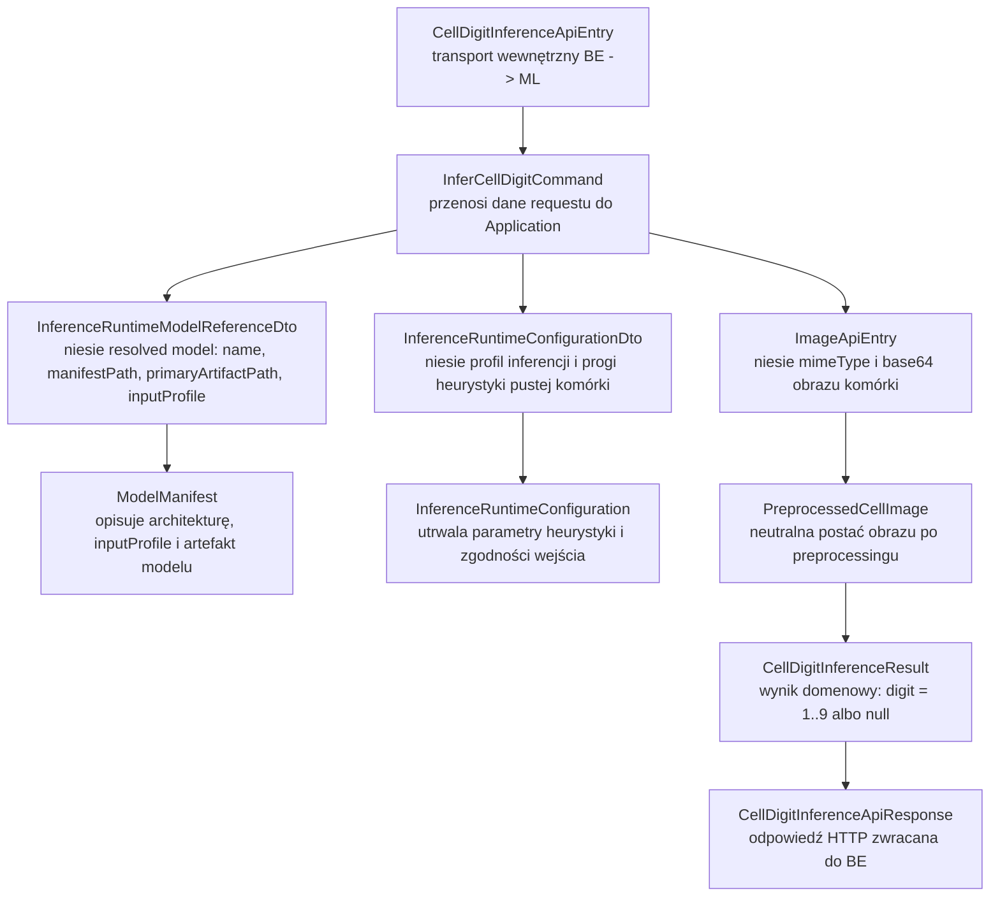
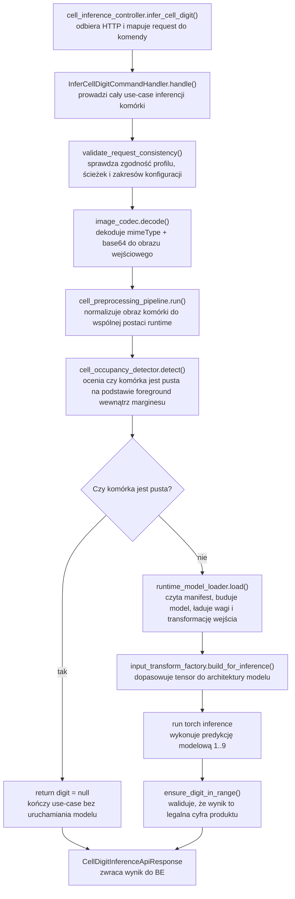

# UC-05A ML — Plan implementacyjny (`PUT /ml/cells/inference`)

## 1. Przeznaczenie endpointa
- Endpoint wewnętrzny `BE -> ML` realizuje inferencję pojedynczej komórki sudoku w ścieżce runtime `UC-05`.
- Wejściem jest obraz pojedynczej komórki oraz resolved konfiguracja inferencji i resolved aktywny model przekazane przez `Backend`.
- Wyjściem jest minimalna odpowiedź `{ "digit": 1..9 | null }`.
- `digit = null` oznacza pustą komórkę albo brak wiarygodnej cyfry po wykonaniu heurystyki pustej komórki i inferencji.
- Endpoint nie buduje `recognizedGrid`, nie uruchamia solvera, nie renderuje overlay i nie zapisuje rekordów systemowych. To pozostaje poza `ML` i należy do `BE` albo kolejnych historyjek.
- Endpoint ma być zgodny z decyzjami z `UC-05A`, notką scalającą `UC-05C`, kontraktami aktywnego modelu z `UC-10`, manifestami z `INF-08` oraz istniejącymi kontraktami treningowymi z `UC-06`.

## 2. Źródła i założenia planu
- Plan bazuje na:
  - `@.ai/prd.md`,
  - `@.ai/feature/uc-05-overview.md`,
  - `@.ai/feature/uc-05a-overview.md`,
  - `@.ai/feature/uc-05c-overview.md`,
  - `@.cursor/rules/architecture_ml.mdc`,
  - `@.ai/DokumentacjaDeployuRuntimeSerwera.md`,
  - wcześniejszych historyjkach `UC-04`, `UC-06`, `UC-10`, `UC-12`.
- Plan opisuje wyłącznie część `ML`.
- Nie sugerujemy się aktualnym stanem implementacji `FE` i `BE` poza już ustalonymi kontraktami i nazwami klas/pól, których nie wolno łamać.
- `ML` pozostaje usługą wewnętrzną, możliwie stateless, bez własnego systemowego rejestru modeli i workflow.
- `BE` pozostaje `source of truth` dla:
  - wyboru aktywnego modelu,
  - resolved konfiguracji inferencji,
  - workflow wyższego poziomu,
  - publicznych błędów i stanów widocznych dla `FE`.

## 3. Relacja do innych historyjek

### 3.1 Wejściowe zależności
- `UC-04`
  - dostarcza wcześniejszy etap runtime: `PUT /ml/preprocess/board` i `PUT /ml/preprocess/cells`,
  - daje gotowe obrazy komórek 9x9, które `FE` wysyła dalej pojedynczo przez `BE`.
- `UC-05C`
  - historyjka scalona potwierdza, że `recognizedGrid` jest składany poza `ML`,
  - nie tworzymy osobnego endpointu tylko do prezentacji gridu.
- `UC-06`
  - ustala kontrakty manifestu, ładowania modeli, ścieżek artefaktów, eventów i nazw pól takich jak `manifestPath`, `primaryArtifactPath`,
  - nie wolno zrywać tych nazw ani tworzyć alternatywnego formatu manifestu tylko dla inferencji.
- `UC-10`
  - ustala aktywny model inferencyjny przez `models/active/inference.json`,
  - `ML` nie wybiera modelu samodzielnie "po nazwie domyślnej".
- `UC-12`
  - wprowadza współdzielony pipeline preprocessingu komórek i profil `default-28x28-v1`,
  - nowa ścieżka inferencji ma reuse'ować ten sam kierunek preprocessingowy, nie tworzyć niezależnej recepty bez uzasadnienia.

### 3.2 Zależności wyjściowe
- `UC-05B`
  - przyjmie `recognizedGrid` zbudowany na bazie wyników `digit` z tego endpointu.
- `UC-05D`
  - później zużyje rozwiązanie sudoku i obraz, ale nie zmienia kontraktu pojedynczej komórki.
- `UC-05E`
  - reuse'uje ten sam `recognizedGrid` już złożony poza `ML`.
- przyszły wyższy endpoint `POST /ml/solve-from-image`
  - powinien reuse'ować te same komponenty inferencji komórki, zamiast duplikować logikę modelu i preprocessingu.

## 4. Docelowy kontrakt `BE <-> ML`

### 4.1 Endpoint
- `PUT /ml/cells/inference`
- Endpoint jest wewnętrzny.
- `FE` nie wywołuje go bezpośrednio.

### 4.2 Request `CellDigitInferenceApiEntry`
```json
{
  "image": {
    "mimeType": "image/png",
    "base64": "iVBORw0KGgoAAA..."
  },
  "activeModel": {
    "name": "cnn-mnist-baseline",
    "manifestPath": "/opt/sudoku/shared/models/registry/cnn-mnist-baseline/model.json",
    "primaryArtifactPath": "/opt/sudoku/shared/models/registry/cnn-mnist-baseline/artifacts/model.pt",
    "inputProfile": "default-28x28-v1"
  },
  "resolvedConfiguration": {
    "inferenceProfileName": "default-28x28-v1",
    "emptyCellCenterForegroundPixelRatioThreshold": 0.02
  }
}
```

### 4.3 Response sukcesu `CellDigitInferenceApiResponse`
```json
{
  "digit": 7
}
```

albo

```json
{
  "digit": null
}
```

### 4.4 Response błędu `ErrorApiResponse`
```json
{
  "errorType": "cell_image_not_processable",
  "message": "Nie udało się przygotować obrazu komórki do inferencji."
}
```

### 4.5 Reguły kontraktu
- `digit` może przyjmować wyłącznie `null` albo `1..9`.
- `0` nie jest legalnym wynikiem tego endpointu, nawet jeśli istnieją wcześniejsze eksperymenty lub datasety z klasą `0`.
- Klucze JSON pozostają w `camelCase`.
- Modele HTTP muszą mieć nazwy zgodne z regułą `ApiEntry` / `ApiResponse`.
- Nie zmieniamy istniejącego eksperymentalnego endpointu `GET /ml/test/inteference/{name}`. Nowy endpoint ma dostać własne modele i własną ścieżkę.

## 5. Zachowanie warstwowe

### 5.1 API
- Odbiera request `CellDigitInferenceApiEntry`.
- Mapuje request do komendy aplikacyjnej.
- Wywołuje handler use-case.
- Mapuje wynik na `CellDigitInferenceApiResponse`.
- Mapuje wyjątki use-case na `ErrorApiResponse`.
- Nie wykonuje:
  - preprocessingu obrazu,
  - odczytu modelu z dysku,
  - inferencji `torch`,
  - heurystyki pustej komórki,
  - logiki wyboru fallbacku modelu.

### 5.2 Application
- Waliduje spójność requestu:
  - obecność `image`, `activeModel`, `resolvedConfiguration`,
  - `mimeType`,
  - `base64`,
  - legalność `manifestPath` i `primaryArtifactPath`,
  - zgodność `activeModel.inputProfile` z `resolvedConfiguration.inferenceProfileName`,
  - wspierany profil inferencji.
- Orkiestruje use-case:
  1. dekodowanie obrazu,
  2. odczyt manifestu modelu,
  3. walidacja modelu i konfiguracji,
  4. preprocessing komórki,
  5. heurystyka pustej komórki oparta o foreground w centralnym obszarze,
  6. inferencja modelowa, jeśli komórka nie jest pusta,
  7. zbudowanie wyniku `digit = null | 1..9`.
- Application podejmuje decyzję:
  - czy w ogóle uruchamiać model,
  - kiedy zwrócić `null`,
  - kiedy traktować sytuację jako błąd.
- Application nie zna FastAPI, Pydantic modeli API i szczegółów OpenCV/PyTorch implementowanych przez adaptery.

### 5.3 Domain / Models
- Utrzymuje neutralne modele:
  - wynik inferencji komórki,
  - referencję aktywnego modelu potrzebną runtime inferencji,
  - konfigurację heurystyki pustej komórki,
  - ewentualną klasyfikację stanu komórki (`empty`, `digit`).
- Pilnuje inwariantów:
  - wynik to `null` albo `1..9`,
  - profil wejściowy musi być spójny z architekturą i preprocessingiem,
  - model użyty do inferencji musi być technicznie poprawny.
- Modele domenowe nie zależą od HTTP ani od formatu `.env`.

### 5.4 Infrastructure
- Implementuje:
  - dekodowanie/enkodowanie obrazów,
  - preprocessing komórki,
  - odczyt manifestu,
  - budowę modelu,
  - ładowanie wag,
  - transformację wejścia do tensora,
  - inferencję `torch`,
  - odczyt aktywnego modelu z filesystemu dla narzędzi developerskich, ale nie dla nowego endpointu produkcyjnego.
- Infrastructure ma być generyczne i reusable:
  - bez zaszywania logiki konkretnego endpointu,
  - bez mieszania decyzji biznesowych z I/O,
  - bez duplikowania istniejących adapterów.

## 6. Istniejące komponenty do reuse

### 6.1 API i konfiguracja
- `src/MachineLearning/api/main.py`
  - rejestruje routery; należy dopiąć nowy router inferencji komórek.
- `src/MachineLearning/api/dependencies.py`
  - istniejący composition root; należy rozszerzyć go o nowy handler.
- `src/MachineLearning/api/models/image_api_entry.py`
  - reuse modelu obrazu w JSON.
- `src/MachineLearning/api/models/error_api_response.py`
  - reuse top-level błędu `{ errorType, message }`.
- `src/MachineLearning/api/config/environment.py`
  - jedyne źródło konfiguracji `.env` / `.env.{ML_ENVIRONMENT}`.
- `src/MachineLearning/api/config/runtime_settings.py`
  - istniejące typed settings; trzeba je rozszerzyć, a nie wprowadzać drugi system konfiguracji.

### 6.2 Application
- `src/MachineLearning/application/features/inference/commands/test_digit_inference/test_digit_inference_command_handler.py`
  - nie wolno go traktować jako gotowego produktu,
  - jest jednak dobrym źródłem reuse dla:
    - odczytu manifestu,
    - budowy modelu,
    - ładowania wag,
    - transformacji tensora,
    - wyboru urządzenia.
- `src/MachineLearning/application/features/datasets/commands/prepare_dataset_artifact/prepare_dataset_artifact_command_handler.py`
  - potwierdza istnienie współdzielonego `CellPreprocessingPipeline`,
  - należy zachować zgodność preprocessingową z datasetami z `UC-12`.

### 6.3 Infrastructure
- `src/MachineLearning/infrastructure/vision/cell_preprocessing_pipeline.py`
  - istniejący preprocessing komórki; należy go rozszerzyć lub obudować, nie tworzyć drugiej równoległej ścieżki.
- `src/MachineLearning/infrastructure/training/model/model_manifest_reader.py`
  - reuse odczytu manifestu.
- `src/MachineLearning/infrastructure/training/model/model_factory.py`
  - reuse budowy modelu.
- `src/MachineLearning/infrastructure/training/model/model_artifact_loader.py`
  - reuse ładowania wag.
- `src/MachineLearning/infrastructure/training/data/input_transform_factory.py`
  - reuse budowy transformacji wejścia, ale wymaga uogólnienia pod inferencję runtime.
- `src/MachineLearning/infrastructure/inference/active_model_resolver.py`
  - nie używać go bezpośrednio w nowym endpointcie produkcyjnym, bo `BE` przekazuje już resolved model,
  - zachować dla ścieżek developerskich i jako źródło zasad walidacji kontraktu `inference.json`.

## 7. Komponenty, których nie należy duplikować
- Nie tworzyć nowego niezależnego pipeline'u preprocessingu komórki, jeśli można rozszerzyć `CellPreprocessingPipeline`.
- Nie tworzyć drugiego readera manifestu inferencyjnego, jeśli można reuse'ować `ModelManifestReader`.
- Nie tworzyć osobnego factory modelu tylko dla inferencji, jeśli istniejący `ModelFactory` potrafi obsłużyć architektury z rejestru.
- Nie tworzyć własnego lokalnego resolvera aktywnego modelu w nowym endpointcie, bo aktywny model przychodzi z `BE`.
- Nie tworzyć osobnego formatu manifestu tylko dla inferencji; manifest musi pozostać zgodny z `UC-06` i `UC-10`.

## 8. Plan plików per warstwa i odpowiedzialności

## 8.1 API (`src/MachineLearning/api`)
- `[NOWY]` `api/controllers/cell_inference_controller.py`
  - router `PUT /ml/cells/inference`,
  - cienkie mapowanie request -> command -> response,
  - mapowanie błędów na `ErrorApiResponse`.
- `[NOWY]` `api/models/cell_digit_inference_api_entry.py`
  - top-level request wewnętrzny od `BE`,
  - zawiera `image`, `activeModel`, `resolvedConfiguration`.
- `[NOWY]` `api/models/cell_digit_inference_image_api_entry.py`
  - jeśli potrzebne wydzielenie zagnieżdżonej sekcji `image`; alternatywnie reuse `ImageApiEntry`.
- `[NOWY]` `api/models/active_model_reference_api_entry.py`
  - model `name`, `manifestPath`, `primaryArtifactPath`, `inputProfile`.
- `[NOWY]` `api/models/cell_inference_configuration_api_entry.py`
  - model `inferenceProfileName`, `emptyCellCenterForegroundPixelRatioThreshold`.
- `[NOWY]` `api/models/cell_digit_inference_api_response.py`
  - wynik `{ digit }`.
- `[REUSE]` `api/models/image_api_entry.py`
  - jeśli zostanie użyty bezpośrednio jako pole `image`.
- `[REUSE]` `api/models/error_api_response.py`
  - spójny model błędu.
- `[UPDATE]` `api/dependencies.py`
  - dodać fabrykę `get_cell_digit_inference_command_handler()`,
  - wstrzykiwać istniejące reusable adaptery.
- `[UPDATE]` `api/main.py`
  - zarejestrować nowy router.
- `[UPDATE]` `api/config/runtime_settings.py`
  - rozszerzyć o typed settings dla inferencji komórki.
- `[UPDATE]` `api/config/environment.py`
  - dodać odczyt nowych zmiennych `ML_INFERENCE_*`.
- `[UPDATE]` `api/.env`
  - baza konfiguracyjna.
- `[UPDATE]` `api/.env.local`
  - lokalne, jawne wartości "na sztywno".
- `[UPDATE]` `api/.env.production`
  - overlay produkcyjny przygotowywany przez workflow.

## 8.2 Application (`src/MachineLearning/application/features/inference`)
- `[NOWY]` `application/features/inference/commands/infer_cell_digit/infer_cell_digit_command.py`
  - komenda use-case.
- `[NOWY]` `application/features/inference/commands/infer_cell_digit/infer_cell_digit_command_handler.py`
  - główna orkiestracja inferencji.
- `[NOWY]` `application/features/inference/commands/infer_cell_digit/infer_cell_digit_command_result_dto.py`
  - DTO wyniku.
- `[NOWY]` `application/features/inference/dto/inference_runtime_model_reference_dto.py`
  - resolved model runtime przekazany przez `BE`.
- `[NOWY]` `application/features/inference/dto/inference_runtime_configuration_dto.py`
  - resolved konfiguracja heurystyki i profilu inferencji.
- `[NOWY]` `application/features/inference/dto/cell_digit_inference_result_dto.py`
  - wynik DTO `digit`.
- `[NOWY]` `application/features/inference/errors/cell_digit_inference_errors.py`
  - jawne wyjątki use-case i mapowanie do statusów HTTP.
- `[REUSE / UPDATE]` `application/features/inference/commands/test_digit_inference/test_digit_inference_command_handler.py`
  - nie zmieniać kontraktu endpointu testowego,
  - ewentualnie wydzielić wspólne elementy ładowania modelu do komponentu reusable.

## 8.3 Domain / Models (`src/MachineLearning/models`)
- `[NOWY]` `models/cell_digit_inference_result.py`
  - wynik domenowy `digit: int | None`.
- `[NOWY]` `models/inference_runtime_configuration.py`
  - model progów heurystyki pustej komórki i profilu inferencji.
- `[NOWY]` `models/cell_occupancy.py`
  - jeśli potrzebne jawne rozróżnienie stanu `empty` vs `digit_present` podczas application flow.
- `[REUSE]` `models/model_manifest.py`
  - nie zmieniać nazw obecnych pól.
- `[REUSE]` inne istniejące modele domenowe treningu i manifestu
  - pozostają wspólnym fundamentem dla inferencji i treningu.

## 8.4 Infrastructure (`src/MachineLearning/infrastructure`)
- `[UPDATE]` `infrastructure/vision/cell_preprocessing_pipeline.py`
  - rozszerzyć o heurystykę pustej komórki albo wydzielić tę heurystykę do osobnego adaptera, ale bez duplikacji preprocessing core.
- `[NOWY albo UPDATE]` `infrastructure/inference/cell_occupancy_detector.py`
  - rekomendowane tylko jeśli heurystyka pustej komórki zrobi się zbyt złożona na trzymanie w `CellPreprocessingPipeline`,
  - adapter generyczny, oparty o zbinaryzowany obraz z odwróconymi kolorami i centralny obszar zbudowany z 4 wewnętrznych ćwiartek skierowanych do środka.
- `[NOWY]` `infrastructure/inference/runtime_model_loader.py`
  - opcjonalny komponent współdzielący kroki:
    - `manifest_reader.read()`,
    - `model_factory.build()`,
    - `artifact_loader.load()`,
    - `input_transform_factory.build()`,
    - `resolve_device()`.
  - warto go dodać, jeśli chcemy uniknąć duplikacji między docelowym `infer_cell_digit` a eksperymentalnym `test_digit_inference`.
- `[REUSE]` `infrastructure/training/model/model_manifest_reader.py`
  - odczyt manifestu.
- `[REUSE]` `infrastructure/training/model/model_factory.py`
  - budowa modelu.
- `[REUSE]` `infrastructure/training/model/model_artifact_loader.py`
  - ładowanie wag.
- `[UPDATE]` `infrastructure/training/data/input_transform_factory.py`
  - odwiązać od nazwy `augmentation_profile_name`,
  - wprowadzić wariant zgodny z inferencją runtime i `inferenceProfileName`,
  - nie łamać kontraktów treningowych z `UC-06`.
- `[REUSE]` `infrastructure/inference/active_model_resolver.py`
  - zostawić jako narzędzie dla starej testowej ścieżki.

## 8.5 Testy (`src/MachineLearning/tests`)
- `[NOWY]` `tests/integration/test_cell_inference_controller.py`
  - testy kontraktu `PUT /ml/cells/inference`.
- `[NOWY]` `tests/unit/inference/test_infer_cell_digit_command_handler.py`
  - logika use-case.
- `[NOWY]` `tests/unit/inference/test_runtime_model_loader.py`
  - jeśli zostanie wydzielony reusable loader runtime modelu.
- `[UPDATE]` `tests/integration/test_test_inference_controller.py`
  - tylko jeśli refaktoryzacja współdzielonych komponentów wymaga dopięcia kompatybilności.
- `[REUSE]` testy preprocessingu i datasetów
  - jako punkt odniesienia dla zgodności pipeline'u komórki.

## 9. Model API wejściowy i wyjściowy w komunikacji z BE

### 9.1 Request
- `CellDigitInferenceApiEntry`
  - `image: ImageApiEntry`
    - `mimeType: string`
    - `base64: string`
  - `activeModel: ActiveModelReferenceApiEntry`
    - `name: string`
    - `manifestPath: string`
    - `primaryArtifactPath: string`
    - `inputProfile: string`
  - `resolvedConfiguration: CellInferenceConfigurationApiEntry`
    - `inferenceProfileName: string`
    - `emptyCellCenterForegroundPixelRatioThreshold: number`

### 9.2 Response sukcesu
- `CellDigitInferenceApiResponse`
  - `digit: int | null`

### 9.3 Response błędu
- `ErrorApiResponse`
  - `errorType: string`
  - `message: string`

## 10. Główne funkcje i komponenty
- `infer_cell_digit()`
  - endpoint FastAPI dla `PUT /ml/cells/inference`.
- `InferCellDigitCommandHandler.handle()`
  - pełna orkiestracja use-case.
- `InferCellDigitCommandHandler._validate_request_consistency()`
  - walidacja profilu, ścieżek i zakresów konfiguracyjnych.
- `InferCellDigitCommandHandler._decode_image()`
  - dekodowanie `base64` do obrazu.
- `CellPreprocessingPipeline.run()`
  - wspólne przygotowanie obrazu komórki.
- `CellOccupancyDetector.detect()` albo równoważna funkcja w pipeline
  - decyzja, czy komórka zawiera cyfrę.
- `RuntimeModelLoader.load()`
  - odczyt manifestu, budowa modelu, ładowanie wag, przygotowanie transformacji.
- `InputTransformFactory.build_for_inference()` albo wariant równoważny
  - transformacja preprocessowanego obrazu do tensora.
- `ModelFactory.build()`
  - budowa `torch.nn.Module`.
- `ModelArtifactLoader.load()`
  - załadowanie wag.

## 11. Przepływ wewnątrz ML
1. `API` odbiera `PUT /ml/cells/inference`.
2. Request jest mapowany na `InferCellDigitCommand`.
3. `Application` waliduje spójność:
   - `image`,
   - `activeModel`,
   - `resolvedConfiguration`,
   - zgodność `inputProfile`.
4. `Application` dekoduje obraz przez reusable codec.
5. `Application` uruchamia preprocessing komórki.
6. `Application` lub adapter `Infrastructure` wykonuje heurystykę pustej komórki.
7. Jeśli komórka jest pusta, use-case zwraca `digit = null` bez uruchamiania modelu.
8. Jeśli komórka zawiera cyfrę:
   - ładowany jest manifest,
   - budowany jest model,
   - ładowane są wagi,
   - dobierana jest transformacja wejściowa,
   - wykonywana jest inferencja.
9. `Application` waliduje wynik modelu:
   - tylko `1..9`.
10. `API` zwraca `CellDigitInferenceApiResponse`.

## 12. Obsługa wyjątków i fallbacków

### 12.1 Kluczowe błędy
- `invalid_request`
  - brak wymaganych pól, niepoprawny format requestu.
- `unsupported_input_profile`
  - `activeModel.inputProfile` albo `resolvedConfiguration.inferenceProfileName` nie jest wspierane.
- `input_profile_mismatch`
  - profil modelu i profil resolved konfiguracji nie zgadzają się.
- `model_manifest_not_found`
  - brak `manifestPath`.
- `model_manifest_invalid`
  - manifest nie zawiera wymaganych pól.
- `model_artifact_not_found`
  - brak pliku wag.
- `inference_model_not_allowed`
  - model nie nadaje się do inferencji.
- `cell_image_not_processable`
  - nie udało się zdekodować albo przetworzyć obrazu komórki.
- `unsupported_inference_device`
  - wymuszono nieobsługiwane urządzenie.
- `inference_device_unavailable`
  - wymuszono `cuda`, ale nie jest dostępne.
- `inference_runtime_failed`
  - błąd wykonania modelu.
- `invalid_inference_result`
  - model zwrócił wynik, którego nie da się zmapować na `1..9`.

### 12.2 Mapowanie statusów HTTP
- `200 OK`
  - sukces, `digit = null` albo `1..9`.
- `422 Unprocessable Content`
  - błąd walidacji biznesowej lub technicznej wejścia/modelu, który nie jest awarią serwera.
- `500 Internal Server Error`
  - nieobsłużony błąd techniczny.

### 12.3 Fallbacki
- Dozwolony fallback:
  - `device = auto` może przejść z `cuda` na `cpu`, jeśli taka semantyka jest już przyjęta w runtime inferencji.
- Niedozwolone fallbacki:
  - brak cichego przełączania na "jakiś inny model",
  - brak cichego zwracania `digit = null` przy błędzie systemowym,
  - brak zgadywania brakującego `inputProfile`,
  - brak ładowania modelu z `models/active/inference.json` w nowym endpointcie, jeśli `BE` przekazał resolved aktywny model,
  - brak użycia eksperymentalnego `GET /ml/test/inteference/{name}` jako produktu.

## 13. Specyficzna logika i pseudokod
```python
def handle_infer_cell_digit(command):
    validate_request_shape(command)
    validate_input_profile_match(
        command.active_model.input_profile,
        command.resolved_configuration.inference_profile_name,
    )

    image = image_codec.decode(
        mime_type=command.image.mime_type,
        base64_payload=command.image.base64,
    )

    preprocessed_image = cell_preprocessing_pipeline.run(image)

    occupancy = cell_occupancy_detector.detect(
        image=preprocessed_image,
        center_foreground_pixel_ratio_threshold=command.resolved_configuration.empty_cell_center_foreground_pixel_ratio_threshold,
    )

    if occupancy.is_empty:
        return CellDigitInferenceResultDto(digit=None)

    runtime_model = runtime_model_loader.load(
        manifest_path=command.active_model.manifest_path,
        artifact_path=command.active_model.primary_artifact_path,
        input_profile=command.active_model.input_profile,
    )

    input_tensor = runtime_model.input_transform(preprocessed_image).unsqueeze(0).to(
        runtime_model.device
    )

    runtime_model.model.eval()
    with torch.inference_mode():
        output = runtime_model.model(input_tensor)
        predicted_digit = map_output_to_digit(output)

    ensure_digit_in_range(predicted_digit)

    return CellDigitInferenceResultDto(digit=predicted_digit)
```

### 13.1 Reguła pustej komórki
```text
1. Zbinaryzuj lub użyj już przygotowanego obrazu foreground.
2. Odwróć kolory tak, aby cyfra i pozostałości siatki były foregroundem.
3. Podziel komórkę na 4 ćwiartki.
4. Dla każdej ćwiartki wybierz jej wewnętrzną ćwiartkę skierowaną do środka komórki.
5. Z 4 tak wybranych fragmentów zbuduj mały obszar centralny.
6. Policz udział foregroundu tylko w tym obszarze.
7. Jeśli udział <= threshold:
   - uznaj komórkę za pustą,
   - zwróć digit = null,
   - nie uruchamiaj modelu.
8. Jeśli udział > threshold:
   - uruchom inferencję modelową,
   - zwróć 1..9.
```

## 14. Mermaid: flow modeli


## 15. Mermaid: flow logiki aplikacji


## 16. Konfiguracja runtime i deploy

### 16.1 Zasady ogólne
- Jedynym źródłem konfiguracji runtime `ML` pozostaje:
  - `src/MachineLearning/api/config/environment.py`,
  - `src/MachineLearning/api/.env`,
  - `src/MachineLearning/api/.env.{ML_ENVIRONMENT}`.
- Nie wprowadzamy drugiego systemu konfiguracji.
- Lokalnie wartości wpisujemy jawnie w `.env.local`.
- Produkcyjnie workflow dostarcza `api/.env` i `api/.env.production`, zgodnie z `architecture_ml` i dokumentem deployu.

### 16.2 Nowe ustawienia
- `ML_INFERENCE_DEVICE`
  - `auto | cpu | cuda`
- `ML_INFERENCE_SUPPORTED_PROFILES`
  - na start może zawierać `default-28x28-v1`
- `ML_INFERENCE_EMPTY_CELL_CENTER_FOREGROUND_PIXEL_RATIO_THRESHOLD`
- opcjonalnie:
  - `ML_INFERENCE_ENABLE_MODEL_CACHE`
  - tylko jeśli zostanie świadomie dodany cache modelu w pamięci procesu

### 16.3 Lokalne środowisko
- `src/MachineLearning/api/.env.local`
  - trzyma wartości lokalne na sztywno,
  - zawiera jawne ścieżki lokalne do `models/active`, `models/registry`, `examples`, `tmp`.
- Lokalny development nie zależy od GitHub Actions.

### 16.4 Produkcyjne środowisko i workflow
- `.github/workflows/ml-cd.yml` musi być opisany w planie i uwzględniony przy wdrożeniu tej historyjki.
- Workflow:
  - pakuje całe `src/MachineLearning`,
  - dołącza `requirements.txt`,
  - ustawia `ML_ENVIRONMENT=production` w release,
  - dostarcza `api/.env.production`,
  - nie tworzy alternatywnego systemu konfiguracji.
- Workflow nie może nadpisywać runtime state:
  - `models/registry`,
  - `models/active`,
  - `trainings`,
  - `data`,
  - `examples`.
- W planie należy wprost trzymać się zasady:
  - w `local` wartości konfiguracyjne przypisujemy jawnie,
  - w `production` workflow zmienia overlay środowiskowy `api/.env.production`.

## 17. Logging
- Logi mają pomagać diagnozować problemy bez spamowania i bez zapychania dysku.

### 17.1 Co logować
- `INFO`
  - przyjęcie requestu inferencji komórki,
  - użyty `modelName`,
  - użyty `inputProfile`,
  - wynik typu `digit` vs `null`.
- `WARNING`
  - niezgodność profilu,
  - niepoprawny manifest,
  - brak artefaktu modelu,
  - obraz nieprzetwarzalny,
  - wynik modelu spoza zakresu produktu.
- `ERROR`
  - błąd ładowania modelu,
  - błąd `torch`,
  - nieobsłużony wyjątek endpointu.

### 17.2 Czego nie logować
- `base64`,
- pełnego obrazu,
- pełnych payloadów requestu,
- wrażliwych ścieżek w treści odpowiedzi HTTP,
- surowych tensorów i pełnych dumpów modelu.

## 18. Kolejność implementacji
1. Ustalić finalny kontrakt `CellDigitInferenceApiEntry` i `CellDigitInferenceApiResponse` bez łamania wcześniejszych nazw z `UC-06` i `UC-10`.
2. Dodać modele API i router `cell_inference_controller.py`.
3. Dodać typed settings inferencji komórki do `runtime_settings.py` i `environment.py`.
4. Uzupełnić `.env`, `.env.local`, `.env.production`.
5. Dodać komendę, DTO i wyjątki use-case w `application/features/inference/commands/infer_cell_digit`.
6. Wydzielić reusable ładowanie runtime modelu, jeśli analiza kodu pokaże duplikację z `test_digit_inference`.
7. Rozszerzyć `CellPreprocessingPipeline` albo dodać generyczny `CellOccupancyDetector`.
8. Rozszerzyć `InputTransformFactory` o ścieżkę inferencyjną zgodną z `inputProfile`, bez psucia `UC-06`.
9. Zaimplementować handler i mapowanie błędów.
10. Dodać testy jednostkowe handlera.
11. Dodać test integracyjny kontrolera.
12. Zweryfikować zgodność z `ml-cd.yml`, `.env.production` i layoutem runtime z dokumentu deployu.

## 19. Guardraile implementacyjne
- Nie tworzyć drugiego systemu konfiguracji poza `environment.py` i `.env*`.
- Nie hardcodować ścieżek `/opt/sudoku/...` w kodzie.
- Nie mieszać modeli API z DTO use-case'ów i modelami domenowymi.
- Nie łamać istniejących nazw pól:
  - `mimeType`,
  - `base64`,
  - `manifestPath`,
  - `primaryArtifactPath`,
  - `inputProfile`,
  - `errorType`,
  - `message`,
  - `modelName` w `inference.json`.
- Nie zmieniać istniejącego kontraktu `GET /ml/test/inteference/{name}`; można go tylko refaktoryzować wewnętrznie.
- Nie używać `active_model_resolver.py` jako głównej ścieżki nowego endpointu, skoro `BE` przekazuje resolved aktywny model.
- Nie zwracać `digit = 0`.
- Nie traktować błędu systemowego jako pustej komórki.
- Nie przenosić logiki biznesowej do `Infrastructure`.
- Nie robić zapisu nowych rekordów runtime state po stronie `ML` dla tej historyjki.

## 20. Inne istotne reguły
- `ML` nie powinno wymagać od `BE` nazwy eksperymentalnej augmentacji tylko po to, aby uruchomić inferencję jednej komórki.
- Profil inferencji powinien być jawny i wersjonowany nazwą, podobnie jak profile treningowe.
- Jeśli zostanie dodany cache załadowanego modelu w pamięci procesu, musi on:
  - być opcjonalny,
  - być transparentny semantycznie,
  - nie może stać się drugim źródłem prawdy aktywnego modelu.
- Inferencja pojedynczej komórki musi pozostać synchroniczna.

## 21. Plan testów minimum
- Unit `InferCellDigitCommandHandler`
  - sukces z `digit = 7`,
  - sukces z `digit = null`,
  - `input_profile_mismatch`,
  - obraz nieprzetwarzalny,
  - wynik modelu spoza zakresu,
  - brak manifestu,
  - brak artefaktu modelu.
- Unit `CellOccupancyDetector` lub rozszerzonego pipeline'u
  - pusta komórka,
  - komórka z cyfrą,
  - wpływ centralnego wycinka zbudowanego z 4 wewnętrznych ćwiartek,
  - wpływ `center_foreground_pixel_ratio_threshold`.
- Unit `RuntimeModelLoader`
  - poprawny manifest,
  - nieobsługiwana architektura,
  - nieobsługiwany profil,
  - brak artefaktu.
- Integracyjny `PUT /ml/cells/inference`
  - `200` z cyfrą,
  - `200` z `null`,
  - `422` dla błędnego requestu,
  - `422` dla błędnego modelu,
  - `500` dla nieobsłużonego błędu runtime.

## 22. Podsumowanie decyzji architektonicznych
- To jest wyłącznie endpoint `ML`, wewnętrzny dla `BE`.
- `BE` przekazuje resolved aktywny model i resolved konfigurację inferencji.
- `ML` wykonuje preprocessing, heurystykę pustej komórki i inferencję.
- Reuse istniejących adapterów jest obowiązkowy tam, gdzie już istnieją:
  - codec obrazu,
  - preprocessing komórki,
  - manifest reader,
  - model factory,
  - artifact loader,
  - input transform factory.
- Nowe elementy dodajemy tylko tam, gdzie obecny kod nie pokrywa:
  - kontraktu `PUT /ml/cells/inference`,
  - `digit = null`,
  - heurystyki pustej komórki,
  - jawnego profilu inferencji runtime.
