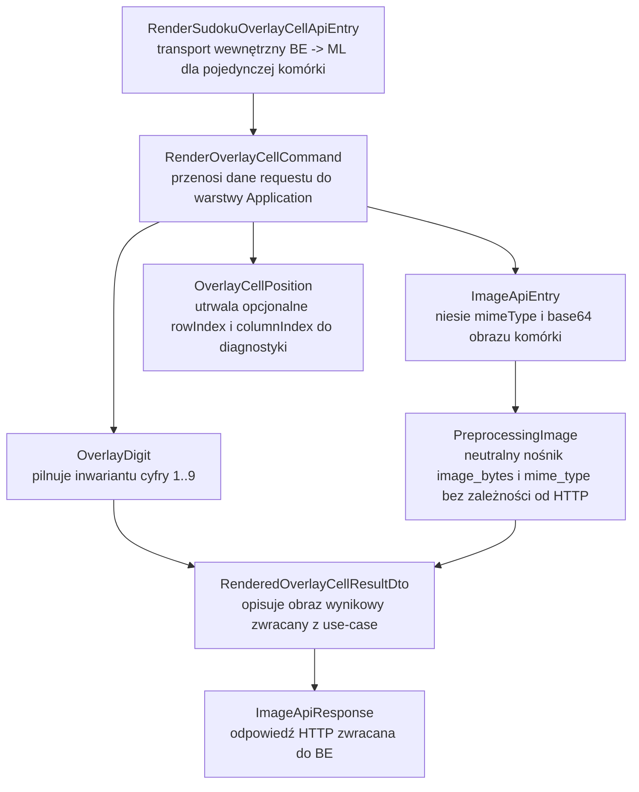
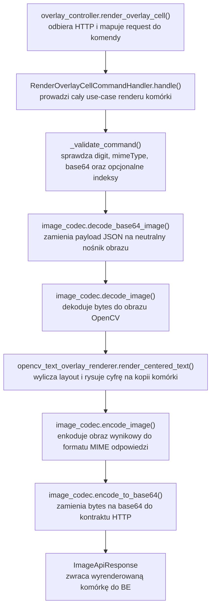

# UC-05D ML — Plan implementacyjny (`POST /api/sudoku/overlay/cells`)

## 1. Przeznaczenie endpointa
- Publiczny endpoint `POST /api/sudoku/overlay/cells` służy do wygenerowania obrazu pojedynczej komórki Sudoku z dorysowaną cyfrą rozwiązania.
- Plan opisuje wyłącznie część `ML`, więc po stronie serwisu Python implementujemy wewnętrzny odpowiednik `POST /ml/sudoku/overlay/cells`, wywoływany przez `Backend`.
- Wejściem do `ML` jest pojedynczy obraz komórki oraz cyfra `1..9`, która ma zostać naniesiona na tę komórkę.
- Wyjściem z `ML` jest wyrenderowany obraz tej samej komórki jako `ImageApiResponse`.
- `ML` nie:
  - składa finalnej planszy 9x9,
  - nie wybiera, które komórki mają zostać wyrenderowane,
  - nie uruchamia solvera,
  - nie utrzymuje żadnego rekordu systemowego,
  - nie staje się źródłem prawdy o stanie rozwiązania.
- Wariant podstawowy pozostaje renderem per-komórka. Ambitny wariant renderu na całej planszy albo na oryginalnym zdjęciu wejściowym pozostaje poza zakresem tej historyjki i powinien reuse'ować później ten sam generyczny renderer.

## 2. Źródła i założenia planu
- Plan bazuje na:
  - `@.ai/prd.md`,
  - `@.ai/feature/uc-05d-overview.md`,
  - `@.cursor/rules/architecture_ml.mdc`,
  - `@.ai/DokumentacjaDeployuRuntimeSerwera.md`,
  - wcześniejszych planach `UC-04`, `UC-05A`, `UC-06`, `UC-12`.
- Plan jest przygotowany dla warstwy `ML` i nie sugeruje się aktualnym stanem implementacji `FE` ani `BE`, poza wcześniej ustalonymi kontraktami i nazwami pól, których nie należy łamać.
- `ML` pozostaje usługą wewnętrzną, możliwie stateless, i nie przejmuje odpowiedzialności `BE`.
- `Backend` pozostaje `source of truth` dla:
  - workflow,
  - rozpoznanego i rozwiązanego gridu,
  - wyboru komórek do renderu,
  - mapowania błędów publicznych do `FE`.
- `FE` nadal komunikuje się wyłącznie z `BE`.

## 3. Relacja do innych historyjek

### 3.1 Twarde zależności wejściowe
- `UC-04`
  - dostarcza obraz planszy po korekcji perspektywy oraz siatkę komórek 9x9,
  - definiuje istniejące modele obrazu `ImageApiEntry` / `ImageApiResponse`,
  - ustala, że `ML` już pracuje na obrazach komórek i ma gotowy codec OpenCV.
- `UC-05B`
  - dostarcza rozwiązany grid albo przynajmniej cyfrę wynikową, która ma zostać narysowana.
- `UC-05C`
  - pozostaje funkcjonalnym fallbackiem produktu, jeśli overlay nie zostanie wygenerowany.
- `UC-05A`
  - potwierdza istniejące konwencje inferencji, kontraktów `ApiEntry/ApiResponse`, mapowania błędów i wzorzec cienkiego kontrolera `FastAPI`.
- `UC-06`
  - utrwala sposób organizacji warstw `api/application/infrastructure/models`,
  - utrwala zasady `.env`, `runtime_settings`, DI w `api/dependencies.py` i zgodność z release/deploy.
- `UC-12`
  - potwierdza, że `OpenCvImageCodec` oraz komponenty `vision` są już reusable adapterami infrastrukturalnymi,
  - nie należy duplikować pomocniczych operacji na obrazie poza istniejącą infrastrukturą.

### 3.2 Zależności wyjściowe
- `UC-05E`
  - jeśli live solve lub późniejsza animacja rozwiązania będzie chciała dorysowywać kolejne cyfry na komórkach, powinna reuse'ować ten sam endpoint per-komórka albo ten sam renderer infrastrukturalny, zamiast tworzyć drugi mechanizm overlay.
- przyszły wariant renderowania pełnej planszy po stronie `ML`
  - powinien reuse'ować ten sam renderer tekstu/cyfry, a dodać tylko osobny kompozytor planszy.
- przyszły wariant renderowania na oryginalnym zdjęciu
  - powinien reuse'ować ten sam renderer cyfry i dodać warstwę projekcji perspektywicznej.
- ewentualne ścieżki debug/benchmark
  - mogą reuse'ować renderer do nanoszenia etykiet i diagnostyki, bez duplikowania implementacji OpenCV.

### 3.3 Relacja do `UC-14`
- `UC-14` nie wnosi obecnie obowiązkowych parametrów `UI` dla overlay komórki.
- Jeśli w przyszłości pojawi się potrzeba sterowania stylem overlay z `UI`, to:
  - parametry powinny przechodzić przez istniejący request biznesowy,
  - `BE` ma pozostać miejscem walidacji i domknięcia wartości,
  - `.env*` i workflow nie mogą stać się drugim źródłem prawdy dla parametryzacji funkcjonalnej.

## 4. Decyzja architektoniczna dla ML
- Mimo że historyjka jest zakotwiczona w publicznym endpointcie `POST /api/sudoku/overlay/cells`, po stronie `ML` implementujemy wyłącznie wewnętrzny endpoint `POST /ml/sudoku/overlay/cells`.
- `ML` przyjmuje pojedynczą komórkę i pojedynczą cyfrę, renderuje wynik i odsyła obraz.
- Nie tworzymy endpointu przyjmującego całą planszę, `recognizedGrid` ani `solvedGrid`.
- Nie wprowadzamy zapisu runtime state po stronie `ML`.
- Nie używamy aktualnego stanu `FE` ani `BE` jako źródła prawdy projektowej; opieramy się na opisie historyjki i wcześniej ustalonych kontraktach.

## 5. Co już istnieje i co należy reuse'ować

### 5.1 Potwierdzone reusable elementy
- `src/MachineLearning/api/models/image_api_entry.py`
  - istniejący model obrazu wejściowego JSON; należy go reuse'ować jako pole `cellImage`.
- `src/MachineLearning/api/models/image_api_response.py`
  - istniejący model obrazu wyjściowego; odpowiedź overlay powinna zostać zwracana właśnie nim.
- `src/MachineLearning/api/models/error_api_response.py`
  - wspólny payload błędu `{ errorType, message }`.
- `src/MachineLearning/api/dependencies.py`
  - istniejący composition root; trzeba go rozszerzyć o handler overlay, zamiast tworzyć drugi mechanizm DI.
- `src/MachineLearning/api/main.py`
  - istniejąca rejestracja routerów; należy dopiąć nowy router overlay.
- `src/MachineLearning/infrastructure/vision/opencv_image_codec.py`
  - gotowy generyczny codec dekodowania/enkodowania obrazów przez OpenCV; należy go reuse'ować bez tworzenia drugiego codeca.
- `src/MachineLearning/models/preprocessing_image.py`
  - neutralny nośnik `mime_type + image_bytes`; można go reuse'ować także w ścieżce overlay.

### 5.2 Czego obecnie nie ma
- Po weryfikacji `src/MachineLearning/infrastructure` nie ma jeszcze gotowej usługi renderującej tekst/cyfrę na obrazie komórki.
- Nie ma też gotowego generycznego adaptera do wyznaczania layoutu napisu na canvase.

### 5.3 Wniosek architektoniczny
- Należy dodać nowy adapter infrastrukturalny, ale nie jako klasę szytą pod jeden endpoint.
- Rekomendowany nowy komponent:
  - `infrastructure/vision/opencv_text_overlay_renderer.py`
  - generyczny renderer tekstu wycentrowanego na obrazie, możliwy do reuse w kolejnych use-case'ach.
- Niedozwolone:
  - tworzenie drugiego codeca obrazów,
  - wrzucanie logiki rysowania bezpośrednio do kontrolera,
  - zaszywanie całego use-case'u w `Infrastructure`.

## 6. Docelowy kontrakt `BE <-> ML`

### 6.1 Endpoint wewnętrzny
- `POST /ml/sudoku/overlay/cells`
- Endpoint jest wewnętrzny.
- `FE` nie komunikuje się z nim bezpośrednio.

### 6.2 Request `RenderSudokuOverlayCellApiEntry`
```json
{
  "cellImage": {
    "mimeType": "image/png",
    "base64": "iVBORw0KGgoAAA..."
  },
  "digit": 4,
  "rowIndex": 0,
  "columnIndex": 2
}
```

### 6.3 Reguły requestu
- `cellImage` reuse'uje istniejący `ImageApiEntry`.
- `digit` musi przyjmować wyłącznie `1..9`.
- `rowIndex` i `columnIndex` pozostają opcjonalne.
- `rowIndex` i `columnIndex`, jeśli są podane, mają zakres `0..8`.
- `rowIndex` i `columnIndex` służą do:
  - diagnostyki,
  - logowania,
  - ewentualnego przyszłego rozszerzenia,
  - ale nie wpływają na sam algorytm rysowania w MVP.

### 6.4 Response sukcesu
- `200 OK` -> `ImageApiResponse`

Przykład:

```json
{
  "mimeType": "image/png",
  "base64": "iVBORw0KGgoAAA..."
}
```

### 6.5 Response błędu
- `ErrorApiResponse`

Przykład:

```json
{
  "errorType": "invalid_digit",
  "message": "Pole digit musi zawierać cyfrę od 1 do 9."
}
```

### 6.6 Statusy HTTP po stronie ML
- `200 OK`
  - sukces renderowania.
- `422 Unprocessable Content`
  - błędna cyfra,
  - błędny zakres `rowIndex` / `columnIndex`,
  - nieprzetwarzalny obraz komórki,
  - nieudane renderowanie wynikające z błędnych danych wejściowych.
- `500 Internal Server Error`
  - nieobsłużona awaria techniczna po stronie `ML`.

### 6.7 Statusy publiczne po stronie BE
- `400 Bad Request`
  - publiczny payload nie przeszedł walidacji w `BE`.
- `422 Unprocessable Entity`
  - `BE` przepuszcza błąd walidacyjno-biznesowy z `ML`.
- `503 Service Unavailable`
  - `ML` jest niedostępne lub transport `BE -> ML` nie doszedł do skutku.
- Te kody publiczne opisujemy w planie wyłącznie dla spójności, ale implementacyjnie należą do `BE`, nie do `ML`.

## 7. Zachowanie warstwowe

### 7.1 API
- Odbiera `RenderSudokuOverlayCellApiEntry`.
- Mapuje request na komendę aplikacyjną.
- Wywołuje handler use-case.
- Zwraca `ImageApiResponse`.
- Mapuje błędy use-case na `ErrorApiResponse`.
- Nie wykonuje:
  - dekodowania obrazu,
  - rysowania cyfr,
  - obliczeń położenia napisu,
  - logiki fallbacku.

### 7.2 Application
- Waliduje kontrakt use-case:
  - poprawność `mimeType`,
  - niepustość `base64`,
  - zakres `digit`,
  - zakres opcjonalnych indeksów.
- Orkiestruje przebieg:
  1. dekodowanie obrazu komórki,
  2. walidację obrazu wejściowego,
  3. wywołanie generycznego renderera tekstu,
  4. enkodowanie wyniku do odpowiedzi.
- Application decyduje:
  - kiedy błąd jest walidacyjny,
  - kiedy błąd jest techniczny,
  - jakie dane trafią do logów.
- Application nie zna:
  - FastAPI,
  - Pydantic modeli API,
  - szczegółów `cv2.putText`,
  - formatu release/deploy.

### 7.3 Domain / Models
- Utrzymuje neutralne modele i inwarianty:
  - cyfra overlay musi być z zakresu `1..9`,
  - opcjonalna pozycja komórki ma zakres `0..8`,
  - wynik renderu pozostaje obrazem bez wiedzy o HTTP.
- Modele domenowe nie zależą od FastAPI, Pydantic ani OpenCV.

### 7.4 Infrastructure
- Implementuje:
  - dekodowanie i enkodowanie obrazów,
  - normalizację canvasa do formatu używanego przez OpenCV,
  - obliczenie geometrii napisu,
  - renderowanie cyfry na obrazie.
- Infrastructure ma być reusable:
  - bez wiedzy o endpointach publicznych,
  - bez wiedzy o solverze,
  - bez wiedzy o stanie planszy,
  - bez zależności od `FE`.

## 8. Plan plików per warstwa i odpowiedzialności

## 8.1 API (`src/MachineLearning/api`)
- `[NOWY]` `api/controllers/overlay_controller.py`
  - router `POST /ml/sudoku/overlay/cells`,
  - cienkie mapowanie request -> command -> response,
  - mapowanie błędów use-case na `ErrorApiResponse`.
- `[NOWY]` `api/models/render_sudoku_overlay_cell_api_entry.py`
  - top-level request wewnętrzny od `BE`,
  - zawiera `cellImage`, `digit`, `rowIndex`, `columnIndex`.
- `[REUSE]` `api/models/image_api_entry.py`
  - reuse zagnieżdżonego modelu `cellImage`.
- `[REUSE]` `api/models/image_api_response.py`
  - zwrot wyrenderowanej komórki.
- `[REUSE]` `api/models/error_api_response.py`
  - wspólny model błędu.
- `[UPDATE]` `api/dependencies.py`
  - dodać `get_render_overlay_cell_command_handler()`,
  - wstrzykiwać `OpenCvImageCodec` oraz nowy renderer infrastrukturalny.
- `[UPDATE]` `api/main.py`
  - zarejestrować `overlay_controller`.
- `[BEZ ZMIAN W MVP]` `api/config/runtime_settings.py`
  - overlay nie wymaga nowego środowiskowego source of truth w MVP.
- `[BEZ ZMIAN W MVP]` `api/config/environment.py`
  - brak potrzeby dodawania nowych zmiennych dla podstawowego wariantu renderu.
- `[BEZ ZMIAN W MVP]` `api/.env`
  - brak nowego parametru funkcjonalnego.
- `[BEZ ZMIAN W MVP]` `api/.env.local`
  - brak nowych ustawień overlay; lokalnie nie dochodzi nowy env.
- `[BEZ ZMIAN W MVP]` `api/.env.production`
  - workflow nie musi dopisywać nowych env tylko dla tej historyjki, chyba że zespół świadomie wyniesie techniczne parametry renderera do konfiguracji w późniejszym etapie.

## 8.2 Application (`src/MachineLearning/application/features/overlay`)
- `[NOWY]` `application/features/overlay/commands/render_overlay_cell/render_overlay_cell_command.py`
  - komenda use-case.
- `[NOWY]` `application/features/overlay/commands/render_overlay_cell/render_overlay_cell_command_handler.py`
  - główna orkiestracja renderu komórki.
- `[NOWY]` `application/features/overlay/commands/render_overlay_cell/render_overlay_cell_command_result_dto.py`
  - wynik końcowy use-case do warstwy API.
- `[NOWY]` `application/features/overlay/dto/rendered_overlay_cell_result_dto.py`
  - DTO obrazu wynikowego przekazywanego wewnątrz use-case.
- `[NOWY]` `application/features/overlay/errors/render_overlay_cell_errors.py`
  - jawne wyjątki use-case i mapowanie na statusy HTTP.
- `[NOWY]` `application/features/overlay/__init__.py`
  - spójność pakietu feature-first.
- `[NOWY]` `application/features/overlay/commands/__init__.py`
  - spójność pakietu.
- `[NOWY]` `application/features/overlay/dto/__init__.py`
  - spójność pakietu.

## 8.3 Domain / Models (`src/MachineLearning/models`)
- `[NOWY]` `models/overlay_digit.py`
  - value object pilnujący inwariantu `1..9`.
- `[NOWY]` `models/overlay_cell_position.py`
  - opcjonalna diagnostyczna pozycja komórki z zakresem `0..8`.
- `[REUSE]` `models/preprocessing_image.py`
  - neutralny nośnik obrazu wejściowego i wyjściowego,
  - nie tworzyć drugiego modelu bytes/mime tylko dla overlay.

## 8.4 Infrastructure (`src/MachineLearning/infrastructure`)
- `[REUSE]` `infrastructure/vision/opencv_image_codec.py`
  - dekodowanie `base64 -> bytes -> cv2 image`,
  - enkodowanie `cv2 image -> bytes -> base64`.
- `[NOWY]` `infrastructure/vision/opencv_text_overlay_renderer.py`
  - generyczny renderer wycentrowanego tekstu na obrazie,
  - odpowiedzialny za:
    - normalizację obrazu do formatu kompatybilnego z OpenCV,
    - obliczenie rozmiaru fontu względem rozmiaru komórki,
    - obliczenie punktu startowego tekstu,
    - narysowanie cyfry,
    - zwrot nowego obrazu bez modyfikacji wejścia in-place.
- `[OPCJONALNY NOWY]` `infrastructure/vision/overlay_render_style.py`
  - tylko jeśli implementacja wymaga jawnego, reusable modelu technicznego stylu renderu,
  - ma być technicznym obiektem infrastrukturalnym, a nie payloadem HTTP.
- `[NIE REUSE'OWAĆ W ŚCIEŻCE GŁÓWNEJ]` `infrastructure/vision/cell_preprocessing_pipeline.py`
  - nie jest potrzebny do samego renderowania,
  - nie należy sztucznie włączać preprocessingu inferencyjnego do overlay.

## 8.5 Testy (`src/MachineLearning/tests`)
- `[NOWY]` `tests/integration/test_overlay_controller.py`
  - kontrakt `POST /ml/sudoku/overlay/cells`.
- `[NOWY]` `tests/unit/test_render_overlay_cell_command_handler.py`
  - logika use-case i mapowanie błędów.
- `[NOWY]` `tests/unit/test_opencv_text_overlay_renderer.py`
  - zachowanie renderera OpenCV.
- `[REUSE WZORCA]` istniejące testy kontrolerów i inferencji
  - jako punkt odniesienia dla stylu testów i mapowania błędów.

## 9. Model API wejściowy i wyjściowy w komunikacji z BE

### 9.1 Request
- `RenderSudokuOverlayCellApiEntry`
  - `cellImage: ImageApiEntry`
    - `mimeType: string`
    - `base64: string`
  - `digit: int`
  - `rowIndex?: int`
  - `columnIndex?: int`

### 9.2 Response sukcesu
- `ImageApiResponse`
  - `mimeType: string`
  - `base64: string`

### 9.3 Response błędu
- `ErrorApiResponse`
  - `errorType: string`
  - `message: string`

## 10. Główne funkcje i komponenty
- `render_overlay_cell()`
  - endpoint FastAPI dla `POST /ml/sudoku/overlay/cells`.
- `RenderOverlayCellCommandHandler.handle()`
  - pełna orkiestracja use-case.
- `RenderOverlayCellCommandHandler._validate_command()`
  - walidacja `digit`, indeksów i podstawowego kształtu requestu.
- `RenderOverlayCellCommandHandler._decode_cell_image()`
  - dekodowanie `base64` do obrazu OpenCV.
- `RenderOverlayCellCommandHandler._render_digit_overlay()`
  - wywołanie renderer'a infrastrukturalnego.
- `RenderOverlayCellCommandHandler._encode_response_image()`
  - przygotowanie DTO odpowiedzi.
- `OpenCvTextOverlayRenderer.render_centered_text()`
  - render tekstu wycentrowanego na obrazie.
- `OpenCvTextOverlayRenderer._normalize_canvas()`
  - normalizacja obrazu do formatu roboczego.
- `OpenCvTextOverlayRenderer._calculate_layout()`
  - obliczenie skali, grubości linii i pozycji tekstu.
- `OpenCvTextOverlayRenderer._draw_text()`
  - właściwe wywołanie OpenCV rysujące cyfrę.

## 11. Przepływ wewnątrz ML
1. `API` odbiera `POST /ml/sudoku/overlay/cells`.
2. Request jest mapowany na `RenderOverlayCellCommand`.
3. `Application` waliduje:
   - `cellImage`,
   - `digit`,
   - opcjonalne `rowIndex`,
   - opcjonalne `columnIndex`.
4. `Application` dekoduje obraz przez `OpenCvImageCodec`.
5. `Application` przekazuje obraz i cyfrę do generycznego renderer'a OpenCV.
6. `Infrastructure`:
   - tworzy kopię canvasa,
   - wylicza parametry layoutu,
   - rysuje cyfrę,
   - zwraca obraz wynikowy.
7. `Application` koduje wynik do `ImageApiResponse`.
8. `API` zwraca odpowiedź do `BE`.

## 12. Obsługa wyjątków i fallbacków

### 12.1 Kluczowe błędy
- `invalid_request`
  - brak wymaganych pól lub niepoprawny kształt requestu.
- `invalid_image_payload`
  - niepoprawny `mimeType` lub niepoprawne `base64`.
- `invalid_digit`
  - `digit` nie mieści się w zakresie `1..9`.
- `invalid_cell_position`
  - `rowIndex` albo `columnIndex` nie mieszczą się w zakresie `0..8`.
- `cell_image_not_processable`
  - obraz udało się zdekodować, ale nie da się go poprawnie wykorzystać jako canvas komórki.
- `overlay_render_failed`
  - błąd renderowania w OpenCV.
- `internal_server_error`
  - nieobsłużony błąd techniczny.

### 12.2 Dozwolone fallbacki
- Jeśli obraz wejściowy jest grayscale, renderer może wewnętrznie zamienić go do formatu akceptowanego przez OpenCV bez zmiany kontraktu.
- Jeśli obraz wejściowy ma kanał alfa, renderer może go spłaszczyć do standardowego canvasa roboczego.
- Jeśli `rowIndex` i `columnIndex` nie są podane, render nadal działa; pola są diagnostyczne, nie funkcjonalne.

### 12.3 Niedozwolone fallbacki
- Brak cichego zwracania oryginalnej komórki bez overlay przy błędzie renderowania.
- Brak cichej zamiany nielegalnej cyfry na inną.
- Brak zgadywania pozycji komórki.
- Brak przenoszenia odpowiedzialności za decyzję "czy dana komórka powinna dostać overlay" do `ML`.
- Brak alternatywnego code path poza jednym generycznym rendererem OpenCV.

### 12.4 Zasada produktowa
- Jeżeli overlay się nie uda, sam endpoint ma zwrócić czytelny błąd.
- Produkt jako całość nadal może korzystać z fallbacku prezentacyjnego z `UC-05C`, ale to decyzja wyższej warstwy, nie zachowanie endpointu `ML`.

## 13. Specyficzna logika i pseudokod
```python
def handle_render_overlay_cell(command):
    validate_command(command)

    encoded_input = image_codec.decode_base64_image(
        base64_image=command.cell_image_base64,
        mime_type=command.cell_image_mime_type,
    )
    decoded_image = image_codec.decode_image(encoded_input)

    overlay_digit = OverlayDigit(command.digit)
    overlay_position = OverlayCellPosition(
        row_index=command.row_index,
        column_index=command.column_index,
    )

    rendered_image = text_overlay_renderer.render_centered_text(
        image=decoded_image,
        text=str(overlay_digit.value),
    )

    encoded_output = image_codec.encode_image(
        image=rendered_image,
        mime_type=command.cell_image_mime_type,
    )

    return RenderOverlayCellCommandResultDto(
        mime_type=encoded_output.mime_type,
        base64=image_codec.encode_to_base64(encoded_output),
    )
```

### 13.1 Reguła layoutu renderu
```text
1. Przyjmij obraz komórki jako canvas wejściowy.
2. Pracuj na kopii obrazu, nie modyfikuj wejścia in-place.
3. Wyznacz rozmiar fontu proporcjonalnie do wysokości i szerokości komórki.
4. Policz prostokąt ograniczający napis dla cyfry 1..9.
5. Wycentruj napis względem środka komórki.
6. Zachowaj bezpieczny margines od krawędzi komórki.
7. Narysuj cyfrę kolorem kontrastowym względem tła.
8. Zwróć wyrenderowany obraz w tym samym formacie MIME, jeśli codec go obsługuje.
```

## 14. Mermaid: flow modeli


## 15. Mermaid: flow logiki aplikacji


## 16. Logging
- Logi mają pomagać diagnozować problemy, ale nie mogą spamować ani zapychać dysku.

### 16.1 Co logować
- `INFO`
  - przyjęcie requestu overlay,
  - `digit`,
  - obecność lub brak `rowIndex` / `columnIndex`,
  - `mimeType`,
  - sukces renderu.
- `WARNING`
  - nielegalna cyfra,
  - nielegalny zakres indeksów,
  - nieprzetwarzalny obraz komórki,
  - problem z layoutem lub niespodziewanym formatem canvasa.
- `ERROR`
  - nieudany render OpenCV,
  - nieobsłużony wyjątek endpointu.

### 16.2 Czego nie logować
- pełnego `base64`,
- całego obrazu,
- pełnego payloadu requestu,
- dumpów binarnych,
- ścieżek systemowych, jeśli nie są potrzebne diagnostycznie,
- powtarzalnych logów per piksel / per iteracja.

## 17. Konfiguracja runtime i workflow GitHub

### 17.1 Decyzja dla MVP
- Dla podstawowego wariantu `UC-05D` nie planujemy nowego parametru środowiskowego w `.env*`.
- Styl renderu pozostaje techniczną decyzją implementacyjną zamkniętą w adapterze `Infrastructure`, a nie nowym źródłem konfiguracji runtime.
- Dzięki temu:
  - nie dokładamy drugiego źródła prawdy,
  - nie rozbudowujemy niepotrzebnie workflow,
  - nie przenosimy parametru funkcjonalnego do `.env`.

### 17.2 Local
- Lokalnie nic nowego nie jest wymagane w `api/.env.local`.
- Zgodnie z zasadą projektu: jeśli w przyszłości pojawi się techniczna potrzeba parametryzacji renderera, lokalne wartości wpisujemy jawnie na sztywno w `api/.env.local`.

### 17.3 Production i workflow
- Dla tej historyjki nie ma obowiązkowej zmiany w `.github/workflows/ml-cd.yml`.
- W planie należy jednak wprost utrzymać regułę:
  - `local` -> wartości konfiguracyjne wpisujemy jawnie w `.env.local`,
  - `production` -> workflow zmienia tylko overlay środowiskowy `.env.production`, jeśli pojawią się nowe techniczne ustawienia.
- Workflow nadal:
  - pakuje całe `src/MachineLearning`,
  - dołącza `requirements.txt`,
  - ustawia `ML_ENVIRONMENT=production`,
  - dostarcza `api/.env.production`,
  - nie tworzy alternatywnego systemu konfiguracji.
- Workflow nie może nadpisywać runtime state:
  - `models/registry`,
  - `models/active`,
  - `trainings`,
  - `data`,
  - `examples`.

## 18. Kolejność implementacji historyjki
1. Potwierdzić finalny kontrakt `RenderSudokuOverlayCellApiEntry` bez łamania istniejących modeli obrazu i błędu.
2. Dodać pakiet `application/features/overlay`.
3. Dodać modele domenowe `OverlayDigit` i `OverlayCellPosition`.
4. Dodać generyczny adapter `OpenCvTextOverlayRenderer`.
5. Dodać `overlay_controller.py` i model requestu API.
6. Rozszerzyć `api/dependencies.py` i `api/main.py`.
7. Zaimplementować mapowanie błędów na `ErrorApiResponse`.
8. Dodać testy jednostkowe handlera.
9. Dodać testy jednostkowe renderera OpenCV.
10. Dodać test integracyjny endpointu.
11. Zweryfikować, że historyjka nie wymaga zmian w `.env*` ani workflow ML-CD.

## 19. Guardraile implementacyjne
- Nie tworzyć drugiego systemu konfiguracji poza `api/config/environment.py` i `.env*`.
- Nie hardcodować ścieżek serwerowych `/opt/sudoku/...` w kodzie.
- Nie mieszać modeli API z DTO aplikacyjnymi i modelami domenowymi.
- Nie przenosić logiki renderowania do kontrolera.
- Nie tworzyć renderer'a szytego pod jeden endpoint, jeśli da się dodać generyczny adapter tekstowy.
- Nie tworzyć drugiego codeca obrazów.
- Nie używać `CellPreprocessingPipeline` jako obowiązkowej części overlay, bo to inny use-case.
- Nie zmieniać nazw pól kontraktowych:
  - `mimeType`,
  - `base64`,
  - `errorType`,
  - `message`,
  - `cellImage`,
  - `digit`,
  - `rowIndex`,
  - `columnIndex`.
- Nie dokładać parametru funkcjonalnego overlay do `.env*` tylko dlatego, że łatwiej go tam wpisać.
- Nie zwracać oryginalnego obrazu jako sukcesu, jeśli render się nie wykonał.

## 20. Inne istotne reguły
- `ML` nie decyduje, które komórki są puste i które mają dostać overlay; to już powinno zostać rozstrzygnięte wcześniej w workflow wyższego poziomu.
- `ML` nie powinno próbować usuwać istniejących cyfr z komórki; przyjmuje, że upstream przekazuje właściwą komórkę do renderu.
- Kolor i styl overlay powinny być dobrane tak, by cyfra była czytelna i odróżnialna od oryginalnych cyfr, ale szczegóły tej decyzji pozostają techniczne i zamknięte w `Infrastructure`.
- Jeśli pojawi się potrzeba pełnego renderu planszy, należy dodać osobny use-case kompozycji planszy, a nie rozbudowywać ten endpoint o całą planszę.
- `ML` ma pozostać synchroniczne dla tej operacji; nie ma potrzeby wprowadzać joba asynchronicznego.

## 21. Plan testów minimum
- Unit `RenderOverlayCellCommandHandler`
  - sukces renderowania poprawnej komórki,
  - `invalid_digit`,
  - `invalid_cell_position`,
  - `invalid_image_payload`,
  - `cell_image_not_processable`,
  - `overlay_render_failed`.
- Unit `OpenCvTextOverlayRenderer`
  - render na obrazie grayscale,
  - render na obrazie kolorowym,
  - brak modyfikacji wejścia in-place,
  - wynik zachowuje rozmiar canvasa,
  - wycentrowanie napisu mieści się w komórce.
- Integracyjny `POST /ml/sudoku/overlay/cells`
  - `200` dla poprawnego requestu,
  - `422` dla błędnej cyfry,
  - `422` dla niepoprawnego obrazu,
  - `422` dla nielegalnego `rowIndex` / `columnIndex`,
  - `500` dla nieobsłużonego wyjątku renderera.

## 22. Podsumowanie decyzji architektonicznych
- To jest wyłącznie plan dla części `ML`.
- Publiczny endpoint historyjki pozostaje `POST /api/sudoku/overlay/cells`, ale po stronie `ML` implementujemy wewnętrzny `POST /ml/sudoku/overlay/cells`.
- `ML` renderuje pojedynczą komórkę i zwraca `ImageApiResponse`.
- Finalnej planszy nie skleja `ML`.
- Po weryfikacji istniejącej infrastruktury nie ma gotowego renderer'a overlay, więc trzeba dodać nowy, ale generyczny adapter `OpenCvTextOverlayRenderer`.
- Reuse istniejących komponentów jest obowiązkowy tam, gdzie już istnieją:
  - `ImageApiEntry`,
  - `ImageApiResponse`,
  - `ErrorApiResponse`,
  - `OpenCvImageCodec`,
  - `api/dependencies.py`,
  - `api/main.py`,
  - `PreprocessingImage`.
- W MVP nie ma potrzeby zmiany `.env*` ani workflow ML-CD, ale plan wyraźnie zachowuje zasadę:
  - lokalnie ustawienia wpisujemy na sztywno,
  - produkcyjnie workflow zmienia overlay środowiskowy tylko wtedy, gdy rzeczywiście pojawi się nowy techniczny parametr runtime.
