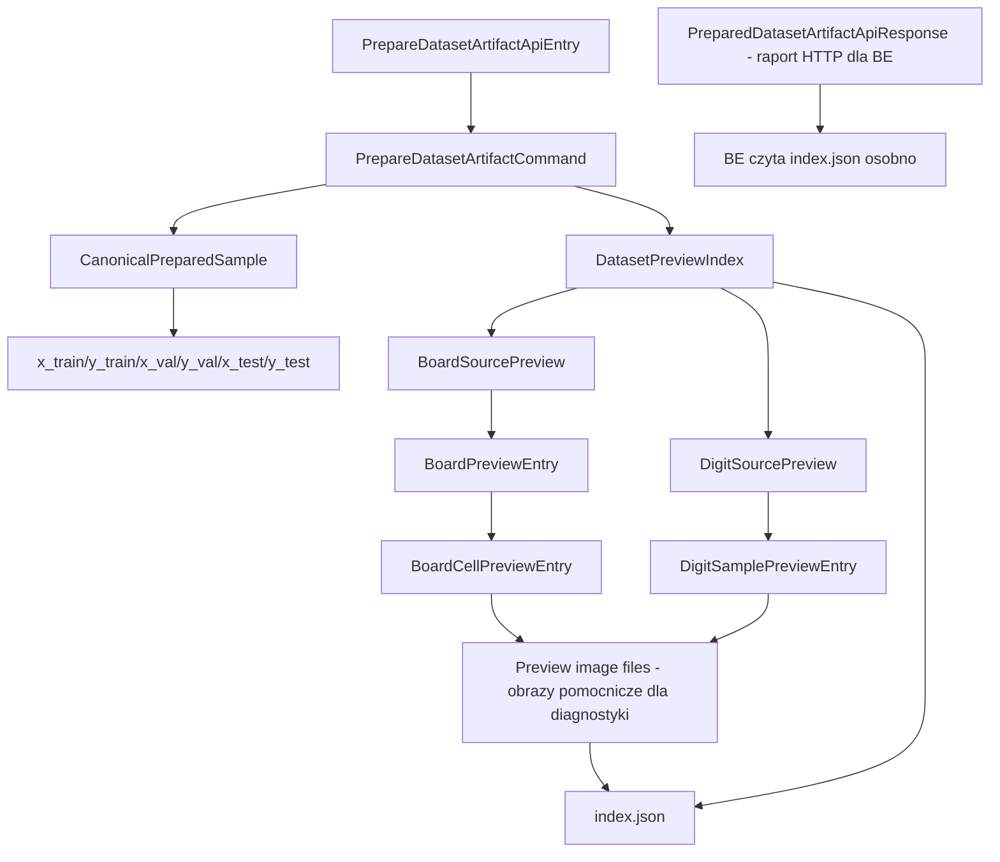
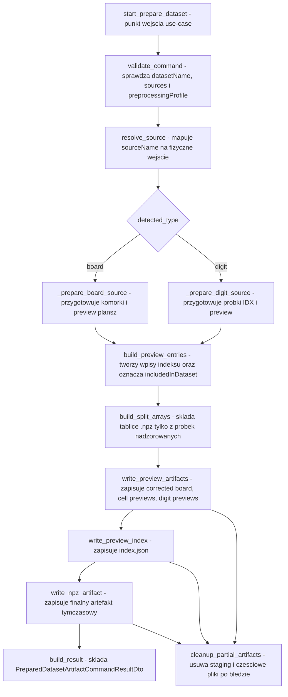

# UC-16 ML - Plan implementacyjny (`POST /ml/datasets/prepare`)

## 1. Przeznaczenie endpointa
- Endpoint wewnetrzny `BE -> ML` `POST /ml/datasets/prepare` pozostaje jedynym punktem uruchamiajacym przygotowanie datasetu po stronie ML.
- W `UC-16` endpoint nie zmienia swojej glownej odpowiedzialnosci z `UC-12`: nadal przygotowuje jeden techniczny artefakt `{datasetName}.npz`.
- Rozszerzenie `UC-16` polega na tym, ze w tym samym workflow ML zapisuje takze:
  - artefakty preview dla zrodel `board` i `digit`,
  - indeks preview w formacie maszynowo czytelnym dla BE.
- Plan dotyczy tylko warstwy ML. FE i BE sa tutaj tylko konsumentami kontraktu HTTP oraz kontraktu plikowego.

## 2. Zrodla prawdy i dokumenty, na ktorych opiera sie plan
- Plan jest oparty na:
  - `/.ai/prd.md`,
  - `/.ai/feature/ml/uc-16.md`,
  - `/.ai/feature/ml/uc-12.md`,
  - `/.cursor/rules/architecture_ml.mdc`,
  - `/.ai/DokumentacjaDeployuRuntimeSerwera.md`.
- Plan nie wyprowadza zachowania z aktualnego FE ani z aktualnego BE.
- Jednoczesnie plan respektuje wczesniejsze kontrakty i nazwy z `UC-12` i zaleznosci z `UC-06`; nie zmieniamy nazw klas, payloadow, pol JSON ani semantyki endpointu, jesli nie ma na to silnego powodu.

## 3. Glowna decyzja projektowa dla UC-16
- Aby nie naruszyc kontraktu `UC-12`, odpowiedz HTTP `PreparedDatasetArtifactApiResponse` pozostaje bez zmian.
- Informacje potrzebne do przegladania preview beda dostarczane do BE przez deterministyczny zapis plikowy:
  - katalog preview dla `datasetName`,
  - pliki obrazow preview,
  - `index.json`.
- To jest najlepszy wariant dla `UC-16`, bo:
  - zachowuje kompatybilnosc z `UC-12`,
  - nie wymusza zmiany klas API po stronie BE,
  - nie miesza stanu technicznego preview z odpowiedzia runtime,
  - pozwala BE pozostac `source of truth`, a ML ograniczyc do artefaktow technicznych.

## 4. Kontrakt HTTP ML <-> BE

### 4.1 Request
- Bez zmian wzgledem `UC-12`.
- Nadal uzywamy:
  - `PrepareDatasetArtifactApiEntry`,
  - `PrepareDatasetSourceApiEntry`,
  - `DatasetSplitPolicyApiEntry`,
  - `SplitRatiosApiEntry`.

```json
{
  "datasetName": "sudokuDigitsV1",
  "preprocessingProfile": "default-28x28-v1",
  "sources": [
    {
      "name": "v1_training",
      "type": "board",
      "splitPolicy": {
        "mode": "selected",
        "groupBy": "board",
        "ratios": {
          "train": 0.5,
          "val": 0.5,
          "test": 0.0
        }
      }
    },
    {
      "name": "t10k",
      "type": "digit",
      "splitPolicy": {
        "mode": "mix",
        "groupBy": "sample",
        "ratios": {
          "train": 0.8,
          "val": 0.1,
          "test": 0.1
        }
      }
    }
  ]
}
```

### 4.2 Response
- Bez zmian wzgledem `UC-12`.
- Nadal zwracamy `PreparedDatasetArtifactApiResponse`.
- `UC-16` nie dodaje pol preview do HTTP response.

```json
{
  "sampleCounts": {
    "train": 9657,
    "val": 2657,
    "test": 1000
  },
  "sources": [
    {
      "name": "v1_training",
      "requestedType": "board",
      "detectedType": "board",
      "processedSampleCount": 8100,
      "includedSampleCount": 3314,
      "emptyCellCount": 4772,
      "rejectedSampleCount": 14,
      "warnings": []
    }
  ],
  "warnings": []
}
```

### 4.3 Bledy HTTP
- Bez zmian w modelu transportowym:
  - `ErrorApiResponse`,
  - pola `errorType`, `message`,
  - `422` dla bledow walidacji/przygotowania,
  - `500` dla bledow nieobsluzonych lub bledow technicznych zapisu.

## 5. Kontrakt plikowy ML -> BE dla preview

### 5.1 Cel kontraktu plikowego
- To nie jest publiczne API HTTP.
- To jest stabilny kontrakt techniczny pomiedzy ML i BE, wykorzystywany po zakonczonym `POST /ml/datasets/prepare`.
- BE nie powinien rekonstruowac preview przez skanowanie katalogow; ma czytac `index.json`.

### 5.2 Proponowana lokalizacja
- Wprowadzamy nowy katalog runtime konfigurowany po stronie ML:
  - `ML_DATASET_PREVIEWS_DIRECTORY_PATH`
- Deterministyczny zapis:
  - `{ML_DATASET_PREVIEWS_DIRECTORY_PATH}/{datasetName}/index.json`
  - `{ML_DATASET_PREVIEWS_DIRECTORY_PATH}/{datasetName}/board/...`
  - `{ML_DATASET_PREVIEWS_DIRECTORY_PATH}/{datasetName}/digit/...`

### 5.3 Proponowana struktura logiczna `index.json`
- Root:
  - `datasetName`
  - `preprocessingProfile`
  - `boardSources`
  - `digitSources`
- Dla `boardSources`:
  - `sourceName`
  - `boards`
- Dla kazdej planszy:
  - `boardName`
  - `split`
  - `correctedBoardImageRelativePath`
  - `cells`
- Dla kazdej komorki:
  - `cellIndex`
  - `label`
  - `previewImageRelativePath`
  - `includedInDataset`
- Dla `digitSources`:
  - `sourceName`
  - `samples`
- Dla kazdej probki `digit`:
  - `sampleIndex`
  - `split`
  - `label`
  - `previewImageRelativePath`
  - `includedInDataset`

### 5.4 Przykladowy `index.json`
```json
{
  "datasetName": "sudokuDigitsV1",
  "preprocessingProfile": "default-28x28-v1",
  "boardSources": [
    {
      "sourceName": "v1_training",
      "boards": [
        {
          "boardName": "board-001",
          "split": "train",
          "correctedBoardImageRelativePath": "board/v1_training/board-001/corrected-board.png",
          "cells": [
            {
              "cellIndex": 0,
              "label": null,
              "previewImageRelativePath": "board/v1_training/board-001/cells/000.png",
              "includedInDataset": false
            },
            {
              "cellIndex": 1,
              "label": 7,
              "previewImageRelativePath": "board/v1_training/board-001/cells/001.png",
              "includedInDataset": true
            }
          ]
        }
      ]
    }
  ],
  "digitSources": [
    {
      "sourceName": "t10k",
      "samples": [
        {
          "sampleIndex": "t10k:42",
          "split": "test",
          "label": 3,
          "previewImageRelativePath": "digit/t10k/000042.png",
          "includedInDataset": true
        }
      ]
    }
  ]
}
```

## 6. Zachowanie warstwowe

### 6.1 API
- `API` pozostaje cienka.
- Odpowiada tylko za:
  - przyjecie `PrepareDatasetArtifactApiEntry`,
  - mapowanie do `PrepareDatasetArtifactCommand`,
  - wywolanie handlera,
  - mapowanie wyniku na `PreparedDatasetArtifactApiResponse`,
  - mapowanie wyjatkow na `ErrorApiResponse`.
- `API` nie:
  - buduje indeksu preview,
  - nie zapisuje plikow obrazow,
  - nie wykonuje logiki datasetowej,
  - nie rozstrzyga splitow.

### 6.2 Application
- `Application` orkiestruje caly use-case.
- Odpowiada za:
  - walidacje use-case,
  - rozpoznanie i przejscie po zrodlach `board` / `digit`,
  - zapewnienie, ze preview powstaje z tego samego pipeline'u co dane trafiajace do `.npz`,
  - zbudowanie modelu indeksu preview,
  - decyzje kiedy probka jest `includedInDataset`,
  - domkniecie workflow: preview + index + `.npz`,
  - cleanup czesciowych artefaktow przy bledzie.
- `Application` nie powinna zawierac:
  - OpenCV,
  - `cv2.imwrite`,
  - `json.dump`,
  - bezposredniego I/O plikowego,
  - hardcodowanych sciezek runtime.

### 6.3 Domain / Models
- `Models` przechowuje neutralny model semantyczny:
  - probki kanonicznej,
  - indeksu preview,
  - wpisu planszy,
  - wpisu komorki,
  - wpisu probki `digit`.
- Reguly domenowe:
  - `board`:
    - `0 -> null`,
    - `null` nie trafia do `y_*`,
    - `includedInDataset = false` dla pustej komorki,
    - preview nadal moze istniec dla pustej komorki.
  - `digit`:
    - `0` pozostaje legalna etykieta klasy,
    - `includedInDataset = true`, jesli preprocessing zakonczyl sie sukcesem.
- `Models` nie zna:
  - FastAPI,
  - Pydantic,
  - OpenCV,
  - formatow plikowych runtime.

### 6.4 Infrastructure
- `Infrastructure` dostarcza implementacje techniczne:
  - wczytanie zrodel,
  - preprocessing OpenCV,
  - zapis `.npz`,
  - zapis PNG,
  - zapis `index.json`,
  - budowe deterministycznych sciezek,
  - atomowy zapis artefaktow.
- Nowe uslugi w `Infrastructure` musza byc generyczne i wielokrotnego uzytku.
- Jeśli istnieje juz odpowiedni adapter, uzywamy go zamiast tworzyc duplikat.

## 7. Pliki per warstwa i odpowiedzialnosci

### 7.1 API (`src/MachineLearning/api`)
- `api/controllers/datasets_controller.py` - `update`
  - ten sam endpoint `POST /ml/datasets/prepare`,
  - brak zmian kontraktu HTTP,
  - ewentualne doprecyzowanie mapowania nowych bledow preview na `ErrorApiResponse`.
- `api/models/prepare_dataset_artifact_api_entry.py` - `reuse`
  - model requestu,
  - bez zmian nazw pol.
- `api/models/prepare_dataset_source_api_entry.py` - `reuse`
  - model pojedynczego zrodla.
- `api/models/dataset_split_policy_api_entry.py` - `reuse`
  - model polityki splitu.
- `api/models/split_ratios_api_entry.py` - `reuse`
  - model ratio dla `train/val/test`.
- `api/models/prepared_dataset_artifact_api_response.py` - `reuse`
  - response sukcesu,
  - bez dodawania pol preview.
- `api/models/prepared_dataset_source_report_api_response.py` - `reuse`
  - raport per zrodlo.
- `api/models/split_sample_counts_api_response.py` - `reuse`
  - liczniki splitow.
- `api/models/error_api_response.py` - `reuse`
  - standard bledu `{ errorType, message }`.
- `api/dependencies.py` - `update`
  - rozszerzenie DI o:
    - provider sciezek preview,
    - writer obrazow preview,
    - writer indeksu preview,
    - ewentualny cleanup service.
- `api/config/runtime_settings.py` - `update`
  - dodanie:
    - `dataset_previews_directory_path`,
    - opcjonalnie `preview_image_mime_type`,
    - opcjonalnie `preview_index_file_name`.
- `api/config/environment.py` - `update`
  - zaladowanie nowych zmiennych `.env`.
- `api/.env` - `update`
  - dodanie bazowej definicji klucza `ML_DATASET_PREVIEWS_DIRECTORY_PATH`.
- `api/.env.local` - `update`
  - lokalna wartosc ustawiona na sztywno.
- `api/.env.production` - `update`
  - overlay produkcyjny z absolutna sciezka runtime dostarczany przez workflow.
- `api/main.py` - `reuse`
  - rejestracja routera bez zmiany publicznej struktury endpointow ML.

### 7.2 Application (`src/MachineLearning/application`)
- `application/features/datasets/commands/prepare_dataset_artifact/prepare_dataset_artifact_command.py` - `reuse`
  - bez zmian kontraktu.
- `application/features/datasets/commands/prepare_dataset_artifact/prepare_dataset_artifact_command_handler.py` - `update`
  - glowna orkiestracja `UC-16`,
  - rozszerzenie workflow o budowe preview i indeksu,
  - zapis `.npz` i preview w jednym przebiegu,
  - cleanup czesciowych artefaktow przy bledzie.
- `application/features/datasets/commands/prepare_dataset_artifact/prepare_dataset_artifact_command_result_dto.py` - `reuse`
  - wynik HTTP pozostaje zgodny z `UC-12`.
- `application/features/datasets/dto/canonical_prepared_sample_dto.py` - `update`
  - dodanie stabilnego identyfikatora dla `digit`, np. `source_sample_key`,
  - zachowanie istniejących pol:
    - `split`,
    - `label`,
    - `sourceType`,
    - `sourceDatasetName`,
    - `sourceBoardName`,
    - `cellIndex`,
    - `image28x28`.
- `application/features/datasets/dto/prepared_dataset_source_report_dto.py` - `reuse`
  - raporty z `UC-12`.
- `application/features/datasets/dto/split_sample_counts_dto.py` - `reuse`
  - liczniki splitow.
- `application/features/datasets/errors/dataset_preparation_errors.py` - `update`
  - dopisanie jawnych bledow:
    - `dataset_preview_write_failed`,
    - `dataset_preview_index_write_failed`,
    - `dataset_preview_integrity_error`,
    - `dataset_preview_cleanup_failed` jako warning/logging case, nie jako nowy response contract.

### 7.3 Domain / Models (`src/MachineLearning/models`)
- `models/canonical_prepared_sample.py` - `update`
  - ten sam model co DTO, z dodanym `source_sample_key` dla `digit`.
- `models/dataset_source_type.py` - `reuse`
  - `board`, `digit`, `boardDerived`.
- `models/dataset_split.py` - `reuse`
  - `train`, `val`, `test`.
- `models/board_grid_label.py` - `reuse`
  - flatten etykiet planszy 9x9.
- `models/preparation_report.py` - `reuse`
  - model raportowania przygotowania.
- `models/dataset_preview_index.py` - `new`
  - glowny model domenowy indeksu preview,
  - moze zawierac dataclassy:
    - `DatasetPreviewIndex`,
    - `BoardSourcePreview`,
    - `BoardPreviewEntry`,
    - `BoardCellPreviewEntry`,
    - `DigitSourcePreview`,
    - `DigitSamplePreviewEntry`.

### 7.4 Infrastructure (`src/MachineLearning/infrastructure`)
- `infrastructure/datasets/source_resolver.py` - `reuse`
  - mapowanie `sourceName + type` na fizyczne wejscie.
- `infrastructure/datasets/board_dataset_scanner.py` - `reuse`
  - rekurencyjne wykrywanie par `.jpg + .dat`.
- `infrastructure/datasets/board_dat_parser.py` - `reuse`
  - parser gridu etykiet.
- `infrastructure/datasets/idx_dataset_loader.py` - `reuse`
  - loader IDX z `sample_key`, ktory nalezy wykorzystac jako stabilny identyfikator preview dla `digit`.
- `infrastructure/datasets/sample_split_assigner.py` - `reuse`
  - deterministyczny split.
- `infrastructure/reporting/preparation_report_builder.py` - `reuse`
  - raporty per zrodlo.
- `infrastructure/vision/cell_preprocessing_pipeline.py` - `update`
  - kluczowa zmiana:
    - wprowadzenie publicznej sciezki zwracajacej obraz `uint8` gotowy do preview,
    - `run()` powinno dalej zwracac `float32`,
    - oba warianty musza bazowac na tej samej sciezce preprocessingu.
- `infrastructure/vision/opencv_image_codec.py` - `reuse`
  - kodowanie preview do PNG/JPEG,
  - nie tworzyc nowego codec-a.
- `infrastructure/storage/temp_dataset_path_provider.py` - `update`
  - opcjonalne wsparcie dla zapisu tymczasowego/atomowego `.npz`, jesli zostanie wybrany staging file.
- `infrastructure/storage/npz_dataset_artifact_writer.py` - `update`
  - atomowy zapis `.npz`,
  - brak zmiany schematu artefaktu.
- `infrastructure/storage/dataset_preview_path_provider.py` - `new`
  - deterministyczne sciezki:
    - root dla datasetu,
    - sciezka indeksu,
    - corrected board,
    - cell preview,
    - digit preview,
    - staging directory.
- `infrastructure/storage/filesystem_image_artifact_writer.py` - `new`
  - generyczny zapis obrazow do filesystemu,
  - korzysta z `OpenCvImageCodec`,
  - nie powinien byc specyficzny tylko dla dataset preview.
- `infrastructure/storage/json_file_writer.py` - `new`
  - generyczny atomowy zapis JSON do pliku.
- `infrastructure/storage/dataset_preview_index_writer.py` - `new`
  - serializacja `DatasetPreviewIndex` do `index.json`,
  - budowa relatywnych sciezek w indeksie,
  - deleguje techniczny zapis do `JsonFileWriter`.

### 7.5 Testy (`src/MachineLearning/tests`)
- `tests/unit/test_prepare_dataset_artifact_command_handler.py` - `new`
  - przypadki preview + `.npz` + cleanup.
- `tests/unit/test_cell_preprocessing_pipeline.py` - `new/update`
  - gwarancja, ze preview `uint8` i data `float32` pochodza z tego samego pipeline'u.
- `tests/unit/test_dataset_preview_path_provider.py` - `new`
  - stabilnosc i deterministycznosc sciezek.
- `tests/unit/test_dataset_preview_index_writer.py` - `new`
  - serializacja indeksu i relatywne sciezki.
- `tests/integration/test_datasets_controller.py` - `new`
  - `200`, `422`, `500` oraz side-effect plikowy `index.json` i preview.

## 8. Co juz istnieje i czego nie wolno duplikowac
- Istnieje juz gotowy workflow `UC-12`:
  - `PrepareDatasetArtifactCommandHandler`,
  - `DatasetSourceResolver`,
  - `BoardDatasetScanner`,
  - `BoardDatParser`,
  - `IdxDatasetLoader`,
  - `SampleSplitAssigner`,
  - `CellPreprocessingPipeline`,
  - `NpzDatasetArtifactWriter`,
  - `TempDatasetPathProvider`,
  - `PreparationReportBuilder`,
  - stos OpenCV do wykrycia planszy i cięcia komorek.
- Nie nalezy tworzyc:
  - drugiego endpointu ML dla preview,
  - osobnego pipeline'u preprocessingu tylko pod preview,
  - osobnego board detectora,
  - drugiego loadera IDX,
  - drugiego resolvera zrodel.
- Jedyny brakujacy obszar to preview/index. To nalezy dopisac jako rozszerzenie `UC-12`, a nie jako rownolegly mechanizm.

## 9. Model danych preview i reguly semantyczne

### 9.1 Dla `board`
- Kazda plansza w indeksie powinna miec:
  - `sourceName`,
  - `boardName`,
  - `split`,
  - `correctedBoardImageRelativePath`,
  - `cells`.
- Kazda komorka:
  - `cellIndex`,
  - `label`,
  - `previewImageRelativePath`,
  - `includedInDataset`.
- `label = null` oznacza pusta komorke.
- Pusta komorka:
  - ma preview,
  - nie trafia do `.npz`,
  - ma `includedInDataset = false`.

### 9.2 Dla `digit`
- Kazda probka powinna miec:
  - `sourceName`,
  - `sampleIndex`,
  - `split`,
  - `label`,
  - `previewImageRelativePath`,
  - `includedInDataset`.
- `sampleIndex` powinien opierac sie o istniejace `record.sample_key`, zeby nie wprowadzac nowej semantyki identyfikatora.

### 9.3 Dla preview obrazow
- Preview musi odzwierciedlac dokladnie to, co trafilo do datasetu.
- Dlatego pipeline powinien tworzyc najpierw kanoniczny obraz `uint8 28x28`, a dopiero z niego:
  - zapisac preview PNG,
  - zbudowac `float32` do `.npz`.
- Nie wolno utrzymywac oddzielnej sciezki "ladniejszego preview", jesli mialaby odbiegac od treningowego preprocessingu.

## 10. Szczegolowy przeplyw w obrebie ML
1. `API` odbiera `PrepareDatasetArtifactApiEntry`.
2. `Application` waliduje request i `preprocessingProfile`.
3. Dla kazdego zrodla `Application` rozwiazuje fizyczne wejscie przez `DatasetSourceResolver`.
4. Dla `board`:
   - skanuje pary `.jpg + .dat`,
   - parsuje etykiety gridu,
   - wykonuje preprocess planszy,
   - zapisuje `corrected board`,
   - tnie 81 komorek,
   - dla kazdej komorki uruchamia jeden wspolny pipeline preprocessingu,
   - tworzy wpis preview i ewentualnie rekord nadzorowany do `.npz`.
5. Dla `digit`:
   - wczytuje rekordy IDX,
   - dla kazdej probki uruchamia ten sam pipeline komorki,
   - zapisuje preview,
   - tworzy rekord nadzorowany do `.npz`.
6. `Application` buduje:
   - tablice `x_train/y_train/x_val/y_val/x_test/y_test`,
   - model `DatasetPreviewIndex`.
7. `Infrastructure` zapisuje preview i `index.json` do katalogu dataset preview.
8. `Infrastructure` zapisuje `.npz`.
9. Jesli wszystko sie powiedzie, `Application` zwraca dotychczasowy `PrepareDatasetArtifactCommandResultDto`.
10. Jesli preview/index lub `.npz` nie zapisza sie poprawnie, `Application` czyści czesciowe artefakty i zwraca blad.

## 11. Mermaid - model danych


## 12. Mermaid - logika aplikacji


## 13. Glowna i specyficzna logika kodu

### 13.1 Najwazniejsza specyficznosc
- Najwazniejsza regula `UC-16`:
  - preview musi pochodzic z tej samej sciezki co dane datasetowe.
- Dlatego nalezy zmienic `CellPreprocessingPipeline` tak, aby:
  - posiadal jawna metode zwracajaca `uint8 28x28`,
  - `run()` tylko normalizowal ten sam obraz do `float32`.

### 13.2 Pseudokod
```python
def handle(command):
    validate_command(command)

    all_samples = []
    board_preview_entries = []
    digit_preview_entries = []
    source_reports = []

    preview_stage = preview_path_provider.create_stage_dir(command.dataset_name)

    try:
        for source in command.sources:
            resolved = source_resolver.resolve(source.name, source.type)

            if resolved.detected_type == "board":
                prepared_samples, source_report, board_entries = _prepare_board_source(
                    source_name=source.name,
                    split_policy=source.split_policy,
                    source_path=resolved.path,
                    preview_stage=preview_stage,
                )
                board_preview_entries.extend(board_entries)
            else:
                prepared_samples, source_report, digit_entries = _prepare_digit_source(
                    source_name=source.name,
                    split_policy=source.split_policy,
                    images_path=resolved.images_path,
                    labels_path=resolved.labels_path,
                    preview_stage=preview_stage,
                )
                digit_preview_entries.extend(digit_entries)

            all_samples.extend(prepared_samples)
            source_reports.append(source_report)

        supervised = [sample for sample in all_samples if sample.label is not None]
        ensure_non_empty(supervised)

        split_arrays = build_split_arrays(supervised)

        preview_index = DatasetPreviewIndex(
            dataset_name=command.dataset_name,
            preprocessing_profile=command.preprocessing_profile,
            board_sources=board_preview_entries,
            digit_sources=digit_preview_entries,
        )

        preview_index_writer.write(preview_stage, preview_index)
        npz_writer.write_atomically(temp_dataset_path_provider.for_name(command.dataset_name), split_arrays)
        preview_path_provider.promote_stage_dir(command.dataset_name, preview_stage)

        return build_result(split_arrays, source_reports)
    except Exception:
        cleanup_service.try_cleanup_preview_stage(preview_stage)
        cleanup_service.try_cleanup_npz(command.dataset_name)
        raise
```

### 13.3 Pseudokod dla pojedynczej komorki/probki
```python
def build_preview_and_training_image(cell_image):
    preview_uint8 = cell_preprocessing_pipeline.run_uint8(cell_image)
    training_float32 = preview_uint8.astype(np.float32) / 255.0
    return preview_uint8, training_float32
```

## 14. Glowne funkcje i komponenty
- `PrepareDatasetArtifactCommandHandler.handle()` - orkiestracja calego workflow `UC-12 + UC-16`.
- `PrepareDatasetArtifactCommandHandler._prepare_board_source()` - przetwarzanie zrodla `board`.
- `PrepareDatasetArtifactCommandHandler._prepare_digit_source()` - przetwarzanie zrodla `digit`.
- `PrepareDatasetArtifactCommandHandler._extract_board_cells()` - powinno zwracac nie tylko komorki, ale tez `corrected_board`.
- `CellPreprocessingPipeline.run_uint8()` - nowa publiczna funkcja budujaca preview `28x28`.
- `CellPreprocessingPipeline.run()` - pozostaje funkcja do danych treningowych `float32`.
- `DatasetPreviewPathProvider.for_board_corrected_image()` - sciezka do corrected board.
- `DatasetPreviewPathProvider.for_board_cell_image()` - sciezka do preview komorki.
- `DatasetPreviewPathProvider.for_digit_sample_image()` - sciezka do preview cyfry.
- `FilesystemImageArtifactWriter.write()` - generyczny zapis obrazu na dysk.
- `DatasetPreviewIndexWriter.write()` - serializacja indeksu do `index.json`.
- `NpzDatasetArtifactWriter.write()` - zapis `.npz` ze stalym schematem `UC-12`.

## 15. Wyjatki, fallbacki i zachowanie przy bledach

### 15.1 Wyjatki krytyczne
- `raw_dataset_not_found`
  - brak zrodla `board` albo brak pary IDX.
- `raw_dataset_type_mismatch`
  - wykryty typ nie zgadza sie z deklaracja.
- `dataset_source_invalid`
  - niekompletna para `.jpg + .dat`, uszkodzony `.dat`, niepoprawny IDX.
- `unsupported_preprocessing_profile`
  - nieznany profil.
- `no_samples_prepared`
  - brak probek nadzorowanych po filtracji.
- `dataset_preview_write_failed`
  - nie udalo sie zapisac obrazu preview.
- `dataset_preview_index_write_failed`
  - nie udalo sie zapisac `index.json`.
- `dataset_artifact_write_failed`
  - nie udalo sie zapisac `.npz`.
- `dataset_preview_integrity_error`
  - indeks nie zgadza sie z zapisanymi artefaktami albo brakuje kluczowych plikow.

### 15.2 Fallbacki kontrolowane
- Jesli pojedyncza plansza `board` jest uszkodzona:
  - plansza jest odrzucana,
  - `rejectedSampleCount += 81`,
  - dodajemy warning,
  - workflow idzie dalej.
- Jesli pojedyncza probka `digit` nie przejdzie preprocessingu:
  - probka jest odrzucana,
  - licznik odrzutow rosnie,
  - workflow idzie dalej.
- Jesli komorka `board` ma `label = null`:
  - preview zapisujemy,
  - do `.npz` nie trafia,
  - `includedInDataset = false`.
- Jesli nie powiedzie sie zapis preview lub indeksu:
  - to jest blad krytyczny calego requestu,
  - nie robimy cichego fallbacku do samego `.npz`,
  - bo `UC-16` wymaga jednego workflow zapisujacego oba artefakty.

### 15.3 Cleanup
- Przy bledzie po rozpoczeciu zapisu:
  - czyscimy staging preview,
  - czyscimy czesciowy katalog preview dla `datasetName`,
  - czyscimy czesciowy `.npz`, jesli zostal zapisany.
- Cleanup ma byc best-effort:
  - glowny blad wraca jako przyczyna requestu,
  - nie nadpisujemy go bledem cleanupu,
  - cleanup failure logujemy jako `warning` lub `error`.

## 16. Logging i diagnostyka
- Logi musza pomagac debugowac, ale nie moga spamowac.
- Zalecane poziomy:
  - `INFO`
    - start przygotowania datasetu: `datasetName`, liczba zrodel,
    - koniec przygotowania: liczniki splitow, liczba preview board/digit,
    - summary per source.
  - `WARNING`
    - odrzucona plansza,
    - podsumowanie odrzuconych probek `digit`,
    - nieudany cleanup czesciowych artefaktow.
  - `ERROR`
    - nieudany zapis `index.json`,
    - nieudany zapis preview,
    - nieudany zapis `.npz`.
- Nie logowac:
  - surowych obrazow,
  - tablic NumPy,
  - base64,
  - jednej linii per komorka,
  - pelnych payloadow requestu z duza iloscia danych.
- Zalecane pola kontekstowe:
  - `datasetName`,
  - `sourceName`,
  - `boardName`,
  - `sampleIndex`,
  - `requestedType`,
  - `detectedType`.

## 17. Workflow GitHub, deploy i konfiguracja runtime

### 17.1 Wyrazne uwzglednienie dokumentacji deployu
- Plan jest zgodny z `/.ai/DokumentacjaDeployuRuntimeSerwera.md`.
- Oznacza to:
  - workflow ML dostarcza kod oraz `api/.env*`,
  - preview nie moze byc zapisywane w katalogu release,
  - preview musi trafic do katalogu runtime wspoldzielonego i trwalego,
  - deploy nie moze czyscic danych preview.

### 17.2 Nowa konfiguracja runtime
- Dodac:
  - `ML_DATASET_PREVIEWS_DIRECTORY_PATH`
- `local`:
  - wartosc wpisana na sztywno w `api/.env.local`, np. katalog developerski/runtime.
- `production`:
  - wartosc wpisana przez workflow do `api/.env.production`,
  - absolutna sciezka na serwerze, np. pod `shared/data`.

### 17.3 Zmiany w workflow
- Jeśli katalog preview jest nowy, workflow ML w `.github/workflows/ml-cd.yml` musi:
  - wygenerowac `api/.env.production` z `ML_DATASET_PREVIEWS_DIRECTORY_PATH`,
  - nie tworzyc drugiego systemu konfiguracji,
  - nie nadpisywac samego katalogu preview podczas deployu.
- Zgodnie z dokumentem deployu:
  - `ML_ENVIRONMENT=production` jest ustawiane przez workflow,
  - `local` pozostaje sterowane sztywno przez `api/.env.local`,
  - workflow zmienia konfiguracje produkcyjna,
  - lokalne wartosci sa developerskie i nie sa generowane przez GitHub Actions.

### 17.4 Rekomendowana lokalizacja produkcyjna
- Rekomendacja dla preview:
  - `/opt/sudoku/shared/data/dataset-previews`
- Nie uzywac katalogu release typu `/opt/sudoku/ml/...` do preview runtime.

## 18. Zaleznosci miedzy historyjkami
- `UC-11`
  - dostarcza logiczne `name/type`, ale nie jest implementowane w ML.
- `UC-12`
  - twarda baza dla `UC-16`,
  - preview to rozszerzenie istniejacego workflow prepare.
- `UC-13`
  - autoryzacja pozostaje po stronie BE; bez zmian dla ML.
- `UC-06`
  - konsumuje `.npz`,
  - nie powinien odczuc zadnej zmiany kontraktu po `UC-16`.
- `UC-16`
  - dodaje tylko preview/index, nie zmienia formatu `.npz`.
- `UC-17`
  - przyszly konsument preview/index do selekcji/usuwania,
  - dlatego indeks musi byc stabilny i wystarczajaco bogaty.

## 19. Kolejnosc implementacji
1. Zatwierdzic decyzje kontraktowa: HTTP response bez zmian, preview przez zapis plikowy.
2. Rozszerzyc `RuntimeSettings` i `.env*` o `ML_DATASET_PREVIEWS_DIRECTORY_PATH`.
3. Dodac `models/dataset_preview_index.py`.
4. Rozszerzyc `canonical_prepared_sample` i `canonical_prepared_sample_dto` o `source_sample_key`.
5. Dodac generyczne adaptery storage:
   - `FilesystemImageArtifactWriter`,
   - `JsonFileWriter`.
6. Dodac `DatasetPreviewPathProvider` i `DatasetPreviewIndexWriter`.
7. Rozszerzyc `CellPreprocessingPipeline` o publiczna metode `uint8`, bez zmiany kontraktu `run()`.
8. Zmienic `_extract_board_cells()` tak, aby zwracal tez `corrected_board`.
9. Rozszerzyc `PrepareDatasetArtifactCommandHandler` o:
   - budowe preview,
   - budowe indeksu,
   - cleanup po bledzie.
10. Dodac testy jednostkowe i integracyjne.
11. Dopiero na koncu dopiac ewentualne doprecyzowanie logow i staging/atomic write.

## 20. Guardraile implementacyjne
- Nie zmieniac nazw:
  - `PrepareDatasetArtifactApiEntry`,
  - `PreparedDatasetArtifactApiResponse`,
  - `PrepareDatasetArtifactCommand`,
  - istniejacych pol JSON z `UC-12`.
- Nie dodawac nowego endpointu typu `POST /ml/datasets/preview`.
- Nie przenosic logiki preview do `API`.
- Nie umieszczac `cv2`, `json.dump`, `Path.mkdir` w `Application`.
- Nie tworzyc drugiej sciezki preprocessingu tylko dla preview.
- Nie hardcodowac sciezek runtime w kodzie.
- Nie zapisywac preview w katalogu release.
- Nie logowac jednej linijki na kazda komorke albo probe `digit`.
- Nie traktowac bledu preview jako "warning", bo to zlamaloby semantyke `UC-16`.
- Nie zmieniac formatu `.npz`.
- Nie zmieniac semantyki:
  - `board: 0 -> null`,
  - `digit: 0` pozostaje klasa.

## 21. Inne istotne reguly
- Wszystkie payloady HTTP pozostaja w `camelCase`.
- Modele HTTP pozostaja `ApiEntry` / `ApiResponse`.
- DTO aplikacyjne pozostaja `Dto`.
- ML pozostaje stateless wobec systemowego workflow:
  - zapisuje artefakty techniczne,
  - nie staje sie rejestrem datasetow.
- Preview index powinien przechowywac relatywne sciezki, nie host-specyficzne absolutne sciezki.
- Porzadek rekordow w indeksie musi byc deterministyczny:
  - stabilne sortowanie po `sourceName`,
  - dla `board` po `boardName`,
  - dla `digit` po `sampleIndex`.
- Jesli struktura indeksu kiedykolwiek sie zmieni, nalezy wersjonowac format jawnie, a nie robic cichej zmiany.

## 22. Plan testow minimum
- Unit:
  - preview `board` zapisuje corrected board i komorki,
  - preview `digit` zapisuje probki z `sampleIndex`,
  - puste komorki maja preview i `includedInDataset = false`,
  - `CellPreprocessingPipeline` daje zgodny `uint8` i `float32`,
  - sciezki preview sa deterministyczne.
- Integration:
  - `POST /ml/datasets/prepare` tworzy:
    - `.npz`,
    - `index.json`,
    - poprawne obrazy preview.
  - przy bledzie zapisu preview endpoint zwraca blad i cleanup usuwa czesciowe pliki.
  - response HTTP pozostaje zgodny z `UC-12`.

## 23. Finalna rekomendacja
- `UC-16` w ML nalezy zrealizowac jako rozszerzenie istniejacego `UC-12`, a nie jako osobny flow.
- Najbezpieczniejsza implementacja:
  - zostawic kontrakt HTTP bez zmian,
  - dodac deterministyczny kontrakt plikowy `index.json + preview images`,
  - reuse'owac caly obecny pipeline `prepare`,
  - zapis preview i `.npz` traktowac jako jeden atomowy workflow biznesowy po stronie ML.
