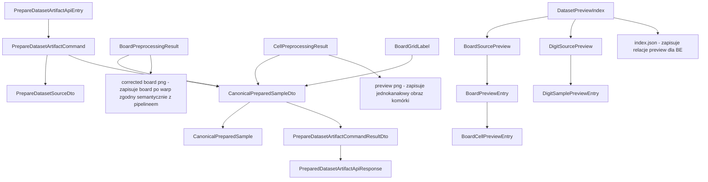
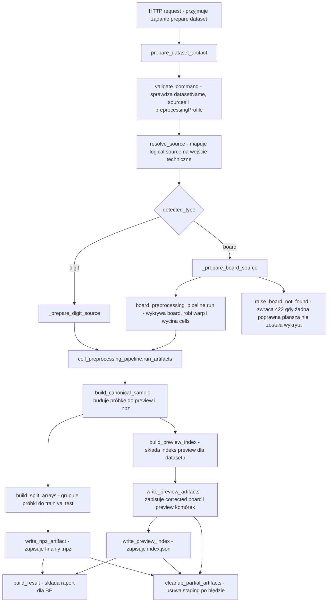

# UC-16 Refactor ML - Plan implementacyjny (`POST /ml/datasets/prepare`)

## 1. Przeznaczenie endpointa
- Endpoint wewnętrzny `BE -> ML` `POST /ml/datasets/prepare` pozostaje jedynym punktem wejścia po stronie `ML` dla przygotowania datasetu.
- W tej historyjce nie tworzymy nowego endpointu dla preview ani nowego endpointu do refaktoru board pipeline'u.
- Celem historyjki nie jest zmiana biznesowej roli endpointu z `UC-12`, tylko refaktor jego wnętrza tak, aby:
  - pipeline `board -> correctedBoard -> cells` był semantycznie spójny,
  - końcowy preprocessing komórki był wspólny dla `.npz`, preview, treningu i ewaluacji,
  - artefakty preview z wcześniejszego `UC-16` odzwierciedlały dokładnie to, co naprawdę trafia do `.npz`,
  - dla źródła typu `board` brak wykrytej planszy kończył się czytelnym błędem zgodnym z historyjką.

## 2. Źródła prawdy i materiały referencyjne
- Plan jest oparty przede wszystkim na:
  - `.ai/prd.md`,
  - `.ai/feature/ml/UC-16-refactor-ML.md`,
  - `.ai/feature/ml/uc-12.md`,
  - `.ai/feature/ml/uc-16.md`,
  - `.cursor/rules/architecture_ml.mdc`,
  - `.ai/DokumentacjaDeployuRuntimeSerwera.md`,
  - `.github/workflows/ml-cd.yml`.
- Plan nie wyprowadza zachowania z aktualnego `FE` ani `BE`.
- Plan respektuje istniejące kontrakty z wcześniejszych historyjek, zwłaszcza:
  - `UC-12` dla `POST /ml/datasets/prepare`,
  - `UC-06` dla konsumpcji przygotowanego `.npz`,
  - `UC-16` dla zapisu preview i indeksu.
- Materiałem analitycznym dla kierunku refaktoru jest `draft`, ale nie wolno go bezpośrednio importować jako zależności runtime. Dozwolone jest natomiast przeniesienie albo nawet skopiowanie w całości sprawdzonej logiki z `draft` do docelowych modułów `infrastructure`, jeśli po przeniesieniu zostanie ona:
  - osadzona w docelowej architekturze runtime,
  - nazwana zgodnie z konwencją produkcyjną,
  - objęta właściwymi testami i kontraktami warstw,
  - potraktowana jako kod produkcyjny, a nie eksperymentalny wrapper na `draft`:
  - `src/MachineLearning/draft/sudoku_board_threshold_experiment.ipynb`,
  - `src/MachineLearning/draft/sudoku_board_threshold_line_bridge.py`,
  - `src/MachineLearning/draft/sudoku_board_threshold_line_bridge_candidate.py`,
  - `src/MachineLearning/draft/sudoku_board_threshold_line_bridge_family.py`,
  - `src/MachineLearning/draft/sudoku_board_threshold_line_bridge_geometry.py`,
  - `src/MachineLearning/draft/sudoku_board_threshold_line_bridge_diagnostics.py`,
  - `src/MachineLearning/draft/sudoku_board_threshold_line_bridge_inspection.py`.

## 3. Założenia planu
- Refaktor dotyczy tylko części `ML`.
- `BE` pozostaje właścicielem workflow i `source of truth`.
- `ML` pozostaje usługą wewnętrzną i stateless z perspektywy systemowego stanu.
- Nie zmieniamy nazw istniejących klas, modeli HTTP i pól JSON, jeśli nie jest to absolutnie konieczne.
- Nie cofamy ani nie projektujemy historii pod aktualny stan kodu `FE` i `BE`; plan ma wynikać z dokumentów produktowych i reguł architektonicznych.
- Jednocześnie reuse'ujemy wszystko, co zostało już poprawnie dodane w `UC-12` i poprzednim `UC-16`, zamiast wprowadzać równoległe mechanizmy.

## 4. Główna decyzja architektoniczna
- Najważniejsza zmiana nie dotyczy kontraktu HTTP, tylko podziału odpowiedzialności wewnątrz `ML`.
- Obecnie `PrepareDatasetArtifactCommandHandler` trzyma w `Application` zbyt dużo szczegółów CV:
  - grayscale,
  - blur,
  - adaptive threshold,
  - detekcja board quad,
  - perspective warp,
  - extraction cells.
- To powinno zostać przeniesione do generycznego adaptera `Infrastructure`, ponieważ:
  - `Application` ma orkiestrwać use-case, a nie implementować techniczny pipeline OpenCV,
  - ten sam board pipeline będzie później reusable również w innych use-case'ach,
  - łatwiej wtedy pilnować spójności obrazu wejściowego do cięcia komórek i obrazu preview.
- W praktyce plan zakłada:
  - pozostawienie istniejących niskopoziomowych adapterów `Infrastructure`,
  - dodanie jednego wyższopoziomowego, generycznego pipeline'u boardowego,
  - uproszczenie `Application` tak, aby korzystała z jednego portu typu `BoardPreprocessingPipeline`.

## 5. Co już istnieje i co należy reuse'ować

### 5.1 Elementy już istniejące po `UC-12` i poprzednim `UC-16`
- `api/controllers/datasets_controller.py`
- `api/models/prepare_dataset_artifact_api_entry.py`
- `api/models/prepare_dataset_source_api_entry.py`
- `api/models/dataset_split_policy_api_entry.py`
- `api/models/split_ratios_api_entry.py`
- `api/models/prepared_dataset_artifact_api_response.py`
- `api/models/prepared_dataset_source_report_api_response.py`
- `api/models/split_sample_counts_api_response.py`
- `api/models/error_api_response.py`
- `application/features/datasets/commands/prepare_dataset_artifact/prepare_dataset_artifact_command.py`
- `application/features/datasets/commands/prepare_dataset_artifact/prepare_dataset_artifact_command_handler.py`
- `application/features/datasets/commands/prepare_dataset_artifact/prepare_dataset_artifact_command_result_dto.py`
- `application/features/datasets/dto/canonical_prepared_sample_dto.py`
- `application/features/datasets/dto/prepare_dataset_source_dto.py`
- `application/features/datasets/dto/dataset_split_policy_dto.py`
- `application/features/datasets/dto/prepared_dataset_source_report_dto.py`
- `application/features/datasets/dto/split_sample_counts_dto.py`
- `application/features/datasets/errors/dataset_preparation_errors.py`
- `models/canonical_prepared_sample.py`
- `models/dataset_preview_index.py`
- `models/board_grid_label.py`
- `models/cells_grid.py`
- `models/dataset_source_type.py`
- `models/dataset_split.py`
- `models/preprocessing_profile.py`
- `infrastructure/datasets/source_resolver.py`
- `infrastructure/datasets/board_dataset_scanner.py`
- `infrastructure/datasets/board_dat_parser.py`
- `infrastructure/datasets/idx_dataset_loader.py`
- `infrastructure/datasets/sample_split_assigner.py`
- `infrastructure/storage/npz_dataset_artifact_writer.py`
- `infrastructure/storage/dataset_preview_path_provider.py`
- `infrastructure/storage/filesystem_image_artifact_writer.py`
- `infrastructure/storage/dataset_preview_index_writer.py`
- `infrastructure/storage/dataset_preparation_artifact_cleanup.py`
- `infrastructure/storage/json_file_writer.py`
- `infrastructure/storage/temp_dataset_path_provider.py`
- `infrastructure/reporting/preparation_report_builder.py`
- `infrastructure/vision/cell_preprocessing_pipeline.py`
- `infrastructure/vision/opencv_grayscale_blur_preprocessor.py`
- `infrastructure/vision/opencv_adaptive_threshold_binarizer.py`
- `infrastructure/vision/opencv_largest_contour_detector.py`
- `infrastructure/vision/opencv_perspective_transformer.py`
- `infrastructure/vision/opencv_board_cells_extractor.py`

### 5.2 Wniosek reuse
- Nie należy tworzyć:
  - drugiego endpointu datasetowego,
  - drugiego mechanizmu preview,
  - drugiego loadera `IDX`,
  - drugiego parsera `.dat`,
  - drugiego writera `.npz`,
  - osobnego pipeline'u tylko dla preview.
- Brakuje natomiast jednego generycznego, wyższopoziomowego adaptera dla całego board pipeline'u. Tego adaptera obecnie nie ma i właśnie on powinien zostać dodany.

## 6. Kontrakt API `ML <-> BE`

### 6.1 Request
- Bez zmian względem `UC-12`.
- Nadal używamy:
  - `PrepareDatasetArtifactApiEntry`,
  - `PrepareDatasetSourceApiEntry`,
  - `DatasetSplitPolicyApiEntry`,
  - `SplitRatiosApiEntry`.

```json
{
  "datasetName": "sudokuDigitsV1",
  "preprocessingProfile": "default-28x28-v1",
  "sources": [
    {
      "name": "v1_training",
      "type": "board",
      "splitPolicy": {
        "mode": "selected",
        "groupBy": "board",
        "ratios": {
          "train": 0.5,
          "val": 0.5,
          "test": 0.0
        }
      }
    }
  ]
}
```

### 6.2 Response sukcesu
- Bez zmian względem `UC-12`.
- Nadal używamy `PreparedDatasetArtifactApiResponse`.
- Refaktor nie dodaje nowych pól do `200 OK`.

```json
{
  "sampleCounts": {
    "train": 9657,
    "val": 2657,
    "test": 1000
  },
  "sources": [
    {
      "name": "v1_training",
      "requestedType": "board",
      "detectedType": "board",
      "processedSampleCount": 8100,
      "includedSampleCount": 3314,
      "emptyCellCount": 4772,
      "rejectedSampleCount": 14,
      "warnings": []
    }
  ],
  "warnings": []
}
```

### 6.3 Response błędów
- Schemat błędu pozostaje bez zmian:
  - `ErrorApiResponse`,
  - pola `errorType`, `message`.
- Należy jednak doprecyzować mapowanie statusów:
  - `422 Unprocessable Content` dla błędów wejścia i jakości danych,
  - `500 Internal Server Error` dla błędów technicznych zapisu lub nieobsłużonych wyjątków.

### 6.4 Obowiązkowy przypadek `board_not_found`
- Ten przypadek musi zostać obsłużony jawnie zgodnie z historyjką.
- Jeśli dla źródła typu `board`:
  - istnieją pliki wejściowe, ale
  - nie uda się wykryć ani jednej poprawnej planszy Sudoku,
  - albo wszystkie kandydaty odpadną po walidacji, warp albo cięciu komórek,
  to endpoint zwraca:
  - status `422`,
  - `errorType = "board_not_found"`,
  - `message = "Nie udało się wykryć żadnej poprawnej planszy Sudoku w źródle board."`
- To nie jest `500`, bo wejście zostało przyjęte technicznie, ale nie dało się z niego wyprowadzić poprawnego artefaktu treningowego.

## 7. Model API wejściowy i wyjściowy w komunikacji z `BE`

### 7.1 Modele wejściowe
- `PrepareDatasetArtifactApiEntry`
  - `datasetName: string`
  - `preprocessingProfile: string`
  - `sources: PrepareDatasetSourceApiEntry[]`
- `PrepareDatasetSourceApiEntry`
  - `name: string`
  - `type: string` (`board` | `digit`)
  - `splitPolicy: DatasetSplitPolicyApiEntry`
- `DatasetSplitPolicyApiEntry`
  - `mode: string` (`mix` | `selected`)
  - `groupBy: string` (`board` | `sample`)
  - `ratios: SplitRatiosApiEntry`
- `SplitRatiosApiEntry`
  - `train: number`
  - `val: number`
  - `test: number`

### 7.2 Modele wyjściowe
- `PreparedDatasetArtifactApiResponse`
  - `sampleCounts: SplitSampleCountsApiResponse`
  - `sources: PreparedDatasetSourceReportApiResponse[]`
  - `warnings: string[]`
- `PreparedDatasetSourceReportApiResponse`
  - `name: string`
  - `requestedType: string`
  - `detectedType: string`
  - `processedSampleCount: number`
  - `includedSampleCount: number`
  - `emptyCellCount: number`
  - `rejectedSampleCount: number`
  - `warnings: string[]`
- `SplitSampleCountsApiResponse`
  - `train: number`
  - `val: number`
  - `test: number`
- `ErrorApiResponse`
  - `errorType: string`
  - `message: string`

## 8. Zachowanie warstwowe

### 8.1 API
- `API` pozostaje cienka.
- Odpowiada tylko za:
  - przyjęcie `PrepareDatasetArtifactApiEntry`,
  - mapowanie requestu do `PrepareDatasetArtifactCommand`,
  - wywołanie handlera,
  - mapowanie `PrepareDatasetArtifactCommandResultDto` do `PreparedDatasetArtifactApiResponse`,
  - mapowanie wyjątków aplikacyjnych na `ErrorApiResponse`.
- `API` nie:
  - wykonuje żadnej logiki OpenCV,
  - nie buduje board pipeline'u,
  - nie zapisuje plików preview,
  - nie składa `.npz`,
  - nie rozstrzyga splitów.

### 8.2 Application
- `Application` odpowiada za:
  - walidację use-case,
  - orkiestrację źródeł `board` i `digit`,
  - decyzję które próbki są włączane do `.npz`,
  - decyzję kiedy błąd jest krytyczny dla całego requestu,
  - budowę wyniku dla `BE`,
  - koordynację cleanupu przy błędzie.
- `Application` nie powinna już przechowywać technicznego przepływu:
  - `grayscale -> blur -> threshold -> detect -> warp -> cells`.
- Z punktu widzenia `Application` pipeline boardowy ma być jednym portem.

### 8.3 Domain / Models
- `Models` przechowuje neutralne modele domenowe i techniczne wyniki pośrednie, ale bez zależności od FastAPI i OpenCV.
- Reguły semantyczne pozostają:
  - dla `board`: `0 -> null`,
  - dla `digit`: `0` pozostaje legalną etykietą klasy,
  - preview komórki ma być tym samym obrazem, z którego powstaje dane do `.npz`.
- W tej historyjce do `Models` warto dodać nowe neutralne modele wyniku pipeline'u, zamiast trzymać je jako lokalne dataclassy w handlerze.

### 8.4 Infrastructure
- `Infrastructure` odpowiada za implementację techniczną:
  - wykrycie boarda,
  - korekcję perspektywy,
  - wycięcie komórek,
  - preprocessing pojedynczej komórki,
  - zapis preview,
  - zapis `index.json`,
  - zapis `.npz`.
- Jeśli dodajemy nową usługę, ma być:
  - generyczna,
  - wielokrotnego użytku,
  - niezwiązana wyłącznie z tym jednym endpointem.

## 9. Pliki per warstwa i odpowiedzialności

### 9.1 API (`src/MachineLearning/api`)
- `api/controllers/datasets_controller.py` - `update`
  - pozostaje kontrolerem `POST /ml/datasets/prepare`,
  - doprecyzować mapowanie wyjątków:
    - `422` dla błędów typu `board_not_found`, `dataset_source_invalid`, `no_samples_prepared`,
    - `500` dla błędów technicznych zapisu.
- `api/models/prepare_dataset_artifact_api_entry.py` - `reuse`
  - model requestu bez zmian kontraktu.
- `api/models/prepare_dataset_source_api_entry.py` - `reuse`
  - model pojedynczego źródła bez zmian.
- `api/models/dataset_split_policy_api_entry.py` - `reuse`
  - model polityki splitu bez zmian.
- `api/models/split_ratios_api_entry.py` - `reuse`
  - model udziałów splitu bez zmian.
- `api/models/prepared_dataset_artifact_api_response.py` - `reuse`
  - model sukcesu bez rozszerzania.
- `api/models/prepared_dataset_source_report_api_response.py` - `reuse`
  - raport źródła bez zmiany nazewnictwa.
- `api/models/split_sample_counts_api_response.py` - `reuse`
  - liczniki splitów bez zmian.
- `api/models/error_api_response.py` - `reuse`
  - ten sam model `{ errorType, message }`.
- `api/dependencies.py` - `update`
  - złożyć nowy wyższopoziomowy adapter boardowy do handlera,
  - nie wstrzykiwać już do handlera pięciu niskopoziomowych kroków CV osobno, jeśli powstanie generyczny pipeline boardowy.
- `api/config/runtime_settings.py` - `reuse/update only if needed`
  - jeśli refaktor da się zamknąć w istniejących parametrach preprocessingu, bez zmian,
  - jeśli potrzebne będą nowe parametry z draftu, dodać je tutaj.
- `api/config/environment.py` - `reuse/update only if needed`
  - dodać nowe zmienne tylko wtedy, gdy rzeczywiście pojawią się nowe ustawienia pipeline'u.
- `api/.env`, `api/.env.local`, `api/.env.production` - `reuse/update only if needed`
  - lokalnie wartości wpisane na sztywno,
  - produkcyjnie overlay utrzymywany przez workflow.

### 9.2 Application (`src/MachineLearning/application/features/datasets`)
- `commands/prepare_dataset_artifact/prepare_dataset_artifact_command.py` - `reuse`
  - komenda wejściowa bez zmiany kontraktu.
- `commands/prepare_dataset_artifact/prepare_dataset_artifact_command_handler.py` - `update`
  - to główne miejsce refaktoru w warstwie aplikacyjnej,
  - uprościć handler tak, aby:
    - orkiestrwał źródła,
    - korzystał z jednego portu `BoardPreprocessingPipeline`,
    - korzystał z jednego portu `CellPreprocessingPipeline`,
    - nie trzymał niskopoziomowej sekwencji OpenCV.
- `commands/prepare_dataset_artifact/prepare_dataset_artifact_command_result_dto.py` - `reuse`
  - wynik sukcesu bez zmiany kontraktu.
- `dto/prepare_dataset_source_dto.py` - `reuse`
  - DTO wejściowe źródła.
- `dto/dataset_split_policy_dto.py` - `reuse`
  - DTO polityki splitu.
- `dto/canonical_prepared_sample_dto.py` - `reuse`
  - obecny model próbek jest wystarczający; nie zmieniać nazwy ani pól bez potrzeby.
- `dto/prepared_dataset_source_report_dto.py` - `reuse`
  - DTO raportu źródła.
- `dto/split_sample_counts_dto.py` - `reuse`
  - DTO liczników splitów.
- `errors/dataset_preparation_errors.py` - `update`
  - dodać jawne typy błędów lub subklasy z informacją o statusie:
    - `board_not_found`,
    - `dataset_preview_write_failed`,
    - `dataset_preview_index_write_failed`,
    - `dataset_artifact_write_failed`.

### 9.3 Domain / Models (`src/MachineLearning/models`)
- `models/canonical_prepared_sample.py` - `reuse`
  - model próbki kanonicznej po unifikacji.
- `models/dataset_preview_index.py` - `reuse`
  - model indeksu preview pozostaje zgodny z wcześniejszym `UC-16`.
- `models/board_grid_label.py` - `reuse`
  - neutralny model etykiet planszy 9x9.
- `models/cells_grid.py` - `reuse`
  - neutralny model siatki komórek.
- `models/dataset_source_type.py` - `reuse`
  - `board`, `digit`, `boardDerived`.
- `models/dataset_split.py` - `reuse`
  - `train`, `val`, `test`.
- `models/preprocessing_profile.py` - `reuse`
  - profil preprocessingu, nadal związany z `default-28x28-v1`.
- `models/board_preprocessing_result.py` - `new`
  - neutralny wynik całego pipeline'u boardowego,
  - sugerowane pola:
    - `corrected_board_for_preview`,
    - `corrected_board_for_cell_extraction`,
    - `cells`.
- `models/cell_preprocessing_result.py` - `new`
  - neutralny wynik preprocessingu pojedynczej komórki,
  - sugerowane pola:
    - `preview_uint8`,
    - `training_float32`.

### 9.4 Infrastructure (`src/MachineLearning/infrastructure`)
- `infrastructure/datasets/source_resolver.py` - `reuse`
  - mapowanie `name + type` na wejście techniczne.
- `infrastructure/datasets/board_dataset_scanner.py` - `update`
  - zachować skanowanie par `.jpg + .dat`,
  - dopilnować, aby stabilny identyfikator planszy do logów i splitu bazował na `group_key`, a nie wyłącznie na `stem`, jeśli w zagnieżdżonych katalogach mogą wystąpić kolizje nazw.
- `infrastructure/datasets/board_dat_parser.py` - `reuse`
  - parser etykiet planszy bez zmiany odpowiedzialności.
- `infrastructure/datasets/idx_dataset_loader.py` - `reuse`
  - loader `digit` bez duplikacji.
- `infrastructure/datasets/sample_split_assigner.py` - `reuse`
  - deterministyczny split bez zmian kontraktu.
- `infrastructure/vision/cell_preprocessing_pipeline.py` - `update`
  - pozostaje wspólnym miejscem kanonicznego preprocessingu komórki,
  - dodać lub utrwalić jeden jawny kontrakt zwracający dwa artefakty z tej samej ścieżki:
    - preview `uint8`,
    - dane treningowe `float32`.
- `infrastructure/vision/opencv_grayscale_blur_preprocessor.py` - `reuse`
  - niskopoziomowy krok CV.
- `infrastructure/vision/opencv_adaptive_threshold_binarizer.py` - `reuse`
  - niskopoziomowy krok CV.
- `infrastructure/vision/opencv_largest_contour_detector.py` - `review/update only if gap is proven`
  - jeżeli obecna logika line-family jest zgodna z wnioskami z draftu, reuse,
  - jeżeli draft wymaga dodatkowego mostkowania linii albo innej walidacji, rozbudować ten adapter zamiast tworzyć drugi detector.
- `infrastructure/vision/opencv_perspective_transformer.py` - `reuse`
  - transformacja perspektywy jest generyczna; zmienia się to, jaki obraz do niej trafia.
- `infrastructure/vision/opencv_board_cells_extractor.py` - `reuse`
  - cięcie siatki komórek bez zmiany odpowiedzialności.
- `infrastructure/vision/opencv_board_preprocessing_pipeline.py` - `new`
  - nowy generyczny adapter wysokiego poziomu,
  - składa:
    - preprocess wejścia do detekcji,
    - detekcję boarda,
    - warp tej samej reprezentacji obrazu,
    - zwrot corrected board i komórek,
  - ma być reusable później także poza `POST /ml/datasets/prepare`.
- `infrastructure/storage/dataset_preview_path_provider.py` - `reuse`
  - nie zmieniać kontraktu preview, jeśli nie ma twardej potrzeby.
- `infrastructure/storage/filesystem_image_artifact_writer.py` - `reuse/review`
  - zachować generyczny zapis obrazów,
  - dopilnować, że zapis obrazu jednokanałowego nie wprowadza pseudo-kolorowania.
- `infrastructure/storage/dataset_preview_index_writer.py` - `reuse`
  - indeks preview bez zmiany struktury, jeśli nie jest to konieczne.
- `infrastructure/storage/dataset_preparation_artifact_cleanup.py` - `reuse`
  - cleanup częściowych artefaktów.
- `infrastructure/storage/npz_dataset_artifact_writer.py` - `reuse`
  - bez zmiany formatu `.npz`.
- `infrastructure/reporting/preparation_report_builder.py` - `reuse/update`
  - jeśli trzeba, dopisać czytelny warning agregujący przypadki odrzuconych boardów.

### 9.5 Testy (`src/MachineLearning/tests`)
- `tests/unit/test_prepare_dataset_artifact_command_handler.py` - `update`
  - dodać przypadki `board_not_found`,
  - dodać przypadki częściowo odrzuconych boardów,
  - dodać weryfikację, że preview i dane treningowe pochodzą z tej samej ścieżki.
- `tests/integration/test_datasets_controller.py` - `update`
  - dodać `422 board_not_found`,
  - utrzymać test `200` dla poprawnego przygotowania.
- `tests/unit/test_cell_preprocessing_pipeline.py` - `new or update`
  - test wspólnej semantyki `uint8 -> float32`.
- `tests/unit/test_opencv_board_preprocessing_pipeline.py` - `new`
  - test spójności corrected board, wykrycia boarda i ekstrakcji komórek.

## 10. Docelowe zachowanie wewnątrz ML
1. `API` odbiera `PrepareDatasetArtifactApiEntry`.
2. `Application` waliduje request i profil preprocessingu.
3. Dla każdego źródła `Application` rozwiązuje fizyczne wejście przez `DatasetSourceResolver`.
4. Dla `digit`:
   - `Infrastructure` ładuje rekordy z `IDX`,
   - każda próbka przechodzi przez wspólny `CellPreprocessingPipeline`,
   - preview i dane do `.npz` są budowane z tej samej ścieżki.
5. Dla `board`:
   - `Infrastructure` skanuje pary `.jpg + .dat`,
   - parser czyta grid etykiet,
   - nowy `BoardPreprocessingPipeline` przygotowuje corrected board i komórki z tej samej reprezentacji obrazu,
   - każda komórka przechodzi przez ten sam `CellPreprocessingPipeline`,
   - preview corrected board oraz preview komórek odpowiadają temu, co było użyte w pipeline'ie.
6. `Application` buduje listę `CanonicalPreparedSampleDto`.
7. `Application` filtruje próbki nadzorowane do `.npz`.
8. `Infrastructure` zapisuje preview, indeks preview i `.npz`.
9. Przy błędzie `Application` uruchamia cleanup.
10. `API` zwraca sukces albo `ErrorApiResponse`.

## 11. Szczególna logika i pseudokod

### 11.1 Najważniejsza reguła
- Obraz po korekcji perspektywy używany do cięcia komórek musi być semantycznie tą samą reprezentacją, na podstawie której wykryto planszę.
- Niedopuszczalny jest wariant:
  - detekcja na obrazie binarnym,
  - warp na obrazie kolorowym,
  - komórki wycinane z innej reprezentacji niż ta, którą wykorzystała detekcja.

### 11.2 Pseudokod dla źródła `board`
```python
def prepare_board_source(source_name, split_policy, source_path):
    board_pairs = board_dataset_scanner.scan_pairs(source_path)
    prepared_samples = []
    board_previews = []
    board_success_count = 0
    rejected_board_count = 0
    warnings = []

    for board_pair in board_pairs:
        split = sample_split_assigner.assign_split(
            split_policy=split_policy,
            stable_key=board_pair.group_key,
        )

        try:
            label_grid = board_dat_parser.parse(board_pair.label_path)
            source_image = load_board_image(board_pair.image_path)
            board_result = board_preprocessing_pipeline.run(source_image)
        except ValueError as error:
            rejected_board_count += 1
            warnings.append(f"Pominięto planszę {board_pair.group_key}: {error}")
            continue

        board_success_count += 1
        save_corrected_board_preview(board_result.corrected_board_for_preview)

        for cell_index, cell_image in enumerate(board_result.cells):
            raw_label = label_grid.flatten()[cell_index]
            normalized_label = None if raw_label == 0 else raw_label

            cell_result = cell_preprocessing_pipeline.run_artifacts(cell_image)
            save_cell_preview(cell_result.preview_uint8)

            prepared_samples.append(
                build_canonical_sample(
                    split=split,
                    label=normalized_label,
                    preview_uint8=cell_result.preview_uint8,
                    training_float32=cell_result.training_float32,
                )
            )

    if board_success_count == 0:
        raise BoardNotFoundError(
            "Nie udało się wykryć żadnej poprawnej planszy Sudoku w źródle board."
        )

    return prepared_samples, warnings
```

### 11.3 Pseudokod dla preprocessingu pojedynczej komórki
```python
def run_artifacts(cell_image):
    foreground_mask = build_foreground_mask(cell_image)
    preview_uint8 = center_and_resize(foreground_mask)
    training_float32 = normalize_to_float32(preview_uint8)
    return CellPreprocessingResult(
        preview_uint8=preview_uint8,
        training_float32=training_float32,
    )
```

### 11.4 Pseudokod dla krytycznego przypadku `board_not_found`
```python
if requested_type == "board" and valid_detected_boards_count == 0:
    raise PrepareDatasetArtifactCommandError(
        error_type="board_not_found",
        message="Nie udało się wykryć żadnej poprawnej planszy Sudoku w źródle board.",
    )
```

## 12. Główne funkcje i komponenty
- `PrepareDatasetArtifactCommandHandler.handle()` - główna orkiestracja use-case'u.
- `PrepareDatasetArtifactCommandHandler._prepare_board_source()` - obsługa pojedynczego źródła `board`.
- `PrepareDatasetArtifactCommandHandler._prepare_digit_source()` - obsługa pojedynczego źródła `digit`.
- `OpenCvBoardPreprocessingPipeline.run()` - pełny pipeline dla planszy: detekcja, warp, extraction.
- `CellPreprocessingPipeline.run_artifacts()` - wspólny wynik `preview_uint8 + training_float32`.
- `CellPreprocessingPipeline.build_foreground_mask()` - budowa maski foregroundu dla komórki.
- `DatasetSourceResolver.resolve()` - mapowanie logicznego źródła na wejście techniczne.
- `BoardDatasetScanner.scan_pairs()` - rekurencyjne wykrycie par `.jpg + .dat`.
- `BoardDatParser.parse()` - odczyt gridu 9x9.
- `IdxDatasetLoader.load()` - odczyt rekordów `digit`.
- `SampleSplitAssigner.assign_split()` - deterministyczne przypisanie splitu.
- `DatasetPreviewIndexWriter.write()` - zapis indeksu preview.
- `FilesystemImageArtifactWriter.write()` - zapis obrazów preview.
- `NpzDatasetArtifactWriter.write()` - zapis `.npz`.
- `DatasetPreparationArtifactCleanup.cleanup()` - cleanup częściowych artefaktów.

## 13. Wyjątki, fallbacki i zachowanie przy błędach

### 13.1 Błędy `422`
- `raw_dataset_not_found`
  - źródło wskazane przez `BE` nie istnieje.
- `raw_dataset_type_mismatch`
  - wykryty typ wejścia nie zgadza się z deklaracją.
- `dataset_source_invalid`
  - uszkodzony `.dat`, niepełne pary, błędny `IDX`.
- `unsupported_preprocessing_profile`
  - nieznany profil preprocessingu.
- `no_samples_prepared`
  - po filtracji nie powstała żadna próbka nadzorowana.
- `board_not_found`
  - nie udało się wykryć ani jednej poprawnej planszy w źródle `board`.

### 13.2 Błędy `500`
- `dataset_preview_write_failed`
  - nie udało się zapisać obrazu preview.
- `dataset_preview_index_write_failed`
  - nie udało się zapisać `index.json`.
- `dataset_artifact_write_failed`
  - nie udało się zapisać `.npz`.
- `internal_server_error`
  - nieobsłużony błąd techniczny.

### 13.3 Fallbacki kontrolowane
- Jeśli pojedyncza plansza jest uszkodzona albo nie przejdzie detekcji:
  - odrzucić tylko tę planszę,
  - dodać warning,
  - kontynuować źródło dalej.
- Jeśli część plansz jest poprawna, a część odpada:
  - request nadal może zakończyć się sukcesem.
- Jeśli wszystkie plansze odpadną:
  - zwrócić `board_not_found`.
- Jeśli pojedyncza próbka `digit` nie przejdzie preprocessingu:
  - odrzucić tylko tę próbkę,
  - policzyć ją do `rejectedSampleCount`,
  - kontynuować przetwarzanie źródła.
- Jeśli nie uda się zapisać preview albo `.npz`:
  - przerwać cały request,
  - uruchomić cleanup,
  - nie zwracać pozornego sukcesu.

### 13.4 Cleanup
- Cleanup pozostaje `best-effort`.
- Czyścić:
  - staging preview,
  - docelowy katalog preview dla datasetu, jeśli zdążył zostać utworzony,
  - częściowy `.npz`.
- Błąd cleanupu logować, ale nie przykrywać nim błędu głównego.

## 14. Logging i diagnostyka
- Logi mają pomagać w diagnozie, ale nie mogą spamować.

### 14.1 Co logować na `INFO`
- start requestu:
  - `datasetName`,
  - liczba źródeł,
  - `preprocessingProfile`;
- koniec requestu:
  - `sampleCounts`,
  - liczba źródeł zakończonych sukcesem,
  - liczba odrzuconych plansz i próbek;
- podsumowanie per source:
  - `sourceName`,
  - `requestedType`,
  - `detectedType`,
  - `includedSampleCount`,
  - `rejectedSampleCount`.

### 14.2 Co logować na `WARNING`
- częściowo odrzucone plansze `board`,
- częściowo odrzucone próbki `digit`,
- cleanup failure.

### 14.3 Co logować na `ERROR`
- brak możliwości zapisu preview,
- brak możliwości zapisu indeksu preview,
- brak możliwości zapisu `.npz`,
- nieobsłużony wyjątek requestu.

### 14.4 Guardrail logowania
- Nie logować:
  - surowych obrazów,
  - macierzy NumPy,
  - jednej linii na każdą komórkę,
  - całych payloadów requestu.
- Dla dużych datasetów warningi per board należy agregować:
  - pełne szczegóły dla pierwszych kilku przypadków,
  - dalej tylko licznik i skrót.

## 15. Workflow GitHub, deploy i konfiguracja runtime

### 15.1 Wyraźne uwzględnienie deployu i workflow
- Ten plan został przygotowany jawnie z uwzględnieniem:
  - `.ai/DokumentacjaDeployuRuntimeSerwera.md`,
  - `.github/workflows/ml-cd.yml`,
  - reguły `architecture_ml`.
- Oznacza to:
  - `ML` działa z `api/.env` oraz `api/.env.{environment}`,
  - `ML_ENVIRONMENT=production` jest ustawiane przez workflow,
  - `local` pozostaje konfigurowany "na sztywno" w `api/.env.local`,
  - workflow zmienia tylko konfigurację produkcyjną release'u,
  - nie budujemy drugiego systemu konfiguracji poza `.env*`.

### 15.2 Co z workflow trzeba zrobić
- Jeśli refaktor zmieści się w istniejącym zestawie parametrów preprocessingu:
  - nie ma potrzeby zmiany `.github/workflows/ml-cd.yml`.
- Jeśli okaże się, że draft wymaga nowych parametrów runtime, np.:
  - dodatkowego progu walidacji linii,
  - dodatkowego parametru bridge/merge,
  - dodatkowego trybu corrected board,
  wtedy trzeba zaktualizować:
  - `api/config/runtime_settings.py`,
  - `api/config/environment.py`,
  - `api/.env`,
  - `api/.env.local`,
  - `api/.env.production`,
  - oraz pośrednio workflow `ml-cd.yml`, bo to on przygotowuje produkcyjny release z `ML_ENVIRONMENT=production`.

### 15.3 Reguła local vs production
- `local`
  - wartości wpisane na sztywno w `api/.env.local`.
- `production`
  - wartości utrzymywane w `api/.env.production`,
  - workflow przygotowuje release tak, aby runtime załadował ten overlay.

### 15.4 Czego nie robić
- Nie zapisywać runtime state w katalogu release.
- Nie hardcodować ścieżek serwerowych w kodzie.
- Nie zmieniać mechanizmu deployu tylko po to, by obsłużyć refaktor logiki obrazu.

## 16. Zależności między historyjkami
- `UC-04`
  - ważny jako wcześniejszy pipeline preprocessingu board/cells,
  - refaktor powinien reuse'ować i porządkować logikę, a nie tworzyć osobny świat dla datasetów.
- `UC-05A`
  - ważny przez wspólną semantykę preprocessingu pojedynczej komórki,
  - jeśli `default-28x28-v1` pozostaje tym samym profilem, nie wolno go rozjechać pomiędzy inferencją a datasetem.
- `UC-06`
  - zależy od formatu `.npz`,
  - format `.npz` i `preprocessingProfile` muszą pozostać kompatybilne.
- `UC-11`
  - dostarcza logiczne `name/type`,
  - nie zmienia się po stronie `ML`.
- `UC-12`
  - baza dla tego endpointu,
  - ten refaktor nie zastępuje `UC-12`, tylko porządkuje jego środek.
- poprzedni `UC-16`
  - dostarczył preview i indeks preview,
  - nie projektować ich od nowa, tylko utrzymać i zasilić poprawniejszym pipeline'em.
- `UC-13`
  - autoryzacja pozostaje po stronie `BE`, bez zmian dla `ML`.

## 17. Kolejność implementacji
1. Ustalić i zapisać decyzję, że kontrakt HTTP pozostaje bez zmian.
2. Dodać w `errors/dataset_preparation_errors.py` jawny przypadek `board_not_found` oraz rozdział błędów `422` vs `500`.
3. Dodać neutralne modele:
   - `models/board_preprocessing_result.py`,
   - `models/cell_preprocessing_result.py`.
4. Dodać generyczny adapter `infrastructure/vision/opencv_board_preprocessing_pipeline.py`.
5. Zrefaktoryzować `CellPreprocessingPipeline`, aby udostępniał jeden kontrakt zwracający artefakty `uint8 + float32` z tej samej ścieżki.
6. Uprościć `PrepareDatasetArtifactCommandHandler`, aby korzystał z wysokopoziomowego pipeline'u boardowego.
7. Doprecyzować zachowanie dla `board_not_found`.
8. Jeśli potrzeba, doprecyzować `BoardDatasetScanner` pod kątem stabilnego identyfikatora planszy.
9. Zaktualizować `api/dependencies.py`, żeby wstrzykiwać nowy adapter.
10. Dodać testy jednostkowe i integracyjne.
11. Dopiero na końcu zdecydować, czy potrzebne są nowe zmienne `.env` i zmiany w workflow.

## 18. Guardraile implementacyjne
- Nie zmieniać nazw:
  - `PrepareDatasetArtifactApiEntry`,
  - `PreparedDatasetArtifactApiResponse`,
  - `PrepareDatasetArtifactCommand`,
  - `PrepareDatasetArtifactCommandResultDto`,
  - istniejących pól JSON.
- Nie dodawać nowego endpointu typu `POST /ml/datasets/prepare-preview`.
- Nie przenosić logiki OpenCV do `Application`.
- Nie importować `draft` bezpośrednio do runtime.
- Wolno skopiować albo przenieść logikę z `draft` do docelowego kodu `Infrastructure`, również w dużych fragmentach lub w całości, jeśli po przeniesieniu staje się ona normalnym kodem produkcyjnym utrzymywanym już poza `draft`.
- Nie tworzyć drugiego pipeline'u komórki tylko dla preview.
- Nie zmieniać formatu `.npz`.
- Nie zmieniać semantyki:
  - `board: 0 -> null`,
  - `digit: 0` pozostaje legalną klasą.
- Nie traktować `board_not_found` jako sukcesu z warningiem.
- Nie logować per-komórka przy dużych datasetach.
- Nie hardcodować ścieżek runtime ani parametrów produkcyjnych w kodzie.

## 19. Inne istotne reguły
- Payloady HTTP pozostają w `camelCase`.
- Modele HTTP mają suffix `ApiEntry` i `ApiResponse`.
- DTO aplikacyjne zachowują suffix `Dto`.
- `Application` ma orkiestrwać logikę use-case, a nie wykonywać operacje obrazu.
- `Infrastructure` implementuje technikę, ale nie staje się właścicielem workflow biznesowego.
- Jeśli w nested folderach `board` występują dwa pliki o tym samym `stem`, stabilny identyfikator techniczny musi opierać się na `group_key`, aby uniknąć kolizji preview, logów i splitu.
- Jeśli kiedyś zmieni się semantyka `correctedBoard`, należy to zrobić jawnie przez nową wersję kontraktu wewnętrznego albo nowy model, a nie przez cichą zmianę znaczenia istniejącego pola.
- Jeśli okaże się, że nowa recepta preprocessingu komórki zmienia realnie dane wejściowe modelu, należy rozważyć bump `preprocessingProfile` zamiast podmiany znaczenia `default-28x28-v1` bez wersjonowania.

## 20. Plan testów minimum

### 20.1 Unit
- `CellPreprocessingPipeline`
  - `preview_uint8` i `training_float32` pochodzą z tej samej ścieżki,
  - wynik końcowy jest jednokanałowy.
- `OpenCvBoardPreprocessingPipeline`
  - wejście do warpu i wejście do ekstrakcji komórek mają tę samą semantykę,
  - corrected board nie wraca do kolorowego obrazu bez jawnej decyzji.
- `PrepareDatasetArtifactCommandHandler`
  - częściowo uszkodzone boardy są odrzucane, ale request kończy się sukcesem, jeśli istnieją poprawne boardy,
  - jeśli wszystkie boardy odpadną, zwracany jest `board_not_found`,
  - preview i `.npz` zapisują spójne dane,
  - cleanup działa przy błędzie zapisu.

### 20.2 Integration
- `POST /ml/datasets/prepare` dla poprawnego `digit` kończy się `200`.
- `POST /ml/datasets/prepare` dla poprawnego `board` kończy się `200`.
- `POST /ml/datasets/prepare` dla `board`, w którym nie wykryto żadnej poprawnej planszy, kończy się `422` z `board_not_found`.
- `POST /ml/datasets/prepare` dla błędu technicznego zapisu kończy się `500`.
- Preview corrected board i preview komórek odpowiadają danym wykorzystanym do `.npz`.

## 21. Mermaid - flowchart modeli


## 22. Mermaid - flowchart logiki aplikacji


## 23. Finalna rekomendacja
- Ten refaktor należy zrealizować jako porządne przesunięcie technicznego pipeline'u boardowego z `Application` do generycznego adaptera `Infrastructure`.
- Najbezpieczniejszy wariant:
  - nie zmieniać kontraktu HTTP,
  - zostawić istniejący mechanizm preview z wcześniejszego `UC-16`,
  - poprawić semantykę corrected board i preprocessingu komórek pod spodem,
  - dodać jawny przypadek `board_not_found`,
  - nie ruszać workflow GitHub, jeśli refaktor mieści się w obecnym zestawie konfiguracji.
