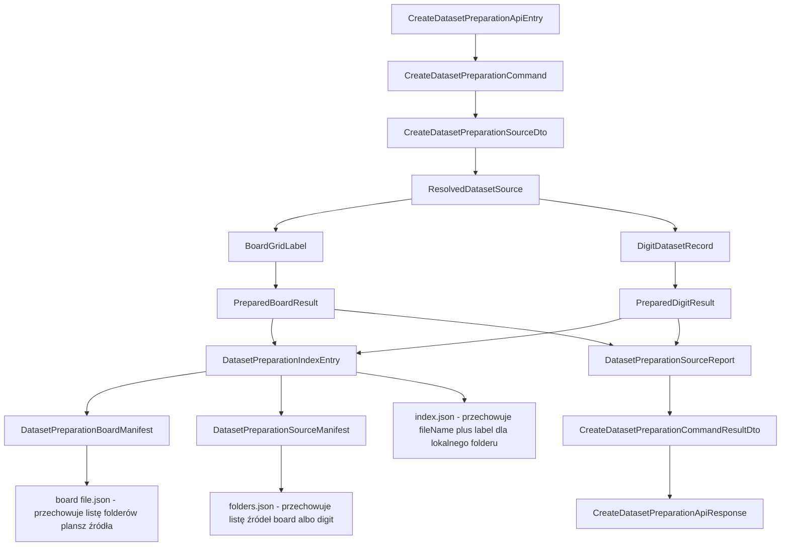
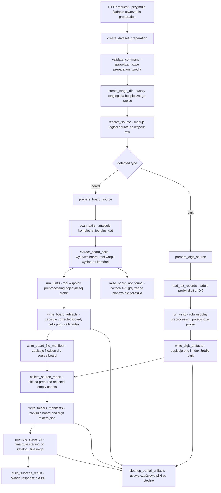

# UC-17 ML - Plan implementacyjny (`POST /ml/datasets/preparations`)

## 1. Przeznaczenie endpointa
- Endpoint wewnętrzny `POST /ml/datasets/preparations` jest wywoływany tylko przez `Backend`.
- Jego celem jest wykonanie ciężkiego preprocessingu danych `raw` i zapisanie trwałej struktury `preparation`, która stanie się wejściem dla `UC-18` i `UC-19`.
- Endpoint nie buduje finalnego `.npz`.
- Endpoint nie jest publiczny dla `Frontendu`.
- `ML` zapisuje tylko techniczne artefakty procesu:
  - `board/folders.json`,
  - `board/{sourceName}/file.json`,
  - `board/{sourceName}/{boardFolderName}/corrected-board.png`,
  - `board/{sourceName}/{boardFolderName}/cells/index.json`,
  - `board/{sourceName}/{boardFolderName}/cells/*.png`,
  - `digit/folders.json`,
  - `digit/{sourceName}/index.json`,
  - `digit/{sourceName}/*.png`.
- `Backend` pozostaje `source of truth` dla statusów `queued/running/completed/failed`; po stronie `ML` ten endpoint jest synchronicznym wykonaniem jednego zadania technicznego uruchomionego już w tle przez `BE`.

## 2. Główne założenia planu
- Plan dotyczy wyłącznie części `ML`.
- Plan bazuje na:
  - `.ai/prd.md`,
  - `.ai/feature/uc-17-overview.md`,
  - `.cursor/rules/architecture_ml.mdc`,
  - `.ai/DokumentacjaDeployuRuntimeSerwera.md`,
  - kontraktach i ograniczeniach z wcześniejszych historyjek, szczególnie `UC-06`, `UC-11`, `UC-12`, `UC-16`, `UC-18`, `UC-19`.
- Nie projektujemy rozwiązania pod aktualny stan `FE` ani `BE`, poza respektowaniem wcześniej ustalonych kontraktów.
- `Application` odpowiada za walidację use-case i orkiestrację.
- `Infrastructure` odpowiada za filesystem, OpenCV, odczyt źródeł, zapis obrazów i zapis manifestów.
- `Models` przechowuje neutralne modele domenowe i techniczne bez zależności od HTTP.
- `API` pozostaje cienkie.
- Nie wolno psuć istniejących nazw klas i pól z wcześniejszych historyjek; nowe elementy dodajemy obok istniejących.

## 3. Kontrakt `BE -> ML`

### 3.1 Request
- Payload musi odpowiadać kontraktowi z overview i planu `BE`.
- Po stronie `ML` modele HTTP nadal powinny używać suffixów `ApiEntry/ApiResponse`, ale pola JSON muszą pozostać zgodne z kontraktem.

Przykładowy request:

```json
{
  "preparationName": "preparation-001",
  "sources": [
    {
      "name": "v1_training",
      "type": "board"
    },
    {
      "name": "mnist_train",
      "type": "digit"
    }
  ]
}
```

### 3.2 Response `200 OK`
- `ML` zwraca finalny techniczny wynik wykonania.
- `status` w odpowiedzi `ML` ma znaczenie kontraktowe, ale nie jest systemowym `source of truth`; tym pozostaje `BE`.
- Przy sukcesie `status` powinien być zwracany jako `completed`.

Przykładowa odpowiedź:

```json
{
  "preparationName": "preparation-001",
  "createdAtUtc": "2026-06-19T19:42:11Z",
  "status": "completed",
  "sourceReports": [
    {
      "name": "v1_training",
      "type": "board",
      "preparedItemsCount": 3314,
      "rejectedItemsCount": 14,
      "emptyCellCount": 4772
    },
    {
      "name": "mnist_train",
      "type": "digit",
      "preparedItemsCount": 51234,
      "rejectedItemsCount": 2,
      "emptyCellCount": 5210
    }
  ],
  "warnings": []
}
```

### 3.3 Response błędów
- `422 Unprocessable Content`
  - błędne źródło,
  - brak danych,
  - niezgodność typu,
  - uszkodzony `.dat`,
  - uszkodzony `IDX`,
  - wszystkie boardy odpadły,
  - niedozwolona nazwa przygotowania,
  - konflikt struktury wejścia.
- `500 Internal Server Error`
  - błąd zapisu plików,
  - błąd finalizacji stagingu,
  - nieobsłużony wyjątek.

`ErrorApiResponse`:

```json
{
  "errorType": "board_not_found",
  "message": "Nie udało się wykryć żadnej poprawnej planszy Sudoku w źródle board."
}
```

## 4. Model API wejściowy i wyjściowy w komunikacji z `BE`

### 4.1 Modele wejściowe
- `CreateDatasetPreparationApiEntry`
  - `preparationName: string`
  - `sources: CreateDatasetPreparationSourceApiEntry[]`
- `CreateDatasetPreparationSourceApiEntry`
  - `name: string`
  - `type: string` (`board` | `digit`)

### 4.2 Modele wyjściowe
- `CreateDatasetPreparationApiResponse`
  - `preparationName: string`
  - `createdAtUtc: string`
  - `status: string`
  - `sourceReports: DatasetPreparationSourceReportApiResponse[]`
  - `warnings: string[]`
- `DatasetPreparationSourceReportApiResponse`
  - `name: string`
  - `type: string`
  - `preparedItemsCount: number`
  - `rejectedItemsCount: number`
  - `emptyCellCount: number`
- `ErrorApiResponse`
  - `errorType: string`
  - `message: string`

## 5. Zachowanie warstwowe

### 5.1 API
- Przyjmuje request HTTP i mapuje go do komendy aplikacyjnej.
- Nie wykonuje preprocessingu obrazów.
- Nie zapisuje plików.
- Nie rozwiązuje ścieżek katalogów `raw`.
- Nie buduje manifestów `folders.json`, `file.json`, `index.json`.
- Mapuje wyjątki aplikacyjne na `422`.
- Mapuje błędy techniczne na `500`.

### 5.2 Application
- Waliduje `preparationName` i listę źródeł.
- Rozstrzyga, które istniejące adaptery trzeba wywołać dla `board` i `digit`.
- Decyduje:
  - jakie elementy są akceptowane,
  - jakie elementy są odrzucane,
  - które komórki są puste,
  - jakie warningi mają wrócić do `BE`,
  - kiedy request ma zakończyć się błędem globalnym.
- Nie wykonuje bezpośrednio operacji OpenCV.
- Nie zapisuje bezpośrednio JSON-ów i obrazów.
- Nie zna detali `Path.mkdir`, `replace`, `write_bytes`, `cv2.imwrite`.

### 5.3 Domain / Models
- Trzyma neutralne modele:
  - typu źródła,
  - statusu przygotowania,
  - wpisu `index.json`,
  - raportu per source,
  - wyniku przygotowania pojedynczej planszy,
  - wyniku przygotowania pojedynczego źródła.
- Nie zawiera modeli HTTP.
- Nie zna FastAPI ani Pydantic.

### 5.4 Infrastructure
- Rozwiązuje źródła `raw`.
- Odczytuje pary `.jpg + .dat`.
- Odczytuje pary `IDX`.
- Wykonuje detekcję boarda, korekcję perspektywy, ekstrakcję komórek i preprocessing komórki.
- Zapisuje PNG i JSON.
- Buduje staging i finalizuje katalog przygotowania.
- Czyści częściowe artefakty po błędzie.

## 6. Co już istnieje i musi zostać reuse'owane

### 6.1 Reuse bez duplikacji
- `src/MachineLearning/infrastructure/datasets/source_resolver.py`
  - istniejące mapowanie `sourceName + type -> fizyczne raw source`.
- `src/MachineLearning/infrastructure/datasets/board_dataset_scanner.py`
  - istniejące wykrywanie kompletnych par `.jpg + .dat`.
- `src/MachineLearning/infrastructure/datasets/board_dat_parser.py`
  - istniejący parser etykiet planszy.
- `src/MachineLearning/infrastructure/datasets/idx_dataset_loader.py`
  - istniejący loader `IDX`.
- `src/MachineLearning/infrastructure/vision/cell_preprocessing_pipeline.py`
  - istniejący wspólny preprocessing pojedynczej próbki.
- `src/MachineLearning/infrastructure/vision/engine_board_dataset_cell_extractor.py`
  - istniejąca ekstrakcja `corrected board + 9x9 cells`.
- `src/MachineLearning/infrastructure/storage/json_file_writer.py`
  - istniejący atomowy zapis JSON.
- `src/MachineLearning/infrastructure/storage/filesystem_image_artifact_writer.py`
  - istniejący atomowy zapis obrazu.
- `src/MachineLearning/infrastructure/time/system_utc_clock.py`
  - istniejące źródło czasu UTC.

### 6.2 Reuse warunkowy, nie 1:1
- `src/MachineLearning/application/features/datasets/commands/prepare_dataset_artifact/prepare_dataset_artifact_command_handler.py`
  - nie wolno go użyć jako handlera docelowego `UC-17`,
  - można z niego wyciągnąć wspólne reguły walidacji i liczenia raportów,
  - nie wolno kopiować semantyki budowy `.npz` ani starego preview.
- `src/MachineLearning/infrastructure/storage/dataset_preview_path_provider.py`
  - nie nadaje się jako docelowy provider dla `preparation`,
  - można reuse'ować wzorzec stagingu i finalizacji katalogu.
- `src/MachineLearning/models/dataset_preview_index.py`
  - to model starego preview z poprzedniego workflow,
  - nie jest docelowym modelem `UC-17`.
- `src/MachineLearning/infrastructure/storage/dataset_preview_index_writer.py`
  - nie jest writerem dla nowej struktury `folders.json/file.json/index.json`.

### 6.3 Wniosek
- Nie tworzymy duplikatów `source_resolver`, `board_dataset_scanner`, `board_dat_parser`, `idx_dataset_loader`, `cell_preprocessing_pipeline`, `json_file_writer`, `filesystem_image_artifact_writer`.
- Tworzymy nowe adaptery tylko tam, gdzie obecny kod jest specyficzny dla starego preview albo dla bezpośredniej budowy `.npz`.

## 7. Pliki per warstwa i odpowiedzialności

### 7.1 API (`src/MachineLearning/api`)
- `[UPDATE]` `api/controllers/datasets_controller.py`
  - dodać `POST /ml/datasets/preparations`,
  - zostawić istniejące `POST /ml/datasets/prepare`,
  - mapować nowe wyjątki `UC-17`.
- `[NEW]` `api/models/create_dataset_preparation_api_entry.py`
  - model requestu HTTP.
- `[NEW]` `api/models/create_dataset_preparation_source_api_entry.py`
  - model pojedynczego źródła wejściowego.
- `[NEW]` `api/models/create_dataset_preparation_api_response.py`
  - model odpowiedzi sukcesu.
- `[NEW]` `api/models/dataset_preparation_source_report_api_response.py`
  - model raportu per source.
- `[REUSE]` `api/models/error_api_response.py`
  - wspólny model błędu `{ errorType, message }`.
- `[UPDATE]` `api/dependencies.py`
  - złożyć nowy handler i nowe adaptery storage/preparation.
- `[UPDATE]` `api/config/runtime_settings.py`
  - dodać `dataset_preparations_directory_path`.
- `[UPDATE]` `api/config/environment.py`
  - odczyt `ML_DATASET_PREPARATIONS_DIRECTORY_PATH`.
- `[UPDATE]` `api/.env`
  - baza konfiguracji runtime.
- `[UPDATE]` `api/.env.local`
  - lokalna ścieżka wpisana na sztywno.
- `[UPDATE]` `api/.env.production`
  - produkcyjna ścieżka dostarczana przez workflow.

### 7.2 Application (`src/MachineLearning/application`)
- `[NEW]` `application/features/datasets/commands/create_dataset_preparation/create_dataset_preparation_command.py`
  - komenda use-case.
- `[NEW]` `application/features/datasets/commands/create_dataset_preparation/create_dataset_preparation_command_handler.py`
  - główna orkiestracja `UC-17`.
- `[NEW]` `application/features/datasets/commands/create_dataset_preparation/create_dataset_preparation_command_result_dto.py`
  - wynik przekazywany do `API`.
- `[NEW]` `application/features/datasets/dto/create_dataset_preparation_source_dto.py`
  - DTO wejściowego source.
- `[NEW]` `application/features/datasets/dto/dataset_preparation_source_report_dto.py`
  - DTO raportu per source.
- `[NEW]` `application/features/datasets/dto/dataset_preparation_item_index_entry_dto.py`
  - DTO wpisu `fileName + label` dla lokalnych indeksów.
- `[NEW]` `application/features/datasets/dto/prepared_board_artifact_dto.py`
  - DTO pojedynczej poprawnej planszy po ekstrakcji.
- `[NEW]` `application/features/datasets/dto/prepared_digit_artifact_dto.py`
  - DTO pojedynczej próbki `digit` gotowej do zapisu.
- `[NEW]` `application/features/datasets/ports/dataset_preparation_ports.py`
  - porty/protocols dla source resolvera, ekstraktora boardów, writera artefaktów, zegara UTC.
- `[UPDATE]` `application/features/datasets/errors/dataset_preparation_errors.py`
  - dopisać błędy specyficzne dla `UC-17`.
- `[REUSE]` `application/features/datasets/dto/prepared_dataset_source_report_dto.py`
  - jeśli obecny shape pasuje 1:1 do raportu `UC-17`, można reuse'ować zamiast dublować,
  - jeśli nie pasuje nazwa semantyczna, lepiej dodać osobne DTO tylko dla `UC-17` bez ruszania starego.

### 7.3 Domain / Models (`src/MachineLearning/models`)
- `[REUSE]` `models/board_grid_label.py`
  - neutralny grid etykiet planszy 9x9.
- `[REUSE]` `models/dataset_source_type.py`
  - typ źródła `board` / `digit`; w `UC-17` nie używać `boardDerived` w kontrakcie zewnętrznym.
- `[NEW]` `models/dataset_preparation_status.py`
  - `completed` jako status odpowiedzi `ML`.
- `[NEW]` `models/dataset_preparation_index_entry.py`
  - neutralny wpis `fileName + label`.
- `[NEW]` `models/dataset_preparation_board_manifest.py`
  - neutralny model listy `file.json`.
- `[NEW]` `models/dataset_preparation_source_manifest.py`
  - neutralny model listy `folders.json`.
- `[NEW]` `models/dataset_preparation_source_report.py`
  - neutralny raport per source.
- `[NEW]` `models/prepared_board_result.py`
  - wynik jednej przetworzonej planszy: `boardFolderName`, `correctedBoard`, `cellsEntries`.
- `[NEW]` `models/prepared_digit_result.py`
  - wynik jednego źródła `digit`: lista zapisanych próbek i liczników.

### 7.4 Infrastructure (`src/MachineLearning/infrastructure`)
- `[REUSE]` `infrastructure/datasets/source_resolver.py`
  - wejściowe rozwiązanie source.
- `[REUSE]` `infrastructure/datasets/board_dataset_scanner.py`
  - skanowanie par `.jpg + .dat`.
- `[REUSE]` `infrastructure/datasets/board_dat_parser.py`
  - parsowanie etykiet.
- `[REUSE]` `infrastructure/datasets/idx_dataset_loader.py`
  - ładowanie `IDX`.
- `[REUSE]` `infrastructure/vision/cell_preprocessing_pipeline.py`
  - wspólny preprocessing próbek `board` i `digit`.
- `[REUSE]` `infrastructure/vision/engine_board_dataset_cell_extractor.py`
  - `corrected board + 81 cells`.
- `[REUSE]` `infrastructure/storage/json_file_writer.py`
  - atomowy zapis JSON.
- `[REUSE]` `infrastructure/storage/filesystem_image_artifact_writer.py`
  - atomowy zapis PNG.
- `[REUSE]` `infrastructure/time/system_utc_clock.py`
  - UTC clock dla `createdAtUtc`.
- `[NEW]` `infrastructure/storage/dataset_preparations_path_provider.py`
  - wszystkie ścieżki docelowe dla struktury `preparation`,
  - staging i finalizacja katalogu root.
- `[NEW]` `infrastructure/storage/dataset_preparation_manifest_writer.py`
  - zapis `folders.json`, `file.json`, `index.json` przez `JsonFileWriter`.
- `[NEW]` `infrastructure/storage/dataset_preparation_artifact_writer.py`
  - zapis `corrected-board.png`, komórek board i próbek digit.
- `[NEW]` `infrastructure/storage/dataset_preparation_workspace_manager.py`
  - staging, promote, rollback, cleanup.
- `[NEW]` `infrastructure/storage/dataset_preparation_artifact_cleanup.py`
  - czyszczenie częściowego `preparation` po błędzie.
- `[NEW]` `infrastructure/datasets/board_folder_name_resolver.py`
  - stabilne i bezkolizyjne wyliczenie `boardFolderName`.
- `[NEW]` `infrastructure/reporting/dataset_preparation_report_builder.py`
  - budowa finalnych raportów i warningów dla `UC-17`.

## 8. Docelowe zachowanie endpointa
1. `API` przyjmuje `CreateDatasetPreparationApiEntry`.
2. `Application` waliduje request.
3. Dla każdego source:
   - rozwiązuje fizyczne wejście przez `DatasetSourceResolver`,
   - potwierdza zgodność `requestedType` z wykrytym typem,
   - uruchamia odpowiednią ścieżkę `board` albo `digit`.
4. Dla `board`:
   - skanuje pary `.jpg + .dat`,
   - parsuje etykiety planszy,
   - ładuje obraz,
   - wyciąga `corrected-board` i `81` komórek,
   - dla każdej komórki wykonuje preprocessing,
   - zapisuje tylko komórki z realnym labelem `1..9`,
   - zapisuje `cells/index.json`,
   - zapisuje `corrected-board.png`,
   - zapisuje wpis planszy do `file.json`.
5. Dla `digit`:
   - ładuje rekordy z `IDX`,
   - wykonuje preprocessing każdej próbki,
   - zapisuje tylko próbki przeznaczone do utrzymania w przygotowaniu,
   - zapisuje `index.json`.
6. Po przetworzeniu wszystkich source:
   - zapisuje `board/folders.json`,
   - zapisuje `digit/folders.json`,
   - finalizuje staging przez rename/promote,
   - zwraca raport i warningi do `BE`.

## 9. Specyficzna logika, którą trzeba uwzględnić
- `UC-17` nie zapisuje pustych komórek `board`.
- `cells/index.json` dla `board` zawiera wyłącznie komórki z etykietami `1..9`.
- `digit/index.json` ma ten sam shape co `cells/index.json`.
- Lokalny `index.json` przechowuje realne etykiety biznesowe `1..9`, a nie znormalizowane klasy treningowe `0..8`.
- `corrected-board.png` jest artefaktem diagnostyczno-przeglądowym dla `UC-18`, ale nie bierze udziału w `UC-19` poza identyfikacją planszy.
- `boardFolderName` nie może bazować wyłącznie na `stem`, jeśli w zagnieżdżonych folderach mogą wystąpić kolizje nazw.
- Dla `digit` trzeba utrzymać zgodność z wcześniejszym workflow klas z `UC-12/UC-06`.
- Jeśli aktualne dane `digit` zawierają `0`, należy jawnie utrzymać wcześniejszą semantykę systemu:
  - nie traktować tego jako awarii technicznej,
  - ale nie pozwalać, by taka próbka rozjechała kontrakt przyszłego treningu,
  - policzyć ją zgodnie z ustaloną semantyką raportu zamiast milcząco zmieniać znaczenie danych.

## 10. Wyjątki, błędy i fallbacki

### 10.1 Błędy `422`
- `invalid_request`
  - pusty `preparationName`,
  - puste `sources`,
  - duplikaty w `sources`,
  - niedozwolony `type`.
- `raw_dataset_not_found`
  - brak katalogu `board` albo brak kompletnej pary `IDX`.
- `raw_dataset_type_mismatch`
  - rzeczywisty typ nie pasuje do deklaracji.
- `dataset_source_invalid`
  - uszkodzony `.dat`,
  - uszkodzony plik `IDX`,
  - uszkodzone obrazy,
  - brak kompletnego zestawu wejściowego.
- `board_not_found`
  - dla źródła `board` nie udało się poprawnie przygotować ani jednej planszy.
- `no_items_prepared`
  - globalnie nie zapisano ani jednej próbki do przygotowania.

### 10.2 Błędy `500`
- `dataset_preparation_write_failed`
  - błąd zapisu PNG lub JSON.
- `dataset_preparation_finalize_failed`
  - błąd promote stagingu do finalnego katalogu.
- `internal_server_error`
  - błąd nieobsłużony.

### 10.3 Fallbacki kontrolowane
- Jeśli pojedyncza plansza `board` jest uszkodzona:
  - odrzucić tylko tę planszę,
  - dodać warning,
  - kontynuować przetwarzanie źródła.
- Jeśli pojedyncza próbka `digit` jest uszkodzona:
  - odrzucić tylko tę próbkę,
  - zwiększyć `rejectedItemsCount`,
  - kontynuować.
- Jeśli całe źródło `board` nie daje ani jednej poprawnej planszy:
  - przerwać request `422 board_not_found`.
- Jeśli finalizacja stagingu się nie powiedzie:
  - uznać request za `500`,
  - wykonać cleanup best-effort,
  - nie zostawiać połowicznego sukcesu.
- Jeśli cleanup się nie powiedzie:
  - zalogować `WARNING`,
  - nie nadpisywać błędu głównego.

## 11. Pseudokod krytycznej logiki

### 11.1 Główny flow
```python
def create_dataset_preparation(command):
    validate_command(command)
    stage_dir = workspace_manager.create_stage_dir(command.preparation_name)
    source_reports = []
    board_source_names = []
    digit_source_names = []
    warnings = []

    try:
        for source in command.sources:
            resolved = source_resolver.resolve(source.name, source.type)
            ensure_type_matches(source.type, resolved.detected_type)

            if resolved.detected_type == "board":
                result = prepare_board_source(source, resolved, stage_dir)
                board_source_names.append(source.name)
            else:
                result = prepare_digit_source(source, resolved, stage_dir)
                digit_source_names.append(source.name)

            source_reports.append(result.report)
            warnings.extend(result.warnings)

        ensure_anything_prepared(source_reports)
        manifest_writer.write_board_folders(stage_dir, board_source_names)
        manifest_writer.write_digit_folders(stage_dir, digit_source_names)
        workspace_manager.promote(command.preparation_name, stage_dir)

        return build_success_result(
            preparation_name=command.preparation_name,
            created_at_utc=utc_clock.now(),
            source_reports=source_reports,
            warnings=warnings,
        )
    except Exception:
        cleanup.cleanup(command.preparation_name, stage_dir)
        raise
```

### 11.2 `board`
```python
def prepare_board_source(source, resolved, stage_dir):
    pairs = board_dataset_scanner.scan_pairs(resolved.path)
    board_folder_names = []
    prepared_count = 0
    rejected_count = 0
    empty_cell_count = 0
    warnings = []

    for pair in pairs:
        try:
            labels = board_dat_parser.parse(pair.label_path)
            board_image = load_board_image(pair.image_path)
            corrected_board, cells = board_cell_extractor.extract(board_image)
        except Exception as error:
            rejected_count += 1
            warnings.append(f"Pominięto planszę {pair.board_name}: {error}")
            continue

        board_folder_name = board_folder_name_resolver.resolve(
            board_name=pair.board_name,
            group_key=pair.group_key,
            already_used=board_folder_names,
        )
        board_folder_names.append(board_folder_name)

        artifact_writer.write_corrected_board(
            stage_dir, source.name, board_folder_name, corrected_board
        )

        index_entries = []
        for cell_index, cell_image in enumerate(cells):
            label = labels.flatten()[cell_index]
            if label == 0:
                empty_cell_count += 1
                continue

            processed = cell_preprocessing_pipeline.run_uint8(cell_image)
            file_name = f"{len(index_entries):03d}.png"
            artifact_writer.write_board_cell(
                stage_dir, source.name, board_folder_name, file_name, processed
            )
            index_entries.append({"fileName": file_name, "label": label})
            prepared_count += 1

        if not index_entries:
            warnings.append(
                f"Plansza {board_folder_name} nie dała żadnej zapisanej komórki 1..9."
            )
            continue

        manifest_writer.write_board_cells_index(
            stage_dir, source.name, board_folder_name, index_entries
        )

    if not board_folder_names:
        raise BoardNotFoundError()

    manifest_writer.write_board_file_list(stage_dir, source.name, board_folder_names)
    return build_board_source_result(
        prepared_count, rejected_count, empty_cell_count, warnings
    )
```

### 11.3 `digit`
```python
def prepare_digit_source(source, resolved, stage_dir):
    records = idx_dataset_loader.load(resolved.images_path, resolved.labels_path)
    index_entries = []
    prepared_count = 0
    rejected_count = 0
    empty_cell_count = 0

    for record in records:
        try:
            processed = cell_preprocessing_pipeline.run_uint8(record.image)
        except Exception:
            rejected_count += 1
            continue

        if record.label == 0:
            empty_cell_count += 1
            continue

        file_name = f"{prepared_count:06d}.png"
        artifact_writer.write_digit_sample(
            stage_dir, source.name, file_name, processed
        )
        index_entries.append({"fileName": file_name, "label": record.label})
        prepared_count += 1

    if not index_entries:
        raise NoItemsPreparedForSourceError(source.name)

    manifest_writer.write_digit_index(stage_dir, source.name, index_entries)
    return build_digit_source_result(prepared_count, rejected_count, empty_cell_count)
```

## 12. Główne funkcje i komponenty
- `create_dataset_preparation()`
  - główna orkiestracja use-case.
- `validate_command()`
  - walidacja wejścia use-case.
- `resolve_source()`
  - zamiana `name + type` na techniczne wejście.
- `prepare_board_source()`
  - pełna obsługa jednego źródła `board`.
- `prepare_digit_source()`
  - pełna obsługa jednego źródła `digit`.
- `resolve_board_folder_name()`
  - stabilna nazwa folderu planszy bez kolizji.
- `write_corrected_board()`
  - zapis `corrected-board.png`.
- `write_board_cells_index()`
  - zapis `cells/index.json`.
- `write_digit_index()`
  - zapis `digit/{sourceName}/index.json`.
- `write_board_folders()`
  - zapis `board/folders.json`.
- `write_digit_folders()`
  - zapis `digit/folders.json`.
- `promote()`
  - finalizacja stagingu do katalogu finalnego.
- `cleanup()`
  - rollback częściowych artefaktów.

## 13. Opis przepływu w obrębie `ML`
1. `FastAPI` odbiera request.
2. Kontroler mapuje go do komendy.
3. Handler waliduje `preparationName` i listę source.
4. Handler tworzy katalog stagingowy dla przygotowania.
5. Dla każdego source wywoływany jest odpowiedni pipeline:
   - `board`,
   - `digit`.
6. `Infrastructure` zapisuje wszystkie artefakty techniczne do stagingu.
7. `Application` buduje raport per source i warningi globalne.
8. `Infrastructure` zapisuje pliki list:
   - `folders.json`,
   - `file.json`,
   - `index.json`.
9. `Infrastructure` promuje staging do katalogu finalnego.
10. Handler zwraca wynik do `API`.
11. `API` mapuje wynik do `CreateDatasetPreparationApiResponse`.

## 14. Workflow GitHub, deploy i konfiguracja środowisk

### 14.1 Konfiguracja lokalna
- `local` ma być wpisane na sztywno w `src/MachineLearning/api/.env.local`.
- Należy dodać:
  - `ML_DATASET_PREPARATIONS_DIRECTORY_PATH=/home/wojtek/projects/sudoku/data/processed/preparations`

### 14.2 Konfiguracja produkcyjna
- `production` ma być utrzymane w `src/MachineLearning/api/.env.production`.
- Należy dodać:
  - `ML_DATASET_PREPARATIONS_DIRECTORY_PATH=/opt/sudoku/shared/data/processed/preparations`

### 14.3 Loader konfiguracji
- Jedynym miejscem odczytu ma pozostać `api/config/environment.py`.
- Nie wolno dodawać drugiego systemu settings.
- `RuntimeSettings` musi dostać nowe pole `dataset_preparations_directory_path`.

### 14.4 Workflow GitHub Actions
- Samo `ml-cd.yml` prawdopodobnie nie wymaga zmiany logiki pakowania.
- Wymaga natomiast pośrednio aktualizacji release przez nowe `.env.production`.
- Opcjonalnie warto dodać twardą walidację obecności `ML_DATASET_PREPARATIONS_DIRECTORY_PATH` w kroku walidującym środowisko release.
- Nie wolno przenosić runtime state do artefaktu release.
- Nie wolno nadpisywać `/opt/sudoku/shared/data`.

## 15. Kolejność implementacji
1. Dodać nowe modele API dla `POST /ml/datasets/preparations`.
2. Dodać nową komendę, handler i DTO w `Application`.
3. Dodać nowe błędy w `dataset_preparation_errors.py`.
4. Dodać `dataset_preparations_directory_path` do konfiguracji runtime.
5. Dodać nowe modele domenowe `UC-17`.
6. Dodać `dataset_preparations_path_provider.py`.
7. Dodać `dataset_preparation_manifest_writer.py`.
8. Dodać `dataset_preparation_artifact_writer.py`.
9. Dodać `dataset_preparation_workspace_manager.py` i cleanup.
10. Dodać `board_folder_name_resolver.py`.
11. Złożyć nowe zależności w `api/dependencies.py`.
12. Dodać endpoint do `datasets_controller.py`.
13. Dodać testy jednostkowe dla `board`, `digit`, manifestów i cleanupu.
14. Dodać test integracyjny endpointu `POST /ml/datasets/preparations`.
15. Na końcu zweryfikować, czy nie trzeba rozszerzyć walidacji w `ml-cd.yml`.

## 16. Zależności między historyjkami
- `UC-11`
  - twarde wejście logicznych `sourceName + type`.
- `UC-12`
  - reuse technicznych adapterów preprocessingu,
  - nie reuse semantyki endpointu ani writerów `.npz`.
- `UC-16`
  - reuse wzorców preview/staging tylko tam, gdzie są generyczne,
  - nie reuse modelu `dataset_preview_index` jako źródła prawdy dla `UC-17`.
- `UC-18`
  - konsumuje `folders.json`, `file.json`, `corrected-board.png`.
- `UC-19`
  - konsumuje `folders.json`, `file.json`, `cells/index.json`, `digit/index.json`, zapisane `.png`.
- `UC-06`
  - ważny guardrail kontraktowy:
  - nie wolno psuć semantyki klas i preprocessingu używanego później przez trening.

## 17. Jawne wskazanie usunięcia mockowego modelu `8` kroków
- Ten endpoint `UC-17` sam w sobie nie wprowadza modelu progress eventów per epoka.
- Mimo to plan musi jawnie utrzymać regułę dla współdzielonej części `ML`, bo była wskazana jako obowiązkowa:
  - nie wolno już nigdzie opierać zachowania systemu na stałej liczbie `8` kroków z mocka,
  - jeśli jakikolwiek wspólny komponent statusu/progressu/logowania zostanie dotknięty podczas prac nad `UC-17`, należy usunąć z niego założenie o stałych `8` krokach,
  - jedyną poprawną semantyką w obszarze treningu jest liczba progress eventów wynikająca z realnego `epochs`,
  - nie wolno wprowadzać analogicznego sztucznego liczenia kroków dla `UC-17`.
- Ważne doprecyzowanie:
  - `UC-17` powinien raportować wyłącznie wynik końcowy requestu `ML`,
  - `BE` jest właścicielem asynchronicznego statusu preparation,
  - nie dokładamy do `ML` sztucznego progressu tylko po to, żeby naśladować stary mock.

## 18. Logging i diagnostyka

### 18.1 `INFO`
- start requestu:
  - `preparationName`,
  - liczba źródeł,
  - typy źródeł.
- start i koniec per source:
  - `sourceName`,
  - `type`,
  - liczba zapisanych artefaktów,
  - liczba odrzuceń.
- finalizacja stagingu.
- sukces końcowy:
  - `preparationName`,
  - liczba source,
  - sumaryczne warningi.

### 18.2 `WARNING`
- odrzucona pojedyncza plansza `board`,
- odrzucona pojedyncza próbka `digit`,
- brak zapisanych komórek `1..9` dla jednej planszy,
- błąd cleanupu.

### 18.3 `ERROR`
- błąd zapisu obrazu,
- błąd zapisu JSON,
- błąd finalizacji stagingu,
- nieobsłużony wyjątek requestu.

### 18.4 Guardrail logowania
- Nie logować całych macierzy NumPy.
- Nie logować każdej komórki osobno przy dużych datasetach.
- Nie logować pełnego payloadu requestu z wszystkimi ścieżkami.
- Logi mają pomagać w diagnozie, ale nie mają spamować dysku.

## 19. Guardraile implementacyjne
- Nie zmieniać istniejących nazw i pól z wcześniejszych kontraktów, jeśli już zostały wdrożone.
- Nie budować nowego systemu konfiguracji poza `api/config/environment.py` i `.env*`.
- Nie hardcodować ścieżek `/opt/sudoku/...` w kodzie.
- Nie przenosić logiki OpenCV do `Application`.
- Nie traktować `ML` jako właściciela statusów workflow.
- Nie używać starego modelu `dataset preview` jako docelowego storage `UC-17`.
- Nie budować `.npz` w `UC-17`.
- Nie zapisywać pustych komórek `board`.
- Nie zmieniać semantyki preprocessingu wykorzystywanej później przez trening bez jawnej decyzji o wersjonowaniu profilu.
- Każda nowa usługa `Infrastructure` ma być generyczna i możliwa do reuse w kolejnych historyjkach.

## 20. Inne istotne reguły
- JSON ma pozostać w `camelCase`.
- Modele HTTP mają suffix `ApiEntry` i `ApiResponse`.
- DTO aplikacyjne mają suffix `Dto`.
- `Infrastructure` implementuje technikę, ale nie przejmuje logiki use-case.
- `Application` decyduje co zapisać i kiedy przerwać cały request.
- Jeśli w katalogu `board` istnieją dwa pliki o tym samym `stem`, trzeba jawnie uniknąć kolizji folderów wyjściowych.
- Kolejność w `folders.json`, `file.json` i `index.json` ma być deterministyczna.
- `corrected-board.png` ma być zgodny z realnie przetworzoną planszą, a nie z alternatywnym podglądem.

## 21. Mermaid - flowchart modeli


## 22. Mermaid - flowchart logiki aplikacji


## 23. Plan testów minimum
- Unit `create_dataset_preparation_command_handler`
  - pusty request,
  - duplikaty źródeł,
  - `board_not_found`,
  - częściowo uszkodzone boardy,
  - częściowo uszkodzone próbki digit,
  - `no_items_prepared`.
- Unit `board_folder_name_resolver`
  - brak kolizji,
  - kolizja stemów,
  - stabilność wyniku.
- Unit `dataset_preparation_manifest_writer`
  - poprawny `folders.json`,
  - poprawny `file.json`,
  - poprawny `index.json`.
- Unit `dataset_preparation_workspace_manager`
  - staging,
  - promote,
  - rollback.
- Integration `POST /ml/datasets/preparations`
  - `200 OK`,
  - `422 raw_dataset_not_found`,
  - `422 board_not_found`,
  - `500 dataset_preparation_write_failed`.
- Integration struktury plików
  - zgodność layoutu z overview `UC-17`,
  - brak komórek `0` w `board/.../cells/index.json`,
  - zgodność `folders.json` i `file.json`.

## 24. Finalna rekomendacja implementacyjna
- `UC-17` należy dodać jako nowy endpoint i nowy use-case, a nie jako kolejną gałąź starego `POST /ml/datasets/prepare`.
- Reuse'ować trzeba niskopoziomowe adaptery odczytu i preprocessingu, ale nie preview-specific storage ze starego workflow.
- Najważniejsza decyzja architektoniczna to wydzielenie generycznego storage dla trwałej struktury `preparation`, tak aby `UC-18` i `UC-19` konsumowały dokładnie ten sam, stabilny układ plików.
- W trakcie tych prac nie wolno odtwarzać ani utrwalać starej semantyki mockowych `8` kroków; wszędzie, gdzie istnieje progress, ma on wynikać z realnej pracy, a dla `UC-17` nie należy go sztucznie wymyślać.
